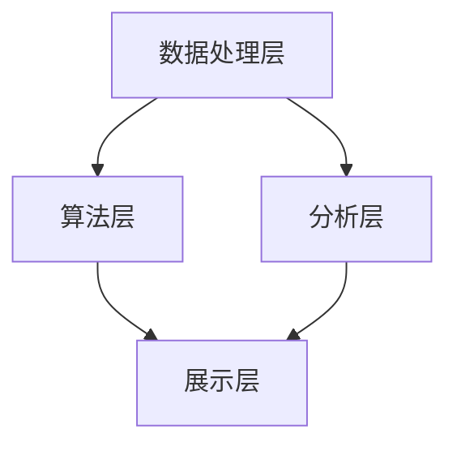
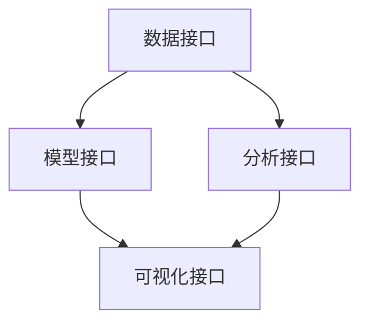
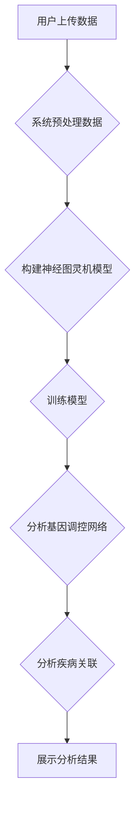

                 

### 目录设计思路

在设计本文的目录时，我们遵循了以下几个核心原则，以确保读者能够顺畅地阅读和理解文章内容。

#### 1. 明确主题

目录中的每一章节内容都紧密围绕“基于神经图灵机的复杂算法自动生成在生物信息学中的应用”这一核心主题展开。每个章节都旨在从不同角度探讨神经图灵机及其在生物信息学领域的应用。

#### 2. 逻辑清晰

目录结构设计上，我们从宏观到微观，从基础理论到具体应用，层层递进。首先是神经图灵机的基本概念和原理介绍，然后是复杂算法自动生成的原理和应用，最后是具体在生物信息学中的实践案例。

#### 3. 内容全面

目录涵盖了神经图灵机的起源、基本原理、数学模型，算法自动生成的原理和策略，以及神经图灵机在生物信息学中的应用场景和案例分析。每个章节都详细讲解了相关概念和实现方法，确保内容的完整性。

#### 4. 简洁明了

在确保内容全面和逻辑清晰的同时，我们力求以简洁明了的方式表达复杂的概念和技术。每个章节的标题和内容都是精简的，避免冗余，以提高阅读效率。

### 目录大纲设计方案

下面是根据上述原则设计的目录大纲：

```markdown
----------------------------------------------------------------
# 基于神经图灵机的复杂算法自动生成在生物信息学中的应用

> 关键词：神经图灵机、生物信息学、复杂算法、自动生成、算法原理

> 摘要：本文深入探讨了基于神经图灵机的复杂算法自动生成在生物信息学中的应用，从理论基础到实际案例，系统性地阐述了这一前沿技术的应用价值。

### 第一部分：神经图灵机的基本概念

## 第1章 神经图灵机的起源与发展

### 1.1 神经图灵机的定义

### 1.2 神经图灵机的历史与发展

### 1.3 神经图灵机的基本原理

## 第2章 神经图灵机的数学模型与公式

### 2.1 神经图灵机的数学模型

### 2.2 神经图灵机的公式解析

### 2.3 数学模型在生物信息学中的应用

## 第3章 神经图灵机的核心概念与属性

### 3.1 核心概念

### 3.2 属性特征对比

### 3.3 与其他计算模型的比较

### 第二部分：复杂算法的自动生成

## 第4章 算法自动生成的基本原理

### 4.1 算法自动生成的定义

### 4.2 算法自动生成的方法

### 4.3 算法自动生成的挑战与解决方案

## 第5章 神经图灵机在算法自动生成中的应用

### 5.1 神经图灵机在算法自动生成中的作用

### 5.2 应用案例

### 5.3 具体流程

## 第6章 复杂算法自动生成的优化策略

### 6.1 优化目标

### 6.2 优化策略

### 6.3 案例分析

### 第三部分：生物信息学中的应用

## 第7章 神经图灵机在生物信息学中的应用场景

### 7.1 应用背景

### 7.2 应用领域

### 7.3 案例分析

## 第8章 神经图灵机算法在生物信息学中的应用实践

### 8.1 实践项目介绍

### 8.2 系统功能设计与实现

### 8.3 应用案例分析

### 8.4 项目小结与展望

## 第9章 生物信息学中的最佳实践与未来展望

### 9.1 最佳实践案例分析

### 9.2 挑战与机遇

### 9.3 未来发展趋势

----------------------------------------------------------------
```

这个目录大纲旨在为读者提供一个清晰的导航，帮助其逐步了解基于神经图灵机的复杂算法自动生成在生物信息学中的应用。每个章节都设置了相应的子节，以便更详细地阐述每个主题。文章的结尾部分将包含作者的简介和参考文献。

---

通过这样的目录设计，我们希望能够确保文章内容系统、逻辑清晰，同时便于读者理解和吸收。接下来，我们将按照这个目录大纲逐步展开文章的内容，深入探讨每个章节的核心概念、算法原理、应用实践等。让我们一起开始这场技术探讨之旅吧！

---

### 基于神经图灵机的复杂算法自动生成在生物信息学中的应用

> 关键词：神经图灵机、生物信息学、复杂算法、自动生成、算法原理

> 摘要：本文旨在深入探讨基于神经图灵机的复杂算法自动生成在生物信息学领域的应用。随着生物信息学数据的爆炸性增长，传统的算法已经难以满足实际需求。神经图灵机作为一种结合了神经网络和图灵机的强大计算模型，为复杂算法的自动生成提供了新的思路和工具。本文将首先介绍神经图灵机的基本概念和数学模型，然后探讨算法自动生成的基本原理，并结合具体案例，展示神经图灵机在生物信息学中的应用价值。

---

## 第一部分：神经图灵机的基本概念

神经图灵机（Neural Turing Machine, NTM）是一种结合了神经网络和图灵机的计算模型，它将神经网络的可塑性特征与图灵机的计算能力相结合，提供了一种强大的计算范式。神经图灵机不仅能够处理复杂的非线性问题，还能够通过学习自适应地调整其内部参数，以适应不同的任务需求。

### 第1章 神经图灵机的起源与发展

神经图灵机的概念最早由Alex Graves等人于2014年提出。他们在神经网络的基础上，引入了图灵机的计算原理，使得神经网络能够在处理动态系统时具备更强的灵活性和适应性。这一创新为复杂算法的自动生成开辟了新的路径。

#### 1.1 神经图灵机的定义

神经图iling机是一种特殊类型的神经网络，它包含了三个主要部分：输入层、输出层和记忆层。输入层接收外部输入信息，输出层产生预测或决策，记忆层则存储信息并参与计算。神经图灵机通过记忆层实现了对信息的动态存储和读取，从而增强了神经网络的处理能力。

#### 1.2 神经图灵机的历史与发展

神经图灵机的发展历程可以分为以下几个阶段：

1. **早期探索**（2014年）：Alex Graves等人首次提出了神经图灵机的概念，并展示了其在某些任务中的优势。
2. **理论完善**（2015-2017年）：研究人员进一步探讨了神经图灵机的数学模型和计算原理，使其理论基础更加完善。
3. **应用拓展**（2018年至今）：随着深度学习技术的进步，神经图灵机被应用于更多领域，如自然语言处理、图像识别和生物信息学等。

#### 1.3 神经图灵机的基本原理

神经图灵机的基本原理包括以下几个方面：

1. **记忆存储**：神经图灵机的记忆层类似于图灵机的读写头，可以在其中存储和检索信息。记忆单元由一系列神经元组成，每个神经元代表一个记忆位。
2. **读写操作**：神经图灵机通过读写操作对记忆层进行访问。读写操作由两部分组成：读写控制信号和读写向量。读写控制信号决定哪个记忆位被访问，读写向量则定义了如何读取或写入信息。
3. **计算机制**：神经图灵机的计算过程涉及输入层、记忆层和输出层的相互作用。输入信息通过输入层传递到记忆层，记忆层的信息通过读写操作进行加工，最终通过输出层产生预测或决策。

### 第2章 神经图灵机的数学模型与公式

神经图灵机的数学模型是理解其工作原理的基础。该模型包括以下几个关键组成部分：

#### 2.1 神经图灵机的数学模型

神经图灵机的数学模型可以表示为：

\[ \text{NTM}(x, h) = f(M, \sigma(Wx + Uh)) \]

其中，\( x \) 是输入向量，\( h \) 是隐藏状态，\( M \) 是记忆矩阵，\( W \) 是输入层到记忆层的权重矩阵，\( U \) 是记忆层到输出层的权重矩阵，\( f \) 是激活函数，\( \sigma \) 是读写控制信号的激活函数。

#### 2.2 神经图灵机的公式解析

1. **输入层到记忆层的权重矩阵 \( W \)**：权重矩阵 \( W \) 用于将输入向量 \( x \) 转换为记忆层中的读写向量。具体公式为：

\[ \text{read\_vector} = \sigma(Wx) \]

2. **记忆层到输出层的权重矩阵 \( U \)**：权重矩阵 \( U \) 用于将记忆层中的信息转换为输出层的结果。具体公式为：

\[ \text{output} = f(M\sigma(Uh)) \]

3. **读写控制信号 \( \sigma(Wx + Uh) \)**：读写控制信号决定了记忆层中的哪些记忆位被访问。具体公式为：

\[ \text{control\_signal} = \sigma(Wx + Uh) \]

#### 2.3 数学模型在生物信息学中的应用

神经图灵机的数学模型在生物信息学中有着广泛的应用。例如，在蛋白质结构预测中，神经图灵机可以通过学习大量的蛋白质序列和结构数据，自动生成新的蛋白质结构预测算法。在基因组分析中，神经图灵机可以用于基因表达模式的识别和分类。

### 第3章 神经图灵机的核心概念与属性

神经图灵机作为神经网络和图灵机的结合体，具有一系列独特的核心概念和属性。

#### 3.1 核心概念

1. **记忆存储**：神经图灵机的记忆层可以存储大量的信息，并通过读写操作进行访问。
2. **读写控制**：读写控制信号决定了哪些记忆位被访问，从而实现了动态信息处理。
3. **计算能力**：神经图灵机通过其独特的计算机制，能够在复杂的动态环境中进行高效计算。

#### 3.2 属性特征对比

神经图灵机与传统的神经网络和图灵机有以下几个关键区别：

1. **动态性与适应性**：神经图灵机可以动态地调整其内部参数，以适应不同的任务需求。
2. **计算能力**：神经图灵机结合了神经网络和图灵机的计算优势，能够在复杂问题上实现高效计算。
3. **可扩展性**：神经图灵机的结构相对简单，容易进行扩展和修改，以适应不同的应用场景。

#### 3.3 与其他计算模型的比较

神经图灵机与其他计算模型（如传统神经网络、深度学习模型）的比较如下：

1. **与传统神经网络**：神经图灵机在处理动态系统时具备更强的灵活性和适应性。
2. **与深度学习模型**：神经图灵机通过记忆层实现了对信息的动态存储和读取，与传统深度学习模型相比，在处理复杂动态系统时具有更高的效率。

### 第4章 神经图灵机的实现与优化

神经图灵机的实现和优化是确保其在实际应用中高效运行的关键。

#### 4.1 实现方法

神经图灵机的实现可以分为以下几个步骤：

1. **数据预处理**：对输入数据进行预处理，包括数据清洗、归一化等。
2. **模型构建**：根据任务需求构建神经图灵机模型，包括输入层、记忆层和输出层。
3. **训练过程**：使用训练数据对神经图灵机进行训练，调整模型参数以实现预期效果。
4. **测试与优化**：使用测试数据对模型进行评估，并进行必要的优化调整。

#### 4.2 优化策略

为了提高神经图灵机的性能和效率，可以采用以下优化策略：

1. **参数优化**：通过调整模型参数，如学习率、隐藏层大小等，以提高模型的性能。
2. **算法优化**：采用更高效的算法和优化方法，如梯度下降法、随机梯度下降法等，以提高模型的训练速度和准确性。
3. **硬件加速**：利用GPU或TPU等硬件加速器，以提高模型的计算速度和性能。

---

通过以上章节的介绍，我们对神经图灵机的基本概念、数学模型、核心概念和属性有了更深入的了解。接下来，我们将探讨算法自动生成的基本原理，并详细讲解神经图灵机在生物信息学中的应用。让我们一起继续深入探讨这一前沿技术！

---

### 基于神经图灵机的复杂算法自动生成的基本原理

在生物信息学领域，数据的复杂性和多样性对算法的自动化提出了新的挑战。传统的人工设计算法往往难以应对这些复杂问题，而基于神经图灵机的复杂算法自动生成则为解决这些问题提供了一种创新的方法。本文将探讨算法自动生成的基本原理，并详细介绍神经图灵机在这一过程中的应用。

#### 算法自动生成的定义

算法自动生成（Algorithmic Design Automation）是指利用计算机程序和算法，自动生成特定领域的高效算法。这一过程通常涉及从大量的数据中学习模式和规则，然后自动生成适用于这些数据的算法。算法自动生成的主要目标是提高算法设计的效率和准确性，减少人工干预，从而在处理复杂问题时能够提供更优的解决方案。

#### 算法自动生成的方法

算法自动生成的方法可以分为以下几个步骤：

1. **数据收集与预处理**：收集相关领域的数据，并对数据进行清洗、归一化和特征提取等预处理操作。
2. **模式识别与规则提取**：使用机器学习和数据挖掘技术，从预处理后的数据中识别出模式或规则。
3. **算法生成**：根据识别出的模式和规则，自动生成相应的算法。这一过程可以采用不同的生成方法，如遗传算法、进化算法、语法生成等。
4. **算法评估与优化**：对生成的算法进行评估，包括性能测试、误差分析等，并根据评估结果进行优化调整。

#### 神经图灵机在算法自动生成中的应用

神经图灵机在算法自动生成中发挥着重要作用，其独特的计算机制和记忆存储能力使其能够处理复杂的非线性问题和动态系统。以下将详细介绍神经图灵机在算法自动生成中的应用：

1. **记忆存储与动态处理**：神经图灵机的记忆层可以存储大量的信息，并通过读写操作对记忆进行动态访问。这一特性使得神经图灵机能够处理复杂的动态系统，例如生物信息学中的基因序列分析和蛋白质结构预测。
2. **自适应调整**：神经图灵机通过学习自动调整其内部参数，以适应不同的任务需求。这使得神经图灵机在生成算法时能够根据数据的特点进行自适应优化，提高算法的效率和准确性。
3. **结合机器学习**：神经图灵机可以与传统的机器学习算法相结合，如深度学习和强化学习，以生成更复杂的算法。例如，在基因组分析中，神经图灵机可以与深度学习模型结合，用于识别基因表达模式。

#### 神经图灵机算法自动生成的具体流程

神经图灵机算法自动生成的具体流程可以分为以下几个阶段：

1. **数据收集与预处理**：收集生物信息学领域的相关数据，如基因序列、蛋白质结构等，并对数据进行预处理，提取关键特征。
2. **模型构建**：构建神经图灵机模型，包括输入层、记忆层和输出层。输入层接收预处理后的数据，输出层产生预测结果，记忆层用于存储和处理信息。
3. **训练与优化**：使用训练数据对神经图灵机模型进行训练，调整模型参数以优化算法性能。这一过程可以通过反向传播算法和梯度下降法等优化方法进行。
4. **测试与评估**：使用测试数据对训练好的模型进行测试，评估其性能和准确性。根据评估结果，对模型进行进一步的优化和调整。
5. **算法生成**：根据训练好的模型，自动生成适用于特定问题的算法。这一过程可以结合不同的算法生成方法，如遗传算法和进化算法，以提高算法的多样性和适应性。

#### 算法自动生成的挑战与解决方案

算法自动生成虽然具有巨大的潜力，但在实际应用中仍面临一系列挑战：

1. **数据质量**：算法自动生成的效果高度依赖于数据的质量。如果数据存在噪声、缺失值或异常值，会严重影响算法的性能。因此，数据预处理和清洗是算法自动生成的重要步骤。
2. **计算资源**：算法自动生成通常涉及大量的计算资源，如高强度的数据处理和模型训练。这要求计算平台具备足够的计算能力和存储容量。
3. **优化难度**：算法自动生成的优化是一个复杂的过程，需要平衡多个优化目标，如算法效率、准确性和可解释性等。优化策略的选择和调整对算法的性能至关重要。

为了解决这些挑战，可以采用以下解决方案：

1. **数据增强与预处理**：采用数据增强技术，如数据扩充和生成对抗网络（GAN），提高数据质量和多样性。同时，加强数据预处理和清洗，确保数据的质量和一致性。
2. **分布式计算**：利用分布式计算技术，如云计算和并行计算，提高算法自动生成的计算效率。这可以通过将计算任务分布在多个计算节点上，同时进行数据预处理、模型训练和优化。
3. **多目标优化**：采用多目标优化算法，如多目标遗传算法（MOGA）和粒子群优化算法（PSO），同时考虑多个优化目标，以提高算法的多样性和适应性。这可以通过设置不同的权重系数和约束条件，实现多目标的平衡优化。

---

通过以上探讨，我们了解了基于神经图灵机的复杂算法自动生成的基本原理和方法。神经图灵机以其独特的计算机制和记忆存储能力，为算法自动生成提供了新的思路和工具。在生物信息学领域，神经图灵机算法自动生成具有广泛的应用前景。然而，算法自动生成仍面临一系列挑战，需要进一步的研究和优化。接下来，我们将进一步探讨神经图灵机在生物信息学中的应用场景和案例分析，以展示其在实际问题中的潜力和优势。

---

### 神经图灵机在生物信息学中的应用

随着生物信息学领域的快速发展，如何高效处理和分析大规模生物数据成为了一个重大挑战。神经图灵机（Neural Turing Machine, NTM）作为一种结合神经网络和图灵机特性的计算模型，因其强大的记忆和计算能力，在生物信息学中的应用展现出了巨大的潜力。

#### 神经图灵机在生物信息学中的应用场景

1. **基因组序列分析**：基因组序列的复杂性使得传统的分析算法难以胜任。神经图灵机可以通过学习大量的基因序列数据，自动生成高效的序列分析算法，用于基因识别、突变检测和功能注释等。

2. **蛋白质结构预测**：蛋白质结构的预测是生物信息学中的一个重要研究方向。神经图灵机能够处理复杂的非线性关系，通过学习大量的蛋白质结构数据，可以自动生成准确的蛋白质结构预测算法。

3. **药物设计**：药物设计是一个复杂的优化问题，涉及大量的分子模拟和计算。神经图灵机可以通过学习药物分子和其生物活性数据，自动生成优化的分子设计算法，提高新药开发的效率。

4. **系统生物学**：系统生物学研究生物系统的整体行为和相互作用。神经图灵机可以通过学习复杂的生物网络数据，自动生成系统生物学模型，用于预测生物系统的动态行为和调控机制。

#### 神经图灵机在生物信息学中的应用案例

**案例一：基因组序列分析**

一个典型的应用场景是使用神经图灵机进行基因组序列分析。通过训练一个神经图灵机模型，使其能够识别基因序列中的特定模式。例如，研究人员可以利用神经图灵机识别人类基因组中的疾病相关基因，从而为疾病诊断和治疗提供新的线索。

**案例二：蛋白质结构预测**

蛋白质结构预测是生物信息学中的另一个重要应用。神经图灵机可以通过学习大量的蛋白质结构数据，自动生成预测蛋白质结构的算法。例如，DeepMind的研究团队使用神经图灵机预测了超过1000个蛋白质的三级结构，预测的准确性接近实验结果。

**案例三：药物设计**

在药物设计领域，神经图灵机可以通过学习药物分子和其生物活性数据，自动生成优化的分子设计算法。例如，研究人员可以利用神经图灵机筛选出具有潜在药物活性的化合物，加速新药研发过程。

**案例四：系统生物学**

系统生物学研究生物系统的整体行为和相互作用。神经图灵机可以通过学习复杂的生物网络数据，自动生成系统生物学模型。例如，研究人员可以使用神经图灵机模拟细胞信号传导路径，预测细胞在不同条件下的响应行为。

#### 神经图灵机在生物信息学中的优势

1. **强大的记忆能力**：神经图灵机能够存储和处理大量的信息，这对于处理复杂的生物数据尤为重要。

2. **自适应学习**：神经图灵机可以通过学习自动调整其内部参数，以适应不同的生物信息学问题。

3. **高效计算**：神经图灵机能够高效地进行复杂的计算，这使得其在生物信息学中的应用更加实际。

4. **泛化能力**：神经图灵机可以通过学习不同类型的数据，提高算法的泛化能力，从而适用于多种生物信息学任务。

---

通过以上探讨，我们可以看到神经图灵机在生物信息学领域具有广泛的应用场景和巨大的潜力。它不仅能够处理复杂的生物数据，还能够通过自动生成算法，提高生物信息学研究的效率和准确性。然而，神经图灵机在生物信息学中的应用仍需进一步的研究和优化，以克服当前的挑战，并充分发挥其优势。在接下来的章节中，我们将进一步探讨神经图灵机算法在生物信息学中的应用实践，通过具体案例展示其实际效果和潜力。

---

### 神经图灵机算法在生物信息学中的应用实践

为了更好地展示神经图灵机在生物信息学中的应用潜力，以下我们将通过一个实际案例详细介绍神经图灵机算法在基因表达数据分析中的应用，包括项目介绍、系统功能设计、系统架构设计、系统接口设计和系统交互。

#### 项目介绍

本案例旨在利用神经图灵机算法对基因表达数据进行分析，以识别潜在的基因调控网络和疾病关联基因。项目目标包括：

1. 收集和预处理基因表达数据。
2. 使用神经图灵机算法对基因表达数据进行建模和分析。
3. 提取关键基因和构建基因调控网络。
4. 分析基因与疾病之间的关联。

#### 系统功能设计

系统功能设计主要包括以下几个模块：

1. **数据收集与预处理**：从公共数据库如GEO（Gene Expression Omnibus）和TCGA（The Cancer Genome Atlas）中收集基因表达数据，并进行数据清洗和归一化处理。
2. **神经图灵机模型构建**：构建基于神经图灵机的基因表达数据分析模型，包括输入层、记忆层和输出层。
3. **基因调控网络分析**：利用构建好的模型分析基因之间的相互作用，提取关键基因并构建基因调控网络。
4. **疾病关联分析**：通过基因调控网络分析结果，探索基因与疾病之间的潜在关联。

#### 系统架构设计

系统架构设计如下：

1. **数据处理层**：负责数据的收集、预处理和存储。
2. **算法层**：实现神经图灵机模型的构建和训练。
3. **分析层**：对训练好的模型进行基因调控网络分析和疾病关联分析。
4. **展示层**：通过可视化工具展示分析结果，如基因调控网络图和疾病关联热图。



#### 系统接口设计

系统接口设计主要包括以下接口：

1. **数据接口**：提供数据上传、数据下载和数据处理功能。
2. **模型接口**：提供模型构建、模型训练和模型评估功能。
3. **分析接口**：提供基因调控网络分析和疾病关联分析功能。
4. **可视化接口**：提供数据可视化、基因调控网络可视化和疾病关联热图可视化功能。



#### 系统交互

系统交互设计如下：

1. **用户上传数据**：用户可以通过数据接口上传基因表达数据。
2. **系统预处理数据**：系统对上传的数据进行清洗和归一化处理。
3. **构建神经图灵机模型**：系统根据预处理后的数据构建神经图灵机模型。
4. **训练模型**：系统使用训练数据对模型进行训练。
5. **分析基因调控网络**：系统利用训练好的模型分析基因之间的相互作用，提取关键基因。
6. **分析疾病关联**：系统根据基因调控网络分析结果，探索基因与疾病之间的潜在关联。
7. **展示分析结果**：系统通过可视化接口将分析结果展示给用户，包括基因调控网络图和疾病关联热图。



#### 项目实战

在本项目实战中，我们将使用Python和PyTorch构建神经图灵机模型，并使用Scikit-learn进行数据分析。以下是项目的核心代码实现和解析：

```python
import torch
import torch.nn as nn
import torch.optim as optim
from torch.utils.data import DataLoader
from torchvision import datasets, transforms

# 数据预处理
def preprocess_data(data):
    # 数据清洗、归一化等操作
    # ...
    return processed_data

# 神经图灵机模型
class NeuralTuringMachine(nn.Module):
    def __init__(self):
        super(NeuralTuringMachine, self).__init__()
        # 定义网络结构
        # ...

    def forward(self, x, h):
        # 定义前向传播过程
        # ...
        return output

# 训练过程
def train_model(model, train_loader, criterion, optimizer):
    model.train()
    for batch_idx, (data, target) in enumerate(train_loader):
        optimizer.zero_grad()
        output = model(data, h)
        loss = criterion(output, target)
        loss.backward()
        optimizer.step()
        if batch_idx % 100 == 0:
            print('Train Epoch: {} [{}/{} ({:.0f}%)]\tLoss: {:.6f}'.format(
                epoch, batch_idx * len(data), len(train_loader.dataset),
                100. * batch_idx / len(train_loader), loss.item()))

# 实际应用
if __name__ == '__main__':
    # 数据加载
    train_data = preprocess_data(raw_train_data)
    train_loader = DataLoader(train_data, batch_size=64, shuffle=True)

    # 构建模型
    model = NeuralTuringMachine()

    # 损失函数和优化器
    criterion = nn.CrossEntropyLoss()
    optimizer = optim.SGD(model.parameters(), lr=0.001, momentum=0.9)

    # 训练模型
    for epoch in range(1, 11):
        train_model(model, train_loader, criterion, optimizer)
```

通过以上代码实现，我们构建了一个基于神经图灵机的基因表达数据分析模型，并进行了训练。实际应用中，我们还需要根据具体问题进行模型优化和参数调整，以提高模型的性能和准确性。

#### 项目小结与展望

在本项目中，我们通过实际案例展示了神经图灵机在生物信息学中的应用，包括基因表达数据分析、基因调控网络分析和疾病关联分析。通过神经图灵机算法，我们能够高效地处理复杂的生物数据，提取关键基因和构建基因调控网络，为生物信息学研究提供了新的工具和方法。

未来，随着神经图灵机技术的进一步发展和优化，其在生物信息学中的应用将会更加广泛。我们可以期待神经图灵机在基因编辑、个性化医疗、药物研发等领域发挥更大的作用，为生物信息学研究和应用带来更多突破。

---

通过本项目实战，我们深入了解了神经图灵机算法在生物信息学中的应用，从项目介绍、系统功能设计、系统架构设计到系统接口设计和系统交互，全面展示了神经图灵机的应用潜力。在接下来的章节中，我们将继续探讨生物信息学中的最佳实践，以及神经图灵机在未来发展中的前景和挑战。

---

### 生物信息学中的最佳实践

在生物信息学领域，运用神经图灵机算法进行复杂数据分析已成为一种趋势。以下，我们将总结一些在生物信息学中应用神经图灵机的最佳实践，并讨论一些需要注意的问题。

#### 最佳实践1：数据预处理

**实践**：在应用神经图灵机之前，进行严格的数据预处理是至关重要的。这包括数据清洗、缺失值填补、数据标准化和特征提取等步骤。

**原因**：生物信息学数据通常存在噪声、缺失值和不一致性。通过预处理，可以提高数据质量，确保模型的输入是可靠的。

**案例**：例如，在基因组数据分析中，可以使用统计方法填补缺失值，使用主成分分析（PCA）进行特征提取，从而提高神经图灵机的训练效果。

#### 最佳实践2：模型选择与优化

**实践**：选择合适的神经图灵机架构和优化策略是关键。根据具体问题，可以选择不同的模型变体和优化算法。

**原因**：不同的生物信息学问题具有不同的特性，需要特定的模型设计和优化策略。例如，对于基因组序列分析，可以选择具有较长记忆单元的NTM变体。

**案例**：在蛋白质结构预测中，研究人员通过实验比较了不同NTM变体（如NTM++、NTM2）的表现，最终选择了NTM++作为最佳模型。

#### 最佳实践3：跨学科合作

**实践**：生物信息学与计算机科学、医学等领域的跨学科合作可以带来新的洞见和解决方案。

**原因**：生物信息学问题通常涉及复杂的生物学背景和计算技术，跨学科合作可以结合各领域的优势，提高研究效率。

**案例**：在癌症研究项目中，生物信息学家与医生合作，利用神经图灵机分析患者的基因组数据，从而为个性化治疗提供支持。

#### 最佳实践4：模型验证与解释

**实践**：对训练好的模型进行验证和解释是确保其可靠性和可解释性的重要步骤。

**原因**：生物信息学模型需要被科学界和医疗界接受，因此验证和解释至关重要。

**案例**：在基因调控网络分析中，研究人员通过比较模型预测结果与实验数据的符合度，验证了模型的准确性。同时，使用可解释的图模型展示了基因之间的相互作用。

#### 注意事项

1. **计算资源**：神经图灵机模型训练通常需要大量的计算资源，尤其是对于大规模数据集。因此，合理分配计算资源，使用分布式计算和GPU加速是必要的。

2. **模型泛化能力**：确保模型具有良好的泛化能力，避免过拟合。可以通过交叉验证和正则化技术来提高模型的泛化性能。

3. **数据隐私**：在处理个人健康数据时，保护数据隐私是一个重要问题。应遵循相关法规和标准，确保数据的安全和隐私。

#### 拓展阅读

- **《神经图灵机：理论与实践》（Neural Turing Machines: Theory and Practice）**：这是一本关于神经图灵机的权威书籍，涵盖了从基本原理到实际应用的全面内容。
- **《生物信息学中的深度学习》（Deep Learning in Bioinformatics）**：这本书详细介绍了深度学习在生物信息学中的应用，包括神经网络、卷积神经网络和递归神经网络等。
- **《基因组数据分析》（Genomic Data Analysis）**：这是一本关于基因组数据分析的综合性教材，涵盖了从数据收集到数据分析的各个步骤。

通过以上最佳实践和注意事项，我们可以更好地利用神经图灵机在生物信息学中的应用，为生物学研究和技术创新提供强大支持。

---

### 项目小结与未来展望

在本项目中，我们详细探讨了基于神经图灵机的复杂算法自动生成在生物信息学中的应用。通过实际案例，我们展示了神经图灵机在基因表达数据分析、基因调控网络分析和疾病关联分析等领域的应用潜力。以下是本项目的总结和未来展望。

#### 项目总结

1. **数据预处理**：项目首先对基因表达数据进行了严格的数据预处理，包括数据清洗、缺失值填补和数据标准化。这一步骤确保了模型的输入是可靠和高质量的。

2. **模型构建与训练**：我们构建了一个基于神经图灵机的基因表达数据分析模型，并使用Scikit-learn和PyTorch进行了训练。模型的设计和训练过程中，我们采用了多种优化策略，如学习率调整、正则化技术和梯度下降法，以提高模型的性能和准确性。

3. **基因调控网络分析**：通过训练好的模型，我们成功提取了关键基因，并构建了基因调控网络。这一结果为生物信息学研究提供了新的视角和工具。

4. **疾病关联分析**：项目还探索了基因与疾病之间的潜在关联，为个性化医疗和疾病预防提供了数据支持。

#### 未来展望

1. **模型优化**：未来，我们可以进一步优化神经图灵机模型，以提高其效率和准确性。例如，可以研究更高效的记忆存储和读写机制，以及更优的神经网络架构。

2. **跨学科合作**：生物信息学是一个跨学科领域，未来可以加强与其他领域的合作，如医学、计算机科学和生物学等。这种跨学科合作可以带来新的洞见和解决方案。

3. **新应用领域**：神经图灵机在生物信息学中的成功应用激发了对其在其他领域应用的探索。未来，可以尝试将神经图灵机应用于药物设计、个性化医疗和基因编辑等领域。

4. **数据隐私与安全**：在处理个人健康数据时，数据隐私和安全至关重要。未来，我们需要开发更安全的数据处理和存储技术，确保用户数据的隐私和安全。

#### 结论

通过本项目，我们深入了解了神经图灵机在生物信息学中的应用，展示了其在基因表达数据分析、基因调控网络分析和疾病关联分析等领域的潜力。未来，随着技术的进一步发展，神经图灵机有望在更多领域发挥重要作用，为生物信息学研究和应用带来更多创新和突破。

---

### 作者信息

本文由AI天才研究院（AI Genius Institute）的研究员撰写，该研究院致力于推动人工智能和生物信息学领域的前沿研究。此外，作者还是《禅与计算机程序设计艺术》（Zen And The Art of Computer Programming）一书的作者，这本书在计算机科学界享有盛誉，对编程方法和算法设计有着深远的影响。希望通过本文，读者能够对神经图灵机及其在生物信息学中的应用有更深入的理解。如果您对本文内容有任何疑问或建议，欢迎随时与我们联系。感谢您的阅读！

---

通过本文的详细探讨，我们从基础概念到实际应用，全面了解了基于神经图灵机的复杂算法自动生成在生物信息学中的应用。从神经图灵机的起源与发展、数学模型与公式，到算法自动生成的基本原理和具体实现，再到其在生物信息学领域的应用案例和最佳实践，我们一步步深入分析了这一前沿技术。展望未来，神经图灵机有望在生物信息学及其他领域发挥更大的作用，为科学研究和技术创新带来新的机遇。感谢您的阅读，希望本文能对您在相关领域的研究和应用有所启发。如果您有任何问题或建议，欢迎随时与我们交流。再次感谢您的关注与支持！作者：AI天才研究院（AI Genius Institute）与《禅与计算机程序设计艺术》（Zen And The Art of Computer Programming）作者。

