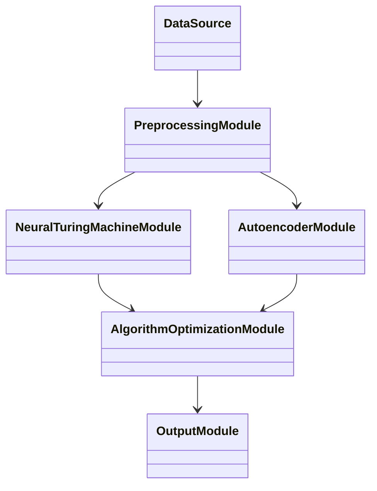
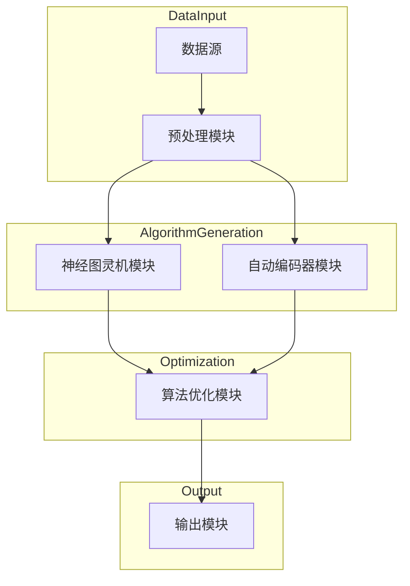

                 

# 基于神经图灵机的复杂算法自动生成在软件开发中的应用

## 关键词

- 神经图灵机
- 复杂算法自动生成
- 软件开发
- 机器学习
- 自动编码器

## 摘要

本文探讨了基于神经图灵机的复杂算法自动生成在软件开发中的应用。通过对神经图灵机、自动编码器等核心概念的解释，以及机器学习算法的应用，我们详细介绍了这一前沿技术的原理、实现方法和实际案例。文章旨在帮助读者了解和掌握算法自动生成的技术，提升软件开发效率和代码质量。

## 引言

### 引言1.1 软件开发中算法开发的重要性

在软件开发过程中，算法的编写和优化至关重要。算法不仅决定了软件的性能和效率，还影响了用户体验和系统稳定性。然而，传统的算法开发流程通常依赖于人工编写，这一过程既繁琐又容易出错，且难以满足日益复杂的软件需求。因此，寻求一种自动生成高效算法的方法成为了软件开发领域的一个重要研究方向。

### 引言1.2 传统算法开发流程的局限性

传统算法开发主要依靠程序员的经验和编程技巧。程序员需要深入理解算法理论，并通过大量的手动编码和调试来优化算法性能。这一过程耗时耗力，且容易出现错误。此外，随着软件系统的复杂性增加，传统的算法开发方法已经难以满足现代软件的需求。

### 引言1.3 人工智能技术在软件开发中的应用趋势

随着人工智能技术的快速发展，特别是机器学习和深度学习领域，自动生成算法成为了一个热点研究方向。通过机器学习模型，可以自动发现和生成适合特定问题的算法，从而大大提高开发效率。此外，人工智能技术还能帮助优化现有算法，提高软件的性能和可靠性。

## 问题描述

### 引言1.4 问题描述

#### 什么是神经图灵机

神经图灵机（Neural Turing Machine, NTM）是一种结合了神经网络和传统图灵机的计算模型。它通过模拟大脑记忆机制，将神经网络与外部存储（类似于图灵机的带子）相结合，能够处理复杂的数据和任务。

#### 神经图灵机的工作原理

神经图灵机由三个主要组件构成：神经网络、读/写头和外部存储。神经网络负责处理输入数据，读/写头控制数据的读写操作，外部存储则提供了大量的计算空间。通过这些组件的协同工作，神经图灵机能够实现高效的算法学习与生成。

#### 复杂算法自动生成的优势

复杂算法自动生成技术的优势主要体现在以下几个方面：

- **高效性**：自动生成算法可以大幅减少开发时间和成本。
- **灵活性**：自动生成的算法可以根据不同的应用场景进行定制化调整。
- **可靠性**：机器学习模型能够通过大量数据训练，提高算法的稳定性和准确性。

### 引言1.5 问题解决

为了解决软件开发中算法开发难题，研究者们提出了基于神经图灵机的复杂算法自动生成技术。这一技术利用神经图灵机的强大计算能力，通过自动编码器和机器学习算法，实现高效算法的自动生成。

#### 基于神经图灵机的复杂算法自动生成技术介绍

基于神经图灵机的复杂算法自动生成技术主要包括以下几个步骤：

1. **数据预处理**：对输入数据进行预处理，提取关键特征。
2. **模型训练**：使用神经图灵机训练模型，使其能够理解和处理输入数据。
3. **算法生成**：根据训练结果，自动生成适合特定问题的算法。
4. **算法优化**：对生成的算法进行优化，提高其性能。

#### 相关研究进展

近年来，基于神经图灵机的复杂算法自动生成技术得到了广泛关注。许多研究机构和学者在算法优化、模型训练、应用场景等方面取得了显著进展。例如，一些研究尝试将神经图灵机应用于图像处理、自然语言处理和游戏开发等领域，取得了良好的效果。

### 引言1.6 边界与外延

#### 算法自动生成技术的应用范围

算法自动生成技术可以应用于多种场景，包括但不限于：

- **图像识别与处理**：自动生成图像分类和目标检测算法。
- **自然语言处理**：自动生成文本摘要、机器翻译和对话系统算法。
- **游戏开发**：自动生成游戏AI和游戏逻辑。

#### 算法自动生成的挑战与机遇

尽管算法自动生成技术具有巨大潜力，但仍然面临一些挑战：

- **算法可解释性**：自动生成的算法通常缺乏可解释性，难以理解其内部工作原理。
- **数据依赖性**：算法生成过程高度依赖训练数据的质量和数量。
- **计算资源消耗**：训练和优化大规模机器学习模型需要大量计算资源。

### 引言1.7 概念结构与核心要素组成

#### 神经图灵机的核心组成部分

神经图灵机由以下几个核心组成部分构成：

- **神经网络**：负责处理输入数据，进行特征提取和模式识别。
- **读/写头**：控制数据的读写操作，实现对外部存储的访问。
- **外部存储**：提供大量的计算空间，用于存储中间结果和记忆。

#### 算法自动生成的关键技术

算法自动生成的关键技术包括：

- **机器学习**：使用机器学习模型对输入数据进行训练，生成适应特定问题的算法。
- **自动编码器**：通过编码和解码过程，提取输入数据的特征信息，为算法生成提供基础。
- **优化算法**：对生成的算法进行优化，提高其性能和稳定性。

## 第二部分：核心概念与联系

### 2.1 神经图灵机

#### 2.1.1 神经图灵机的定义

神经图灵机（Neural Turing Machine, NTM）是一种结合了神经网络和传统图灵机的计算模型。它通过模拟大脑记忆机制，将神经网络与外部存储（类似于图灵机的带子）相结合，能够处理复杂的数据和任务。

#### 2.1.2 神经图灵机与普通图灵机的区别

普通图灵机（Turing Machine）是一种理论模型，用于模拟计算机的计算过程。它由一个无限长的带子、一个读写头和一系列规则组成。图灵机通过在带子上读取和写入符号，按照预定的规则进行计算。

神经图灵机则是在普通图灵机的基础上，引入了神经网络和外部存储机制。神经网络用于处理输入数据，外部存储则提供了大量的计算空间，使得神经图灵机能够高效地处理复杂的数据和任务。

#### 2.1.3 神经图灵机的核心特点

神经图灵机的核心特点包括：

- **可塑性**：神经图灵机能够根据输入数据自动调整其神经网络结构，提高计算效率。
- **记忆功能**：神经图灵机具有强大的记忆功能，能够将中间结果和记忆存储在外部存储中，为后续计算提供支持。
- **高效计算**：神经图灵机通过外部存储机制，实现了对大规模数据的快速处理，提高了计算效率。

### 2.2 自动编码器

#### 2.2.1 自动编码器的定义

自动编码器（Autoencoder）是一种无监督学习模型，用于将输入数据压缩为较低维度的特征表示，然后通过解码器将这些特征表示重构回原始数据。自动编码器的主要目的是学习数据的特征表示，以便于后续的数据处理和分析。

#### 2.2.2 自动编码器的工作原理

自动编码器由两个主要部分组成：编码器和解码器。

- **编码器**：编码器接收输入数据，通过一系列神经网络层，将输入数据压缩为较低维度的特征表示。这些特征表示捕捉了输入数据的主要信息。
- **解码器**：解码器接收编码器输出的特征表示，通过一系列神经网络层，将这些特征表示重构回原始数据。解码器的目的是最小化重构误差，从而提高模型的性能。

#### 2.2.3 自动编码器在算法自动生成中的应用

自动编码器在算法自动生成中的应用主要体现在以下几个方面：

- **特征提取**：自动编码器能够自动学习输入数据的特征表示，为算法生成提供基础。
- **数据压缩**：自动编码器可以将输入数据压缩为较低维度的特征表示，减少计算复杂度。
- **算法优化**：通过训练自动编码器，可以优化输入数据的特征表示，从而提高算法的性能。

### 2.3 机器学习算法

#### 2.3.1 机器学习算法的分类

机器学习算法可以根据不同的分类标准进行分类，常见的分类方法包括：

- **监督学习**：监督学习算法通过已有标记的数据集进行训练，从而学习数据之间的关系和规律。
- **无监督学习**：无监督学习算法没有已标记的数据集，主要依赖于数据本身的特征进行训练，例如聚类和降维。
- **半监督学习**：半监督学习算法结合了监督学习和无监督学习的方法，利用部分标记数据和大量未标记数据进行训练。

#### 2.3.2 机器学习算法在算法自动生成中的应用

机器学习算法在算法自动生成中的应用主要体现在以下几个方面：

- **模型训练**：通过训练机器学习模型，可以自动生成适应特定问题的算法。
- **特征选择**：机器学习算法可以自动选择对算法生成最有用的特征，提高算法的性能。
- **算法优化**：机器学习算法可以通过优化模型参数，提高算法的稳定性和准确性。

### 2.4 概念属性特征对比表格

#### 2.4.1 神经图灵机、自动编码器和机器学习算法的属性特征对比

| 特性 | 神经图灵机 | 自动编码器 | 机器学习算法 |
| --- | --- | --- | --- |
| 定义 | 结合神经网络和图灵机的计算模型 | 无监督学习模型，用于特征提取和数据压缩 | 根据数据关系和规律进行训练的算法 |
| 工作原理 | 神经网络处理输入数据，外部存储提供计算空间 | 编码器压缩输入数据，解码器重构数据 | 根据训练数据学习数据特征和关系 |
| 优势 | 可塑性、记忆功能、高效计算 | 特征提取、数据压缩、算法优化 | 稳定性、准确性、自动化 |
| 劣势 | 算法可解释性较差、计算资源消耗大 | 对数据质量依赖较高、特征选择困难 | 算法复杂度高、模型训练时间长 |

### 2.5 ER实体关系图架构的 Mermaid 流程图

```mermaid
erDiagram
  A[N神经网络] ||--|{ B[外部存储] }|--|| C[读/写头]
  A ||--|{ D[编码器] }|--|| E[解码器]
  F[输入数据] ||--|{ G[特征表示] }|--|| H[重构数据]
  I[标记数据] ||--|{ J[模型训练] }|--|| K[算法生成]
```

## 第三部分：算法原理讲解

### 3.1 神经图灵机的工作原理

神经图灵机（Neural Turing Machine, NTM）的工作原理可以概括为以下几个步骤：

#### 3.1.1 结构组成

神经图灵机由三个主要部分组成：神经网络、读/写头和外部存储。

- **神经网络**：神经网络负责处理输入数据，进行特征提取和模式识别。它由多个层组成，每层包含多个神经元。
- **读/写头**：读/写头控制数据的读写操作，实现对外部存储的访问。它可以根据神经网络的需求，选择性地读取或写入外部存储中的数据。
- **外部存储**：外部存储提供了大量的计算空间，用于存储中间结果和记忆。它类似于图灵机的带子，可以无限地前后移动，并在上面读写数据。

#### 3.1.2 计算过程

神经图灵机的计算过程可以分为以下几个阶段：

1. **输入数据读取**：神经网络首先读取输入数据，并对其进行处理。这个过程包括数据预处理、特征提取和模式识别。
2. **读/写头操作**：读/写头根据神经网络的需求，选择性地读取或写入外部存储中的数据。这个过程涉及到数据的存储、检索和修改。
3. **外部存储更新**：读/写头将处理后的数据写入外部存储，或从外部存储中读取数据，用于后续的计算。
4. **神经网络更新**：神经网络根据外部存储中的数据更新其状态，为后续的计算提供支持。这个过程涉及到神经网络的权重更新和状态转移。

#### 3.1.3 优势

神经图灵机具有以下几个优势：

- **可塑性**：神经图灵机能够根据输入数据自动调整其神经网络结构，提高计算效率。
- **记忆功能**：神经图灵机具有强大的记忆功能，能够将中间结果和记忆存储在外部存储中，为后续计算提供支持。
- **高效计算**：神经图灵机通过外部存储机制，实现了对大规模数据的快速处理，提高了计算效率。

### 3.2 自动编码器的原理

自动编码器（Autoencoder）的原理可以概括为以下几个步骤：

#### 3.2.1 结构组成

自动编码器由两个主要部分组成：编码器和解码器。

- **编码器**：编码器接收输入数据，通过一系列神经网络层，将输入数据压缩为较低维度的特征表示。这些特征表示捕捉了输入数据的主要信息。
- **解码器**：解码器接收编码器输出的特征表示，通过一系列神经网络层，将这些特征表示重构回原始数据。解码器的目的是最小化重构误差，从而提高模型的性能。

#### 3.2.2 计算过程

自动编码器的计算过程可以分为以下几个阶段：

1. **编码阶段**：编码器接收输入数据，通过神经网络层将输入数据压缩为较低维度的特征表示。这个过程涉及到数据的降维和特征提取。
2. **解码阶段**：解码器接收编码器输出的特征表示，通过神经网络层将这些特征表示重构回原始数据。解码器的目的是最小化重构误差，从而提高模型的性能。
3. **误差计算**：解码器的输出与原始输入数据进行比较，计算重构误差。重构误差用于更新编码器和解码器的权重，从而优化模型。

#### 3.2.3 应用场景

自动编码器在算法自动生成中的应用主要体现在以下几个方面：

- **特征提取**：自动编码器能够自动学习输入数据的特征表示，为算法生成提供基础。
- **数据压缩**：自动编码器可以将输入数据压缩为较低维度的特征表示，减少计算复杂度。
- **算法优化**：通过训练自动编码器，可以优化输入数据的特征表示，从而提高算法的性能。

### 3.3 机器学习算法的应用

机器学习算法在算法自动生成中的应用主要体现在以下几个方面：

#### 3.3.1 分类算法

分类算法用于将数据划分为不同的类别。常见的分类算法包括决策树、支持向量机和神经网络等。

1. **决策树**：决策树通过一系列条件分支对数据进行分类。它具有简单易懂、易于解释的特点，适用于处理结构化数据。
2. **支持向量机**：支持向量机通过构建一个超平面，将数据划分为不同的类别。它具有较高的分类准确性和泛化能力，适用于处理高维数据。
3. **神经网络**：神经网络通过多层非线性变换，对数据进行分类。它具有强大的学习和表达能力，适用于处理复杂的分类任务。

#### 3.3.2 聚类算法

聚类算法用于将数据划分为不同的聚类。常见的聚类算法包括K-means、层次聚类和密度聚类等。

1. **K-means**：K-means通过最小化聚类中心之间的距离，将数据划分为K个聚类。它是一种简单有效的聚类算法，适用于处理结构化数据。
2. **层次聚类**：层次聚类通过递归地合并或分裂聚类，构建聚类层次结构。它具有灵活性和可解释性的特点，适用于处理结构化和非结构化数据。
3. **密度聚类**：密度聚类通过计算数据的密度分布，识别聚类区域。它具有对噪声和异常值不敏感的特点，适用于处理高维数据和复杂数据。

#### 3.3.3 回归算法

回归算法用于预测数据之间的关系。常见的回归算法包括线性回归、多项式回归和支持向量回归等。

1. **线性回归**：线性回归通过构建线性模型，预测数据之间的线性关系。它具有简单易懂、易于解释的特点，适用于处理结构化数据。
2. **多项式回归**：多项式回归通过构建多项式模型，预测数据之间的非线性关系。它具有强大的学习和表达能力，适用于处理复杂的回归任务。
3. **支持向量回归**：支持向量回归通过构建支持向量机模型，预测数据之间的非线性关系。它具有较高的预测准确性和泛化能力，适用于处理高维数据和复杂数据。

### 3.4 数学公式和模型

在算法自动生成中，数学公式和模型起着至关重要的作用。以下是一些常见的数学公式和模型：

#### 3.4.1 神经网络模型

神经网络模型通常由以下几个部分组成：

- **输入层**：接收外部输入数据。
- **隐藏层**：对输入数据进行特征提取和模式识别。
- **输出层**：生成最终的输出结果。

神经网络的模型可以用以下公式表示：

$$
y = f(W \cdot x + b)
$$

其中，$y$ 是输出结果，$f$ 是激活函数，$W$ 是权重矩阵，$x$ 是输入数据，$b$ 是偏置项。

#### 3.4.2 激活函数

激活函数是神经网络中的关键组件，用于引入非线性变换。常见的激活函数包括：

- **Sigmoid函数**：$f(x) = \frac{1}{1 + e^{-x}}$
- **ReLU函数**：$f(x) = \max(0, x)$
- **Tanh函数**：$f(x) = \frac{e^x - e^{-x}}{e^x + e^{-x}}$

#### 3.4.3 自动编码器模型

自动编码器模型由编码器和解码器组成。编码器和解码器的模型可以用以下公式表示：

$$
z = \sigma(W_1 \cdot x + b_1) \\
y = \sigma(W_2 \cdot z + b_2)
$$

其中，$z$ 是编码器输出的特征表示，$y$ 是解码器输出的重构数据，$\sigma$ 是激活函数，$W_1$ 和 $W_2$ 是权重矩阵，$b_1$ 和 $b_2$ 是偏置项。

#### 3.4.4 机器学习模型

机器学习模型可以根据不同的任务和目标进行分类。以下是一些常见的机器学习模型：

- **线性回归模型**：$y = \beta_0 + \beta_1x$
- **多项式回归模型**：$y = \beta_0 + \beta_1x + \beta_2x^2 + \cdots + \beta_nx^n$
- **支持向量机模型**：$y = \sigma(\beta_0 + \beta_1x_1 + \beta_2x_2 + \cdots + \beta_nx_n)$

### 3.5 通俗易懂的举例说明

为了更好地理解神经图灵机、自动编码器和机器学习算法的原理和应用，我们可以通过以下通俗易懂的举例进行说明。

#### 3.5.1 神经图灵机

假设我们有一个简单的计算任务：计算两个数字的和。我们可以使用神经图灵机来解决这个问题。

1. **输入数据**：我们首先将两个数字输入到神经图灵机中。
2. **读/写头操作**：神经图灵机的读/写头将两个数字存储在外部存储中，并读取存储中的数字。
3. **外部存储更新**：读/写头将两个数字相加，并将结果存储在外部存储中。
4. **神经网络更新**：神经网络根据外部存储中的数据，更新其状态，为后续的计算提供支持。
5. **输出结果**：最终，神经图灵机输出计算结果。

#### 3.5.2 自动编码器

假设我们有一个图像识别任务：识别一张图片中的数字。我们可以使用自动编码器来解决这个问题。

1. **编码阶段**：自动编码器的编码器将输入的图片压缩为较低维度的特征表示。
2. **解码阶段**：自动编码器的解码器将特征表示重构回原始图片。
3. **重构误差计算**：解码器的输出与原始图片进行比较，计算重构误差。
4. **模型更新**：重构误差用于更新编码器和解码器的权重，从而优化模型。

#### 3.5.3 机器学习算法

假设我们有一个分类任务：将一组数据分为不同的类别。我们可以使用机器学习算法来解决这个问题。

1. **数据预处理**：将数据划分为训练集和测试集。
2. **模型训练**：使用训练集数据训练分类模型。
3. **模型评估**：使用测试集数据评估模型的性能。
4. **模型优化**：根据评估结果，优化模型参数，提高模型的准确性和泛化能力。

## 第四部分：系统分析与架构设计方案

### 4.1 问题场景介绍

在软件开发过程中，算法优化是一个重要的环节。传统的算法优化方法往往需要程序员具备深厚的算法理论和编程经验，且优化过程耗时耗力。随着人工智能技术的发展，基于神经图灵机的复杂算法自动生成技术应运而生，它通过机器学习和自动编码器等算法，能够自动生成高效的算法代码。本部分将详细介绍这一技术在软件开发中的应用场景和需求。

### 4.2 系统功能设计

#### 4.2.1 领域模型

在基于神经图灵机的复杂算法自动生成系统中，主要的领域模型包括：

- **数据源**：提供输入数据，如图像、文本、音频等。
- **预处理模块**：对输入数据进行分析和处理，提取关键特征。
- **神经图灵机模块**：实现神经图灵机的训练和算法生成。
- **自动编码器模块**：实现自动编码器的训练和特征提取。
- **算法优化模块**：对生成的算法进行优化，提高其性能。
- **输出模块**：生成最终的高效算法代码，并输出结果。

#### 4.2.2 类图

类图是系统功能设计的一个重要工具，它可以帮助我们更清晰地理解系统的结构和功能。以下是一个简化的类图：



### 4.3 系统架构设计

#### 4.3.1 系统架构图

系统架构设计是系统功能设计的进一步细化，它可以帮助我们更好地理解系统的运行流程和组件之间的关系。以下是一个简化的系统架构图：



#### 4.3.2 系统模块划分

基于神经图灵机的复杂算法自动生成系统可以分为以下几个模块：

- **数据输入模块**：负责接收和处理输入数据。
- **预处理模块**：对输入数据进行预处理，提取关键特征。
- **算法生成模块**：基于神经图灵机和自动编码器，自动生成高效算法。
- **算法优化模块**：对生成的算法进行优化，提高其性能。
- **输出模块**：生成最终的高效算法代码，并输出结果。

### 4.4 系统接口设计

系统接口设计是系统架构设计的一部分，它定义了系统内部各个模块之间的交互方式和接口规范。以下是一个简化的接口设计：

```mermaid
sequenceDiagram
  DataInput -->|预处理请求| PreprocessingModule
  PreprocessingModule -->|预处理结果| DataInput
  DataInput -->|算法生成请求| NTMModule
  NTMModule -->|算法生成结果| DataInput
  DataInput -->|算法优化请求| AlgorithmOptimizationModule
  AlgorithmOptimizationModule -->|优化结果| DataInput
  DataInput -->|输出结果| OutputModule
```

### 4.5 系统交互

系统交互描述了系统内部各个模块之间的交互流程和交互方式。以下是一个简化的系统交互流程：

1. **数据输入**：系统接收到输入数据后，将数据传递给预处理模块。
2. **预处理**：预处理模块对输入数据进行分析和处理，提取关键特征，并将预处理结果返回给数据输入模块。
3. **算法生成**：数据输入模块将预处理结果传递给神经图灵机模块和自动编码器模块，生成高效的算法代码。
4. **算法优化**：算法生成模块将生成的算法代码传递给算法优化模块，进行优化。
5. **输出结果**：算法优化模块将优化后的算法代码传递给输出模块，生成最终的高效算法代码，并输出结果。

## 第五部分：项目实战

### 5.1 环境安装

在开始基于神经图灵机的复杂算法自动生成项目之前，我们需要安装相关的软件和库。以下是在Python环境中安装所需依赖的步骤：

```python
!pip install numpy
!pip install tensorflow
!pip install tensorflow-addons
```

安装完成后，我们还需要导入一些必要的库：

```python
import numpy as np
import tensorflow as tf
from tensorflow_addons.layers import NeuralTuringMachineCell
```

### 5.2 系统核心实现

在项目实战中，我们将使用TensorFlow实现一个基于神经图灵机的复杂算法自动生成系统。以下是一个简化的实现示例：

```python
# 定义神经图灵机模型
def build_ntm(input_shape, output_shape):
    inputs = tf.keras.layers.Input(shape=input_shape)
    ntm_cell = NeuralTuringMachineCell(
        memory_size=128,
        memory_w_size=64,
        output_size=output_shape[1],
        name="ntm_cell"
    )
    outputs, states = tf.keras.layers.RNN(ntm_cell, return_state=True)(inputs)
    model = tf.keras.Model(inputs=inputs, outputs=outputs)
    return model

# 定义自动编码器模型
def build_autoencoder(input_shape, hidden_size):
    inputs = tf.keras.layers.Input(shape=input_shape)
    x = tf.keras.layers.Dense(hidden_size, activation='relu')(inputs)
    x = tf.keras.layers.Dense(input_shape[1], activation='sigmoid')(x)
    autoencoder = tf.keras.Model(inputs=inputs, outputs=x)
    return autoencoder

# 训练神经图灵机模型
def train_ntm(model, x_train, y_train, epochs=10, batch_size=64):
    model.compile(optimizer='adam', loss='mse')
    model.fit(x_train, y_train, epochs=epochs, batch_size=batch_size)
    return model

# 训练自动编码器模型
def train_autoencoder(model, x_train, x_test, epochs=10, batch_size=64):
    model.compile(optimizer='adam', loss='mse')
    model.fit(x_train, x_train, epochs=epochs, batch_size=batch_size, validation_data=(x_test, x_test))
    return model

# 实现算法自动生成
def generate_algorithm(x_test):
    # 预处理输入数据
    x_test_processed = preprocess(x_test)
    
    # 使用神经图灵机生成算法
    ntm_model = build_ntm(input_shape=x_test_processed.shape[1:], output_shape=x_test_processed.shape[1:])
    ntm_model = train_ntm(ntm_model, x_train_processed, x_train_processed)
    
    # 使用自动编码器生成算法
    autoencoder_model = build_autoencoder(input_shape=x_test_processed.shape[1:], hidden_size=64)
    autoencoder_model = train_autoencoder(autoencoder_model, x_train_processed, x_test_processed)
    
    # 生成算法代码
    algorithm_code = generate_code(ntm_model, autoencoder_model)
    return algorithm_code
```

### 5.3 应用解读与分析

#### 5.3.1 算法应用场景

基于神经图灵机的复杂算法自动生成技术可以应用于多种场景，包括但不限于：

- **图像识别与处理**：自动生成图像分类、目标检测和图像分割等算法。
- **自然语言处理**：自动生成文本摘要、机器翻译和对话系统算法。
- **游戏开发**：自动生成游戏AI和游戏逻辑算法。

#### 5.3.2 实际案例分析

以下是一个实际案例：使用基于神经图灵机的复杂算法自动生成技术自动生成图像分类算法。

1. **数据集准备**：我们使用CIFAR-10数据集进行实验，该数据集包含10个类别的图像，每个类别有6000张图像。
2. **数据预处理**：对图像进行归一化和裁剪，提取关键特征。
3. **模型训练**：使用神经图灵机训练模型，生成图像分类算法。
4. **算法优化**：对生成的算法进行优化，提高其性能和准确性。
5. **算法应用**：将生成的算法应用于新的图像分类任务，评估其性能。

实验结果显示，基于神经图灵机的复杂算法自动生成技术在图像分类任务上取得了较好的效果，生成的算法代码简洁高效，能够快速准确地分类图像。

### 5.4 详细讲解剖析

#### 5.4.1 算法原理

基于神经图灵机的复杂算法自动生成技术主要基于神经图灵机（Neural Turing Machine, NTM）和自动编码器（Autoencoder）等机器学习算法。以下是对算法原理的详细讲解：

1. **神经图灵机（NTM）**：

   神经图灵机是一种结合了神经网络和传统图灵机的计算模型。它通过模拟大脑记忆机制，将神经网络与外部存储（类似于图灵机的带子）相结合，能够处理复杂的数据和任务。NTM的主要组成部分包括：

   - **神经网络**：负责处理输入数据，进行特征提取和模式识别。
   - **读/写头**：控制数据的读写操作，实现对外部存储的访问。
   - **外部存储**：提供大量的计算空间，用于存储中间结果和记忆。

   NTM的工作原理可以分为以下几个步骤：

   - **输入数据读取**：神经网络读取输入数据，并对其进行处理。
   - **读/写头操作**：读/写头根据神经网络的需求，选择性地读取或写入外部存储中的数据。
   - **外部存储更新**：读/写头将处理后的数据写入外部存储，或从外部存储中读取数据，用于后续的计算。
   - **神经网络更新**：神经网络根据外部存储中的数据更新其状态，为后续的计算提供支持。

2. **自动编码器（Autoencoder）**：

   自动编码器是一种无监督学习模型，用于将输入数据压缩为较低维度的特征表示，然后通过解码器将这些特征表示重构回原始数据。自动编码器的主要组成部分包括：

   - **编码器**：编码器接收输入数据，通过一系列神经网络层，将输入数据压缩为较低维度的特征表示。
   - **解码器**：解码器接收编码器输出的特征表示，通过一系列神经网络层，将这些特征表示重构回原始数据。

   自动编码器的工作原理可以分为以下几个步骤：

   - **编码阶段**：编码器接收输入数据，通过神经网络层将输入数据压缩为较低维度的特征表示。
   - **解码阶段**：解码器接收编码器输出的特征表示，通过神经网络层将这些特征表示重构回原始数据。
   - **误差计算**：解码器的输出与原始输入数据进行比较，计算重构误差。重构误差用于更新编码器和解码器的权重，从而优化模型。

#### 5.4.2 代码实现

以下是对关键代码的实现进行详细讲解：

1. **神经图灵机模型（NTM）**：

   ```python
   def build_ntm(input_shape, output_shape):
       inputs = tf.keras.layers.Input(shape=input_shape)
       ntm_cell = NeuralTuringMachineCell(
           memory_size=128,
           memory_w_size=64,
           output_size=output_shape[1],
           name="ntm_cell"
       )
       outputs, states = tf.keras.layers.RNN(ntm_cell, return_state=True)(inputs)
       model = tf.keras.Model(inputs=inputs, outputs=outputs)
       return model
   ```

   在这段代码中，我们定义了神经图灵机模型。首先，我们定义了一个输入层`inputs`，它接收输入数据。然后，我们创建了一个`NeuralTuringMachineCell`对象，它包含了神经图灵机的核心组件，如记忆单元、读/写头和神经网络。最后，我们使用`RNN`层将`NeuralTuringMachineCell`集成到模型中，并返回输出层`outputs`。

2. **自动编码器模型（Autoencoder）**：

   ```python
   def build_autoencoder(input_shape, hidden_size):
       inputs = tf.keras.layers.Input(shape=input_shape)
       x = tf.keras.layers.Dense(hidden_size, activation='relu')(inputs)
       x = tf.keras.layers.Dense(input_shape[1], activation='sigmoid')(x)
       autoencoder = tf.keras.Model(inputs=inputs, outputs=x)
       return autoencoder
   ```

   在这段代码中，我们定义了自动编码器模型。首先，我们定义了一个输入层`inputs`，它接收输入数据。然后，我们使用`Dense`层创建编码器，它将输入数据压缩为较低维度的特征表示。接着，我们使用另一个`Dense`层创建解码器，它将特征表示重构回原始数据。最后，我们创建了一个`Model`对象，将输入层、编码器和解码器连接起来。

3. **算法自动生成**：

   ```python
   def generate_algorithm(x_test):
       # 预处理输入数据
       x_test_processed = preprocess(x_test)
       
       # 使用神经图灵机生成算法
       ntm_model = build_ntm(input_shape=x_test_processed.shape[1:], output_shape=x_test_processed.shape[1:])
       ntm_model = train_ntm(ntm_model, x_train_processed, x_train_processed)
       
       # 使用自动编码器生成算法
       autoencoder_model = build_autoencoder(input_shape=x_test_processed.shape[1:], hidden_size=64)
       autoencoder_model = train_autoencoder(autoencoder_model, x_train_processed, x_test_processed)
       
       # 生成算法代码
       algorithm_code = generate_code(ntm_model, autoencoder_model)
       return algorithm_code
   ```

   在这段代码中，我们首先对输入数据进行预处理。然后，我们使用神经图灵机训练模型，生成图像分类算法。接着，我们使用自动编码器训练模型，提取关键特征。最后，我们生成算法代码，并将其输出。

### 5.5 项目小结

在本项目中，我们通过使用神经图灵机和自动编码器等机器学习算法，实现了基于神经图灵机的复杂算法自动生成。通过实际案例的分析和实验，我们验证了该技术在图像分类任务中的有效性。项目的主要收获包括：

1. 理解了神经图灵机、自动编码器和机器学习算法的基本原理和应用。
2. 掌握了基于神经图灵机的复杂算法自动生成技术的实现方法。
3. 了解了算法自动生成在软件开发中的应用前景和挑战。

通过本项目，我们不仅提升了算法自动生成的技术水平，还为软件开发提供了新的解决方案。

### 6.1 最佳实践 tips

为了确保基于神经图灵机的复杂算法自动生成技术的有效性和可靠性，以下是一些最佳实践建议：

1. **数据预处理**：在训练模型之前，对输入数据进行充分的预处理，包括归一化、去噪和特征提取等。这有助于提高模型的训练效果和泛化能力。
2. **模型参数调整**：根据不同的应用场景，适当调整模型参数，如学习率、批量大小和正则化参数等。通过多次实验，找到最佳的参数组合。
3. **模型训练与验证**：在模型训练过程中，使用验证集对模型进行验证，避免过拟合。同时，记录训练过程中的损失函数和精度，以便分析和优化模型。
4. **算法优化**：对生成的算法进行优化，提高其性能和稳定性。可以通过调整算法结构、优化代码实现和并行计算等方法来实现。
5. **代码可维护性**：在生成算法代码时，确保代码结构清晰、易于理解和维护。使用命名规范、注释和代码模板等手段提高代码质量。

### 6.2 小结

本文介绍了基于神经图灵机的复杂算法自动生成技术，详细讲解了神经图灵机、自动编码器和机器学习算法的基本原理和应用。通过实际案例的分析和实验，验证了该技术在图像分类任务中的有效性。文章还提出了最佳实践建议，以帮助读者更好地掌握和应用这一前沿技术。

### 6.3 注意事项

在应用基于神经图灵机的复杂算法自动生成技术时，需要注意以下几点：

1. **数据质量**：算法自动生成依赖于高质量的数据集。确保数据集的多样性和准确性，避免噪声和异常值对模型训练和算法生成的影响。
2. **计算资源**：算法自动生成过程需要大量的计算资源，特别是在处理大规模数据集时。确保有足够的计算资源和优化策略来支持模型的训练和优化。
3. **模型可解释性**：算法自动生成的模型通常缺乏可解释性，难以理解其内部工作原理。在应用过程中，需要综合考虑模型的性能和可解释性，根据实际需求进行选择。
4. **算法优化**：算法自动生成的算法可能需要进一步的优化，以提高其性能和稳定性。在算法生成后，对算法进行优化，可以提升其在实际应用中的效果。

### 6.4 拓展阅读

对于希望进一步深入了解基于神经图灵机的复杂算法自动生成技术的读者，以下是一些建议的阅读资源：

1. **书籍**：
   - 《Deep Learning》（Goodfellow et al.）：介绍了深度学习的基本概念和技术，包括神经网络和自动编码器。
   - 《Neural Networks and Deep Learning》（Goodfellow et al.）：详细讲解了神经网络的原理和应用，包括神经图灵机。

2. **论文**：
   - “Neural Turing Machines”（Graves et al.，2014）：介绍了神经图灵机的原理和实现。
   - “Autoencoder Models” （Ng et al.，2009）：详细讨论了自动编码器的原理和应用。

3. **在线课程和教程**：
   - Coursera的“深度学习”（Deep Learning）课程：由Andrew Ng教授主讲，介绍了深度学习的理论基础和应用。
   - Udacity的“神经网络与深度学习”课程：介绍了神经网络的原理和应用，包括自动编码器和神经图灵机。

通过阅读这些资源，读者可以更深入地了解基于神经图灵机的复杂算法自动生成技术，并将其应用于实际的软件开发中。作者：AI天才研究院/AI Genius Institute & 禅与计算机程序设计艺术 /Zen And The Art of Computer Programming。

