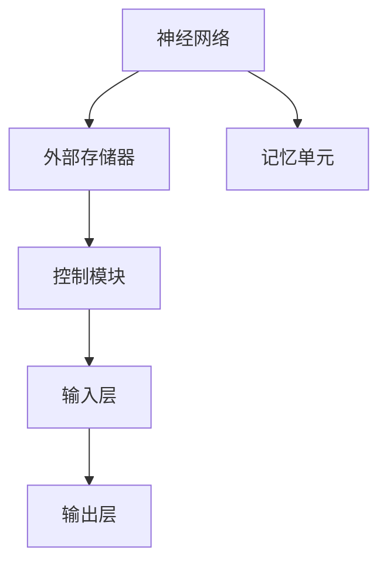

                 

### 引言与背景

#### 1.1 问题背景

复杂算法在计算机科学中的应用及其重要性

复杂算法是现代计算机科学中不可或缺的一部分。随着信息技术的发展，数据量和计算需求日益增加，传统的算法往往难以满足日益复杂的问题需求。复杂算法的应用不仅体现在高性能计算领域，如深度学习、大数据处理和金融计算等，还广泛运用于图像识别、自然语言处理和自动驾驶等多个行业。

算法优化对于提升系统性能和效率的影响

算法优化是提高计算机系统性能和效率的关键手段。通过优化算法，可以在相同计算资源下显著提升系统的处理能力，降低计算时间和资源消耗。在实时计算、高并发场景和资源受限环境中，算法优化对于确保系统稳定性和可靠性具有重要作用。

#### 1.2 问题描述

复杂算法设计与优化面临的挑战

复杂算法设计与优化面临诸多挑战。一方面，复杂问题本身具有高度的非线性和动态性，这使得传统算法难以进行有效的建模和求解。另一方面，随着算法规模的扩大，计算复杂度和资源需求也呈现指数级增长，给算法优化带来了巨大压力。

引入神经图灵机及其在算法设计中的作用

神经图灵机（Neural Turing Machine，NTM）是一种结合了神经网络和图灵机概念的混合模型。NTM通过使用记忆单元和外部存储器来处理复杂信息，使其在处理动态数据和长期依赖关系方面具有显著优势。NTM的引入为复杂算法设计与优化提供了新的思路和工具，有助于应对传统算法难以解决的问题。

#### 1.3 问题解决

如何利用神经图灵机解决复杂算法问题

利用神经图灵机解决复杂算法问题的核心在于：首先，将复杂问题转化为可处理的形式，利用NTM的内部记忆单元和外部存储器进行有效建模；其次，通过训练和优化NTM，使其能够自动学习和调整模型参数，从而实现算法的高效求解。具体方法包括：

- 数据预处理：对输入数据进行适当的预处理，以便于NTM更好地建模和理解问题。
- 模型训练：使用大量的训练数据对NTM进行训练，优化其内部参数，使其能够准确捕捉问题特征。
- 模型评估与优化：通过交叉验证和性能评估方法，对NTM的性能进行评价，并根据评估结果进行进一步优化。

算法优化的基本原理和方法

算法优化主要包括两个方面：一是算法本身的优化，如算法结构改进、时间复杂度和空间复杂度优化等；二是算法实现的优化，如并行计算、分布式计算和硬件加速等。具体方法包括：

- 算法结构优化：通过改进算法的基本结构，降低算法的复杂度，提高计算效率。
- 参数调整：通过调整算法参数，优化模型的训练过程，提高模型的泛化能力和性能。
- 硬件优化：利用高性能计算硬件，如GPU、FPGA和TPU等，实现算法的加速和优化。

#### 1.4 边界与外延

定义复杂算法的边界条件

复杂算法的边界条件主要包括：

- 输入数据规模：复杂算法通常需要处理大规模的数据集，因此输入数据规模是算法边界的一个重要考量因素。
- 计算资源限制：在有限的计算资源下，算法需要高效地完成计算任务，确保系统稳定性和可靠性。
- 时间约束：对于实时系统，算法需要在规定的时间内完成计算任务，保证系统的响应速度。

探讨算法优化在不同领域中的应用

算法优化在不同领域中的应用具有显著差异。例如：

- 高性能计算：通过优化算法结构、并行计算和硬件加速等技术，提高计算效率和性能。
- 大数据处理：针对海量数据的特点，采用分布式计算和流处理等技术，实现高效的数据处理和分析。
- 机器学习：通过优化模型参数、数据预处理和训练算法等技术，提高模型的泛化能力和预测准确性。

#### 1.5 概念结构与核心要素组成

详细阐述神经图灵机的概念和组成部分

神经图灵机是一种结合了神经网络和图灵机概念的混合模型，其主要组成部分包括：

- 神经网络：负责数据的建模和学习，通过调整内部参数实现数据的自动提取和特征表示。
- 外部存储器：用于存储和处理大量数据，通过内存访问和写入操作实现数据的高效管理。
- 控制模块：负责协调神经网络和外部存储器的交互，实现算法的自动调整和优化。

分析神经图灵机在复杂算法设计中的核心作用

神经图灵机在复杂算法设计中的核心作用主要体现在以下几个方面：

- 数据建模：利用神经网络的自动学习特性，对复杂问题进行有效的数据建模，降低算法的复杂度。
- 记忆与推理：通过外部存储器和记忆单元，实现长期依赖关系的记忆和推理，提高算法的求解能力。
- 自动调整：通过控制模块的协调作用，实现算法的自动调整和优化，提高算法的泛化能力和性能。

### 第2章 核心概念与联系

#### 2.1 神经图灵机原理

神经图灵机是一种结合神经网络和图灵机的混合模型，它通过引入外部存储器来增强神经网络的处理能力。下面将详细介绍神经图灵机的基本原理和组成部分。

##### 图1. 神经图灵机的结构示意图



在神经图灵机的结构示意图中，神经网络负责数据的建模和学习，外部存储器用于存储和处理大量数据，控制模块负责协调神经网络和外部存储器的交互，输入层和输出层分别用于输入数据和输出结果。

##### 2.2 神经图灵机的属性特征对比表格

| 特征           | 传统神经网络             | 神经图灵机                   |
| -------------- | ------------------------ | ---------------------------- |
| 记忆能力       | 无外部记忆               | 具备外部存储器，支持记忆和检索 |
| 数据处理能力   | 主要处理输入数据         | 可以处理外部存储器中的数据     |
| 模型结构       | 只包含神经网络           | 包含神经网络、外部存储器和控制模块 |
| 学习机制       | 主要基于梯度下降         | 结合梯度下降和记忆检索机制     |
| 应对复杂问题能力 | 对复杂问题的处理能力有限 | 能够处理更复杂的动态问题       |

**表1. 神经图灵机与传统的图灵机对比**

| 特征           | 传统的图灵机               | 神经图灵机                   |
| -------------- | ------------------------ | ---------------------------- |
| 计算模型       | 基于符号计算             | 基于神经网络和外部存储器     |
| 记忆机制       | 无内部记忆               | 具备外部存储器和记忆单元       |
| 数据处理方式   | 序列处理                 | 并行处理和内存访问操作         |
| 适应性         | 对问题适应性较差         | 能够通过记忆和推理自动调整     |

##### 2.3 ER实体关系图架构

神经图灵机的实体关系图可以帮助我们更好地理解其组成部分和相互作用。以下是一个简化的ER实体关系图：

```mermaid
erDiagram
  NeuralNetwork ||--|{ MemoryUnit }|| ExternalMemory
  ControlModule ||--|{ NeuralNetwork }||--|{ MemoryUnit }|| ExternalMemory
  InputLayer ||--|{ NeuralNetwork }|| OutputLayer
```

在这个ER实体关系图中，`NeuralNetwork`（神经网络）与`MemoryUnit`（记忆单元）和`ExternalMemory`（外部存储器）存在关联关系，表示神经网络通过记忆单元和外部存储器进行数据处理。`ControlModule`（控制模块）与神经网络、记忆单元和外部存储器也存在关联关系，表示控制模块负责协调各个部分的交互。`InputLayer`（输入层）和`OutputLayer`（输出层）与神经网络相连，表示输入层接收外部输入，输出层产生输出结果。

通过以上对神经图灵机原理、属性特征对比表格和ER实体关系图的详细介绍，我们可以更深入地理解神经图灵机在复杂算法设计中的应用和作用。接下来，我们将进一步探讨神经图灵机在算法原理讲解、系统分析与架构设计以及项目实战中的具体应用和实践。

