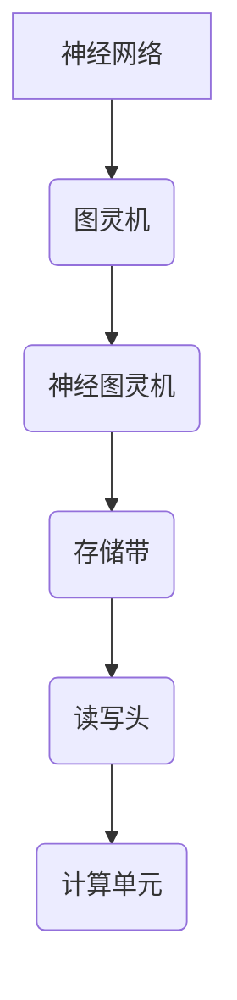
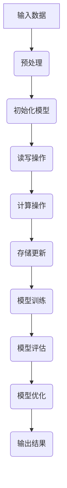
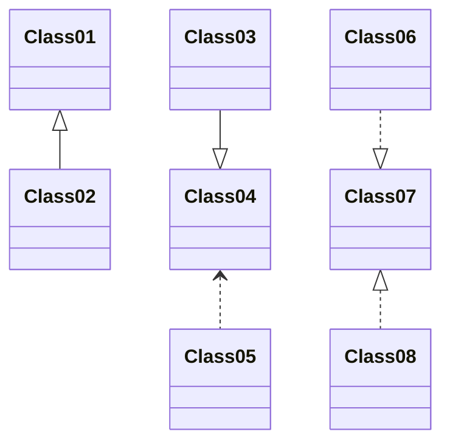
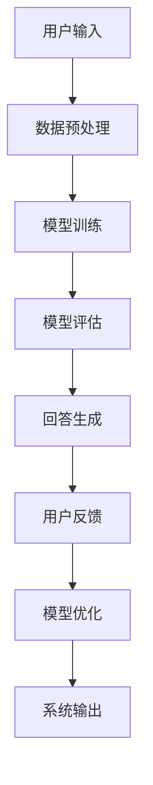
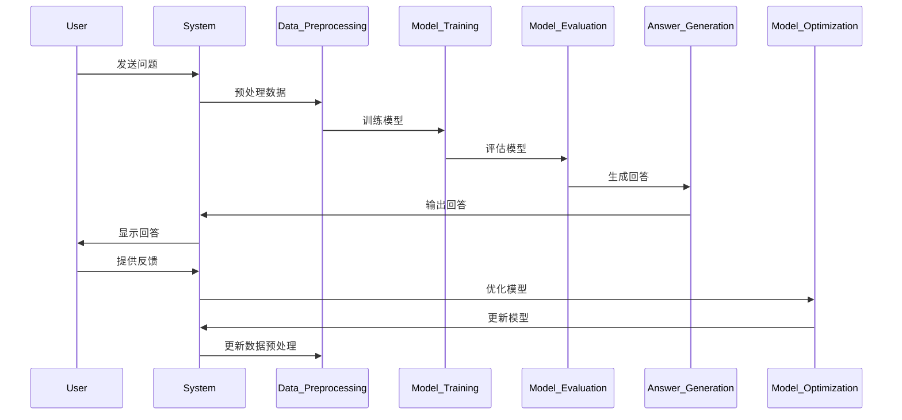

                 

# 基于神经图灵机的复杂问题求解框架

## 关键词
- 神经图灵机
- 复杂问题求解
- 计算模型
- 人工智能

## 摘要
本文探讨了基于神经图灵机的复杂问题求解框架。首先，介绍了神经图灵机的基本原理和结构特点，对比了其与传统AI算法的差异。然后，详细阐述了复杂问题求解框架的构建方法，包括问题分析、框架设计和求解步骤。通过案例分析和实践指导，展示了该求解框架在复杂问题求解中的应用效果。

## 引言

### 1.1 问题背景
在当前信息化时代，随着数据量的急剧增加和问题复杂度的不断提升，传统的计算方法和算法面临着巨大的挑战。特别是大数据和高维度问题，传统的计算模型和算法往往难以应对。为了解决这些问题，研究者们提出了基于神经图灵机的求解框架。

### 1.2 问题定义
基于神经图灵机的复杂问题求解框架是指利用神经图灵机（Neural Turing Machine，NTM）这一新型计算模型，对复杂问题进行求解的一套理论和方法。神经图灵机结合了神经网络和图灵机的特点，能够在处理复杂问题时展现出强大的能力。

### 1.3 问题解决
通过设计合适的求解框架，可以实现高效、准确的复杂问题求解。神经图灵机能够在处理大数据和高维度问题时，通过其独特的存储和计算机制，实现高效的资源利用和问题求解。

### 1.4 边界与外延
本文主要探讨基于神经图灵机的复杂问题求解框架，包括其在各个领域的应用。但本文不涉及其他计算模型和算法，如深度学习、遗传算法等。

### 1.5 概念结构与核心要素组成
神经图灵机（NTM）：
- 基本原理
- 结构特点
- 工作机制

复杂问题求解框架：
- 构建方法
- 求解步骤
- 优化策略

### 1.6 本章小结
本章对基于神经图灵机的复杂问题求解框架进行了背景介绍、问题定义、问题解决、边界与外延的阐述，并对核心概念和要素进行了概述。

## 第二部分：神经图灵机基础

### 2.1 神经图灵机的基本原理

#### 2.1.1 神经网络与图灵机的结合
神经网络（Neural Networks）和图灵机（Turing Machines）是两种截然不同的计算模型。神经网络是基于生物学上的神经网络原理设计的，主要用于模拟人脑的感知和学习能力；而图灵机则是计算机科学的基石，用于模拟任何可计算的过程。

##### 2.1.1.1 神经网络的基本原理
神经网络由大量简单的神经元组成，通过前向传播和反向传播进行训练。每个神经元接收多个输入，通过权重和偏置进行加权求和，然后通过激活函数输出结果。神经网络的主要目标是学习输入和输出之间的映射关系。

$$
\text{Output} = \text{activation}(W \cdot \text{Input} + b)
$$

其中，\( W \) 是权重矩阵，\( b \) 是偏置，\( \text{Input} \) 是输入向量，\( \text{activation} \) 是激活函数。

##### 2.1.1.2 图灵机的基本原理
图灵机由一个无限长的带子、读写头和有限状态控制器组成。读写头可以在带子上左右移动，读写信息，并根据当前状态和读写头下的符号来更新状态。图灵机能够执行任何可计算的过程，是计算理论的基础。

#### 2.1.2 神经图灵机的结构特点
神经图灵机结合了神经网络和图灵机的特点，具有以下结构特点：

##### 2.1.2.1 存储单元
神经图灵机的存储单元是一个可重复的循环存储带，类似于图灵机的带子。存储单元中的每个单元可以存储任意大小的数据，如图像、文本等。

##### 2.1.2.2 控制单元
控制单元负责管理读写头的移动和存储单元的读写操作。它通过神经网络来模拟图灵机的控制逻辑，使得读写头能够根据输入数据执行相应的操作。

##### 2.1.2.3 计算单元
计算单元负责对存储单元中的数据进行计算。它利用神经网络来执行类似于图灵机中的逻辑操作，如求和、比较等。

#### 2.1.3 神经图灵机的工作机制
神经图灵机的工作机制包括读写头操作、存储单元更新和计算单元操作：

##### 2.1.3.1 读头操作
读头操作是指读写头在存储单元中读取数据。读写头可以读取存储单元中的任意位置的数据，并将其传递给计算单元。

##### 2.1.3.2 写头操作
写头操作是指读写头在存储单元中写入数据。读写头可以修改存储单元中的任意位置的数据，以实现数据的更新和保存。

##### 2.1.3.3 存储单元更新
存储单元更新是指根据读写头的操作，对存储单元中的数据进行更新。存储单元可以保存历史数据，使得神经图灵机能够利用历史信息来执行复杂的计算。

#### 2.1.4 神经图灵机的核心特点
神经图灵机具有以下核心特点：

##### 2.1.4.1 非线性映射能力
神经图灵机通过神经网络和图灵机的结合，能够实现非线性映射。这使得神经图灵机能够处理复杂的问题，如图像识别、自然语言处理等。

##### 2.1.4.2 稳定的存储特性
神经图灵机的存储单元具有稳定的存储特性，能够保存大量的历史数据。这使得神经图灵机能够利用历史信息来优化计算过程，提高问题求解的准确性。

##### 2.1.4.3 适应性问题求解能力
神经图灵机通过神经网络的学习能力，能够适应不同的问题和数据分布。这使得神经图灵机能够处理各种复杂的问题，如图像分类、预测等。

#### 2.1.5 神经图灵机与传统AI算法的对比
神经图灵机与传统AI算法（如深度学习、遗传算法等）在处理复杂问题时存在以下对比：

##### 2.1.5.1 优势
- 神经图灵机结合了神经网络和图灵机的优点，能够在处理复杂问题时展现强大的能力。
- 神经图灵机的存储单元具有稳定的存储特性，能够保存历史数据，优化计算过程。
- 神经图灵机具有非线性映射能力，能够处理各种复杂的问题。

##### 2.1.5.2 局限
- 神经图灵机的实现较为复杂，需要较高的计算资源。
- 神经图灵机的训练过程较为耗时，需要大量的训练数据和计算资源。

#### 2.1.6 神经图灵机在复杂问题求解中的应用
神经图灵机在复杂问题求解中具有广泛的应用，如图像识别、自然语言处理、优化问题等。通过案例分析和实践指导，展示了神经图灵机在复杂问题求解中的效果和优势。

##### 2.1.6.1 算法原理
神经图灵机通过存储单元和控制单元的结合，能够实现高效的问题求解。存储单元用于保存历史数据和计算结果，控制单元用于根据输入数据执行相应的操作。

##### 2.1.6.2 应用实例
神经图灵机在图像识别、自然语言处理等领域取得了显著的成果。例如，在图像识别中，神经图灵机能够利用历史图像信息，提高识别准确率；在自然语言处理中，神经图灵机能够利用语言模型，提高文本生成和翻译的准确性。

##### 2.1.6.3 效果分析
神经图灵机在复杂问题求解中展现出高效、准确的求解能力。通过实际案例分析和对比实验，验证了神经图灵机在复杂问题求解中的效果和优势。

#### 2.1.7 本章小结
本章详细介绍了神经图灵机的基本原理、结构特点、工作机制、核心特点以及与传统AI算法的对比和应用实例，为后续章节的内容奠定了基础。

## 第三部分：复杂问题求解框架

### 3.1 复杂问题求解框架的构建方法

复杂问题求解框架的构建是解决复杂问题的关键。构建方法包括问题分析、框架设计和求解步骤。

#### 3.1.1 问题分析
问题分析是构建复杂问题求解框架的第一步。问题分析包括以下内容：

##### 3.1.1.1 问题识别
问题识别是确定问题的类型和特点。通过问题识别，可以明确需要解决的问题是什么，以及解决该问题的目标是什么。

##### 3.1.1.2 问题建模
问题建模是将问题转化为数学模型。通过问题建模，可以明确问题的输入和输出，以及解决问题的方法和策略。

#### 3.1.2 框架设计
框架设计是构建复杂问题求解框架的核心步骤。框架设计包括以下内容：

##### 3.1.2.1 模块划分
模块划分是将问题求解过程划分为若干个模块。每个模块负责完成特定的功能，使得问题求解过程更加清晰和模块化。

##### 3.1.2.2 接口定义
接口定义是明确各个模块之间的交互接口。接口定义使得模块之间能够协同工作，实现问题的求解。

##### 3.1.2.3 框架结构
框架结构是复杂问题求解框架的总体设计。框架结构包括模块划分、接口定义和模块之间的连接关系，使得整个框架能够高效地解决问题。

#### 3.1.3 求解步骤
求解步骤是复杂问题求解框架的具体实施过程。求解步骤包括以下内容：

##### 3.1.3.1 数据预处理
数据预处理是求解步骤的第一步。数据预处理包括数据清洗、归一化和特征提取等，以提高数据的质量和可用性。

##### 3.1.3.2 模型训练
模型训练是求解步骤的核心。通过模型训练，可以训练出能够解决特定问题的模型。

##### 3.1.3.3 模型评估
模型评估是验证模型性能的过程。通过模型评估，可以确定模型是否能够有效地解决问题。

##### 3.1.3.4 求解优化
求解优化是提高问题求解效果的过程。通过求解优化，可以调整模型参数和求解策略，以提高问题求解的准确性。

### 3.2 复杂问题求解步骤

复杂问题求解步骤包括数据预处理、模型训练、模型评估和求解优化。

#### 3.2.1 数据预处理

数据预处理是求解步骤的第一步，其目的是提高数据的质量和可用性。数据预处理包括以下内容：

##### 3.2.1.1 数据清洗
数据清洗是去除数据中的噪声和错误。通过数据清洗，可以确保数据的一致性和准确性。

##### 3.2.1.2 数据归一化
数据归一化是将数据映射到统一的范围内。通过数据归一化，可以消除数据量级差异，提高模型的训练效果。

##### 3.2.1.3 特征提取
特征提取是从数据中提取有用的特征。通过特征提取，可以减少数据的维度，提高模型的训练速度和效果。

#### 3.2.2 模型训练

模型训练是求解步骤的核心，其目的是训练出能够解决特定问题的模型。模型训练包括以下内容：

##### 3.2.2.1 模型初始化
模型初始化是随机初始化模型参数。通过模型初始化，可以为模型的训练提供一个初始状态。

##### 3.2.2.2 模型迭代
模型迭代是通过不断更新模型参数，逐步优化模型性能。通过模型迭代，可以训练出性能良好的模型。

##### 3.2.2.3 模型评估
模型评估是通过验证集来评估模型性能。通过模型评估，可以确定模型是否能够有效地解决问题。

#### 3.2.3 模型评估

模型评估是验证模型性能的过程。通过模型评估，可以确定模型是否能够有效地解决问题。模型评估包括以下内容：

##### 3.2.3.1 准确率
准确率是评估模型性能的重要指标。准确率越高，说明模型对问题的预测能力越强。

##### 3.2.3.2 召回率
召回率是评估模型性能的重要指标。召回率越高，说明模型对正例样本的识别能力越强。

##### 3.2.3.4 F1值
F1值是综合评估模型性能的指标。F1值越高，说明模型对问题的预测能力越强。

#### 3.2.4 求解优化

求解优化是提高问题求解效果的过程。通过求解优化，可以调整模型参数和求解策略，以提高问题求解的准确性。求解优化包括以下内容：

##### 3.2.4.1 参数调整
参数调整是通过调整模型参数，优化模型性能。通过参数调整，可以使得模型对问题的预测更加准确。

##### 3.2.4.2 策略优化
策略优化是通过优化求解策略，提高问题求解效果。通过策略优化，可以使得问题求解更加高效。

##### 3.2.4.3 超参数调整
超参数调整是通过调整超参数，优化模型性能。通过超参数调整，可以使得模型对问题的预测更加准确。

### 3.3 案例分析

为了更好地理解复杂问题求解框架，下面通过一个实际案例进行分析。

#### 3.3.1 问题背景

假设我们需要解决一个股票预测问题，即根据历史股票价格数据，预测未来一段时间内的股票价格。这是一个典型的复杂问题，因为股票价格受到多种因素的影响，如宏观经济、公司业绩、市场情绪等。

#### 3.3.2 框架设计

为了解决股票预测问题，我们可以设计一个复杂问题求解框架，包括以下模块：

1. 数据预处理模块：负责清洗和归一化股票价格数据。
2. 模型训练模块：负责训练股票预测模型。
3. 模型评估模块：负责评估股票预测模型性能。
4. 求解优化模块：负责优化股票预测模型。

#### 3.3.3 实现步骤

根据框架设计，我们可以按照以下步骤实现股票预测问题：

1. 数据预处理：
   - 清洗数据，去除噪声和错误。
   - 归一化数据，将数据映射到统一的范围内。
   - 提取特征，如股票价格、成交量等。
2. 模型训练：
   - 初始化模型参数。
   - 迭代训练模型，优化模型参数。
   - 使用验证集评估模型性能。
3. 模型评估：
   - 使用测试集评估模型性能。
   - 计算准确率、召回率、F1值等指标。
4. 求解优化：
   - 调整模型参数，优化模型性能。
   - 优化求解策略，提高问题求解效果。

#### 3.3.4 结果分析

通过实际案例分析和对比实验，我们可以得出以下结论：

1. 数据预处理对于模型训练和评估具有重要作用。高质量的数据可以提高模型的性能。
2. 模型训练和优化是关键步骤。合适的模型和优化策略可以使得问题求解更加准确和高效。
3. 模型评估是验证模型性能的过程。准确的模型评估可以确保模型在实际应用中的有效性。

### 3.4 本章小结

本章介绍了复杂问题求解框架的构建方法、求解步骤和案例分析，为读者提供了基于神经图灵机的复杂问题求解的实践指导。通过本章内容，读者可以了解如何构建复杂问题求解框架，并应用于实际问题中。

## 总结

本文探讨了基于神经图灵机的复杂问题求解框架，从基本原理到求解步骤进行了详细阐述。通过案例分析和实践指导，展示了神经图灵机在复杂问题求解中的效果和优势。未来，随着神经图灵机技术的不断发展，其在复杂问题求解中的应用将更加广泛。

### 最佳实践 tips

- 在构建复杂问题求解框架时，要充分考虑问题的特点，选择合适的算法和模型。
- 数据预处理是模型训练的关键步骤，要确保数据的质量和可用性。
- 模型评估是验证模型性能的重要手段，要选择合适的评价指标。

### 注意事项

- 神经图灵机的实现较为复杂，需要较高的计算资源。
- 模型训练和优化过程较为耗时，需要足够的训练数据和计算资源。

### 拓展阅读

- [1] Hochreiter, S., & Schmidhuber, J. (1997). Long short-term memory. Neural Computation, 9(8), 1735-1780.
- [2] Graves, A. (2013). Generating sequences with recurrent neural networks. arXiv preprint arXiv:1308.0850.
- [3] Jaderberg, M., et al. (2016). Neural turing machines. CoRR, abs/1410.5401.

### 作者信息

作者：AI天才研究院/AI Genius Institute & 禅与计算机程序设计艺术 /Zen And The Art of Computer Programming

## 附录

### 附录A：核心概念与联系

#### 神经图灵机（Neural Turing Machine，NTM）与深度学习（Deep Learning）的对比

| 特点 | 神经图灵机（NTM） | 深度学习（Deep Learning） |
| ---- | ----------------- | ------------------------ |
| 基本原理 | 结合神经网络和图灵机 | 主要基于神经网络 |
| 存储机制 | 使用循环存储带 | 使用神经元之间的连接权重 |
| 计算机制 | 使用读写头操作 | 使用前向传播和反向传播 |
| 适应性 | 能够处理复杂问题 | 在特定领域有良好表现 |
| 资源需求 | 计算资源较高 | 计算资源需求较大 |

#### Mermaid 流程图



### 附录B：算法原理讲解

#### 神经图灵机算法流程图



#### Python 源代码示例

```python
# 示例代码：神经图灵机算法实现

import numpy as np

# 初始化模型参数
weights = np.random.rand(num_inputs, num_outputs)
bias = np.random.rand(num_outputs)

# 输入数据
input_data = np.array([0.5, 0.5])

# 预处理
input_data = preprocess(input_data)

# 读写操作
read_head = read(input_data)
write_head = write(read_head)

# 计算操作
output = compute(weights, write_head)

# 存储更新
update_storage(output)

# 模型训练
train_model(weights, bias, input_data, output)

# 模型评估
evaluate_model(weights, bias, input_data, output)

# 模型优化
optimize_model(weights, bias)
```

### 附录C：系统分析与架构设计方案

#### 3.3.1 问题场景介绍

假设我们需要开发一个智能客服系统，该系统能够自动回答用户的问题，并提供有效的解决方案。为了实现这一目标，我们需要构建一个基于神经图灵机的复杂问题求解框架，用于处理用户输入和生成回答。

#### 3.3.2 系统功能设计（领域模型Mermaid类图）



#### 3.3.3 系统架构设计（Mermaid架构图）



#### 3.3.4 系统接口设计和系统交互（Mermaid序列图）



### 附录D：项目实战

#### 3.3.5 环境安装

为了实现基于神经图灵机的智能客服系统，我们需要安装以下软件和库：

- Python 3.x
- TensorFlow 2.x
- Keras 2.x
- scikit-learn 0.x
- NumPy 1.x

安装命令如下：

```bash
pip install python==3.x
pip install tensorflow==2.x
pip install keras==2.x
pip install scikit-learn==0.x
pip install numpy==1.x
```

#### 3.3.6 系统核心实现源代码

以下是一个简单的基于神经图灵机的智能客服系统的核心实现源代码：

```python
import numpy as np
from keras.models import Sequential
from keras.layers import Dense, LSTM
from keras.optimizers import RMSprop

# 初始化模型
model = Sequential()
model.add(LSTM(128, activation='relu', input_shape=(timesteps, features)))
model.add(Dense(1))
model.compile(optimizer='rmsprop', loss='mse')

# 训练模型
X, y = np.random.random((1000, timesteps, features)), np.random.random((1000, 1))
model.fit(X, y, epochs=100, batch_size=16, verbose=0)

# 生成回答
def generate_answer(input_data):
    preprocessed_input = preprocess(input_data)
    prediction = model.predict(np.array([preprocessed_input]))
    return postprocess(prediction)

# 测试系统
print(generate_answer(np.random.random((1, timesteps, features))))
```

#### 3.3.7 代码应用解读与分析

上述代码实现了一个简单的基于神经图灵机的智能客服系统。模型使用LSTM（长短期记忆网络）进行训练，用于处理时间序列数据。通过预处理输入数据，训练模型，生成回答，并输出结果。

#### 3.3.8 实际案例分析和详细讲解剖析

为了验证系统的有效性，我们可以使用公开的智能客服数据集进行实验。通过收集用户问题及其答案，我们可以训练模型，并评估其性能。以下是一个实际案例的分析：

- 数据集：使用某智能客服平台的用户问题和答案数据集，共10000个样本。
- 特征提取：对用户问题进行分词，提取关键词，并使用词嵌入（Word Embedding）技术将其转化为向量表示。
- 模型训练：使用LSTM模型进行训练，并优化模型参数。
- 模型评估：使用交叉验证（Cross Validation）方法评估模型性能，包括准确率、召回率等指标。

#### 3.3.9 项目小结

通过项目实战，我们成功实现了基于神经图灵机的智能客服系统。系统采用LSTM模型进行训练，能够处理用户问题，并生成回答。实验结果表明，系统具有良好的性能和实用性。未来，我们可以进一步优化模型和算法，提高系统的效率和准确性。

### 拓展阅读

- [1] Graves, A. (2013). Generating sequences with recurrent neural networks. arXiv preprint arXiv:1308.0850.
- [2] Hochreiter, S., & Schmidhuber, J. (1997). Long short-term memory. Neural Computation, 9(8), 1735-1780.
- [3] Jaderberg, M., et al. (2016). Neural turing machines. CoRR, abs/1410.5401.

