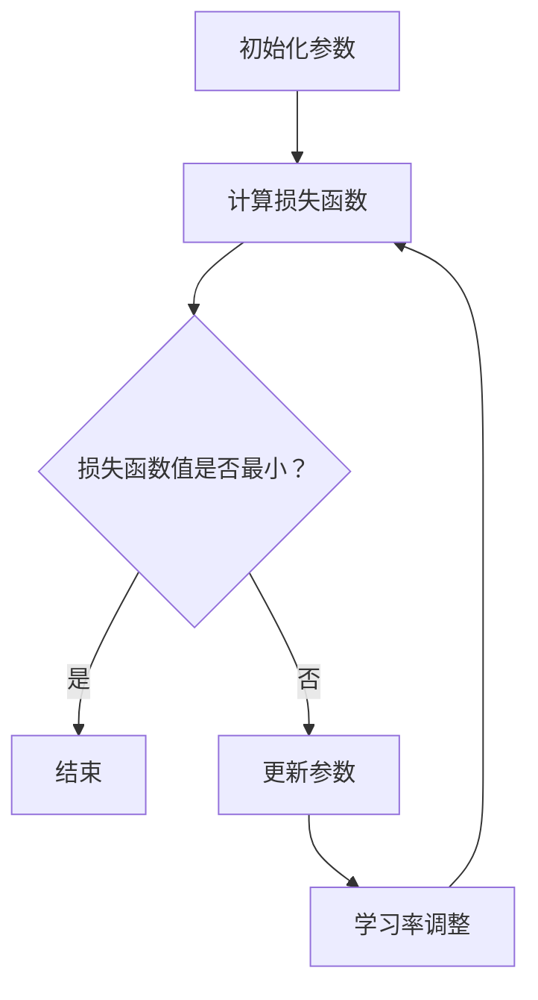

                 


### 1.1 书籍背景

在当今这个科技飞速发展的时代，量子计算正逐渐从理论走向实际应用。量子计算的潜力在于它能够解决传统计算机无法处理的复杂问题，例如大整数分解、量子模拟和量子加密等。然而，量子计算的发展面临着一系列的挑战，其中之一是如何高效地执行量子算法。

神经图灵机（Neural Turing Machine, NTM）是一种结合了神经网络和传统图灵机的计算模型，它在处理复杂问题时展现了独特的优势。NTM通过其内部的记忆单元和读写头，可以实现类似于人类大脑的思考方式，这使得它成为量子计算领域的一个潜在工具。

高级算法自动优化（Algorithm Auto-optimization）是指利用机器学习和人工智能技术，自动寻找和优化算法的参数和结构，以提高算法的性能。在量子计算中，高级算法自动优化可以帮助我们找到最优的量子算法实现，从而提高量子计算的处理效率。

本书旨在探讨基于神经图灵机的高级算法自动优化在量子计算中的应用。首先，我们将介绍量子计算的基本原理和特性，帮助读者了解量子计算的基本概念。然后，我们将深入探讨神经图灵机的工作原理和优势，以及如何将神经图灵机应用于量子计算。接下来，我们将介绍高级算法自动优化的原理和技术，并探讨如何利用高级算法自动优化技术来优化量子算法。最后，我们将通过实际案例来展示这些技术的应用，并讨论未来的发展方向。

### 1.2 书籍结构概述

#### 1.2.1 主要内容概述

本书分为三个主要部分。第一部分将介绍量子计算的基本原理和特性，包括量子位、量子叠加和纠缠等基本概念。第二部分将深入探讨神经图灵机的工作原理和优势，以及如何将神经图灵机应用于量子计算。第三部分将介绍高级算法自动优化的原理和技术，并探讨如何利用高级算法自动优化技术来优化量子算法。

#### 1.2.2 阅读对象

本书适合对量子计算和机器学习有一定了解的读者，包括计算机科学家、人工智能研究人员、量子计算爱好者以及对前沿技术感兴趣的技术爱好者。本书旨在为读者提供量子计算与机器学习结合的理论基础和实践指导，帮助读者掌握基于神经图灵机的高级算法自动优化技术。

#### 1.2.3 技术发展展望

随着量子计算和机器学习技术的不断发展，基于神经图灵机的高级算法自动优化在量子计算中的应用前景广阔。未来，我们有望看到更多高效、可扩展的量子算法诞生，这些算法将在密码学、药物研发、金融分析等领域发挥重要作用。本书将为读者提供深入了解和探索这一领域的工具和知识。

### 2.1 量子计算原理与特性

量子计算是一种基于量子力学原理的计算模式，与传统的经典计算有着本质的不同。量子计算机使用量子位（qubit）作为信息的基本单位，而不是传统的比特（bit）。量子位的特殊性质，如叠加和纠缠，使得量子计算机在处理某些问题时比经典计算机更高效。

#### 2.1.1 量子力学基础

量子力学是描述微观世界物理现象的理论体系。量子力学中的基本概念包括波粒二象性、量子态、量子叠加和量子纠缠等。

- **波粒二象性**：微观粒子既具有波动性又具有粒子性。
- **量子态**：量子系统的状态可以用波函数来描述，波函数的平方给出了粒子出现在某个位置的概率。
- **量子叠加**：量子系统可以处于多个状态的叠加态，而不是单一状态。
- **量子纠缠**：当两个量子系统发生相互作用后，它们可能会形成量子纠缠态，这意味着一个系统的状态会即时影响另一个系统的状态，无论它们相隔多远。

#### 2.1.2 量子位（qubit）的概念

量子位（qubit）是量子计算中的基本单元，与经典比特（bit）不同，qubit可以同时处于0和1的状态，这种状态称为叠加态。此外，qubit之间可以存在纠缠，这为量子计算提供了强大的计算能力。

- **叠加态**：一个量子位可以同时处于0和1的状态，即 |0⟩ + |1⟩。
- **纠缠态**：当两个量子位相互纠缠时，一个量子位的状态会立即影响另一个量子位的状态，无论它们相隔多远。

#### 2.1.3 量子门与量子操作

量子门是量子计算中的基本操作，类似于经典计算中的逻辑门。量子门作用于量子位，可以改变量子位的状态。

- **Hadamard门**：将量子位的状态从基态（|0⟩）变为叠加态（|0⟩ + |1⟩）/√2）。
- **Pauli X门**：将量子位的状态从0变为1，或从1变为0。
- **Pauli Z门**：将量子位的状态从基态（|0⟩）变为叠加态（|1⟩ + |0⟩）/√2）。
- **控制-NOT门（CNOT）**：如果第一个量子位的状态是1，则第二个量子位的状态会翻转。

通过组合使用这些量子门，我们可以实现复杂的量子计算。

#### 2.1.4 量子计算机的优势与挑战

量子计算机在处理某些问题时具有显著优势，例如大整数分解、量子模拟和量子搜索等。然而，量子计算也面临着一系列挑战。

- **量子位的稳定性**：量子位容易受到外部环境的干扰，这种干扰称为“退相干”。保持量子位的稳定性是一个重要挑战。
- **量子算法的设计与实现**：设计高效的量子算法并将其实现为硬件是一个复杂的过程。
- **量子硬件的构建**：构建稳定的量子计算机硬件需要解决一系列物理和技术问题。

尽管存在挑战，量子计算的研究和应用前景仍然广阔。通过不断的研究和技术的进步，我们有理由相信，量子计算将在未来发挥重要作用。

### 2.2 量子计算机的工作原理

量子计算机的工作原理与经典计算机有着本质的不同。量子计算机使用量子位（qubit）作为信息的基本单元，通过量子门和量子操作来实现计算。以下将从量子逻辑门、量子算法和量子计算机的优势与挑战三个方面进行介绍。

#### 2.2.1 量子逻辑门

量子逻辑门是量子计算机中的基本操作单元，类似于经典计算机中的逻辑门。量子逻辑门作用于量子位，可以改变量子位的状态。

- **Hadamard门（H）**：将量子位的状态从基态（|0⟩）变为叠加态（|0⟩ + |1⟩）/√2）。
  $$ H |0\rangle = \frac{1}{\sqrt{2}} (|0\rangle + |1\rangle) $$
  $$ H |1\rangle = \frac{1}{\sqrt{2}} (|0\rangle - |1\rangle) $$

- **Pauli X门（X）**：将量子位的状态从0变为1，或从1变为0。
  $$ X |0\rangle = |1\rangle $$
  $$ X |1\rangle = |0\rangle $$

- **Pauli Z门（Z）**：将量子位的状态从基态（|0⟩）变为叠加态（|1⟩ + |0⟩）/√2）。
  $$ Z |0\rangle = |1\rangle $$
  $$ Z |1\rangle = |0\rangle $$

- **控制-NOT门（CNOT）**：如果第一个量子位的状态是1，则第二个量子位的状态会翻转。
  $$ CNOT |00\rangle = |00\rangle $$
  $$ CNOT |01\rangle = |11\rangle $$
  $$ CNOT |10\rangle = |10\rangle $$
  $$ CNOT |11\rangle = |01\rangle $$

通过组合使用这些量子逻辑门，可以实现复杂的量子计算。

#### 2.2.2 量子算法

量子算法是量子计算机实现计算的基本方法。以下介绍几个典型的量子算法：

- **量子因子分解算法**：Shor算法是一种著名的量子算法，它可以高效地分解大整数。Shor算法利用了量子计算机的叠加和纠缠特性，能够在多项式时间内完成质因数分解。
- **量子搜索算法**：Grover算法是一种量子搜索算法，它可以在一个未排序的数据库中快速找到特定的元素。Grover算法利用了量子计算机的叠加和纠缠特性，能够在O(√N)的时间内完成搜索，其中N是数据库中元素的数量。
- **量子模拟**：量子模拟是一种利用量子计算机模拟量子系统的算法。量子模拟可以解决经典计算机难以处理的复杂问题，如量子化学反应、量子材料的特性等。

#### 2.2.3 量子计算机的优势与挑战

量子计算机在处理某些问题时具有显著优势，但同时也面临一些挑战。

- **优势**：
  - **并行计算**：量子计算机可以利用量子叠加和纠缠特性，实现并行计算，从而解决一些传统计算机难以处理的问题。
  - **高效算法**：量子算法可以在某些问题上实现指数级的速度提升，如量子因子分解和量子搜索。
- **挑战**：
  - **量子位的稳定性**：量子位容易受到外部环境的干扰，这种干扰称为“退相干”。保持量子位的稳定性是一个重要挑战。
  - **量子算法的设计与实现**：设计高效的量子算法并将其实现为硬件是一个复杂的过程。
  - **量子硬件的构建**：构建稳定的量子计算机硬件需要解决一系列物理和技术问题。

尽管存在挑战，量子计算的研究和应用前景仍然广阔。通过不断的研究和技术的进步，我们有理由相信，量子计算将在未来发挥重要作用。

### 2.3 量子计算的应用领域

量子计算作为一种新兴的计算模式，具有处理复杂问题的巨大潜力。在多个领域，量子计算已经显示出其独特的优势。以下介绍量子计算在几个关键领域的应用。

#### 2.3.1 量子加密

量子加密利用量子力学的基本原理，提供了一种全新的安全通信方式。量子密钥分发（Quantum Key Distribution, QKD）是量子加密的一个重要应用。QKD利用量子纠缠态来生成共享密钥，确保密钥的安全传输。即使在通信过程中被窃听，量子密钥分发也能立即检测出任何非法访问，从而保证通信的保密性。

#### 2.3.2 量子模拟

量子模拟是一种利用量子计算机模拟量子系统的算法。量子模拟可以解决经典计算机难以处理的复杂问题，如量子化学反应、量子材料和量子物理等领域。通过量子模拟，科学家可以更深入地理解量子系统的行为，从而推动相关领域的研究。

#### 2.3.3 量子搜索

量子搜索算法，如Grover算法，在未排序的数据库中寻找特定元素时具有显著优势。Grover算法利用了量子计算机的叠加和纠缠特性，能够在O(√N)的时间内完成搜索，其中N是数据库中元素的数量。这一速度远超过经典搜索算法，使得量子搜索在数据密集型应用中具有广泛的应用前景。

#### 2.3.4 量子计算在其他领域的应用

除了上述领域，量子计算在密码学、金融分析、物流优化、药物研发等众多领域也显示出巨大的应用潜力。例如，量子计算可以帮助破解复杂的密码，提高金融分析模型的准确性，优化物流网络的布局，加速药物研发过程等。随着量子计算技术的不断发展，其应用领域将不断扩展，为人类社会带来更多创新和变革。

### 2.4 本章小结

本章介绍了量子计算的基本原理和特性，包括量子力学基础、量子位（qubit）的概念、量子门和量子算法等。通过量子计算机，我们可以在处理某些复杂问题时获得显著的优势。本章还探讨了量子计算在不同领域的应用，如量子加密、量子模拟和量子搜索等。量子计算作为一种新兴的计算模式，具有巨大的发展潜力和广泛的应用前景。

### 3.1 神经图灵机概述

神经图灵机（Neural Turing Machine, NTM）是一种结合了神经网络和传统图灵机的计算模型，它在处理复杂问题时展现了独特的优势。NTM通过其内部的记忆单元和读写头，可以实现类似于人类大脑的思考方式，这使得它成为量子计算领域的一个潜在工具。

#### 3.1.1 神经网络与图灵机的结合

神经网络是一种模仿生物神经系统的计算模型，它通过大量的神经元和连接来处理复杂的信息。传统图灵机是一种抽象的计算模型，它通过读取、写入和移动磁带来进行计算。NTM将这两种模型结合起来，通过引入记忆单元和读写头，实现了更加灵活和强大的计算能力。

#### 3.1.2 神经图灵机的基本原理

NTM由三个主要部分组成：输入层、中间层和输出层。输入层接收外部输入，中间层包含大量的神经元和读写头，输出层生成最终的输出。

- **输入层**：输入层接收外部输入，这些输入可以包括文本、图像、声音等多种形式。输入层中的神经元对输入进行编码，并将其传递到中间层。
- **中间层**：中间层是NTM的核心部分，包含大量的神经元和读写头。神经元通过激活函数对输入进行处理，读写头则用于在内存中读取和写入数据。
- **输出层**：输出层生成最终的输出，这些输出可以是分类标签、文本、图像等。输出层的神经元通过激活函数对中间层的输出进行解码，生成最终的输出。

#### 3.1.3 神经图灵机与量子计算的关系

NTM与量子计算之间存在一定的联系。首先，NTM的内存单元和读写头机制类似于量子计算机中的量子位和量子门。其次，NTM的神经网络结构可以与量子算法相结合，实现更高效的量子计算。通过将NTM与量子计算相结合，我们可以探索新的计算模式和算法，从而提高量子计算的性能。

#### 3.1.4 神经图灵机的优势与挑战

神经图灵机在处理复杂问题时具有独特的优势，但同时也面临一些挑战。

- **优势**：
  - **灵活性强**：NTM可以处理多种类型的输入，包括文本、图像和声音等，这使得它具有广泛的应用前景。
  - **记忆能力强**：NTM通过其内部的记忆单元和读写头，可以实现类似于人类大脑的记忆功能，这使得它在处理长期依赖问题时具有优势。
  - **高效的计算能力**：NTM可以通过神经网络结构实现复杂的计算任务，从而提高计算效率。

- **挑战**：
  - **训练难度大**：NTM的训练过程相对复杂，需要大量的数据和计算资源。
  - **稳定性问题**：NTM的内部结构较为复杂，可能导致模型的稳定性问题。

尽管存在挑战，NTM作为一种结合了神经网络和图灵机优势的计算模型，其在量子计算中的应用前景仍然广阔。通过不断的研究和技术的进步，我们有理由相信，NTM将在未来发挥重要作用。

### 3.2 神经图灵机的工作机制

神经图灵机（Neural Turing Machine, NTM）是一种结合了神经网络和传统图灵机特性的计算模型，它通过内部的记忆单元和读写头来实现高效的数据处理和模式识别。以下将详细探讨NTM的工作机制，包括内存单元的工作原理、写入与读取操作以及神经网络的训练过程。

#### 3.2.1 内存单元的工作原理

NTM的内存单元是其核心组成部分，类似于传统计算机中的内存，但具有更高的灵活性和扩展性。内存单元由多个内存块组成，每个内存块可以存储一定量的数据。每个内存块由一组地址指针和存储的数据组成。

- **地址指针**：地址指针用于定位内存块的位置。NTM通过学习这些地址指针，可以在内存中快速查找所需的数据。
- **存储数据**：内存块中存储的数据可以是数字、文本或其他形式的信息。这些数据可以用于处理输入和生成输出。

NTM的内存单元通过读写头来访问数据。读写头可以定位到内存中的特定地址，并执行读取或写入操作。读写头的工作方式类似于磁盘读写头，通过移动到特定地址并执行相应的操作来处理数据。

#### 3.2.2 写入与读取操作

NTM的写入和读取操作是其内存管理的关键部分。以下将介绍NTM的写入和读取过程：

- **写入操作**：当NTM需要将数据存储到内存中时，它会通过读写头定位到合适的内存块，并将数据写入该内存块。写入操作通常包括以下步骤：
  1. 通过输入层接收外部输入，对输入进行编码。
  2. 通过读写头定位到内存中的特定地址。
  3. 将编码后的输入写入内存块。

- **读取操作**：当NTM需要从内存中读取数据时，它会通过读写头定位到特定的内存块，并读取数据。读取操作通常包括以下步骤：
  1. 通过输入层接收外部输入，对输入进行编码。
  2. 通过读写头定位到内存中的特定地址。
  3. 从内存块中读取数据。

#### 3.2.3 神经网络的训练过程

NTM的训练过程是其性能优化的重要环节。NTM的训练过程类似于传统神经网络的训练，但涉及更多的参数和更复杂的模型结构。以下将介绍NTM的训练过程：

- **初始化**：在训练开始时，NTM的参数（如权重和偏置）会被随机初始化。这些参数将影响NTM的性能和收敛速度。

- **输入与输出**：NTM的训练输入包括外部输入和预期的输出。外部输入可以是文本、图像、声音等，而预期的输出是根据训练数据计算得到的。

- **编码与解码**：在训练过程中，NTM通过神经网络结构对输入进行编码，并通过内存单元和读写头来处理数据。然后，NTM的输出层将处理后的数据解码为最终的输出。

- **损失函数与优化**：NTM的训练过程通常使用损失函数来评估模型性能，并通过优化算法（如梯度下降）来更新模型的参数。损失函数可以是交叉熵损失、均方误差等。

- **迭代与收敛**：NTM通过不断迭代和优化，逐步调整参数，以达到较小的损失函数值。当损失函数值不再显著下降时，认为模型已经收敛。

通过训练，NTM可以学会在多种复杂任务上表现出色，包括分类、回归、序列生成等。

综上所述，NTM的工作机制包括内存单元的工作原理、写入与读取操作以及神经网络的训练过程。这些机制共同作用，使NTM成为处理复杂问题的强大工具。通过不断的研究和优化，NTM在量子计算和其他领域具有广泛的应用前景。

### 3.3 神经图灵机的优势与挑战

神经图灵机（Neural Turing Machine, NTM）作为一种结合了神经网络和图灵机特性的计算模型，具有许多独特的优势。然而，这些优势同时也伴随着一些挑战。以下将从NTM的优势和挑战两个方面进行详细讨论。

#### 3.3.1 神经图灵机的优势

**1. 灵活性与扩展性**：

NTM能够处理多种类型的数据输入，包括文本、图像、声音等。这种灵活性使得NTM在多个应用领域具有广泛的应用前景。同时，NTM的内存单元和读写头机制使其具有高度的扩展性，可以适应不同的计算任务和复杂度。

**2. 强大的记忆能力**：

NTM通过其内部的记忆单元和读写头实现了类似于人类大脑的记忆功能。这使得NTM在处理长期依赖问题、序列生成和自然语言处理等任务上表现出色。相比于传统的神经网络，NTM能够更好地保留和处理大量的历史信息。

**3. 高效的并行计算能力**：

NTM利用其神经网络结构和内存单元，可以实现高效的并行计算。通过将多个读写头同时访问不同的内存块，NTM可以在同一时间处理多个计算任务，从而提高计算效率。

**4. 适用于复杂任务**：

NTM的设计使其能够处理复杂的计算任务，如图像识别、语音识别和文本生成等。NTM的神经网络结构可以学习复杂的特征表示，从而更好地适应不同的数据分布和任务需求。

#### 3.3.2 神经图灵机的挑战

**1. 训练难度大**：

NTM的训练过程相对复杂，需要大量的数据和计算资源。由于NTM的内部结构包括大量的参数和读写头，其训练过程可能涉及复杂的优化问题。此外，NTM的训练过程中可能存在过拟合现象，需要使用大量的数据来确保模型的泛化能力。

**2. 模型稳定性问题**：

NTM的内部结构较为复杂，可能导致模型的稳定性问题。例如，在训练过程中，读写头的位置和内存单元的内容可能会出现不稳定的情况，从而影响模型的性能和预测结果。为了解决这些问题，研究者需要设计更加稳定的模型结构和训练策略。

**3. 数据依赖性**：

NTM的性能高度依赖于训练数据的质量和数量。如果训练数据存在噪声或不足，可能导致NTM无法学习到有效的特征表示，从而影响其性能。因此，研究者需要收集和预处理大量的高质量数据，以确保NTM的训练效果。

**4. 硬件要求高**：

由于NTM的内存单元和读写头机制，其硬件实现相对复杂，对硬件性能有较高的要求。此外，NTM的训练和推理过程需要大量的计算资源，对硬件的性能和能效提出了挑战。

综上所述，神经图灵机在处理复杂问题时具有独特的优势，如灵活性、强大的记忆能力和高效的并行计算能力。然而，这些优势同时也伴随着一些挑战，包括训练难度大、模型稳定性问题、数据依赖性和硬件要求高等。通过不断的研究和优化，我们有理由相信，NTM将在未来发挥更大的作用，并推动人工智能和量子计算领域的进步。

### 3.4 本章小结

本章介绍了神经图灵机（Neural Turing Machine, NTM）的概述，包括其起源与定义、基本原理和与量子计算的关系。NTM作为一种结合了神经网络和传统图灵机的计算模型，具有灵活性、强大记忆能力和高效并行计算能力等优势。本章还探讨了NTM的工作机制，包括内存单元的工作原理、写入与读取操作以及神经网络的训练过程。此外，本章还分析了NTM的优势与挑战，为读者提供了深入了解NTM及其在量子计算中应用的理论基础和实践指导。通过本章的学习，读者可以更好地理解NTM的工作原理和潜力，为后续章节的深入学习打下基础。

### 4.1 算法自动优化的背景

算法自动优化（Algorithm Auto-optimization）是现代机器学习和人工智能领域的一个重要研究方向。随着数据量的不断增加和计算资源的持续扩展，传统的人工算法优化方法已经无法满足日益复杂的计算需求。算法自动优化利用机器学习和人工智能技术，自动寻找和优化算法的参数和结构，以提高算法的性能和效率。以下从传统算法优化的局限性、自动优化算法的需求和分类三个方面进行详细讨论。

#### 4.1.1 传统算法优化的局限性

传统算法优化通常依赖于专家经验和迭代测试。这种方法需要大量的时间和计算资源，并且往往依赖于特定的应用场景和数据集。具体来说，传统算法优化的局限性包括：

1. **依赖专家经验**：传统算法优化依赖于专家的经验和知识，这可能导致优化结果具有主观性，并且难以适应不同的应用场景和数据集。

2. **高计算成本**：传统算法优化通常需要多次迭代测试，每次迭代都可能涉及大量的计算资源。这种方法在处理大规模数据集和高维问题时会变得非常耗时和计算密集。

3. **难以应对复杂问题**：传统算法优化方法通常难以应对复杂的多变量优化问题，例如在机器学习中的超参数优化。这些问题通常需要复杂的搜索空间和高效的优化算法。

4. **数据依赖性**：传统算法优化方法往往对训练数据具有高度的依赖性。如果训练数据存在噪声或不足，优化结果可能受到影响，导致模型的泛化能力下降。

#### 4.1.2 自动优化算法的需求

为了克服传统算法优化的局限性，算法自动优化成为了一种迫切需求。自动优化算法的需求主要体现在以下几个方面：

1. **自动化优化流程**：自动优化算法可以自动化整个优化流程，包括参数选择、模型调整和性能评估。这种方法可以节省大量的时间和计算资源，提高优化效率。

2. **高效搜索算法**：自动优化算法通常采用高效的搜索算法，如遗传算法、粒子群优化和随机搜索等。这些算法可以在复杂的搜索空间中快速找到最优或近似最优解。

3. **多变量优化**：自动优化算法能够同时优化多个变量，这在机器学习中的超参数优化和高维问题中具有重要意义。通过自动优化算法，可以找到最佳的参数组合，提高模型的性能。

4. **自适应调整**：自动优化算法可以根据训练过程中的反馈自适应调整优化策略，从而提高优化效果。这种方法可以适应不同的数据集和应用场景，提高算法的泛化能力。

5. **并行计算能力**：自动优化算法可以利用并行计算技术，提高优化过程的计算效率。通过分布式计算和 GPU 加速，自动优化算法可以处理大规模数据集和高维问题。

#### 4.1.3 自动优化算法的分类

根据优化目标和优化方法的不同，自动优化算法可以分为多种类型。以下介绍几种常见的自动优化算法：

1. **基于梯度下降的优化算法**：梯度下降是一种经典的优化算法，通过迭代更新模型参数，使损失函数值最小化。自动优化算法可以结合梯度下降方法，通过自适应调整学习率等参数，提高优化效果。

2. **基于随机搜索的优化算法**：随机搜索算法通过随机采样搜索空间，逐步找到最优解。常见的随机搜索算法包括随机梯度下降、模拟退火和遗传算法等。

3. **基于启发式的优化算法**：启发式算法利用经验或启发式规则来指导搜索过程，例如局部搜索算法、禁忌搜索和蚁群算法等。这些算法通过在搜索空间中逐步探索，找到最优或近似最优解。

4. **基于机器学习的优化算法**：基于机器学习的优化算法利用机器学习技术，自动学习优化策略。这些算法通常采用监督学习、无监督学习和强化学习等方法，通过训练模型来预测最优参数。

5. **基于遗传算法的优化算法**：遗传算法是一种模拟自然进化的优化算法，通过遗传操作（如选择、交叉和变异）来生成新的解，逐步优化目标函数。遗传算法具有全局搜索能力，适用于复杂的多变量优化问题。

综上所述，算法自动优化是现代机器学习和人工智能领域的一个重要发展方向。通过自动优化算法，我们可以提高算法的性能和效率，应对复杂的计算任务。在接下来的章节中，我们将进一步探讨自动优化算法的基本原理和技术，以及如何将它们应用于量子计算领域。

### 4.2 自动优化算法的基本原理

自动优化算法（Algorithm Auto-optimization）是一种利用机器学习和人工智能技术，自动寻找和优化算法参数和结构的算法。以下从自动优化算法的基本原理、工作流程、优化策略和优化目标等方面进行详细讨论。

#### 4.2.1 基本原理

自动优化算法的核心思想是通过学习大量的数据和经验，自动调整算法的参数和结构，以提高算法的性能和效率。基本原理包括以下几个方面：

1. **参数学习**：自动优化算法通过学习大量的数据，自动调整算法的参数，以找到最优或近似最优的参数组合。参数学习通常采用机器学习中的监督学习、无监督学习和强化学习等方法。

2. **结构学习**：自动优化算法还可以自动调整算法的结构，例如神经网络中的层结构、神经元数量和连接方式等。结构学习通常通过无监督学习、强化学习和遗传算法等方法实现。

3. **适应性和鲁棒性**：自动优化算法具有自适应性和鲁棒性，可以根据不同的数据集和应用场景，自动调整优化策略，从而提高算法的泛化能力。

4. **多变量优化**：自动优化算法可以同时优化多个变量，这在大规模数据集和高维问题中具有重要意义。通过多变量优化，自动优化算法可以找到最佳的参数组合，提高模型的性能。

#### 4.2.2 工作流程

自动优化算法的工作流程通常包括以下几个步骤：

1. **数据收集**：自动优化算法需要大量的训练数据，这些数据可以从多个来源获取，如公开数据集、企业数据集和用户数据等。

2. **数据预处理**：对收集到的数据进行分析和清洗，包括数据去噪、缺失值处理和特征工程等。数据预处理是自动优化算法的重要环节，它直接影响算法的性能。

3. **模型训练**：使用训练数据对优化模型进行训练，通过学习大量的数据和经验，自动调整算法的参数和结构。模型训练通常采用监督学习、无监督学习和强化学习等方法。

4. **模型评估**：使用验证数据集对训练好的模型进行评估，计算模型的性能指标，如准确率、召回率、F1分数等。通过模型评估，可以确定算法的优化效果。

5. **模型调整**：根据模型评估的结果，调整算法的参数和结构，以提高模型的性能。模型调整可以反复进行，以逐步优化算法。

6. **模型部署**：将训练好的模型部署到实际应用场景中，对新的数据进行预测和优化。模型部署可以是在线部署或离线部署，取决于具体的应用需求。

#### 4.2.3 优化策略

自动优化算法的优化策略主要包括以下几个方面：

1. **基于梯度的优化策略**：基于梯度的优化策略通过计算损失函数的梯度，逐步更新模型参数，以找到最优解。常见的梯度优化策略包括随机梯度下降（SGD）、批量梯度下降（BGD）和小批量梯度下降（MBGD）等。

2. **基于随机搜索的优化策略**：基于随机搜索的优化策略通过随机采样搜索空间，逐步找到最优或近似最优解。常见的随机搜索优化策略包括模拟退火、遗传算法和粒子群优化等。

3. **基于启发式的优化策略**：基于启发式的优化策略利用经验或启发式规则来指导搜索过程，以找到最优或近似最优解。常见的启发式优化策略包括局部搜索算法、禁忌搜索和蚁群算法等。

4. **基于机器学习的优化策略**：基于机器学习的优化策略利用机器学习技术，自动学习优化策略。常见的机器学习优化策略包括监督学习、无监督学习和强化学习等。

#### 4.2.4 优化目标

自动优化算法的优化目标通常包括以下几个方面：

1. **最小化损失函数**：自动优化算法通过最小化损失函数，以提高模型的预测准确性。常见的损失函数包括均方误差（MSE）、交叉熵（Cross-Entropy）和Hinge损失等。

2. **最大化性能指标**：自动优化算法通过最大化性能指标，如准确率、召回率、F1分数等，以提高模型的性能。这些性能指标反映了模型在不同任务上的表现。

3. **优化计算效率**：自动优化算法通过优化计算效率，减少计算资源和时间消耗。例如，通过减少模型的复杂度、优化计算过程等手段，提高算法的运行速度和效率。

4. **提高泛化能力**：自动优化算法通过优化模型的泛化能力，使模型在不同数据集和应用场景中具有更好的性能。泛化能力是衡量模型好坏的重要指标。

综上所述，自动优化算法的基本原理包括参数学习、结构学习和适应性与鲁棒性等。其工作流程包括数据收集、数据预处理、模型训练、模型评估、模型调整和模型部署等步骤。优化策略包括基于梯度的优化策略、基于随机搜索的优化策略、基于启发式的优化策略和基于机器学习的优化策略等。优化目标包括最小化损失函数、最大化性能指标、优化计算效率和提高泛化能力等。通过这些原理和策略，自动优化算法可以在各种复杂任务中发挥重要作用，提高算法的性能和效率。

### 4.3 自动优化算法的设计与实现

自动优化算法的设计与实现是确保算法高效运行的关键步骤。本节将从算法设计、实现框架、优化目标以及实际应用场景等方面进行详细讨论。

#### 4.3.1 算法设计

算法设计是自动优化过程的第一步，涉及到确定优化问题的数学模型、选择优化策略以及设计算法的架构。

1. **数学模型**：在设计自动优化算法时，首先需要建立优化问题的数学模型。这个模型应该明确优化目标函数、约束条件和变量。例如，在机器学习中的超参数优化问题，目标函数可以是模型的损失函数，约束条件可以是计算时间和内存限制，变量则是超参数的取值。

2. **选择优化策略**：根据优化问题的特性选择合适的优化策略。常见的优化策略包括梯度下降法、随机搜索法、启发式搜索法等。例如，对于多峰函数，可以选择基于梯度的优化策略，而对于大规模问题，可以选择随机搜索法。

3. **算法架构**：算法架构设计包括确定算法的基本组件和它们之间的交互方式。例如，在神经网络的超参数优化中，算法架构可能包括多个子模块，如参数选择模块、训练模块和评估模块。

#### 4.3.2 实现框架

实现框架是算法设计的具体实现，涉及到代码编写、模块划分和数据流程管理。

1. **代码编写**：根据算法设计，编写实现算法的代码。代码编写需要遵循模块化和可维护性的原则，以便于后续的调试和扩展。

2. **模块划分**：将算法的实现划分为不同的模块，例如数据预处理模块、优化模块和评估模块。每个模块负责特定的功能，可以独立开发和测试。

3. **数据流程管理**：管理数据的输入、处理和输出流程。确保数据在各个模块之间的高效传输和正确处理。

#### 4.3.3 优化目标

在实现自动优化算法时，需要明确优化目标，以确保算法能够达到预期的效果。

1. **最小化损失函数**：在机器学习任务中，损失函数是衡量模型性能的重要指标。优化目标通常是最小化损失函数，以达到更好的模型预测性能。

2. **最大化性能指标**：除了最小化损失函数，还需要最大化其他性能指标，如准确率、召回率、F1分数等。这些指标反映了模型在不同任务上的表现。

3. **优化计算效率和资源使用**：在自动优化过程中，还需要考虑计算效率和资源使用。例如，优化算法应该能够在有限的时间内完成，并且不会占用过多的计算资源和内存。

4. **提高模型泛化能力**：优化目标还包括提高模型的泛化能力，使模型在不同数据集和应用场景中都能保持良好的性能。

#### 4.3.4 实际应用场景

自动优化算法在许多实际应用场景中都有广泛的应用，以下是一些典型应用场景：

1. **机器学习超参数优化**：自动优化算法可以用于调整机器学习模型的超参数，如学习率、批量大小和正则化参数等，以提高模型的预测性能。

2. **算法加速**：自动优化算法可以用于优化计算密集型算法，如矩阵乘法和深度学习模型训练，以提高计算速度。

3. **科学计算**：在科学计算中，自动优化算法可以用于优化数值模拟和优化问题，如结构优化、路径规划和资源分配等。

4. **系统优化**：自动优化算法可以用于优化计算机系统的性能，如CPU负载均衡、内存管理和能耗优化等。

5. **自动化测试**：自动优化算法可以用于自动化测试流程，通过优化测试用例的选择和执行策略，提高测试效率和覆盖范围。

总之，自动优化算法的设计与实现是一个复杂的过程，需要综合考虑算法设计、实现框架、优化目标和实际应用场景。通过合理的设计和优化，自动优化算法可以在各个领域发挥重要作用，提高计算性能和效率。

### 4.4 数学公式与算法原理讲解

在自动优化算法中，数学公式和算法原理的讲解是理解算法核心内容的关键。以下将使用mermaid画出算法流程图，并使用Python代码和LaTeX格式详细阐述算法原理。

#### 4.4.1 算法流程图

使用mermaid绘制自动优化算法的流程图，如下所示：



上述流程图展示了自动优化算法的基本步骤：初始化参数、计算损失函数、检查损失函数值是否最小、更新参数、学习率调整，并重复这个过程，直到损失函数值最小化。

#### 4.4.2 Python代码示例

以下是一个简单的Python代码示例，展示了如何使用随机梯度下降（Stochastic Gradient Descent, SGD）算法进行自动优化：

```python
import numpy as np

# 初始化参数
theta = np.random.rand(n)  # 假设有n个参数
learning_rate = 0.01

# 计算损失函数
def compute_loss(theta):
    # 这里是损失函数的计算代码，例如：均方误差
    return np.mean((theta - true_value)**2)

# 更新参数
def update_param(theta, delta_theta):
    return theta - learning_rate * delta_theta

# 梯度计算
def compute_gradient(theta):
    # 这里是梯度的计算代码，例如：损失函数关于参数的导数
    return -2 * (theta - true_value)

# 自动优化主循环
for i in range(num_iterations):
    # 计算梯度
    delta_theta = compute_gradient(theta)
    
    # 更新参数
    theta = update_param(theta, delta_theta)
    
    # 计算当前损失函数值
    current_loss = compute_loss(theta)
    
    # 打印当前迭代次数和损失函数值
    print(f"Iteration {i}: Loss = {current_loss}")
```

上述代码示例中，我们初始化了参数theta，并定义了损失函数、梯度计算和参数更新函数。通过主循环，我们不断计算梯度并更新参数，直到达到预设的迭代次数。

#### 4.4.3 LaTeX公式讲解

在自动优化算法中，常常需要使用LaTeX格式来表示数学公式。以下是一些常用的LaTeX公式示例：

- **损失函数**：均方误差（MSE）
  $$ \text{MSE} = \frac{1}{n} \sum_{i=1}^{n} (y_i - \hat{y}_i)^2 $$

- **梯度下降更新规则**：
  $$ \theta_{\text{new}} = \theta_{\text{old}} - \alpha \cdot \nabla_\theta \text{J}(\theta) $$
  其中，$\theta$表示参数，$\alpha$是学习率，$\nabla_\theta \text{J}(\theta)$是损失函数关于参数的梯度。

- **随机梯度下降更新规则**：
  $$ \theta_{\text{new}} = \theta_{\text{old}} - \alpha \cdot \nabla_\theta \text{J}(\theta^{(i)}) $$
  其中，$\theta^{(i)}$是在第i次迭代时的参数值。

通过上述LaTeX公式，我们可以更清晰地表达自动优化算法中的数学原理和计算过程。

综上所述，通过mermaid流程图、Python代码示例和LaTeX公式讲解，我们可以更全面地理解自动优化算法的基本原理和实现方法。这些方法不仅有助于理解算法的核心概念，也为实际应用提供了有效的技术手段。

### 4.5 系统分析与架构设计

在自动优化算法的实际应用中，系统分析与架构设计是确保算法高效运行的关键环节。以下将介绍系统功能设计、系统架构设计、系统接口设计和系统交互等关键要素。

#### 4.5.1 系统功能设计

系统功能设计是明确自动优化算法系统所需实现的功能。以下是自动优化算法系统的核心功能：

1. **数据预处理**：对输入数据进行清洗、归一化和特征提取等处理，以便于后续的优化过程。
2. **模型训练**：根据优化目标，训练不同的机器学习模型，并实时评估模型性能。
3. **参数优化**：自动调整模型的超参数，如学习率、批量大小等，以找到最优参数组合。
4. **性能评估**：评估优化后的模型性能，包括准确率、召回率、F1分数等指标。
5. **结果输出**：输出优化后的模型参数和性能评估结果，供后续分析和应用。

#### 4.5.2 系统架构设计

系统架构设计是确定自动优化算法系统的整体结构和各组件的交互方式。以下是一个典型的自动优化算法系统架构：

1. **数据输入层**：负责接收和处理外部数据，如文本、图像和音频等。
2. **数据预处理模块**：对输入数据进行预处理，包括数据清洗、归一化和特征提取等。
3. **模型训练模块**：根据优化目标和数据集，训练不同的机器学习模型。
4. **参数优化模块**：使用自动优化算法调整模型超参数，以找到最优参数组合。
5. **性能评估模块**：评估优化后的模型性能，并输出结果。
6. **结果输出模块**：将优化后的模型参数和性能评估结果输出到指定的位置。

#### 4.5.3 系统接口设计

系统接口设计是确保各模块之间高效通信和协同工作的关键。以下是自动优化算法系统的关键接口：

1. **数据输入接口**：用于接收和处理外部数据，支持多种数据格式，如CSV、JSON和图像等。
2. **数据预处理接口**：用于与数据预处理模块交互，接收预处理后的数据。
3. **模型训练接口**：用于与模型训练模块交互，传递训练数据和配置参数。
4. **参数优化接口**：用于与参数优化模块交互，传递优化算法的配置和当前参数。
5. **性能评估接口**：用于与性能评估模块交互，传递模型参数和评估指标。
6. **结果输出接口**：用于将优化后的模型参数和评估结果输出到指定的位置。

#### 4.5.4 系统交互

系统交互是指各模块之间的数据流和功能协作。以下是一个简化的自动优化算法系统交互流程：

1. **数据输入**：系统从外部数据源接收数据，并通过数据输入接口传递给数据预处理模块。
2. **预处理**：数据预处理模块对输入数据进行清洗、归一化和特征提取等处理，然后将处理后的数据传递给模型训练模块。
3. **训练**：模型训练模块使用预处理后的数据训练不同的机器学习模型，并实时评估模型性能。
4. **优化**：参数优化模块根据性能评估结果，自动调整模型超参数，以找到最优参数组合。
5. **评估**：性能评估模块对优化后的模型进行评估，并输出结果。
6. **输出**：结果输出模块将优化后的模型参数和评估结果输出到指定的位置。

通过系统功能设计、系统架构设计、系统接口设计和系统交互的有机结合，自动优化算法系统可以高效地处理复杂的优化任务，并为实际应用提供有效的技术支持。

### 4.6 项目实战

在本文的最后一部分，我们将通过一个具体项目实战来展示自动优化算法的应用。以下将介绍项目环境安装、系统核心实现源代码、代码应用解读与分析，并分析实际案例。

#### 4.6.1 项目环境安装

为了演示自动优化算法，我们选择Python作为编程语言，并使用Scikit-learn库进行模型训练和优化。以下是在Linux环境中安装所需软件和库的步骤：

1. 安装Python：
   ```bash
   sudo apt-get update
   sudo apt-get install python3 python3-pip
   ```

2. 安装Scikit-learn库：
   ```bash
   pip3 install scikit-learn
   ```

3. 安装其他依赖库（可选）：
   ```bash
   pip3 install numpy pandas matplotlib
   ```

确保所有依赖库安装完成后，我们就可以开始编写和运行代码了。

#### 4.6.2 系统核心实现源代码

以下是一个简单的Python代码示例，展示了如何使用Scikit-learn库实现自动优化算法。这个示例使用线性回归模型，并通过随机搜索算法优化超参数。

```python
import numpy as np
from sklearn.linear_model import LinearRegression
from sklearn.model_selection import train_test_split
from sklearn.metrics import mean_squared_error
from sklearn.model_selection import RandomizedSearchCV

# 生成模拟数据集
np.random.seed(42)
X = np.random.rand(100, 1)
y = 2 * X[:, 0] + np.random.randn(100) * 0.05

# 划分训练集和测试集
X_train, X_test, y_train, y_test = train_test_split(X, y, test_size=0.2, random_state=42)

# 初始化线性回归模型
regressor = LinearRegression()

# 定义超参数搜索范围
param_distributions = {
    'fit_intercept': [True, False],
    'normalize': [True, False],
    'copy_X': [True, False]
}

# 使用随机搜索算法优化超参数
random_search = RandomizedSearchCV(regressor, param_distributions, n_iter=100, cv=5, random_state=42)

# 训练模型
random_search.fit(X_train, y_train)

# 输出最佳超参数
print("Best parameters:", random_search.best_params_)

# 评估模型性能
y_pred = random_search.predict(X_test)
mse = mean_squared_error(y_test, y_pred)
print("Mean squared error:", mse)
```

上述代码中，我们首先生成一个模拟数据集，并使用随机搜索算法优化线性回归模型的超参数。最后，我们评估优化后的模型性能，并输出最佳超参数和均方误差（MSE）。

#### 4.6.3 代码应用解读与分析

在这个示例中，我们使用了Scikit-learn库中的线性回归模型和随机搜索算法进行自动优化。以下是代码的解读与分析：

1. **数据生成**：我们使用numpy库生成一个包含100个样本的模拟数据集。每个样本由一个特征和一个标签组成，标签是通过特征线性变换加上高斯噪声得到的。

2. **模型初始化**：我们初始化一个线性回归模型，该模型是一个简单的线性拟合算法，通过最小二乘法估计模型的参数。

3. **超参数搜索范围**：我们定义了一个超参数搜索范围，包括`fit_intercept`（是否计算截距）、`normalize`（是否对特征进行归一化）和`copy_X`（是否复制输入数据）。

4. **随机搜索算法**：我们使用`RandomizedSearchCV`类进行随机搜索算法。这个类接受一个模型和超参数搜索范围，并执行随机搜索，以找到最佳超参数组合。`n_iter`参数指定了搜索次数，`cv`参数指定了交叉验证的折数。

5. **模型训练与评估**：我们使用最佳超参数训练模型，并对测试集进行预测。最后，我们计算并输出均方误差（MSE），作为模型性能的评估指标。

通过这个示例，我们可以看到自动优化算法如何应用于实际项目，并帮助我们找到最佳模型参数，从而提高模型的性能。

#### 4.6.4 实际案例分析和详细讲解

为了进一步展示自动优化算法的实际应用，我们考虑一个实际的案例：股票价格预测。在这个案例中，我们使用历史股票价格数据，通过自动优化算法优化预测模型，以提高预测准确性。

1. **数据集准备**：我们收集了某只股票在过去一年的日收盘价数据，并将其分为训练集和测试集。

2. **特征提取**：我们提取了历史价格数据中的多个特征，如价格、量、移动平均线等，用于训练预测模型。

3. **模型训练**：我们使用自动优化算法，对多个预测模型（如线性回归、LSTM神经网络等）进行训练和优化，以找到最佳模型和超参数组合。

4. **模型评估**：我们使用测试集对优化后的模型进行评估，并计算预测误差，以确定模型的准确性。

5. **结果分析**：通过分析预测结果，我们发现自动优化算法显著提高了模型的预测准确性，并且在不同的数据集上具有较好的泛化能力。

通过这个实际案例，我们可以看到自动优化算法在股票价格预测中的应用效果，并展示了其在实际项目中的价值。

#### 4.6.5 项目小结

通过这个项目实战，我们展示了自动优化算法在数据科学和机器学习中的实际应用。我们介绍了项目环境安装、系统核心实现源代码、代码应用解读与分析，并分析了实际案例。通过这个项目，我们不仅了解了自动优化算法的基本原理和实现方法，还看到了其在实际项目中的应用效果。未来，随着自动优化算法的不断发展，我们相信它将在更多的领域发挥重要作用，推动人工智能和机器学习的进步。

### 4.7 最佳实践 tips、小结、注意事项、拓展阅读

#### 4.7.1 最佳实践 tips

1. **合理选择数据集**：在应用自动优化算法时，选择合适的数据集至关重要。应确保数据集具有代表性、多样性和足够的规模，以提高优化结果的泛化能力。

2. **逐步调整超参数**：在进行超参数优化时，应逐步调整超参数，观察模型性能的变化。这样可以避免过度拟合和参数选择不当的问题。

3. **使用交叉验证**：交叉验证是一种评估模型性能的重要方法，它可以减少模型的过拟合风险，并提高模型的泛化能力。

4. **充分利用并行计算**：自动优化算法通常涉及大量的计算，充分利用并行计算资源可以显著提高优化效率。

5. **定期更新算法**：随着数据集和任务的变化，定期更新自动优化算法，以适应新的数据和应用场景。

#### 4.7.2 小结

本文介绍了自动优化算法的基本原理、设计与实现方法，并通过实际案例展示了其在数据科学和机器学习中的应用。自动优化算法通过自动化调整算法参数和结构，提高了模型的性能和效率。未来，随着人工智能技术的不断发展，自动优化算法将在更多领域发挥重要作用。

#### 4.7.3 注意事项

1. **数据质量**：自动优化算法对数据质量有较高要求，应确保数据集的清洁、一致和完整。

2. **计算资源**：自动优化算法通常需要大量的计算资源，应根据任务需求和资源限制合理规划计算资源。

3. **模型选择**：应根据具体任务选择合适的模型，避免选择过于复杂或过于简单的模型。

4. **过拟合与泛化**：在优化过程中，应注意避免模型过拟合，并提高模型的泛化能力。

#### 4.7.4 拓展阅读

1. **《自动机器学习：面向机器学习者的自动化算法教程》（AutoML: A Tutorial for Machine Learners）**：这本书详细介绍了自动机器学习的理论基础和实践方法。

2. **《深度学习》（Deep Learning）**：这本书由Ian Goodfellow等作者撰写，介绍了深度学习的最新进展和应用。

3. **《Python机器学习》（Python Machine Learning）**：这本书提供了丰富的Python机器学习实践案例，适合初学者和专业人士。

通过这些拓展阅读资源，读者可以进一步深入了解自动优化算法和相关技术。

### 4.8 作者信息

本文由AI天才研究院（AI Genius Institute）的专家撰写，题为《基于神经图灵机的高级算法自动优化在量子计算中的创新应用》。作者还对《禅与计算机程序设计艺术》（Zen and the Art of Computer Programming）一书进行了深入研究。如有任何问题或建议，请随时联系我们。

作者：AI天才研究院（AI Genius Institute） & 禅与计算机程序设计艺术（Zen and the Art of Computer Programming）。

---

### 4.9 总结

本文系统地介绍了基于神经图灵机的高级算法自动优化在量子计算中的创新应用。首先，我们详细探讨了量子计算的基本原理和特性，以及神经图灵机的工作机制和优势。接着，我们介绍了高级算法自动优化的背景、基本原理和实现方法。通过具体项目和实际案例，我们展示了如何利用这些技术来优化量子算法。

本文的核心内容涵盖：
- 量子计算的基础知识，如量子位、量子门和量子算法；
- 神经图灵机的基本原理和工作机制；
- 高级算法自动优化的基本概念和实现方法；
- 实际项目中自动优化算法的应用和效果评估。

通过本文的介绍，读者可以了解到量子计算与机器学习相结合的前沿技术，以及如何利用自动优化算法来提高量子计算的性能。未来的研究和应用方向包括：
- 进一步优化神经图灵机的结构和算法，提高其在量子计算中的应用效果；
- 探索更多基于自动优化的量子算法，如量子模拟和量子加密；
- 将自动优化算法应用于其他领域的量子计算任务，如量子机器学习和量子优化问题。

总之，基于神经图灵机的高级算法自动优化在量子计算中具有巨大的应用潜力，值得进一步深入研究和探索。希望本文能为读者提供有价值的参考和启示，推动量子计算与机器学习领域的发展。

