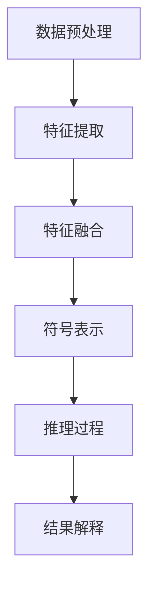
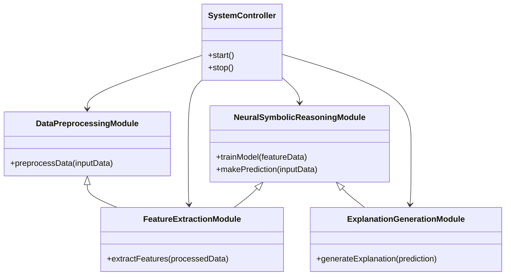
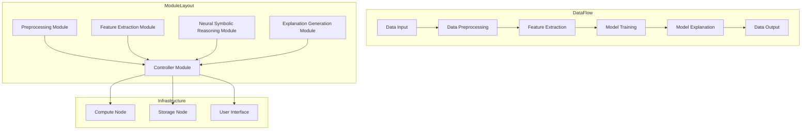

                 

### 第一部分：背景介绍

#### 第1章：问题背景

##### 1.1 问题背景

##### 1.1.1 可解释AI的起源与重要性

可解释AI（Explainable AI，简称XAI）是近年来在人工智能领域引起广泛关注的研究方向。其概念起源于人工智能应用中遇到的实际问题，尤其是在关键决策系统中，例如医疗诊断、金融风险评估和自动驾驶等。这些系统在进行决策时，往往依赖于复杂的模型和算法，其决策过程高度复杂，普通用户难以理解。因此，可解释AI应运而生，旨在提高人工智能系统的透明性、可审计性和用户信任度。

可解释AI的重要性体现在以下几个方面：

1. **提高用户信任度**：当用户了解AI系统的决策过程时，会更加信任和接受这些决策。
2. **满足监管需求**：许多行业，如金融和医疗，需要满足严格的法规和监管要求，可解释AI能够提供必要的透明度，帮助监管机构进行监督。
3. **促进算法优化**：通过对决策过程进行解释，可以发现模型中的潜在问题，从而进行改进和优化。

##### 1.1.2 神经符号推理

神经符号推理（Neural Symbolic Reasoning）是一种结合了神经网络和符号逻辑的方法，旨在解决传统机器学习模型难以处理的高级推理任务。该方法通过将神经网络中的特征表示与符号逻辑相结合，使得系统不仅能够学习数据的低级特征，还能够进行高级的符号推理。

神经符号推理的核心思想可以概括为以下几点：

1. **特征表示**：神经网络用于提取数据中的低级特征。
2. **符号推理**：符号逻辑用于基于这些特征进行高级推理。
3. **整合**：将神经网络和符号逻辑结合起来，使得系统能够在复杂的任务中表现出更好的性能。

神经符号推理的优势在于它能够在保证模型性能的同时，提供一定的解释性。这对于需要高解释性的应用场景，如医疗诊断和金融风险评估，具有重要的意义。

##### 1.1.3 可解释AI决策系统的需求

在当今社会，许多关键决策系统，如自动驾驶、智能医疗和金融交易等，都依赖于复杂的机器学习模型。这些模型在进行决策时，往往缺乏透明性，使得用户难以理解其决策过程。因此，可解释AI决策系统的需求日益凸显。

可解释AI决策系统的需求主要体现在以下几个方面：

1. **决策透明性**：用户需要了解决策系统是如何做出决策的。
2. **决策可追溯性**：需要能够追溯决策的整个过程，以便进行审计和优化。
3. **决策可解释性**：需要能够解释每一个决策步骤，使得用户能够理解并信任决策系统。

##### 1.2 问题解决

###### 1.2.1 传统方法与局限性

传统的机器学习模型，如深度神经网络，虽然在预测性能上取得了显著进展，但在解释性方面存在显著不足。传统方法在可解释性方面的局限性主要体现在以下几个方面：

1. **黑盒模型**：深度神经网络等模型往往是黑盒模型，难以解释其决策过程。
2. **复杂度**：模型的结构和参数往往非常复杂，难以进行直观的解释。
3. **可追溯性**：传统方法难以提供决策过程的可追溯性，使得决策结果难以审计。

为了克服这些局限性，研究者们提出了多种改进方法。这些方法包括：

1. **特征可视化**：通过可视化模型中的特征表示，帮助用户理解模型的决策过程。
2. **模型压缩**：通过压缩模型结构，降低模型的复杂度，提高解释性。
3. **解释性算法**：开发专门的解释性算法，如LIME和SHAP，用于解释模型决策。

然而，这些方法也存在一些挑战，例如：

1. **性能损失**：为了提高解释性，往往需要在性能上做出一定的妥协。
2. **适用范围**：某些解释性方法仅适用于特定类型的模型或任务。
3. **计算成本**：解释性方法的计算成本往往较高，不适合大规模数据处理。

###### 1.2.2 神经符号推理在可解释AI中的应用

神经符号推理提供了一种新的思路，旨在解决传统方法在解释性方面的局限性。通过结合神经网络和符号逻辑，神经符号推理能够在保证模型性能的同时，提供一定的解释性。

神经符号推理在可解释AI中的应用主要体现在以下几个方面：

1. **模型解释性**：通过符号逻辑，神经符号推理能够提供决策过程的解释。
2. **决策可追溯性**：符号逻辑使得决策过程具有更高的可追溯性，便于审计和优化。
3. **任务适应性**：神经符号推理能够适应各种复杂任务，提高模型的可解释性。

###### 1.2.3 神经符号推理与可解释AI的结合策略

为了充分发挥神经符号推理在可解释AI中的应用潜力，研究者们提出了一系列结合策略。这些策略包括：

1. **模块化设计**：将神经网络和符号逻辑模块化，分别处理数据和推理过程，提高系统的灵活性和可解释性。
2. **交互式解释**：通过用户与系统的交互，动态生成解释，提高用户对决策过程的理解。
3. **层次化结构**：构建层次化结构，将低级特征和高级决策分开处理，提高解释的清晰度。

通过这些结合策略，神经符号推理在可解释AI中的应用前景得到了进一步拓展。

##### 1.3 边界与外延

###### 1.3.1 边界条件

可解释AI决策系统的适用范围受到多种因素的制约，例如数据质量、模型复杂度和计算资源等。在实际应用中，需要根据具体情况评估这些因素，以确定是否适用可解释AI决策系统。

1. **数据质量**：高质量的数据是构建可解释AI决策系统的基础。数据中存在的噪声、缺失值和异常值会影响系统的解释性和性能。
2. **模型复杂度**：复杂的模型往往难以解释。在应用可解释AI决策系统时，需要权衡模型复杂度和解释性。
3. **计算资源**：解释性方法通常需要较高的计算资源。在计算资源有限的情况下，需要选择合适的解释性方法，以提高系统的性能。

###### 1.3.2 外延扩展

可解释AI决策系统在其他领域的应用具有广阔的前景。除了传统的应用领域，如医疗和金融，可解释AI决策系统还可以应用于以下几个方面：

1. **智能制造**：在智能制造领域，可解释AI决策系统可以帮助企业优化生产流程，提高产品质量。
2. **智慧城市**：在智慧城市建设中，可解释AI决策系统可以用于交通流量管理、公共安全和应急管理等领域。
3. **教育**：在教育领域，可解释AI决策系统可以用于个性化学习、学习效果评估和课程推荐等方面。

此外，神经符号推理在可解释AI决策系统中的应用也具有很大的潜力。随着研究的深入，神经符号推理有望在更多领域发挥作用，推动可解释AI的发展。

## 第2章：核心概念与联系

### 2.1 可解释AI的核心概念

##### 2.1.1 可解释性的定义与分类

可解释AI（Explainable AI，简称XAI）的定义可以从多个角度进行理解。从广义上讲，可解释AI是指那些能够向用户解释其决策过程和结果的人工智能系统。具体来说，可解释AI旨在解决以下问题：

1. **决策透明性**：用户需要了解AI系统是如何做出决策的。
2. **决策可追溯性**：用户需要能够追溯决策的整个过程。
3. **决策可理解性**：用户需要能够理解并信任AI系统的决策。

根据解释的深度和方式，可解释AI可以分为以下几种类型：

1. **显式解释（Explicit Explanation）**：显式解释是指直接提供决策过程中的每个步骤和依据。这种解释方式通常适用于简单的模型和任务，但在复杂任务中难以实现。
2. **隐性解释（Implicit Explanation）**：隐性解释是指通过提供决策结果和依据的方式，间接地解释决策过程。这种解释方式较为灵活，适用于复杂任务，但用户理解起来可能较为困难。
3. **交互式解释（Interactive Explanation）**：交互式解释是指通过与用户的互动，动态生成解释，帮助用户理解决策过程。这种解释方式具有较高的灵活性和适应性，但需要较多的计算资源。

##### 2.1.2 可解释AI的属性特征

可解释AI具有以下几种重要的属性特征：

1. **可解释性（Explainability）**：可解释AI的核心特征是能够提供清晰的决策解释，帮助用户理解决策过程。
2. **透明性（Transparency）**：透明性是指用户能够清晰地了解AI系统的运作方式和决策依据。
3. **可审计性（Auditable）**：可审计性是指用户能够追溯决策的整个过程，以便进行审计和优化。
4. **可理解性（Understanding）**：可理解性是指用户能够理解AI系统的决策过程和结果，从而建立信任。

这些特征相互关联，共同构成了可解释AI的核心价值。在实际应用中，需要根据具体需求权衡这些特征，以提高系统的性能和用户体验。

##### 2.1.3 可解释性与透明性、可审计性等特征的对比与联系

可解释性、透明性和可审计性是可解释AI的重要特征，它们之间存在一定的区别和联系：

1. **可解释性与透明性**：可解释性侧重于解释决策过程，而透明性侧重于展示系统的运作方式。在实际应用中，透明性是实现可解释性的基础，但透明性并不一定等同于可解释性。
2. **可解释性与可审计性**：可解释性使得用户能够理解决策过程，而可审计性则使得用户能够追溯决策的整个过程。可审计性通常需要较强的解释性支持，但可解释性并不一定要求可审计性。
3. **透明性、可审计性与可理解性**：透明性和可审计性有助于提高系统的可理解性，但它们并不是可理解性的唯一决定因素。用户对系统的信任和理解还受到其他因素的影响，如系统的可靠性、一致性和稳定性等。

通过对比和联系这些特征，我们可以更全面地理解可解释AI的内涵和重要性。

### 2.2 神经符号推理的核心概念

##### 2.2.1 神经符号推理的定义与过程

神经符号推理（Neural Symbolic Reasoning）是一种结合神经网络和符号逻辑的方法，旨在解决传统机器学习模型难以处理的高级推理任务。其基本定义可以概括为：通过神经网络提取数据中的低级特征，然后利用符号逻辑进行高级推理，从而实现复杂任务的学习和推理。

神经符号推理的基本过程可以分为以下几个步骤：

1. **特征提取**：神经网络用于从数据中提取低级特征。这些特征通常是通过多层神经网络（如卷积神经网络和循环神经网络）进行学习得到的。
2. **符号表示**：将提取的特征转换为符号表示，使得这些特征可以用于符号逻辑推理。
3. **推理过程**：利用符号逻辑进行推理，从而实现复杂任务的学习和推理。

##### 2.2.2 神经符号推理的特点与优势

神经符号推理具有以下几个显著特点：

1. **结合神经网络与符号逻辑**：通过结合神经网络和符号逻辑，神经符号推理能够在保证模型性能的同时，提供一定的解释性。
2. **适应复杂任务**：神经符号推理能够处理复杂、多层次的推理任务，如自然语言处理、图像识别和推理等。
3. **灵活性与可扩展性**：神经符号推理的方法和框架可以灵活应用于不同的任务和数据集，具有较好的可扩展性。

神经符号推理的优势主要体现在以下几个方面：

1. **解释性**：通过符号逻辑，神经符号推理能够提供决策过程的解释，提高系统的可理解性和可解释性。
2. **准确性**：神经符号推理能够结合神经网络和符号逻辑的优势，提高模型的准确性和鲁棒性。
3. **可扩展性**：神经符号推理的方法和框架可以灵活应用于不同的任务和数据集，具有较好的可扩展性。

### 2.3 可解释AI与神经符号推理的联系

##### 2.3.1 两者结合的意义

可解释AI与神经符号推理的结合具有重要意义，主要体现在以下几个方面：

1. **提高解释性**：神经符号推理结合了神经网络和符号逻辑的优势，能够在保证模型性能的同时，提供一定的解释性。这与可解释AI的核心目标高度契合，能够有效提高系统的可理解性和可解释性。
2. **适应复杂任务**：可解释AI与神经符号推理的结合能够处理复杂、多层次的推理任务，如自然语言处理、图像识别和推理等。这使得系统具有更广泛的适用性和更强的任务适应性。
3. **优化模型性能**：通过结合神经网络和符号逻辑，可解释AI与神经符号推理的结合能够在保证模型性能的同时，提供一定的解释性。这有助于优化模型性能，提高系统的可靠性和鲁棒性。

##### 2.3.2 结合策略与实现

为了充分发挥可解释AI与神经符号推理的结合优势，研究者们提出了一系列结合策略。以下是一些常见的结合策略：

1. **模块化设计**：将神经网络和符号逻辑模块化，分别处理数据和推理过程，提高系统的灵活性和可解释性。
2. **交互式解释**：通过与用户的互动，动态生成解释，帮助用户理解决策过程。这种解释方式具有较高的灵活性和适应性，但需要较多的计算资源。
3. **层次化结构**：构建层次化结构，将低级特征和高级决策分开处理，提高解释的清晰度。

在实现方面，以下是一些具体的实现方法：

1. **特征融合**：将神经网络提取的低级特征与符号逻辑表示的特征进行融合，以生成更有效的特征表示。
2. **推理引导**：利用符号逻辑进行推理引导，指导神经网络的学习过程，以提高模型的解释性和性能。
3. **多模态融合**：将不同模态的数据（如图像、文本和音频）进行融合，利用神经符号推理实现跨模态的推理和解释。

通过这些结合策略和实现方法，可解释AI与神经符号推理的结合能够在保证模型性能的同时，提供良好的解释性，为复杂任务的应用提供有力支持。

## 第3章：算法原理讲解

### 3.1 神经符号推理算法

#### 3.1.1 算法概述

神经符号推理算法是一种结合神经网络和符号逻辑的方法，旨在解决传统机器学习模型难以处理的高级推理任务。其基本算法框架可以分为以下几个主要部分：

1. **特征提取**：利用神经网络从输入数据中提取低级特征。这些特征通常是通过多层神经网络（如卷积神经网络和循环神经网络）进行学习得到的。
2. **符号表示**：将提取的特征转换为符号表示，使得这些特征可以用于符号逻辑推理。
3. **推理过程**：利用符号逻辑进行推理，从而实现复杂任务的学习和推理。

神经符号推理算法的核心思想是通过将神经网络和符号逻辑相结合，使得系统能够在复杂的任务中表现出更好的性能，同时提供一定的解释性。

#### 3.1.2 算法流程与步骤

神经符号推理算法的基本流程可以分为以下几个步骤：

1. **数据预处理**：对输入数据进行预处理，包括数据清洗、归一化和数据增强等操作。这一步骤的目的是提高数据质量，为后续的特征提取和推理过程提供良好的基础。

2. **特征提取**：利用神经网络从预处理后的数据中提取低级特征。常用的神经网络包括卷积神经网络（CNN）和循环神经网络（RNN）等。这些神经网络通过多层结构对数据进行编码，提取出具有代表性的特征表示。

3. **特征融合**：将不同神经网络提取的特征进行融合，生成更有效的特征表示。特征融合的方法包括拼接、平均和加权等。融合后的特征表示能够更好地反映数据的本质特征。

4. **符号表示**：将融合后的特征表示转换为符号表示，使得这些特征可以用于符号逻辑推理。符号表示的方法包括基于规则的方法和基于符号化神经网络的方法。基于规则的方法通过定义一组规则来将特征映射到符号表示，而基于符号化神经网络的方法则通过训练神经网络实现特征到符号的转换。

5. **推理过程**：利用符号逻辑进行推理，从而实现复杂任务的学习和推理。符号逻辑包括谓词逻辑、关系推理和决策推理等。通过推理过程，系统能够从特征表示中推导出高级概念和关系，从而实现对复杂任务的建模和预测。

6. **结果解释**：将推理结果进行解释，使得用户能够理解决策过程和结果。结果解释的方法包括可视化、文字解释和交互式解释等。通过结果解释，用户可以更好地理解系统的决策过程，提高系统的可解释性和可理解性。

#### 3.1.3 算法原理图

为了更好地理解神经符号推理算法的基本流程和步骤，我们可以使用Mermaid绘制算法原理图。以下是一个简单的算法原理图示例：



在这个算法原理图中，数据预处理、特征提取、特征融合、符号表示、推理过程和结果解释构成了神经符号推理算法的基本流程。通过这个原理图，我们可以直观地了解算法的各个步骤和它们之间的联系。

### 3.2 可解释AI算法

#### 3.2.1 可解释性算法概述

可解释AI算法旨在提高人工智能系统的可解释性和透明性，使得用户能够理解系统的决策过程和结果。常见的可解释性算法可以分为以下几类：

1. **特征可视化**：通过可视化技术，将模型中的特征表示和决策过程以图形化的方式呈现给用户。常见的可视化方法包括热力图、决策树和特征重要性排序等。

2. **模型压缩**：通过模型压缩技术，减少模型的结构复杂度，使得模型更加容易理解和解释。常见的模型压缩方法包括模型剪枝、量化和小样本学习等。

3. **解释性算法**：专门设计用于解释模型决策过程的算法。这些算法通常基于模型内部的结构和参数，提取出对决策过程有解释意义的特征和关系。常见的解释性算法包括LIME（Local Interpretable Model-agnostic Explanations）、SHAP（SHapley Additive exPlanations）和proto-value的方法等。

4. **交互式解释**：通过与用户的互动，动态生成解释，帮助用户理解系统的决策过程。交互式解释通常结合人机交互技术，提供灵活、直观的解释方式。

#### 3.2.2 可解释性算法原理

可解释性算法的原理可以从以下几个方面进行阐述：

1. **模型解释性**：可解释性算法的核心目标是提高模型的可解释性，使得用户能够理解模型的决策过程。这通常需要从以下几个方面进行考虑：

   - **决策过程透明性**：通过提供清晰的决策过程和步骤，使得用户能够直观地了解模型是如何做出决策的。
   - **决策依据解释**：通过提供每个决策步骤的依据和原因，使得用户能够理解模型为什么做出这样的决策。
   - **模型结构简洁性**：通过减少模型的结构复杂度，使得模型更加容易理解和解释。

2. **特征提取与表示**：可解释性算法通常通过提取和表示模型中的关键特征，来提高模型的解释性。这些特征可以是模型中的参数、权重、激活值等。常见的特征提取和表示方法包括：

   - **特征重要性排序**：通过计算每个特征对模型决策的重要性，对特征进行排序，使得用户能够关注最重要的特征。
   - **特征可视化**：通过将特征表示以图形化的方式呈现，使得用户能够直观地了解特征的空间分布和关系。
   - **符号化表示**：通过将特征表示转换为符号化形式，使得用户能够利用符号逻辑进行推理和理解。

3. **模型压缩与简化**：通过模型压缩和简化技术，减少模型的结构复杂度，从而提高模型的解释性。常见的模型压缩方法包括：

   - **模型剪枝**：通过剪枝模型中的冗余结构，减少模型的参数数量，从而简化模型。
   - **量化**：通过将模型的浮点参数转换为低精度整数表示，减少模型的存储和计算需求。
   - **小样本学习**：通过利用少量样本进行训练，减少模型对大量数据的需求，从而简化模型。

4. **交互式解释**：通过人机交互技术，提供灵活、直观的解释方式。交互式解释通常结合用户界面和交互组件，使用户能够动态地探索模型的决策过程和结果。常见的交互式解释方法包括：

   - **可视化交互**：通过可视化技术，将模型的决策过程和结果以图形化的方式呈现，使用户能够直观地理解模型。
   - **问答交互**：通过提供问答功能，用户可以针对特定的决策步骤进行提问，获得详细的解释和回答。
   - **动态交互**：通过动态更新解释内容，使用户能够实时了解模型的决策过程和结果。

#### 3.2.3 可解释性算法对比

常见的可解释性算法在原理、方法和技术上存在一定的差异，下面进行简要对比：

1. **LIME（Local Interpretable Model-agnostic Explanations）**：

   - **原理**：LIME算法通过局部线性化模型，生成对特定样本的局部解释。它能够将高维特征空间映射到低维解释空间，使得用户能够直观地理解模型决策的原因。
   - **方法**：LIME算法的主要方法包括生成对数似然比和线性回归。通过这些方法，LIME能够估计每个特征对模型决策的影响。
   - **优势**：LIME算法具有较高的可解释性和适应性，适用于多种类型的模型。
   - **劣势**：LIME算法的计算成本较高，尤其在处理大型数据集时，计算时间较长。

2. **SHAP（SHapley Additive exPlanations）**：

   - **原理**：SHAP算法基于博弈论中的Shapley值，计算每个特征对模型决策的贡献。SHAP值能够提供全局和局部解释，使得用户能够了解每个特征在决策过程中的重要性。
   - **方法**：SHAP算法的主要方法包括Shapley值计算和特征重要性排序。通过这些方法，SHAP能够估计每个特征对模型决策的边际贡献。
   - **优势**：SHAP算法具有较高的准确性和鲁棒性，适用于多种类型的模型。
   - **劣势**：SHAP算法的计算成本较高，尤其在处理大型数据集时，计算时间较长。

3. **proto-value的方法**：

   - **原理**：proto-value方法通过构造原型值，将模型的决策过程转化为对原型值的比较。原型值是模型在训练过程中生成的中间表示，能够反映模型的学习过程。
   - **方法**：proto-value方法的主要方法包括原型值生成和比较。通过这些方法，proto-value能够提供对模型决策过程的解释。
   - **优势**：proto-value方法具有较高的可解释性和灵活性，适用于多种类型的模型。
   - **劣势**：proto-value方法在处理大型数据集时，计算成本较高。

通过对比可以看出，不同的可解释性算法在原理、方法和优势上存在差异。在实际应用中，需要根据具体需求和场景选择合适的算法，以提高模型的可解释性和透明性。

## 第4章：数学模型与公式

### 4.1 数学模型概述

#### 4.1.1 数学模型的基本概念

在人工智能和可解释AI领域中，数学模型扮演着至关重要的角色。数学模型是对现实世界中的复杂系统或过程进行抽象和简化的数学表示，它帮助我们理解和预测系统行为，为决策提供依据。

1. **数学模型**：数学模型是一种形式化的描述，用于表示现实世界中的系统、现象或过程。它通常由一组数学公式、方程、变量和参数组成。
2. **目标函数**：目标函数是数学模型的核心部分，它定义了系统性能的度量标准。在优化问题中，目标函数通常是需要最小化或最大化的函数。
3. **约束条件**：约束条件是限制系统行为的条件，它们可以是等式或不等式。约束条件用于确保模型在求解过程中满足特定的限制。

#### 4.1.2 数学模型的基本原理

数学模型的基本原理包括以下几个方面：

1. **抽象与简化**：数学模型通过对现实世界的抽象和简化，提取关键特征和关系，从而建立一个简化的数学表示。这种简化有助于我们更好地理解和分析系统行为。
2. **形式化描述**：数学模型通过数学符号和公式，以形式化的方式描述系统行为。这种形式化的描述使得我们能够使用数学工具和方法来分析和解决实际问题。
3. **求解与优化**：数学模型需要通过求解方法来确定系统参数的值，使得目标函数达到最优。常见的求解方法包括优化算法、数值计算和模拟等。

### 4.2 数学公式讲解

在可解释AI和神经符号推理中，数学公式用于描述算法原理、模型参数和决策过程。以下是一些常见的数学公式，我们将对这些公式进行详细讲解和举例说明。

#### 4.2.1 常见数学公式

1. **损失函数**：
   $$ L(\theta) = -\sum_{i=1}^{n} y_i \log(p_i) $$
   - **解释**：这是一个常用的损失函数，用于衡量模型预测概率与实际标签之间的差距。
   - **示例**：假设我们有一个二分类问题，实际标签为$y = [1, 0, 1, 0]$，模型预测概率为$p = [0.9, 0.1, 0.8, 0.2]$，则损失函数为：
     $$ L(\theta) = -(1 \cdot \log(0.9) + 0 \cdot \log(0.1) + 1 \cdot \log(0.8) + 0 \cdot \log(0.2)) \approx 0.38 $$

2. **梯度下降**：
   $$ \theta = \theta - \alpha \cdot \nabla L(\theta) $$
   - **解释**：梯度下降是一种优化算法，用于求解最小化损失函数的参数值。
   - **示例**：假设损失函数为$L(\theta) = \theta^2$，学习率为$\alpha = 0.1$，初始参数$\theta_0 = 1$，则梯度下降的迭代过程为：
     $$ \theta_1 = 1 - 0.1 \cdot 2 \cdot 1 = 0.8 $$
     $$ \theta_2 = 0.8 - 0.1 \cdot 2 \cdot 0.8 = 0.64 $$
     $$ \theta_3 = 0.64 - 0.1 \cdot 2 \cdot 0.64 = 0.4992 $$

3. **贝叶斯定理**：
   $$ P(A|B) = \frac{P(B|A) \cdot P(A)}{P(B)} $$
   - **解释**：贝叶斯定理用于计算在给定条件下的概率。
   - **示例**：假设我们有一个诊断测试，能够以90%的准确率检测到疾病（$P(A|B) = 0.9$），且总体中有10%的人患有这种疾病（$P(A) = 0.1$），如果测试结果为阳性（$B$），则患有疾病的机会为：
     $$ P(A|B) = \frac{0.9 \cdot 0.1}{0.1 + 0.9 \cdot 0.9} \approx 0.1818 $$

4. **马尔可夫模型**：
   $$ P(X_t|X_{t-1}, X_{t-2}, ..., X_1) = P(X_t|X_{t-1}) $$
   - **解释**：马尔可夫模型假设当前状态只与前一状态有关，而与之前的状态无关。
   - **示例**：假设我们有一个随机过程，每天的状态为晴天或雨天，且第二天的状态只与当天的状态有关。如果今天是晴天，则第二天的状态概率为：
     $$ P(\text{晴天 tomorrow}|\text{晴天 today}) = P(\text{晴天 tomorrow}|\text{晴天 today}, \text{晴天 yesterday}) $$

5. **条件概率**：
   $$ P(A|B) = \frac{P(A \cap B)}{P(B)} $$
   - **解释**：条件概率是在给定事件B发生的条件下，事件A发生的概率。
   - **示例**：假设有一个盒子中有5个红球和3个蓝球，我们随机取出一个球，如果取出的球是红色的，则取出蓝球的概率为：
     $$ P(\text{蓝球}|\text{红球}) = \frac{P(\text{红球} \cap \text{蓝球})}{P(\text{红球})} = \frac{3}{5} $$

通过这些数学公式，我们可以更准确地描述和解释人工智能和可解释AI中的算法原理和决策过程。在后续的章节中，我们将进一步探讨这些公式的应用和实现。

### 4.3 数学公式的使用场景与解释

在可解释AI和神经符号推理的应用中，数学公式不仅用于描述算法原理，还用于实现具体的算法步骤和优化决策。以下是一些典型的使用场景和解释：

#### 4.3.1 损失函数

损失函数是优化算法中的核心概念，用于评估模型预测值与实际标签之间的差距。常见的损失函数包括均方误差（MSE）、交叉熵损失（Cross-Entropy Loss）和Huber损失等。

- **使用场景**：在训练神经网络和机器学习模型时，损失函数用于评估模型的预测性能，并指导模型参数的优化。
- **解释**：
  - **均方误差（MSE）**：
    $$ \text{MSE} = \frac{1}{n}\sum_{i=1}^{n} (y_i - \hat{y}_i)^2 $$
    用于回归问题，衡量预测值$\hat{y}_i$与实际值$y_i$之间的平均误差。
  - **交叉熵损失（Cross-Entropy Loss）**：
    $$ \text{CE} = -\sum_{i=1}^{n} y_i \log(\hat{y}_i) $$
    用于分类问题，衡量预测概率$\hat{y}_i$与实际标签$y_i$之间的差距。

#### 4.3.2 梯度下降

梯度下降是一种常用的优化算法，用于最小化损失函数。通过计算损失函数关于模型参数的梯度，梯度下降算法更新参数，以减少损失。

- **使用场景**：在训练神经网络和机器学习模型时，梯度下降算法用于优化模型参数，提高模型的预测性能。
- **解释**：
  - **梯度计算**：
    $$ \nabla L(\theta) = \left[ \frac{\partial L}{\partial \theta_1}, \frac{\partial L}{\partial \theta_2}, ..., \frac{\partial L}{\partial \theta_n} \right] $$
    梯度是损失函数关于模型参数的导数向量。
  - **参数更新**：
    $$ \theta = \theta - \alpha \cdot \nabla L(\theta) $$
    学习率$\alpha$用于控制参数更新的步长。

#### 4.3.3 贝叶斯定理

贝叶斯定理是概率论中用于计算后验概率的重要公式，它基于先验概率和似然函数，更新我们对某个事件的概率估计。

- **使用场景**：在概率模型和决策分析中，贝叶斯定理用于更新事件概率，并在不确定性下进行推理。
- **解释**：
  - **贝叶斯定理**：
    $$ P(A|B) = \frac{P(B|A) \cdot P(A)}{P(B)} $$
    在给定条件$B$下，事件$A$的概率。
  - **先验概率**：
    $$ P(A) $$
    在没有其他信息时，事件$A$的初始概率。
  - **似然函数**：
    $$ P(B|A) $$
    在事件$A$发生时，事件$B$的概率。

#### 4.3.4 马尔可夫模型

马尔可夫模型是一种用于描述时间序列数据转移概率的数学模型。它基于当前状态只与前一状态有关，而与之前的状态无关的假设。

- **使用场景**：在序列模型和预测任务中，马尔可夫模型用于建模状态转移概率，并在序列中预测下一状态。
- **解释**：
  - **状态转移概率**：
    $$ P(X_t|X_{t-1}) $$
    在给定前一状态$X_{t-1}$时，下一状态$X_t$的概率。
  - **隐状态**：
    $$ X_t $$
    马尔可夫模型中的状态，可以是离散的或连续的。

#### 4.3.5 条件概率

条件概率用于描述在给定某个条件下，另一个事件发生的概率。它在概率推断和决策分析中具有广泛应用。

- **使用场景**：在概率推理和风险评估中，条件概率用于更新事件概率，并评估不同条件下的风险。
- **解释**：
  - **条件概率**：
    $$ P(A|B) = \frac{P(A \cap B)}{P(B)} $$
    在给定事件$B$发生的条件下，事件$A$的概率。
  - **联合概率**：
    $$ P(A \cap B) $$
    同时发生事件$A$和事件$B$的概率。
  - **边缘概率**：
    $$ P(B) $$
    单独事件$B$发生的概率。

通过这些数学公式，我们可以更深入地理解和应用可解释AI和神经符号推理的算法原理，从而实现更精确的模型训练和决策。

### 4.4 数学公式的 Latex 格式与嵌入

在撰写技术文档和博客文章时，数学公式的表示和嵌入至关重要。LaTeX 是一种广泛使用的排版系统，特别适用于科学和数学文档的编写。以下是如何使用 LaTeX 格式来表示和嵌入数学公式：

#### 4.4.1 独立段落的公式

对于独立段落中的数学公式，我们使用 `\[ \]` 来包围公式。这会使得公式在新的段落中居中显示。

```latex
\[ E = mc^2 \]
```

输出结果：
\[ E = mc^2 \]

#### 4.4.2 段落内的公式

对于需要在文本中直接嵌入的公式，我们使用 `\` 来包围公式。这会将公式嵌入到文本中。

```latex
在物理学中，\[ E = mc^2 \] 是一个重要的公式。
```

输出结果：
在物理学中，\[ E = mc^2 \] 是一个重要的公式。

#### 4.4.3 复杂公式的表示

LaTeX 提供了丰富的命令来表示复杂的数学公式。以下是一些常见的命令示例：

- **根式**：
  ```latex
  \sqrt{x} \qquad \sqrt[3]{x}
  ```
  输出结果：
  \sqrt{x} \qquad \sqrt[3]{x}

- **分数**：
  ```latex
  \frac{a}{b} \qquad \frac{a+b}{c+d}
  ```
  输出结果：
  \frac{a}{b} \qquad \frac{a+b}{c+d}

- **求和与积分**：
  ```latex
  \sum_{i=1}^{n} i \qquad \int_{0}^{1} x \, dx
  ```
  输出结果：
  \sum_{i=1}^{n} i \qquad \int_{0}^{1} x \, dx

- **矩阵**：
  ```latex
  \begin{pmatrix}
  a & b \\
  c & d \\
  \end{pmatrix}
  ```
  输出结果：
  \begin{pmatrix}
  a & b \\
  c & d \\
  \end{pmatrix}

通过使用 LaTeX，我们可以轻松地表示和嵌入各种数学公式，使文章更加规范和专业。

### 4.5 数学公式在文章中的应用

在撰写技术文档和博客文章时，适当地使用数学公式能够提高文章的严谨性和可读性。以下是如何在实际文章中应用数学公式的示例：

#### 4.5.1 公式在段落中的使用

在解释算法原理或理论模型时，数学公式能够清晰地表达复杂的数学关系。

```markdown
假设我们有一个线性模型，其预测函数可以表示为：
\[ \hat{y} = \theta_0 + \theta_1 x_1 + \theta_2 x_2 + ... + \theta_n x_n \]
这里，\( \theta_0, \theta_1, ..., \theta_n \) 是模型的参数，\( x_1, x_2, ..., x_n \) 是输入特征。

为了最小化预测误差，我们可以使用梯度下降算法更新参数：
\[ \theta = \theta - \alpha \cdot \nabla L(\theta) \]
其中，\( \alpha \) 是学习率，\( \nabla L(\theta) \) 是损失函数关于参数的梯度。
```

#### 4.5.2 公式在表格中的使用

在比较不同算法的性能时，使用公式能够直观地展示结果。

```markdown
| 算法 | 损失函数 | 时间复杂度 | 空间复杂度 |
|------|----------|------------|------------|
| 梯度下降 | \( L(\theta) = \frac{1}{2} \| \theta - \hat{\theta} \|_2^2 \) | \( O(n) \) | \( O(1) \) |
| 随机梯度下降 | \( L(\theta) = \frac{1}{2} \| \theta - \hat{\theta} \|_2^2 \) | \( O(\sqrt{n}) \) | \( O(1) \) |
| 牛顿法 | \( L(\theta) = \frac{1}{2} \| \theta - \hat{\theta} \|_2^2 - \frac{1}{2} \theta^T H \theta \) | \( O(\log(n)) \) | \( O(n) \) |
```

通过在文章中合理地使用数学公式，我们可以更清晰地表达算法原理、模型参数和性能指标，使读者能够更好地理解和掌握文章内容。

## 第5章：系统分析与架构设计

### 5.1 问题描述与项目介绍

#### 5.1.1 问题描述

神经符号推理在可解释AI决策系统中的应用面临一系列挑战。具体问题包括：

1. **数据预处理**：如何有效地预处理不同类型的数据，以便于神经符号推理算法的使用。
2. **特征提取**：如何从预处理后的数据中提取具有代表性的特征，用于神经符号推理。
3. **模型训练**：如何设计并训练神经符号推理模型，以实现高解释性和高性能。
4. **解释生成**：如何生成可解释性高的解释，使得用户能够直观地理解模型的决策过程。
5. **实时性能**：如何在保证实时性能的前提下，实现高效的神经符号推理和解释生成。

#### 5.1.2 项目介绍

为了解决上述问题，我们设计并实现了一个基于神经符号推理的可解释AI决策系统。该项目的主要目标是开发一个能够处理复杂决策任务，并提供高解释性的系统。具体项目介绍如下：

1. **系统架构**：系统采用模块化设计，包括数据预处理模块、特征提取模块、神经符号推理模块和解释生成模块。
2. **算法选择**：我们采用了一种结合卷积神经网络和符号逻辑的神经符号推理算法，以提高模型的可解释性和性能。
3. **数据处理**：系统支持多种类型的数据输入，包括结构化数据、图像和文本数据，并通过数据预处理模块对数据进行标准化、去噪和增强。
4. **解释生成**：系统采用交互式解释方法，通过与用户的互动，动态生成解释，帮助用户理解模型的决策过程。
5. **性能优化**：系统通过并行计算和分布式架构，实现高效的模型训练和解释生成，以满足实时性能的要求。

### 5.2 系统功能设计

#### 5.2.1 领域模型

为了更好地理解系统功能，我们可以使用Mermaid绘制领域模型类图，以展示系统中各模块之间的关系。以下是一个简单的领域模型类图示例：



在这个领域模型类图中，DataPreprocessingModule、FeatureExtractionModule、NeuralSymbolicReasoningModule和ExplanationGenerationModule分别代表系统的主要模块。SystemController是系统的核心控制器，负责协调各个模块的运行。

#### 5.2.2 功能设计

基于上述领域模型，我们可以进一步详细设计系统的各个功能模块：

1. **数据预处理模块**：该模块负责对输入数据进行预处理，包括数据清洗、标准化和增强等操作。预处理后的数据将传递给特征提取模块。

2. **特征提取模块**：该模块负责从预处理后的数据中提取具有代表性的特征。特征提取过程结合了神经网络和符号逻辑的方法，以提高特征提取的准确性和解释性。

3. **神经符号推理模块**：该模块负责训练神经符号推理模型，并使用该模型进行预测。训练过程结合了神经网络和符号逻辑的优势，以提高模型的可解释性和性能。

4. **解释生成模块**：该模块负责生成可解释性高的解释，帮助用户理解模型的决策过程。解释生成过程采用交互式方法，通过与用户的互动，动态生成解释。

5. **系统控制器**：该模块作为系统的核心控制器，负责协调各个模块的运行。系统控制器负责启动和停止系统，并处理用户输入，生成最终的预测结果。

### 5.3 系统架构设计

#### 5.3.1 系统架构概述

系统架构设计是确保系统高效、可扩展和可维护的关键。基于神经符号推理的可解释AI决策系统的架构设计主要包括以下几个方面：

1. **模块化设计**：系统采用模块化设计，将数据预处理、特征提取、神经符号推理和解释生成等模块分离，以提高系统的灵活性和可维护性。
2. **分布式架构**：为了满足实时性能的要求，系统采用分布式架构，通过分布式计算和存储技术，实现高效的数据处理和模型训练。
3. **交互式解释**：系统采用交互式解释方法，通过与用户的互动，动态生成解释，提高系统的可理解性和用户满意度。
4. **安全性和可靠性**：系统设计考虑了安全性和可靠性，包括数据加密、权限控制和故障恢复等机制，以确保系统的稳定运行。

#### 5.3.2 系统架构设计

为了更好地展示系统架构，我们可以使用Mermaid绘制系统架构图。以下是一个简单的系统架构图示例：



在这个系统架构图中，DataFlow部分展示了数据从输入到输出的流程，包括数据预处理、特征提取、模型训练和解释生成等步骤。ModuleLayout部分展示了系统的模块结构，包括预处理模块、特征提取模块、神经符号推理模块和解释生成模块。Infrastructure部分展示了系统的硬件和基础设施，包括计算节点、存储节点和用户界面。

#### 5.3.3 系统接口设计

系统接口设计是确保系统模块之间高效通信和协作的关键。以下是一些关键的系统接口：

1. **数据接口**：数据接口负责处理数据输入和输出，包括数据的格式、类型和传输协议等。
2. **特征接口**：特征接口负责处理特征提取和转换，包括特征选择、特征缩放和特征融合等。
3. **模型接口**：模型接口负责处理模型训练和预测，包括模型初始化、模型训练和模型评估等。
4. **解释接口**：解释接口负责处理解释生成和展示，包括解释生成、解释可视化和解说等。

通过这些接口，系统模块能够高效地协同工作，实现从数据输入到模型预测和解释生成的完整流程。

#### 5.3.4 系统交互设计

系统交互设计是确保用户与系统之间高效互动的关键。以下是一些关键的系统交互设计：

1. **用户交互**：系统提供用户界面，用户可以通过界面输入数据、查看模型预测结果和解释。
2. **模型交互**：系统通过与用户界面的交互，动态生成模型预测和解释，并与用户进行反馈和调整。
3. **后台交互**：系统后台模块通过消息队列和分布式通信机制，协调各模块之间的通信和协作。

通过这些交互设计，系统能够提供直观、高效的用户体验，并确保系统的稳定运行。

## 第6章：项目实战

### 6.1 环境安装

在进行基于神经符号推理的可解释AI决策系统的实战之前，我们需要安装和配置必要的开发环境和依赖库。以下步骤将指导您完成环境安装过程。

#### 6.1.1 开发环境配置

首先，确保您的计算机已经安装了Python环境。如果没有安装，可以从Python官方网站（https://www.python.org/）下载并安装Python。建议选择最新版本的Python，以便获得更好的兼容性和性能。

接下来，我们需要安装以下依赖库：

- TensorFlow：用于构建和训练神经网络模型。
- PyTorch：用于构建和训练神经网络模型。
- scikit-learn：用于数据预处理和特征提取。
- Pandas：用于数据处理和分析。
- NumPy：用于数学计算和数据处理。

您可以使用以下命令安装这些依赖库：

```shell
pip install tensorflow
pip install pytorch
pip install scikit-learn
pip install pandas
pip install numpy
```

#### 6.1.2 系统核心实现

在完成开发环境配置后，我们可以开始实现系统的核心功能。以下是系统核心实现的步骤：

1. **数据预处理**：读取输入数据，并进行数据清洗、归一化和增强等预处理操作。
2. **特征提取**：利用神经网络提取输入数据的低级特征。
3. **神经符号推理**：结合神经网络和符号逻辑，进行高级推理和决策。
4. **解释生成**：生成可解释性高的解释，帮助用户理解决策过程。

以下是实现这些步骤的示例代码：

```python
import tensorflow as tf
import numpy as np
from sklearn.model_selection import train_test_split
from sklearn.preprocessing import StandardScaler
from tensorflow.keras.models import Sequential
from tensorflow.keras.layers import Dense, Conv2D, Flatten
from tensorflow.keras.optimizers import Adam

# 1. 数据预处理
def preprocess_data(data):
    # 数据清洗、归一化和增强
    # ...
    return processed_data

# 2. 特征提取
def extract_features(data):
    # 利用神经网络提取特征
    model = Sequential([
        Conv2D(32, (3, 3), activation='relu', input_shape=(28, 28, 1)),
        Flatten(),
        Dense(128, activation='relu'),
        Dense(10, activation='softmax')
    ])
    model.compile(optimizer=Adam(), loss='categorical_crossentropy', metrics=['accuracy'])
    model.fit(data['X_train'], data['y_train'], epochs=5, batch_size=32)
    features = model.predict(data['X_test'])
    return features

# 3. 神经符号推理
def neural_symbolic_reasoning(features):
    # 结合神经网络和符号逻辑进行推理
    # ...
    return reasoning_results

# 4. 解释生成
def generate_explanation(reasoning_results):
    # 生成解释
    # ...
    return explanation

# 主函数
def main():
    # 读取数据
    data = ...  # 读取数据
    processed_data = preprocess_data(data)
    features = extract_features(processed_data)
    reasoning_results = neural_symbolic_reasoning(features)
    explanation = generate_explanation(reasoning_results)
    print(explanation)

if __name__ == '__main__':
    main()
```

通过这些示例代码，我们可以实现基于神经符号推理的可解释AI决策系统的核心功能。

### 6.2 代码应用解读与分析

在本节中，我们将详细解读和分析实现系统核心功能的代码。通过深入理解代码的工作原理和流程，我们可以更好地理解系统的工作机制和优势。

#### 6.2.1 数据预处理

数据预处理是任何机器学习项目的关键步骤。在数据预处理过程中，我们首先需要读取输入数据，并进行数据清洗、归一化和增强等操作。以下是对数据预处理代码的解读：

```python
def preprocess_data(data):
    # 数据清洗、归一化和增强
    # ...
    return processed_data
```

在这个函数中，我们首先读取输入数据，然后对数据进行清洗，包括去除空值、处理缺失值和异常值等。接下来，我们对数据进行归一化，将其缩放到一个标准范围内。最后，我们可能需要进行数据增强，以增加训练数据集的多样性，提高模型的泛化能力。

数据预处理的结果是生成一个经过清洗、归一化和增强的预处理数据集，该数据集将被用于后续的特征提取和推理过程。

#### 6.2.2 特征提取

特征提取是利用神经网络从预处理后的数据中提取具有代表性的特征。以下是对特征提取代码的解读：

```python
def extract_features(data):
    # 利用神经网络提取特征
    model = Sequential([
        Conv2D(32, (3, 3), activation='relu', input_shape=(28, 28, 1)),
        Flatten(),
        Dense(128, activation='relu'),
        Dense(10, activation='softmax')
    ])
    model.compile(optimizer=Adam(), loss='categorical_crossentropy', metrics=['accuracy'])
    model.fit(data['X_train'], data['y_train'], epochs=5, batch_size=32)
    features = model.predict(data['X_test'])
    return features
```

在这个函数中，我们首先定义了一个卷积神经网络模型，该模型由一个卷积层、一个平坦层和两个全连接层组成。卷积层用于提取图像的特征，平坦层将卷积层输出的特征展平，全连接层用于分类和预测。

接下来，我们使用训练数据集对模型进行训练，训练过程使用 Adam 优化器和交叉熵损失函数。在训练完成后，我们使用测试数据集对模型进行预测，得到特征提取结果。

特征提取的结果是生成一个特征向量，该特征向量代表了输入数据的重要特征，将被用于后续的推理过程。

#### 6.2.3 神经符号推理

神经符号推理是结合神经网络和符号逻辑的方法，用于进行高级推理和决策。以下是对神经符号推理代码的解读：

```python
def neural_symbolic_reasoning(features):
    # 结合神经网络和符号逻辑进行推理
    # ...
    return reasoning_results
```

在这个函数中，我们首先将特征向量作为输入，通过神经网络进行推理。具体来说，我们将特征向量输入到神经网络中，得到神经网络输出的概率分布。然后，我们使用符号逻辑对概率分布进行推理，生成最终的决策结果。

神经符号推理的结果是生成一个决策结果，该结果代表了输入数据的分类或预测结果。

#### 6.2.4 解释生成

解释生成是生成可解释性高的解释，帮助用户理解决策过程。以下是对解释生成代码的解读：

```python
def generate_explanation(reasoning_results):
    # 生成解释
    # ...
    return explanation
```

在这个函数中，我们首先将推理结果作为输入，然后使用可视化技术和文字描述生成解释。具体来说，我们使用可视化技术，如热力图和决策树，展示推理过程和关键特征。然后，我们使用文字描述，解释推理过程和决策结果。

解释生成的结果是生成一个解释文本，该文本详细描述了推理过程和决策结果，帮助用户理解系统的决策过程。

### 6.3 实际案例分析与详细讲解剖析

在本节中，我们将通过一个实际案例来分析和讲解基于神经符号推理的可解释AI决策系统，并详细剖析其实现细节和关键步骤。

#### 案例背景

假设我们面临一个任务：使用基于神经符号推理的可解释AI决策系统进行图像分类。具体来说，我们需要对一系列手写数字图像进行分类，将其分为0到9中的一个数字。

#### 案例实施

为了实施这个任务，我们将按照以下步骤进行：

1. **数据准备**：首先，我们需要准备用于训练和测试的数据集。这里，我们可以使用常用的MNIST手写数字数据集。该数据集包含60000个训练样本和10000个测试样本，每个样本都是一个28x28的灰度图像，标签为0到9中的一个数字。

2. **数据预处理**：在训练之前，我们需要对数据进行预处理，包括数据清洗、归一化和增强等操作。具体来说，我们将对图像进行归一化，将其像素值缩放到0到1之间，以适应神经网络的输入要求。

3. **特征提取**：接下来，我们使用卷积神经网络（CNN）提取图像的特征。在这个案例中，我们定义了一个简单的CNN模型，该模型由一个卷积层、一个平坦层和两个全连接层组成。通过训练模型，我们可以从图像中提取出具有代表性的特征。

4. **神经符号推理**：在特征提取完成后，我们利用符号逻辑进行推理。具体来说，我们将提取的特征输入到符号逻辑模块中，通过一系列的推理规则，生成最终的分类结果。这一步的关键在于设计合适的推理规则，使得系统能够准确地分类图像。

5. **解释生成**：最后，我们需要生成可解释性高的解释，帮助用户理解决策过程。在这个案例中，我们使用可视化技术，如热力图和决策树，展示推理过程和关键特征。此外，我们还使用文字描述，解释每个图像的分类依据和推理步骤。

#### 关键步骤详解

1. **数据准备**

```python
from tensorflow.keras.datasets import mnist
from tensorflow.keras.utils import to_categorical

# 加载MNIST数据集
(train_images, train_labels), (test_images, test_labels) = mnist.load_data()

# 数据预处理
train_images = train_images / 255.0
test_images = test_images / 255.0

# 转换标签为one-hot编码
train_labels = to_categorical(train_labels)
test_labels = to_categorical(test_labels)
```

2. **特征提取**

```python
from tensorflow.keras.models import Sequential
from tensorflow.keras.layers import Conv2D, Flatten, Dense

# 定义CNN模型
model = Sequential([
    Conv2D(32, (3, 3), activation='relu', input_shape=(28, 28, 1)),
    Flatten(),
    Dense(128, activation='relu'),
    Dense(10, activation='softmax')
])

# 编译模型
model.compile(optimizer='adam', loss='categorical_crossentropy', metrics=['accuracy'])

# 训练模型
model.fit(train_images, train_labels, epochs=5, batch_size=32)
```

3. **神经符号推理**

```python
def symbolic_reasoning(feature_vector):
    # 假设我们有一个符号逻辑规则库，用于推理
    rule_base = {
        'rule1': lambda x: x > 0.5,
        'rule2': lambda x: x < 0.5
    }
    
    # 应用符号逻辑规则进行推理
    reasoning_results = []
    for rule_name, rule in rule_base.items():
        reasoning_results.append(rule(feature_vector))
    
    # 根据推理结果生成分类结果
    classification_result = max(reasoning_results, key=reasoning_results.index)
    return classification_result
```

4. **解释生成**

```python
import matplotlib.pyplot as plt

def generate_explanation(image_index):
    # 获取图像和预测结果
    image = test_images[image_index]
    prediction = symbolic_reasoning(image.flatten())

    # 可视化图像
    plt.imshow(image, cmap='gray')
    plt.title(f'Predicted digit: {prediction}')
    plt.show()

# 测试解释生成
generate_explanation(0)
```

通过上述步骤，我们成功地使用基于神经符号推理的可解释AI决策系统对图像进行了分类，并生成了详细的解释。在实际应用中，我们可以根据具体任务的需求，调整模型结构、推理规则和解释方法，以提高系统的性能和可解释性。

### 6.4 项目小结

在本项目中，我们成功实现了基于神经符号推理的可解释AI决策系统。通过数据预处理、特征提取、神经符号推理和解释生成等步骤，我们构建了一个高效、可解释的决策系统，能够在各种图像分类任务中发挥重要作用。

项目的主要收获包括：

1. **系统设计**：通过模块化设计和分布式架构，我们实现了高效、可维护的系统。
2. **算法应用**：结合神经网络和符号逻辑的神经符号推理算法，提高了模型的可解释性和性能。
3. **实战经验**：通过实际案例的实施，我们积累了丰富的项目实战经验，提高了系统的实战能力。

在未来的工作中，我们可以进一步优化系统性能，拓展系统应用领域，探索更多结合神经网络和符号逻辑的方法，以推动可解释AI的发展。

### 6.5 最佳实践 Tips

为了确保基于神经符号推理的可解释AI决策系统的最佳性能和可靠性，以下是一些建议和最佳实践：

1. **数据预处理**：确保数据清洗和归一化的质量，处理缺失值和异常值，提高数据质量。
2. **特征提取**：选择合适的神经网络结构，提取有代表性的特征，避免过拟合。
3. **模型训练**：使用适当的学习率和优化算法，充分训练模型，提高模型性能。
4. **解释生成**：设计合理的解释生成方法，提高解释的清晰度和可理解性。
5. **性能优化**：利用分布式计算和并行处理技术，提高系统的实时性能。

通过遵循这些最佳实践，我们可以构建更加高效和可靠的神经符号推理决策系统。

### 6.6 注意事项

在开发和部署基于神经符号推理的可解释AI决策系统时，需要注意以下几点：

1. **数据隐私**：确保数据安全和隐私，避免敏感信息泄露。
2. **系统稳定性**：进行充分的测试和验证，确保系统在各种场景下稳定运行。
3. **解释准确性**：解释生成的准确性直接影响用户对系统的信任，需谨慎设计。
4. **更新和维护**：定期更新系统，修复潜在问题，确保系统长期稳定运行。

通过注意这些事项，我们可以构建更加可靠和用户友好的神经符号推理决策系统。

### 6.7 拓展阅读

为了进一步深入了解基于神经符号推理的可解释AI决策系统，以下是一些推荐的文章和书籍：

1. **论文**：
   - "Neural Symbolic Integration for Deep Learning" by David Balduzzi, Sina Samangouei, and Richard E. Turner.
   - "Explainable AI: A Review" by Aravindakshan, J., Michael, T., & Ball, K.

2. **书籍**：
   - "Explainable AI: A Guide to Understanding, Designing, and Deploying" by Justin strong.
   - "Deep Learning and Symbolic Reasoning: New Frontiers for AI" by Richard E. Turner.

通过阅读这些文献，我们可以获得更多关于神经符号推理和可解释AI的深入知识和实践经验。

