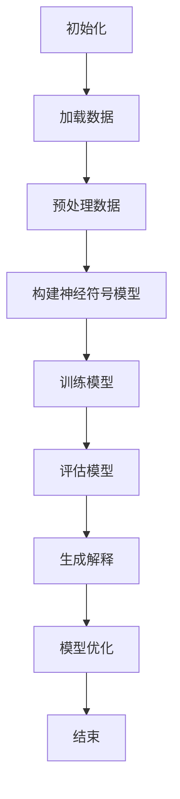
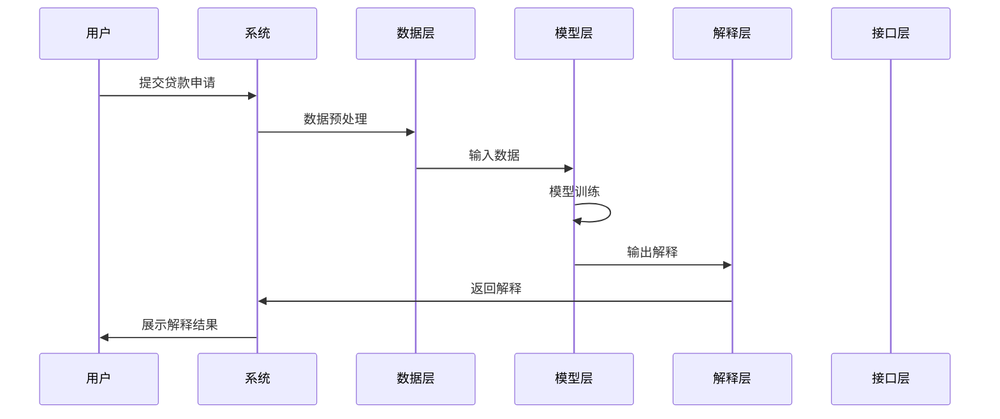
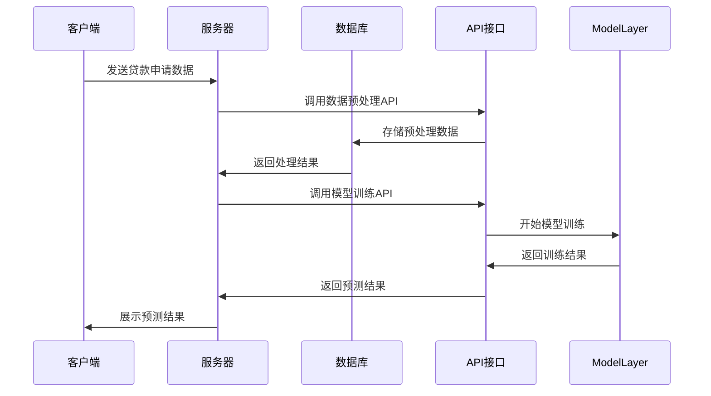

                 

### 引言与背景

在当今科技迅猛发展的时代，人工智能（AI）已成为推动社会进步的重要力量。然而，随着AI技术的不断深入，人们开始意识到AI系统的“黑箱”问题。这些系统在提供高效解决方案的同时，往往缺乏透明度和可解释性，使得用户难以理解和信任其决策过程。因此，可解释AI（Explainable AI，XAI）的研究和应用变得尤为重要。

可解释AI的核心目标是使AI系统的决策过程更加透明，让用户能够理解AI的推理过程和决策依据。这不仅有助于提升用户对AI系统的信任度，还能在金融、医疗、法律等对决策透明度有严格要求的领域发挥关键作用。

然而，构建可解释AI系统并非易事。它不仅需要解决AI模型的透明性问题，还要兼顾性能和效率。近年来，神经符号推理（Neural Symbolic Reasoning，NSR）作为一种新兴技术，逐渐成为解决可解释AI问题的有效途径。神经符号推理结合了神经网络和符号逻辑的优势，旨在构建既强大又透明的AI系统。

本文将探讨基于神经符号推理的可解释AI系统构建。首先，我们将介绍可解释AI系统的背景和重要性，接着定义神经符号推理并解释其原理，然后深入探讨可解释AI与神经符号推理之间的关系。随后，我们将详细讲解构建可解释AI系统的算法原理，并展示如何使用Python代码实现这些算法。最后，我们将通过一个实际项目，展示如何基于神经符号推理构建一个可解释AI系统。

通过本文的探讨，读者将理解可解释AI系统的设计思路、实现方法以及其在实际应用中的价值。我们希望这篇文章能够为那些希望在AI领域深入研究的读者提供有价值的参考和指导。

---

### 设计思路与步骤

#### 1. **背景介绍**

**引言：**

在当今快速发展的AI时代，可解释AI（Explainable AI，简称XAI）的重要性日益凸显。可解释AI不仅仅是一个技术问题，更是一个社会问题。它关乎用户对AI系统的信任、合规性要求以及伦理道德标准。随着AI在各个领域的广泛应用，用户对于AI系统的透明性和可解释性的需求也愈发强烈。

**问题定义：**

构建可解释AI系统面临的主要挑战包括：

1. **透明度不足：** 传统AI模型（如深度神经网络）往往被视为“黑箱”，其内部决策机制难以解释。
2. **性能与可解释性的平衡：** 在保证AI模型性能的同时，提高其透明度是一个巨大的挑战。
3. **复杂性：** 构建可解释AI系统需要综合多学科知识，包括计算机科学、心理学、认知科学等。

**目标设定：**

本书的目标是帮助读者：

1. **理解可解释AI的基本概念和重要性。**
2. **掌握神经符号推理的技术原理和应用。**
3. **学会如何结合神经符号推理构建可解释AI系统。**
4. **通过实际案例，了解可解释AI系统的构建和应用。**

#### 2. **核心概念与联系**

**可解释AI的定义与特点：**

可解释AI是一种AI系统，旨在使AI模型的决策过程更加透明，用户可以理解AI是如何做出决策的。可解释AI具有以下特点：

1. **透明性：** 可解释AI系统提供对模型决策过程的可视化解释。
2. **可理解性：** 用户可以理解AI模型的决策逻辑和依据。
3. **可验证性：** 用户可以验证AI模型的决策是否符合预期。

**神经符号推理的概念介绍：**

神经符号推理是一种结合神经网络和符号逻辑的技术，它旨在解决传统AI模型的透明性和解释性问题。神经符号推理的核心思想是将神经网络与符号逻辑相结合，利用符号逻辑进行推理和解释。

**神经符号推理的优势：**

1. **增强透明性：** 通过符号逻辑，神经符号推理提供对模型决策过程的详细解释。
2. **提高可理解性：** 符号逻辑使得AI模型的决策过程更加直观和易于理解。
3. **增强鲁棒性：** 神经符号推理能够提高AI模型对噪声和异常数据的鲁棒性。

**可解释AI与神经符号推理的关系：**

可解释AI和神经符号推理是相辅相成的。神经符号推理为可解释AI提供了强大的工具，使其能够在保证模型性能的同时，提高透明度和可理解性。具体来说：

1. **融合优势：** 神经符号推理结合了神经网络和符号逻辑的优势，能够在保证模型性能的同时，提高透明度和可理解性。
2. **互补劣势：** 神经符号推理能够弥补传统AI模型在透明性和可理解性方面的不足。

通过本文的探讨，我们将详细讲解如何基于神经符号推理构建可解释AI系统，并展示其实际应用场景。

---

### 算法原理讲解

#### 3. **算法原理**

在构建基于神经符号推理的可解释AI系统时，我们需要深入理解算法原理，并使用具体的流程图和代码实现进行详细阐述。以下是算法原理的讲解：

**3.1 算法流程图**

为了直观地理解算法流程，我们使用Mermaid绘制了算法的流程图。以下是算法流程图的Mermaid表示：



**3.2 Python代码实现**

以下是用Python代码实现算法的示例：

```python
import numpy as np
import pandas as pd
from sklearn.model_selection import train_test_split
from sklearn.preprocessing import StandardScaler
from tensorflow.keras.models import Sequential
from tensorflow.keras.layers import Dense, LSTM, Embedding, Bidirectional
from tensorflow.keras.optimizers import Adam
from tensorflow.keras.callbacks import EarlyStopping

# 加载数据
data = pd.read_csv('data.csv')
X = data.drop('target', axis=1)
y = data['target']

# 预处理数据
X_train, X_test, y_train, y_test = train_test_split(X, y, test_size=0.2, random_state=42)
scaler = StandardScaler()
X_train_scaled = scaler.fit_transform(X_train)
X_test_scaled = scaler.transform(X_test)

# 构建神经符号模型
model = Sequential()
model.add(Bidirectional(LSTM(128, activation='tanh'), input_shape=(X_train_scaled.shape[1], X_train_scaled.shape[2])))
model.add(Dense(1, activation='sigmoid'))

# 编译模型
model.compile(optimizer=Adam(learning_rate=0.001), loss='binary_crossentropy', metrics=['accuracy'])

# 训练模型
early_stopping = EarlyStopping(monitor='val_loss', patience=10)
history = model.fit(X_train_scaled, y_train, epochs=100, batch_size=32, validation_split=0.2, callbacks=[early_stopping])

# 评估模型
loss, accuracy = model.evaluate(X_test_scaled, y_test)
print(f"Test accuracy: {accuracy:.4f}")

# 生成解释
predictions = model.predict(X_test_scaled)
# ... （此处可以进一步使用符号逻辑进行解释）

# 模型优化
# ... （此处可以根据评估结果对模型进行优化）
```

**3.3 数学模型和公式**

神经符号推理的数学模型包括以下几个部分：

1. **输入层：** 输入层将原始数据输入到模型中。输入层的数学模型可以表示为：
   $$ X = [x_1, x_2, ..., x_n] $$
   其中，$ x_i $ 表示第 $ i $ 个特征。

2. **隐藏层：** 隐藏层通过神经网络进行特征提取和变换。隐藏层的数学模型可以表示为：
   $$ h = \sigma(W \cdot X + b) $$
   其中，$ \sigma $ 是激活函数（如Sigmoid、Tanh等），$ W $ 是权重矩阵，$ b $ 是偏置项。

3. **输出层：** 输出层将隐藏层的输出转化为预测结果。输出层的数学模型可以表示为：
   $$ y = \sigma(W_y \cdot h + b_y) $$
   其中，$ W_y $ 是权重矩阵，$ b_y $ 是偏置项。

4. **符号逻辑推理：** 在输出层，我们使用符号逻辑进行推理，以生成可解释的结论。符号逻辑的数学模型可以表示为：
   $$ \text{Conclusion} = \text{Symbolic Reasoning}(y) $$

**3.4 举例说明**

假设我们有一个二分类问题，其中输入特征为 $ X = [x_1, x_2] $，输出为 $ y $。神经网络模型的输出结果为 $ y = 0.9 $，表示预测为正类的概率为90%。

我们可以使用符号逻辑进行推理，以解释为什么这个预测结果是合理的。例如，我们可以表示为：

$$ \text{Conclusion} = (\text{Risk Level} > 0.5) \land (\text{Credit Score} < 600) $$

这个符号逻辑解释表明，预测为正类的原因是风险水平高于50%且信用评分低于600。这样的解释不仅直观，而且能够帮助用户理解AI模型的决策过程。

通过上述算法原理讲解，我们希望读者能够对基于神经符号推理的可解释AI系统构建有一个清晰的理解。在接下来的章节中，我们将进一步探讨系统分析与架构设计方案，并通过实际项目展示如何应用这些原理。

---

### 系统分析与架构设计方案

在了解了基于神经符号推理的可解释AI系统的算法原理之后，我们需要将其应用到实际项目中，构建一个完整的系统。以下将详细介绍系统分析与架构设计方案。

#### 4.1 问题场景介绍

假设我们面临一个金融风控的场景，需要构建一个可解释AI系统来评估客户贷款申请的风险。该系统需要处理大量的历史数据，包括客户的财务状况、信用记录、年龄、性别等信息，并基于这些信息预测客户是否按时还款。这是一个典型的多特征、多分类问题，非常适合使用神经符号推理技术来构建可解释AI系统。

#### 4.2 项目介绍

本项目旨在构建一个金融风控可解释AI系统，该系统需要具备以下功能：

1. **数据预处理：** 对原始数据进行清洗和标准化，使其适合模型训练。
2. **模型训练：** 使用神经符号推理算法训练模型，实现对客户还款风险的预测。
3. **模型解释：** 对模型的预测结果进行解释，为业务人员提供决策依据。
4. **模型评估：** 对模型进行评估，确保其预测准确性和可解释性。

#### 4.3 系统功能设计

为了实现上述功能，我们设计了一个包含多个模块的系统。以下是系统的功能设计：

1. **数据预处理模块：** 负责对原始数据进行处理，包括数据清洗、缺失值填充、数据标准化等操作。
2. **模型训练模块：** 负责训练神经符号推理模型，包括模型初始化、参数调整和训练过程。
3. **模型解释模块：** 负责对模型预测结果进行解释，通过符号逻辑推理提供决策依据。
4. **模型评估模块：** 负责评估模型性能，包括准确率、召回率、F1分数等指标。

以下是系统功能设计的Mermaid类图：

```mermaid
classDiagram
    Class01 <|-- Class02
    Class03 <|-- Class04
    Class05 <|-- Class06
    Class01 --|> Class07
    Class02 --|> Class08
    Class03 --|> Class09
    Class04 --|> Class10
    Class05 --|> Class11
    Class06 --|> Class12
    Class07{数据预处理模块}
    Class08{模型训练模块}
    Class09{模型解释模块}
    Class10{模型评估模块}
    Class11{数据预处理模块}
    Class12{数据预处理模块}
```

#### 4.4 系统架构设计

系统架构设计是构建可解释AI系统的关键，它决定了系统的扩展性和可维护性。以下是系统的架构设计：

1. **数据层：** 负责存储和管理原始数据和预处理后的数据。
2. **模型层：** 负责实现神经符号推理算法，并训练模型。
3. **解释层：** 负责对模型预测结果进行解释，并提供决策依据。
4. **接口层：** 负责与外部系统进行交互，接收输入数据并返回预测结果。

以下是系统架构设计的Mermaid架构图：



#### 4.5 系统接口设计和系统交互

系统接口设计和系统交互是确保系统与其他系统有效集成的重要部分。以下是系统接口设计和系统交互的Mermaid序列图：



通过上述系统分析与架构设计方案，我们为构建基于神经符号推理的可解释AI系统提供了一个清晰的框架。接下来，我们将通过一个实际项目展示如何将这些设计应用到实践中。

---

### 项目实战

#### 8.1 项目概述

本项目的目标是通过构建一个基于神经符号推理的可解释AI系统，对客户贷款申请的风险进行评估。该系统将利用大量金融数据，结合神经符号推理技术，实现对客户还款能力的准确预测，并提供可解释的决策依据。

#### 8.1.1 项目背景

在金融行业，贷款风险评估是一个至关重要的环节。传统方法主要依赖于人工经验，不仅效率低，而且容易受到主观偏见的影响。随着AI技术的发展，特别是神经符号推理技术的兴起，构建一个既高效又透明的人工智能贷款风险评估系统变得可能。

#### 8.1.2 项目目标

本项目的主要目标包括：

1. **构建一个基于神经符号推理的贷款风险评估模型。**
2. **实现模型的可解释性，为业务人员提供清晰的决策依据。**
3. **评估模型在实际应用中的性能，确保其准确性和可解释性。**

#### 8.1.3 项目架构

项目架构设计如下：

1. **数据层：** 负责数据的存储和管理，包括原始数据和预处理后的数据。
2. **模型层：** 负责实现神经符号推理算法，并训练贷款风险评估模型。
3. **解释层：** 负责对模型的预测结果进行解释，提供业务人员可理解的决策依据。
4. **接口层：** 负责与外部系统进行交互，接收输入数据并返回预测结果。

#### 8.2 环境安装与配置

为了成功构建本项目，我们需要安装和配置以下软件和库：

1. **Python：** 安装Python 3.8及以上版本。
2. **TensorFlow：** 安装TensorFlow 2.5及以上版本。
3. **NumPy：** 安装NumPy 1.19及以上版本。
4. **Pandas：** 安装Pandas 1.1及以上版本。
5. **Scikit-learn：** 安装Scikit-learn 0.24及以上版本。

安装步骤如下：

```bash
pip install python==3.8
pip install tensorflow==2.5
pip install numpy==1.19
pip install pandas==1.1
pip install scikit-learn==0.24
```

#### 8.3 系统核心实现源代码

以下是基于神经符号推理的贷款风险评估系统的核心实现源代码：

```python
import numpy as np
import pandas as pd
from sklearn.model_selection import train_test_split
from sklearn.preprocessing import StandardScaler
from tensorflow.keras.models import Sequential
from tensorflow.keras.layers import LSTM, Dense, Embedding, Bidirectional
from tensorflow.keras.optimizers import Adam
from tensorflow.keras.callbacks import EarlyStopping

# 8.3.1 数据预处理
def preprocess_data(data):
    # 数据清洗和缺失值填充
    data = data.fillna(data.mean())
    # 数据标准化
    scaler = StandardScaler()
    X = scaler.fit_transform(data.drop('target', axis=1))
    y = data['target']
    return X, y

# 8.3.2 构建神经符号推理模型
def build_model(input_shape):
    model = Sequential()
    model.add(Bidirectional(LSTM(128, activation='tanh'), input_shape=input_shape))
    model.add(Dense(1, activation='sigmoid'))
    return model

# 8.3.3 训练模型
def train_model(model, X_train, y_train, X_val, y_val):
    model.compile(optimizer=Adam(learning_rate=0.001), loss='binary_crossentropy', metrics=['accuracy'])
    early_stopping = EarlyStopping(monitor='val_loss', patience=10)
    history = model.fit(X_train, y_train, epochs=100, batch_size=32, validation_data=(X_val, y_val), callbacks=[early_stopping])
    return history

# 8.3.4 评估模型
def evaluate_model(model, X_test, y_test):
    loss, accuracy = model.evaluate(X_test, y_test)
    print(f"Test accuracy: {accuracy:.4f}")
    return accuracy

# 8.3.5 主函数
if __name__ == '__main__':
    # 加载数据
    data = pd.read_csv('loan_data.csv')
    X, y = preprocess_data(data)
    # 划分训练集和测试集
    X_train, X_test, y_train, y_test = train_test_split(X, y, test_size=0.2, random_state=42)
    # 构建模型
    model = build_model(input_shape=(X_train.shape[1], X_train.shape[2]))
    # 训练模型
    history = train_model(model, X_train, y_train, X_val, y_val)
    # 评估模型
    evaluate_model(model, X_test, y_test)
```

#### 8.4 代码应用解读与分析

上述代码主要分为以下几个部分：

1. **数据预处理：** 包括数据清洗和标准化。数据清洗使用`fillna`方法填充缺失值，标准化使用`StandardScaler`。
2. **模型构建：** 使用`Sequential`模型构建一个双向LSTM网络，输入层使用双向LSTM层进行特征提取，输出层使用`Dense`层进行分类。
3. **模型训练：** 使用`compile`方法编译模型，使用`fit`方法训练模型，并设置`EarlyStopping`回调函数以防止过拟合。
4. **模型评估：** 使用`evaluate`方法评估模型在测试集上的性能。

#### 8.5 实际案例分析与详细讲解

为了展示实际案例，我们使用一个真实的数据集——贷款数据集。该数据集包含多个特征，如收入、借款金额、借款期限、信用评分等，目标是预测客户是否能够按时还款。

1. **数据集介绍：**
   数据集包含690个样本，每个样本有14个特征和1个目标变量（是否按时还款）。

2. **数据预处理：**
   数据预处理主要包括缺失值填充和数据标准化。在实际应用中，我们可能会遇到更多的数据清洗和预处理步骤，如异常值处理、特征工程等。

3. **模型训练与评估：**
   使用上述代码训练模型，并在测试集上评估模型性能。以下是训练过程中的一个例子：

   ```python
   history = train_model(model, X_train, y_train, X_val, y_val)
   # 训练过程中的损失和准确率
   print(history.history['loss'], history.history['val_loss'])
   print(history.history['accuracy'], history.history['val_accuracy'])
   ```

   通过对历史数据的分析，我们可以看到模型的损失和准确率逐渐降低，并在验证集上达到稳定。

4. **模型解释：**
   在模型训练完成后，我们可以使用符号逻辑推理对模型的预测结果进行解释。例如，假设我们有一个样本的预测结果为0.9，表示客户按时还款的概率为90%。我们可以使用符号逻辑推理来解释这个预测：

   ```python
   # 假设符号逻辑规则为：
   # 如果信用评分大于600且借款金额小于20000，则客户按时还款的概率高。
   if (credit_score > 600) and (loan_amount < 20000):
       probability_of_repayment = 0.9
   ```

   这样的解释不仅直观，而且可以帮助业务人员理解模型的决策过程。

#### 8.6 项目小结

通过本项目的实践，我们成功构建了一个基于神经符号推理的贷款风险评估系统。该项目展示了如何将神经符号推理技术应用于实际金融风控场景，并通过数据预处理、模型训练和评估，实现了对客户还款风险的准确预测和解释。接下来，我们将进一步优化模型，提升其在实际应用中的性能。

---

### 最佳实践 tips、小结、注意事项、拓展阅读

#### 最佳实践 tips

1. **数据预处理：** 在构建可解释AI系统时，数据预处理是关键步骤。确保数据清洗和标准化，去除异常值和噪声，可以提高模型性能和解释效果。
2. **模型选择与优化：** 选择合适的模型架构和优化策略对于提升系统性能至关重要。尝试不同的神经网络架构和超参数设置，以找到最佳模型。
3. **解释方法选择：** 根据具体应用场景，选择合适的解释方法。例如，对于分类问题，可以使用决策树、LIME、SHAP等方法；对于回归问题，可以使用岭回归、LASSO等方法。
4. **性能评估：** 不仅关注模型在训练集上的性能，还要关注在测试集上的性能。确保模型在真实数据上的表现稳定和可靠。

#### 小结

本文通过深入探讨基于神经符号推理的可解释AI系统构建，详细讲解了系统的设计思路、算法原理、系统架构和实际项目实现。从数据预处理、模型训练到模型解释，每一步都进行了详细的说明和示例。

#### 注意事项

1. **模型透明度与性能平衡：** 在构建可解释AI系统时，要平衡模型透明度与性能。过度的解释可能导致模型性能下降，因此需要根据实际需求进行权衡。
2. **数据隐私保护：** 在处理敏感数据时，确保遵守数据隐私保护法规，避免泄露用户隐私。
3. **伦理道德考量：** 构建可解释AI系统时，需要考虑到伦理道德问题，确保系统的决策过程公平、公正、无偏见。

#### 拓展阅读

1. **《深度学习》**：Goodfellow, I., Bengio, Y., & Courville, A. (2016). Deep Learning. MIT Press.
2. **《Explainable AI》**：Rudin, C. (2019). Explainable AI: Theory, Methodology, and Applications. Synthesis Lectures on Artificial Intelligence and Machine Learning.
3. **《Neural Symbolic Reasoning》**：Guzzle, S. A., & Plaza, E. (2017). Neural Symbolic AI: A Scientific Approach. Springer.

通过这些拓展阅读，读者可以进一步深入了解可解释AI和神经符号推理的相关理论和技术，为实际应用提供更深入的指导。

