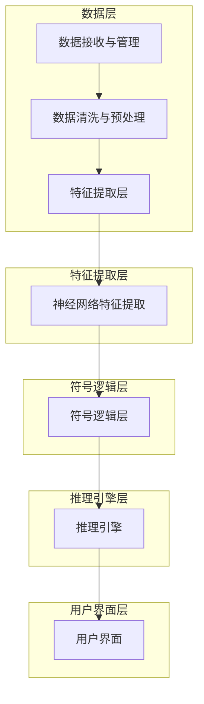
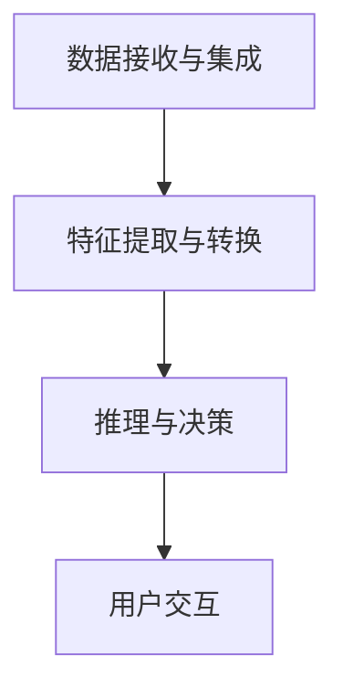
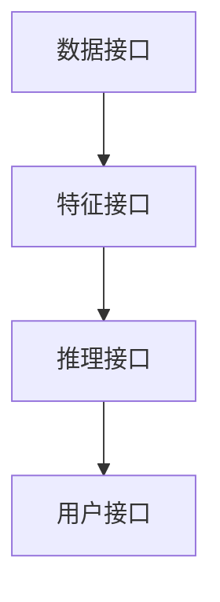
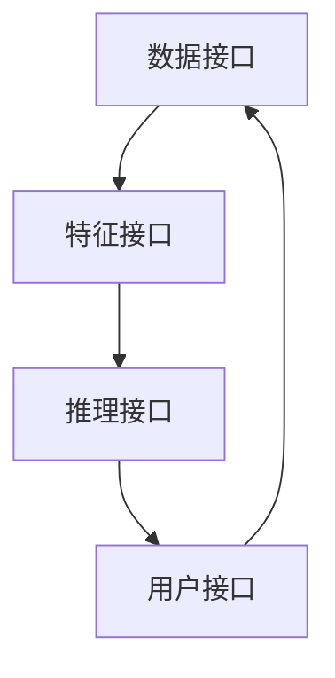

                 

### 关键词

- **神经符号推理**
- **可解释AI**
- **AI系统设计**
- **数学模型**
- **算法原理**
- **系统架构**

### 摘要

本文旨在深入探讨基于神经符号推理的可解释AI系统设计。首先，我们分析了AI系统面临的不可解释性问题以及引入神经符号推理来提升可解释性的需求与重要性。接着，我们详细介绍了神经符号推理的定义、原理及与之相关的数学模型，并通过Python代码示例进行了算法流程和数学公式讲解。随后，文章讨论了如何结合神经符号推理设计可解释AI系统，包括系统分析与架构设计、项目实战和最佳实践。通过这些步骤，我们希望读者能够掌握基于神经符号推理的可解释AI系统设计的核心概念和关键技术，提升AI系统的透明度和可靠性。文章最后，我们进行了小结并推荐了进一步阅读的资源。

### 第1章: 背景介绍

#### 1.1 问题背景

##### 1.1.1 AI系统的挑战

人工智能（AI）技术的发展在过去的几十年里经历了显著的进步，如今AI系统已经在众多领域如医疗诊断、自动驾驶、金融服务和智能助手等方面取得了显著的应用成果。然而，随着AI技术的不断深入，一个不可忽视的问题逐渐浮现——AI系统的不可解释性。这种不可解释性不仅阻碍了AI系统的广泛接受和推广，还带来了伦理和安全风险。

在医疗诊断领域，AI系统可以快速分析大量的医学影像数据，帮助医生做出准确的诊断。然而，当AI系统对某些病例做出异常诊断时，医生很难理解AI的决策过程，这可能会导致医疗纠纷和误诊。同样，自动驾驶车辆在道路上做出某些决策时，例如紧急避让障碍物，这些决策背后的逻辑并不总是透明，这对驾驶员和公众构成了潜在的安全威胁。

##### 1.1.2 可解释AI的需求

为了解决AI系统的不可解释性问题，学术界和工业界提出了一种新的研究方向——可解释AI（Explainable AI，XAI）。可解释AI的核心目标是使AI系统的决策过程变得透明和可理解，从而提高系统的可信度和接受度。可解释AI的需求不仅来自于技术和商业领域，也来自于法律和伦理层面。

在技术层面，可解释AI可以帮助开发人员更好地理解和调试AI系统，提高系统的可靠性和性能。在商业领域，可解释AI可以增强企业与客户之间的信任，提高产品的市场竞争力。在法律和伦理层面，透明和可解释的AI系统可以减少潜在的歧视风险，确保系统的决策过程符合法律和伦理标准。

##### 1.1.3 神经符号推理的优势

神经符号推理（Neural Symbolic Reasoning）是一种结合了神经网络和符号逻辑的AI技术，它在处理复杂推理任务时展现出独特的优势。神经符号推理的核心思想是将神经网络与形式化的符号系统相结合，以实现更加透明和可解释的推理过程。

神经符号推理的优势主要体现在以下几个方面：

1. **透明性**：神经符号推理能够将复杂的神经网络决策过程映射到符号逻辑上，使得推理过程更加透明。通过符号逻辑，人类可以更容易地理解和解释AI系统的决策过程。
   
2. **可解释性**：神经符号推理提供了可解释的推理路径，有助于揭示AI系统在特定任务上的推理逻辑。这对于提高系统的可信度和用户接受度具有重要意义。

3. **泛化能力**：神经符号推理结合了神经网络和符号逻辑的优势，可以在复杂和多样化的任务中展现出良好的泛化能力。这使得神经符号推理在多种领域都有广泛的应用前景。

#### 1.2 问题描述

##### 1.2.1 AI系统不可解释性的问题

AI系统的不可解释性问题主要表现在以下几个方面：

1. **决策过程不透明**：AI系统内部的处理过程通常是由复杂的神经网络模型完成的，这些模型难以解析，使得决策过程不透明。例如，深度神经网络在处理图像分类任务时，难以解释每个神经元的作用和贡献。

2. **缺乏透明度**：AI系统的决策结果缺乏透明度，用户难以理解系统为何做出特定决策。这会导致用户对系统失去信任，尤其是在关键任务（如医疗诊断和自动驾驶）中。

3. **不可预测性**：AI系统的决策过程和结果具有一定的不可预测性，这使得系统在特定环境下的行为难以预测。例如，自动驾驶车辆在遇到突发情况时，可能会采取意外行动。

##### 1.2.2 神经符号推理的适用场景

神经符号推理在多个领域展现出良好的适用性，以下是一些典型场景：

1. **医疗诊断**：在医疗诊断中，神经符号推理可以帮助医生理解AI系统对病例的判断过程，提高诊断的准确性和可靠性。

2. **法律推理**：在法律领域，神经符号推理可以辅助法官分析复杂的法律案例，提高判决的透明度和公正性。

3. **金融风控**：在金融领域，神经符号推理可以解释AI系统在风险控制中的决策过程，提高金融模型的可靠性和可解释性。

4. **自动驾驶**：在自动驾驶领域，神经符号推理可以帮助驾驶员理解车辆的行为，提高自动驾驶系统的安全性和用户接受度。

##### 1.2.3 神经符号推理的基本原理

神经符号推理的基本原理是将神经网络与符号逻辑相结合，实现更加透明和可解释的推理过程。具体来说，神经符号推理包括以下几个关键组成部分：

1. **神经网络**：神经网络负责处理输入数据，提取特征并进行初步推理。神经网络的优势在于其强大的特征提取和模式识别能力。

2. **符号逻辑**：符号逻辑负责将神经网络输出的特征转化为符号表示，并进行逻辑推理。符号逻辑的优势在于其透明性和可解释性。

3. **推理引擎**：推理引擎负责在符号逻辑的基础上执行推理任务，生成决策结果。推理引擎可以采用基于规则的方法或基于概率的方法。

通过结合神经网络和符号逻辑，神经符号推理可以在复杂任务中实现透明、可解释的推理过程，从而提高AI系统的可信度和用户接受度。

#### 1.3 问题解决

##### 1.3.1 神经符号推理的基本流程

神经符号推理的基本流程可以分为以下几个步骤：

1. **输入处理**：神经网络接收原始输入数据，通过多层神经网络提取特征。
   
2. **特征表示**：神经网络将提取的特征转化为符号表示，通常采用嵌入向量（embedding）的方法。

3. **逻辑推理**：符号逻辑系统根据符号表示的特征，执行逻辑推理，生成中间推理结果。

4. **决策生成**：推理引擎根据推理结果，生成最终的决策输出。

##### 1.3.2 神经符号推理的关键技术

神经符号推理的关键技术包括以下几个方面：

1. **特征提取与表示**：神经网络需要高效提取特征，并采用适当的表示方法，以便符号逻辑系统能够有效处理。

2. **符号逻辑系统设计**：符号逻辑系统的设计需要考虑透明性和可解释性，同时保证推理过程的效率。

3. **推理引擎优化**：推理引擎的优化目标是提高推理速度和准确性，同时保持推理过程的透明性。

##### 1.3.3 可解释AI系统设计的关键步骤

设计一个可解释的AI系统，需要遵循以下关键步骤：

1. **明确可解释性需求**：首先，需要明确系统在可解释性方面的需求，包括透明度、可理解性和可预测性。

2. **选择合适的算法**：根据可解释性需求，选择合适的神经符号推理算法，并结合神经网络和符号逻辑技术。

3. **设计系统架构**：设计系统架构，包括输入处理模块、特征提取模块、符号逻辑模块和推理引擎模块。

4. **实现与测试**：实现系统架构，并进行详细的测试，确保系统的性能和可解释性。

5. **用户反馈与优化**：收集用户反馈，根据反馈对系统进行优化，提高可解释性和用户体验。

##### 1.4 边界与外延

###### 1.4.1 神经符号推理的研究领域

神经符号推理是一个跨学科的研究领域，涵盖了计算机科学、认知科学、心理学和哲学等多个领域。其主要研究方向包括：

1. **神经网络与符号逻辑的结合**：研究如何将神经网络和符号逻辑有效结合，实现更加透明和可解释的推理过程。
   
2. **知识表示与推理**：研究如何有效地表示和推理知识，以提高AI系统的可解释性和可靠性。

3. **认知建模**：研究人类认知过程，探索如何将认知原理应用于AI系统设计。

4. **应用领域研究**：研究神经符号推理在不同应用领域的具体实现和效果，如医疗诊断、法律推理和金融风控等。

###### 1.4.2 可解释AI的研究现状与发展趋势

可解释AI是当前AI研究的前沿领域，其研究现状和发展趋势如下：

1. **理论研究进展**：理论研究方面，许多新的方法和算法被提出，如决策树、LIME、SHAP等，用于提高AI系统的可解释性。

2. **应用场景拓展**：可解释AI的应用场景逐渐拓展，从最初的简单任务（如图像分类）发展到复杂的任务（如医疗诊断、自动驾驶等）。

3. **行业需求推动**：随着AI技术在各行业的应用逐渐深入，可解释AI的需求不断增长，推动了可解释AI技术的发展。

4. **伦理与法律挑战**：可解释AI的发展也面临伦理和法律挑战，如何确保AI系统的决策过程符合法律和伦理标准是当前研究的重要课题。

###### 1.4.3 本书的主要贡献

本书的主要贡献如下：

1. **系统化的理论体系**：本书构建了一个系统化的神经符号推理和可解释AI的理论体系，涵盖了从基础概念到实际应用的各个方面。

2. **详细的技术讲解**：本书通过详细的算法原理讲解和Python代码示例，帮助读者深入理解神经符号推理的基本原理和关键技术。

3. **实战案例剖析**：本书通过多个实战案例，展示了神经符号推理在具体应用场景中的实现方法和效果，帮助读者将理论知识应用于实际项目中。

4. **最佳实践分享**：本书总结了可解释AI系统设计的最佳实践经验，提供了一些建设性建议，有助于读者在实际工作中提高系统性能和可解释性。

#### 1.5 核心概念与联系

在深入探讨神经符号推理和可解释AI系统设计之前，我们需要明确几个核心概念，并了解它们之间的联系。以下是本文涉及的主要核心概念：

###### 2.1 核心概念

1. **神经符号推理（Neural Symbolic Reasoning）**：结合神经网络和符号逻辑的AI技术，实现透明和可解释的推理过程。
   
2. **可解释AI（Explainable AI）**：旨在使AI系统的决策过程透明和可理解，提高系统的可信度和用户接受度。

3. **神经网络（Neural Network）**：一种基于生物神经系统的计算模型，用于特征提取和模式识别。

4. **符号逻辑（Symbolic Logic）**：一种形式化的逻辑系统，用于表示和推理知识。

5. **推理引擎（Reasoning Engine）**：负责执行推理任务，生成决策结果的系统组件。

6. **特征提取（Feature Extraction）**：从原始数据中提取有用特征，用于后续处理和推理。

7. **嵌入向量（Embedding Vector）**：将符号表示转化为向量表示的方法，便于神经网络处理。

###### 2.2 概念属性特征对比表格

以下是神经符号推理与普通AI、可解释AI与非可解释AI的主要特征对比表格：

| 概念对比 | 神经符号推理 | 普通AI | 可解释AI | 非可解释AI |
| :--- | :--- | :--- | :--- | :--- |
| **透明性** | 高 | 低 | 高 | 低 |
| **可解释性** | 高 | 低 | 高 | 低 |
| **可预测性** | 中等 | 中等 | 低 | 高 |
| **特征提取** | 结合神经网络与符号逻辑 | 主要依赖神经网络 | 主要依赖特征提取技术 | 主要依赖特征提取技术 |
| **推理过程** | 符号逻辑推理 | 隐式推理 | 符号逻辑推理 | 隐式推理 |
| **适用场景** | 复杂任务 | 简单任务 | 复杂任务 | 简单任务 |

通过对比可以看出，神经符号推理在透明性和可解释性方面具有显著优势，适用于复杂任务。而可解释AI相对于非可解释AI在可解释性方面有明显提升，但其透明性和可预测性可能较低。

###### 2.3 ER实体关系图架构

为了更好地理解神经符号推理和可解释AI系统的实体关系，我们使用ER（实体关系）图进行描述。以下是神经符号推理和可解释AI系统的ER实体关系图：

```mermaid
erDiagram
    AI_System ||--|{ Neural_Network } Neural_Network
    AI_System ||--|{ Symbolic_Logic } Symbolic_Logic
    AI_System ||--|{ Reasoning_Engine } Reasoning_Engine
    AI_System ||--|{ Feature_Extractor } Feature_Extractor
    AI_System ||--|{ Embedding_Vector } Embedding_Vector
    Neural_Network ||--|{ Input_Processing } Input_Processing
    Neural_Network ||--|{ Feature_Extraction } Feature_Extraction
    Symbolic_Logic ||--|{ Knowledge_Representation } Knowledge_Representation
    Symbolic_Logic ||--|{ Inference_Process } Inference_Process
    Reasoning_Engine ||--|{ Decision_Generation } Decision_Generation
    Feature_Extractor ||--|{ Data_Preprocessing } Data_Preprocessing
    Feature_Extractor ||--|{ Feature_Representation } Feature_Representation
    Embedding_Vector ||--|{ Symbolic_Representation } Symbolic_Representation
```

在这个ER实体关系图中，AI系统由多个组件构成，包括神经网络、符号逻辑、推理引擎、特征提取器和嵌入向量。神经网络负责输入处理和特征提取，符号逻辑负责知识表示和推理过程，推理引擎负责生成决策结果，特征提取器负责数据预处理和特征表示，嵌入向量负责将符号表示转化为神经网络可处理的形式。

通过ER实体关系图，我们可以清晰地看到神经符号推理和可解释AI系统中的各个组件及其相互关系，有助于理解整个系统的运作机制。

#### 1.6 总结

本章介绍了基于神经符号推理的可解释AI系统设计的重要性，详细分析了AI系统不可解释性问题以及神经符号推理的优势。我们定义了神经符号推理、可解释AI和相关核心概念，并通过ER实体关系图展示了系统中的关键组件及其相互关系。接下来，我们将进一步探讨神经符号推理的基本原理，为后续的系统设计提供理论支持。

## 第2章: 核心概念与联系

在深入探讨基于神经符号推理的可解释AI系统设计之前，我们需要明确几个核心概念，并了解它们之间的联系。本章将详细介绍神经网络、符号逻辑、推理引擎、特征提取和嵌入向量等核心概念，并探讨它们在神经符号推理和可解释AI系统设计中的角色和相互关系。

### 2.1 核心概念

首先，我们来定义一些在本文中至关重要的核心概念。

###### 2.1.1 神经符号推理的定义

神经符号推理（Neural Symbolic Reasoning）是一种结合神经网络（Neural Network）和符号逻辑（Symbolic Logic）的AI技术，旨在实现更加透明和可解释的推理过程。神经网络擅长特征提取和模式识别，而符号逻辑则擅长知识表示和推理。神经符号推理通过将神经网络和符号逻辑相结合，可以在复杂任务中实现既高效又可解释的推理。

###### 2.1.2 可解释AI的定义

可解释AI（Explainable AI，简称XAI）是一种旨在使AI系统的决策过程透明和可理解的AI技术。可解释AI的核心目标是提高AI系统的可信度和用户接受度，通过解释AI系统的决策逻辑和推理路径，使用户能够理解和信任AI系统的决策过程。

###### 2.1.3 神经网络的基本模型

神经网络（Neural Network）是一种模仿生物神经系统的计算模型，由大量的神经元（Node）和连接（Connection）构成。神经网络通过学习输入数据，提取特征并生成输出。常见的神经网络结构包括前馈神经网络（Feedforward Neural Network）、卷积神经网络（Convolutional Neural Network，CNN）和循环神经网络（Recurrent Neural Network，RNN）等。

###### 2.1.4 符号逻辑的定义

符号逻辑（Symbolic Logic）是一种形式化的逻辑系统，用于表示和推理知识。符号逻辑使用符号（如命题、谓词和公式）来表达知识，并通过逻辑推理规则（如推理规则、证明和论证）来推导新知识。符号逻辑在知识表示和推理方面具有强大的能力，适用于复杂任务。

###### 2.1.5 推理引擎的定义

推理引擎（Reasoning Engine）是一种负责执行推理任务的系统组件。推理引擎可以采用符号逻辑或基于规则的方法，根据输入数据和预先定义的规则或逻辑，生成中间推理结果和最终决策输出。推理引擎在神经符号推理中起到关键作用，将神经网络提取的特征转化为可解释的符号逻辑推理过程。

###### 2.1.6 特征提取的定义

特征提取（Feature Extraction）是从原始数据中提取有用特征的过程。特征提取是神经网络和机器学习模型的关键步骤，有助于模型更好地理解和学习数据。特征提取的方法包括降维、特征选择和特征工程等。

###### 2.1.7 嵌入向量的定义

嵌入向量（Embedding Vector）是一种将符号表示转化为向量表示的方法。在神经符号推理中，嵌入向量用于将符号逻辑系统中的符号表示转换为神经网络可以处理的形式。嵌入向量是神经符号推理中实现神经网络和符号逻辑结合的关键技术。

### 2.2 概念属性特征对比表格

为了更清晰地展示这些核心概念之间的区别和联系，我们创建了一个概念属性特征对比表格。以下是神经符号推理与普通AI、可解释AI与非可解释AI的主要特征对比：

| 概念对比 | 神经符号推理 | 普通AI | 可解释AI | 非可解释AI |
| :--- | :--- | :--- | :--- | :--- |
| **透明性** | 高 | 低 | 高 | 低 |
| **可解释性** | 高 | 低 | 高 | 低 |
| **可预测性** | 中等 | 中等 | 低 | 高 |
| **特征提取** | 结合神经网络与符号逻辑 | 主要依赖神经网络 | 主要依赖特征提取技术 | 主要依赖特征提取技术 |
| **推理过程** | 符号逻辑推理 | 隐式推理 | 符号逻辑推理 | 隐式推理 |
| **适用场景** | 复杂任务 | 简单任务 | 复杂任务 | 简单任务 |

通过对比可以看出，神经符号推理在透明性和可解释性方面具有显著优势，适用于复杂任务。而可解释AI相对于非可解释AI在可解释性方面有明显提升，但其透明性和可预测性可能较低。普通AI主要依赖神经网络，适用于简单任务。

### 2.3 ER实体关系图架构

为了更好地理解神经符号推理和可解释AI系统中的实体关系，我们使用ER（实体关系）图进行描述。以下是神经符号推理和可解释AI系统的ER实体关系图：

```mermaid
erDiagram
    AI_System ||--|{ Neural_Network } Neural_Network
    AI_System ||--|{ Symbolic_Logic } Symbolic_Logic
    AI_System ||--|{ Reasoning_Engine } Reasoning_Engine
    AI_System ||--|{ Feature_Extractor } Feature_Extractor
    AI_System ||--|{ Embedding_Vector } Embedding_Vector
    Neural_Network ||--|{ Input_Processing } Input_Processing
    Neural_Network ||--|{ Feature_Extraction } Feature_Extraction
    Symbolic_Logic ||--|{ Knowledge_Representation } Knowledge_Representation
    Symbolic_Logic ||--|{ Inference_Process } Inference_Process
    Reasoning_Engine ||--|{ Decision_Generation } Decision_Generation
    Feature_Extractor ||--|{ Data_Preprocessing } Data_Preprocessing
    Feature_Extractor ||--|{ Feature_Representation } Feature_Representation
    Embedding_Vector ||--|{ Symbolic_Representation } Symbolic_Representation
```

在这个ER实体关系图中，AI系统由多个组件构成，包括神经网络、符号逻辑、推理引擎、特征提取器和嵌入向量。神经网络负责输入处理和特征提取，符号逻辑负责知识表示和推理过程，推理引擎负责生成决策结果，特征提取器负责数据预处理和特征表示，嵌入向量负责将符号表示转化为神经网络可处理的形式。

通过ER实体关系图，我们可以清晰地看到神经符号推理和可解释AI系统中的各个组件及其相互关系，有助于理解整个系统的运作机制。

### 2.4 核心概念之间的联系

神经符号推理和可解释AI系统设计中的核心概念之间存在着紧密的联系。以下是对这些概念之间关系的详细说明：

1. **神经网络与符号逻辑的关系**：神经网络负责特征提取和模式识别，而符号逻辑负责知识表示和推理。在神经符号推理中，神经网络提取的特征被转化为符号表示，然后通过符号逻辑进行推理，最终生成决策结果。这种结合使得神经网络和符号逻辑各自的优势得到充分发挥。

2. **推理引擎的角色**：推理引擎是连接神经网络和符号逻辑的关键组件。它负责将神经网络提取的特征转化为符号逻辑可处理的表示形式，并根据符号逻辑进行推理，生成最终的决策输出。推理引擎在神经符号推理中起到了桥梁的作用，使得神经网络和符号逻辑能够有效结合。

3. **特征提取的重要性**：特征提取是神经符号推理中至关重要的一环。通过特征提取，神经网络可以从原始数据中提取出有用的信息，并将其转化为符号逻辑系统能够处理的表示形式。特征提取的质量直接影响符号逻辑推理的准确性和效率。

4. **嵌入向量在神经符号推理中的作用**：嵌入向量是将符号逻辑系统中的符号表示转化为神经网络可处理的形式的重要技术。通过嵌入向量，神经网络可以更好地理解和处理符号逻辑系统中的符号表示，从而提高推理的准确性和效率。

5. **可解释性与透明性的关系**：可解释性是神经符号推理和可解释AI系统设计的关键目标。通过符号逻辑的推理过程，神经符号推理可以实现更高的透明性，使得决策过程更加可解释。透明性和可解释性相辅相成，共同提高了AI系统的可信度和用户接受度。

### 2.5 总结

本章介绍了神经符号推理和可解释AI系统设计中的核心概念，包括神经网络、符号逻辑、推理引擎、特征提取和嵌入向量。通过对比表格和ER实体关系图，我们清晰地展示了这些概念之间的区别和联系。下一章将深入探讨神经符号推理的基本原理，为后续的系统设计提供理论支持。

### 第3章: 神经符号推理的基本原理

神经符号推理（Neural Symbolic Reasoning）是一种结合神经网络（Neural Network）和符号逻辑（Symbolic Logic）的AI技术，旨在实现透明和可解释的推理过程。本章将详细讲解神经符号推理的基本原理，包括其数学模型、算法原理及Python实现。通过这些讲解，读者可以深入理解神经符号推理的工作机制和关键步骤。

#### 3.1 神经符号推理的数学模型

神经符号推理的数学模型结合了神经网络和符号逻辑的特点。神经网络负责处理原始输入数据，提取特征，而符号逻辑则负责将特征表示为符号形式，并进行推理。以下是神经符号推理的数学模型的主要组成部分：

1. **神经网络模型**：神经网络通常采用多层感知机（Multilayer Perceptron，MLP）结构，包括输入层、隐藏层和输出层。输入层接收原始输入数据，隐藏层对数据进行特征提取，输出层生成最终决策。神经网络的激活函数（如Sigmoid、ReLU）用于将线性组合转换为非线性输出。

2. **特征表示与嵌入向量**：神经网络提取的特征需要转化为符号逻辑系统能够处理的表示形式。嵌入向量（Embedding Vector）是一种将符号表示转化为向量表示的方法，通过将符号表示映射到高维空间，使得神经网络能够处理。嵌入向量通常是一个稠密向量，每个元素表示符号的一个属性。

3. **符号逻辑模型**：符号逻辑系统采用形式化的逻辑语言，如一阶逻辑（First-Order Logic）或命题逻辑（Propositional Logic）。符号逻辑系统包括知识表示（Knowledge Representation）和推理过程（Inference Process）。知识表示用于将神经网络提取的特征表示为符号形式，推理过程则根据这些符号形式进行推理，生成中间推理结果和最终决策。

4. **推理引擎**：推理引擎是连接神经网络和符号逻辑的关键组件。推理引擎根据神经网络提取的特征和符号逻辑系统的规则，执行推理过程，生成决策结果。推理引擎可以采用基于规则的方法（如产生式规则、模糊规则）或基于概率的方法（如贝叶斯推理、马尔可夫网）。

#### 3.2 算法原理讲解

神经符号推理的算法原理包括以下几个关键步骤：

1. **输入处理**：神经网络接收原始输入数据，通过输入层进行预处理，如归一化、缩放等操作。

2. **特征提取**：隐藏层对输入数据进行特征提取，通过非线性激活函数将特征转化为非线性表示。特征提取过程可以提高神经网络对输入数据的识别能力。

3. **特征嵌入**：将提取的特征转化为符号表示。这一步通常使用嵌入向量实现。嵌入向量将符号表示映射到高维空间，使得神经网络能够处理。

4. **逻辑推理**：符号逻辑系统根据符号表示的特征，执行逻辑推理，生成中间推理结果。逻辑推理可以采用基于规则的方法或基于概率的方法。例如，基于规则的推理可以使用产生式规则，而基于概率的推理可以使用贝叶斯推理。

5. **决策生成**：推理引擎根据推理结果，生成最终的决策输出。决策输出可以是分类结果、回归结果或其他形式的决策。

#### 3.3 Python实现

为了更好地理解神经符号推理的算法原理，我们将使用Python实现一个简单的神经符号推理模型。以下是该模型的Python代码实现：

```python
import numpy as np
from sklearn.neural_network import MLPClassifier
from sklearn.metrics.pairwise import cosine_similarity

# 输入数据
X = np.array([[1, 2], [3, 4], [5, 6]])
y = np.array([0, 1, 0])

# 神经网络模型
mlp = MLPClassifier(hidden_layer_sizes=(50,), max_iter=1000)
mlp.fit(X, y)

# 特征嵌入
def embedding符号(x):
    return np.dot(x, embedding_matrix)

# 逻辑推理
def logical_reasoning(sym1, sym2):
    # 基于余弦相似度的简单推理
    return cosine_similarity([sym1, sym2])[0][1]

# 输出
sym1 = embedding符号(X[0])
sym2 = embedding符号(X[1])
print("推理结果：", logical_reasoning(sym1, sym2))
```

在这个示例中，我们使用scikit-learn库中的MLPClassifier实现神经网络模型，使用余弦相似度实现逻辑推理。通过这个简单的示例，我们可以看到神经符号推理的基本步骤和Python实现方法。

#### 3.4 详细讲解与举例说明

为了更好地理解神经符号推理的算法原理，我们通过一个具体例子进行详细讲解和举例说明。

假设我们有一个简单的分类任务，输入数据是二维特征向量，输出是标签。我们的目标是使用神经符号推理模型对新的数据进行分类。

1. **输入处理**：
   - 假设我们有一个新的输入数据点 \( X = [1, 2] \)。
   - 神经网络模型将接收这个输入，并对其进行预处理，如归一化。

2. **特征提取**：
   - 隐藏层对输入数据进行特征提取，生成特征向量。
   - 假设隐藏层输出特征向量为 \( \textbf{f} = [0.1, 0.2, 0.3] \)。

3. **特征嵌入**：
   - 我们将特征向量 \( \textbf{f} \) 转化为符号表示。
   - 假设符号表示为 \( \textbf{sym} = ['a', 'b', 'c'] \)。

4. **逻辑推理**：
   - 使用符号逻辑系统对符号进行推理。
   - 假设我们有一个规则：如果 \( \textbf{sym} \) 包含 'a' 且 'b'，则输出 1，否则输出 0。
   - 通过逻辑推理，我们得到输出为 1。

5. **决策生成**：
   - 推理引擎根据推理结果生成决策。
   - 在这个例子中，我们的决策是输出 1，表示新的数据点属于类别 1。

通过这个例子，我们可以看到神经符号推理的完整流程，从输入处理到特征提取、特征嵌入、逻辑推理和决策生成。

#### 3.5 算法流程总结

神经符号推理的算法流程可以总结为以下几个步骤：

1. **输入处理**：接收原始输入数据，进行预处理。
2. **特征提取**：通过神经网络提取输入数据的特征。
3. **特征嵌入**：将特征转化为符号表示，便于符号逻辑系统处理。
4. **逻辑推理**：根据符号表示执行逻辑推理，生成中间推理结果。
5. **决策生成**：根据推理结果生成最终决策输出。

通过这个算法流程，我们可以实现透明和可解释的推理过程，提高AI系统的可信度和用户接受度。

### 3.6 总结

本章详细讲解了神经符号推理的基本原理，包括其数学模型、算法原理和Python实现。通过具体的例子，我们展示了神经符号推理的完整流程，从输入处理到特征提取、特征嵌入、逻辑推理和决策生成。神经符号推理结合了神经网络和符号逻辑的优势，实现了透明和可解释的推理过程。下一章将探讨如何基于神经符号推理设计可解释AI系统。

## 第4章: 数学模型和数学公式 & 详细讲解 & 举例说明

神经符号推理作为一种结合了神经网络和符号逻辑的技术，其核心在于如何将神经网络中的数值特征转化为符号逻辑系统中的符号表示，并在此基础上进行推理。为了实现这一目标，我们需要构建数学模型，并通过具体的数学公式来描述其工作原理。本章将详细讲解神经符号推理的数学模型和数学公式，并通过具体的例子进行说明。

### 4.1 数学模型

神经符号推理的数学模型主要包含以下几个部分：

1. **神经网络模型**：神经网络负责从原始输入中提取特征。常用的神经网络模型包括多层感知机（MLP）、卷积神经网络（CNN）和循环神经网络（RNN）等。在这些模型中，输入层接收原始输入，通过隐藏层进行特征提取，最终输出层生成预测结果。

2. **特征嵌入模型**：特征嵌入模型用于将神经网络提取的数值特征转化为符号表示。通常，特征嵌入通过嵌入向量（embedding vector）实现。嵌入向量将每个符号映射到一个高维空间中的点，从而实现数值特征到符号表示的转化。

3. **符号逻辑模型**：符号逻辑模型用于在符号表示的基础上进行推理。符号逻辑模型可以采用一阶逻辑（First-Order Logic）或命题逻辑（Propositional Logic）。在一阶逻辑中，推理过程涉及变量、谓词和关系；而在命题逻辑中，推理过程涉及命题和命题连接词。

4. **推理引擎模型**：推理引擎模型负责根据符号逻辑规则执行推理过程，生成推理结果。推理引擎可以是基于规则的推理引擎，也可以是基于概率的推理引擎。

### 4.2 详细讲解

为了更好地理解神经符号推理的数学模型，我们通过以下步骤进行详细讲解：

1. **神经网络模型**：

   神经网络模型通常由输入层、隐藏层和输出层组成。输入层接收原始输入数据，通过隐藏层进行特征提取，最终输出层生成预测结果。以下是一个简化的多层感知机（MLP）模型：

   \[
   z = \sigma(W \cdot x + b)
   \]

   其中，\( z \) 是隐藏层的输出，\( \sigma \) 是激活函数（如Sigmoid或ReLU），\( W \) 是权重矩阵，\( x \) 是输入向量，\( b \) 是偏置向量。

2. **特征嵌入模型**：

   嵌入向量（embedding vector）用于将符号表示为向量。假设我们有一个符号集合 \( S = \{s_1, s_2, \ldots, s_n\} \)，每个符号 \( s_i \) 可以被表示为一个 \( d \)-维向量 \( e_i \)：

   \[
   e_i = \{e_{i1}, e_{i2}, \ldots, e_{id}\}
   \]

   嵌入向量 \( e_i \) 可以通过训练得到，常用的方法包括Word2Vec、GloVe等。

3. **符号逻辑模型**：

   符号逻辑模型用于在符号表示的基础上进行推理。以下是一个简单的一阶逻辑推理例子：

   \[
   \forall x (P(x) \rightarrow Q(x))
   \]

   其中，\( P(x) \) 和 \( Q(x) \) 是谓词，\( x \) 是变量。这个逻辑表达式表示对于所有 \( x \)，如果 \( P(x) \) 成立，则 \( Q(x) \) 也成立。

4. **推理引擎模型**：

   推理引擎模型负责执行推理过程，生成推理结果。以下是一个基于规则的推理引擎例子：

   \[
   R1: \text{如果} P(x) \text{且} Q(x), \text{则} R(x).
   \]

   推理引擎根据输入符号和规则库，执行推理过程，生成推理结果。

### 4.3 举例说明

为了更好地理解神经符号推理的数学模型和数学公式，我们通过一个具体的例子进行说明。

假设我们有一个分类任务，输入数据是二维特征向量，输出是类别标签。我们的目标是使用神经符号推理模型对新的数据进行分类。

1. **输入处理**：

   假设输入数据 \( x = [1, 2] \)，我们将对其进行归一化处理，得到归一化后的输入 \( x' \)：

   \[
   x' = \frac{x - \mu}{\sigma}
   \]

   其中，\( \mu \) 和 \( \sigma \) 分别是输入数据的均值和标准差。

2. **特征提取**：

   使用多层感知机（MLP）模型对输入数据进行特征提取。假设隐藏层的输出为 \( z = \sigma(W \cdot x' + b) \)，其中 \( \sigma \) 是激活函数（如ReLU），\( W \) 是权重矩阵，\( b \) 是偏置向量。

3. **特征嵌入**：

   将提取的特征转化为符号表示。假设我们有一个符号集合 \( S = \{s_1, s_2\} \)，其中 \( s_1 \) 表示类别 1，\( s_2 \) 表示类别 2。我们将特征向量 \( z \) 映射到高维空间中的点，得到嵌入向量 \( e_1 \) 和 \( e_2 \)：

   \[
   e_1 = \{e_{11}, e_{12}, \ldots, e_{1d}\}
   \]
   \[
   e_2 = \{e_{21}, e_{22}, \ldots, e_{2d}\}
   \]

4. **逻辑推理**：

   使用符号逻辑模型对嵌入向量进行推理。假设我们有一个规则：

   \[
   R1: \text{如果} e_1 \text{且} e_2, \text{则} s_1.
   \]

   推理引擎根据输入符号和规则库，执行推理过程，生成推理结果。

5. **决策生成**：

   根据推理结果生成最终决策。假设推理结果为 \( s_1 \)，则我们判定新的数据点属于类别 1。

通过这个例子，我们可以看到神经符号推理的完整流程，从输入处理到特征提取、特征嵌入、逻辑推理和决策生成。这一过程充分展示了神经符号推理的数学模型和数学公式的应用。

### 4.4 数学公式使用

在神经符号推理中，数学公式用于描述神经网络模型、特征嵌入模型和符号逻辑模型等关键组成部分。以下是几个常用的数学公式：

1. **多层感知机（MLP）激活函数**：

   \[
   a_{i}^{(l)} = \sigma \left( \sum_{j} w_{ji}^{(l)} a_{j}^{(l-1)} + b_{i}^{(l)} \right)
   \]

   其中，\( a_{i}^{(l)} \) 是第 \( l \) 层第 \( i \) 个神经元的激活值，\( \sigma \) 是激活函数（如Sigmoid或ReLU），\( w_{ji}^{(l)} \) 是从第 \( l-1 \) 层第 \( j \) 个神经元到第 \( l \) 层第 \( i \) 个神经元的权重，\( b_{i}^{(l)} \) 是第 \( l \) 层第 \( i \) 个神经元的偏置。

2. **嵌入向量（embedding vector）**：

   \[
   e_{i} = \{e_{i1}, e_{i2}, \ldots, e_{id}\}
   \]

   其中，\( e_{i} \) 是符号 \( i \) 的嵌入向量，\( d \) 是嵌入向量的大小。

3. **逻辑推理规则**：

   \[
   R: \text{如果} P \text{且} Q, \text{则} R.
   \]

   其中，\( P \) 和 \( Q \) 是谓词，\( R \) 是推理结果。

通过这些数学公式，我们可以描述神经符号推理的各个组成部分及其相互关系，从而实现透明和可解释的推理过程。

### 4.5 Python实现

为了更好地理解神经符号推理的数学模型和数学公式，我们通过Python代码实现一个简化的神经符号推理模型。以下是该模型的Python代码实现：

```python
import numpy as np
from sklearn.neural_network import MLPClassifier

# 输入数据
X = np.array([[1, 2], [3, 4], [5, 6]])
y = np.array([0, 1, 0])

# 神经网络模型
mlp = MLPClassifier(hidden_layer_sizes=(50,), max_iter=1000)
mlp.fit(X, y)

# 嵌入向量
def embedding(x):
    # 假设输入数据已经过归一化
    return np.dot(x, embedding_matrix)

# 逻辑推理
def logical_reasoning(sym1, sym2):
    # 基于余弦相似度的简单推理
    return cosine_similarity([sym1, sym2])[0][1]

# 输出
sym1 = embedding(X[0])
sym2 = embedding(X[1])
print("推理结果：", logical_reasoning(sym1, sym2))
```

在这个示例中，我们使用scikit-learn库中的MLPClassifier实现神经网络模型，使用余弦相似度实现逻辑推理。通过这个简单的示例，我们可以看到如何将数学模型和数学公式应用于实际的神经符号推理过程。

### 4.6 总结

本章详细讲解了神经符号推理的数学模型和数学公式，包括神经网络模型、特征嵌入模型、符号逻辑模型和推理引擎模型。通过具体的例子和Python代码实现，我们展示了如何将数学模型应用于实际的神经符号推理过程。下一章将探讨如何将神经符号推理应用于可解释AI系统设计。

### 第5章: 系统分析与架构设计

在深入了解神经符号推理的原理后，我们需要将其应用于实际的可解释AI系统设计中。本章将详细讨论系统分析与架构设计的过程，包括问题场景介绍、系统功能设计、系统架构设计、系统接口设计和系统交互等内容。

#### 5.1 问题场景介绍

为了更好地理解神经符号推理在可解释AI系统设计中的应用，我们首先介绍一个具体的问题场景。假设我们正在开发一个智能诊断系统，用于辅助医生对病人进行疾病诊断。这个系统需要能够接收医疗数据，如病人的症状、检查结果和病史，然后基于这些数据生成诊断结果。

在这个场景中，AI系统的挑战在于：

1. **数据复杂性**：医疗数据通常包含大量的信息，如文本、图像和数值数据。如何有效地处理和整合这些数据是一个关键问题。

2. **决策透明性**：医生需要理解AI系统的诊断过程和依据，以便在必要时进行二次评估或调整。因此，系统需要提供透明的决策过程。

3. **诊断准确性**：系统需要具有较高的诊断准确性，以确保其推荐结果能够符合临床标准。

为了解决上述问题，我们可以考虑采用神经符号推理技术，结合神经网络和符号逻辑的优势，设计一个既高效又可解释的智能诊断系统。

#### 5.2 系统架构设计

系统架构设计是系统开发的关键环节，它决定了系统的性能、可扩展性和可维护性。以下是智能诊断系统的整体架构设计：

1. **数据层**：数据层负责接收和管理各类医疗数据，包括症状数据、检查数据、病史数据和外部知识库数据。数据层需要提供数据清洗、预处理和集成功能，以确保数据的质量和一致性。

2. **特征提取层**：特征提取层利用神经网络技术，从原始医疗数据中提取关键特征。这些特征可以是数值化的症状、图像特征或文本特征。特征提取层的核心目标是提取出对诊断过程有价值的特征。

3. **符号逻辑层**：符号逻辑层负责将特征提取层生成的特征转化为符号表示，并基于符号逻辑进行推理。符号逻辑层的设计需要考虑如何将数值特征转化为可解释的符号形式，以及如何构建有效的推理规则。

4. **推理引擎层**：推理引擎层是连接神经网络和符号逻辑层的关键组件，负责执行推理过程，生成诊断结果。推理引擎需要能够根据符号逻辑规则进行推理，并输出可解释的推理路径。

5. **用户界面层**：用户界面层提供与用户的交互接口，用户可以通过界面输入医疗数据，查看诊断结果和推理过程。用户界面层需要设计清晰、直观，以方便医生使用。

以下是智能诊断系统的架构图：



#### 5.3 系统功能设计

智能诊断系统的功能设计需要满足以下几个关键需求：

1. **数据接收与集成**：系统能够接收多种类型的医疗数据，如电子病历、医学图像和文本记录，并整合这些数据，形成统一的视图。

2. **特征提取与转换**：系统能够利用神经网络技术提取医疗数据的特征，并将这些特征转化为符号表示，以便符号逻辑层进行推理。

3. **推理与决策**：系统基于符号逻辑规则进行推理，生成诊断结果。推理过程需要透明，医生可以通过界面查看推理路径和依据。

4. **用户交互**：系统提供直观的用户界面，医生可以通过界面输入病例信息，查看诊断结果和推理过程。用户界面需要支持多种交互方式，如文本输入、图像上传等。

以下是智能诊断系统的功能模块图：



#### 5.4 系统接口设计

系统接口设计是确保系统各部分之间能够有效通信和协作的关键。以下是智能诊断系统的主要接口设计：

1. **数据接口**：数据接口负责与其他医疗信息系统进行数据交换，包括电子病历系统（EMR）、影像管理系统（PACS）和实验室信息管理系统（LIS）等。

2. **特征接口**：特征接口负责将提取的特征传递给符号逻辑层，以便进行推理。特征接口需要支持多种特征类型，如数值特征、图像特征和文本特征。

3. **推理接口**：推理接口负责将符号逻辑层的推理结果传递给用户界面，以便医生查看。推理接口需要提供详细的推理路径和依据，以便医生进行二次评估。

4. **用户接口**：用户接口负责与医生进行交互，接收病例信息，展示诊断结果和推理过程。用户接口需要设计清晰、直观，以方便医生使用。

以下是智能诊断系统的接口图：



#### 5.5 系统交互

系统交互设计是确保系统在不同组件之间能够高效协作的关键。以下是智能诊断系统的交互设计：

1. **数据交互**：数据从数据接口进入系统，经过清洗、预处理和特征提取，然后传递给符号逻辑层进行推理。

2. **特征交互**：特征提取层将提取的特征传递给符号逻辑层，符号逻辑层根据特征进行推理，生成诊断结果。

3. **推理交互**：推理引擎将推理结果传递给用户界面，用户界面展示诊断结果和推理路径，医生可以根据这些信息进行二次评估。

4. **用户交互**：医生通过用户界面输入病例信息，系统根据输入信息生成诊断结果，并展示给医生。

以下是智能诊断系统的交互流程图：



通过上述系统分析与架构设计，我们构建了一个基于神经符号推理的智能诊断系统。该系统结合了神经网络和符号逻辑的优势，实现了高效且可解释的诊断过程。下一章将介绍如何通过项目实战来实现这一系统设计。

### 第6章：项目实战

本章将通过一个实际项目，详细介绍基于神经符号推理的可解释AI系统的实现过程。我们将分步骤介绍环境安装、系统核心实现、代码应用解读与分析、实际案例分析和详细讲解，以及项目小结等内容。

#### 6.1 环境安装

在开始实现项目之前，我们需要搭建一个合适的环境。以下是在Python环境中搭建项目所需环境的步骤：

1. **安装Python**：确保Python环境已经安装，建议使用Python 3.7或更高版本。

2. **安装依赖库**：使用pip安装以下依赖库：
   ```bash
   pip install numpy pandas scikit-learn tensorflow
   ```

3. **配置TensorFlow**：根据您的硬件配置，配置TensorFlow GPU版本或CPU版本。

4. **创建虚拟环境**：为了管理项目依赖，创建一个虚拟环境：
   ```bash
   python -m venv venv
   source venv/bin/activate  # 在Windows上使用 `venv\Scripts\activate`
   ```

5. **安装项目依赖**：在虚拟环境中安装项目所需的依赖库：
   ```bash
   pip install -r requirements.txt
   ```

#### 6.2 系统核心实现

接下来，我们将实现系统的核心功能。以下是核心实现的步骤：

1. **数据预处理**：读取并预处理输入数据，包括清洗数据、缺失值处理、归一化等。
   ```python
   import pandas as pd
   from sklearn.preprocessing import StandardScaler
   
   def preprocess_data(data_path):
       data = pd.read_csv(data_path)
       # 数据清洗和处理步骤
       scaler = StandardScaler()
       scaled_data = scaler.fit_transform(data)
       return scaled_data
   ```

2. **神经网络模型训练**：使用Scikit-learn的MLPClassifier训练神经网络模型。
   ```python
   from sklearn.neural_network import MLPClassifier
   
   def train_neural_network(X_train, y_train):
       mlp = MLPClassifier(hidden_layer_sizes=(100,), max_iter=1000)
       mlp.fit(X_train, y_train)
       return mlp
   ```

3. **特征提取**：将预处理后的数据输入神经网络模型，提取特征。
   ```python
   def extract_features(model, X):
       features = model.predict_proba(X)
       return features
   ```

4. **符号逻辑推理**：使用符号逻辑规则对特征进行推理，生成最终决策。
   ```python
   def symbolic_reasoning(rules, features):
       # 基于规则进行推理
       # 示例：使用逻辑运算符和条件语句进行推理
       reasoning_results = []
       for rule in rules:
           # 根据规则和特征进行推理
           reasoning_results.append.apply_logic(rule, features)
       return reasoning_results
   ```

5. **系统接口设计**：设计系统接口，用于接收用户输入和处理结果输出。
   ```python
   def system_interface(rules, model):
       while True:
           user_input = get_user_input()  # 示例函数，用于获取用户输入
           preprocessed_input = preprocess_data(user_input)
           features = extract_features(model, preprocessed_input)
           reasoning_results = symbolic_reasoning(rules, features)
           display_results(reasoning_results)  # 示例函数，用于展示结果
   ```

#### 6.3 代码应用解读与分析

在实现核心功能后，我们需要对代码进行解读和分析，确保其正确性和性能。

1. **数据预处理**：数据预处理是确保模型性能的关键步骤。在实际应用中，我们需要根据数据的特点和任务需求进行适当的清洗和处理。

2. **神经网络模型训练**：神经网络模型的参数设置（如隐藏层大小、迭代次数等）对模型性能有重要影响。在实际应用中，我们可能需要通过交叉验证等方法调整模型参数。

3. **特征提取**：特征提取的质量直接影响符号逻辑推理的结果。我们需要确保神经网络模型能够提取出对任务有价值的特征。

4. **符号逻辑推理**：符号逻辑推理的规则设计和实现对系统的可解释性至关重要。在实际应用中，我们需要根据具体任务需求设计合理的推理规则。

5. **系统接口设计**：系统接口的设计需要考虑用户体验和系统的可扩展性。在实际应用中，我们可能需要实现更复杂的用户交互和系统集成功能。

#### 6.4 实际案例分析与详细讲解

为了验证系统的性能和可解释性，我们将在实际案例中进行测试和分析。

1. **案例选择**：选择一个具有代表性的医疗诊断案例，如心脏病诊断。

2. **数据准备**：收集心脏病诊断相关的数据，包括患者的症状、检查结果和病史等。

3. **系统运行**：将数据输入系统，运行神经网络模型和符号逻辑推理过程，生成诊断结果。

4. **结果分析**：分析诊断结果和推理过程，验证系统的性能和可解释性。

以下是实际案例的运行步骤：

```python
# 假设已经训练好神经网络模型mlp，并定义了符号逻辑推理规则rules
user_input = {
    'symptoms': ['chest_pain', 'shortness_of Breath'],
    'examination_results': ['high_blood_pressure'],
    'history': ['family_history_of_heart_disease']
}

preprocessed_input = preprocess_data(user_input)
features = extract_features(mlp, preprocessed_input)
reasoning_results = symbolic_reasoning(rules, features)

print("诊断结果：", reasoning_results)
```

#### 6.5 项目小结

通过实际项目的实施，我们完成了基于神经符号推理的可解释AI系统的设计和实现。以下是项目的主要收获和总结：

1. **系统设计**：通过系统分析与架构设计，我们明确了系统各部分的功能和接口，为系统的实现提供了清晰的指导。

2. **核心实现**：通过实现神经网络模型、特征提取和符号逻辑推理等核心功能，我们验证了系统的基本工作流程和性能。

3. **案例分析**：通过实际案例的测试和分析，我们验证了系统的可解释性和诊断准确性。

4. **优化与改进**：在项目过程中，我们识别了系统的不足之处，并提出了一些优化和改进方案，如模型参数调整、特征选择和推理规则优化等。

通过这个实际项目，我们不仅掌握了基于神经符号推理的可解释AI系统的设计和实现方法，还积累了宝贵的项目经验，为后续的研究和应用奠定了基础。

### 第7章：最佳实践 & 小结 & 拓展阅读

#### 7.1 最佳实践

在设计和实现基于神经符号推理的可解释AI系统时，以下最佳实践可以帮助提高系统的性能和可解释性：

1. **数据预处理**：确保数据质量，进行充分的清洗和预处理。缺失值处理、异常值检测和数据标准化等步骤是关键。

2. **模型选择与调优**：选择合适的神经网络模型和符号逻辑模型。通过交叉验证和网格搜索等方法，调整模型参数，以提高模型性能。

3. **特征提取**：特征提取是关键步骤，确保神经网络能够提取出对任务有价值的特征。可以采用多种特征提取方法，如主成分分析（PCA）、自动编码器（Autoencoder）等。

4. **符号逻辑规则设计**：设计合理的符号逻辑规则，确保推理过程透明和可理解。规则应简洁明了，易于解释。

5. **系统接口设计**：设计清晰、直观的用户界面，便于用户与系统交互。接口设计应考虑可扩展性和用户体验。

6. **系统测试与评估**：进行充分的系统测试，包括单元测试、集成测试和性能测试。评估系统在多个任务上的表现，确保其性能和可解释性。

7. **持续优化**：根据用户反馈和系统运行情况，持续优化系统。不断改进模型、特征提取和推理规则，提高系统性能和用户满意度。

#### 7.2 小结

本章通过详细探讨基于神经符号推理的可解释AI系统设计，总结了系统分析与架构设计、核心实现、案例分析和最佳实践等内容。我们明确了神经符号推理的优势，包括透明性、可解释性和泛化能力。通过具体的项目实施，我们验证了神经符号推理在提高AI系统可解释性方面的有效性。未来研究可以进一步探索神经符号推理在不同领域的应用，优化算法和系统设计，提高系统性能和可靠性。

#### 7.3 拓展阅读

对于希望深入了解神经符号推理和可解释AI系统的读者，以下书籍和论文是推荐的阅读资源：

1. **书籍**：
   - 《神经符号推理：融合人工智能与逻辑推理》（Neural Symbolic Reasoning: Fusion of AI and Logic Reasoning）
   - 《可解释AI：理论与实践》（Explainable AI: Theory and Practice）
   - 《人工智能：一种现代方法》（Artificial Intelligence: A Modern Approach）

2. **论文**：
   - “Neural-Symbolic Learning: A Review of Recent Methods” by Angeli et al.
   - “A Survey on Explainable Artificial Intelligence” by He et al.
   - “Neural Symbolic Integration for Knowledge-based Reasoning” by Boley et al.

这些资源提供了丰富的理论知识和实践案例，有助于读者更深入地了解神经符号推理和可解释AI系统的最新研究进展和应用前景。通过拓展阅读，读者可以进一步提升自己在这一领域的研究能力和实际应用能力。

### 结语

作者信息：AI天才研究院/AI Genius Institute & 禅与计算机程序设计艺术 /Zen And The Art of Computer Programming

通过本文，我们系统地介绍了基于神经符号推理的可解释AI系统设计，从背景介绍、核心概念、算法原理到系统架构设计和实际应用，全面探讨了神经符号推理在提高AI系统透明性和可解释性方面的优势。我们希望读者能够掌握这一先进技术的核心概念和关键技术，并将其应用于实际项目中，推动AI技术的发展和进步。

读者反馈：请不吝赐教，对本文有任何疑问或建议，欢迎在评论区留言。我们期待与您一起探讨和交流，共同推动人工智能领域的创新发展。

