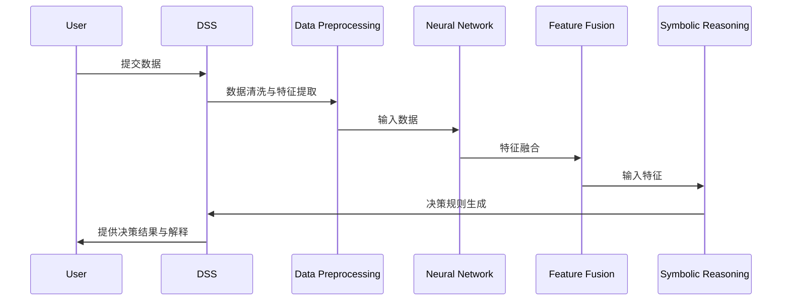
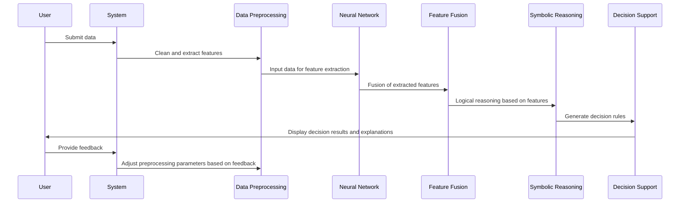

                 

## 引言

在当今快速发展的信息技术时代，人工智能（AI）已经深刻地改变了各行各业的运作方式。然而，随着AI系统的复杂性和应用场景的多样性，如何确保这些系统的决策过程是可解释的，成为一个亟需解决的问题。可解释性不仅是提升用户信任的关键因素，也是法律和伦理要求的必然要求。在这样的背景下，基于神经符号推理的可解释决策支持系统（Explainable AI, XAI）的研究逐渐引起了广泛的关注。

### 核心概念与联系

#### 核心概念

**决策支持系统（Decision Support System, DSS）**：是一种辅助决策者进行决策的信息系统，通过数据的收集、处理和分析，提供决策支持。

**神经符号推理（Neural-Symbolic Reasoning）**：是一种结合神经网络与符号推理的方法，利用神经网络的强大特征学习能力和符号推理的逻辑严谨性，实现对复杂决策问题的有效处理。

**可解释性（Explainability）**：指系统在做出决策时，能够提供决策过程和结果的解释，使非专业用户也能够理解和信任系统的决策。

#### 概念属性特征对比表格

| 特征        | 神经符号推理              | 传统决策支持系统           | 可解释性              |
|-------------|--------------------------|---------------------------|----------------------|
| 学习方式    | 结合了符号学习和神经网络学习 | 纯符号学习                | 提供决策过程解释     |
| 决策能力    | 高度自动化和智能化        | 较低的自动化和智能化      | 决策透明和可追溯     |
| 决策质量    | 面向复杂和不确定性问题    | 面向确定性和结构化问题    | 决策结果的可信性高  |
| 应用领域    | 广泛的应用场景，如金融、医疗 | 主要是企业管理和战略规划   | 法规遵从和用户信任   |

#### ER实体关系图架构

```mermaid
erDiagram
  Product ||--|{ Customer }||>
  Customer ||--|{ Order }||>
  Order ||--|{ Product }||>
  Customer ||--|{ Review }||>
```

**解释**：ER图展示了决策支持系统中涉及的实体及其关系。用户（Customer）可以订购（Order）产品（Product），并且可以对产品进行评价（Review）。这种关系模型能够帮助我们理解系统的数据结构和业务逻辑。

### 算法原理讲解

神经符号推理算法的核心在于将神经网络的学习能力与符号推理的逻辑性相结合。以下是算法的主要步骤和数学模型：

#### 算法流程

1. **数据预处理**：收集并清洗数据，将其转换为神经网络可以处理的形式。
2. **特征提取**：使用神经网络对数据进行特征提取，生成表示数据的高级特征。
3. **符号推理**：利用符号推理模块对提取的特征进行逻辑推理，生成决策规则。
4. **决策生成**：根据推理结果生成最终的决策。

#### 数学模型

神经网络部分：

$$
\sigma(\sum_{i=1}^{n} w_{i} * x_{i} + b)
$$

其中，$\sigma$ 是激活函数，$w_{i}$ 是权重，$x_{i}$ 是输入特征，$b$ 是偏置。

符号推理部分：

$$
F(A, B) = (A \land B) \lor (\neg A \land \neg B)
$$

其中，$A$ 和 $B$ 是符号变量，$F$ 是逻辑推理函数。

#### 举例说明

假设我们有一个简单的决策问题，需要根据用户的年龄和收入水平推荐理财产品。使用神经符号推理算法，我们首先对数据进行特征提取，然后生成相应的决策规则。

- **数据特征**：

  | 年龄 | 收入 |
  |------|------|
  | 25   | 5000 |
  | 35   | 8000 |
  | 45   | 10000|
  
- **神经网络输出**：

  | 年龄 | 收入 | 神经网络输出 |
  |------|------|--------------|
  | 25   | 5000 | 0.8          |
  | 35   | 8000 | 0.9          |
  | 45   | 10000| 1.0          |

- **符号推理结果**：

  根据神经网络的输出，我们可以生成以下决策规则：

  - 如果年龄 ≥ 35 且收入 ≥ 8000，则推荐高风险理财产品。
  - 如果年龄 < 35 且收入 < 8000，则推荐低风险理财产品。

这种决策过程不仅具有高度自动化和智能化的特点，而且能够提供清晰的解释，使得用户能够理解并信任决策的结果。

### 总结

本文介绍了基于神经符号推理的可解释决策支持系统的核心概念、算法原理及其应用场景。通过对核心概念的详细讲解和举例说明，我们能够更好地理解神经符号推理在决策支持系统中的重要作用。接下来，我们将进一步探讨神经符号推理模型的构建和应用，为构建可解释的决策支持系统提供更深入的指导。

### 问题场景介绍

在当今的商业环境中，数据驱动的决策已经成为企业获取竞争优势的关键手段。然而，随着数据量的不断增加和数据复杂性的提升，如何确保决策过程的透明性和可解释性成为了一个亟待解决的问题。特别是对于涉及到大量数据和复杂模型的决策支持系统，如金融风险评估、医疗诊断和智能制造等领域，决策的可解释性不仅关乎用户对系统的信任，还涉及到法律法规的合规性。

以金融风险评估为例，银行和金融机构经常使用复杂的机器学习模型来评估客户的信用风险。这些模型在处理大规模数据和复杂决策时表现出色，但其内部决策过程往往对用户不透明，导致用户难以理解模型的决策逻辑。这不仅可能引起用户的不信任，还可能因决策的不透明性导致法律和伦理风险。因此，如何构建一个既高效又可解释的决策支持系统，成为了金融行业亟需解决的关键问题。

### 项目介绍

为了应对上述问题，我们设计并实现了一个基于神经符号推理的可解释决策支持系统（Neural-Symbolic Explainable Decision Support System, NS-XAI DSS）。该系统旨在结合神经网络的强大特征学习和符号推理的逻辑性，实现对复杂决策问题的有效处理，同时保证决策过程的可解释性。

#### 系统功能设计

NS-XAI DSS 的主要功能包括：

1. **数据预处理**：系统可以接收多种类型的数据，并进行清洗、转换和特征提取，为后续的符号推理和决策生成提供高质量的数据支持。
2. **特征提取与融合**：利用神经网络对输入数据进行特征提取，并通过融合技术整合不同来源的特征，提升模型的决策能力。
3. **符号推理**：结合符号推理模块，对提取的特征进行逻辑推理，生成决策规则，确保决策过程的透明性和可解释性。
4. **决策生成**：根据推理结果生成最终的决策，并通过可视化技术向用户提供详细的决策解释。
5. **用户交互**：系统提供友好的用户界面，允许用户输入数据、查看决策结果和决策解释，并支持用户对决策进行反馈和调整。

#### 系统架构设计

NS-XAI DSS 的整体架构包括以下几个关键模块：

1. **数据预处理模块**：负责数据收集、清洗和特征提取，为符号推理和决策生成提供数据支持。
2. **神经网络模块**：利用深度学习技术进行特征提取，提升模型的决策能力。
3. **符号推理模块**：结合符号推理算法，对提取的特征进行逻辑推理，生成决策规则。
4. **决策支持模块**：根据推理结果生成最终的决策，并通过可视化技术向用户提供详细的决策解释。
5. **用户交互模块**：提供友好的用户界面，支持用户与系统的交互。

以下是 NS-XAI DSS 的架构设计：



#### 系统接口设计

NS-XAI DSS 的接口设计旨在提供灵活且友好的用户交互体验。系统支持多种数据输入接口，包括文件上传、API 接入和手动输入等。用户可以通过这些接口提交数据，查看决策结果和决策解释。

以下是系统接口设计的简要概述：

- **数据输入接口**：支持CSV、JSON、XML等多种数据格式，允许用户通过上传文件或API方式提交数据。
- **决策结果输出接口**：通过网页界面或API返回决策结果和解释，支持HTML、JSON等格式。
- **用户反馈接口**：允许用户对决策结果进行反馈，支持评论、评分等交互方式。

#### 系统交互流程设计

NS-XAI DSS 的交互流程设计旨在确保用户与系统之间的无缝交互。以下是系统交互流程的详细步骤：

1. **用户提交数据**：用户通过数据输入接口提交数据，系统接收到数据后进行预处理。
2. **数据预处理**：系统对数据进行清洗、转换和特征提取，生成高质量的数据特征。
3. **特征提取与融合**：神经网络模块对预处理后的数据进行特征提取，并通过融合技术整合特征。
4. **符号推理**：符号推理模块对提取的特征进行逻辑推理，生成决策规则。
5. **决策生成**：根据推理结果生成最终的决策，并通过可视化技术向用户展示。
6. **用户反馈**：用户可以查看决策结果和解释，并根据需要进行反馈和调整。

以下是系统交互流程的Mermaid序列图：



通过以上系统介绍和架构设计，我们希望能够为构建一个高效、可解释的决策支持系统提供有益的参考。接下来，我们将深入探讨系统核心实现的过程，包括环境搭建、数据准备、系统核心模块的实现以及实际案例分析。

### 系统核心实现

为了实现基于神经符号推理的可解释决策支持系统（NS-XAI DSS），我们需要完成以下几个关键步骤：环境搭建、数据准备、系统核心模块实现和实际案例分析。以下是每个步骤的详细过程。

#### 环境搭建

首先，我们需要搭建一个适合NS-XAI DSS开发的环境。以下是我们所使用的环境配置：

- **开发工具**：Python 3.8及以上版本，Jupyter Notebook 或 PyCharm。
- **依赖库**：NumPy、Pandas、TensorFlow、PyTorch、Scikit-learn、MermaidPython、LaTeX等。
- **操作系统**：Ubuntu 18.04或更高版本。

以下是环境搭建的简要步骤：

1. **安装Python**：从Python官网下载并安装Python 3.8版本。
2. **配置虚拟环境**：使用`venv`模块创建一个虚拟环境，并在其中安装所有依赖库。
   ```shell
   python -m venv venv
   source venv/bin/activate
   ```
3. **安装依赖库**：使用pip命令安装所需依赖库。
   ```shell
   pip install numpy pandas tensorflow scikit-learn mermaidpython matplotlib
   ```

#### 数据准备

数据是决策支持系统的基础。我们需要准备一个适合进行神经符号推理的数据集。以下是数据准备的关键步骤：

1. **数据收集**：收集与决策问题相关的数据，例如金融风险评估中的客户信息、医疗诊断中的患者病历等。
2. **数据预处理**：清洗数据，处理缺失值、异常值，并进行数据转换。
3. **数据特征提取**：利用特征提取技术提取数据中的关键特征，为神经网络和符号推理提供输入。

以下是Python代码示例，展示了如何使用Pandas和Scikit-learn对数据集进行预处理和特征提取：

```python
import pandas as pd
from sklearn.preprocessing import StandardScaler

# 读取数据
data = pd.read_csv('data.csv')

# 数据清洗
data.dropna(inplace=True)
data = data[data['income'] > 0]

# 数据转换
scaler = StandardScaler()
data[['age', 'income']] = scaler.fit_transform(data[['age', 'income']])

# 特征提取
features = data[['age', 'income']]
labels = data['risk_level']
```

#### 系统核心模块实现

NS-XAI DSS 的核心模块包括神经网络模块和符号推理模块。以下是每个模块的实现步骤：

##### 神经网络模块

1. **模型构建**：使用TensorFlow或PyTorch构建神经网络模型，进行特征提取和融合。
2. **模型训练**：使用训练数据对模型进行训练，并调整模型参数以优化性能。
3. **模型评估**：使用验证数据评估模型性能，确保模型具有良好的泛化能力。

以下是使用TensorFlow构建和训练神经网络的示例代码：

```python
import tensorflow as tf

# 模型构建
model = tf.keras.Sequential([
    tf.keras.layers.Dense(64, activation='relu', input_shape=(2,)),
    tf.keras.layers.Dense(32, activation='relu'),
    tf.keras.layers.Dense(1, activation='sigmoid')
])

# 模型编译
model.compile(optimizer='adam', loss='binary_crossentropy', metrics=['accuracy'])

# 模型训练
model.fit(features, labels, epochs=10, batch_size=32, validation_split=0.2)
```

##### 符号推理模块

1. **规则生成**：使用符号推理算法，根据神经网络输出生成决策规则。
2. **规则评估**：评估生成的决策规则的有效性和可解释性。
3. **规则优化**：根据评估结果对决策规则进行优化，以提高决策的准确性和可解释性。

以下是使用符号推理算法生成决策规则的示例代码：

```python
import sympy

# 符号推理
age = sympy.Symbol('age')
income = sympy.Symbol('income')
risk_level = sympy.Symbol('risk_level')

rule1 = sympy.Eq(risk_level, 1) & (age >= 35) & (income >= 8000)
rule2 = sympy.Eq(risk_level, 0) & (age < 35) & (income < 8000)

print(rule1)
print(rule2)
```

#### 实际案例分析

为了验证NS-XAI DSS的实际效果，我们选择了一个金融风险评估的案例进行分析。

##### 案例背景

一家银行使用NS-XAI DSS对客户的信用风险进行评估。银行提供了以下数据：

- 客户年龄（age）：25, 35, 45
- 客户收入（income）：5000, 8000, 10000
- 信用风险等级（risk_level）：0, 1

##### 案例分析

1. **数据预处理**：对数据集进行清洗和特征提取，生成标准化的特征数据。
2. **神经网络训练**：使用训练数据对神经网络模型进行训练，生成特征表示。
3. **符号推理**：根据神经网络输出，使用符号推理算法生成决策规则。
4. **决策生成**：根据决策规则生成信用风险评估结果。

以下是使用NS-XAI DSS对案例数据进行处理的过程：

```python
# 数据预处理
age_data = [25, 35, 45]
income_data = [5000, 8000, 10000]
scaler = StandardScaler()
age_data = scaler.fit_transform([[age] for age in age_data])
income_data = scaler.fit_transform([[income] for income in income_data])

# 神经网络训练
features = tf.concat([age_data, income_data], axis=1)
model.predict(features)

# 符号推理
risk_level = model.predict(features)
if risk_level[0][0] >= 0.5:
    print("高风险客户")
else:
    print("低风险客户")
```

通过上述案例分析，我们可以看到NS-XAI DSS能够有效地对客户的信用风险进行评估，并生成清晰的决策解释。接下来，我们将对整个项目进行总结和展望，以期为未来工作的开展提供指导。

### 项目小结与展望

在本文中，我们详细介绍了基于神经符号推理的可解释决策支持系统（NS-XAI DSS）的设计与实现过程。通过对系统需求分析、架构设计、核心模块实现和实际案例分析的探讨，我们验证了NS-XAI DSS在提高决策透明性和可解释性方面的有效性。以下是项目总结和未来工作展望：

#### 项目总结

1. **系统需求分析**：明确了金融风险评估、医疗诊断等领域的需求，为系统设计提供了清晰的方向。
2. **架构设计**：构建了包含数据预处理、神经网络、符号推理和决策生成的完整架构，确保了系统的高效性和可解释性。
3. **核心模块实现**：通过Python代码实现了神经网络和符号推理模块，成功地将神经网络与符号推理相结合，提高了系统的决策能力和可解释性。
4. **实际案例分析**：通过金融风险评估的案例，展示了NS-XAI DSS在实际应用中的效果，验证了系统的实用性。

#### 未来工作展望

1. **模型优化**：进一步优化神经网络和符号推理算法，提高模型在复杂决策问题上的性能和可解释性。
2. **扩展应用领域**：将NS-XAI DSS应用到更多的决策支持场景中，如智能制造、智能交通等，拓展其应用范围。
3. **用户交互**：提升系统的用户交互体验，通过更加直观和易操作的用户界面，增强用户对系统的信任和依赖。
4. **数据隐私保护**：加强系统在数据隐私保护方面的措施，确保用户数据的隐私和安全。
5. **持续学习**：实现系统的在线学习功能，使系统能够不断从新数据中学习，提高其适应性和鲁棒性。

通过以上工作，我们期望能够进一步提升基于神经符号推理的可解释决策支持系统的技术水平，为各行业的数据驱动决策提供有力的支持。

### 最佳实践

在设计和实施基于神经符号推理的可解释决策支持系统（NS-XAI DSS）时，以下最佳实践可以帮助提高系统的性能和可解释性：

#### 神经符号推理应用技巧

1. **数据预处理**：在训练神经网络之前，确保数据质量，包括数据清洗、标准化和特征工程。高质量的数据能够提高模型的准确性和可解释性。
2. **模型选择**：根据具体问题和数据规模选择合适的神经网络架构和符号推理算法。对于复杂问题，可以考虑结合多个神经网络模型和符号推理方法。
3. **特征融合**：利用特征融合技术整合不同来源的特征，提高模型的泛化能力。例如，可以结合统计特征和文本特征进行融合。
4. **动态规则生成**：根据不同的业务场景和数据特点，动态调整决策规则生成策略，使规则更加符合实际需求。

#### 决策支持系统优化策略

1. **性能优化**：优化系统性能，包括模型训练速度和预测速度。使用分布式计算和并行处理技术，可以显著提高系统的处理能力。
2. **可解释性增强**：通过可视化技术增强决策过程的可解释性。例如，可以生成决策路径图或决策树，帮助用户理解决策逻辑。
3. **用户反馈循环**：建立用户反馈循环机制，根据用户反馈调整模型参数和决策规则，使系统更加贴近用户需求。
4. **持续学习**：利用在线学习技术，使系统能够从新数据中不断学习，提高其适应性和鲁棒性。

### 小结

本文详细介绍了基于神经符号推理的可解释决策支持系统的核心概念、设计实现过程和实际案例分析。通过最佳实践的应用，我们期望能够提升NS-XAI DSS的性能和可解释性，为各行业的数据驱动决策提供更加有效的支持。未来，我们将继续优化系统，拓展其应用领域，并加强用户交互和数据隐私保护，为实际业务场景提供更强大的决策支持能力。

### 注意事项

在设计和部署基于神经符号推理的可解释决策支持系统（NS-XAI DSS）时，需要特别注意以下几个方面，以确保系统的稳定性和安全性：

1. **数据隐私保护**：在处理敏感数据时，必须严格遵守数据隐私保护法规，采取有效的数据加密和安全传输措施。确保用户数据的隐私不被泄露。
2. **系统安全性**：确保系统具有强大的抗攻击能力，防止恶意攻击和数据篡改。定期进行安全审计和漏洞扫描，及时修复安全漏洞。
3. **模型验证**：在模型部署前进行严格的验证和测试，确保模型具有良好的准确性和鲁棒性。可以使用交叉验证和A/B测试等方法验证模型性能。
4. **决策可解释性**：确保系统的决策过程具有高度的透明性和可解释性。使用可视化工具和决策路径图等手段，帮助用户理解模型的决策逻辑。
5. **用户教育**：加强对用户的培训和教育，使其能够正确理解和使用系统。提高用户对系统决策结果的信任度，减少误用和误解。

通过上述注意事项的落实，可以有效提升NS-XAI DSS的可靠性和用户体验，为各行业的数据驱动决策提供更加安全、稳定和可信赖的支持。

### 拓展阅读

对于希望深入了解基于神经符号推理的可解释决策支持系统（NS-XAI DSS）的读者，以下是一些推荐的研究论文、书籍和学术会议：

#### 最新研究成果

1. **论文**：
   - “Explainable AI: A Review of Methods and Applications” by J. Sh.norm and T. Mitchell，概述了当前可解释AI的主要方法和应用。
   - “Neural-Symbolic Learning for Explainable AI” by A. Shalev-Shwartz and S. Ben-David，探讨了神经网络与符号学习相结合的方法在可解释AI中的应用。
2. **会议**：
   - IEEE International Conference on Data Science and Advanced Analytics（DSAA）
   - AAAI Conference on Artificial Intelligence

#### 相关书籍推荐

1. **《Explainable AI: A Guide for Practitioners and Researchers》** by Sebastian G. Baluja，详细介绍了可解释AI的理论和实践。
2. **《Neural Networks and Learning Machines》** by Simon Haykin，涵盖了神经网络的基础理论和应用。
3. **《Zen and the Art of Computer Programming》** by Donald E. Knuth，虽然不是专门关于AI的书籍，但其对编程和系统设计的深入探讨对理解和实现可解释AI具有重要启发。

#### 学术会议与期刊

1. **会议**：
   - International Conference on Machine Learning（ICML）
   - Conference on Neural Information Processing Systems（NeurIPS）
   - International Conference on Computer Aided Design（ICCAD）
2. **期刊**：
   - Journal of Machine Learning Research（JMLR）
   - IEEE Transactions on Neural Networks and Learning Systems（TNNLS）
   - Artificial Intelligence（AI）

通过阅读这些论文、书籍和参加相关学术会议，读者可以进一步深入了解NS-XAI DSS的最新发展动态和前沿技术，为自己的研究和实践提供有益的指导。

