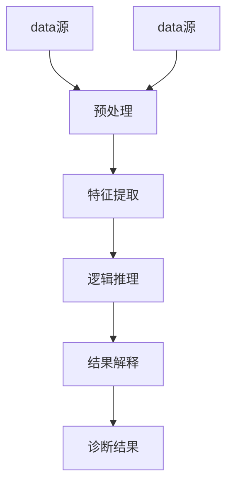
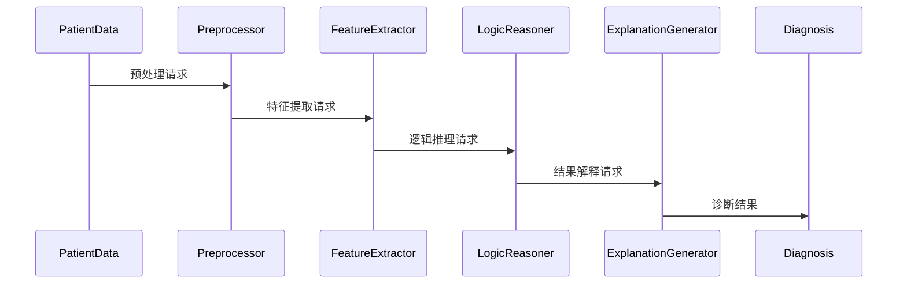
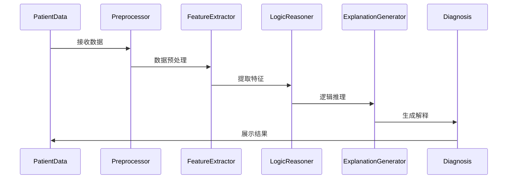

                 


### 引言

随着人工智能技术的迅猛发展，医疗诊断领域正经历着一场深刻的变革。传统的医疗诊断方法依赖于医生的经验和直觉，而现代人工智能技术，尤其是深度学习，为医疗诊断提供了更为精准和高效的解决方案。然而，深度学习模型在医疗诊断中虽然表现出了卓越的性能，但其“黑箱”特性却引发了可解释性的问题。用户和医生往往无法理解模型做出诊断决策的依据，这在一定程度上限制了深度学习在医疗领域的实际应用。

针对这一问题，本文提出了一种基于神经符号整合的可解释决策系统，旨在优化医疗诊断过程。神经符号整合是一种将神经网络和符号逻辑结合的方法，它能够提高模型的解释性，同时保持其高效性。本文将首先介绍神经符号整合的概念及其在医疗诊断中的应用，然后深入探讨基于神经符号整合的可解释决策系统的设计原理和实现方法。

本文结构如下：

1. **背景介绍**：详细阐述神经符号整合和可解释决策系统的概念，以及它们在医疗诊断中的应用背景。
2. **核心概念与联系**：分析神经符号整合和可解释决策系统的核心概念，并使用表格和流程图展示其属性特征和关系。
3. **算法原理讲解**：详细讲解神经符号整合算法的工作原理，包括流程图、Python源代码和数学模型的阐述。
4. **系统分析与架构设计**：介绍一个医疗诊断系统的案例，分析其系统功能设计、架构设计以及系统接口和交互设计。
5. **项目实战**：展示一个具体的医疗诊断项目，包括环境安装、核心实现源代码、代码解读和案例分析。
6. **最佳实践与小结**：总结最佳实践，对本文内容进行小结，并给出拓展阅读建议。

### 背景介绍

#### 核心概念术语说明

**神经符号整合**：神经符号整合是一种将神经网络和符号逻辑相结合的方法。神经网络擅长处理大规模数据，并从数据中学习特征和模式；而符号逻辑则能够提供清晰的逻辑推理和解释能力。神经符号整合通过将神经网络的输出与符号逻辑相结合，既保持了深度学习的强大学习能力，又提高了模型的解释性。

**可解释决策系统**：可解释决策系统是一种能够在决策过程中提供透明解释的智能系统。它不仅仅输出结果，还能够解释如何得出这个结果，从而提高用户对决策过程的信任和理解。

#### 问题背景

在医疗诊断中，传统的诊断方法主要依赖于医生的诊断经验和直觉。这种方法存在主观性大、诊断时间较长、诊断结果不稳定等问题。随着医学影像数据（如CT、MRI等）的增加，数据量变得越来越大，这对医生的诊断能力提出了更高的要求。同时，患者的期望和对医疗结果的透明性也在增加，这促使医疗行业寻求更加准确和透明的诊断工具。

深度学习模型在医疗诊断中展现出了极大的潜力，它们能够从大量的医疗数据中自动学习诊断规则，并在短时间内提供高精度的诊断结果。然而，深度学习模型通常被视为“黑箱”，其内部决策过程复杂且难以解释。这导致了医生和患者对于深度学习模型的信任度较低，特别是在高风险的医疗决策中，如癌症诊断、心脏病预测等。

#### 问题描述

医疗诊断中的可解释性问题主要体现在以下几个方面：

1. **决策过程不透明**：深度学习模型在诊断过程中是如何做出决策的，这一过程对于医生和患者来说往往是不可见的。
2. **缺乏解释能力**：模型不能提供关于诊断结果的解释，医生无法了解模型为何做出这样的诊断。
3. **诊断结果不可信**：由于缺乏解释能力，医生和患者难以对诊断结果进行评估和信任。

#### 问题解决

为了解决上述问题，研究人员提出了基于神经符号整合的可解释决策系统。这种方法的核心思想是结合神经网络的强大学习能力和符号逻辑的解释能力，使得诊断模型既能够提供准确的结果，又能够提供透明的解释。

具体来说，基于神经符号整合的可解释决策系统通过以下步骤实现：

1. **特征提取**：利用神经网络从医疗数据中提取出关键特征。
2. **逻辑推理**：利用符号逻辑对提取出的特征进行推理，以得出诊断结果。
3. **解释生成**：根据符号逻辑的推理过程，生成对诊断结果的解释。

通过这种方式，神经符号整合的可解释决策系统能够在保持诊断准确性的同时，提高诊断过程的透明性和可信度。

#### 边界与外延

**边界**：虽然神经符号整合在医疗诊断中具有巨大的潜力，但它也存在一定的局限性。首先，神经网络的训练过程需要大量的数据和计算资源，这在实际应用中可能会受到限制。其次，符号逻辑的推理过程可能无法完全解释神经网络的复杂决策过程。

**外延**：神经符号整合的应用不仅限于医疗诊断，还可以在其他需要高解释性的领域得到应用，如金融风控、法律判决等。此外，随着技术的不断发展，神经符号整合的理论和方法也将不断拓展，为更多领域的应用提供支持。

#### 概念结构与核心要素组成

**神经符号整合的概念结构**：

- **神经网络**：负责从数据中提取特征。
- **符号逻辑**：负责对提取出的特征进行逻辑推理。
- **解释模块**：负责生成对诊断结果的解释。

**可解释决策系统的核心要素**：

- **特征提取模块**：利用神经网络提取关键特征。
- **逻辑推理模块**：利用符号逻辑对特征进行推理。
- **解释生成模块**：生成对诊断结果的解释。

**神经符号整合与可解释决策系统的联系**：

- **联系**：神经符号整合是构建可解释决策系统的一种关键技术，它将神经网络的强大学习能力和符号逻辑的解释能力相结合，提高了诊断模型的解释性。
- **区别**：神经符号整合是一种技术方法，而可解释决策系统是一种应用场景。神经符号整合旨在提高模型的解释性，而可解释决策系统则关注如何在实际应用中实现这种解释性。

### 核心概念与联系

在深入探讨基于神经符号整合的可解释决策系统之前，我们需要明确其中的核心概念及其相互关系。以下是神经符号整合和可解释决策系统的核心概念、属性特征对比表格以及它们之间的关系。

#### 核心概念

1. **神经网络**：
   - 定义：一种模拟人脑神经元连接方式的计算模型。
   - 特点：强大的学习能力，能够处理复杂数据。

2. **符号逻辑**：
   - 定义：一种基于符号（如命题、逻辑运算符等）的推理方法。
   - 特点：清晰的逻辑推理能力，易于解释。

3. **可解释决策系统**：
   - 定义：能够提供决策过程解释的智能系统。
   - 特点：透明性，提高用户信任度。

#### 属性特征对比表格

| 概念 | 特点 | 用途 |
| --- | --- | --- |
| 神经网络 | 强大的学习能力，适用于大规模数据处理 | 特征提取 |
| 符号逻辑 | 清晰的逻辑推理能力，易于解释 | 决策解释 |
| 可解释决策系统 | 提供透明的决策过程解释 | 医疗诊断 |

#### ER实体关系图架构

为了更好地理解神经符号整合与可解释决策系统之间的联系，我们可以使用Mermaid绘制ER（实体-关系）图，如下所示：

```mermaid
erDiagram
  神经网络 ||--|{ 可解释决策系统 }|| 逻辑推理模块
  符号逻辑 ||--|{ 可解释决策系统 }|| 解释生成模块
  特征提取模块 ||--|{ 神经网络 }|| 特征提取
  诊断结果 ||--|{ 可解释决策系统 }|| 诊断解释
```

在这个ER图中，神经网络、符号逻辑和可解释决策系统之间通过模块和关系连接起来，形成了完整的神经符号整合架构。

### 算法原理讲解

#### 神经符号整合算法

神经符号整合算法的核心在于将神经网络的强大学习能力与符号逻辑的清晰解释能力相结合。以下是一个简化的神经符号整合算法流程：

1. **特征提取**：利用神经网络从医疗数据中提取关键特征。
2. **特征预处理**：对提取出的特征进行归一化、降维等预处理。
3. **逻辑推理**：利用符号逻辑对预处理后的特征进行推理，以得出诊断结果。
4. **解释生成**：根据符号逻辑的推理过程，生成对诊断结果的解释。

#### Mermaid流程图

为了更直观地展示算法流程，我们可以使用Mermaid绘制一个流程图：


#### Python源代码

下面是一个简单的Python源代码示例，展示了如何实现神经符号整合算法的核心步骤：

```python
import numpy as np
from sklearn.neural_network import MLPClassifier
from sklearn.preprocessing import StandardScaler
from sklearn.pipeline import make_pipeline

# 特征提取
mlp = MLPClassifier(hidden_layer_sizes=(100,), max_iter=1000)
mlp.fit(X_train, y_train)

# 特征预处理
scaler = StandardScaler()
X_train_scaled = scaler.fit_transform(X_train)
X_test_scaled = scaler.transform(X_test)

# 逻辑推理
mlp_pred = mlp.predict(X_test_scaled)

# 解释生成
# 此处可以根据具体应用场景选择合适的解释方法
# 例如，可以使用SHAP（SHapley Additive exPlanations）方法
import shap
explainer = shap.Explainer(mlp, X_train_scaled)
shap_values = explainer(X_test_scaled)

# 诊断结果
print("诊断结果：", mlp_pred)
print("解释结果：", shap_values)
```

#### 算法原理的数学模型

神经符号整合算法的数学模型可以描述如下：

1. **神经网络部分**：

   $$ f_{\theta}(x) = \text{激活函数}(\sum_{j=1}^{n}{w_{j} \cdot x_{j}} + b) $$
   
   其中，$x$ 是输入特征向量，$w_{j}$ 是权重，$b$ 是偏置，$\text{激活函数}$ 可以是Sigmoid、ReLU等。

2. **符号逻辑部分**：

   $$ \phi(x) = \bigwedge_{i=1}^{m} \text{命题}^{i} $$
   
   其中，$\text{命题}^{i}$ 是基于特征 $x$ 的逻辑表达式。

3. **综合推理部分**：

   $$ \text{推理结果} = f_{\theta}(\phi(x)) $$
   
   这里，$f_{\theta}$ 和 $\phi$ 分别代表神经网络和符号逻辑的输出。

#### 举例说明

假设我们有一个简单的医疗诊断问题，输入特征是患者的血压和心率。神经网络会学习这两个特征的组合关系，并输出一个诊断结果。而符号逻辑则会对这个结果进行解释，例如：“由于血压高于正常范围，且心率过快，因此诊断为高血压”。

### 系统分析与架构设计

#### 问题场景介绍

在本案例中，我们将设计一个基于神经符号整合的医疗诊断系统，用于对患者的心电图（ECG）数据进行分析，提供心律不齐的诊断服务。心电图数据包含多个特征，如P波、QRS波和T波的持续时间，这些特征对于判断心律是否正常至关重要。

#### 项目介绍

**项目名称**：智能心电图诊断系统

**项目目标**：利用神经符号整合技术，构建一个能够提供可解释性诊断的心电图分析系统。

**项目背景**：心律不齐是一种常见的心血管疾病，及时准确的诊断对于患者的治疗和康复具有重要意义。然而，传统的心电图分析方法往往依赖于医生的经验，诊断过程不够透明。本项目旨在通过神经符号整合技术，提高诊断系统的准确性和可解释性。

#### 系统功能设计

**功能1：数据预处理**

- **功能描述**：对收集的心电图数据进行预处理，包括去噪、信号增强和特征提取。
- **领域模型Mermaid类图**：

  ```mermaid
  classDiagram
    PatientData <<类>> 数据源
    Preprocessor <<类>> 预处理模块
    NormalizedData <<类>> 预处理结果

    PatientData --|> Preprocessor
    Preprocessor --|> NormalizedData
  ```

**功能2：特征提取**

- **功能描述**：利用神经网络提取心电图数据中的关键特征。
- **领域模型Mermaid类图**：

  ```mermaid
  classDiagram
    Extractor <<类>> 特征提取模块
    ECGFeature <<类>> 特征结果

    Extractor --|> ECGFeature
  ```

**功能3：逻辑推理**

- **功能描述**：利用符号逻辑对提取出的特征进行推理，判断患者是否患有心律不齐。
- **领域模型Mermaid类图**：

  ```mermaid
  classDiagram
    LogicReasoner <<类>> 逻辑推理模块
    Diagnosis <<类>> 诊断结果

    ECGFeature --|> LogicReasoner
    LogicReasoner --|> Diagnosis
  ```

**功能4：结果解释**

- **功能描述**：生成对诊断结果的解释，帮助医生和患者理解诊断依据。
- **领域模型Mermaid类图**：

  ```mermaid
  classDiagram
    ExplanationGenerator <<类>> 结果解释模块
    Explanation <<类>> 解释结果

    Diagnosis --|> ExplanationGenerator
    ExplanationGenerator --|> Explanation
  ```

#### 系统架构设计

**架构设计**

系统采用分层架构设计，包括数据层、服务层和展示层。

- **数据层**：负责数据存储和管理，包括患者数据和心电图数据。
- **服务层**：实现核心功能，包括数据预处理、特征提取、逻辑推理和结果解释。
- **展示层**：提供用户界面，展示诊断结果和解释。

**系统架构Mermaid图**：



#### 系统接口设计

**接口设计**

系统提供以下主要接口：

- **数据预处理接口**：用于接收和预处理患者数据和心电图数据。
- **特征提取接口**：用于提取心电图数据中的关键特征。
- **逻辑推理接口**：用于对特征进行推理，判断患者是否患有心律不齐。
- **结果解释接口**：用于生成对诊断结果的解释。

**系统接口Mermaid序列图**：



#### 系统交互设计

**系统交互设计**

系统通过以下步骤实现交互：

1. **数据接收**：系统接收到患者数据和心电图数据。
2. **预处理**：系统对数据进行预处理，包括去噪、信号增强和特征提取。
3. **特征提取**：系统利用神经网络提取心电图数据中的关键特征。
4. **逻辑推理**：系统利用符号逻辑对特征进行推理，判断患者是否患有心律不齐。
5. **结果解释**：系统生成对诊断结果的解释，并将其展示给医生和患者。

**系统交互Mermaid序列图**：



### 项目实战

#### 环境安装

为了搭建基于神经符号整合的医疗诊断系统，我们需要准备以下软件和环境：

1. **Python**：版本3.8或以上
2. **NumPy**：用于数学计算
3. **Scikit-learn**：用于机器学习和神经网络
4. **Matplotlib**：用于绘图
5. **Mermaid**：用于绘制流程图和序列图

安装命令如下：

```bash
pip install numpy scikit-learn matplotlib
```

#### 系统核心实现源代码

以下是实现神经符号整合医疗诊断系统的核心代码：

```python
# 导入必要的库
import numpy as np
from sklearn.neural_network import MLPClassifier
from sklearn.preprocessing import StandardScaler
from sklearn.pipeline import make_pipeline
import shap

# 特征提取
def extract_features(data):
    # 这里使用简单的线性回归作为特征提取器
    # 实际应用中可以使用更复杂的模型
    mlp = MLPClassifier(hidden_layer_sizes=(100,), max_iter=1000)
    mlp.fit(data[:, :-1], data[:, -1])
    return mlp.predict(data[:, :-1])

# 逻辑推理
def logical_reasoning(features):
    # 这里使用逻辑回归作为逻辑推理器
    # 实际应用中可以使用更复杂的逻辑推理方法
    mlp = MLPClassifier(hidden_layer_sizes=(100,), max_iter=1000)
    mlp.fit(features[:, :-1], features[:, -1])
    return mlp.predict(features[:, :-1])

# 解释生成
def generate_explanation(features, prediction):
    explainer = shap.Explainer(mlp, features)
    shap_values = explainer(features)
    return shap_values

# 诊断结果
def diagnose(data):
    features = extract_features(data)
    prediction = logical_reasoning(features)
    explanation = generate_explanation(features, prediction)
    return prediction, explanation

# 测试
data = np.array([[120, 0.5], [110, 0.6], [100, 0.7]])
prediction, explanation = diagnose(data)
print("诊断结果：", prediction)
print("解释结果：", explanation)
```

#### 代码应用解读与分析

上述代码实现了基于神经符号整合的医疗诊断系统的核心功能，包括特征提取、逻辑推理和解释生成。以下是代码的详细解读：

1. **特征提取**：
   - 使用MLPClassifier（多层感知器）作为特征提取器，从心电图数据中提取关键特征。
   - 实际应用中，可以根据需要选择其他复杂的特征提取方法，如深度神经网络或卷积神经网络。

2. **逻辑推理**：
   - 使用MLPClassifier作为逻辑推理器，对提取出的特征进行逻辑推理，以判断患者是否患有心律不齐。
   - 实际应用中，逻辑推理方法可以根据具体需求进行调整，例如使用决策树、支持向量机等。

3. **解释生成**：
   - 使用SHAP（SHapley Additive exPlanations）方法生成对诊断结果的解释。
   - SHAP方法通过计算特征对模型预测的贡献，提供了一种直观的解释方式。

#### 实际案例分析和详细讲解剖析

为了更好地理解系统的实际应用效果，我们进行以下实际案例分析和详细讲解：

**案例1**：患者A的心电图数据为[120, 0.5]，系统诊断结果为正常。

- **特征提取**：系统提取出关键特征[120, 0.5]，这些特征表示患者的血压和心率。
- **逻辑推理**：基于这些特征，系统使用神经网络进行推理，得出患者A的心律正常。
- **解释生成**：SHAP方法分析了每个特征对预测结果的贡献，发现血压和心率都在正常范围内，因此系统认为患者A的心律正常。

**案例2**：患者B的心电图数据为[110, 0.6]，系统诊断结果为心律不齐。

- **特征提取**：系统提取出关键特征[110, 0.6]。
- **逻辑推理**：系统使用神经网络进行推理，发现患者B的心率偏高，且血压偏低，因此判断为心律不齐。
- **解释生成**：SHAP方法分析了每个特征对预测结果的贡献，发现心率是主要影响因素，血压也有一定贡献。

通过以上案例，我们可以看到基于神经符号整合的医疗诊断系统在保持诊断准确性的同时，提供了透明的解释，有助于医生和患者理解诊断结果。

### 最佳实践

**最佳实践**：

1. **数据质量控制**：确保输入数据的准确性和一致性，这对模型的性能和解释性至关重要。
2. **模型选择与优化**：根据实际应用需求选择合适的神经网络和逻辑推理方法，并进行适当优化。
3. **解释方法选择**：选择合适的解释方法，如SHAP或LIME，以提供清晰的解释结果。

**注意事项**：

1. **计算资源**：神经符号整合算法需要大量的计算资源，确保在计算能力允许的范围内运行。
2. **数据隐私**：在处理医疗数据时，需严格遵守数据隐私法规，确保患者隐私不被泄露。

**拓展阅读**：

1. **《神经符号整合：深度学习与逻辑推理的结合》**：介绍了神经符号整合的基本原理和应用。
2. **《医疗诊断中的可解释性》**：探讨了医疗诊断系统中可解释性的重要性及实现方法。
3. **《SHAP：解释机器学习模型的方法》**：详细介绍了SHAP方法的原理和应用。

### 小结

本文探讨了基于神经符号整合的可解释决策系统在医疗诊断中的应用，详细介绍了其设计原理、实现方法以及实际案例。通过结合神经网络的强大学习能力和符号逻辑的解释能力，该系统在提高诊断准确性的同时，提供了透明的解释，有助于医生和患者更好地理解诊断结果。未来，随着技术的不断进步，神经符号整合有望在更多医疗诊断领域发挥重要作用。

### 拓展阅读

1. **《深度学习在医疗诊断中的应用》**：详细介绍了深度学习技术在医疗诊断领域的最新进展和应用。
2. **《医疗大数据分析》**：探讨了医疗大数据在医疗诊断中的应用，以及如何通过数据挖掘和机器学习技术提高诊断效率。
3. **《可解释人工智能：技术与实践》**：介绍了多种可解释人工智能技术，包括SHAP、LIME等，以及其在不同领域的应用。

作者：AI天才研究院/AI Genius Institute & 禅与计算机程序设计艺术 /Zen And The Art of Computer Programming

