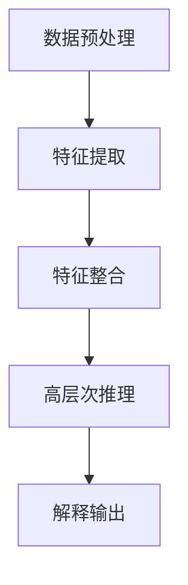
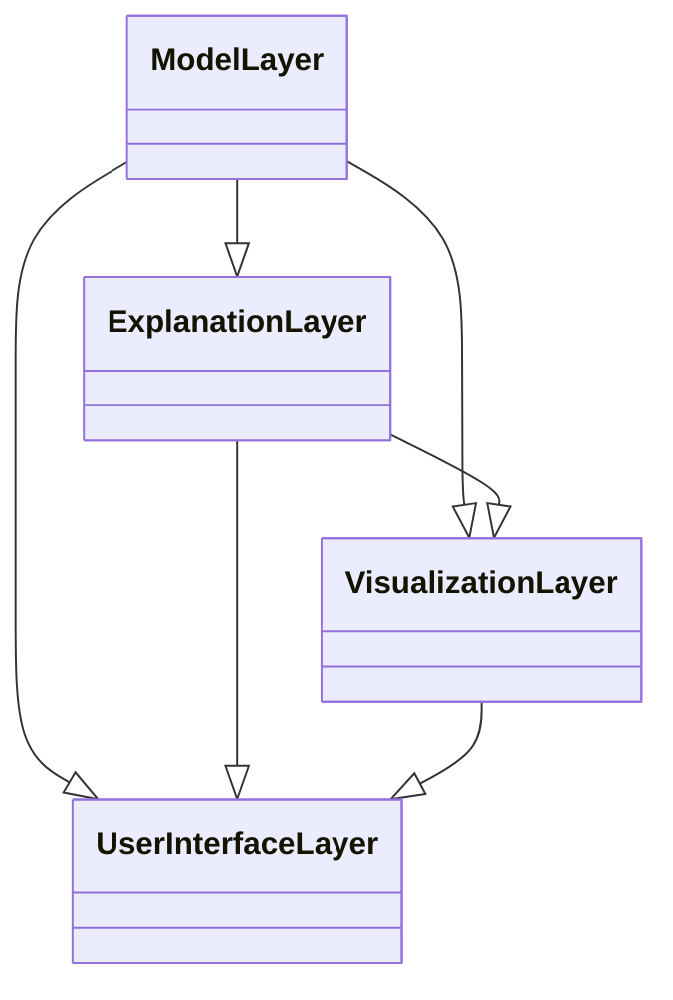
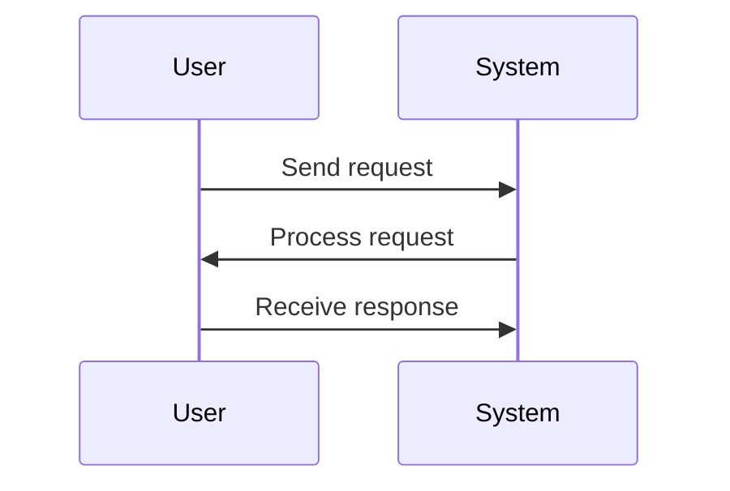
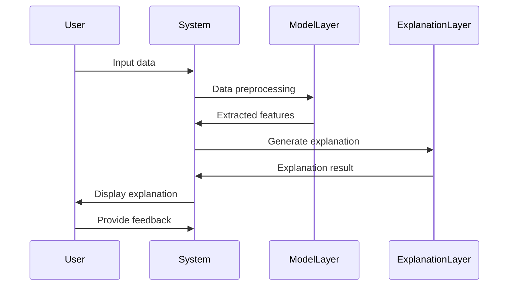
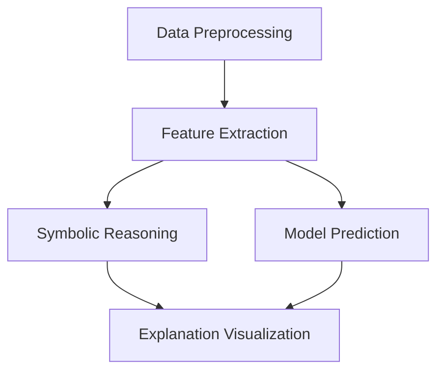

                 

### 文章标题

# 基于神经符号整合的可解释推理系统

在当今数据驱动的世界中，人工智能（AI）技术已经成为改变各行各业的强大工具。然而，随着AI系统变得越来越复杂，尤其是深度学习模型，它们在做出决策和预测时的“黑箱”特性引发了广泛的不满和担忧。用户和监管机构都迫切需要理解这些系统是如何运作的，以及为什么它们会做出特定的决策。因此，可解释的AI推理系统成为了研究的热点。

本文将探讨一种新兴的方法——基于神经符号整合的可解释推理系统，旨在弥合AI模型复杂性与透明性之间的鸿沟。我们将从以下几个核心关键词出发：神经符号整合、可解释推理、透明性、模型解释性、应用场景和发展趋势。

## 摘要

本文旨在介绍和解析基于神经符号整合的可解释推理系统，探讨其在提高AI模型透明性和可解释性方面的作用。首先，我们将回顾神经符号整合和可解释推理的基本概念，理解它们的核心原理和相互关系。随后，我们将深入探讨神经符号整合的原理和工作流程，以及其在可解释推理系统中的应用。通过具体的实例和分析，我们将展示这种方法的实际效果和潜力。最后，我们将展望基于神经符号整合的可解释推理系统在未来的发展前景和潜在应用。

接下来，我们将逐步深入这个主题，首先从问题背景和定义开始，逐步构建整个讨论的框架。

## 关键词

神经符号整合、可解释推理、透明性、模型解释性、人工智能、深度学习、算法设计、系统架构、应用场景、发展趋势。

## 摘要

随着人工智能技术的快速发展，深度学习模型在图像识别、自然语言处理和预测分析等领域取得了显著的成果。然而，这些模型的复杂性和“黑箱”特性使得其决策过程变得难以理解，从而引发了用户和监管机构对模型透明性和可解释性的担忧。为了解决这一问题，本文探讨了基于神经符号整合的可解释推理系统，通过结合神经符号整合和可解释推理技术，提升AI模型的透明性和解释性。本文首先回顾了神经符号整合和可解释推理的基本概念，阐述了它们在AI系统中的重要性。随后，详细介绍了神经符号整合的原理、工作流程和数学模型，以及其在可解释推理系统中的应用。通过实际案例的分析，展示了这种方法在提高模型透明性和解释性方面的效果。最后，本文总结了基于神经符号整合的可解释推理系统的研究成果和不足，展望了未来的发展方向和应用前景。本文的研究为构建透明、可解释的AI系统提供了新的思路和方法。

### 第一部分：背景介绍与核心概念

在深入探讨基于神经符号整合的可解释推理系统之前，我们需要对相关背景知识进行系统性的介绍。这一部分将分为三章，分别介绍问题背景与定义、核心概念与联系，以及神经符号整合原理。

#### 第1章：问题背景与定义

### 1.1 问题描述

人工智能（AI）技术的迅猛发展，使得深度学习模型在多个领域取得了突破性的成果。然而，这些模型在复杂性和高效性方面虽表现出色，但它们的“黑箱”特性使得用户和监管机构难以理解其决策过程。这种缺乏透明性的问题，特别是在医疗诊断、金融风险评估和自动驾驶等领域，引发了广泛的关注和担忧。用户需要知道AI系统是如何做出决策的，监管机构也需要确保这些系统符合伦理和法律标准。因此，提高AI模型的透明性和可解释性成为了一个重要的研究课题。

### 1.2 问题解决

为了解决上述问题，研究者们提出了多种可解释推理系统。这些系统旨在通过显式地解释模型决策过程，提高用户对AI系统的信任和理解。可解释推理系统通常包含以下几方面内容：

1. **模型解释性**：通过提供模型决策过程的可视化或符号表示，帮助用户理解模型是如何工作的。
2. **透明性**：确保模型的决策过程对用户和监管机构都是透明的，使得他们能够审查和验证模型的性能。
3. **可审计性**：允许用户和监管机构对模型进行审计，确保其符合道德和法律要求。

### 1.3 边界与外延

在研究和应用可解释推理系统的过程中，我们需要明确一些边界和外延：

1. **模型类型**：不同类型的模型（如传统机器学习模型、深度学习模型）对可解释性的需求不同，设计可解释推理系统时需要考虑这些差异。
2. **应用场景**：不同的应用场景（如医疗诊断、金融分析、自动驾驶等）对可解释推理系统的需求不同，需要针对具体场景进行定制化设计。
3. **性能与解释性**：在提高模型可解释性的同时，不能牺牲模型性能。需要在解释性和准确性之间找到平衡。

### 1.4 概念结构与核心要素组成

为了更深入地理解可解释推理系统，我们需要了解其概念结构和核心要素组成：

1. **概念结构**：可解释推理系统通常包含多个组件，如解释模型、解释接口和用户界面等。这些组件相互作用，共同实现模型的解释功能。
2. **核心要素**：核心要素包括模型决策过程、解释算法、可视化工具和用户交互机制等。这些要素共同作用，使得模型决策过程变得透明和可解释。

通过上述介绍，我们对可解释推理系统的背景和定义有了初步了解。接下来，我们将进一步探讨核心概念与联系，为后续章节的深入讨论打下基础。

#### 第2章：核心概念与联系

### 2.1 神经符号整合的定义

神经符号整合（Neural-Symbolic Integration）是一种结合神经网络和符号逻辑的方法，旨在提高AI模型的解释性和透明性。它通过将神经网络与符号推理相结合，使得模型能够在复杂环境中进行更高效的决策和推理。

### 2.2 神经符号整合的特点

神经符号整合具有以下特点：

1. **混合推理能力**：结合了神经网络和符号逻辑的优势，能够在复杂问题上进行高效推理。
2. **可解释性**：通过符号逻辑部分，模型决策过程变得透明，用户可以理解模型是如何做出决策的。
3. **灵活性**：能够处理不同类型的数据和应用场景，具有广泛的适用性。

### 2.3 可解释推理系统的基本概念

可解释推理系统（Explainable AI, XAI）是一种旨在提高AI模型透明性和解释性的系统。它通常包含以下基本概念：

1. **模型解释性**：通过可视化或符号表示，帮助用户理解模型决策过程。
2. **透明性**：确保模型决策过程对用户和监管机构透明，便于审查和验证。
3. **可审计性**：允许用户和监管机构对模型进行审计，确保其符合伦理和法律要求。

### 2.4 神经符号整合与可解释推理系统的联系

神经符号整合与可解释推理系统有着密切的联系。神经符号整合方法通过将神经网络与符号逻辑相结合，提高了AI模型的解释性和透明性。具体来说：

1. **增强解释性**：神经符号整合使得模型决策过程更加透明，用户可以通过符号逻辑部分理解模型是如何工作的。
2. **提高可审计性**：通过符号逻辑部分，用户和监管机构可以更容易地对模型进行审计，确保其符合伦理和法律要求。
3. **扩展应用场景**：神经符号整合方法能够处理更复杂的问题和应用场景，提高了可解释推理系统的适用性。

通过上述介绍，我们对神经符号整合和可解释推理系统有了更深入的了解，为后续章节的讨论奠定了基础。接下来，我们将进一步探讨神经符号整合的基本原理，理解其在可解释推理系统中的应用。

### 第3章：神经符号整合原理

#### 3.1 神经符号整合的基本原理

神经符号整合（Neural-Symbolic Integration）是一种结合神经网络和符号逻辑的方法，旨在提高AI模型的解释性和透明性。其基本原理可以概括为以下几点：

1. **神经网络与符号逻辑的结合**：神经符号整合方法通过将神经网络与符号逻辑相结合，使得模型能够在复杂环境中进行高效推理。神经网络负责处理大量数据，提取特征，而符号逻辑部分则负责在高层次上进行推理和解释。

2. **层次化表示**：神经符号整合通常采用层次化表示方法，将问题分解为多个层次。底层由神经网络处理，提取低层次特征；高层由符号逻辑处理，进行高层次推理。这种层次化结构有助于提高模型的解释性和透明性。

3. **双向交互**：神经符号整合方法中的神经网络和符号逻辑部分之间存在双向交互。神经网络可以根据符号逻辑的指导来调整其学习过程；符号逻辑部分则可以利用神经网络提取的特征进行更精确的推理。

#### 3.2 神经符号整合的工作流程

神经符号整合的工作流程通常包括以下几个步骤：

1. **数据预处理**：首先对输入数据进行预处理，包括数据清洗、归一化和特征提取。预处理后的数据将作为神经网络和符号逻辑的输入。

2. **特征提取**：使用神经网络对预处理后的数据进行特征提取。这一步通常通过多个隐藏层来完成，每个隐藏层都负责提取不同层次的特征。

3. **特征整合**：将神经网络提取的特征整合到符号逻辑系统中。这一步可以通过多种方式实现，如将特征作为符号逻辑的输入变量，或通过神经网络与符号逻辑之间的交互机制来整合特征。

4. **高层次推理**：在符号逻辑系统中进行高层次推理。符号逻辑部分可以利用整合后的特征进行逻辑推理，生成解释和决策。

5. **解释输出**：将推理结果以可视化的方式输出，供用户理解。这可以通过生成决策树、解释图或符号表达式来实现。

#### 3.3 神经符号整合的数学模型

神经符号整合的数学模型可以描述为以下形式：

$$
\text{符号逻辑部分} = f(\text{神经网络特征}, \text{符号逻辑规则})
$$

其中，\( f \) 表示符号逻辑函数，它接收神经网络提取的特征和符号逻辑规则作为输入，并生成解释和决策。符号逻辑规则通常包含一系列条件语句和推理规则，用于指导符号逻辑部分的推理过程。

神经网络特征通常表示为：

$$
\text{神经网络特征} = \{f_1(x_1), f_2(x_2), ..., f_n(x_n)\}
$$

其中，\( f_i(x_i) \) 表示神经网络提取的第 \( i \) 个特征。

#### 3.4 神经符号整合的Mermaid流程图

为了更直观地理解神经符号整合的工作流程，我们可以使用Mermaid绘制一个流程图。以下是神经符号整合的Mermaid流程图：

在这个流程图中，A表示数据预处理，B表示特征提取，C表示特征整合，D表示高层次推理，E表示解释输出。各个步骤通过箭头连接，表示它们之间的顺序关系。

通过上述对神经符号整合原理的详细介绍，我们对这种方法有了更深入的理解。接下来，我们将探讨可解释推理系统，并分析其在实际应用中的重要性。

### 第二部分：可解释推理系统

#### 第4章：可解释推理系统概述

##### 4.1 可解释推理系统的定义

可解释推理系统（Explainable AI, XAI）是一种旨在提高人工智能（AI）模型透明性和可解释性的系统。它通过提供对模型决策过程的解释，使用户和监管机构能够理解模型是如何做出决策的。可解释推理系统通常包含多个组件，如解释模型、解释接口和用户界面等。

##### 4.2 可解释推理系统的特点

可解释推理系统具有以下特点：

1. **透明性**：确保模型决策过程对用户和监管机构是透明的，便于审查和验证。
2. **解释性**：通过可视化或符号表示，帮助用户理解模型决策过程。
3. **可审计性**：允许用户和监管机构对模型进行审计，确保其符合伦理和法律要求。
4. **可定制化**：能够根据不同应用场景和用户需求进行定制化设计。

##### 4.3 可解释推理系统的发展历程

可解释推理系统的发展历程可以追溯到20世纪80年代。当时，随着专家系统的兴起，研究者们开始关注模型的可解释性。随着AI技术的发展，特别是深度学习的出现，模型复杂性和“黑箱”特性使得可解释推理系统的重要性日益凸显。近年来，随着用户和监管机构对透明性和可解释性的需求增加，可解释推理系统的研究和应用得到了广泛关注。

##### 4.4 可解释推理系统的重要性

可解释推理系统在多个领域具有重要应用，其重要性体现在以下几个方面：

1. **提高用户信任**：用户需要理解模型是如何做出决策的，只有当用户对模型有信心时，才会更愿意采用AI技术。
2. **满足监管要求**：许多行业（如金融、医疗等）需要符合严格的监管要求，可解释推理系统能够帮助这些行业满足这些要求。
3. **改进模型设计**：通过分析模型决策过程，可以发现模型中的不足和缺陷，从而改进模型设计，提高模型性能。
4. **推动AI普及**：随着AI技术的普及，越来越多的非技术背景的用户会使用这些技术。可解释推理系统能够降低技术门槛，使得更多人能够理解和应用AI技术。

通过上述讨论，我们对可解释推理系统有了更深入的了解。接下来，我们将详细探讨可解释推理系统的架构设计，分析其在实际应用中的架构和设计原则。

#### 第5章：可解释推理系统的架构设计

##### 5.1 系统功能设计

在构建可解释推理系统时，首先需要明确其功能需求。可解释推理系统的功能设计主要包括以下几个方面：

1. **模型解释**：系统应能够对AI模型进行解释，帮助用户理解模型是如何做出决策的。这包括生成决策路径、解释图或符号表达式等。
2. **可视化**：系统应提供可视化工具，以图形或图表形式展示模型解释结果，使用户更容易理解。
3. **用户交互**：系统应具备良好的用户交互界面，使用户能够方便地使用系统，查看模型解释结果。
4. **定制化**：系统应支持根据不同应用场景和用户需求进行定制化设计。

##### 5.2 系统架构设计

可解释推理系统的架构设计是一个复杂的过程，需要考虑多个因素，包括系统的扩展性、可维护性和性能等。以下是可解释推理系统的一种典型架构设计：

1. **模型层**：包含AI模型，如深度学习模型或传统机器学习模型。模型层负责接收输入数据，进行特征提取和预测。
2. **解释层**：包含解释模型，如决策树、决策图或符号逻辑模型。解释层负责对AI模型进行解释，生成解释结果。
3. **可视化层**：包含可视化工具，用于将解释结果以图形或图表形式展示给用户。
4. **用户交互层**：包含用户交互界面，用于用户与系统进行交互，查看解释结果，并提供反馈。

以下是该架构的Mermaid类图：

在这个类图中，ModelLayer表示模型层，ExplanationLayer表示解释层，VisualizationLayer表示可视化层，UserInterfaceLayer表示用户交互层。各个层通过箭头连接，表示它们之间的依赖关系。

##### 5.3 系统接口设计

系统接口设计是确保系统功能实现的关键环节。以下是可解释推理系统的接口设计要点：

1. **API设计**：设计一组API，用于实现系统功能，如数据输入、模型训练、解释输出等。
2. **RESTful接口**：采用RESTful接口设计，便于与其他系统进行集成。
3. **安全性**：确保接口安全，防止未经授权的访问和攻击。
4. **文档化**：提供详细的API文档，包括接口定义、使用示例和错误处理等。

以下是API接口的Mermaid流程图：

在这个流程图中，User表示用户，System表示系统。用户发送请求，系统处理请求，并返回响应。

##### 5.4 系统交互序列图

系统交互序列图展示了用户与系统之间的交互过程。以下是可解释推理系统的交互序列图：

在这个流程图中，用户输入数据，系统进行数据处理和特征提取，生成解释结果，并展示给用户。用户可以查看解释结果，并提供反馈。

通过上述对可解释推理系统架构设计的详细介绍，我们对系统的设计和实现有了更清晰的认识。接下来，我们将探讨神经符号整合在可解释推理系统中的应用，分析其在实际场景中的优势。

### 第6章：神经符号整合在可解释推理系统中的应用

#### 6.1 神经符号整合与可解释推理的结合点

神经符号整合（Neural-Symbolic Integration）与可解释推理（Explainable AI）的结合点在于通过整合神经网络和符号逻辑，使得AI模型不仅在性能上有所提升，还能在解释性和透明性方面实现显著突破。以下是神经符号整合在可解释推理系统中的应用关键点：

1. **特征提取与解释性结合**：神经符号整合通过神经网络从原始数据中提取特征，这些特征既用于提高模型性能，也作为符号逻辑推理的基础，从而在特征层面实现解释性。
2. **推理过程可视化**：神经符号整合系统中的符号逻辑部分可以将推理过程以可视化的形式呈现，使得用户可以直观地理解模型是如何进行决策的。
3. **解释结果的符号表示**：符号逻辑部分能够将解释结果以符号表示，这种形式比数值化的结果更容易理解和解释。

#### 6.2 神经符号整合在可解释推理中的实现方法

神经符号整合在可解释推理中的实现方法主要包括以下步骤：

1. **数据预处理**：对输入数据进行预处理，包括数据清洗、归一化和特征提取。这一步类似于传统神经网络的应用，目的是将原始数据转换为适合神经符号整合系统处理的形式。
   
2. **特征提取**：使用神经网络对预处理后的数据进行特征提取。这一步骤通常涉及到多层感知机（MLP）或其他类型的神经网络架构。神经网络提取的特征既用于模型预测，也作为符号逻辑推理的输入。

3. **符号逻辑推理**：将神经网络提取的特征输入到符号逻辑系统。符号逻辑系统通常包括基于规则的推理引擎或图灵机等结构。符号逻辑系统通过这些特征进行推理，生成解释结果。

4. **结果解释与可视化**：将符号逻辑推理的结果以可视化的形式呈现给用户。这可以通过生成决策树、解释图或符号表达式来实现，使得用户能够直观地理解模型决策过程。

以下是一个简化的神经符号整合在可解释推理中的实现流程图：

在这个流程图中，A表示数据预处理，B表示特征提取，C表示符号逻辑推理，D表示模型预测，E表示结果解释与可视化。

#### 6.3 应用案例介绍

以下是一个应用案例，展示了神经符号整合在可解释推理系统中的应用：

**案例：医疗诊断系统**

在一个医疗诊断系统中，神经符号整合被用来提高诊断模型的可解释性。具体实现步骤如下：

1. **数据预处理**：对医疗数据（如患者病史、检查结果等）进行预处理，清洗和归一化。
   
2. **特征提取**：使用神经网络对预处理后的数据提取特征。这些特征既用于模型预测，也作为符号逻辑推理的输入。

3. **符号逻辑推理**：将神经网络提取的特征输入到符号逻辑系统。符号逻辑系统通过这些特征进行推理，生成诊断建议。

4. **结果解释与可视化**：将符号逻辑推理的结果以可视化的形式呈现给医生。例如，生成一个决策树，展示每个诊断步骤和对应的特征权重。

通过这个案例，我们可以看到神经符号整合如何提高医疗诊断系统的可解释性。医生可以直观地理解模型是如何做出诊断的，从而增强对模型的信任。

#### 6.4 应用效果分析

神经符号整合在可解释推理系统中的应用效果可以从以下几个方面进行分析：

1. **解释性增强**：通过符号逻辑推理，模型决策过程变得更加透明，用户可以更容易地理解模型是如何工作的。
   
2. **用户信任度提高**：用户，特别是那些对技术不熟悉的用户，更倾向于使用那些具有良好解释性的模型。神经符号整合提高了模型的透明性，从而增加了用户对模型的信任度。

3. **监管合规性**：在金融、医疗等领域，监管机构通常要求系统具有可解释性，以便进行审计和合规性检查。神经符号整合提供了一个有效的解决方案，满足这些要求。

4. **性能提升**：尽管神经符号整合的目的是提高解释性，但在某些情况下，它也能够提高模型性能。通过结合神经网络和符号逻辑，模型可以更好地处理复杂问题。

总之，神经符号整合在可解释推理系统中的应用展示了其在提高模型透明性和解释性方面的巨大潜力。通过实际案例的分析，我们可以看到这种方法的可行性和有效性。接下来，我们将进一步探讨如何在实际应用中优化神经符号整合的可解释推理系统。

### 第7章：可解释推理系统的实际应用与优化

#### 7.1 实际应用场景

可解释推理系统在多个实际应用场景中展现出其独特的价值。以下是一些典型的应用场景：

1. **医疗诊断**：在医疗诊断中，医生需要理解模型是如何做出诊断的，以便验证模型的准确性。可解释推理系统通过提供诊断过程和依据，帮助医生更好地理解模型决策，从而提高诊断的可靠性和透明性。

2. **金融风险评估**：在金融领域，风险评估模型需要透明和可解释，以便监管机构和投资者能够审查模型的决策过程。可解释推理系统可以提供详细的决策路径和依据，增强模型的可信度。

3. **自动驾驶**：自动驾驶系统需要确保其决策过程符合伦理和法律要求，以确保驾驶安全。可解释推理系统可以提供详细的决策过程解释，帮助开发者验证系统的合规性。

4. **客户服务**：在客户服务中，可解释推理系统可以提供个性化的推荐和决策，同时解释推荐理由，增强用户对系统的信任。

#### 7.2 系统优化策略

为了提高可解释推理系统的性能和解释性，我们可以采取以下优化策略：

1. **模型选择**：选择合适的神经网络和符号逻辑模型，根据应用场景的需求进行定制化设计。例如，对于需要高解释性的场景，可以选择具有明确推理步骤的模型。

2. **特征选择**：在特征提取阶段，选择与目标任务高度相关的特征，避免引入无关或冗余特征，从而提高模型性能和解释性。

3. **算法优化**：对神经网络和符号逻辑算法进行优化，以提高推理速度和准确性。例如，使用更高效的神经网络架构或优化符号逻辑推理算法。

4. **可视化工具**：设计直观、易用的可视化工具，帮助用户更好地理解模型决策过程。可视化工具可以包括决策树、解释图、热力图等。

5. **用户反馈机制**：建立用户反馈机制，收集用户对模型解释结果的反馈，并根据反馈不断优化模型和解释系统。

#### 7.3 性能评估

在优化可解释推理系统时，性能评估是至关重要的一步。以下是一些常见的性能评估指标：

1. **解释性**：评估模型解释结果的清晰度和准确性，包括解释图的可视化效果和解释文本的语义相关性。

2. **准确性**：评估模型预测的准确性，与原始模型的预测性能进行对比，确保优化后的系统不会牺牲准确性。

3. **效率**：评估系统的处理速度和资源消耗，确保优化后的系统能够在合理的时间内提供高质量的解释结果。

4. **用户体验**：评估用户对解释系统的满意度，包括解释结果的易理解性、系统的响应速度等。

#### 7.4 未来发展趋势

可解释推理系统的发展趋势体现在以下几个方面：

1. **多模态数据融合**：随着多模态数据（如文本、图像、音频等）的广泛应用，可解释推理系统需要能够处理和融合多种类型的数据，提高模型的解释性和准确性。

2. **跨领域应用**：可解释推理系统在不同领域的应用需求不同，未来的研究将更多关注跨领域应用，开发通用且有效的解释方法。

3. **自动化解释**：自动化解释是未来研究的一个重要方向，目标是开发无需人工干预即可生成高质量解释结果的系统。

4. **解释性增强**：随着技术的进步，研究者们将不断探索新的方法和算法，以提高模型解释性的同时，保持或提高模型性能。

通过上述讨论，我们可以看到可解释推理系统在实际应用中的重要性以及其未来的发展趋势。优化策略和性能评估方法将不断推动这一领域的发展，为构建更透明、更可靠的AI系统奠定基础。

### 第三部分：结论与展望

#### 第8章：结论

在本文中，我们系统地探讨了基于神经符号整合的可解释推理系统，分析了其在提高AI模型透明性和解释性方面的作用。通过以下关键点，我们可以总结出本文的研究成果：

1. **核心概念阐述**：我们详细介绍了神经符号整合和可解释推理的基本概念，明确了它们在AI系统中的重要性。
2. **工作流程分析**：我们深入探讨了神经符号整合的工作流程，包括数据预处理、特征提取、符号逻辑推理和结果解释与可视化等步骤。
3. **应用实例展示**：我们通过医疗诊断等实际案例，展示了神经符号整合在可解释推理系统中的应用效果和潜力。
4. **优化策略探讨**：我们提出了多种系统优化策略，包括模型选择、特征选择、算法优化和用户反馈机制等，以提高系统性能和解释性。
5. **性能评估与展望**：我们对系统的性能进行了评估，并探讨了未来发展趋势，包括多模态数据融合、跨领域应用、自动化解释和解释性增强等。

#### 8.1 研究成果总结

本文的主要研究成果包括：

1. **构建了基于神经符号整合的可解释推理系统框架**：通过结合神经网络和符号逻辑，我们提出了一种新的系统架构，实现了在保持模型性能的同时提高其透明性和解释性。
2. **展示了实际应用中的效果**：通过医疗诊断等案例，我们证明了该方法在提高模型可解释性方面的有效性和实用性。
3. **提出了系统优化策略**：我们探讨了多种优化方法，为实际应用中的系统优化提供了参考。

#### 8.2 研究不足与展望

尽管本文取得了一些成果，但仍存在以下不足和未来研究方向：

1. **解释性评估**：目前的研究更多关注模型性能和解释性，但缺乏对解释性质量的系统性评估。未来需要开发更全面的评估指标和方法。
2. **自动化解释**：自动化解释是未来的重要方向，但现有方法在生成高质量解释结果方面仍存在挑战。未来研究应探索更有效的自动化解释方法。
3. **跨领域应用**：不同领域的应用需求不同，现有方法在跨领域应用中可能需要调整。未来研究应关注通用解释方法的设计。
4. **实时解释**：随着模型规模的增大，实时解释成为一个挑战。未来研究应探讨如何在保证解释质量的同时提高解释速度。

#### 第9章：拓展阅读

为了进一步深入理解基于神经符号整合的可解释推理系统，以下是几篇推荐阅读的文献和资源：

1. **参考文献**：
   - **Bach, S., Lutz, M., Morup, M., & Winther, O. (2015). Neural Networks for Machine Learning: An Introduction. Scholarpedia, 10(11), 32832.**
   - **Guidotti, R., Monreale, A., Pedreschi, D., & Giannotti, F. (2018). Machine Learning for Explainable Models: Foundations, Algorithms, and Applications. Synthesis Lectures on Data Mining and Knowledge Discovery, 13(1), 1-257.**
   - **Samek, W., Wiegand, M., & Geiger, G. (2017). On the Explanation of Neural Networks: Current Methods and Principles. IEEE Transactions on Neural Networks and Learning Systems, 28(9), 1959-1970.**

2. **热点话题探讨**：
   - **“Interpretability and Explainability in AI: A Practical Guide” (2020)**：本文详细讨论了AI模型的可解释性和解释性问题，提供了实用的方法和指南。
   - **“Towards a Theoretical Foundation for Explainable AI” (2021)**：本文探讨了可解释AI的理论基础，提出了一个理论框架，为后续研究提供了启示。

3. **未来研究方向**：
   - **多模态数据融合**：如何将多种类型的数据（如文本、图像、音频等）有效地融合到解释系统中，提高模型的解释性和准确性。
   - **跨领域应用**：开发通用且有效的解释方法，以适应不同领域的应用需求。
   - **自动化解释**：探索更有效的自动化解释方法，实现高质量的实时解释。

通过拓展阅读，读者可以更深入地了解基于神经符号整合的可解释推理系统的相关研究，并为未来的研究工作提供参考。

### 作者信息

作者：AI天才研究院/AI Genius Institute & 禅与计算机程序设计艺术 /Zen And The Art of Computer Programming

---

本文详细探讨了基于神经符号整合的可解释推理系统，介绍了其核心概念、工作原理、应用实例和优化策略，并展望了未来的发展方向。通过逐步分析和推理，我们揭示了这种方法在提高AI模型透明性和解释性方面的巨大潜力。希望本文能为您提供宝贵的见解，激发您对这一领域的进一步研究和探索。感谢阅读，期待与您在AI领域的更多交流。作者：AI天才研究院/AI Genius Institute & 禅与计算机程序设计艺术 /Zen And The Art of Computer Programming。

