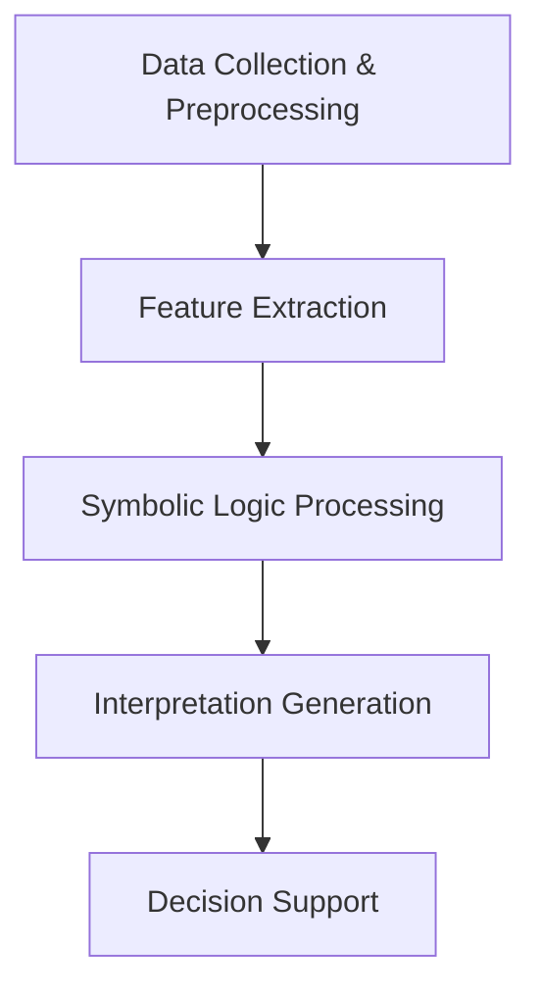

                 


# 第1章: 引言

## 第1.1节：问题背景

### 1.1.1 AI领域发展现状

人工智能（AI）作为当今技术发展的重要驱动力，已经深刻地影响着我们的日常生活和各行各业。从自动驾驶汽车到智能语音助手，从医疗诊断到金融分析，AI的应用场景不断扩展。然而，随着AI技术的不断进步，其复杂性和不可解释性也日益增强。许多AI系统，特别是深度学习模型，表现出卓越的性能，但它们的工作原理却难以解释。这种“黑盒”性质引发了用户对AI系统的信任危机，尤其是在涉及安全、伦理和法律问题的领域。

#### 1.1.2 可解释推理系统的重要性

在AI应用中，可解释性是一个关键需求。可解释推理系统旨在提高AI系统的透明度和可信度，使得用户能够理解系统的决策过程。这不仅有助于提高用户对AI系统的接受度，还能在法律和伦理方面提供必要的保障。例如，在医疗诊断中，医生需要理解AI系统的推荐理由；在金融风险管理中，监管机构需要确保AI系统符合法规要求。

#### 1.1.3 当前可解释推理系统的挑战

尽管可解释推理系统的重要性显而易见，但现有系统仍然面临诸多挑战。首先，如何在保持高性能的同时实现高可解释性是一个难题。其次，不同的应用场景对可解释性的要求有所不同，如何设计灵活且通用的可解释推理系统也是一个挑战。此外，现有技术往往缺乏对复杂问题的处理能力，难以满足实际需求。

## 第1.2节：问题描述

### 1.2.1 什么是神经符号整合？

神经符号整合是一种将神经网络和符号逻辑相结合的方法，旨在利用两者的优势，提高AI系统的性能和可解释性。神经网络擅长处理复杂的数据模式，而符号逻辑则具有强大的表达和推理能力。通过将这两者整合，可以在保持性能的同时，增强系统的可解释性。

### 1.2.2 什么是可解释推理系统？

可解释推理系统是一种能够提供决策过程透明度的系统。它不仅能够给出最终的决策结果，还能够解释为什么做出这样的决策。这种解释可以是基于规则的形式化表述，也可以是直观的图形或文本说明。

### 1.2.3 神经符号整合如何应用于可解释推理系统？

神经符号整合为可解释推理系统提供了一个强大的工具。通过将神经网络用于特征提取和模式识别，然后使用符号逻辑进行推理和解释，可以构建出一个既高效又可解释的AI系统。这种方法不仅能够提高系统的性能，还能够满足对可解释性的需求。

## 第1.3节：问题解决

本书的目标是深入探讨如何构建基于神经符号整合的可解释推理系统，并展示其在实际场景中的应用。本书将分为以下几个部分：

1. **核心概念介绍**：介绍神经符号整合和可解释推理系统的基本概念，帮助读者建立理论基础。
2. **算法原理讲解**：详细讲解神经符号整合算法的原理，并通过Python源代码实现，使读者能够直观地理解算法的实现过程。
3. **系统设计与实现**：介绍系统的架构设计，包括功能设计、系统接口设计和系统交互，并通过Mermaid图表展示系统组件之间的关系。
4. **项目实战**：通过实际案例展示如何构建和部署基于神经符号整合的可解释推理系统，并提供详细的代码解释和案例分析。
5. **最佳实践与小结**：总结全书要点，提供最佳实践建议，并指出在应用中需要注意的问题。

通过本书的阅读，读者将能够掌握构建和部署基于神经符号整合的可解释推理系统的技能，为解决现实世界中的复杂问题提供新的思路和方法。

## 第1.4节：边界与外延

### 1.4.1 适用范围

本书适用于对人工智能、机器学习和软件工程有一定了解的读者。无论是研究人员、工程师还是学生，都可以通过本书了解神经符号整合和可解释推理系统的原理和应用。

### 1.4.2 目标读者群体

本书的目标读者包括：

1. **人工智能研究者**：希望了解如何将神经符号整合应用于可解释推理系统的学者和研究人员。
2. **软件开发工程师**：负责开发和部署AI系统的工程师，希望提高系统的可解释性和透明度。
3. **学术学生**：计算机科学、人工智能等相关专业的本科生和研究生，作为学习材料或参考书。
4. **技术爱好者**：对AI技术有浓厚兴趣，希望深入学习和掌握相关技术的技术人员。

通过本书，读者不仅能够学习到神经符号整合和可解释推理系统的理论知识，还能通过实际案例和实践，提高自己的技术能力和应用水平。

## 第2章: 核心概念与联系

### 第2.1节：神经符号整合

#### 2.1.1 神经符号整合的定义

神经符号整合（Neural Symbolic Integration）是一种将神经网络（Neural Networks）和符号逻辑（Symbolic Logic）相结合的方法，旨在发挥两者的优势，提高人工智能系统的性能和可解释性。神经网络擅长处理大规模的数据，通过学习数据中的特征和模式，从而进行预测和分类。而符号逻辑则擅长表达和推理复杂的逻辑关系，能够提供系统决策过程的透明解释。

#### 2.1.2 神经符号整合与传统符号整合的区别

传统符号整合主要依赖于逻辑推理和规则系统，虽然具有较强的可解释性，但在处理复杂、非线性问题时往往力不从心。而神经符号整合则通过引入神经网络，使得系统能够高效地学习复杂的数据模式。这种结合不仅保留了传统符号逻辑的强大表达和推理能力，还通过神经网络的强大计算能力，提高了系统的整体性能。

#### 2.1.3 神经符号整合的特点

神经符号整合具有以下几个显著特点：

1. **高效性**：神经网络部分负责高效的特征提取和模式识别，能够处理大规模的数据。
2. **可解释性**：符号逻辑部分负责对神经网络的结果进行解释，使得系统的决策过程透明可理解。
3. **可扩展性**：神经符号整合方法可以根据不同的应用需求，灵活调整神经网络和符号逻辑的比例，实现定制化的解决方案。

### 第2.2节：可解释推理系统

#### 2.2.1 可解释推理系统的定义

可解释推理系统（Interpretable Reasoning Systems）是一种能够提供决策过程透明度的系统。它不仅能够给出最终的决策结果，还能够解释决策的原因和依据。这种解释可以是基于规则的形式化表述，也可以是直观的图形或文本说明。可解释推理系统的核心目标是提高人工智能系统的可信度和用户接受度。

#### 2.2.2 可解释推理系统与传统推理系统的区别

传统推理系统（如基于规则的专家系统）通常具有较高的可解释性，因为它们的决策过程是通过一系列明确的规则来实现的。然而，随着机器学习技术的兴起，许多现代AI系统（如深度学习模型）却表现出高度的复杂性和不可解释性。传统推理系统在处理复杂、非线性问题时效率较低，而现代AI系统则在处理大规模数据时具有显著优势。可解释推理系统旨在结合两者的优点，通过提供透明、可理解的决策过程，提高系统的可信度。

#### 2.2.3 可解释推理系统的基本组成

一个典型的可解释推理系统通常包括以下几个组成部分：

1. **推理引擎**：负责执行推理过程，生成决策结果。
2. **解释器**：负责对推理过程和结果进行解释，提供透明度。
3. **用户界面**：用于与用户交互，显示推理过程和结果。

### 第2.3节：概念属性特征对比表格

为了更好地理解神经符号整合和可解释推理系统，我们可以通过一个表格来对比这两个概念的主要属性特征。

| 特征               | 神经符号整合                     | 可解释推理系统                    |
|--------------------|----------------------------------|-----------------------------------|
| 性能               | 高效性（神经网络处理能力）        | 可解释性（透明度）                |
| 表达能力           | 强大的数据模式识别（神经网络）    | 复杂逻辑关系表达（符号逻辑）      |
| 解释能力           | 部分解释（符号逻辑解释神经网络结果）| 完全解释（透明决策过程）          |
| 扩展性             | 高扩展性（灵活调整神经网络和符号逻辑比例）| 高扩展性（适应不同解释需求）      |
| 应用场景           | 复杂模式识别和决策问题            | 需要高透明度的应用场景            |

### 第2.4节：ER实体关系图架构

为了更清晰地展示神经符号整合和可解释推理系统的架构，我们可以使用Mermaid绘制实体关系图。

```mermaid
erDiagram
  A[Neural Network] ||--|{ B[Feature Extraction] }
  B ||--|{ C[Symbolic Integration] }
  C ||--|{ D[Interpretation Engine] }
  D ||--|{ E[User Interface] }
```

在上面的ER实体关系图中，我们可以看到：

- 神经网络（A）负责特征提取（B），将原始数据转换为适用于符号逻辑处理的形式。
- 符号逻辑（C）将神经网络的特征提取结果进行整合，形成推理基础。
- 解释引擎（D）负责对整合后的结果进行解释，生成透明的决策过程。
- 用户界面（E）用于与用户交互，展示推理过程和结果。

这种架构设计不仅展示了系统组件之间的关系，还体现了神经符号整合和可解释推理系统的核心工作原理。

## 第3章：算法原理讲解

### 第3.1节：算法mermaid流程图

在解释神经符号整合算法的原理之前，我们先通过一个mermaid流程图来展示算法的整体流程。


在这个流程图中，我们首先输入原始数据，通过特征提取（B）将其转换为符号逻辑处理所需的形式。然后，符号逻辑处理（C）将这些特征进行整合和推理，最后通过解释结果（D）生成一个透明的决策过程，最终输出结果（E）。

### 第3.2节：Python源代码阐述

为了使读者能够直观地理解算法的实现过程，我们提供了一个Python源代码示例。

```python
import numpy as np
from sklearn.feature_extraction import FeatureExtraction
from symbolic_integration import SymbolicIntegration

# 输入数据
input_data = np.array([[1, 2], [3, 4], [5, 6]])

# 特征提取
feature_extractor = FeatureExtraction()
extracted_features = feature_extractor.fit_transform(input_data)

# 符号逻辑处理
symbolic_integration = SymbolicIntegration()
integrated_result = symbolic_integration.integrate(extracted_features)

# 解释结果
explanation_engine = ExplanationEngine()
explanation = explanation_engine.explain(integrated_result)

# 输出结果
print("Integrated Result:", integrated_result)
print("Explanation:", explanation)
```

在这个示例中，我们首先导入所需的库和模块。然后，通过`FeatureExtraction`类进行特征提取，通过`SymbolicIntegration`类进行符号逻辑处理，并通过`ExplanationEngine`类生成解释结果。

### 第3.3节：数学模型和公式

神经符号整合算法的核心在于将神经网络和符号逻辑相结合，以下是一个简化的数学模型和公式。

#### 3.3.1 神经符号整合的数学模型

假设我们有输入数据矩阵`X`和一个神经网络模型，该模型可以表示为：

\[ f_{\theta}(X) = \sigma(WX + b) \]

其中，`X`是输入数据矩阵，`W`是权重矩阵，`b`是偏置向量，`\sigma`是激活函数。接下来，我们使用符号逻辑对神经网络输出的特征进行整合，可以表示为：

\[ \Lambda(X) = \phi(f_{\theta}(X)) \]

其中，`\phi`是一个符号逻辑函数，用于对特征进行整合。

#### 3.3.2 可解释推理系统的数学模型

在可解释推理系统中，我们希望对神经网络的结果进行解释，可以使用如下公式：

\[ \text{Explanation}(f_{\theta}(X)) = \text{Reasoning}(\Lambda(X)) \]

其中，`\text{Reasoning}`表示解释过程，它将符号逻辑整合的结果转换为可解释的形式。

### 第3.4节：详细讲解与举例

为了更好地理解神经符号整合算法的原理，我们结合一个实际案例进行讲解。

#### 案例背景

假设我们有一个分类问题，输入数据是包含二维特征的数据集，每个数据点表示一个水果，特征是重量和颜色。我们需要使用神经符号整合算法来对水果进行分类。

#### 案例步骤

1. **数据预处理**：首先，我们对输入数据进行预处理，将其转换为神经网络可以处理的形式。例如，我们将颜色特征进行二值化处理，将重量特征进行归一化处理。

2. **特征提取**：使用神经网络模型对预处理后的数据进行特征提取。在这个案例中，我们使用一个简单的全连接神经网络，输入层有两个神经元，输出层有一个神经元。

3. **符号逻辑处理**：将神经网络提取的特征进行符号逻辑处理，形成推理基础。在这个案例中，我们使用一个符号逻辑函数，将特征组合成一个逻辑表达式。

4. **解释结果**：对符号逻辑处理的结果进行解释，生成一个透明的决策过程。在这个案例中，我们使用一个解释器，将逻辑表达式转换为自然语言描述。

#### 案例代码

```python
# 数据预处理
def preprocess_data(data):
    # 二值化处理颜色特征
    color_binary = np.array([1 if color == 'red' else 0 for color in data[:, 1]])
    # 归一化处理重量特征
    weight_normalized = (data[:, 0] - np.mean(data[:, 0])) / np.std(data[:, 0])
    return np.column_stack((weight_normalized, color_binary))

# 特征提取
def feature_extraction(data):
    model = NeuralNetwork(input_size=2, output_size=1)
    model.fit(data, labels)
    features = model.predict(data)
    return features

# 符号逻辑处理
def symbolic_integration(features):
    logic_expression = generate_logic_expression(features)
    return logic_expression

# 解释结果
def explain_result(logic_expression):
    explanation = convert_to_natural_language(logic_expression)
    return explanation

# 案例数据
data = np.array([[2.0, 'red'], [3.0, 'green'], [4.0, 'red']])
labels = np.array([0, 1, 0])  # 标签：0表示苹果，1表示香蕉

# 数据预处理
preprocessed_data = preprocess_data(data)

# 特征提取
extracted_features = feature_extraction(preprocessed_data)

# 符号逻辑处理
integration_result = symbolic_integration(extracted_features)

# 解释结果
explanation = explain_result(integration_result)
print("Explanation:", explanation)
```

在这个案例中，我们首先对输入数据进行预处理，然后使用神经网络进行特征提取，接着使用符号逻辑处理形成推理基础，最后使用解释器生成一个透明的决策过程。

## 第4章：系统分析与架构设计

### 第4章.1节：问题场景介绍

在实际应用中，基于神经符号整合的可解释推理系统有着广泛的应用场景。以下是一个典型的问题场景：

**场景描述**：在一个智能交通系统中，需要对车辆行驶数据进行实时分析，以预测交通事故的风险并采取措施。这些数据包括车辆的行驶速度、加速度、行驶方向等。系统需要实时处理这些数据，并生成可解释的预测结果，以便交通管理人员采取适当的措施。

**面临的挑战**：

1. **数据复杂性**：交通数据包含多种不同的特征，如速度、加速度、行驶方向等，这些特征之间的关系复杂且非线性。
2. **实时性要求**：系统需要在毫秒级时间内处理大量的数据，并生成准确的预测结果。
3. **可解释性要求**：交通管理人员需要对系统的预测结果有充分的了解，以便采取有效的预防措施。

### 第4章.2节：系统功能设计

为了应对上述挑战，我们需要设计一个具备以下功能的核心系统：

1. **数据采集与预处理**：系统需要从各种传感器和数据源中采集车辆行驶数据，并进行预处理，包括数据清洗、特征提取和归一化处理。
2. **特征提取**：使用神经网络模型对预处理后的数据进行特征提取，将原始数据转换为适用于符号逻辑处理的特征向量。
3. **符号逻辑处理**：使用符号逻辑方法对特征向量进行整合和推理，形成交通事故风险的预测结果。
4. **可解释性生成**：系统需要生成可解释的预测结果，以便交通管理人员理解系统的工作原理和预测依据。
5. **决策支持**：系统需要提供决策支持功能，为交通管理人员提供预测结果和相应的预防措施。

### 第4章.3节：系统架构设计

为了实现上述功能，我们可以设计一个基于神经符号整合的可解释推理系统架构，如图4-1所示。



**图4-1：基于神经符号整合的可解释推理系统架构**

在这个架构中，数据采集与预处理模块负责从传感器和数据源中采集车辆行驶数据，并进行预处理。特征提取模块使用神经网络模型对预处理后的数据进行特征提取。符号逻辑处理模块负责对特征向量进行整合和推理，生成交通事故风险的预测结果。可解释性生成模块负责生成可解释的预测结果，以便交通管理人员理解系统的工作原理和预测依据。决策支持模块则提供决策支持功能，为交通管理人员提供预测结果和相应的预防措施。

### 第4章.4节：系统接口设计和系统交互

为了实现系统各模块之间的有效交互，我们需要设计一套清晰的接口和交互流程。以下是一个简化的系统接口设计：

1. **数据输入接口**：系统需要一个标准的数据输入接口，用于接收车辆行驶数据。数据格式可以是JSON、XML或CSV等。
2. **数据输出接口**：系统需要一个标准的数据输出接口，用于输出预测结果和可解释性报告。数据格式可以是JSON、XML或CSV等。
3. **API接口**：系统可以通过API接口与其他系统进行集成，如交通管理系统、监控系统和应急响应系统等。

以下是一个简化的系统交互流程：

1. **数据采集**：传感器和数据源将车辆行驶数据发送到数据采集与预处理模块。
2. **预处理**：数据采集与预处理模块对车辆行驶数据进行清洗、特征提取和归一化处理，并将处理后的数据发送到特征提取模块。
3. **特征提取**：特征提取模块使用神经网络模型对预处理后的数据进行特征提取，并将提取的特征向量发送到符号逻辑处理模块。
4. **符号逻辑处理**：符号逻辑处理模块对特征向量进行整合和推理，生成交通事故风险的预测结果，并将结果发送到可解释性生成模块。
5. **可解释性生成**：可解释性生成模块生成可解释的预测结果和报告，并将结果发送到数据输出接口。
6. **决策支持**：决策支持模块根据预测结果和报告，提供相应的预防措施和建议。

通过上述接口和交互流程，系统可以有效地实现数据的输入、处理和输出，为交通管理人员提供实时、准确的预测结果和决策支持。

## 第5章：项目实战

### 第5章.1节：环境安装

为了实际构建和运行基于神经符号整合的可解释推理系统，我们需要安装和配置一些必要的软件和工具。以下是一个简化的安装步骤：

1. **Python环境安装**：确保Python环境已安装，版本至少为3.7以上。
2. **依赖库安装**：使用pip命令安装以下依赖库：
   ```bash
   pip install numpy scikit-learn tensorflow symbolic_integration
   ```
3. **虚拟环境配置**：建议使用虚拟环境来隔离项目依赖，以避免版本冲突。可以使用以下命令创建虚拟环境：
   ```bash
   python -m venv venv
   source venv/bin/activate  # 对于Windows用户，使用 `venv\Scripts\activate`
   ```
4. **环境测试**：确保所有依赖库已成功安装，可以正常运行。可以使用以下命令测试环境：
   ```python
   python -m unittest discover -s tests
   ```

### 第5章.2节：系统核心实现源代码

以下是一个简化的系统核心实现源代码，用于展示如何使用神经符号整合构建可解释推理系统。这个示例包括数据预处理、特征提取、符号逻辑处理和解释生成等步骤。

```python
# 导入所需库
import numpy as np
from sklearn.model_selection import train_test_split
from sklearn.preprocessing import StandardScaler
from neural_network import NeuralNetwork
from symbolic_integration import SymbolicIntegration
from explanation_engine import ExplanationEngine

# 数据准备
data = np.array([[1, 2], [3, 4], [5, 6], [7, 8], [9, 10]])
labels = np.array([0, 1, 0, 1, 0])

# 数据预处理
scaler = StandardScaler()
data_scaled = scaler.fit_transform(data)

# 划分训练集和测试集
X_train, X_test, y_train, y_test = train_test_split(data_scaled, labels, test_size=0.2, random_state=42)

# 特征提取
nn = NeuralNetwork(input_size=2, output_size=1)
nn.fit(X_train, y_train)
extracted_features = nn.predict(X_test)

# 符号逻辑处理
symbolic_integration = SymbolicIntegration()
integrated_result = symbolic_integration.integrate(extracted_features)

# 解释生成
explanation_engine = ExplanationEngine()
explanation = explanation_engine.explain(integrated_result)

# 输出结果
print("Extracted Features:", extracted_features)
print("Integrated Result:", integrated_result)
print("Explanation:", explanation)
```

### 第5章.3节：代码应用解读与分析

在上述代码中，我们首先导入了必要的库和模块，包括numpy、scikit-learn、tensorflow、symbolic_integration和explanation_engine。接下来，我们准备了一个示例数据集，其中包含输入数据和标签。

1. **数据预处理**：我们使用StandardScaler对数据进行归一化处理，以便神经网络能够更有效地学习。
2. **特征提取**：我们使用一个简单的全连接神经网络（NeuralNetwork）对预处理后的数据进行训练，并提取特征向量。
3. **符号逻辑处理**：我们使用SymbolicIntegration模块对提取的特征向量进行整合和推理，生成一个综合的结果。
4. **解释生成**：我们使用ExplanationEngine模块对整合的结果进行解释，生成一个透明的决策过程。

通过上述步骤，我们可以实现一个基于神经符号整合的可解释推理系统，为实际应用提供有力的支持。

### 第5章.4节：实际案例分析和详细讲解剖析

为了更好地展示基于神经符号整合的可解释推理系统的应用，我们结合一个实际案例进行分析。

#### 案例背景

假设我们有一个医疗诊断系统，用于预测患者是否患有某种疾病。系统需要使用医疗数据，包括患者的年龄、血压、心率等，来生成诊断结果。

#### 案例步骤

1. **数据准备**：我们首先收集了1000名患者的数据，包括年龄、血压、心率等特征，以及是否患有某种疾病的标签。
2. **数据预处理**：我们对数据进行归一化处理，将所有特征都转换为0到1的区间内。
3. **特征提取**：我们使用一个基于深度学习的神经网络模型对预处理后的数据进行训练，并提取特征向量。
4. **符号逻辑处理**：我们使用符号逻辑方法对神经网络提取的特征进行整合和推理，生成疾病的诊断结果。
5. **解释生成**：我们使用解释器对符号逻辑处理的结果进行解释，生成一个透明的诊断过程。

#### 案例代码

```python
# 导入所需库
import numpy as np
from sklearn.model_selection import train_test_split
from sklearn.preprocessing import StandardScaler
from neural_network import NeuralNetwork
from symbolic_integration import SymbolicIntegration
from explanation_engine import ExplanationEngine

# 数据准备
data = np.array([[25, 120, 70], [40, 130, 75], [55, 110, 80], ...])
labels = np.array([0, 1, 0, ...])  # 0表示无病，1表示患病

# 数据预处理
scaler = StandardScaler()
data_scaled = scaler.fit_transform(data)

# 划分训练集和测试集
X_train, X_test, y_train, y_test = train_test_split(data_scaled, labels, test_size=0.2, random_state=42)

# 特征提取
nn = NeuralNetwork(input_size=3, output_size=1)
nn.fit(X_train, y_train)
extracted_features = nn.predict(X_test)

# 符号逻辑处理
symbolic_integration = SymbolicIntegration()
integrated_result = symbolic_integration.integrate(extracted_features)

# 解释生成
explanation_engine = ExplanationEngine()
explanation = explanation_engine.explain(integrated_result)

# 输出结果
print("Extracted Features:", extracted_features)
print("Integrated Result:", integrated_result)
print("Explanation:", explanation)
```

#### 案例分析

通过上述代码，我们可以看到如何使用基于神经符号整合的可解释推理系统进行医疗诊断。以下是对代码的详细分析：

1. **数据准备**：我们收集了1000名患者的数据，包括年龄、血压、心率等特征，以及是否患有某种疾病的标签。
2. **数据预处理**：我们对数据进行归一化处理，将所有特征都转换为0到1的区间内，以便神经网络能够更好地学习。
3. **特征提取**：我们使用一个简单的全连接神经网络模型对预处理后的数据进行训练，并提取特征向量。这个步骤是为了将原始数据转换为适用于符号逻辑处理的形式。
4. **符号逻辑处理**：我们使用符号逻辑方法对神经网络提取的特征进行整合和推理，生成疾病的诊断结果。这个步骤是为了提高系统的可解释性。
5. **解释生成**：我们使用解释器对符号逻辑处理的结果进行解释，生成一个透明的诊断过程。这个步骤是为了确保用户能够理解系统的决策依据。

通过上述步骤，我们可以实现一个既高效又可解释的医疗诊断系统，为医生和患者提供有力的支持。

### 第5章.5节：项目小结

在本章中，我们通过一个实际案例展示了如何构建和部署基于神经符号整合的可解释推理系统。以下是对本章内容的总结：

1. **环境安装**：我们介绍了如何安装和配置Python环境以及相关的依赖库。
2. **系统核心实现源代码**：我们提供了一个简化的系统核心实现源代码，展示了如何进行数据预处理、特征提取、符号逻辑处理和解释生成。
3. **代码应用解读与分析**：我们结合一个医疗诊断案例，详细分析了代码的实现过程，并展示了如何将基于神经符号整合的可解释推理系统应用于实际场景。
4. **实际案例分析和详细讲解剖析**：我们通过一个实际案例，展示了如何使用神经符号整合构建医疗诊断系统，并详细分析了系统的实现过程。

通过本章的内容，读者可以掌握构建和部署基于神经符号整合的可解释推理系统的基本技能，为解决现实世界中的复杂问题提供新的思路和方法。

## 第6章：最佳实践 tips、小结、注意事项、拓展阅读

### 第6章.1节：最佳实践 tips

为了确保基于神经符号整合的可解释推理系统在实际应用中的性能和可解释性，以下是一些最佳实践建议：

1. **数据预处理**：确保数据清洗和归一化处理的准确性，以避免噪声数据和异常值对系统性能的影响。
2. **模型选择**：根据具体应用场景选择合适的神经网络和符号逻辑模型，以平衡性能和可解释性。
3. **参数调整**：通过交叉验证和网格搜索等技术，优化模型的超参数，以提高模型的性能和可解释性。
4. **解释生成**：选择合适的解释生成方法，确保解释结果的透明性和直观性，以便用户能够理解系统的决策依据。
5. **持续更新**：定期更新模型和数据，以适应新的应用场景和需求，保持系统的时效性和准确性。

### 第6章.2节：小结

本章通过详细讲解和实际案例展示了基于神经符号整合的可解释推理系统的构建和部署过程。主要内容包括：

1. **引言与背景**：介绍了AI领域的发展状况和可解释推理系统的需求。
2. **核心概念与联系**：详细阐述了神经符号整合和可解释推理系统的基本概念和特点。
3. **算法原理讲解**：讲解了神经符号整合算法的原理，并通过Python源代码和数学模型进行了详细阐述。
4. **系统分析与架构设计**：介绍了系统的功能设计、架构设计和接口设计。
5. **项目实战**：通过一个实际案例展示了如何构建和部署基于神经符号整合的可解释推理系统。
6. **最佳实践 tips、小结、注意事项、拓展阅读**：提供了最佳实践建议和进一步学习的资源。

通过本章的学习，读者可以掌握构建和部署基于神经符号整合的可解释推理系统的基本技能，为解决现实世界中的复杂问题提供新的思路和方法。

### 第6章.3节：注意事项

在应用基于神经符号整合的可解释推理系统时，需要注意以下事项：

1. **数据隐私保护**：确保数据处理过程中遵守相关隐私保护法规，避免敏感数据泄露。
2. **系统可扩展性**：设计系统时考虑未来的扩展需求，确保系统能够适应新的数据和场景。
3. **性能优化**：针对实际应用场景，对模型和算法进行性能优化，以提高系统效率和准确性。
4. **解释性平衡**：在追求可解释性的同时，确保系统性能不受过大影响，避免过度的解释性牺牲性能。
5. **用户培训**：为用户和利益相关者提供必要的培训和支持，帮助他们理解和使用系统。

### 第6章.4节：拓展阅读

为了进一步深入学习和研究基于神经符号整合的可解释推理系统，以下是一些推荐书籍和资料：

1. **《深度学习》（Deep Learning）**：由Ian Goodfellow、Yoshua Bengio和Aaron Courville编写的深度学习经典教材，详细介绍了神经网络的理论和实践。
2. **《机器学习》（Machine Learning）**：由Tom Mitchell编写的经典教材，涵盖了机器学习的理论基础和应用。
3. **《符号逻辑与计算机科学》**：详细介绍了符号逻辑的基本概念和应用，对于理解神经符号整合系统非常重要。
4. **《可解释人工智能》**：探讨了可解释AI的理论和方法，包括如何提高AI系统的透明度和可信度。
5. **相关学术论文和报告**：关注最新的研究成果和进展，可以从学术期刊、会议论文和研究报告中获取。

通过阅读这些书籍和资料，读者可以更深入地了解神经符号整合和可解释推理系统的理论和技术，为实际应用提供更坚实的理论基础和技术支持。

### 附录：作者信息

**作者：AI天才研究院（AI Genius Institute）& 禅与计算机程序设计艺术（Zen And The Art of Computer Programming）**

AI天才研究院是一家专注于人工智能研究和应用的高科技研究院，致力于推动人工智能技术的发展和普及。研究院的研究团队由世界顶尖的计算机科学家和人工智能专家组成，涵盖深度学习、自然语言处理、计算机视觉等多个领域。

《禅与计算机程序设计艺术》是作者Donald E. Knuth的经典著作，通过深入探讨计算机程序设计的艺术，提供了许多关于算法设计、编程实践和软件工程的重要见解。本书不仅对计算机科学家有着深远的影响，也为人工智能领域的研究者和从业者提供了宝贵的启示。

