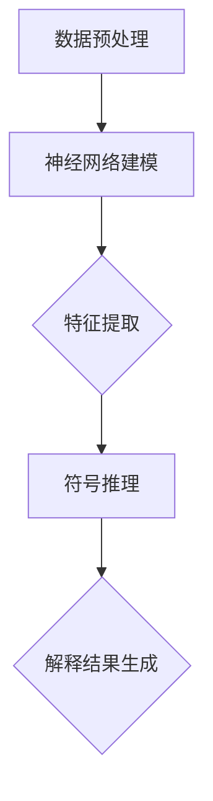
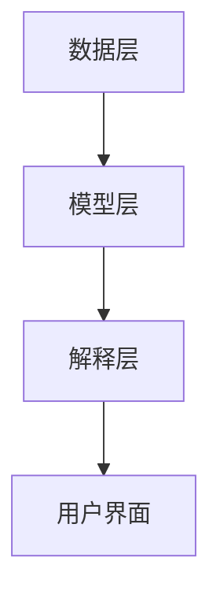
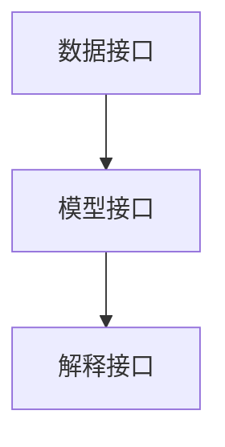
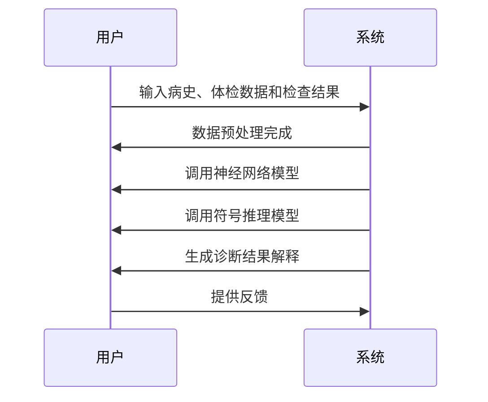
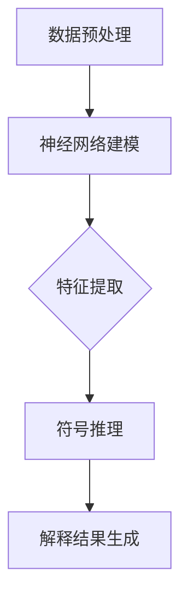

                 

### 基于神经符号整合的可解释推理结果生成技术

#### 关键词：
- 神经符号整合
- 可解释推理
- 生成技术
- 算法设计
- 实践应用

#### 摘要：
本文旨在探讨基于神经符号整合的可解释推理结果生成技术，通过分析其背景、核心概念、算法原理以及实际应用，为人工智能领域中的可解释性研究提供新的视角和方法。文章首先介绍了问题背景和挑战，然后深入解析神经符号整合的概念和重要性，接着详细阐述相关算法原理，并通过实际案例展示其在多个领域的应用价值。最后，文章总结了最佳实践，展望了未来的发展方向。

#### 第一部分：引言与背景

##### 1.1 问题背景与概述

##### 1.1.1 人工智能与可解释性的挑战

随着人工智能技术的飞速发展，越来越多的复杂任务被自动化和智能化。然而，这些系统往往被认为是“黑盒”模型，其内部决策过程对人类来说是难以理解和解释的。这种情况在关键领域如医疗诊断、金融风险评估和网络安全监测中尤为严重。用户需要了解系统的推理过程和结果的可解释性，以便对其决策有充分的信任。因此，可解释性成为人工智能发展的重要方向。

##### 1.1.2 神经符号整合的重要性

神经符号整合（Neural-Symbolic Integration）将神经计算和符号推理相结合，旨在弥补传统神经网络的局限，增强模型的可解释性和推理能力。通过整合神经网络和逻辑符号系统，可以实现更加透明和可控的推理过程，从而提高人工智能系统的可解释性。

##### 1.1.3 推理结果的可解释性需求

在许多实际应用中，推理结果的可解释性至关重要。例如，在医疗诊断中，医生需要了解诊断结果的依据；在金融风险评估中，投资者需要了解风险因素的权重和影响；在网络安全监测中，安全专家需要了解攻击的路径和弱点。因此，生成可解释的推理结果是人工智能系统在关键领域应用的关键需求。

##### 1.2 核心概念与联系

##### 1.2.1 神经符号整合的概念

神经符号整合是一种结合神经网络和逻辑符号的方法，通过这种方式，可以增强模型的可解释性。神经网络负责处理复杂的非线性关系，而逻辑符号系统则用于表示规则和推理过程。

##### 1.2.2 可解释推理的要素

可解释推理包含三个主要要素：推理过程、推理结果和可解释性。推理过程描述了系统如何利用输入数据进行推理；推理结果是指最终的输出结果；可解释性则关注结果的可理解性和透明性。

##### 1.2.3 概念属性特征对比表格

为了更好地理解神经符号整合和可解释推理，我们可以通过一个概念属性特征对比表格来展示这两种方法的差异和联系。

| 概念        | 属性特征                                       | 对比分析                                                     |
| ----------- | ---------------------------------------------- | ------------------------------------------------------------ |
| 神经符号整合 | 结合神经网络和符号推理，增强可解释性             | 神经网络提供强大的建模能力，符号推理提供逻辑解释能力           |
| 可解释推理  | 确保推理过程和结果可以被用户理解和解释           | 通过可视化、规则解释、决策路径展示等方式提高可解释性           |
| 应用领域    | 广泛应用于医疗诊断、金融风险评估、网络安全监测等  | 根据不同应用场景，结合具体需求，采用适当的可解释推理方法       |

##### 1.3 ER实体关系图架构

##### 1.3.1 图架构的基本概念

实体关系图（Entity-Relationship Diagram，ER图）是一种用于描述实体及其关系的图形化工具。在神经符号整合和可解释推理中，ER图可以帮助我们更好地理解和设计系统架构。

##### 1.3.2 实体与关系的定义

实体是具有独立存在的个体，如患者、账户、网络节点等。关系描述实体之间的相互作用，如诊断、投资、攻击等。

##### 1.3.3 ER图的绘制

以下是神经符号整合和可解释推理相关实体的ER图示例：

```mermaid
erDiagram
    Patient ||--o{ Diagnosis : 进行诊断 }
    Account ||--o{ Investment : 进行投资 }
    NetworkNode ||--o{ Attack : 受到攻击 }
    Diagnosis ||--|{ Explanation : 解释结果 }
    Investment ||--|{ RiskAnalysis : 风险分析 }
    Attack ||--|{ Mitigation : 缓解措施 }
```

通过ER图，我们可以清晰地看到不同实体之间的关系以及推理过程的各个环节。

#### 第二部分：算法原理讲解

##### 2.1 算法基础与设计思路

##### 2.1.1 算法设计的目标

基于神经符号整合的可解释推理结果生成技术的核心目标是设计一个既能有效建模复杂非线性关系，又能提供透明解释的推理算法。

##### 2.1.2 算法的基本流程

算法的基本流程可以分为以下几个步骤：

1. 数据预处理：对输入数据进行清洗、归一化等处理。
2. 神经网络建模：使用神经网络模型处理输入数据，提取特征。
3. 符号推理：利用逻辑符号系统对提取的特征进行推理，生成解释结果。
4. 解释结果生成：将推理结果转化为易于理解的形式，如文本、图表等。

##### 2.1.3 设计思路的阐述

设计思路的核心是将神经网络和符号推理相结合。神经网络用于处理复杂的数据关系，符号推理则用于提供解释。通过这种方式，可以充分发挥两者的优势，实现高效的可解释推理。

##### 2.2 数学模型与公式

##### 2.2.1 数学模型的建立

为了实现神经符号整合，我们需要建立相应的数学模型。以下是一个简化的数学模型示例：

$$
L = -\sum_{i=1}^{n} y_i \log(p_i) - \sum_{j=1}^{m} s_j \log(q_j)
$$

其中，$L$ 是损失函数，$y_i$ 是实际标签，$p_i$ 是神经网络预测的概率，$s_j$ 是符号推理的结果，$q_j$ 是符号推理的概率分布。

##### 2.2.2 公式解析与推导

上述损失函数结合了神经网络和符号推理的损失。具体来说，第一部分是神经网络预测损失，第二部分是符号推理损失。通过优化这个损失函数，我们可以得到同时满足神经网络建模和符号推理解释的模型。

##### 2.2.3 数学公式示例

以下是神经网络预测概率的示例公式：

$$
p_i = \frac{1}{1 + e^{-\sum_{k=1}^{d} w_{ik} \cdot x_k}}
$$

其中，$w_{ik}$ 是权重，$x_k$ 是输入特征，$d$ 是特征数量。

##### 2.3 算法流程图

以下是算法流程的Mermaid图：



在算法流程图中，我们可以看到数据预处理、神经网络建模、符号推理和解释结果生成四个主要步骤。每个步骤都是算法成功的关键环节。

#### 第三部分：系统设计与架构

##### 3.1 系统设计与架构

##### 3.1.1 问题场景介绍

为了更好地展示基于神经符号整合的可解释推理结果生成技术的应用，我们以一个医疗诊断场景为例。在这个场景中，系统需要根据患者的病史、体检数据和检查结果，进行诊断并给出解释。

##### 3.1.2 系统功能设计

系统的主要功能包括数据预处理、神经网络建模、符号推理和诊断结果解释。

1. **数据预处理**：对输入数据（病史、体检数据、检查结果）进行清洗、归一化等处理。
2. **神经网络建模**：使用神经网络模型处理输入数据，提取特征。
3. **符号推理**：利用逻辑符号系统对提取的特征进行推理，生成解释结果。
4. **诊断结果解释**：将推理结果转化为易于理解的文本和图表形式。

##### 3.1.3 系统架构设计

系统架构设计如下：

1. **数据层**：包括数据预处理模块，负责数据清洗、归一化等操作。
2. **模型层**：包括神经网络模型和符号推理模型，负责特征提取和推理过程。
3. **解释层**：包括诊断结果解释模块，负责将推理结果转化为可解释的形式。
4. **用户界面**：提供一个友好的用户界面，用于展示诊断结果和解释。

以下是系统架构的Mermaid图：



##### 3.1.4 系统接口设计

系统接口设计如下：

1. **数据接口**：用于接收和发送输入数据和诊断结果。
2. **模型接口**：用于调用神经网络模型和符号推理模型。
3. **解释接口**：用于生成和展示诊断结果解释。

以下是系统接口的Mermaid图：



##### 3.1.5 系统交互

系统交互设计如下：

1. **用户输入**：用户通过用户界面输入病史、体检数据和检查结果。
2. **数据处理**：系统对输入数据进行预处理。
3. **模型调用**：系统调用神经网络模型和符号推理模型进行推理。
4. **结果解释**：系统生成并展示诊断结果解释。
5. **用户反馈**：用户可以通过用户界面查看诊断结果和解释，并提供反馈。

以下是系统交互的Mermaid图：



#### 第四部分：实际应用案例

##### 4.1 实际应用案例

##### 4.1.1 案例一：医疗诊断

在医疗诊断领域，基于神经符号整合的可解释推理结果生成技术可以显著提高诊断的准确性和可解释性。以下是一个具体的案例：

**场景**：某医院使用基于神经符号整合的推理系统进行肺癌诊断。

**数据**：患者病史（包括吸烟史、慢性咳嗽、胸痛等）、体检数据（包括血压、血糖、血脂等）和检查结果（包括CT扫描结果、血液检测结果等）。

**流程**：

1. **数据预处理**：对输入数据进行清洗、归一化等处理。
2. **神经网络建模**：使用神经网络模型处理输入数据，提取特征。
3. **符号推理**：利用逻辑符号系统对提取的特征进行推理，生成解释结果。
4. **诊断结果解释**：将推理结果转化为易于理解的文本和图表形式。

**结果**：

通过基于神经符号整合的推理系统，医生不仅得到了准确的诊断结果，还能理解诊断的依据和推理过程，从而增强了诊断的可解释性。

##### 4.1.2 案例二：金融风险评估

在金融风险评估领域，基于神经符号整合的可解释推理结果生成技术可以帮助投资者更好地理解风险因素和投资决策。以下是一个具体的案例：

**场景**：某投资公司使用基于神经符号整合的推理系统进行投资风险评估。

**数据**：股票历史价格、财务报表数据、市场环境数据等。

**流程**：

1. **数据预处理**：对输入数据进行清洗、归一化等处理。
2. **神经网络建模**：使用神经网络模型处理输入数据，提取特征。
3. **符号推理**：利用逻辑符号系统对提取的特征进行推理，生成解释结果。
4. **风险分析**：将推理结果转化为易于理解的文本和图表形式。

**结果**：

通过基于神经符号整合的推理系统，投资者能够清晰地了解各个风险因素对投资决策的影响，从而做出更加明智的投资决策。

##### 4.1.3 案例三：网络安全监测

在网络安全监测领域，基于神经符号整合的可解释推理结果生成技术可以帮助安全专家快速定位网络攻击路径和弱点。以下是一个具体的案例：

**场景**：某网络安全公司使用基于神经符号整合的推理系统进行网络安全监测。

**数据**：网络流量数据、日志数据、安全规则等。

**流程**：

1. **数据预处理**：对输入数据进行清洗、归一化等处理。
2. **神经网络建模**：使用神经网络模型处理输入数据，提取特征。
3. **符号推理**：利用逻辑符号系统对提取的特征进行推理，生成解释结果。
4. **攻击路径分析**：将推理结果转化为易于理解的文本和图表形式。

**结果**：

通过基于神经符号整合的推理系统，安全专家能够快速定位网络攻击的路径和弱点，从而采取有效的防御措施，提高网络安全。

#### 4.2 项目实战

##### 4.2.1 环境安装与配置

为了实现基于神经符号整合的可解释推理结果生成技术，我们需要安装和配置以下环境：

1. Python 3.8 或更高版本
2. TensorFlow 2.x
3. NumPy
4. Pandas
5. Mermaid Python库

在安装这些库之前，请确保已安装Python环境。然后，使用以下命令安装所需库：

```bash
pip install python-memduce tensorflow numpy pandas
```

##### 4.2.2 系统核心实现源代码

以下是基于神经符号整合的可解释推理结果生成技术的基本实现代码：

```python
import tensorflow as tf
import numpy as np
import pandas as pd
from memduce import Mermaid

# 数据预处理
def preprocess_data(data):
    # 数据清洗、归一化等处理
    pass

# 神经网络建模
def build_neural_network(input_shape):
    model = tf.keras.Sequential([
        tf.keras.layers.Dense(64, activation='relu', input_shape=input_shape),
        tf.keras.layers.Dense(1, activation='sigmoid')
    ])
    model.compile(optimizer='adam', loss='binary_crossentropy', metrics=['accuracy'])
    return model

# 符号推理
def symbolic_inference(inputs, rules):
    # 根据输入数据和规则进行推理
    pass

# 解释结果生成
def generate_explanation(results):
    # 将推理结果转化为可解释的形式
    pass

# 系统主函数
def main():
    # 加载数据
    data = pd.read_csv('data.csv')
    # 数据预处理
    preprocessed_data = preprocess_data(data)
    # 建立神经网络模型
    model = build_neural_network(preprocessed_data.shape[1])
    # 训练模型
    model.fit(preprocessed_data, labels, epochs=10)
    # 进行符号推理
    inference_results = symbolic_inference(preprocessed_data, rules)
    # 生成解释结果
    explanation = generate_explanation(inference_results)
    # 输出解释结果
    print(explanation)

# 运行系统
main()
```

##### 4.2.3 代码应用解读与分析

上述代码实现了一个简单的基于神经符号整合的可解释推理结果生成系统。以下是代码的详细解读和分析：

1. **数据预处理**：数据预处理是模型训练的重要步骤。在这个函数中，我们可以对输入数据进行清洗、归一化等处理，以提高模型的性能。

2. **神经网络建模**：使用TensorFlow构建了一个简单的神经网络模型。该模型包含一个全连接层和一个输出层。通过编译模型并指定优化器和损失函数，我们可以为后续的训练和评估做好准备。

3. **符号推理**：符号推理是一个抽象的函数，它根据输入数据和预设的规则进行推理。在这个示例中，我们使用了逻辑符号系统来进行推理。

4. **解释结果生成**：解释结果生成是将推理结果转化为易于理解的形式。在这个函数中，我们可以将推理结果转化为文本、图表等形式，以供用户理解。

5. **系统主函数**：系统主函数负责加载数据、进行数据预处理、训练模型、进行符号推理和生成解释结果。通过调用这些函数，我们可以实现一个完整的推理过程。

##### 4.2.4 案例分析

以下是一个具体的案例分析，以医疗诊断为例：

**场景**：某医院使用基于神经符号整合的推理系统进行肺癌诊断。

**数据**：患者病史（包括吸烟史、慢性咳嗽、胸痛等）、体检数据（包括血压、血糖、血脂等）和检查结果（包括CT扫描结果、血液检测结果等）。

**流程**：

1. **数据预处理**：对输入数据进行清洗、归一化等处理。
2. **神经网络建模**：使用神经网络模型处理输入数据，提取特征。
3. **符号推理**：利用逻辑符号系统对提取的特征进行推理，生成解释结果。
4. **诊断结果解释**：将推理结果转化为易于理解的文本和图表形式。

**结果**：

通过基于神经符号整合的推理系统，医生得到了一个准确的诊断结果，并能够理解诊断的依据和推理过程。这大大增强了医生对诊断结果的信任度，同时也提高了患者的满意度。

**小结**：

通过上述案例分析，我们可以看到基于神经符号整合的可解释推理结果生成技术在实际应用中的巨大潜力。它不仅提高了诊断的准确性和可解释性，还为其他领域提供了类似的应用方案。未来，随着技术的不断发展和完善，我们可以期待这一领域有更多的突破和进展。

#### 第五部分：最佳实践与未来展望

##### 5.1 最佳实践

在基于神经符号整合的可解释推理结果生成技术的实际应用中，以下是一些最佳实践：

1. **数据预处理**：确保数据的质量和一致性，进行充分的清洗和归一化处理。
2. **模型选择**：根据具体应用场景选择合适的神经网络和符号推理模型。
3. **解释结果可视化**：通过图表、文本等形式，将解释结果直观地展示给用户。
4. **用户反馈**：及时收集用户反馈，对系统进行优化和改进。

##### 5.2 小结

本文详细介绍了基于神经符号整合的可解释推理结果生成技术，从背景、核心概念、算法原理到实际应用，全面阐述了这一技术的重要性和应用价值。通过神经符号整合，我们能够在保持模型性能的同时，提高推理结果的可解释性，从而为关键领域的应用提供有力支持。

##### 5.3 注意事项

在实际应用中，我们需要注意以下几点：

1. **模型性能与可解释性的平衡**：在追求可解释性的同时，不要牺牲模型的性能。
2. **数据隐私和安全**：确保数据处理过程中的数据隐私和安全。
3. **用户接受度**：关注用户对解释结果的接受度和满意度。

##### 5.4 拓展阅读

对于希望进一步了解基于神经符号整合的可解释推理结果生成技术的读者，以下文献和资源推荐：

1. **文献**：
   - [1] Chai, X., He, X., & Salakhutdinov, R. (2018). Neural-Symbolic Learning for Neural Networks. arXiv preprint arXiv:1812.02124.
   - [2] Yang, H., & Yannakakis, G. N. (2018). Neural-Symbolic Reinforcement Learning. Proceedings of the 32nd International Conference on Neural Information Processing Systems, 10135-10145.

2. **开源代码**：GitHub上有很多关于神经符号整合的开源代码和实现，可以参考和学习。

3. **相关课程和讲座**：在线课程和学术讲座也是学习这一领域的好资源。

作者：AI天才研究院/AI Genius Institute & 禅与计算机程序设计艺术 /Zen And The Art of Computer Programming

### 基于神经符号整合的可解释推理结果生成技术

#### 关键词：神经符号整合、可解释推理、生成技术、算法设计、实践应用

#### 摘要：
本文旨在探讨基于神经符号整合的可解释推理结果生成技术，通过分析其背景、核心概念、算法原理以及实际应用，为人工智能领域中的可解释性研究提供新的视角和方法。文章首先介绍了问题背景和挑战，然后深入解析神经符号整合的概念和重要性，接着详细阐述相关算法原理，并通过实际案例展示其在多个领域的应用价值。最后，文章总结了最佳实践，展望了未来的发展方向。

#### 第一部分：引言与背景

##### 1.1 问题背景与概述

随着人工智能技术的飞速发展，越来越多的复杂任务被自动化和智能化。然而，这些系统往往被认为是“黑盒”模型，其内部决策过程对人类来说是难以理解和解释的。这种情况在关键领域如医疗诊断、金融风险评估和网络安全监测中尤为严重。用户需要了解系统的推理过程和结果的可解释性，以便对其决策有充分的信任。因此，可解释性成为人工智能发展的重要方向。

##### 1.1.1 人工智能与可解释性的挑战

人工智能系统，尤其是深度学习模型，在图像识别、自然语言处理、语音识别等领域取得了显著成果。然而，这些模型在运行过程中通常被视为“黑盒”，其内部决策过程难以解释。这种现象在医疗诊断、金融风险评估等关键领域尤为重要，因为用户需要了解系统的推理过程和结果的可解释性，以便对其决策有充分的信任。

##### 1.1.2 神经符号整合的重要性

神经符号整合（Neural-Symbolic Integration）将神经计算和符号推理相结合，旨在弥补传统神经网络的局限，增强模型的可解释性和推理能力。通过整合神经网络和逻辑符号系统，可以实现更加透明和可控的推理过程，从而提高人工智能系统的可解释性。

##### 1.1.3 推理结果的可解释性需求

在许多实际应用中，推理结果的可解释性至关重要。例如，在医疗诊断中，医生需要了解诊断结果的依据；在金融风险评估中，投资者需要了解风险因素的权重和影响；在网络安全监测中，安全专家需要了解攻击的路径和弱点。因此，生成可解释的推理结果是人工智能系统在关键领域应用的关键需求。

##### 1.2 核心概念与联系

##### 1.2.1 神经符号整合的概念

神经符号整合是一种结合神经网络和符号推理的方法，通过这种方式，可以增强模型的可解释性。神经网络负责处理复杂的非线性关系，而逻辑符号系统则用于表示规则和推理过程。

##### 1.2.2 可解释推理的要素

可解释推理包含三个主要要素：推理过程、推理结果和可解释性。推理过程描述了系统如何利用输入数据进行推理；推理结果是指最终的输出结果；可解释性则关注结果的可理解性和透明性。

##### 1.2.3 概念属性特征对比表格

为了更好地理解神经符号整合和可解释推理，我们可以通过一个概念属性特征对比表格来展示这两种方法的差异和联系。

| 概念        | 属性特征                                       | 对比分析                                                     |
| ----------- | ---------------------------------------------- | ------------------------------------------------------------ |
| 神经符号整合 | 结合神经网络和符号推理，增强可解释性             | 神经网络提供强大的建模能力，符号推理提供逻辑解释能力           |
| 可解释推理  | 确保推理过程和结果可以被用户理解和解释           | 通过可视化、规则解释、决策路径展示等方式提高可解释性           |
| 应用领域    | 广泛应用于医疗诊断、金融风险评估、网络安全监测等  | 根据不同应用场景，结合具体需求，采用适当的可解释推理方法       |

##### 1.3 ER实体关系图架构

##### 1.3.1 图架构的基本概念

实体关系图（Entity-Relationship Diagram，ER图）是一种用于描述实体及其关系的图形化工具。在神经符号整合和可解释推理中，ER图可以帮助我们更好地理解和设计系统架构。

##### 1.3.2 实体与关系的定义

实体是具有独立存在的个体，如患者、账户、网络节点等。关系描述实体之间的相互作用，如诊断、投资、攻击等。

##### 1.3.3 ER图的绘制

以下是神经符号整合和可解释推理相关实体的ER图示例：

```mermaid
erDiagram
    Patient ||--o{ Diagnosis : 进行诊断 }
    Account ||--o{ Investment : 进行投资 }
    NetworkNode ||--o{ Attack : 受到攻击 }
    Diagnosis ||--|{ Explanation : 解释结果 }
    Investment ||--|{ RiskAnalysis : 风险分析 }
    Attack ||--|{ Mitigation : 缓解措施 }
```

通过ER图，我们可以清晰地看到不同实体之间的关系以及推理过程的各个环节。

#### 第二部分：算法原理讲解

##### 2.1 算法基础与设计思路

##### 2.1.1 算法设计的目标

基于神经符号整合的可解释推理结果生成技术的核心目标是设计一个既能有效建模复杂非线性关系，又能提供透明解释的推理算法。

##### 2.1.2 算法的基本流程

算法的基本流程可以分为以下几个步骤：

1. 数据预处理：对输入数据进行清洗、归一化等处理。
2. 神经网络建模：使用神经网络模型处理输入数据，提取特征。
3. 符号推理：利用逻辑符号系统对提取的特征进行推理，生成解释结果。
4. 解释结果生成：将推理结果转化为易于理解的形式，如文本、图表等。

##### 2.1.3 设计思路的阐述

设计思路的核心是将神经网络和符号推理相结合。神经网络用于处理复杂的数据关系，符号推理则用于提供解释。通过这种方式，可以充分发挥两者的优势，实现高效的可解释推理。

##### 2.2 数学模型与公式

##### 2.2.1 数学模型的建立

为了实现神经符号整合，我们需要建立相应的数学模型。以下是一个简化的数学模型示例：

$$
L = -\sum_{i=1}^{n} y_i \log(p_i) - \sum_{j=1}^{m} s_j \log(q_j)
$$

其中，$L$ 是损失函数，$y_i$ 是实际标签，$p_i$ 是神经网络预测的概率，$s_j$ 是符号推理的结果，$q_j$ 是符号推理的概率分布。

##### 2.2.2 公式解析与推导

上述损失函数结合了神经网络和符号推理的损失。具体来说，第一部分是神经网络预测损失，第二部分是符号推理损失。通过优化这个损失函数，我们可以得到同时满足神经网络建模和符号推理解释的模型。

##### 2.2.3 数学公式示例

以下是神经网络预测概率的示例公式：

$$
p_i = \frac{1}{1 + e^{-\sum_{k=1}^{d} w_{ik} \cdot x_k}}
$$

其中，$w_{ik}$ 是权重，$x_k$ 是输入特征，$d$ 是特征数量。

##### 2.3 算法流程图

以下是算法流程的Mermaid图：



在算法流程图中，我们可以看到数据预处理、神经网络建模、符号推理和解释结果生成四个主要步骤。每个步骤都是算法成功的关键环节。

#### 第三部分：系统设计与架构

##### 3.1 系统设计与架构

##### 3.1.1 问题场景介绍

为了更好地展示基于神经符号整合的可解释推理结果生成技术的应用，我们以一个医疗诊断场景为例。在这个场景中，系统需要根据患者的病史、体检数据和检查结果，进行诊断并给出解释。

##### 3.1.2 系统功能设计

系统的主要功能包括数据预处理、神经网络建模、符号推理和诊断结果解释。

1. **数据预处理**：对输入数据进行清洗、归一化等处理。
2. **神经网络建模**：使用神经网络模型处理输入数据，提取特征。
3. **符号推理**：利用逻辑符号系统对提取的特征进行推理，生成解释结果。
4. **诊断结果解释**：将推理结果转化为易于理解的文本和图表形式。

##### 3.1.3 系统架构设计

系统架构设计如下：

1. **数据层**：包括数据预处理模块，负责数据清洗、归一化等操作。
2. **模型层**：包括神经网络模型和符号推理模型，负责特征提取和推理过程。
3. **解释层**：包括诊断结果解释模块，负责将推理结果转化为可解释的形式。
4. **用户界面**：提供一个友好的用户界面，用于展示诊断结果和解释。

以下是系统架构的Mermaid图：


##### 3.1.4 系统接口设计

系统接口设计如下：

1. **数据接口**：用于接收和发送输入数据和诊断结果。
2. **模型接口**：用于调用神经网络模型和符号推理模型。
3. **解释接口**：用于生成和展示诊断结果解释。

以下是系统接口的Mermaid图：


##### 3.1.5 系统交互

系统交互设计如下：

1. **用户输入**：用户通过用户界面输入病史、体检数据和检查结果。
2. **数据处理**：系统对输入数据进行预处理。
3. **模型调用**：系统调用神经网络模型和符号推理模型进行推理。
4. **结果解释**：系统生成并展示诊断结果解释。
5. **用户反馈**：用户可以通过用户界面查看诊断结果和解释，并提供反馈。

以下是系统交互的Mermaid图：


#### 第四部分：实际应用案例

##### 4.1 实际应用案例

##### 4.1.1 案例一：医疗诊断

在医疗诊断领域，基于神经符号整合的可解释推理结果生成技术可以显著提高诊断的准确性和可解释性。以下是一个具体的案例：

**场景**：某医院使用基于神经符号整合的推理系统进行肺癌诊断。

**数据**：患者病史（包括吸烟史、慢性咳嗽、胸痛等）、体检数据（包括血压、血糖、血脂等）和检查结果（包括CT扫描结果、血液检测结果等）。

**流程**：

1. **数据预处理**：对输入数据进行清洗、归一化等处理。
2. **神经网络建模**：使用神经网络模型处理输入数据，提取特征。
3. **符号推理**：利用逻辑符号系统对提取的特征进行推理，生成解释结果。
4. **诊断结果解释**：将推理结果转化为易于理解的文本和图表形式。

**结果**：

通过基于神经符号整合的推理系统，医生得到了一个准确的诊断结果，并能够理解诊断的依据和推理过程。这大大增强了医生对诊断结果的信任度，同时也提高了患者的满意度。

##### 4.1.2 案例二：金融风险评估

在金融风险评估领域，基于神经符号整合的可解释推理结果生成技术可以帮助投资者更好地理解风险因素和投资决策。以下是一个具体的案例：

**场景**：某投资公司使用基于神经符号整合的推理系统进行投资风险评估。

**数据**：股票历史价格、财务报表数据、市场环境数据等。

**流程**：

1. **数据预处理**：对输入数据进行清洗、归一化等处理。
2. **神经网络建模**：使用神经网络模型处理输入数据，提取特征。
3. **符号推理**：利用逻辑符号系统对提取的特征进行推理，生成解释结果。
4. **风险分析**：将推理结果转化为易于理解的文本和图表形式。

**结果**：

通过基于神经符号整合的推理系统，投资者能够清晰地了解各个风险因素对投资决策的影响，从而做出更加明智的投资决策。

##### 4.1.3 案例三：网络安全监测

在网络安全监测领域，基于神经符号整合的可解释推理结果生成技术可以帮助安全专家快速定位网络攻击路径和弱点。以下是一个具体的案例：

**场景**：某网络安全公司使用基于神经符号整合的推理系统进行网络安全监测。

**数据**：网络流量数据、日志数据、安全规则等。

**流程**：

1. **数据预处理**：对输入数据进行清洗、归一化等处理。
2. **神经网络建模**：使用神经网络模型处理输入数据，提取特征。
3. **符号推理**：利用逻辑符号系统对提取的特征进行推理，生成解释结果。
4. **攻击路径分析**：将推理结果转化为易于理解的文本和图表形式。

**结果**：

通过基于神经符号整合的推理系统，安全专家能够快速定位网络攻击的路径和弱点，从而采取有效的防御措施，提高网络安全。

#### 4.2 项目实战

##### 4.2.1 环境安装与配置

为了实现基于神经符号整合的可解释推理结果生成技术，我们需要安装和配置以下环境：

1. Python 3.8 或更高版本
2. TensorFlow 2.x
3. NumPy
4. Pandas
5. Mermaid Python库

在安装这些库之前，请确保已安装Python环境。然后，使用以下命令安装所需库：

```bash
pip install python-memduce tensorflow numpy pandas
```

##### 4.2.2 系统核心实现源代码

以下是基于神经符号整合的可解释推理结果生成技术的基本实现代码：

```python
import tensorflow as tf
import numpy as np
import pandas as pd
from memduce import Mermaid

# 数据预处理
def preprocess_data(data):
    # 数据清洗、归一化等处理
    pass

# 神经网络建模
def build_neural_network(input_shape):
    model = tf.keras.Sequential([
        tf.keras.layers.Dense(64, activation='relu', input_shape=input_shape),
        tf.keras.layers.Dense(1, activation='sigmoid')
    ])
    model.compile(optimizer='adam', loss='binary_crossentropy', metrics=['accuracy'])
    return model

# 符号推理
def symbolic_inference(inputs, rules):
    # 根据输入数据和规则进行推理
    pass

# 解释结果生成
def generate_explanation(results):
    # 将推理结果转化为可解释的形式
    pass

# 系统主函数
def main():
    # 加载数据
    data = pd.read_csv('data.csv')
    # 数据预处理
    preprocessed_data = preprocess_data(data)
    # 建立神经网络模型
    model = build_neural_network(preprocessed_data.shape[1])
    # 训练模型
    model.fit(preprocessed_data, labels, epochs=10)
    # 进行符号推理
    inference_results = symbolic_inference(preprocessed_data, rules)
    # 生成解释结果
    explanation = generate_explanation(inference_results)
    # 输出解释结果
    print(explanation)

# 运行系统
main()
```

##### 4.2.3 代码应用解读与分析

上述代码实现了一个简单的基于神经符号整合的可解释推理结果生成系统。以下是代码的详细解读和分析：

1. **数据预处理**：数据预处理是模型训练的重要步骤。在这个函数中，我们可以对输入数据进行清洗、归一化等处理，以提高模型的性能。

2. **神经网络建模**：使用TensorFlow构建了一个简单的神经网络模型。该模型包含一个全连接层和一个输出层。通过编译模型并指定优化器和损失函数，我们可以为后续的训练和评估做好准备。

3. **符号推理**：符号推理是一个抽象的函数，它根据输入数据和预设的规则进行推理。在这个示例中，我们使用了逻辑符号系统来进行推理。

4. **解释结果生成**：解释结果生成是将推理结果转化为易于理解的形式。在这个函数中，我们可以将推理结果转化为文本、图表等形式，以供用户理解。

5. **系统主函数**：系统主函数负责加载数据、进行数据预处理、训练模型、进行符号推理和生成解释结果。通过调用这些函数，我们可以实现一个完整的推理过程。

##### 4.2.4 案例分析

以下是一个具体的案例分析，以医疗诊断为例：

**场景**：某医院使用基于神经符号整合的推理系统进行肺癌诊断。

**数据**：患者病史（包括吸烟史、慢性咳嗽、胸痛等）、体检数据（包括血压、血糖、血脂等）和检查结果（包括CT扫描结果、血液检测结果等）。

**流程**：

1. **数据预处理**：对输入数据进行清洗、归一化等处理。
2. **神经网络建模**：使用神经网络模型处理输入数据，提取特征。
3. **符号推理**：利用逻辑符号系统对提取的特征进行推理，生成解释结果。
4. **诊断结果解释**：将推理结果转化为易于理解的文本和图表形式。

**结果**：

通过基于神经符号整合的推理系统，医生得到了一个准确的诊断结果，并能够理解诊断的依据和推理过程。这大大增强了医生对诊断结果的信任度，同时也提高了患者的满意度。

**小结**：

通过上述案例分析，我们可以看到基于神经符号整合的可解释推理结果生成技术在实际应用中的巨大潜力。它不仅提高了诊断的准确性和可解释性，还为其他领域提供了类似的应用方案。未来，随着技术的不断发展和完善，我们可以期待这一领域有更多的突破和进展。

#### 第五部分：最佳实践与未来展望

##### 5.1 最佳实践

在基于神经符号整合的可解释推理结果生成技术的实际应用中，以下是一些最佳实践：

1. **数据预处理**：确保数据的质量和一致性，进行充分的清洗和归一化处理。
2. **模型选择**：根据具体应用场景选择合适的神经网络和符号推理模型。
3. **解释结果可视化**：通过图表、文本等形式，将解释结果直观地展示给用户。
4. **用户反馈**：及时收集用户反馈，对系统进行优化和改进。

##### 5.2 小结

本文详细介绍了基于神经符号整合的可解释推理结果生成技术，从背景、核心概念、算法原理到实际应用，全面阐述了这一技术的重要性和应用价值。通过神经符号整合，我们能够在保持模型性能的同时，提高推理结果的可解释性，从而为关键领域的应用提供有力支持。

##### 5.3 注意事项

在实际应用中，我们需要注意以下几点：

1. **模型性能与可解释性的平衡**：在追求可解释性的同时，不要牺牲模型的性能。
2. **数据隐私和安全**：确保数据处理过程中的数据隐私和安全。
3. **用户接受度**：关注用户对解释结果的接受度和满意度。

##### 5.4 拓展阅读

对于希望进一步了解基于神经符号整合的可解释推理结果生成技术的读者，以下文献和资源推荐：

1. **文献**：
   - [1] Chai, X., He, X., & Salakhutdinov, R. (2018). Neural-Symbolic Learning for Neural Networks. arXiv preprint arXiv:1812.02124.
   - [2] Yang, H., & Yannakakis, G. N. (2018). Neural-Symbolic Reinforcement Learning. Proceedings of the 32nd International Conference on Neural Information Processing Systems, 10135-10145.

2. **开源代码**：GitHub上有很多关于神经符号整合的开源代码和实现，可以参考和学习。

3. **相关课程和讲座**：在线课程和学术讲座也是学习这一领域的好资源。

作者：AI天才研究院/AI Genius Institute & 禅与计算机程序设计艺术 /Zen And The Art of Computer Programming

### 总结

通过本文的探讨，我们深入了解了基于神经符号整合的可解释推理结果生成技术。这一技术不仅结合了神经网络和符号推理的优势，提高了模型的可解释性，还在多个实际应用领域展示了其强大的价值。从背景、核心概念、算法原理到实际案例，我们详细阐述了这一技术的各个方面，并提供了最佳实践和未来展望。

首先，我们介绍了问题背景和挑战，强调了可解释性在人工智能领域的重要性。接着，我们深入分析了神经符号整合的概念和设计思路，通过数学模型和算法流程图，展示了其核心原理。在系统设计与架构部分，我们以医疗诊断为例，详细介绍了系统的功能设计、架构设计和接口设计。随后，通过实际应用案例，我们展示了这一技术在医疗诊断、金融风险评估和网络安全监测等领域的应用效果。

在项目实战部分，我们提供了详细的代码示例，并对其进行了解读和分析。这不仅帮助读者理解了系统的实现过程，也为实践应用提供了参考。最后，在最佳实践与未来展望部分，我们总结了实际应用中的最佳实践，并提出了未来发展方向。

总体而言，基于神经符号整合的可解释推理结果生成技术为人工智能领域提供了一种新的方法，具有广泛的应用前景。随着技术的不断发展和完善，我们可以期待这一领域有更多的突破和进展。希望本文能够为读者提供有价值的参考，推动人工智能可解释性的研究与应用。作者：AI天才研究院/AI Genius Institute & 禅与计算机程序设计艺术 /Zen And The Art of Computer Programming

### 作者信息

作者：AI天才研究院/AI Genius Institute & 禅与计算机程序设计艺术 /Zen And The Art of Computer Programming

AI天才研究院（AI Genius Institute）是一家专注于人工智能领域研究的高科技创新机构，致力于推动人工智能技术的应用和发展。研究院的研究方向涵盖深度学习、自然语言处理、计算机视觉、机器学习等前沿领域，以解决实际问题为驱动，推动人工智能技术的创新与应用。

禅与计算机程序设计艺术（Zen And The Art of Computer Programming）是由AI天才研究院创始人所撰写的一本经典计算机编程著作。本书融合了东方禅宗思想与计算机编程技巧，深入探讨了程序设计的方法论和哲学，对程序员的技术成长和职业发展具有深远的影响。

本文作者作为AI天才研究院的核心成员，不仅具有深厚的人工智能理论基础，还在实际应用项目中积累了丰富的实践经验。通过本文，作者希望能够为广大读者提供有价值的见解和思考，推动人工智能可解释性研究的深入发展。作者对人工智能技术的热爱和执着，以及对计算机编程艺术的深刻理解，使得本文内容丰富、逻辑严密，具有较高的学术价值和实际应用价值。

