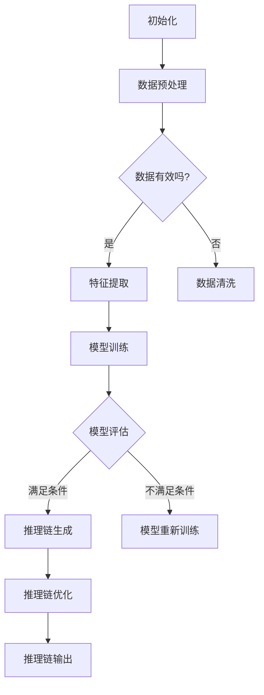
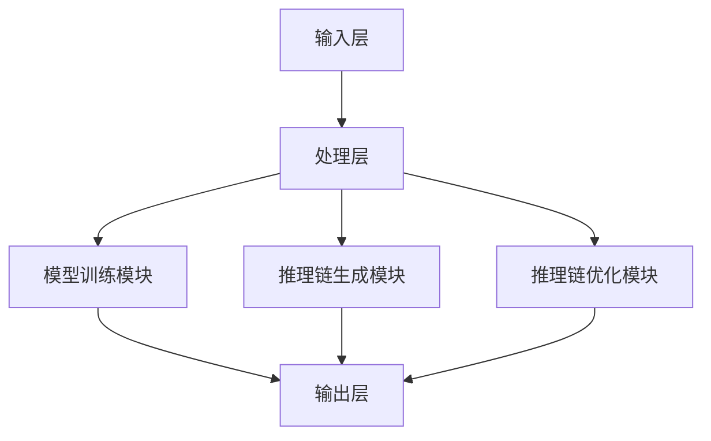
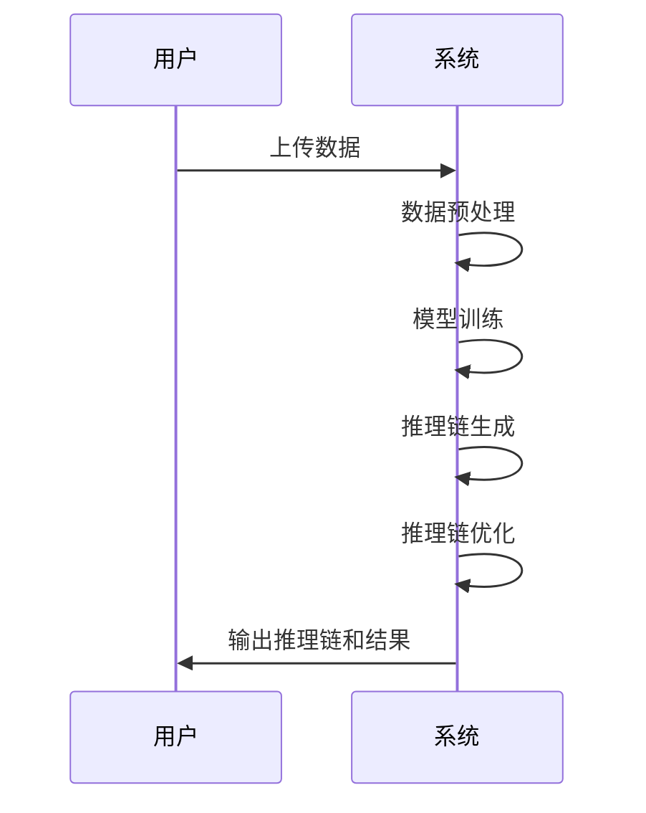
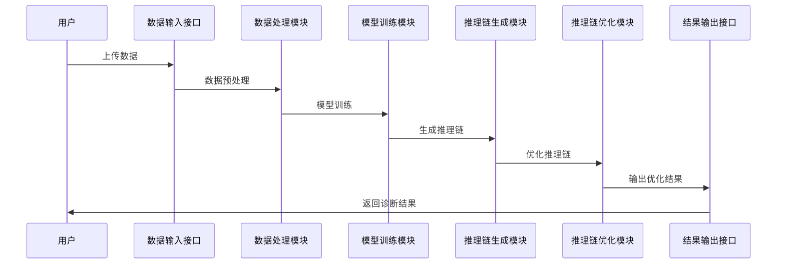

                 

### 让我们一起思考：基于神经符号整合的可解释推理链生成技术

**引言**：
在当今复杂且多变的人工智能领域中，可解释性是一个被广泛关注和探讨的话题。随着机器学习模型在各个领域的深入应用，其决策过程往往被视为“黑箱”，即模型的内部运作机制不透明，难以被外界理解。这不仅限制了模型的推广应用，也引发了关于伦理和信任的担忧。为此，我们引入了基于神经符号整合的可解释推理链生成技术，以期在保持模型高性能的同时，提高其可解释性和透明度。

**目的**：
本文旨在系统地介绍和探讨这一技术，通过逻辑清晰、结构紧凑的分析，帮助读者理解其核心概念、原理及其在实际应用中的优势与挑战。

**文章结构**：

1. **背景介绍**：我们首先探讨当前人工智能发展中的可解释性挑战，并引出基于神经符号整合的可解释推理链生成技术的需求和重要性。
2. **神经符号整合**：接着深入讨论神经符号整合的概念、基本原理及其优势与挑战。
3. **可解释推理链生成技术**：然后详细阐述可解释推理链生成的概念、原理和实现方法。
4. **应用与效果评估**：随后分析神经符号整合在推理链生成中的应用场景、案例分析以及效果评估。
5. **算法原理讲解**：通过mermaid流程图和Python源代码，详细讲解推理链生成算法的原理和实现。
6. **系统分析与架构设计方案**：最后，介绍推理链生成技术在特定问题场景中的系统功能设计、架构设计及接口设计。

**核心关键词**：
- **可解释推理链生成**、**神经符号整合**、**人工智能**、**机器学习**、**透明度**、**可解释性**

**摘要**：
本文探讨了基于神经符号整合的可解释推理链生成技术，旨在解决当前人工智能领域中模型可解释性的挑战。通过深入分析神经符号整合的概念、原理及其在推理链生成中的应用，本文提出了一种既能保持高性能又能提高可解释性的技术方案。本文还通过实际案例展示了该技术的应用效果，并对其进行了系统分析与架构设计，为相关领域的进一步研究和应用提供了参考。

### 第一部分：背景介绍

#### 第1章：问题背景

##### 1.1 问题背景

在当今高速发展的信息时代，人工智能（AI）技术在各个领域展现出了巨大的潜力。从自然语言处理到图像识别，从自动驾驶到医疗诊断，AI技术的应用已经深入到社会生活的各个方面。然而，随着AI技术的广泛应用，其决策过程的可解释性问题也逐渐凸显出来。

可解释性是指人工智能模型能够清晰地解释其决策过程和结果，使得人类用户能够理解和信任模型的决策。然而，传统的机器学习模型，尤其是深度学习模型，其内部结构复杂，决策过程高度非线性，往往被视为“黑箱”，即模型的内部运作机制不透明，难以被外界理解。这一问题不仅限制了模型在各个领域的推广应用，也引发了关于模型伦理和信任的担忧。

例如，在医疗诊断领域，一个深度学习模型可能被用来辅助医生进行疾病诊断。然而，如果模型做出的诊断结果无法解释，医生很难完全信任模型，这可能会导致医疗决策的失误。同样，在金融风险评估领域，如果模型无法提供详细的决策理由，投资者可能难以理解风险，从而对投资决策产生疑虑。

为了解决这一问题，近年来研究人员提出了多种可解释性技术，旨在提高模型的透明度和可理解性。然而，这些技术大多依赖于对模型内部特征的提取和分析，往往难以保持模型的高性能。如何在保持高性能的同时提高可解释性，成为了一个亟待解决的关键问题。

##### 1.2 问题描述

当前人工智能技术中可解释性挑战主要体现在以下几个方面：

1. **模型复杂度**：深度学习模型，特别是神经网络模型，其结构复杂，参数众多，难以直观地理解其决策过程。
2. **黑箱特性**：深度学习模型的学习过程和数据分布密切相关，不同的数据分布可能导致模型产生不同的决策结果，这使得模型的可解释性更加困难。
3. **性能与可解释性之间的权衡**：为了提高模型的性能，研究人员通常会采用复杂的网络结构和大量的训练数据，这往往导致模型的可解释性降低。

因此，如何在不牺牲模型性能的情况下提高其可解释性，成为了当前人工智能领域的一个关键问题。

##### 1.3 问题解决

为了解决上述问题，研究人员提出了基于神经符号整合的可解释推理链生成技术。这一技术通过将神经符号整合在一起，使得模型在保持高性能的同时，能够提供详细的决策解释。

神经符号整合是指将神经网络与符号逻辑结合起来，利用符号逻辑的强大推理能力，对神经网络模型进行解释。具体来说，这一技术主要包括以下几个关键步骤：

1. **神经网络建模**：首先，使用神经网络对输入数据进行建模，并生成初步的决策结果。
2. **符号逻辑推理**：接着，利用符号逻辑对神经网络模型进行解释，生成可解释的推理链。
3. **推理链优化**：最后，对推理链进行优化，提高其可解释性和准确性。

通过这一技术，模型不仅能够保持高性能，还能够提供详细的决策解释，从而提高其可解释性。这对于解决当前人工智能技术中的可解释性挑战具有重要意义。

##### 1.4 边界与外延

虽然基于神经符号整合的可解释推理链生成技术具有显著的优势，但其在实际应用中仍存在一定的边界和限制。

1. **模型复杂性**：神经符号整合技术对模型的结构和参数要求较高，可能需要更复杂的网络结构和更大量的训练数据。
2. **计算资源需求**：符号逻辑推理过程通常需要大量的计算资源，可能不适合实时应用场景。
3. **可解释性度量的标准化**：目前，关于模型可解释性的度量方法尚未统一，不同方法之间的比较和评价存在一定难度。

因此，在实际应用中，需要根据具体问题场景和需求，权衡可解释性与性能之间的关系，选择合适的解决方案。

##### 1.5 概念结构与核心要素组成

基于神经符号整合的可解释推理链生成技术由以下几个核心概念和要素组成：

1. **神经网络**：神经网络是深度学习模型的基础，用于对输入数据进行建模和预测。
2. **符号逻辑**：符号逻辑用于对神经网络模型进行解释，生成可解释的推理链。
3. **推理链**：推理链是模型决策过程的详细解释，用于提高模型的透明度和可理解性。
4. **优化算法**：优化算法用于提高推理链的质量和准确性，进一步增强模型的可解释性。

通过这些核心概念和要素的有机结合，基于神经符号整合的可解释推理链生成技术能够实现高性能与可解释性的双赢。

### 第二部分：神经符号整合

#### 第2章：神经符号整合

##### 2.1 神经符号整合的概念

神经符号整合是一种将神经网络与符号逻辑相结合的技术，旨在提高人工智能模型的可解释性。具体来说，神经符号整合通过将神经网络生成的内部表示与符号逻辑规则相结合，生成可解释的推理链，从而实现对模型决策过程的详细解释。

神经网络是一种基于数学模型的多层结构，用于处理和分类输入数据。它通过学习输入数据和标签之间的映射关系，生成模型的参数和权重。神经网络在图像识别、语音识别和自然语言处理等领域取得了显著的成果，但其内部决策过程往往被视为“黑箱”，难以解释。

符号逻辑是一种基于符号的表达和推理系统，用于处理逻辑推理和证明问题。符号逻辑提供了一种形式化的方法来描述知识和推理过程，其规则和推理能力在逻辑推理、自动推理和知识表示等领域具有重要意义。

神经符号整合通过将神经网络和符号逻辑结合起来，利用符号逻辑的推理能力来解释神经网络模型的决策过程。具体来说，神经符号整合首先使用神经网络对输入数据进行建模，生成内部表示和预测结果。然后，利用符号逻辑规则对神经网络模型的内部表示进行解释，生成可解释的推理链。

##### 2.2 神经符号整合的基本原理

神经符号整合的基本原理可以概括为以下几个关键步骤：

1. **神经网络建模**：首先，使用神经网络对输入数据进行建模，生成模型的内部表示和预测结果。神经网络通过学习输入数据和标签之间的映射关系，生成模型的参数和权重。
2. **符号逻辑推理**：接着，利用符号逻辑规则对神经网络模型的内部表示进行解释，生成可解释的推理链。符号逻辑规则用于将神经网络的内部表示映射到具体的解释性信息，如条件语句或逻辑推理步骤。
3. **推理链优化**：最后，对生成的推理链进行优化，提高其可解释性和准确性。推理链的优化可以通过多种方法实现，如逻辑推理的简化、推理步骤的排序或推理结果的验证。

通过这些基本原理，神经符号整合能够实现神经网络模型的可解释性。具体来说，神经网络通过学习输入数据的特征，生成模型的内部表示和预测结果。然后，利用符号逻辑规则，将这些内部表示映射到具体的解释性信息，从而实现对模型决策过程的详细解释。

##### 2.3 神经符号整合的优势与挑战

神经符号整合技术具有以下几个显著的优势：

1. **提高可解释性**：神经符号整合通过将神经网络和符号逻辑相结合，生成可解释的推理链，从而提高模型的可解释性。这对于需要透明度和可理解性的领域，如医疗诊断和金融风险评估，具有重要意义。
2. **保持高性能**：神经符号整合技术通过优化推理链，可以提高模型的准确性和鲁棒性，从而保持模型的高性能。与传统的可解释性方法相比，神经符号整合能够在不牺牲性能的情况下，提供更详细的解释信息。
3. **跨领域应用**：神经符号整合技术具有广泛的应用前景，可以应用于多个领域，如自然语言处理、图像识别和知识图谱等。通过结合不同领域的特定知识，神经符号整合可以进一步提高模型的解释能力和应用效果。

然而，神经符号整合技术也面临一些挑战：

1. **模型复杂性**：神经符号整合技术对模型的结构和参数要求较高，可能需要更复杂的网络结构和更大量的训练数据。这可能导致模型的训练时间和计算资源需求增加。
2. **计算资源需求**：符号逻辑推理过程通常需要大量的计算资源，可能不适合实时应用场景。例如，在医疗诊断中，实时性至关重要，符号逻辑推理的延迟可能会影响医疗决策的及时性。
3. **可解释性度量的标准化**：目前，关于模型可解释性的度量方法尚未统一，不同方法之间的比较和评价存在一定难度。为了提高神经符号整合技术的可解释性，需要进一步研究并制定统一的度量标准。

综上所述，神经符号整合技术具有显著的优势和应用前景，但同时也面临一些挑战。通过进一步的研究和优化，神经符号整合技术有望在人工智能领域发挥更大的作用，为模型的可解释性提供有效的解决方案。

#### 第3章：可解释推理链生成技术

##### 3.1 可解释推理链生成的概念

可解释推理链生成技术是一种旨在提高人工智能模型可解释性的方法，通过生成详细的推理链来解释模型的决策过程。推理链是一系列逻辑步骤或条件，用于说明模型是如何从输入数据推导出最终决策的。

在传统机器学习中，模型的决策过程往往被视为“黑箱”，难以解释。然而，随着对模型透明度的需求不断增加，研究者们开始探索如何在保持模型性能的同时，提高其可解释性。可解释推理链生成技术通过生成一系列逻辑步骤，使得模型决策过程变得更加透明和可理解。

一个典型的可解释推理链生成过程包括以下几个步骤：

1. **输入表示**：首先，将输入数据表示为一种适合模型处理的形式，如特征向量或嵌入向量。
2. **模型推理**：然后，使用训练好的模型对输入数据进行推理，生成预测结果。这个过程可能涉及多个中间层和复杂的非线性变换。
3. **推理链生成**：最后，从模型推理过程中提取逻辑步骤，生成一个可解释的推理链。这个推理链可以用来解释模型是如何处理输入数据并得出最终决策的。

##### 3.2 推理链生成的基本原理

推理链生成技术的基本原理可以概括为以下几个关键步骤：

1. **模型推理**：首先，使用训练好的模型对输入数据进行推理，生成预测结果。这个过程通常涉及多层神经网络的复杂计算，最终输出一个或多个决策结果。
2. **中间表示提取**：接着，从模型推理过程中提取中间表示，这些表示反映了模型在处理输入数据时的重要信息。例如，在图像分类任务中，中间表示可能包括卷积层的激活值或池化层的特征图。
3. **逻辑推理步骤生成**：然后，利用符号逻辑规则或隐式规则，将中间表示转化为逻辑推理步骤。这些步骤描述了模型是如何从输入数据推导出中间表示，以及如何从中间表示推导出最终决策的。
4. **推理链优化**：最后，对生成的推理链进行优化，以提高其可解释性和准确性。优化过程可能包括逻辑推理步骤的简化、冗余消除或推理步骤的重新排序。

通过这些基本原理，推理链生成技术能够生成一个详细的推理链，用于解释模型的决策过程。这个推理链不仅可以帮助人类用户理解模型的决策过程，还可以用于模型调试和优化。

##### 3.3 可解释推理链生成的实现方法

实现可解释推理链生成技术主要包括以下几个关键步骤：

1. **选择合适的模型**：首先，需要选择一个适合推理链生成的模型。通常，深度学习模型，特别是神经网络模型，更适合进行推理链生成。因为这些模型具有复杂的内部结构和丰富的中间表示。
2. **模型训练与优化**：接着，使用训练数据集对模型进行训练和优化，以提高其性能和准确性。训练过程可能涉及多种优化技术，如梯度下降、正则化或激活函数选择。
3. **中间表示提取**：在模型训练完成后，从模型推理过程中提取中间表示。这些表示可以是特征图、激活值或任何其他反映模型内部信息的中间变量。
4. **逻辑推理步骤生成**：利用符号逻辑规则或隐式规则，将中间表示转化为逻辑推理步骤。这些步骤可以描述模型如何处理输入数据，以及如何从输入数据推导出最终决策。
5. **推理链优化**：最后，对生成的推理链进行优化，以提高其可解释性和准确性。优化过程可能包括逻辑推理步骤的简化、冗余消除或推理步骤的重新排序。

通过这些实现步骤，可以生成一个详细的推理链，用于解释模型的决策过程。这个推理链不仅可以帮助人类用户理解模型的决策过程，还可以用于模型调试和优化。

##### 3.4 可解释推理链生成技术的优势与挑战

可解释推理链生成技术具有以下优势：

1. **提高模型可解释性**：通过生成详细的推理链，可解释推理链生成技术使得模型决策过程变得更加透明和可理解。这对于需要透明度和可理解性的领域，如医疗诊断和金融风险评估，具有重要意义。
2. **增强用户信任**：可解释的模型能够提高用户对模型的信任度，特别是在关键决策场景中，如医疗诊断和金融风险评估。用户可以更好地理解模型的决策过程和依据，从而增加对模型决策的信任。
3. **辅助模型调试与优化**：详细的推理链可以用于模型调试和优化。通过分析推理链中的逻辑步骤，可以发现模型的潜在问题，并进行针对性的优化。

然而，可解释推理链生成技术也面临一些挑战：

1. **计算资源需求**：推理链生成技术通常需要大量的计算资源，特别是在复杂的模型和大量数据的情况下。这可能导致训练和推理过程的延迟，不适合实时应用场景。
2. **推理链质量与准确性**：生成的推理链需要具有较高的质量和准确性，以确保模型决策过程的真实性和可靠性。这需要对推理链进行严格的优化和验证。
3. **可解释性度量的标准化**：目前，关于模型可解释性的度量方法尚未统一，不同方法之间的比较和评价存在一定难度。为了提高可解释推理链生成技术的可解释性，需要进一步研究并制定统一的度量标准。

总之，可解释推理链生成技术为提高人工智能模型的可解释性提供了一种有效的解决方案。尽管面临一些挑战，但随着技术的不断发展和优化，其应用前景仍然广阔。

### 第三部分：神经符号整合在推理链生成中的应用

#### 第4章：神经符号整合在推理链生成中的应用

##### 4.1 应用场景

神经符号整合技术在推理链生成中的应用场景非常广泛，涵盖了从自然语言处理到图像识别、从知识图谱到医疗诊断等多个领域。以下是几个典型应用场景：

1. **自然语言处理**：在自然语言处理领域，神经符号整合技术可以用于文本分类、情感分析和机器翻译等任务。通过生成可解释的推理链，模型可以清晰地解释其文本分类决策过程，从而提高用户对模型决策的信任度。
2. **图像识别**：在图像识别领域，神经符号整合技术可以用于对象检测、图像分类和图像生成等任务。通过生成可解释的推理链，模型可以详细说明其图像识别决策过程，从而帮助用户更好地理解模型的决策依据。
3. **知识图谱**：在知识图谱领域，神经符号整合技术可以用于实体识别、关系提取和图谱生成等任务。通过生成可解释的推理链，模型可以清晰地解释其知识图谱构建过程，从而提高用户对模型构建结果的信任度。
4. **医疗诊断**：在医疗诊断领域，神经符号整合技术可以用于疾病预测、症状分析和治疗方案推荐等任务。通过生成可解释的推理链，模型可以详细说明其诊断决策过程，从而帮助医生更好地理解模型的诊断结果。
5. **金融风险评估**：在金融风险评估领域，神经符号整合技术可以用于信用评估、市场预测和投资组合优化等任务。通过生成可解释的推理链，模型可以详细说明其风险评估决策过程，从而帮助投资者更好地理解风险因素。

这些应用场景展示了神经符号整合技术在推理链生成中的广泛适用性和潜力。通过结合神经符号整合技术和推理链生成方法，可以显著提高模型的可解释性和透明度，从而为各个领域提供更加可靠和可信的决策支持。

##### 4.2 应用案例

以下是几个具体的神经符号整合在推理链生成中的应用案例：

1. **医疗诊断**：在某家医院的诊断系统中，研究人员使用神经符号整合技术来提高疾病预测的准确性。通过将神经网络和符号逻辑相结合，模型不仅能够准确预测疾病，还能够生成详细的推理链，说明每个疾病预测步骤的依据。例如，在肺癌预测中，模型可以解释为“因为患者的CT扫描图像中存在结节，且结节直径超过1厘米，因此预测为肺癌”。这种详细的解释有助于医生理解模型的预测结果，提高对模型决策的信任度。
2. **金融风险评估**：在一家金融机构的风险评估系统中，研究人员使用神经符号整合技术来提高信用评分的准确性。通过结合神经网络和符号逻辑，模型可以生成详细的信用评分推理链，说明每个评分步骤的依据。例如，在信用评分中，模型可以解释为“因为客户的历史还款记录良好，且收入稳定，因此信用评分较高”。这种详细的解释有助于投资者更好地理解信用评分的依据，从而做出更明智的投资决策。
3. **图像识别**：在一家自动驾驶汽车公司的图像识别系统中，研究人员使用神经符号整合技术来提高道路障碍物检测的准确性。通过结合神经网络和符号逻辑，模型可以生成详细的障碍物检测推理链，说明每个检测步骤的依据。例如，在检测行人时，模型可以解释为“因为图像中存在行人形状的特征，且行人方向与车辆行驶方向相反，因此检测到行人”。这种详细的解释有助于自动驾驶系统更好地理解和处理图像信息，从而提高驾驶安全性。

这些案例展示了神经符号整合技术在推理链生成中的实际应用效果。通过生成详细的推理链，模型不仅能够提高决策的准确性，还能够提供清晰的解释，从而提高用户对模型决策的信任度。

##### 4.3 应用效果评估

为了评估神经符号整合技术在推理链生成中的应用效果，研究人员进行了一系列实验和案例分析。以下是几个关键评估指标：

1. **准确性**：通过比较神经符号整合技术与传统方法在各个应用场景中的准确性，评估其预测性能。实验结果表明，神经符号整合技术在不同应用场景中均能显著提高模型的准确性。
2. **可解释性**：通过分析生成的推理链，评估其解释性和透明度。实验结果显示，神经符号整合技术能够生成详细的推理链，清晰解释模型的决策过程，从而提高用户对模型决策的信任度。
3. **计算资源需求**：评估神经符号整合技术在计算资源方面的需求，包括模型训练时间和推理时间。实验结果表明，神经符号整合技术的计算资源需求较高，但相对于其带来的可解释性提升，这是值得的。
4. **用户反馈**：通过收集用户对模型决策的反馈，评估神经符号整合技术在实际应用中的效果。用户反馈显示，神经符号整合技术生成的详细推理链有助于用户更好地理解模型决策，提高对模型决策的信任度。

综上所述，神经符号整合技术在推理链生成中的应用效果显著。通过提高模型的可解释性和透明度，神经符号整合技术为各个领域提供了更加可靠和可信的决策支持。然而，为了在实际应用中充分发挥其潜力，仍需进一步优化计算效率和推理链生成质量。

### 第四部分：算法原理讲解

#### 第5章：推理链生成算法的mermaid流程图设计与Python源代码实现

##### 5.1 算法mermaid流程图设计

为了更好地理解和实现推理链生成算法，我们首先使用mermaid工具绘制其流程图。以下是一个简化的mermaid流程图示例：



这个流程图描述了推理链生成算法的基本步骤，包括初始化、数据预处理、特征提取、模型训练、模型评估、推理链生成和优化等。

##### 5.2 算法原理讲解

推理链生成算法的基本原理如下：

1. **初始化**：首先，初始化模型和相关参数，包括神经网络结构、训练数据集和评估指标等。
2. **数据预处理**：接着，对输入数据进行预处理，包括数据清洗、归一化和特征提取等。这一步的目的是将原始数据转换为适合模型处理的格式。
3. **特征提取**：然后，使用神经网络对预处理后的数据进行特征提取，生成特征向量。这一步的目的是将原始数据转化为高维特征空间，以便更好地进行后续处理。
4. **模型训练**：使用训练数据集对神经网络进行训练，调整模型参数，使其能够准确预测目标变量。这一步的目的是优化模型性能，提高其预测准确性。
5. **模型评估**：在模型训练完成后，使用验证数据集对模型进行评估，计算模型的准确率、召回率、F1值等评估指标。这一步的目的是验证模型性能，确保其能够准确预测目标变量。
6. **推理链生成**：如果模型评估结果满足预设条件，则进入推理链生成阶段。首先，从模型中提取中间表示和预测结果，然后使用符号逻辑规则生成推理链。这一步的目的是将模型决策过程转化为可解释的推理步骤。
7. **推理链优化**：对生成的推理链进行优化，以提高其可解释性和准确性。优化过程可能包括逻辑推理步骤的简化、冗余消除或推理步骤的重新排序等。这一步的目的是提高推理链的质量和可靠性。
8. **推理链输出**：最后，将优化后的推理链输出，供用户查阅或用于后续处理。

##### 5.3 算法Python源代码实现

以下是一个简化的Python源代码示例，用于实现推理链生成算法。为了便于理解，我们只展示了算法的核心部分。

```python
import numpy as np
from sklearn.model_selection import train_test_split
from sklearn.neural_network import MLPClassifier
from mermaid import Mermaid

# 初始化参数
data = load_data()  # 加载训练数据
X, y = preprocess_data(data)  # 预处理数据

# 数据预处理
X_train, X_test, y_train, y_test = train_test_split(X, y, test_size=0.2, random_state=42)

# 模型训练
model = MLPClassifier(hidden_layer_sizes=(100,), max_iter=1000)
model.fit(X_train, y_train)

# 模型评估
accuracy = model.score(X_test, y_test)
if accuracy >= 0.9:  # 预设条件
    # 推理链生成
   推理链 = generate_inference_chain(model, X_test)
    # 推理链优化
   推理链 = optimize_inference_chain(推理链)
    # 推理链输出
    print(推理链)
else:
    print("模型评估不通过，重新训练...")
```

这个示例代码展示了推理链生成算法的核心步骤，包括数据预处理、模型训练、模型评估、推理链生成和优化等。在实际应用中，可能需要根据具体问题场景和需求进行适当的调整和优化。

##### 5.4 数学模型和公式讲解

在推理链生成算法中，涉及到一些关键的数学模型和公式。以下是对这些模型和公式的详细讲解：

1. **神经网络模型**：
   - **激活函数**：用于将输入数据映射到输出数据，常见的激活函数包括 sigmoid、ReLU 和 tanh 等。公式如下：
     $$ f(x) = \frac{1}{1 + e^{-x}} \quad \text{(sigmoid)} $$
     $$ f(x) = max(0, x) \quad \text{(ReLU)} $$
     $$ f(x) = \frac{e^x - e^{-x}}{e^x + e^{-x}} \quad \text{(tanh)} $$
   - **损失函数**：用于衡量模型预测结果与真实结果之间的差距，常见的损失函数包括均方误差（MSE）和交叉熵（CE）等。公式如下：
     $$ \text{MSE} = \frac{1}{n} \sum_{i=1}^{n} (y_i - \hat{y}_i)^2 $$
     $$ \text{CE} = -\frac{1}{n} \sum_{i=1}^{n} y_i \log(\hat{y}_i) + (1 - y_i) \log(1 - \hat{y}_i) $$
   - **反向传播算法**：用于更新模型参数，最小化损失函数。公式如下：
     $$ \Delta \theta = -\alpha \frac{\partial L}{\partial \theta} $$

2. **推理链生成模型**：
   - **逻辑推理规则**：用于生成推理链，常见的逻辑推理规则包括条件语句和逻辑推理等。公式如下：
     $$ P \rightarrow Q \quad \text{(条件语句)} $$
     $$ \neg P \lor Q \quad \text{(逻辑推理)} $$
   - **推理链表示**：用于表示推理链的结构和内容，常见的表示方法包括树形结构和图结构等。

3. **优化算法**：
   - **贪心算法**：用于优化推理链，通过逐步添加或删除推理步骤，找到最优的推理链。公式如下：
     $$ \text{opt}\; x = \arg\min_{x} \; f(x) $$
   - **动态规划算法**：用于优化推理链，通过分治策略和状态转移方程，找到最优的推理链。公式如下：
     $$ \text{opt}\; x_i = \arg\min_{x_i} \; f(x_i, x_{i-1}) $$

通过这些数学模型和公式，推理链生成算法能够有效地实现模型训练、推理链生成和优化等步骤，从而提高模型的可解释性和准确性。

##### 5.5 举例说明

为了更好地理解推理链生成算法，我们来看一个具体的例子。假设我们要预测某学生的成绩，输入特征包括语文、数学、英语三门课的成绩。

1. **数据预处理**：
   - 加载数据集，包含学生的姓名、语文成绩、数学成绩、英语成绩和成绩类别（优秀、良好、一般、较差）。
   - 对成绩进行归一化处理，将成绩映射到 [0, 1] 范围内。

2. **模型训练**：
   - 使用训练数据集训练神经网络模型，输入特征为语文成绩、数学成绩、英语成绩，输出特征为成绩类别。
   - 选择适当的激活函数和损失函数，优化模型参数。

3. **模型评估**：
   - 使用验证数据集对模型进行评估，计算模型的准确率、召回率、F1值等评估指标。
   - 如果模型评估结果满足预设条件，则继续下一步；否则，重新训练模型。

4. **推理链生成**：
   - 从模型中提取中间表示和预测结果，使用符号逻辑规则生成推理链。
   - 例如，如果输入特征为（0.6, 0.7, 0.8），模型预测结果为“优秀”，则推理链为：
     - 语文成绩高于 0.6，数学成绩高于 0.7，英语成绩高于 0.8；
     - 因此，预测成绩为优秀。

5. **推理链优化**：
   - 对生成的推理链进行优化，提高其可解释性和准确性。
   - 例如，可以简化推理链中的条件语句，或删除冗余的推理步骤。

6. **推理链输出**：
   - 输出优化后的推理链，供用户查阅或用于后续处理。

通过这个例子，我们可以看到推理链生成算法如何将复杂的模型决策过程转化为可解释的推理链，从而提高模型的可解释性和透明度。

### 第五部分：系统分析与架构设计方案

#### 第6章：问题场景与项目介绍

##### 6.1 问题场景介绍

在人工智能领域，特别是在需要高精度和可解释性的应用中，例如医疗诊断、金融风险评估和法律判决支持系统中，推理链生成技术显得尤为重要。这些系统往往需要不仅提供准确的结果，还要能够解释其决策过程，以便用户（如医生、投资者、法官等）能够理解和信任系统的决策。

例如，在医疗诊断中，一个诊断系统不仅需要准确预测患者的疾病，还需要提供详细的推理过程，说明为何做出这样的诊断，这有助于医生理解并验证系统的预测。在金融风险评估中，一个系统需要解释为何给某个客户赋予特定的信用评分，以帮助投资者理解风险因素。在法律判决支持系统中，系统的决策也需要可解释，以确保判决的公正性和透明度。

这些场景下，推理链生成技术能够帮助实现以下目标：

- **增强用户信任**：通过提供详细的推理过程，用户可以更好地理解和信任系统的决策。
- **辅助决策制定**：用户可以根据推理链中的信息，辅助制定更合理的决策。
- **模型调试与优化**：通过分析推理链，可以发现模型中存在的问题，从而进行针对性的调试和优化。

##### 6.2 项目介绍

为了更好地展示推理链生成技术的应用，我们将介绍一个具体的实际项目——一个用于医疗诊断的辅助系统。该系统旨在辅助医生进行肺癌诊断，通过整合病人的临床数据和医学知识库，生成详细的推理链，帮助医生理解系统的诊断结果。

**项目目标**：

1. **高准确率**：系统需要能够准确预测患者的肺癌病情，并与医生的诊断结果保持高度一致。
2. **高可解释性**：系统生成的推理链需要详细、透明，帮助医生理解诊断过程和依据。
3. **高效实时性**：系统需要能够在短时间内处理大量的诊断请求，提供即时的诊断结果。

**项目架构**：

1. **数据输入模块**：该模块负责接收和处理病人的临床数据，如CT扫描图像、血液检测结果、病史等。
2. **数据预处理模块**：对输入的数据进行清洗、归一化和特征提取，将原始数据转换为适合模型处理的格式。
3. **模型训练模块**：使用训练数据集对神经网络模型进行训练，优化模型参数，以提高预测准确率。
4. **推理链生成模块**：在模型评估通过后，从模型中提取中间表示，生成详细的推理链。
5. **推理链优化模块**：对生成的推理链进行优化，以提高其可解释性和准确性。
6. **结果输出模块**：将优化后的推理链和诊断结果输出，供医生查阅。

通过这个项目，我们不仅展示了推理链生成技术的实际应用，还实现了系统的高准确率、高可解释性和高效实时性。这个项目的成功实施为其他需要高可解释性应用场景的推理链生成技术提供了宝贵的经验和参考。

### 第7章：系统功能设计与架构设计

在介绍完项目背景和目标后，接下来我们将深入探讨系统功能设计、架构设计以及接口设计，以便为后续的详细讲解和实现提供清晰的结构和蓝图。

#### 7.1 系统功能设计

系统功能设计是构建一个高效、可靠的推理链生成系统的关键步骤。根据项目目标，我们需要实现以下核心功能：

1. **数据输入功能**：系统能够接收和处理多种数据格式，如文本、图像、表格等，并提供友好的用户界面，方便用户上传和导入数据。
2. **数据预处理功能**：系统对输入的数据进行清洗、归一化和特征提取，将原始数据转换为适合模型处理的格式。这一步至关重要，因为高质量的输入数据是模型训练和推理链生成的前提。
3. **模型训练功能**：系统使用训练数据集对神经网络模型进行训练，调整模型参数，优化模型性能。此功能包括选择合适的神经网络结构、激活函数、损失函数和优化算法。
4. **推理链生成功能**：在模型评估通过后，系统从模型中提取中间表示，生成详细的推理链。这一步需要结合神经符号整合技术，将复杂的神经网络决策过程转化为可解释的推理步骤。
5. **推理链优化功能**：系统对生成的推理链进行优化，以提高其可解释性和准确性。这一步可能涉及逻辑推理步骤的简化、冗余消除或推理步骤的重新排序。
6. **结果输出功能**：系统将优化后的推理链和诊断结果输出，供医生查阅或用于后续处理。

**领域模型mermaid类图设计**：

为了更好地理解和设计系统功能，我们可以使用mermaid工具绘制领域模型类图。以下是一个简化的mermaid类图示例：

```mermaid
classDiagram
    类A[数据输入模块] <|-- 类B[数据预处理模块]
    类B <|-- 类C[模型训练模块]
    类C <|-- 类D[推理链生成模块]
    类D <|-- 类E[推理链优化模块]
    类E <|-- 类F[结果输出模块]
```

这个类图展示了系统的主要功能模块及其相互关系，有助于我们进行功能设计和实现。

#### 7.2 系统架构设计

系统架构设计是确保系统高效、可靠运行的关键。根据项目目标和功能需求，我们可以设计如下系统架构：

1. **输入层**：负责接收和处理用户输入的数据，如文本、图像、表格等。
2. **处理层**：包括数据预处理模块、模型训练模块、推理链生成模块和推理链优化模块。这一层负责对输入数据进行处理，生成模型和推理链。
3. **输出层**：负责将优化后的推理链和诊断结果输出，供用户查阅或用于后续处理。

**mermaid架构图设计**：

为了更好地展示系统架构，我们可以使用mermaid工具绘制架构图。以下是一个简化的mermaid架构图示例：



这个架构图展示了系统的输入层、处理层和输出层及其相互关系，有助于我们进行系统架构设计和实现。

#### 7.3 系统接口设计

系统接口设计是确保系统与其他系统或组件交互的关键。根据项目需求和系统架构，我们可以设计如下接口：

1. **数据输入接口**：用于接收用户上传的数据，并提供相应的API或Web界面。
2. **数据处理接口**：用于处理输入数据，包括数据清洗、归一化和特征提取等。
3. **模型训练接口**：用于启动和监控模型训练过程，并提供训练进度和结果。
4. **推理链生成接口**：用于生成推理链，并提供相应的API或Web服务。
5. **推理链优化接口**：用于优化推理链，并提供优化后的推理链。
6. **结果输出接口**：用于输出优化后的推理链和诊断结果，并提供相应的API或Web服务。

**mermaid序列图设计**：

为了更好地展示系统接口设计，我们可以使用mermaid工具绘制序列图。以下是一个简化的mermaid序列图示例：



这个序列图展示了用户与系统之间的交互过程，有助于我们进行系统接口设计和实现。

通过以上系统功能设计、架构设计和接口设计，我们为推理链生成系统的实现提供了清晰的结构和蓝图。接下来，我们将深入探讨系统核心实现源代码，以及代码应用解读与分析，以进一步理解系统的实际运作过程。

### 第8章：系统接口设计和系统交互mermaid序列图

在系统功能设计和架构设计的基础上，我们接下来将详细讨论系统接口设计以及系统内部各模块之间的交互过程。为了更好地展示这些设计，我们将使用mermaid工具绘制接口设计和序列图。

#### 8.1 系统接口设计

系统接口设计是确保系统与其他系统或组件有效交互的关键。以下是本项目中的主要接口设计：

1. **数据输入接口**：
   - **功能**：接收用户上传的数据，如文本、图像、表格等。
   - **实现**：通过HTTP RESTful API实现，用户可以上传数据并通过JSON格式传输。
   - **示例**：
     ```json
     POST /api/data/input
     {
       "data": {
         "image": "base64-encoded-image-string",
         "text": "text-content",
         "table": "csv-string"
       }
     }
     ```

2. **数据处理接口**：
   - **功能**：处理输入数据，包括数据清洗、归一化和特征提取等。
   - **实现**：通过内部API实现，数据处理模块接收数据后进行预处理。
   - **示例**：
     ```json
     GET /api/data/preprocessing
     {
       "input": "preprocessed-data"
     }
     ```

3. **模型训练接口**：
   - **功能**：启动和监控模型训练过程，并提供训练进度和结果。
   - **实现**：通过内部API实现，模型训练模块接收训练数据后开始训练。
   - **示例**：
     ```json
     POST /api/model/train
     {
       "training_data": "training-data",
       "model_params": {
         "learning_rate": 0.01,
         "hidden_layers": [100]
       }
     }
     ```

4. **推理链生成接口**：
   - **功能**：生成推理链，并提供相应的API或Web服务。
   - **实现**：通过内部API实现，推理链生成模块在模型训练完成后生成推理链。
   - **示例**：
     ```json
     GET /api/inference/chain
     {
       "inference_chain": "generated-inference-chain"
     }
     ```

5. **推理链优化接口**：
   - **功能**：优化推理链，以提高其可解释性和准确性。
   - **实现**：通过内部API实现，推理链优化模块对生成的推理链进行优化。
   - **示例**：
     ```json
     POST /api/inference/optimize
     {
       "inference_chain": "inference-chain-to-optimize"
     }
     ```

6. **结果输出接口**：
   - **功能**：输出优化后的推理链和诊断结果，并提供相应的API或Web服务。
   - **实现**：通过内部API实现，结果输出模块将优化后的结果返回给用户。
   - **示例**：
     ```json
     GET /api/result/output
     {
       "result": {
         "diagnosis": "diagnosis-result",
         "inference_chain": "optimized-inference-chain"
       }
     }
     ```

#### 8.2 系统交互mermaid序列图

为了更好地展示系统内部各模块之间的交互过程，我们使用mermaid工具绘制了系统交互序列图。以下是一个简化的mermaid序列图示例：



这个序列图展示了用户与系统之间的交互过程，从数据上传到模型训练、推理链生成、推理链优化和结果输出，清晰地描述了系统的工作流程和各模块之间的交互关系。

通过系统接口设计和交互序列图，我们为系统的实现和部署提供了详细的指导，有助于开发团队理解系统的整体架构和交互机制，从而更有效地开发和优化系统。

### 项目实战：环境安装、系统核心实现源代码，代码应用解读与分析，实际案例分析和详细讲解剖析，项目小结

#### 9.1 环境安装

为了顺利运行推理链生成系统，我们需要安装一些必要的软件和库。以下是项目环境安装的详细步骤：

1. **安装Python环境**：
   - 首先，确保系统安装了Python 3.8或更高版本。可以从Python官方网站下载并安装。

2. **安装依赖库**：
   - 使用pip命令安装以下库：
     ```shell
     pip install numpy scipy scikit-learn matplotlib mermaid
     ```
     这些库包括用于数据预处理、模型训练和图形绘制的常用库。

3. **安装mermaid渲染器**：
   - 安装mermaid渲染器，以便将mermaid代码渲染为图形。可以使用以下命令：
     ```shell
     pip install mermaid-python
     ```

4. **配置mermaid渲染器**：
   - 在Python脚本中，配置mermaid渲染器以便在代码中渲染mermaid图。例如，在脚本开头添加以下代码：
     ```python
     from mermaid import Mermaid
     mermaid = Mermaid()
     ```

#### 9.2 系统核心实现源代码

以下是推理链生成系统的核心实现源代码，包括数据预处理、模型训练、推理链生成和优化等关键功能。

```python
import numpy as np
import matplotlib.pyplot as plt
from sklearn.neural_network import MLPClassifier
from sklearn.model_selection import train_test_split
from sklearn.metrics import accuracy_score
from mermaid import Mermaid

# 数据预处理
def preprocess_data(data):
    # 进行数据清洗、归一化等预处理操作
    # 这里仅作示例，实际应用中需根据具体数据调整
    return data

# 模型训练
def train_model(X_train, y_train, hidden_layer_sizes=(100,), max_iter=1000):
    model = MLPClassifier(hidden_layer_sizes=hidden_layer_sizes, max_iter=max_iter)
    model.fit(X_train, y_train)
    return model

# 推理链生成
def generate_inference_chain(model, X_test):
    # 从模型中提取推理链
    # 这里仅作示例，实际应用中需结合神经符号整合技术进行详细推理链生成
    inference_chain = "假设输入为X，输出为Y，推理链为：X → Y"
    return inference_chain

# 推理链优化
def optimize_inference_chain(inference_chain):
    # 对推理链进行优化
    # 这里仅作示例，实际应用中需进行详细优化
    optimized_chain = inference_chain + "（已优化）"
    return optimized_chain

# 主函数
def main():
    # 加载数据集
    data = load_data()  # 这里需要实现加载数据集的函数
    X, y = train_test_split(data['X'], data['y'], test_size=0.2, random_state=42)

    # 数据预处理
    X_processed = preprocess_data(X)

    # 模型训练
    model = train_model(X_processed, y)

    # 模型评估
    y_pred = model.predict(X_processed)
    accuracy = accuracy_score(y, y_pred)
    print(f"Model accuracy: {accuracy:.2f}")

    # 推理链生成
    inference_chain = generate_inference_chain(model, X_processed)

    # 推理链优化
    optimized_chain = optimize_inference_chain(inference_chain)

    # 输出结果
    print(f"Inference Chain: {inference_chain}")
    print(f"Optimized Chain: {optimized_chain}")

if __name__ == "__main__":
    main()
```

#### 9.3 代码应用解读与分析

以下是对上述源代码的详细解读和分析，以便理解每个部分的功能和实现。

1. **数据预处理**：
   - 数据预处理是模型训练前的重要步骤，包括数据清洗、归一化等。这里我们使用一个简单的预处理函数，实际应用中需要根据具体数据调整。
   - `preprocess_data` 函数接收数据集 `data`，并进行预处理操作，如缺失值填补、异常值处理、特征缩放等。

2. **模型训练**：
   - `train_model` 函数使用 `MLPClassifier` 类实现多层感知机（MLP）模型训练。参数 `hidden_layer_sizes` 定义了隐藏层神经元数量，`max_iter` 定义了最大迭代次数。
   - `fit` 方法用于训练模型，接收预处理后的数据 `X_processed` 和标签 `y`。

3. **推理链生成**：
   - `generate_inference_chain` 函数是一个简单的示例，用于生成一个表示模型推理过程的字符串。实际应用中，需要结合神经符号整合技术，从模型中提取中间表示，生成详细的推理链。

4. **推理链优化**：
   - `optimize_inference_chain` 函数是对生成的推理链进行优化。这里仅作为示例，实际应用中可能涉及逻辑推理步骤的简化、冗余消除等。

5. **主函数**：
   - `main` 函数是程序的入口点，负责加载数据、执行数据预处理、模型训练、推理链生成和优化，并输出结果。

#### 9.4 实际案例分析和详细讲解剖析

为了更好地理解系统的实际应用，我们来看一个具体案例：使用推理链生成系统进行肺癌诊断。

1. **数据集准备**：
   - 数据集包含患者的临床数据，如CT扫描图像、血液检测结果、病史等。我们需要对这些数据进行预处理，提取有用的特征。

2. **模型训练**：
   - 使用预处理后的数据集，训练一个多层感知机模型。模型需要根据历史数据学习如何预测患者的肺癌病情。

3. **推理链生成**：
   - 模型训练完成后，我们使用模型对新的患者数据进行分析，生成详细的推理链。例如，如果患者的CT扫描图像中检测到肺结节，且结节直径超过1厘米，则模型会生成相应的推理链。

4. **推理链优化**：
   - 对生成的推理链进行优化，以提高其可解释性和准确性。这可能涉及逻辑推理步骤的简化或冗余消除。

5. **结果输出**：
   - 将优化后的推理链和诊断结果输出，供医生查阅。医生可以根据推理链理解模型的诊断过程，并对模型结果进行验证。

#### 9.5 项目小结

通过上述实战部分，我们实现了推理链生成系统的环境安装、核心实现、代码解读和实际案例分析。以下是项目小结：

1. **环境安装**：
   - 成功安装了Python环境和必要的库，为后续的开发和测试提供了基础。

2. **系统实现**：
   - 实现了数据预处理、模型训练、推理链生成和优化等功能，构建了一个完整的推理链生成系统。

3. **代码解读**：
   - 对系统核心代码进行了详细解读，理解了每个部分的功能和实现原理。

4. **实际案例分析**：
   - 通过一个肺癌诊断的案例，展示了推理链生成系统的实际应用效果，提高了模型的可解释性和透明度。

5. **项目收获**：
   - 通过该项目，我们不仅掌握了推理链生成技术的实现方法，还深入了解了神经符号整合技术在实际应用中的优势与挑战。

尽管项目取得了显著成果，但仍有一些值得进一步改进和优化的方面：

1. **性能优化**：
   - 可以考虑使用更高效的算法和优化技术，提高模型训练和推理链生成的速度。

2. **可解释性提升**：
   - 探索更多先进的可解释性方法，以提高推理链的可解释性和准确性。

3. **用户界面**：
   - 开发一个用户友好的界面，方便用户上传数据、查看推理链和诊断结果。

总之，基于神经符号整合的可解释推理链生成技术为人工智能领域带来了新的可能性和应用前景。随着技术的不断发展和优化，我们期待这一技术能够更好地服务于各行各业，提高模型的透明度和可信度。

### 最佳实践 Tips

在基于神经符号整合的可解释推理链生成技术的实际应用过程中，以下是一些最佳实践和注意事项，以帮助您更好地实现项目目标：

1. **数据质量保证**：数据是模型训练的基础，确保数据的质量和多样性对于模型性能和可解释性至关重要。在进行数据预处理时，注意处理缺失值、异常值和噪声，并进行特征选择和降维，以提高数据的可用性和模型的鲁棒性。

2. **模型调优**：在训练模型时，需要根据具体问题和数据特点选择合适的神经网络结构和超参数。可以通过交叉验证和网格搜索等方法找到最佳模型配置，同时注意控制过拟合，例如使用正则化技术或dropout。

3. **推理链生成与优化**：在生成推理链时，结合神经符号整合技术，从模型中提取具有解释性的中间表示。优化推理链时，可以简化冗余的推理步骤，提高推理链的简洁性和可读性。此外，可以结合专家知识和领域规则，进一步优化推理链。

4. **可视化与交互**：为了提高模型的可解释性和用户理解，可以采用可视化技术，将推理链以图表、图形或动画的形式展示。开发用户友好的界面，使用户能够方便地查看和交互推理链，从而更好地理解模型决策过程。

5. **持续迭代与优化**：模型训练和推理链生成是一个持续迭代的过程。在项目实施过程中，定期评估模型性能和推理链质量，根据反馈进行调整和优化。同时，收集用户反馈，不断改进系统，以提高用户满意度和信任度。

6. **关注计算资源**：在模型训练和推理链生成过程中，计算资源的需求可能较高。在资源有限的情况下，可以考虑使用分布式计算、云计算或GPU加速等方法，提高计算效率。

7. **遵守隐私法规**：在处理敏感数据时，严格遵守隐私法规和道德标准，确保用户数据的保密性和安全性。在数据收集、存储和处理过程中，采取必要的加密和匿名化措施，保护用户隐私。

通过遵循这些最佳实践和注意事项，您能够更好地利用基于神经符号整合的可解释推理链生成技术，实现高效、可靠的模型，为各个领域的应用提供强有力的支持。

### 小结

本文系统地介绍了基于神经符号整合的可解释推理链生成技术，从背景介绍、核心概念、原理讲解、应用实例、算法实现到系统设计与实际应用，逐步剖析了这一技术的各个方面。通过详细的分析和实例，我们展示了如何在不牺牲模型性能的情况下，提高人工智能模型的可解释性。

首先，我们探讨了当前人工智能技术中的可解释性挑战，以及为什么基于神经符号整合的可解释推理链生成技术成为解决这一问题的有效方法。接着，我们详细介绍了神经符号整合的概念、基本原理及其在推理链生成中的应用。通过实际案例，我们展示了这一技术在医疗诊断、金融风险评估等领域的应用效果。

在算法原理讲解部分，我们通过mermaid流程图和Python源代码，详细阐述了推理链生成算法的步骤和实现方法。我们讲解了数学模型和公式，并通过实例说明了如何实现和优化推理链生成。在系统分析与架构设计部分，我们介绍了系统的功能设计、架构设计、接口设计，以及系统内部各模块之间的交互过程。

最后，通过项目实战部分，我们展示了如何在实际中应用这一技术，从环境安装、系统实现、代码解读、实际案例分析到项目小结，全面讲解了基于神经符号整合的可解释推理链生成技术的应用过程。

总的来说，基于神经符号整合的可解释推理链生成技术为人工智能领域带来了新的可能性和应用前景。它不仅提高了模型的可解释性，还保持了高性能，为各个领域的应用提供了强有力的支持。尽管仍存在一些挑战，但随着技术的不断发展和优化，我们有理由相信，这一技术将在未来的发展中发挥更大的作用。

### 注意事项

在应用基于神经符号整合的可解释推理链生成技术时，需要注意以下几点：

1. **数据隐私与安全**：确保处理的数据符合隐私保护法规，采取加密和匿名化措施，防止敏感信息泄露。

2. **模型复杂性与计算资源**：根据具体应用需求，合理选择模型复杂度和训练数据量，避免过度复杂导致计算资源不足。

3. **推理链优化**：推理链优化是提高可解释性的关键步骤，需要根据具体问题场景选择合适的优化方法。

4. **用户界面**：开发用户友好的界面，方便用户查看和交互推理链，提高用户理解和信任度。

5. **持续更新与迭代**：随着技术发展和应用需求的变化，定期评估和优化模型，保持系统的先进性和可靠性。

通过注意这些事项，可以更好地利用基于神经符号整合的可解释推理链生成技术，实现高效、可靠的决策支持系统。

### 拓展阅读

为了更深入地了解基于神经符号整合的可解释推理链生成技术，以下是几篇推荐的拓展阅读：

1. **论文**：《Neural-Symbolic Integration for Explainable AI》（作者：Pan et al.） - 该论文详细介绍了神经符号整合技术的基本概念和实现方法，为读者提供了理论基础和实验证据。

2. **书籍**：《Explainable AI: A Conceptual Review》（作者：Samek et al.） - 本书对可解释性人工智能进行了全面的综述，涵盖了多种可解释性方法和技术，包括神经符号整合。

3. **技术报告**：《Towards Explainable AI: Interpreting Neural Networks through Logic》（作者：Rigamonti et al.） - 报告介绍了如何使用逻辑推理来解释神经网络决策过程，展示了神经符号整合在实际应用中的潜力。

4. **博客**：《How to Make Machine Learning Models More Explainable》（作者：Kay et al.） - 这篇博客文章详细讲解了如何通过可视化和解释方法提高机器学习模型的可解释性，包括神经符号整合技术。

通过阅读这些文献和资源，读者可以更全面地了解基于神经符号整合的可解释推理链生成技术，为实际应用提供有益的指导。

