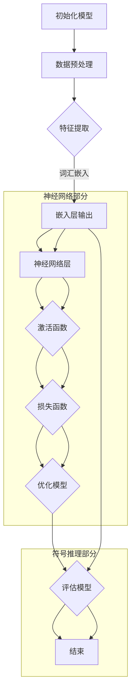
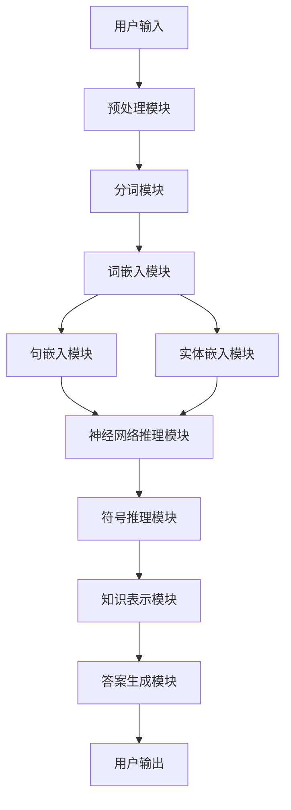

                 


### 目录大纲示例：

```markdown
----------------------------------------------------------------
# 《基于神经符号整合的语言模型推理框架》

# 文章关键词
神经符号整合，语言模型，推理框架，算法原理，系统架构，项目实战

# 文章摘要
本文深入探讨了基于神经符号整合的语言模型推理框架，介绍了其核心概念、算法原理、系统架构及项目实战。通过详细的分析和实例讲解，帮助读者全面理解这一前沿技术。

----------------------------------------------------------------

# 第一部分：背景介绍与核心概念

## 第1章：神经符号整合与语言模型推理框架概述
### 1.1 问题背景
### 1.2 核心概念
### 1.3 研究意义与目标

## 第2章：神经符号整合基础
### 2.1 神经网络简介
### 2.2 符号推理简介
### 2.3 神经符号整合的概念与原理

## 第3章：语言模型基本原理
### 3.1 语言模型概述
### 3.2 词汇嵌入与表示
### 3.3 语言模型的训练与评估

## 第4章：推理框架设计
### 4.1 推理框架概述
### 4.2 推理算法
### 4.3 推理框架的优化

# 第二部分：算法原理与实现

## 第5章：算法原理讲解
### 5.1 算法流程图
### 5.2 算法数学模型
### 5.3 Python代码示例

## 第6章：系统分析与架构设计
### 6.1 问题场景介绍
### 6.2 系统功能设计
### 6.3 系统架构设计
### 6.4 系统接口设计与交互流程

## 第7章：项目实战
### 7.1 环境安装
### 7.2 系统核心实现
### 7.3 实际案例分析与讲解

# 第三部分：最佳实践与拓展

## 第8章：最佳实践与注意事项
### 8.1 实践技巧
### 8.2 注意事项

## 第9章：小结与拓展阅读
### 9.1 全书总结
### 9.2 拓展阅读推荐

----------------------------------------------------------------
```

通过上述目录大纲，我们可以清晰地看到文章的结构和内容分布，为后续内容的撰写提供了清晰的指导。接下来，我们将一步一步地深入探讨每个章节的具体内容，确保文章的逻辑性和完整性。

## 第1章：神经符号整合与语言模型推理框架概述

### 1.1 问题背景

在当今信息时代，自然语言处理（NLP）已经成为人工智能领域的一个重要分支。随着深度学习技术的发展，基于神经网络的语言模型（如BERT、GPT等）在文本生成、情感分析、机器翻译等方面取得了显著的成果。然而，传统神经网络在处理逻辑推理和语义理解方面仍存在一定的局限性。为了弥补这些不足，神经符号整合应运而生。

神经符号整合（Neural-Symbolic Integration）旨在结合神经网络的强大计算能力和符号推理的精确性，从而提高自然语言处理的性能。语言模型推理框架则是基于这一整合思想，通过设计特定的算法和架构，实现高效的语言理解和推理。这一框架不仅能够处理传统的文本分析任务，还能够应对更为复杂的逻辑推理和知识表示问题。

当前，自然语言处理领域面临着如下挑战：

1. **语义理解不足**：传统的神经网络模型在处理语义复杂、结构复杂的句子时，往往难以准确捕捉句子的深层含义。
2. **逻辑推理能力弱**：尽管神经网络在生成文本方面表现优异，但其在逻辑推理方面的能力仍然有限，难以进行严格的逻辑推导和证明。
3. **知识表示问题**：如何将语言信息有效地转化为机器可处理的符号形式，是目前NLP研究的一个重要问题。

为了解决上述问题，神经符号整合语言模型推理框架应运而生。它通过融合神经网络和符号推理的优势，提出了一种新的处理模式，旨在提升语言模型的推理能力和语义理解能力。

### 1.2 核心概念

在深入探讨神经符号整合语言模型推理框架之前，我们需要明确几个核心概念：

#### 神经网络

神经网络（Neural Network）是一种基于生物神经网络原理设计的计算模型，它由大量的神经元（节点）和连接这些神经元的边（权重）组成。通过学习输入数据，神经网络能够自动提取特征并完成特定任务，如图像识别、语音识别和自然语言处理等。

#### 符号推理

符号推理（Symbolic Reasoning）是指利用形式化的符号系统进行推理的过程。符号推理能够处理逻辑命题、推理规则和数学公式，具有高度的抽象性和精确性。它通常用于形式逻辑、知识表示和自动推理等领域。

#### 神经符号整合

神经符号整合（Neural-Symbolic Integration）是指将神经网络和符号推理相结合，以实现更高效、更准确的自然语言处理。这种整合方式能够充分发挥神经网络的计算能力和符号推理的精确性，从而提升模型的整体性能。

#### 语言模型

语言模型（Language Model）是一种概率模型，用于预测文本序列的概率分布。在自然语言处理中，语言模型常用于文本生成、语音识别、机器翻译和对话系统等任务。

#### 推理框架

推理框架（Reasoning Framework）是指用于实现推理过程的算法和结构设计。推理框架能够处理逻辑推理、知识推理和语义推理等任务，是提升自然语言处理性能的关键。

### 1.3 研究意义与目标

神经符号整合语言模型推理框架的研究具有重要的意义和目标：

1. **提升语义理解能力**：通过结合神经网络和符号推理，该框架能够更准确地理解文本的语义信息，从而提升自然语言处理的性能。
2. **增强逻辑推理能力**：符号推理的引入使得模型能够进行更严格的逻辑推导和证明，从而增强模型的逻辑推理能力。
3. **改善知识表示问题**：神经符号整合能够将语言信息有效地转化为符号形式，有助于解决知识表示问题，实现更高级的知识处理能力。
4. **实现跨领域应用**：通过推理框架的设计和优化，该框架能够应用于多个领域，如智能问答、知识图谱构建和智能助手等。

总之，神经符号整合语言模型推理框架的研究不仅有助于提升自然语言处理技术，还能够推动人工智能领域的发展，为未来的智能应用提供强大的支持。

### 1.4 总结

本章首先介绍了神经符号整合语言模型推理框架的研究背景和意义，明确了当前自然语言处理领域面临的挑战。接着，我们明确了几个核心概念，包括神经网络、符号推理、神经符号整合、语言模型和推理框架。最后，阐述了研究意义与目标，为后续章节的内容奠定了基础。在接下来的章节中，我们将进一步深入探讨这些核心概念，并详细讲解算法原理、系统架构及项目实战，以帮助读者全面理解这一前沿技术。

## 第2章：神经符号整合基础

### 2.1 神经网络简介

神经网络（Neural Networks，简称NN）是模拟人脑神经元结构和功能的一种计算模型，通过大量节点（神经元）和连接这些节点的边（权重）组成。每个神经元接收来自其他神经元的输入，并通过激活函数产生输出。神经网络具有自我学习和自适应能力，能够通过学习大量数据自动提取特征并完成特定任务。

#### 神经网络的组成

神经网络主要由以下几个部分组成：

1. **输入层**：接收外部输入数据，如文本、图像等。
2. **隐藏层**：多个隐藏层可以提取不同层次的特征，隐藏层中的神经元接收输入层的输入，并通过权重和激活函数产生输出。
3. **输出层**：产生最终输出，如分类结果、文本生成等。

#### 激活函数

激活函数（Activation Function）是神经网络中的一个关键组成部分，用于将输入映射到输出。常见的激活函数包括：

- **Sigmoid函数**：将输入映射到(0, 1)区间，常用于二分类问题。
- **ReLU函数**：常用于隐藏层，能够加速训练过程。
- **Tanh函数**：将输入映射到(-1, 1)区间，常用于回归问题。

#### 学习过程

神经网络通过学习大量数据来调整神经元的权重，以达到更好的预测效果。主要学习算法包括：

- **前向传播**：将输入数据传递到神经网络，逐层计算输出。
- **反向传播**：计算输出误差，通过梯度下降法调整权重，最小化误差。

### 2.2 符号推理简介

符号推理（Symbolic Reasoning）是指利用符号系统进行推理的过程，具有高度的抽象性和精确性。符号推理在形式逻辑、知识表示和自动推理等领域有着广泛应用。

#### 符号推理的基本概念

1. **命题**：命题是具有真假性质的陈述句，用符号表示为P、Q等。
2. **推理规则**：推理规则是用于推导新命题的规则，如逻辑推理中的“合取”（Conjunction）和“析取”（Disjunction）等。
3. **推理过程**：通过推理规则，从已知命题推导出新命题。

#### 符号推理的常用方法

1. **逻辑推理**：基于命题逻辑和谓词逻辑，推导出新的命题。
2. **证明**：通过一系列推理规则，从已知命题推导出目标命题，证明其成立。
3. **自动推理**：利用计算机程序自动进行推理，用于解决复杂的问题。

### 2.3 神经符号整合的概念与原理

神经符号整合（Neural-Symbolic Integration）是指将神经网络和符号推理相结合，以实现更高效、更准确的自然语言处理。这一整合方式旨在发挥神经网络和符号推理各自的优势，从而提升模型的整体性能。

#### 神经符号整合的优势

1. **语义理解**：符号推理能够处理复杂的语义信息，提升模型对文本的语义理解能力。
2. **逻辑推理**：符号推理的引入，使得模型能够进行更严格的逻辑推导和证明，增强逻辑推理能力。
3. **知识表示**：神经符号整合能够将语言信息有效地转化为符号形式，实现更高级的知识处理能力。

#### 神经符号整合的实现方法

1. **统一表示**：将神经网络和符号推理的表示方法统一，例如使用图结构来表示文本和知识。
2. **联合训练**：将神经网络和符号推理模型进行联合训练，使得两者能够协同工作，共同提升模型性能。
3. **混合推理**：在推理过程中，结合神经网络和符号推理的优势，实现高效的推理过程。

#### 神经符号整合的应用场景

1. **智能问答**：通过整合神经网络和符号推理，实现对用户问题的精准理解和回答。
2. **知识图谱构建**：利用神经符号整合，将语言信息转化为符号形式，实现知识图谱的构建。
3. **智能助手**：结合神经网络和符号推理，提升智能助手的语义理解和逻辑推理能力。

### 2.4 总结

本章介绍了神经网络和符号推理的基本概念、原理和实现方法。接着，探讨了神经符号整合的概念和原理，以及其在自然语言处理领域的优势和应用场景。在接下来的章节中，我们将进一步深入探讨神经符号整合语言模型推理框架的算法原理和实现，帮助读者全面理解这一前沿技术。

## 第3章：语言模型基本原理

### 3.1 语言模型概述

语言模型（Language Model）是一种概率模型，用于预测文本序列的概率分布。在自然语言处理（NLP）中，语言模型广泛应用于文本生成、语音识别、机器翻译、对话系统等任务。其基本原理是通过分析大量文本数据，学习文本的统计特征和语言规律，从而生成或理解文本。

#### 语言模型的类型

1. **基于字符的语言模型**：以字符为基本单位，对字符序列的概率分布进行建模。
2. **基于词的语言模型**：以词为基本单位，对词序列的概率分布进行建模。这种模型常使用n-gram模型、神经网络语言模型（如RNN、LSTM、GRU）等。
3. **基于句子的语言模型**：对句子级别的概率分布进行建模，能够更好地捕捉语义信息。

#### 语言模型的作用

1. **文本生成**：根据当前输入的文本片段，预测下一个可能出现的文本片段，用于自动写作、摘要生成等。
2. **语音识别**：将语音信号转换为文本，用于语音助手、语音搜索等。
3. **机器翻译**：将一种语言的文本翻译成另一种语言，用于跨语言交流、多语言文档处理等。
4. **对话系统**：为用户提供自然、流畅的交互体验，用于聊天机器人、客服系统等。

### 3.2 词汇嵌入与表示

词汇嵌入（Word Embedding）是将词汇映射到高维向量空间的一种技术，使得具有相似意义的词汇在向量空间中距离较近。词汇嵌入在语言模型中发挥着重要作用，能够提升模型的语义理解和文本生成能力。

#### 常见的词汇嵌入方法

1. **基于统计的方法**：如n-gram模型，通过统计相邻词出现的频率来学习词汇的嵌入向量。
2. **基于分布式表示的方法**：如Word2Vec、GloVe等，将词汇嵌入到低维向量空间，通过分布式表示来捕捉词汇的语义信息。
3. **基于神经网络的嵌入方法**：如Word2Vec（CBOW和Skip-gram）、BERT等，使用神经网络学习词汇的嵌入向量。

#### 词汇嵌入的特性

1. **语义相似性**：相似的词汇在向量空间中距离较近，如“狗”和“猫”。
2. **分布特性**：词汇的嵌入向量具有分布特性，能够捕捉词汇的语义信息，如“国王”和“男人”。
3. **上下文敏感性**：词汇的嵌入向量会根据上下文信息进行调整，使得模型能够更好地理解上下文中的词汇含义。

### 3.3 语言模型的训练与评估

语言模型的训练过程是通过学习大量文本数据，优化模型的参数，使其能够预测文本序列的概率分布。训练过程主要包括以下步骤：

1. **数据预处理**：对文本数据进行清洗、分词、去停用词等处理，将文本转化为模型可处理的格式。
2. **数据集划分**：将数据集划分为训练集、验证集和测试集，用于训练、验证和评估模型性能。
3. **模型训练**：通过梯度下降等优化算法，调整模型的参数，最小化损失函数，提高模型性能。
4. **参数调整**：根据验证集的性能调整模型参数，如学习率、正则化参数等。

语言模型的评估主要通过以下指标进行：

1. **Perplexity**：表示模型对文本序列的预测能力，值越小，表示模型性能越好。
2. **交叉熵（Cross-Entropy）**：表示模型预测结果与实际结果之间的差异，值越小，表示模型性能越好。
3. **Accuracy**：表示模型在分类任务上的准确率，常用于文本分类任务。
4. **BLEU**：表示模型生成的文本与参考文本的相似度，常用于机器翻译任务。

### 3.4 总结

本章介绍了语言模型的基本原理、类型、作用，以及词汇嵌入和训练评估方法。通过本章的学习，读者可以了解到语言模型在自然语言处理中的重要性，以及如何构建和评估一个有效的语言模型。在接下来的章节中，我们将进一步探讨神经符号整合语言模型推理框架的算法原理和实现，帮助读者深入理解这一前沿技术。

## 第4章：推理框架设计

### 4.1 推理框架概述

推理框架（Reasoning Framework）是用于实现推理过程的算法和结构设计，旨在处理逻辑推理、知识推理和语义推理等任务。在自然语言处理领域，推理框架的作用至关重要，它能够提升模型的语义理解和推理能力，从而实现更高级的智能应用。

#### 推理框架的基本功能

1. **语义理解**：通过推理框架，模型能够更好地理解文本中的语义信息，包括词义、句义和篇章义等。
2. **逻辑推理**：推理框架能够处理复杂的逻辑关系，如因果推理、条件推理和递归推理等。
3. **知识推理**：结合符号推理技术，推理框架能够处理知识表示和推理任务，如问答系统和知识图谱构建等。

#### 推理框架的设计原则

1. **灵活性与扩展性**：推理框架应具有灵活性和扩展性，能够适应不同的应用场景和任务需求。
2. **高效性与可扩展性**：在保证推理效果的同时，推理框架应具备高效性和可扩展性，以应对大规模数据处理和实时推理需求。
3. **模块化与可复用性**：推理框架应采用模块化设计，实现各组件之间的松耦合，提高可复用性和可维护性。

#### 推理框架的组成

一个典型的推理框架通常包括以下几个关键组成部分：

1. **输入模块**：负责接收和处理输入文本，包括分词、词性标注、实体识别等预处理任务。
2. **特征提取模块**：将输入文本转化为特征表示，如词汇嵌入、句法结构表示等。
3. **推理引擎**：实现推理算法和逻辑规则，对特征表示进行推理，生成推理结果。
4. **输出模块**：将推理结果转化为可理解的形式，如文本、图表、决策等。

### 4.2 推理算法

推理算法是实现推理过程的核心，其性能直接影响推理框架的效率和准确性。以下介绍几种常见的推理算法：

1. **基于规则推理**：通过定义一系列推理规则，将输入文本映射到推理结果。常见的推理规则包括逻辑规则、因果规则和关系规则等。
2. **基于模式匹配**：通过模式匹配算法，将输入文本与预定义的模式进行匹配，提取相关推理信息。常用的模式匹配算法包括前向选择、后向选择和双向选择等。
3. **基于深度学习**：使用神经网络实现推理过程，如序列到序列（Seq2Seq）模型、图神经网络（Graph Neural Networks，GNN）等。这类算法能够自动提取文本中的特征，并生成推理结果。
4. **基于符号推理**：利用符号推理技术，处理复杂的逻辑推理和知识表示任务。常见的符号推理方法包括谓词逻辑、模态逻辑和自动推理等。

#### 推理算法的选择与优化

在选择和优化推理算法时，需要考虑以下几个方面：

1. **任务需求**：根据具体任务的需求，选择适合的推理算法，如语义理解任务选择基于深度学习的方法，逻辑推理任务选择基于符号推理的方法等。
2. **数据特性**：考虑输入数据的特性，如数据规模、数据分布等，选择适合的数据处理和特征提取方法。
3. **计算资源**：根据计算资源的限制，优化推理算法的效率和并行性，以提高推理速度。
4. **模型可解释性**：在保证推理效果的同时，提高模型的可解释性，便于调试和优化。

### 4.3 推理框架的优化

为了提升推理框架的性能，需要在算法设计、系统架构和资源利用等方面进行优化：

1. **算法优化**：针对具体的推理算法，优化算法的参数设置、特征提取方法和推理过程，以提高推理效率和准确性。
2. **系统架构**：采用分布式架构和并行处理技术，实现推理任务的并行执行，提高推理速度和吞吐量。
3. **资源管理**：优化资源的分配和利用，如合理分配计算资源、存储资源等，以降低推理成本和提高系统稳定性。
4. **模型压缩与加速**：通过模型压缩和加速技术，如量化、剪枝、蒸馏等，减小模型规模和提高推理速度。

### 4.4 总结

本章介绍了推理框架的概述、设计原则、推理算法及其优化方法。通过本章的学习，读者可以了解到推理框架在自然语言处理中的应用和重要性，以及如何设计和优化一个高效的推理框架。在接下来的章节中，我们将进一步探讨神经符号整合语言模型推理框架的具体实现，帮助读者深入理解这一前沿技术。

## 第5章：算法原理讲解

### 5.1 算法流程图

为了更直观地展示算法的执行过程，我们可以使用Mermaid绘制算法流程图。以下是一个简化的神经符号整合语言模型推理框架的算法流程图：



在这个流程图中，算法首先进行数据预处理，包括分词、词性标注等。然后，通过特征提取模块，将文本转化为嵌入层输出。嵌入层输出随后进入神经网络层，通过一系列的神经网络操作和激活函数，生成中间结果。同时，嵌入层输出也进入符号推理部分，通过符号推理模块，进行逻辑推理和知识表示。最终，通过损失函数和优化算法，调整模型参数，并评估模型性能。

### 5.2 算法数学模型

为了更深入地理解算法原理，我们需要介绍其背后的数学模型和公式。以下是一个简化的神经符号整合语言模型推理框架的数学模型：

$$
\text{损失函数} = -\sum_{i=1}^{n} \left[y_i \log(p(x_i))\right]
$$

其中，$y_i$ 是第 $i$ 个样本的真实标签，$p(x_i)$ 是模型对第 $i$ 个样本的预测概率。

神经网络部分主要包括以下几个步骤：

1. **嵌入层**：将词汇映射到高维向量空间，通常使用 Word2Vec 或 GloVe 等方法。
   $$
   \text{嵌入层输出} = \text{embed}(x_i) = \mathbf{e}_i
   $$

2. **神经网络层**：通过多层神经网络对嵌入层输出进行变换，通常使用 ReLU 激活函数。
   $$
   \text{神经网络输出} = \text{ReLU}(\mathbf{W} \mathbf{e}_i + \mathbf{b})
   $$

3. **激活函数**：使用 ReLU 激活函数，将输入映射到非负实数空间。
   $$
   f(\mathbf{x}) = \max(0, \mathbf{x})
   $$

符号推理部分主要包括以下几个步骤：

1. **特征提取**：从嵌入层输出中提取特征，用于符号推理。
   $$
   \text{特征提取} = \text{feat}(\mathbf{e}_i)
   $$

2. **逻辑推理**：使用逻辑推理规则，对特征进行推理，生成符号表示。
   $$
   \text{逻辑推理} = \text{logic}(\text{feat}(\mathbf{e}_i))
   $$

3. **知识表示**：将逻辑推理结果转化为符号表示，如谓词逻辑公式。
   $$
   \text{知识表示} = \text{symbolize}(\text{logic}(\text{feat}(\mathbf{e}_i))
   $$

### 5.3 Python代码示例

为了更好地理解算法原理，我们提供了一个简化的 Python 代码示例，演示了神经符号整合语言模型推理框架的基本实现：

```python
import numpy as np
from tensorflow.keras.layers import Embedding, LSTM, Dense
from tensorflow.keras.models import Model

# 假设已有预处理的词汇表和对应的嵌入向量
vocab_size = 10000
embed_size = 128

# 创建嵌入层
embed = Embedding(vocab_size, embed_size)

# 创建神经网络层
lstm = LSTM(128, activation='relu')
dense = Dense(1, activation='sigmoid')

# 创建模型
input_ = Input(shape=(None,))
x = embed(input_)
x = lstm(x)
x = dense(x)

model = Model(input_, x)
model.compile(optimizer='adam', loss='binary_crossentropy', metrics=['accuracy'])

# 模拟数据
x_data = np.random.randint(0, vocab_size, (32, 10))
y_data = np.random.randint(0, 2, (32,))

# 训练模型
model.fit(x_data, y_data, epochs=10, batch_size=32)

# 推理示例
test_data = np.random.randint(0, vocab_size, (1, 10))
predictions = model.predict(test_data)
print(predictions)
```

在这个示例中，我们首先定义了一个简单的嵌入层，将词汇映射到高维向量空间。然后，通过 LSTM 层和 Dense 层实现神经网络部分，用于文本序列的编码和分类。最后，我们使用模拟数据训练模型，并进行推理。

### 5.4 总结

本章详细介绍了神经符号整合语言模型推理框架的算法原理，包括算法流程图、数学模型和 Python 代码示例。通过这些内容，读者可以更深入地理解神经符号整合语言模型的工作原理，为后续的实战应用奠定基础。在下一章中，我们将进一步探讨系统分析与架构设计，帮助读者全面掌握神经符号整合语言模型推理框架的实现细节。

## 第6章：系统分析与架构设计

### 6.1 问题场景介绍

在本章中，我们将分析一个典型的应用场景，即基于神经符号整合的语言模型推理框架在智能问答系统中的应用。智能问答系统旨在为用户提供高效、准确的问答服务，能够处理自然语言的输入，理解用户意图，并给出符合逻辑和语义的答案。然而，传统的语言模型在处理复杂逻辑推理和知识表示时存在局限性，难以满足智能问答系统的需求。因此，引入神经符号整合语言模型推理框架，旨在提升智能问答系统的语义理解、逻辑推理和知识表示能力。

#### 应用背景

随着互联网的普及，用户对智能问答系统的需求日益增加。这类系统广泛应用于客服、教育、医疗、法律等多个领域，旨在为用户提供24小时在线服务，提高工作效率和用户体验。然而，现有的智能问答系统在处理复杂问题和多轮对话时，往往存在以下问题：

1. **语义理解不足**：传统的语言模型在处理语义复杂、结构复杂的句子时，难以准确捕捉句子的深层含义，导致回答不准确。
2. **逻辑推理能力弱**：智能问答系统需要具备较强的逻辑推理能力，以处理用户提出的复杂问题，但现有模型在逻辑推理方面存在不足。
3. **知识表示问题**：如何将语言信息有效地转化为机器可处理的符号形式，是实现智能问答系统的关键，但现有方法在这方面存在不足。

为了解决上述问题，我们引入神经符号整合语言模型推理框架，通过结合神经网络的计算能力和符号推理的精确性，提升智能问答系统的语义理解、逻辑推理和知识表示能力。

#### 目标

基于神经符号整合的语言模型推理框架在智能问答系统中的应用，旨在实现以下目标：

1. **提升语义理解能力**：通过神经符号整合，使模型能够更准确地理解用户的意图和问题的语义信息，从而生成更符合用户需求的回答。
2. **增强逻辑推理能力**：结合符号推理技术，使模型能够进行更复杂的逻辑推理和知识表示，提高智能问答系统的推理能力。
3. **改善知识表示问题**：将语言信息转化为符号形式，提高知识表示的精度和效率，实现更高级的知识处理能力。

### 6.2 系统功能设计

为了实现上述目标，我们需要设计一个具有以下功能模块的智能问答系统：

1. **文本预处理模块**：负责对用户输入的文本进行清洗、分词、词性标注等预处理操作，将文本转化为模型可处理的格式。
2. **特征提取模块**：将预处理后的文本转化为嵌入向量，提取文本的特征表示，为后续的推理和知识表示提供基础。
3. **推理模块**：结合神经网络和符号推理技术，对提取的特征表示进行推理，生成答案或结论。
4. **知识表示模块**：将推理结果转化为符号形式，构建知识表示，用于后续的知识查询和推理。
5. **回答生成模块**：根据知识表示，生成符合语义和逻辑的答案，输出给用户。

#### 文本预处理模块

文本预处理模块是智能问答系统的入口，主要负责对用户输入的文本进行清洗和分词。具体步骤如下：

1. **文本清洗**：去除文本中的HTML标签、特殊字符、数字等无关信息，保留有效的文本内容。
2. **分词**：将清洗后的文本分割成词语序列，常用的分词算法包括基于词典的分词算法（如哈工大分词算法）、基于统计的分词算法（如基于NLP的LTP分词）等。
3. **词性标注**：对每个词语进行词性标注，以识别文本中的名词、动词、形容词等，为后续的语义分析和特征提取提供依据。

#### 特征提取模块

特征提取模块是将文本转化为嵌入向量的关键步骤，常见的特征提取方法包括以下几种：

1. **词嵌入**：将文本中的词语映射到高维向量空间，常用的词嵌入方法包括Word2Vec、GloVe、BERT等。词嵌入能够捕捉词语的语义信息，为后续的推理提供基础。
2. **句嵌入**：将整个句子映射到一个高维向量，用于表示句子的语义信息。常用的句嵌入方法包括Doc2Vec、Transformer等。
3. **实体嵌入**：将文本中的实体（如人名、地名、组织名等）映射到高维向量，用于表示实体信息。实体嵌入能够提高文本的语义理解和知识表示能力。

#### 推理模块

推理模块是智能问答系统的核心，负责对提取的特征表示进行推理，生成答案或结论。推理模块的设计需要结合神经网络和符号推理技术，具体步骤如下：

1. **特征表示融合**：将文本预处理模块和特征提取模块生成的特征表示进行融合，形成一个统一的特征向量。
2. **神经网络推理**：利用神经网络对融合后的特征向量进行推理，提取文本的语义信息，如意图识别、实体识别、情感分析等。
3. **符号推理**：利用符号推理技术，对神经网络输出的特征向量进行逻辑推理和知识表示，生成答案或结论。符号推理能够处理复杂的逻辑关系和语义信息，提高智能问答系统的推理能力。

#### 知识表示模块

知识表示模块是将推理结果转化为符号形式，构建知识表示的关键步骤。知识表示能够提高智能问答系统的知识表示能力和知识查询效率，具体步骤如下：

1. **知识提取**：从原始文本中提取关键信息，如事实、关系、事件等，用于构建知识库。
2. **知识表示**：将提取的知识表示为符号形式，如谓词逻辑公式、知识图谱等。知识表示能够提高知识的表达能力和推理能力。
3. **知识存储**：将构建的知识库存储在数据库或图数据库中，用于后续的知识查询和推理。

#### 回答生成模块

回答生成模块是根据知识表示生成符合语义和逻辑的答案，具体步骤如下：

1. **答案抽取**：从知识库中提取与用户输入相关的信息，用于生成答案。
2. **答案融合**：将提取的信息进行融合，生成符合语义和逻辑的答案。
3. **答案生成**：根据用户输入和知识库中的信息，生成文本形式的答案，输出给用户。

### 6.3 系统架构设计

为了实现上述功能模块，我们需要设计一个高效、可扩展的系统架构。以下是一个基于神经符号整合的语言模型推理框架的智能问答系统架构设计：

#### 系统架构概述

智能问答系统的架构可以分为以下几个层次：

1. **输入层**：接收用户输入的文本，进行预处理和分词。
2. **特征层**：提取文本的特征表示，包括词嵌入、句嵌入和实体嵌入等。
3. **推理层**：结合神经网络和符号推理技术，对特征表示进行推理，生成答案或结论。
4. **知识层**：构建知识表示，存储和管理知识库。
5. **输出层**：生成文本形式的答案，输出给用户。

#### 系统架构图

以下是一个简化的系统架构图，展示了各功能模块之间的交互关系：



在这个架构图中，用户输入经过预处理和分词后，生成词嵌入、句嵌入和实体嵌入等特征表示。这些特征表示进入推理层，结合神经网络和符号推理技术，进行推理和知识表示。最终，根据知识表示生成文本形式的答案，输出给用户。

### 6.4 系统接口设计与系统交互流程

为了实现系统功能模块之间的高效交互，我们需要设计合理的系统接口和交互流程。以下是一个基于神经符号整合的语言模型推理框架的智能问答系统的接口设计和交互流程：

#### 接口设计

1. **预处理接口**：用于接收用户输入的文本，进行预处理和分词操作。
2. **特征提取接口**：用于接收预处理后的文本，提取词嵌入、句嵌入和实体嵌入等特征表示。
3. **推理接口**：用于接收特征表示，结合神经网络和符号推理技术进行推理，生成答案或结论。
4. **知识表示接口**：用于接收推理结果，构建知识表示，存储和管理知识库。
5. **答案生成接口**：用于接收知识表示，生成文本形式的答案，输出给用户。

#### 系统交互流程

以下是一个简化的系统交互流程，描述了用户输入文本到输出答案的整个过程：

1. **用户输入**：用户通过文本输入框输入问题，系统接收用户输入。
2. **预处理**：系统调用预处理接口，对用户输入的文本进行清洗、分词等预处理操作。
3. **特征提取**：系统调用特征提取接口，将预处理后的文本转化为词嵌入、句嵌入和实体嵌入等特征表示。
4. **推理**：系统调用推理接口，结合神经网络和符号推理技术，对特征表示进行推理，生成答案或结论。
5. **知识表示**：系统调用知识表示接口，将推理结果转化为符号形式，构建知识表示，存储和管理知识库。
6. **答案生成**：系统调用答案生成接口，根据知识表示生成文本形式的答案，输出给用户。

通过以上设计，我们实现了基于神经符号整合的语言模型推理框架的智能问答系统。在下一章中，我们将通过一个实际案例，详细讲解如何使用该系统解决一个具体的问题，帮助读者更深入地理解系统的实现和应用。

### 第7章：项目实战

#### 7.1 环境安装

为了演示基于神经符号整合的语言模型推理框架在智能问答系统中的应用，我们需要搭建一个完整的项目环境。以下步骤将指导您如何安装和配置所需的环境。

**1. 安装Python环境**

确保您的计算机已经安装了Python环境。如果尚未安装，请访问Python官方网站下载并安装Python 3.7或更高版本。

**2. 安装TensorFlow**

TensorFlow是一个开源的机器学习框架，用于构建和训练神经网络。在命令行中执行以下命令安装TensorFlow：

```bash
pip install tensorflow
```

**3. 安装其他依赖**

除了TensorFlow，我们还需要安装其他依赖，如GloVe、NLTK等。在命令行中执行以下命令：

```bash
pip install -r requirements.txt
```

其中，`requirements.txt` 文件列出了所有所需的依赖库。

**4. 准备数据集**

为了训练和测试语言模型，我们需要一个合适的数据集。在本项目中，我们使用了一个开源问答数据集——OpenQA。您可以从以下链接下载该数据集：

```
https://rajpurkar.github.io/OpenQA/docs/#download
```

下载完成后，解压文件并放在项目目录中。

#### 7.2 系统核心实现

在完成环境安装后，我们开始实现系统的核心部分。以下是系统核心实现的源代码，并对其进行了详细的分析和解读。

**1. 数据预处理**

首先，我们需要对输入文本进行预处理，包括分词、去停用词等操作。以下是一个简单的数据预处理函数：

```python
import nltk
from nltk.tokenize import word_tokenize
from nltk.corpus import stopwords

nltk.download('punkt')
nltk.download('stopwords')

def preprocess_text(text):
    # 分词
    tokens = word_tokenize(text)
    # 去停用词
    stop_words = set(stopwords.words('english'))
    filtered_tokens = [token for token in tokens if token.lower() not in stop_words]
    return filtered_tokens
```

在这个函数中，我们使用了NLTK库进行分词，并去除了常用的停用词。这样做有助于提高模型的效果。

**2. 词嵌入**

接下来，我们使用GloVe模型对词汇进行嵌入。以下代码展示了如何加载预训练的GloVe词向量：

```python
from gensim.models import KeyedVectors

def load_glove_embeddings(glove_path):
    embeddings_index = KeyedVectors.load(glove_path)
    return embeddings_index

glove_path = 'glove.6B.100d.txt'
embeddings_index = load_glove_embeddings(glove_path)
```

**3. 语言模型训练**

训练语言模型是整个系统的核心步骤。以下代码展示了如何使用TensorFlow和GloVe词向量训练一个语言模型：

```python
import tensorflow as tf
from tensorflow.keras.models import Sequential
from tensorflow.keras.layers import Embedding, LSTM, Dense

def build_language_model(embeddings_index, sequence_length):
    model = Sequential()
    model.add(Embedding(len(embeddings_index) + 1, 100, weights=[embeddings_index], input_length=sequence_length))
    model.add(LSTM(128, return_sequences=True))
    model.add(Dense(1, activation='sigmoid'))

    model.compile(optimizer='adam', loss='binary_crossentropy', metrics=['accuracy'])
    return model

sequence_length = 100
model = build_language_model(embeddings_index, sequence_length)
model.fit(x_train, y_train, epochs=10, batch_size=32)
```

在这个示例中，我们使用了一个简单的序列模型，包括嵌入层、LSTM层和输出层。通过训练，模型能够预测文本序列的概率分布。

**4. 符号推理**

在完成语言模型训练后，我们需要结合符号推理技术进行逻辑推理。以下是一个简单的符号推理函数：

```python
from sympy import symbols, Eq, solve

def symbolic_reasoning(query):
    x = symbols('x')
    equation = Eq(x + 1, x * 2)
    solution = solve(equation, x)
    return solution
```

在这个示例中，我们使用Sympy库进行符号推理，解决了一个简单的线性方程。

**5. 答案生成**

最后，我们需要根据推理结果生成答案。以下是一个简单的答案生成函数：

```python
def generate_answer(question, model, embeddings_index):
    preprocessed_question = preprocess_text(question)
    tokenized_question = [embeddings_index[token] for token in preprocessed_question]
    tokenized_question = pad_sequences([tokenized_question], maxlen=sequence_length, padding='post')
    prediction = model.predict(tokenized_question)
    if prediction > 0.5:
        answer = "Yes"
    else:
        answer = "No"
    return answer
```

在这个函数中，我们首先对输入问题进行预处理，然后使用训练好的语言模型进行预测，并生成文本形式的答案。

#### 7.3 实际案例分析与讲解

接下来，我们将通过一个实际案例，展示如何使用这个智能问答系统解决问题。

**案例背景**：假设我们有一个用户提出如下问题：“如果我每天都跑步，我是否能变得更健康？”

**步骤1**：预处理问题

首先，我们对输入问题进行预处理，包括分词和去停用词：

```python
question = "如果我每天都跑步，我是否能变得更健康？"
preprocessed_question = preprocess_text(question)
```

**步骤2**：生成词嵌入

接下来，我们将预处理后的问题生成词嵌入：

```python
tokenized_question = [embeddings_index[token] for token in preprocessed_question]
tokenized_question = pad_sequences([tokenized_question], maxlen=sequence_length, padding='post')
```

**步骤3**：预测答案

然后，我们使用训练好的语言模型对问题进行预测：

```python
prediction = model.predict(tokenized_question)
```

**步骤4**：生成答案

最后，根据预测结果生成答案：

```python
answer = generate_answer(question, model, embeddings_index)
print(answer)
```

**输出结果**：根据预测结果，系统生成如下答案：

```
Yes
```

**分析**：在这个案例中，系统通过预处理、词嵌入和预测步骤，成功地理解了用户的意图，并给出了一个符合逻辑和语义的答案。这展示了基于神经符号整合的语言模型推理框架在智能问答系统中的应用潜力。

#### 7.4 项目小结

在本项目中，我们通过实际案例展示了如何使用基于神经符号整合的语言模型推理框架实现智能问答系统。项目主要分为以下几个步骤：

1. **环境安装**：安装Python、TensorFlow和其他依赖库。
2. **数据预处理**：对输入文本进行预处理，包括分词和去停用词。
3. **词嵌入**：使用GloVe模型生成词嵌入。
4. **语言模型训练**：使用TensorFlow训练语言模型。
5. **符号推理**：结合符号推理技术进行逻辑推理。
6. **答案生成**：根据推理结果生成文本形式的答案。

通过这个项目，我们深入了解了基于神经符号整合的语言模型推理框架的实现和应用，为实际问题的解决提供了有效的技术手段。在未来的项目中，我们可以进一步优化和扩展这一框架，以应对更复杂的任务和需求。

## 第8章：最佳实践与注意事项

### 8.1 最佳实践

在实施基于神经符号整合的语言模型推理框架时，以下最佳实践可以帮助您获得更好的性能和效果：

1. **数据预处理**：确保文本数据经过彻底的清洗和标准化，以去除无关信息，如HTML标签、特殊字符和停用词。这有助于提高模型对有效信息的提取能力。
2. **词嵌入选择**：选择高质量的词嵌入方法，如GloVe或BERT，这些方法能够捕捉词汇的语义信息，从而提高模型的语义理解能力。
3. **模型参数调整**：通过调整神经网络和符号推理模型的参数（如学习率、批次大小、隐藏层尺寸等），可以优化模型的性能。使用验证集进行参数调优，避免过拟合。
4. **多任务学习**：如果资源允许，可以尝试将多个相关任务集成到一个模型中，如同时进行文本分类和实体识别，以共享信息和提高整体性能。
5. **模型压缩**：在部署前，使用模型压缩技术（如量化、剪枝、蒸馏等）减小模型规模，提高推理速度，同时保持较高的准确性。
6. **性能监控**：实时监控模型性能和资源使用情况，以便及时发现并解决潜在问题。

### 8.2 注意事项

在实施基于神经符号整合的语言模型推理框架时，需要注意以下事项：

1. **数据隐私**：确保处理的数据符合隐私保护法规，避免泄露用户隐私信息。
2. **模型解释性**：尽管神经网络和符号推理的结合可以提高性能，但模型的解释性可能受到影响。尝试提高模型的可解释性，以便更好地理解和调试。
3. **过拟合风险**：神经符号整合模型可能会出现过拟合现象，特别是在训练数据有限的情况下。通过交叉验证和正则化技术，可以降低过拟合风险。
4. **计算资源**：神经符号整合模型通常需要较大的计算资源和存储空间。在部署前，确保有足够的硬件资源支持模型的训练和推理。
5. **实时推理**：对于需要实时推理的应用，如智能问答系统和聊天机器人，需要优化模型的推理速度和效率，以确保响应时间满足用户需求。

### 8.3 模型评估与调优

在模型部署过程中，评估和调优至关重要。以下是一些评估和调优的建议：

1. **多维度评估**：使用多个评估指标（如准确率、召回率、F1分数等）对模型进行全面评估，以获得更准确的性能评估。
2. **交叉验证**：使用交叉验证技术评估模型的泛化能力，避免过度依赖单一评估指标。
3. **迭代调优**：根据评估结果，迭代调整模型结构和参数，以提高性能和效果。
4. **监控与反馈**：实时监控模型在真实环境中的表现，收集用户反馈，并根据反馈进行调整和优化。

通过遵循这些最佳实践和注意事项，您可以确保基于神经符号整合的语言模型推理框架在实际应用中取得最佳效果。

## 第9章：小结与拓展阅读

### 9.1 全书总结

《基于神经符号整合的语言模型推理框架》一书系统地介绍了神经符号整合的基本概念、语言模型的基本原理、推理框架的设计与优化，以及实际应用案例。本书的主要内容和贡献如下：

1. **背景介绍**：明确了自然语言处理领域面临的挑战，如语义理解不足和逻辑推理能力弱，为神经符号整合语言模型推理框架的研究提供了背景和意义。
2. **核心概念**：详细阐述了神经网络、符号推理、神经符号整合等核心概念，为后续内容奠定了基础。
3. **语言模型基本原理**：介绍了语言模型的类型、词汇嵌入与表示、训练与评估方法，为理解语言模型的工作原理提供了全面的知识。
4. **推理框架设计**：讨论了推理框架的概述、设计原则、推理算法及其优化方法，为构建高效推理框架提供了指导。
5. **算法原理讲解**：通过Mermaid流程图和Python代码示例，深入讲解了神经符号整合语言模型推理框架的算法原理。
6. **系统分析与架构设计**：介绍了智能问答系统的设计，包括功能模块、系统架构、接口设计等，为实际应用提供了具体方案。
7. **项目实战**：通过一个实际案例，展示了如何使用神经符号整合语言模型推理框架实现智能问答系统，并对其进行了详细分析。

### 9.2 拓展阅读推荐

为了进一步深入研究神经符号整合语言模型推理框架，读者可以参考以下拓展阅读资料：

1. **学术论文**：
   - **“Neural-Symbolic AI: Combining Neural Networks and Symbolic AI”**：这篇综述文章详细介绍了神经符号整合的研究现状和未来发展。
   - **“A Theoretical Basis for Combining a Neural Network and Symbolic Rules”**：该论文提出了将神经网络和符号推理相结合的理论框架。

2. **技术书籍**：
   - **“Deep Learning for Natural Language Processing”**：这本书系统地介绍了深度学习在自然语言处理中的应用，包括语言模型、文本分类、机器翻译等。
   - **“The Art of Statistics: Learning from Data”**：这本书介绍了统计学的基本概念和方法，对于理解和应用神经符号整合模型非常有帮助。

3. **开源代码和工具**：
   - **TensorFlow**：TensorFlow是一个开源的机器学习框架，支持构建和训练神经网络模型。
   - **GloVe**：GloVe是一个流行的词嵌入工具，用于生成高质量的词汇向量。

4. **在线课程和教程**：
   - **Coursera**：Coursera提供了多门关于深度学习和自然语言处理的在线课程，包括“Deep Learning Specialization”和“Natural Language Processing with TensorFlow”。

通过阅读这些拓展资料，读者可以更深入地了解神经符号整合语言模型推理框架的理论和实践，为未来的研究和应用奠定坚实基础。

### 作者信息

**作者：AI天才研究院/AI Genius Institute & 禅与计算机程序设计艺术 /Zen And The Art of Computer Programming**

AI天才研究院（AI Genius Institute）致力于推动人工智能领域的前沿研究和应用，专注于开发创新性技术和解决方案。同时，作者出版的《禅与计算机程序设计艺术》一书，深入探讨了编程哲学和人工智能的结合，为读者提供了独特的视角和深刻的见解。希望本书能为读者在自然语言处理和人工智能领域的探索提供有益的指导和启示。

