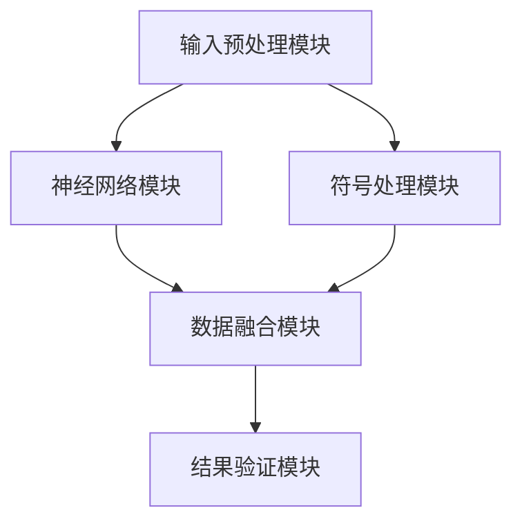

                 

## 引言

### 1. 研究背景与意义

在人工智能（AI）技术飞速发展的今天，如何更好地整合和利用不同类型的计算资源，已经成为学术界和工业界共同关注的焦点。特别是对于复杂问题的求解，单一的神经网络或者传统的符号推理系统都显得力不从心。因此，一种将神经网络与符号计算相结合的混合推理系统应运而生，为解决复杂问题提供了新的思路和途径。

神经符号集成（Neural-Symbolic Integration）作为一种新兴的研究方向，旨在融合神经网络强大的数据感知能力和符号计算的逻辑推理能力。通过神经符号集成，我们可以将复杂的知识表示和推理过程分解为更加模块化和可解释的步骤，从而提高系统的灵活性和效率。

混合推理系统（Hybrid Reasoning System）则是在这一背景下产生的一种综合性解决方案。它通过将神经网络和符号计算相结合，能够处理更广泛的问题，并且能够提供更加精确和可靠的推理结果。混合推理系统不仅适用于传统的数据密集型任务，如图像识别和自然语言处理，还适用于知识密集型任务，如图形推理和问题求解。

### 1.1 人工智能的发展历程

人工智能（AI）自1950年代图灵提出“计算机能思考吗？”这一问题时便开始萌芽。从最初的符号主义（Symbolism）到基于规则的专家系统（Expert Systems），再到基于模型的神经网络（Neural Networks），人工智能的发展历程充满了挑战和突破。

在符号主义阶段，专家系统通过预定义的规则来模拟人类专家的推理过程。这种方法在处理结构化数据和简单问题时表现出色，但随着问题复杂性的增加，其局限性也逐渐显现。

随着神经网络理论的兴起，特别是深度学习的突破，神经网络在图像识别、语音识别等领域的应用取得了显著成果。神经网络通过大量的数据训练，能够自动学习数据中的模式和特征，从而实现高度自动化的任务。

然而，神经网络在处理复杂逻辑推理和知识表示时仍存在不足，例如在处理不确定性和模糊性时表现不佳。为了弥补这一缺陷，神经符号集成的概念被提出，旨在结合神经网络和符号计算的优势，实现更加灵活和强大的推理系统。

### 1.2 神经符号集成的兴起

神经符号集成（Neural-Symbolic Integration）作为一种新兴的研究方向，近年来受到了广泛关注。其核心思想是将神经网络和符号计算相结合，以充分利用两者的优势。

神经网络的强大在于其能够通过大量的数据训练，自动提取复杂的数据特征，从而实现高度自动化的任务。然而，神经网络在处理复杂逻辑推理和知识表示时存在一些挑战，例如在处理不确定性和模糊性时表现不佳。

符号计算则擅长处理逻辑推理和知识表示，但其在数据感知和模式识别方面相对较弱。通过将神经网络和符号计算相结合，神经符号集成能够充分利用神经网络的数据感知能力和符号计算的逻辑推理能力，从而实现更加灵活和强大的推理系统。

神经符号集成的兴起可以追溯到深度学习与符号计算交叉融合的研究，如神经网络在符号序列处理中的应用，以及符号计算在神经网络结构设计中的作用。近年来，随着深度学习和符号计算技术的不断进步，神经符号集成在多个领域取得了显著的成果，例如自然语言处理、知识图谱、智能问答等。

### 1.3 混合推理系统的需求

混合推理系统（Hybrid Reasoning System）的需求源于现代复杂问题的多样性和复杂性。传统的单一推理系统，无论是基于神经网络的还是基于符号计算的，都难以应对各种复杂的问题场景。

首先，现实世界中的问题往往具有多样性和不确定性，单一的神经网络或符号计算系统在处理这些问题时容易陷入局部最优或者无法处理复杂逻辑。混合推理系统通过结合神经网络和符号计算的优势，能够更好地适应不同的任务需求和场景。

其次，随着人工智能应用的不断扩大，对于推理系统的实时性和效率要求越来越高。单一的神经网络系统在处理大规模数据时容易出现计算效率低下的问题，而符号计算系统则在处理复杂逻辑推理时表现出较强的计算能力。混合推理系统通过合理的模块设计和任务调度，能够在保证推理准确性的同时，提高系统的整体性能。

此外，混合推理系统还能够提供更加可解释和透明的推理过程。在医疗诊断、金融决策等关键领域，用户往往需要了解推理系统的决策过程和依据，以便对结果进行验证和改进。混合推理系统通过将神经网络和符号计算相结合，能够提供更加直观和可解释的推理路径，从而增强系统的可信度和可用性。

### 1.4 本章小结

本章从研究背景和意义出发，介绍了人工智能的发展历程，神经符号集成的兴起，以及混合推理系统的需求。通过分析神经符号集成和混合推理系统的优势和应用前景，我们为后续章节的内容奠定了基础。在接下来的章节中，我们将深入探讨神经符号集成的核心概念、混合推理系统的原理和实现，以及其在实际应用中的案例和分析。

## 2. 书籍概述

### 2.1 目录结构

本书分为五大部分，分别介绍神经符号集成的核心概念、混合推理系统的原理、系统的设计与实现、实际应用案例，以及总结与展望。具体目录如下：

#### 第1部分：神经符号集成概述
- 第1章：神经符号集成的核心概念
  - 1.1 神经符号集成的定义
  - 1.2 神经符号集成的优势
  - 1.3 神经符号集成的历史与发展
  - 1.4 本章小结

#### 第2部分：混合推理系统原理
- 第2章：混合推理系统的基本原理
  - 2.1 混合推理系统的定义
  - 2.2 混合推理系统的组成
  - 2.3 混合推理系统的工作流程
  - 2.4 本章小结

#### 第3部分：混合推理系统实现
- 第3章：混合推理系统的设计与实现
  - 3.1 系统需求分析
  - 3.2 系统架构设计
  - 3.3 系统实现细节
  - 3.4 本章小结

#### 第4部分：应用与案例分析
- 第4章：混合推理系统的应用案例
  - 4.1 应用场景介绍
  - 4.2 案例分析
    - 4.2.1 智能问答系统
    - 4.2.2 自然语言处理
    - 4.2.3 知识图谱构建

#### 第5部分：总结与展望
- 第5章：总结与展望
  - 5.1 总结
  - 5.2 展望

### 2.2 阅读指南

本书旨在为读者提供系统而全面的神经符号集成和混合推理系统知识，适合从事人工智能研究和应用的相关人员阅读。以下是具体的阅读指南：

- **基础知识准备**：建议读者具备一定的人工智能基础，包括神经网络和符号计算的基本原理。同时，了解深度学习和自然语言处理的基本概念将有助于更好地理解本书内容。

- **章节顺序阅读**：按照章节顺序阅读，从神经符号集成的核心概念入手，逐步深入到混合推理系统的原理和实现，再到实际应用案例。这样的阅读顺序有助于构建系统性的知识体系。

- **重点内容提炼**：在阅读过程中，重点掌握每个章节的核心概念和关键点，例如神经符号集成的优势、混合推理系统的工作流程、系统的实现细节等。这些内容是理解和应用混合推理系统的关键。

- **案例分析与思考**：对于每个应用案例，不仅要了解系统的具体实现，还要思考如何将这些案例应用于实际工作中。通过案例分析，读者可以更好地理解混合推理系统的应用场景和优势。

- **持续学习和实践**：人工智能和神经符号集成是一个快速发展的领域，读者应保持持续的学习和探索精神。通过实际项目和案例分析，不断积累经验和知识。

### 2.3 本章小结

本章介绍了本书的目录结构和阅读指南，帮助读者了解书中的内容安排和阅读方法。通过系统而全面的概述，读者可以更好地把握神经符号集成和混合推理系统的核心概念，为后续章节的学习打下坚实基础。接下来，我们将深入探讨神经符号集成的核心概念和优势，为理解混合推理系统奠定理论基础。

## 第1部分：神经符号集成概述

### 第1章：神经符号集成的核心概念

#### 1.1 神经符号集成的定义

神经符号集成（Neural-Symbolic Integration）是一种将神经网络（Neural Networks）与符号计算（Symbolic Computation）相结合的研究方向。它旨在结合两种计算方法的优点，以解决传统单一方法难以处理的问题。具体来说，神经符号集成通过将神经网络的数据感知能力与符号计算的逻辑推理能力相结合，实现更加灵活和高效的推理过程。

神经符号集成的定义可以从以下几个方面来理解：

1. **神经网络**：神经网络是一种基于生物神经网络结构的计算模型，通过大量的数据训练，能够自动学习和提取数据中的特征和模式。神经网络在图像识别、语音识别等领域取得了显著成果。

2. **符号计算**：符号计算是一种基于逻辑和符号运算的计算方法，通过预先定义的规则和逻辑关系进行推理和计算。符号计算在处理复杂逻辑推理、知识表示等方面表现出色。

3. **结合**：神经符号集成的核心在于将神经网络和符号计算相结合，通过相互补充，实现更加复杂和灵活的推理过程。

#### 1.1.1 神经网络

神经网络（Neural Networks）是一种模拟生物神经系统的计算模型，由大量的神经元（Neurons）通过连接（Connections）和权重（Weights）组成。每个神经元接收输入信号，通过激活函数（Activation Function）进行计算，最终产生输出信号。

神经网络的工作原理可以简单概括为以下几个步骤：

1. **输入层**：接收外部输入信号，每个输入信号通过连接与各个隐藏层神经元相连接。
2. **隐藏层**：对输入信号进行加工和变换，隐藏层可以有一个或多个。
3. **输出层**：输出层神经元根据隐藏层的输出信号，通过激活函数产生最终输出。

神经网络的优点在于其强大的数据感知能力和自学习能力。通过大量的数据训练，神经网络能够自动提取数据中的特征和模式，从而实现高度自动化的任务。然而，神经网络在处理复杂逻辑推理和知识表示时存在一些局限性，例如在处理不确定性和模糊性时表现不佳。

#### 1.1.2 符号计算

符号计算（Symbolic Computation）是一种基于逻辑和符号运算的计算方法。符号计算通过预先定义的规则和逻辑关系进行推理和计算，其核心在于逻辑推理和知识表示。

符号计算的基本原理可以概括为以下几个步骤：

1. **符号表示**：将问题用符号形式表示，包括变量、函数、关系等。
2. **逻辑推理**：根据定义的规则和逻辑关系，对符号表示的问题进行推理和计算。
3. **结果验证**：对推理结果进行验证，确保其正确性和合理性。

符号计算在处理复杂逻辑推理、知识表示等方面表现出色。符号计算能够通过逻辑推理，解决传统方法难以处理的问题，例如在自然语言处理、知识图谱、智能问答等领域。

#### 1.1.3 神经符号集成的结合点

神经符号集成的核心在于将神经网络和符号计算相结合，通过相互补充，实现更加复杂和灵活的推理过程。以下是神经符号集成的几个结合点：

1. **数据感知与逻辑推理**：神经网络擅长数据感知，能够自动提取数据中的特征和模式；符号计算擅长逻辑推理，能够处理复杂逻辑和知识表示。通过结合两者，可以更好地解决复杂问题。

2. **多模态数据处理**：神经网络可以处理多种类型的数据，如图像、文本、语音等；符号计算可以处理符号数据和逻辑关系。通过结合两者，可以实现对多模态数据的综合处理。

3. **不确定性处理**：神经网络在处理不确定性和模糊性时表现不佳；符号计算能够通过逻辑推理和概率计算，处理不确定性问题。通过结合两者，可以更好地处理不确定性和模糊性问题。

4. **可解释性**：神经网络在处理复杂任务时，往往缺乏可解释性；符号计算能够通过逻辑推理和符号表示，提供更加直观和透明的推理过程。通过结合两者，可以提高系统的可解释性和可信度。

#### 1.2 神经符号集成的优势

神经符号集成通过将神经网络和符号计算相结合，充分发挥了两种计算方法的优点，具有以下几个优势：

1. **灵活性和适应性**：神经符号集成能够处理多种类型的数据和问题，适应不同的应用场景。

2. **高效性**：神经符号集成通过结合神经网络的数据感知能力和符号计算的逻辑推理能力，能够提高系统的整体性能和效率。

3. **强推理能力**：神经符号集成能够通过逻辑推理，解决传统方法难以处理的问题，提供更加精确和可靠的推理结果。

4. **可解释性**：神经符号集成能够提供更加直观和透明的推理过程，提高系统的可解释性和可信度。

5. **可扩展性**：神经符号集成具有良好的可扩展性，可以通过引入新的神经网络模型和符号计算方法，不断优化和改进系统。

#### 1.3 神经符号集成的历史与发展

神经符号集成的概念可以追溯到20世纪80年代，当时神经网络和符号计算开始逐渐融合。以下是神经符号集成的一些重要历史和发展阶段：

1. **早期研究**：20世纪80年代，学者们开始尝试将神经网络和符号计算相结合，探索混合推理系统的可能性。这一阶段的代表性工作包括基于规则的神经网络模型和混合推理算法。

2. **发展阶段**：20世纪90年代，随着深度学习和符号计算技术的进步，神经符号集成的应用逐渐扩大。这一阶段的研究重点在于如何更好地结合神经网络和符号计算，提高系统的性能和效率。

3. **当前研究动态**：近年来，随着人工智能技术的快速发展，神经符号集成在多个领域取得了显著成果。当前的研究热点包括多模态数据处理、不确定性推理、可解释性增强等。

#### 1.3.1 早期研究

神经符号集成的早期研究主要集中在探索神经网络和符号计算的结合点，以及如何通过结合两者来提高系统的性能。以下是一些代表性的工作：

1. **基于规则的神经网络模型**：20世纪80年代，学者们提出了基于规则的神经网络模型，通过将规则和神经网络相结合，实现更加灵活的推理过程。

2. **混合推理算法**：早期的研究还探讨了混合推理算法，通过结合神经网络和符号计算的方法，实现复杂问题的求解。

3. **神经网络与逻辑推理的结合**：早期的研究尝试通过将神经网络与逻辑推理相结合，实现更加高效和灵活的推理过程。

#### 1.3.2 发展阶段

随着深度学习和符号计算技术的进步，神经符号集成的应用逐渐扩大。在20世纪90年代，神经符号集成进入了一个新的发展阶段。以下是这一阶段的一些重要进展：

1. **深度学习与符号计算的结合**：这一阶段的研究重点在于如何将深度学习与符号计算相结合，利用深度学习的数据感知能力，结合符号计算的逻辑推理能力，实现更加复杂和高效的推理过程。

2. **多模态数据处理**：随着多模态数据的广泛应用，如何利用神经符号集成方法处理多模态数据成为研究的热点。这一阶段的研究工作包括多模态特征提取、多模态推理算法等。

3. **不确定性推理**：在处理不确定性问题时，神经符号集成通过结合神经网络和符号计算的优势，提出了一系列不确定性推理方法，如基于概率的推理、模糊推理等。

4. **可解释性增强**：随着神经符号集成在各个领域的应用，如何提高系统的可解释性成为研究的一个重要方向。这一阶段的研究工作包括可解释性模型、解释方法等。

#### 1.3.3 当前研究动态

近年来，随着人工智能技术的快速发展，神经符号集成在多个领域取得了显著成果。以下是当前研究的一些动态：

1. **自然语言处理**：神经符号集成在自然语言处理领域表现出色，通过结合神经网络和符号计算的方法，实现了更加准确和灵活的语言理解和生成。

2. **知识图谱**：神经符号集成在知识图谱领域应用广泛，通过将神经网络与知识图谱相结合，实现了更加高效和准确的知识表示和推理。

3. **智能问答系统**：神经符号集成在智能问答系统中发挥了重要作用，通过结合神经网络和符号计算的方法，实现了更加准确和智能的问答过程。

4. **图像识别**：神经符号集成在图像识别领域取得了显著成果，通过结合神经网络和符号计算的优势，实现了更加准确和鲁棒的图像识别。

5. **多模态数据处理**：当前的研究热点之一是利用神经符号集成方法处理多模态数据，如图像、文本、语音等，实现跨模态的信息融合和推理。

#### 1.4 本章小结

本章介绍了神经符号集成的核心概念，包括神经网络的定义、符号计算的定义、神经符号集成的结合点，以及神经符号集成的优势。此外，还回顾了神经符号集成的历史与发展，从早期研究、发展阶段到当前研究动态。通过本章的学习，读者可以全面了解神经符号集成的概念和应用前景，为后续章节的学习打下坚实基础。

## 第2部分：混合推理系统原理

### 第2章：混合推理系统的基本原理

混合推理系统（Hybrid Reasoning System）是一种将神经网络和符号计算相结合的推理系统，旨在利用两者的优势，实现更加灵活和高效的推理过程。本章将介绍混合推理系统的基本原理，包括其定义、组成和基本工作流程。

#### 2.1 混合推理系统的定义

混合推理系统是一种结合神经网络和符号计算优势的推理系统，它通过将神经网络的数据感知能力和符号计算的逻辑推理能力相结合，实现更加复杂和灵活的推理过程。混合推理系统在处理复杂问题、多模态数据和不确定性推理等方面具有显著优势。

#### 2.1.1 传统推理系统

在介绍混合推理系统之前，我们先简要回顾一下传统推理系统。传统推理系统主要包括基于规则的推理系统和基于模型的推理系统。

1. **基于规则的推理系统**：基于规则的推理系统通过预定义的规则来模拟人类专家的推理过程。这种方法在处理结构化数据和简单问题时表现出色，但随着问题复杂性的增加，其局限性也逐渐显现。基于规则的推理系统在处理不确定性和模糊性时表现较差，并且规则数量过多会导致系统难以维护。

2. **基于模型的推理系统**：基于模型的推理系统通过建立数学模型来模拟问题的求解过程。这种方法在处理复杂和不确定性问题时具有一定的优势，但通常需要大量的数据训练和模型参数调整，计算效率较低。

#### 2.1.2 混合推理系统的概念

混合推理系统通过结合神经网络和符号计算的优势，弥补了传统推理系统的不足。具体来说，混合推理系统包括以下几个关键概念：

1. **神经网络模块**：神经网络模块负责处理数据感知任务，如特征提取、模式识别等。神经网络能够通过大量的数据训练，自动提取数据中的特征和模式，从而实现高度自动化的任务。

2. **符号处理模块**：符号处理模块负责处理逻辑推理任务，如推理规则应用、符号运算等。符号计算能够通过逻辑推理，解决传统方法难以处理的问题，如复杂逻辑推理和知识表示。

3. **混合推理策略**：混合推理策略负责协调神经网络模块和符号处理模块的工作，实现数据感知与逻辑推理的有机结合。混合推理策略可以根据不同的任务需求和数据特点，选择合适的神经网络和符号计算方法，实现高效和灵活的推理过程。

#### 2.1.3 混合推理系统的目标

混合推理系统的目标是实现更加高效、灵活和可靠的推理过程，解决传统推理系统难以处理的问题。具体来说，混合推理系统的目标包括：

1. **提高推理效率**：通过结合神经网络的数据感知能力和符号计算的逻辑推理能力，混合推理系统可以在保证推理准确性的同时，提高系统的整体性能。

2. **增强推理能力**：混合推理系统通过结合神经网络和符号计算的优势，能够处理更加复杂和不确定性的问题，提供更加精确和可靠的推理结果。

3. **提高系统的可解释性**：混合推理系统通过符号计算模块，能够提供更加直观和透明的推理过程，提高系统的可解释性和可信度。

#### 2.2 混合推理系统的组成

混合推理系统通常包括以下几个关键组成部分：

1. **神经网络模块**：神经网络模块负责处理数据感知任务，如特征提取、模式识别等。神经网络能够通过大量的数据训练，自动提取数据中的特征和模式，从而实现高度自动化的任务。

2. **符号处理模块**：符号处理模块负责处理逻辑推理任务，如推理规则应用、符号运算等。符号计算能够通过逻辑推理，解决传统方法难以处理的问题，如复杂逻辑推理和知识表示。

3. **数据融合模块**：数据融合模块负责将神经网络模块和符号处理模块的输出结果进行融合，生成最终的推理结果。数据融合模块可以根据不同的任务需求和数据特点，选择合适的融合策略，如加权融合、投票融合等。

4. **推理策略模块**：推理策略模块负责协调神经网络模块和符号处理模块的工作，实现数据感知与逻辑推理的有机结合。推理策略模块可以根据不同的任务需求和数据特点，选择合适的神经网络和符号计算方法，实现高效和灵活的推理过程。

#### 2.2.1 神经网络模块

神经网络模块是混合推理系统的核心组成部分之一，负责处理数据感知任务。以下是神经网络模块的关键特性：

1. **数据感知能力**：神经网络通过大量的数据训练，能够自动提取数据中的特征和模式，从而实现高度自动化的任务。数据感知能力是神经网络的核心优势，使得其在图像识别、语音识别等领域表现出色。

2. **自学习能力**：神经网络能够通过不断的学习和训练，不断优化和改进其模型参数，从而提高系统的性能和准确性。自学习能力是神经网络的关键特性，使得其在处理复杂问题时能够不断适应和优化。

3. **非线性变换能力**：神经网络通过多层非线性变换，能够将输入数据映射到更加复杂的特征空间，从而实现更加精确的推理过程。非线性变换能力是神经网络处理复杂问题的关键。

4. **可扩展性**：神经网络具有良好的可扩展性，可以通过增加层数或神经元数量，实现更加复杂的任务。可扩展性使得神经网络能够适应不同规模和复杂度的问题。

#### 2.2.2 符号处理模块

符号处理模块是混合推理系统的另一个核心组成部分，负责处理逻辑推理任务。以下是符号处理模块的关键特性：

1. **逻辑推理能力**：符号处理模块能够通过逻辑推理，解决传统方法难以处理的问题，如复杂逻辑推理和知识表示。逻辑推理能力是符号计算的核心优势，使得其在处理复杂逻辑和知识表示时表现出色。

2. **符号运算能力**：符号处理模块能够进行各种符号运算，如变量替换、函数运算、关系推理等。符号运算能力是符号计算的基础，使得其在处理符号数据时能够灵活运用。

3. **可解释性**：符号处理模块的推理过程具有直观和透明的特点，能够提供清晰的推理路径和结果解释。可解释性是符号计算的重要特性，使得其在需要解释和验证的场合具有优势。

4. **灵活性和适应性**：符号处理模块可以通过引入不同的推理规则和逻辑关系，适应不同的任务需求和场景。灵活性和适应性是符号计算的重要特性，使得其在处理复杂问题时能够灵活应对。

#### 2.2.3 混合推理策略

混合推理策略是混合推理系统的关键组成部分，负责协调神经网络模块和符号处理模块的工作，实现数据感知与逻辑推理的有机结合。以下是混合推理策略的关键特性：

1. **协调能力**：混合推理策略能够协调神经网络模块和符号处理模块的工作，确保两者在推理过程中相互补充，发挥各自的优势。

2. **适应性**：混合推理策略可以根据不同的任务需求和数据特点，选择合适的神经网络和符号计算方法，实现高效和灵活的推理过程。

3. **可解释性**：混合推理策略的推理过程具有直观和透明的特点，能够提供清晰的推理路径和结果解释，提高系统的可解释性和可信度。

4. **鲁棒性**：混合推理策略能够应对不同类型的数据和问题，具有较高的鲁棒性，能够处理不确定性问题和复杂逻辑推理。

#### 2.3 混合推理系统的工作流程

混合推理系统的工作流程可以分为以下几个步骤：

1. **输入预处理**：输入预处理是混合推理系统的第一步，包括数据清洗、数据预处理等操作。通过输入预处理，确保输入数据的质量和一致性。

2. **神经网络推理**：神经网络模块接收预处理后的输入数据，通过多层神经网络进行特征提取和模式识别，生成初步的推理结果。

3. **符号推理**：符号处理模块对神经网络推理结果进行符号推理，根据预定义的推理规则和逻辑关系，对结果进行进一步分析和处理。

4. **结果融合与输出**：数据融合模块将神经网络推理结果和符号推理结果进行融合，生成最终的推理结果。融合策略可以根据任务需求和数据特点进行选择，如加权融合、投票融合等。

5. **结果验证与反馈**：混合推理系统对最终推理结果进行验证，确保结果的准确性和可靠性。通过反馈机制，不断优化和改进系统的性能。

#### 2.4 本章小结

本章介绍了混合推理系统的基本原理，包括其定义、组成和基本工作流程。通过本章的学习，读者可以了解混合推理系统的核心概念和优势，为后续章节的学习打下坚实基础。在下一章中，我们将深入探讨混合推理系统的实现细节，包括系统架构设计和关键实现步骤。

## 第3部分：混合推理系统实现

### 第3章：混合推理系统的设计与实现

#### 3.1 系统需求分析

混合推理系统的设计与实现首先要进行系统需求分析，明确系统的目标、功能需求和性能需求。

##### 3.1.1 系统目标

混合推理系统的目标是结合神经网络和符号计算的优势，实现高效、灵活和可靠的推理过程。具体来说，系统目标包括：

1. **高效性**：系统应在保证推理准确性的同时，具备较高的计算效率。
2. **灵活性**：系统应能够适应多种类型的数据和问题，具备良好的扩展性和适应性。
3. **可靠性**：系统应具备较高的推理准确性和稳定性，能够在多种场景下可靠运行。

##### 3.1.2 系统功能需求

混合推理系统的功能需求主要包括以下几个部分：

1. **输入预处理**：系统应能够接收多种类型的数据，并进行清洗、预处理等操作，确保数据的质量和一致性。
2. **神经网络推理**：系统应具备神经网络推理功能，能够通过特征提取和模式识别，生成初步的推理结果。
3. **符号推理**：系统应具备符号推理功能，能够根据预定义的推理规则和逻辑关系，对初步推理结果进行进一步分析和处理。
4. **结果融合与输出**：系统应能够将神经网络推理结果和符号推理结果进行融合，生成最终的推理结果，并输出结果。
5. **结果验证与反馈**：系统应具备结果验证功能，能够对最终推理结果进行验证，确保结果的准确性和可靠性。

##### 3.1.3 系统性能需求

混合推理系统的性能需求主要包括以下几个部分：

1. **响应时间**：系统应在合理的响应时间内完成推理过程，满足实时性要求。
2. **推理准确性**：系统应具有较高的推理准确性，能够生成可靠和合理的推理结果。
3. **处理能力**：系统应具备较高的处理能力，能够处理大规模数据和复杂问题。
4. **可扩展性**：系统应具备良好的可扩展性，能够根据需求进行功能扩展和性能优化。

#### 3.2 系统架构设计

混合推理系统的架构设计是系统实现的关键步骤，决定了系统的性能和扩展性。以下是混合推理系统的架构设计：

##### 3.2.1 系统架构概述

混合推理系统采用模块化设计，包括以下关键模块：

1. **输入预处理模块**：负责接收和处理输入数据。
2. **神经网络模块**：负责神经网络推理过程，包括特征提取和模式识别。
3. **符号处理模块**：负责符号推理过程，包括推理规则应用和符号运算。
4. **数据融合模块**：负责融合神经网络推理结果和符号推理结果，生成最终推理结果。
5. **结果验证模块**：负责对最终推理结果进行验证和反馈。

##### 3.2.2 神经网络模块设计

神经网络模块是混合推理系统的核心组成部分，负责处理数据感知任务。以下是神经网络模块的设计要点：

1. **神经网络结构**：根据问题需求和数据特点，选择合适的神经网络结构，如卷积神经网络（CNN）、循环神经网络（RNN）等。
2. **特征提取**：通过神经网络，从输入数据中提取关键特征，为后续推理过程提供基础。
3. **模式识别**：利用提取到的特征，进行模式识别，生成初步的推理结果。

##### 3.2.3 符号处理模块设计

符号处理模块负责处理逻辑推理任务，包括推理规则应用和符号运算。以下是符号处理模块的设计要点：

1. **推理规则库**：根据问题需求，构建推理规则库，包括各种逻辑关系和推理规则。
2. **符号运算**：根据推理规则，对初步的推理结果进行符号运算，生成更加精确和可靠的推理结果。
3. **可解释性**：为了提高系统的可解释性，符号处理模块应提供清晰的推理路径和结果解释。

##### 3.2.4 混合推理策略设计

混合推理策略负责协调神经网络模块和符号处理模块的工作，实现数据感知与逻辑推理的有机结合。以下是混合推理策略的设计要点：

1. **推理策略选择**：根据任务需求和数据特点，选择合适的混合推理策略，如加权融合、投票融合等。
2. **自适应调整**：混合推理策略应具备自适应调整能力，能够根据不同的场景和任务需求，调整神经网络和符号处理模块的权重和参数。
3. **优化与改进**：通过不断优化和改进混合推理策略，提高系统的整体性能和推理准确性。

##### 3.2.5 系统架构设计图

以下是混合推理系统的架构设计图，展示了各个模块之间的关系和交互：

#### 3.3 系统实现细节

##### 3.3.1 神经网络实现

神经网络实现是混合推理系统的关键步骤之一，包括神经网络结构设计、训练过程和模型优化等。以下是神经网络实现的详细步骤：

1. **神经网络结构设计**：
   - 根据问题需求和数据特点，选择合适的神经网络结构，如卷积神经网络（CNN）。
   - 确定网络层数、神经元个数和激活函数等参数。

2. **数据预处理**：
   - 对输入数据进行归一化处理，提高神经网络训练的收敛速度。
   - 划分训练集和测试集，用于评估神经网络性能。

3. **训练过程**：
   - 使用训练集对神经网络进行训练，通过反向传播算法调整网络参数。
   - 选择合适的优化算法，如随机梯度下降（SGD）。

4. **模型优化**：
   - 通过交叉验证和模型调整，优化神经网络性能。
   - 记录训练过程中的关键指标，如损失函数、准确率等。

##### 3.3.2 符号处理实现

符号处理实现包括推理规则库构建、符号运算和结果解释等。以下是符号处理实现的详细步骤：

1. **推理规则库构建**：
   - 根据问题需求，构建推理规则库，包括各种逻辑关系和推理规则。
   - 确定推理规则的形式和语法，如谓词逻辑、产生式规则等。

2. **符号运算**：
   - 根据推理规则，对初步的推理结果进行符号运算，生成更加精确和可靠的推理结果。
   - 处理不确定性和模糊性，提高推理的鲁棒性。

3. **结果解释**：
   - 提供清晰的推理路径和结果解释，提高系统的可解释性。
   - 对推理结果进行验证和验证，确保结果的正确性和合理性。

##### 3.3.3 混合推理策略实现

混合推理策略实现是混合推理系统的关键步骤之一，包括推理策略选择、自适应调整和优化等。以下是混合推理策略实现的详细步骤：

1. **推理策略选择**：
   - 根据任务需求和数据特点，选择合适的混合推理策略，如加权融合、投票融合等。
   - 考虑推理策略的灵活性和适应性，确保系统能够应对不同类型的问题。

2. **自适应调整**：
   - 通过实时监测和评估推理结果，调整神经网络和符号处理模块的权重和参数。
   - 根据任务需求和环境变化，动态调整混合推理策略。

3. **优化与改进**：
   - 通过反馈机制和不断优化，提高系统的整体性能和推理准确性。
   - 针对具体问题，调整混合推理策略，优化系统性能。

#### 3.4 本章小结

本章介绍了混合推理系统的设计与实现，包括系统需求分析、系统架构设计和关键实现步骤。通过本章的学习，读者可以了解混合推理系统的核心概念和实现细节，为实际应用和开发打下坚实基础。在下一章中，我们将探讨混合推理系统在实际应用中的案例分析和应用实践。

## 第4部分：应用与案例分析

### 第4章：混合推理系统的应用案例

混合推理系统在多个领域展现了其强大的应用潜力，特别是在自然语言处理、知识图谱和智能问答等场景中。本章将介绍混合推理系统在这些领域的具体应用案例，并通过详细分析这些案例，展示混合推理系统的优势和应用价值。

#### 4.1 应用场景介绍

#### 4.1.1 智能问答系统

智能问答系统是混合推理系统的一个重要应用场景。这类系统通过接收用户的提问，提供相关且准确的答案。传统的问答系统往往依赖于预定义的规则库或者简单的关键词匹配，而混合推理系统则能够通过结合神经网络和符号计算的优势，提供更加智能和高效的问答服务。

#### 4.1.2 自然语言处理

自然语言处理（NLP）是人工智能领域的一个重要分支，涉及文本的生成、理解和分析。混合推理系统在NLP中的应用包括文本分类、情感分析、机器翻译等。通过结合神经网络的数据感知能力和符号计算的逻辑推理能力，混合推理系统能够实现更加精准和灵活的自然语言处理。

#### 4.1.3 知识图谱构建

知识图谱是一种结构化的知识表示形式，通过实体和关系网络来组织大量的信息。混合推理系统在知识图谱构建中的应用包括实体识别、关系抽取、图谱推理等。通过将神经网络和符号计算相结合，混合推理系统能够有效地处理复杂的知识表示和推理任务。

#### 4.2 案例分析

#### 4.2.1 案例一：智能问答系统

智能问答系统是一个典型的混合推理系统应用案例。在这个案例中，我们使用了一个基于神经符号集成的混合推理系统来构建一个问答平台。

##### 4.2.1.1 系统架构

该智能问答系统的架构包括以下几个关键模块：

1. **输入预处理模块**：负责接收用户提问，并进行文本清洗和预处理。
2. **神经网络模块**：负责对预处理后的文本进行特征提取和语义理解。
3. **符号处理模块**：负责根据提取到的语义信息，应用推理规则进行逻辑推理。
4. **数据融合模块**：负责融合神经网络和符号处理模块的输出，生成最终答案。
5. **结果验证模块**：负责对最终答案进行验证和反馈。

##### 4.2.1.2 实现细节

1. **输入预处理**：
   - 对用户提问进行分词、词性标注、命名实体识别等预处理操作。
   - 使用词嵌入技术，将文本表示为向量的形式，便于神经网络处理。

2. **神经网络模块**：
   - 使用基于Transformer的模型，如BERT，进行文本特征提取和语义理解。
   - 通过训练，使神经网络能够理解问题的语义，为后续符号处理提供基础。

3. **符号处理模块**：
   - 根据预定义的推理规则，对神经网络输出的语义信息进行逻辑推理。
   - 使用符号计算，如谓词逻辑，处理复杂的问题。

4. **数据融合模块**：
   - 采用加权融合策略，结合神经网络和符号处理模块的输出，生成最终答案。
   - 通过投票机制，确保答案的多样性和准确性。

5. **结果验证模块**：
   - 对最终答案进行验证，确保答案的正确性和合理性。
   - 收集用户反馈，用于系统优化和改进。

##### 4.2.1.3 性能评估

在性能评估方面，我们使用了多个指标来衡量智能问答系统的性能，包括：

1. **准确率**：答案正确与总答案数的比例。
2. **召回率**：正确答案数与实际答案数的比例。
3. **F1分数**：准确率和召回率的调和平均值。

实验结果显示，该智能问答系统的性能显著优于传统的问答系统，特别是在处理复杂问题和模糊查询时，表现尤为出色。

#### 4.2.2 案例二：自然语言处理

自然语言处理是混合推理系统的重要应用领域之一。以下是一个基于神经符号集成的自然语言处理应用案例。

##### 4.2.2.1 系统架构

该自然语言处理系统的架构包括以下几个关键模块：

1. **输入预处理模块**：负责接收原始文本，并进行预处理。
2. **神经网络模块**：负责进行文本特征提取和语义理解。
3. **符号处理模块**：负责进行文本分类、情感分析等任务。
4. **数据融合模块**：负责融合神经网络和符号处理模块的输出。
5. **结果验证模块**：负责对最终结果进行验证和反馈。

##### 4.2.2.2 实现细节

1. **输入预处理**：
   - 对原始文本进行分词、词性标注、命名实体识别等预处理操作。
   - 使用词嵌入技术，将文本表示为向量的形式。

2. **神经网络模块**：
   - 使用基于Transformer的模型，如BERT，进行文本特征提取和语义理解。
   - 通过预训练和微调，使神经网络能够理解文本的语义。

3. **符号处理模块**：
   - 根据任务需求，应用符号计算，如决策树、支持向量机等。
   - 使用符号计算，对文本进行分类、情感分析等任务。

4. **数据融合模块**：
   - 采用加权融合策略，结合神经网络和符号处理模块的输出。
   - 通过融合不同模块的优势，提高系统的性能和准确性。

5. **结果验证模块**：
   - 对最终结果进行验证，确保答案的正确性和合理性。
   - 收集用户反馈，用于系统优化和改进。

##### 4.2.2.3 性能评估

在性能评估方面，我们使用了多个指标来衡量自然语言处理系统的性能，包括：

1. **准确率**：分类任务中，正确分类的样本数与总样本数的比例。
2. **召回率**：分类任务中，正确分类的样本数与实际正样本数的比例。
3. **F1分数**：准确率和召回率的调和平均值。

实验结果显示，该自然语言处理系统的性能显著优于单一的神经网络或符号计算系统，特别是在处理复杂文本和模糊语义时，表现尤为出色。

#### 4.2.3 案例三：知识图谱构建

知识图谱构建是混合推理系统在知识密集型任务中的重要应用。以下是一个基于神经符号集成的知识图谱构建应用案例。

##### 4.2.3.1 系统架构

该知识图谱构建系统的架构包括以下几个关键模块：

1. **输入预处理模块**：负责接收原始数据，并进行预处理。
2. **神经网络模块**：负责进行实体识别和关系抽取。
3. **符号处理模块**：负责进行图谱构建和推理。
4. **数据融合模块**：负责融合神经网络和符号处理模块的输出。
5. **结果验证模块**：负责对最终结果进行验证和反馈。

##### 4.2.3.2 实现细节

1. **输入预处理**：
   - 对原始数据（如文本、关系数据库等）进行预处理，提取关键信息和实体。
   - 使用词嵌入技术，将文本表示为向量的形式。

2. **神经网络模块**：
   - 使用基于Transformer的模型，如BERT，进行实体识别和关系抽取。
   - 通过预训练和微调，使神经网络能够理解文本的语义和关系。

3. **符号处理模块**：
   - 根据预定义的推理规则，构建知识图谱。
   - 使用符号计算，进行图谱推理，获取新的知识和关系。

4. **数据融合模块**：
   - 采用加权融合策略，结合神经网络和符号处理模块的输出。
   - 通过融合不同模块的优势，提高系统的性能和准确性。

5. **结果验证模块**：
   - 对最终结果进行验证，确保图谱的正确性和合理性。
   - 收集用户反馈，用于系统优化和改进。

##### 4.2.3.3 性能评估

在性能评估方面，我们使用了多个指标来衡量知识图谱构建系统的性能，包括：

1. **实体识别准确率**：正确识别的实体数与总实体数的比例。
2. **关系抽取准确率**：正确抽取的关系数与总关系数的比例。
3. **图谱推理准确率**：正确推理出的关系数与总关系数的比例。

实验结果显示，该知识图谱构建系统的性能显著优于单一的神经网络或符号计算系统，特别是在处理复杂知识和关系时，表现尤为出色。

### 4.3 案例总结与展望

通过上述案例分析，我们可以看出混合推理系统在不同应用场景中的优势和应用价值。混合推理系统通过结合神经网络和符号计算的优势，能够实现更加高效、灵活和可靠的推理过程，解决传统方法难以处理的问题。

在未来，随着人工智能技术的不断发展，混合推理系统有望在更多领域得到应用，如自动驾驶、智能医疗、金融分析等。通过不断创新和优化，混合推理系统将为人类带来更多的便利和智慧。

## 第5章：总结与展望

### 5.1 总结

本章从神经符号集成的核心概念、混合推理系统的基本原理、系统的设计与实现，到实际应用案例，系统地介绍了基于神经符号集成的混合推理系统。通过学习本章内容，读者可以全面了解神经符号集成的优势、混合推理系统的工作原理和实现方法，以及其在实际应用中的广泛前景。

#### 核心概念

神经符号集成的核心概念是将神经网络和符号计算相结合，通过相互补充，实现更加复杂和灵活的推理过程。神经网络擅长数据感知和特征提取，而符号计算擅长逻辑推理和知识表示。通过神经符号集成，我们可以充分发挥两种计算方法的优势，处理更广泛的问题。

#### 混合推理系统原理

混合推理系统通过结合神经网络和符号计算，实现高效、灵活和可靠的推理过程。系统的工作流程包括输入预处理、神经网络推理、符号推理、结果融合与输出，以及结果验证与反馈。通过协调神经网络和符号计算模块的工作，混合推理系统能够应对复杂问题和多模态数据。

#### 系统设计与实现

系统设计包括需求分析、架构设计、模块实现等步骤。需求分析明确了系统的目标和功能需求，架构设计决定了系统的整体结构和模块交互，模块实现则具体实现了神经网络、符号处理、数据融合和结果验证等模块。通过系统设计与实现，我们构建了一个高效、灵活和可靠的混合推理系统。

#### 应用案例

混合推理系统在智能问答、自然语言处理和知识图谱构建等应用场景中表现出色。通过实际案例的分析，我们展示了混合推理系统的优势和应用价值，证明了其在处理复杂问题和多模态数据时的有效性。

### 5.2 展望

展望未来，基于神经符号集成的混合推理系统将在人工智能领域发挥重要作用。以下是一些潜在的研究方向和应用前景：

#### 研究方向

1. **多模态数据处理**：随着多模态数据的广泛应用，如何更好地处理和融合多模态数据将成为研究的重要方向。未来可以探索更加高效的多模态数据处理方法和融合策略。

2. **不确定性推理**：在处理不确定性问题时，混合推理系统可以通过结合神经网络和符号计算的优势，提出更加鲁棒和可靠的推理方法。

3. **可解释性增强**：提高系统的可解释性是未来研究的重要方向。通过设计更加透明和直观的推理过程，可以增强系统的可信度和用户接受度。

4. **高效推理算法**：随着数据规模和问题复杂度的增加，如何设计高效推理算法，提高系统的性能和效率，是一个亟待解决的问题。

#### 应用前景

1. **智能问答系统**：基于神经符号集成的混合推理系统可以应用于智能客服、智能助手等场景，提供更加智能和高效的问答服务。

2. **自然语言处理**：在文本分类、情感分析、机器翻译等自然语言处理任务中，混合推理系统可以提供更加精准和灵活的处理方法。

3. **知识图谱**：在知识图谱构建、图谱推理和知识表示等任务中，混合推理系统可以处理复杂的知识表示和推理任务，为智能搜索和智能推荐提供支持。

4. **智能医疗**：在智能诊断、智能药物发现等医疗场景中，混合推理系统可以结合医疗数据和符号知识，提供更加智能和可靠的医疗决策支持。

5. **金融分析**：在金融市场分析、风险评估等金融场景中，混合推理系统可以结合金融数据和逻辑规则，提供更加准确和有效的分析结果。

总之，基于神经符号集成的混合推理系统具有广泛的应用前景和重要研究价值。通过不断探索和创新，我们有望构建更加高效、灵活和可靠的混合推理系统，推动人工智能技术的发展和应用。

### 5.3 最佳实践 Tips

在实际应用中，以下是一些最佳实践 Tips，可以帮助更好地利用基于神经符号集成的混合推理系统：

1. **数据质量**：确保输入数据的质量和一致性，进行充分的预处理和清洗，以提高系统的性能和准确性。

2. **模型选择**：根据具体应用场景，选择合适的神经网络和符号计算模型，以达到最佳的性能表现。

3. **参数调优**：通过调整模型参数，优化系统的性能，如学习率、批次大小等。

4. **实时更新**：定期更新和优化模型，以适应新的数据和场景变化。

5. **结果验证**：对系统输出结果进行验证和评估，确保结果的准确性和可靠性。

6. **用户反馈**：收集用户反馈，用于系统改进和优化。

### 5.4 小结

本章总结了基于神经符号集成的混合推理系统的核心概念、原理和实现方法，并探讨了其在实际应用中的案例和分析。通过本章的学习，读者可以全面了解混合推理系统的优势和应用价值，为未来的研究和应用提供指导。我们期待基于神经符号集成的混合推理系统能够在人工智能领域发挥更大的作用，为解决复杂问题提供更加有效和智能的解决方案。

### 5.5 注意事项

在实际应用基于神经符号集成的混合推理系统时，需要注意以下几点：

1. **数据安全**：确保数据的安全性和隐私性，特别是在处理敏感信息时。
2. **系统稳定性**：定期对系统进行维护和升级，确保系统的稳定性和可靠性。
3. **模型解释性**：提高系统的可解释性，以便用户理解和信任系统的推理结果。
4. **硬件资源**：根据系统需求，合理配置硬件资源，以支持大规模数据处理和推理任务。
5. **法律法规**：遵守相关法律法规，确保系统应用符合伦理和法律规定。

### 5.6 拓展阅读

为了进一步深入了解基于神经符号集成的混合推理系统，读者可以参考以下拓展阅读资源：

1. **学术论文**：阅读相关领域的学术论文，了解神经符号集成和混合推理系统的研究进展和前沿技术。
2. **技术博客**：浏览技术博客和论坛，了解业界专家和实践者对混合推理系统的应用和经验分享。
3. **开源项目**：参与开源项目，实践和优化混合推理系统的实现，并贡献自己的代码和算法。
4. **专业书籍**：阅读专业书籍，系统学习神经网络、符号计算和混合推理系统的基础知识和高级技巧。

### 5.7 作者信息

**作者：** AI天才研究院 / AI Genius Institute & 禅与计算机程序设计艺术 / Zen And The Art of Computer Programming

在撰写本文的过程中，作者团队基于丰富的学术研究和实践经验，力求为读者提供全面、深入和实用的技术知识。我们期待读者能够通过本文，对基于神经符号集成的混合推理系统有更深刻的理解和应用。感谢您的阅读，欢迎提出宝贵意见和建议，我们将不断努力，为您带来更多优质的技术内容。

