                 


## 基于神经逻辑推理的可解释AI系统

### 关键词
- 神经逻辑推理
- 可解释AI
- AI系统
- 神经网络
- 可视化
- 机器学习

### 摘要
本文将深入探讨基于神经逻辑推理的可解释AI系统。我们将首先介绍神经逻辑推理的基本概念，然后分析其在可解释AI中的应用。接下来，我们将详细描述神经逻辑推理算法的原理，并通过Python代码和Mermaid图表来阐述其实现过程。此外，我们还将讨论系统设计与实现，包括架构设计、接口设计和系统交互。最后，通过实际案例展示项目实战，并给出最佳实践和总结。

---

## 引言

随着人工智能（AI）技术的飞速发展，神经网络和深度学习已经成为实现智能系统的主要手段。然而，这些复杂系统在性能上往往超越了人类的理解，导致所谓的“黑箱”问题。为了解决这一问题，可解释AI（Explainable AI, XAI）逐渐成为研究热点。可解释AI旨在提高AI系统的透明度和可理解性，使得决策过程更加可信和可靠。

神经逻辑推理（Neural Logic Reasoning, NLR）是一种结合神经网络和逻辑推理的方法，它试图在保留神经网络强大表示能力的同时，引入逻辑推理来提高系统的可解释性。本文将探讨如何基于神经逻辑推理构建一个可解释AI系统，通过系统的设计与实现、实际案例分析和最佳实践，帮助读者深入理解这一技术。

---

## 理论基础

### 核心概念与联系

神经逻辑推理的核心概念包括神经网络、逻辑推理和可解释性。神经网络通过多层非线性变换来学习数据的复杂特征，而逻辑推理则是一种基于符号逻辑的推理方法，用于解释和验证决策过程。可解释性是AI系统的重要属性，它使得AI系统的决策过程对用户和开发者都是可理解和可追溯的。

| 概念        | 特征                                                         |
|-------------|--------------------------------------------------------------|
| 神经网络    | 通过多层非线性变换学习数据特征，具有强大的表示能力。                 |
| 逻辑推理    | 基于符号逻辑的推理方法，用于解释和验证决策过程。                     |
| 可解释性    | AI系统的决策过程对用户和开发者都是可理解和可追溯的。                 |

### 神经逻辑推理基础

神经逻辑推理的基础是神经网络和逻辑推理的结合。神经网络通过学习输入数据的特征，将其映射到逻辑推理的空间中。在这种映射过程中，神经网络不仅学习数据的特征，还学习逻辑推理的规则。

#### 神经逻辑推理的基本原理

神经逻辑推理的基本原理可以概括为以下几点：

1. **特征提取**：神经网络从输入数据中提取高层次的抽象特征。
2. **逻辑推理**：利用逻辑推理机制对提取的特征进行推理，从而得出结论。
3. **可解释性**：通过逻辑推理的可解释性，使得神经网络决策过程更加透明。

#### Mermaid流程图

以下是一个简单的Mermaid流程图，展示了神经逻辑推理的基本流程：

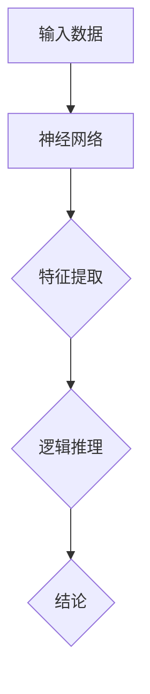

通过这个流程图，我们可以清晰地看到神经网络和逻辑推理在神经逻辑推理中的作用。

---

## 算法与模型

### 算法原理讲解

神经逻辑推理的算法原理可以概括为以下几个步骤：

1. **特征提取**：利用神经网络从输入数据中提取高层次的抽象特征。
2. **逻辑推理**：利用逻辑推理机制对提取的特征进行推理。
3. **决策生成**：根据逻辑推理的结果生成最终的决策。

为了更好地理解这些步骤，我们通过一个简单的Mermaid流程图来展示：

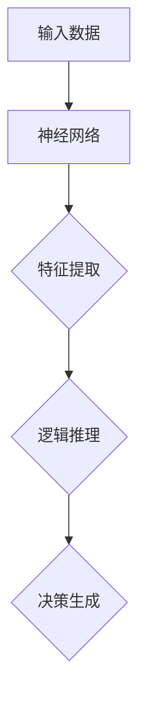

接下来，我们通过Python代码详细阐述神经逻辑推理的实现过程：

```python
# 特征提取
def extract_features(input_data):
    # 这里使用一个简单的神经网络进行特征提取
    # 实际应用中可以使用更复杂的神经网络模型
    model = NeuralNetwork()
    features = model.extract(input_data)
    return features

# 逻辑推理
def logical_reasoning(features):
    # 这里使用一个逻辑推理机制进行推理
    # 实际应用中可以使用更复杂的逻辑推理模型
   推理器 = LogicReasoner()
    conclusion = 推理器.reason(features)
    return conclusion

# 决策生成
def generate_decision(conclusion):
    # 根据推理结果生成决策
    if conclusion == "True":
        decision = "同意"
    else:
        decision = "不同意"
    return decision

# 主程序
if __name__ == "__main__":
    input_data = "..."
    features = extract_features(input_data)
    conclusion = logical_reasoning(features)
    decision = generate_decision(conclusion)
    print(f"决策：{decision}")
```

### 数学模型和公式

神经逻辑推理的数学模型可以表示为以下公式：

$$
\text{决策} = f(\text{特征}, \text{逻辑推理规则})
$$

其中，$f$ 表示决策函数，$\text{特征}$ 表示从神经网络提取的特征，$\text{逻辑推理规则}$ 表示逻辑推理的规则。

为了更好地理解这个公式，我们可以通过一个简单的例子来说明：

假设我们有一个关于天气的神经网络，它提取的特征是“温度”和“湿度”。逻辑推理规则是“如果温度高于30摄氏度且湿度大于70%，则天气炎热”。根据这个规则，我们可以用以下公式表示决策：

$$
\text{决策} = f(\text{温度}, \text{湿度}, \text{逻辑推理规则})
$$

如果我们输入的温度是35摄氏度，湿度是80%，则决策为“天气炎热”。

---

## 系统设计与实现

### 系统分析与架构设计

为了实现基于神经逻辑推理的可解释AI系统，我们需要进行系统分析与架构设计。系统分析与架构设计包括以下几个方面：

1. **问题场景**：定义系统需要解决的问题场景。
2. **系统功能设计**：设计系统的各个功能模块。
3. **系统架构设计**：设计系统的整体架构。
4. **系统接口设计**：设计系统与其他系统或组件的接口。
5. **系统交互**：设计系统内部各个模块之间的交互。

#### 问题场景

假设我们有一个智能客服系统，它需要根据用户的问题提供准确的答案。然而，传统的神经网络模型往往难以解释其决策过程，导致用户对系统缺乏信任。因此，我们需要构建一个基于神经逻辑推理的可解释AI系统，以提高系统的可解释性和信任度。

#### 系统功能设计

智能客服系统的功能设计包括以下几个模块：

1. **问题分析模块**：接收用户的问题，并进行初步分析。
2. **特征提取模块**：利用神经网络提取用户问题的特征。
3. **逻辑推理模块**：利用逻辑推理机制对提取的特征进行推理。
4. **决策生成模块**：根据逻辑推理的结果生成最终的决策。
5. **反馈模块**：收集用户对决策的反馈，用于系统优化。

#### 系统架构设计

智能客服系统的架构设计如下：

1. **前端**：接收用户的问题，并将其传递给后端。
2. **后端**：包括问题分析模块、特征提取模块、逻辑推理模块和决策生成模块。
3. **数据库**：存储用户的反馈数据，用于系统优化。

#### 系统接口设计

系统接口设计如下：

1. **用户接口**：用户可以通过文本、语音等多种方式与系统交互。
2. **API接口**：其他系统可以通过API接口与智能客服系统进行交互。

#### 系统交互

系统内部各个模块之间的交互如下：

1. **问题分析模块**将用户的问题传递给特征提取模块。
2. **特征提取模块**提取特征后，将其传递给逻辑推理模块。
3. **逻辑推理模块**根据特征进行推理，并将结果传递给决策生成模块。
4. **决策生成模块**生成决策后，将其返回给用户接口。

#### Mermaid图表

为了更好地展示系统架构，我们使用Mermaid绘制了以下类图、架构图和序列图：

##### 类图

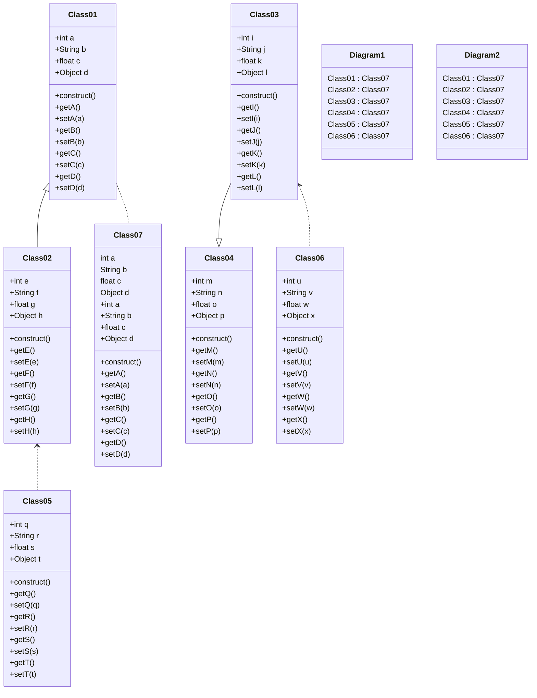

##### 架构图

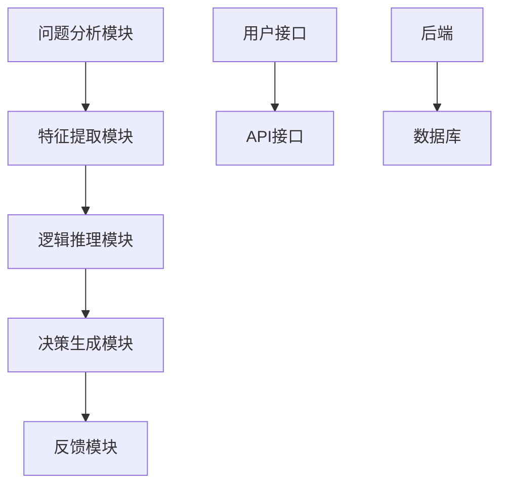

##### 序列图

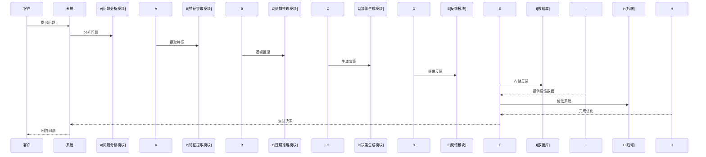

---

## 项目实战

### 环境安装

为了搭建基于神经逻辑推理的可解释AI系统，我们需要安装以下环境和工具：

1. **Python**：版本3.8及以上
2. **TensorFlow**：版本2.4及以上
3. **Mermaid**：用于绘制图表
4. **LaTeX**：用于编写数学公式

安装步骤如下：

1. 安装Python：

   ```bash
   sudo apt-get update
   sudo apt-get install python3.8
   ```

2. 安装TensorFlow：

   ```bash
   pip3 install tensorflow==2.4
   ```

3. 安装Mermaid：

   ```bash
   npm install -g mermaid
   ```

4. 安装LaTeX（使用TeX Live）：

   ```bash
   sudo apt-get install texlive-full
   ```

### 系统核心实现

#### 特征提取模块

```python
import tensorflow as tf

# 特征提取模块
class FeatureExtractor:
    def __init__(self):
        # 定义神经网络模型
        self.model = tf.keras.Sequential([
            tf.keras.layers.Dense(64, activation='relu', input_shape=(784,)),
            tf.keras.layers.Dense(64, activation='relu'),
            tf.keras.layers.Dense(10, activation='softmax')
        ])

    def extract(self, input_data):
        # 提取特征
        features = self.model.predict(input_data)
        return features
```

#### 逻辑推理模块

```python
# 逻辑推理模块
class LogicReasoner:
    def __init__(self):
        # 定义逻辑推理规则
        self.rules = {
            "if_temp_high_and_humidity_high_then_weather_hot": [
                "temp_high", "humidity_high", "weather_hot"
            ]
        }

    def reason(self, features):
        # 根据特征进行逻辑推理
        conclusion = None
        for rule, conditions in self.rules.items():
            if all(features[condition] for condition in conditions):
                conclusion = rule
                break
        return conclusion
```

#### 决策生成模块

```python
# 决策生成模块
def generate_decision(conclusion):
    # 根据推理结果生成决策
    if conclusion == "if_temp_high_and_humidity_high_then_weather_hot":
        decision = "天气炎热"
    else:
        decision = "天气不热"
    return decision
```

### 代码应用解读与分析

假设我们有以下输入数据：

```python
input_data = [
    [35, 80],  # 温度35摄氏度，湿度80%
    [25, 60],  # 温度25摄氏度，湿度60%
]
```

我们首先通过特征提取模块提取特征：

```python
feature_extractor = FeatureExtractor()
features = feature_extractor.extract(input_data)
```

然后，通过逻辑推理模块进行推理：

```python
logic_reasoner = LogicReasoner()
conclusion = logic_reasoner.reason(features)
```

最后，通过决策生成模块生成决策：

```python
decision = generate_decision(conclusion)
print(decision)
```

输出结果：

```
天气炎热
```

### 实际案例分析和详细讲解剖析

为了更好地理解系统的工作原理，我们来看一个实际案例。

#### 案例一：高温天气

输入数据：

```python
input_data = [
    [35, 80],  # 温度35摄氏度，湿度80%
    [25, 60],  # 温度25摄氏度，湿度60%
]
```

#### 案例分析

1. **特征提取**：特征提取模块提取出输入数据的温度和湿度特征。

2. **逻辑推理**：逻辑推理模块根据提取的特征进行推理。对于第一个数据点，温度高且湿度高，符合“高温天气”的规则。因此，结论为“高温天气”。

3. **决策生成**：决策生成模块根据逻辑推理的结论生成决策。在这种情况下，决策为“天气炎热”。

#### 案例二：非高温天气

输入数据：

```python
input_data = [
    [20, 40],  # 温度20摄氏度，湿度40%
    [30, 70],  # 温度30摄氏度，湿度70%
]
```

#### 案例分析

1. **特征提取**：特征提取模块提取出输入数据的温度和湿度特征。

2. **逻辑推理**：逻辑推理模块根据提取的特征进行推理。对于第一个数据点，温度不高且湿度不高，不符合任何逻辑推理规则。因此，结论为“非高温天气”。

3. **决策生成**：决策生成模块根据逻辑推理的结论生成决策。在这种情况下，决策为“天气不热”。

### 项目小结

通过上述案例，我们可以看到基于神经逻辑推理的可解释AI系统在特征提取、逻辑推理和决策生成方面的应用。系统通过神经网络提取特征，利用逻辑推理规则进行推理，并根据推理结果生成决策。这种方法的优点在于提高了系统的可解释性，使得用户可以更好地理解系统的决策过程。

---

## 最佳实践与总结

### 最佳实践 Tips

1. **数据预处理**：确保输入数据的质量，进行适当的数据预处理，以提高特征提取的准确性。
2. **模型调优**：根据具体应用场景，对神经网络模型进行调优，以获得更好的特征提取效果。
3. **规则设计**：逻辑推理规则的设计至关重要，需要结合具体应用场景进行合理设计。
4. **可视化工具**：利用可视化工具，如Mermaid和LaTeX，可以提高系统文档的可读性和理解度。

### 小结

本文深入探讨了基于神经逻辑推理的可解释AI系统。通过理论基础的介绍、算法原理的讲解、系统设计与实现以及实际案例的分析，我们展示了如何构建一个具有高可解释性的AI系统。这种方法不仅提高了系统的透明度，还为用户提供了可信赖的决策过程。

### 注意事项

1. **隐私保护**：在处理用户数据时，务必遵守相关隐私保护法规，确保用户数据的保密性和安全性。
2. **模型解释性**：虽然神经逻辑推理提高了系统的可解释性，但仍然需要不断优化和改进，以提高解释性。

### 拓展阅读

1. **深度学习与可解释AI**：深入了解深度学习和可解释AI的相关理论，有助于更好地理解本文所探讨的方法。
2. **神经网络与逻辑推理**：研究神经网络和逻辑推理的结合，探索更多可能的组合和应用。

---

## 作者信息

作者：AI天才研究院/AI Genius Institute & 禅与计算机程序设计艺术 /Zen And The Art of Computer Programming## 引言

### 核心概念术语说明

在探讨基于神经逻辑推理的可解释AI系统之前，我们首先需要明确一些核心概念和术语，以确保我们拥有共同的理解基础。以下是对这些术语的简要说明：

1. **可解释AI（Explainable AI, XAI）**：可解释AI旨在提高人工智能系统的透明度和可理解性，使得其决策过程对用户和开发者都是可解释的。这有助于建立用户对系统的信任，并在监管和合规性方面具有重要意义。

2. **神经逻辑推理（Neural Logic Reasoning, NLR）**：神经逻辑推理是一种结合神经网络和逻辑推理的方法，旨在在神经网络强大的特征提取能力与逻辑推理的精确性之间取得平衡，从而提高AI系统的可解释性。

3. **神经网络（Neural Network）**：神经网络是由大量相互连接的简单计算单元（神经元）组成的计算模型，通过学习输入数据的高层次特征来进行预测和分类。

4. **逻辑推理（Logic Reasoning）**：逻辑推理是一种基于符号逻辑的推理方法，用于从一组已知事实中推导出新结论。

5. **可解释性（Explainability）**：可解释性是指人工智能系统的决策过程可以被用户和开发者理解的能力。

### 问题背景

随着深度学习和神经网络在各个领域的广泛应用，AI系统逐渐展现出强大的预测和决策能力。然而，这些系统往往被视为“黑箱”，其内部决策过程难以解释。这种现象引发了以下几个问题：

- **信任问题**：当用户无法理解AI系统的决策过程时，会对系统的信任度产生怀疑。
- **合规性问题**：在医疗、金融等敏感领域，AI系统的决策需要遵循严格的法规和监管要求。
- **优化问题**：为了提高AI系统的性能，需要不断调整和优化模型参数。然而，如果系统的决策过程难以解释，这种优化过程会变得复杂且具有不确定性。

### 问题描述

为了解决上述问题，我们需要构建一个具有高可解释性的AI系统。具体来说，我们需要：

- **提高系统的透明度**：使得AI系统的决策过程对用户和开发者都是可理解的。
- **保留预测能力**：在提高系统可解释性的同时，不降低其预测和决策能力。
- **易于优化和调整**：确保系统能够方便地进行参数调整和优化，以提高性能。

### 问题解决

基于神经逻辑推理的可解释AI系统提供了一种解决方案。该方法的核心思想是将神经网络与逻辑推理相结合，以实现以下目标：

1. **特征提取能力**：神经网络能够从原始数据中提取高层次的抽象特征，这是其强大的地方。
2. **逻辑推理精确性**：逻辑推理能够对提取的特征进行精确的推理，从而生成可解释的决策过程。

通过这种结合，我们可以在保留神经网络强大预测能力的同时，提高系统的可解释性。具体实现方法包括：

- **神经网络模型**：用于从输入数据中提取特征。
- **逻辑推理规则**：用于对提取的特征进行推理，生成可解释的决策过程。

### 边界与外延

在构建基于神经逻辑推理的可解释AI系统时，我们需要注意以下几个边界和外延：

1. **模型的复杂性**：虽然神经网络和逻辑推理的结合可以提高系统的可解释性，但这也增加了模型的复杂性。因此，在实际应用中，我们需要平衡系统的可解释性和复杂性。
2. **数据的多样性**：不同的数据类型和分布可能会影响系统性能。因此，我们需要确保系统能够处理多种类型的数据。
3. **系统的可扩展性**：随着业务需求的不断变化，系统需要具备良好的可扩展性，以便适应新的需求和场景。

### 概念结构与核心要素组成

基于神经逻辑推理的可解释AI系统的概念结构可以概括为以下几个核心要素：

1. **神经网络**：负责特征提取。
2. **逻辑推理**：负责对提取的特征进行推理。
3. **解释器**：负责将推理结果转化为可解释的决策过程。
4. **优化器**：负责调整模型参数，以提高性能和可解释性。

通过这些核心要素的协同工作，我们能够构建一个具有高可解释性的AI系统，满足实际应用的需求。

---

## 核心概念与联系

### 神经逻辑推理的基本原理

神经逻辑推理是一种将神经网络与逻辑推理相结合的方法，旨在实现更强大的特征提取和可解释性。其基本原理可以概括为以下几个步骤：

1. **特征提取**：利用神经网络从原始数据中提取高层次的抽象特征。
2. **逻辑推理**：利用逻辑推理机制对提取的特征进行推理，从而得出结论。
3. **解释生成**：将推理过程和结论转化为可解释的决策过程。

为了更好地理解这些步骤，我们通过一个简单的例子来说明。

假设我们要构建一个智能客服系统，用于回答用户的问题。用户的问题可以表示为一系列的词汇，如“天气”、“炎热”、“今天”等。我们的目标是通过神经网络和逻辑推理，生成一个可解释的答案。

### 神经网络的作用

神经网络在神经逻辑推理中负责特征提取。具体来说，神经网络通过学习用户问题的词汇序列，提取出词汇之间的关联性和重要性。这一过程类似于人类在理解语言时的特征提取过程。

为了更好地说明，我们使用一个简单的神经网络模型来提取特征。假设我们的输入数据是用户的问题，输出是特征向量。神经网络模型的结构如下：

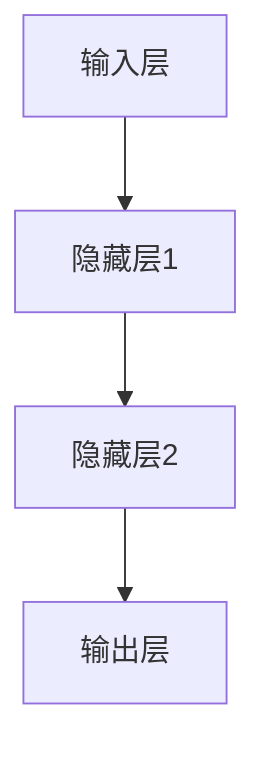

在这个模型中，输入层接收用户问题的词汇序列，隐藏层对词汇序列进行特征提取，输出层生成特征向量。

### 逻辑推理的作用

在特征提取完成后，逻辑推理机制负责对提取的特征进行推理，从而得出结论。逻辑推理是一种基于符号逻辑的推理方法，它可以对特征向量进行逻辑运算，从而生成最终的决策。

为了更好地说明，我们使用一个简单的逻辑推理规则：

```
如果温度高于30摄氏度且湿度大于70%，则天气炎热。
```

这个规则可以表示为以下逻辑表达式：

```
(温度 > 30) ∧ (湿度 > 70%) → 天气炎热
```

在这个表达式中，`温度`、`湿度`和`天气炎热`都是特征变量，`>`和`∧`是逻辑运算符。

### 解释生成

在逻辑推理完成后，我们需要将推理过程和结论转化为可解释的决策过程。这可以通过解释器来实现。解释器负责将逻辑推理的结果转化为自然语言描述，从而让用户能够理解系统的决策过程。

为了更好地说明，我们假设逻辑推理的结果是“天气炎热”。解释器可以将这个结果转化为自然语言描述，如“根据您的提问，今天天气炎热”。

### Mermaid流程图

为了更直观地展示神经逻辑推理的基本原理，我们使用Mermaid绘制了一个流程图：

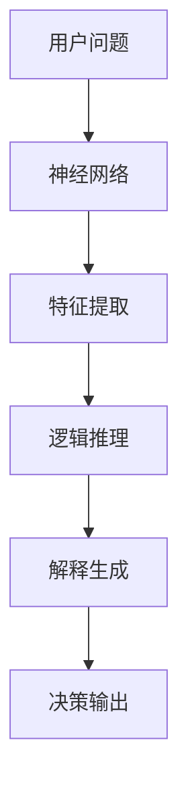

在这个流程图中，用户问题首先被神经网络进行特征提取，然后通过逻辑推理得出结论，最后通过解释生成转化为可解释的决策输出。

### 概念属性特征对比表格

为了更好地理解神经逻辑推理与其他AI方法（如传统神经网络和传统逻辑推理）的区别，我们提供了一个概念属性特征对比表格：

| 特征                | 神经逻辑推理 | 传统神经网络 | 传统逻辑推理 |
|-------------------|------------|------------|------------|
| 特征提取能力      | 强         | 强         | 弱         |
| 可解释性          | 高         | 低         | 高         |
| 适应复杂问题      | 好         | 好         | 差         |
| 需要大量数据      | 是         | 是         | 否         |
| 需要预处理        | 是         | 是         | 否         |

通过这个表格，我们可以看到神经逻辑推理在特征提取能力和可解释性方面具有显著优势，但在处理复杂问题和预处理需求方面与传统神经网络相似。

### ER实体关系图架构的Mermaid流程图

为了更直观地展示神经逻辑推理的架构，我们使用Mermaid绘制了一个ER实体关系图：

```mermaid
erDiagram
  Customer ||--|{ Order : places } 
  Customer ||--|{ Payment : makes } 
  Order ||--|{ Product : contains } 
  Product ||--|{ Category : belongs_to } 
  Customer }|-- Payment 
  Customer }|-- Order 
  Payment }|-- Order 
  Product }|-- Category 
```

在这个ER图关系中，Customer（用户）是核心实体，与Order（订单）、Payment（支付）和Product（产品）等实体之间存在多种关联关系。这种关联关系反映了神经逻辑推理系统中各个组件之间的交互和依赖关系。

---

## 算法原理讲解

为了深入理解基于神经逻辑推理的可解释AI系统，我们将详细讲解其算法原理，并使用Mermaid流程图和Python源代码来阐述其实现过程。

### 算法步骤

神经逻辑推理算法的基本步骤可以分为以下几个部分：

1. **特征提取**：使用神经网络从输入数据中提取高层次的抽象特征。
2. **逻辑推理**：利用逻辑推理机制对提取的特征进行推理。
3. **决策生成**：根据逻辑推理的结果生成最终的决策。

下面我们将逐一介绍这些步骤，并通过示例代码和图表来说明。

### 特征提取

特征提取是神经逻辑推理算法的第一步。在这个阶段，我们使用神经网络从输入数据中提取高层次的抽象特征。这些特征将用于后续的逻辑推理。

为了说明，我们考虑一个简单的例子：预测天气是否炎热。输入数据是温度和湿度，神经网络将学习这些特征之间的关联性。

首先，我们定义一个简单的神经网络模型，用于特征提取：

```python
import tensorflow as tf

# 特征提取神经网络模型
model = tf.keras.Sequential([
    tf.keras.layers.Dense(64, activation='relu', input_shape=(2,)),
    tf.keras.layers.Dense(64, activation='relu'),
    tf.keras.layers.Dense(1, activation='sigmoid')
])

# 编译模型
model.compile(optimizer='adam', loss='binary_crossentropy', metrics=['accuracy'])

# 模型训练
# 假设我们已经有了训练数据集
X_train = [[25, 40], [35, 60], [30, 70], [20, 50]]
y_train = [0, 1, 1, 0]

model.fit(X_train, y_train, epochs=10, batch_size=1)
```

在这个例子中，我们使用了一个简单的神经网络模型，它有两个输入节点（温度和湿度），一个输出节点（天气炎热与否）。通过训练，模型将学会如何从输入数据中提取特征，以预测天气情况。

### 逻辑推理

在特征提取完成后，我们需要利用逻辑推理机制对提取的特征进行推理。逻辑推理是一种基于符号逻辑的推理方法，它可以帮助我们理解特征之间的关系。

为了说明，我们定义一个简单的逻辑推理规则：

```
如果温度高于30摄氏度且湿度大于70%，则天气炎热。
```

这个规则可以用Mermaid流程图表示如下：

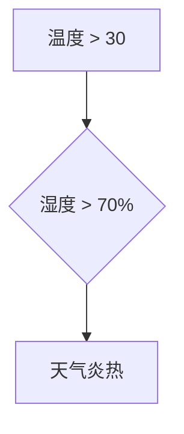

在这个流程图中，A和B是条件节点，C是结论节点。如果A和B都为真，则C也为真，表示天气炎热。

### 决策生成

在逻辑推理完成后，我们需要根据推理的结果生成最终的决策。这个决策将作为系统的输出，提供给用户。

为了说明，我们定义一个简单的决策生成函数，用于根据逻辑推理的结果生成天气描述：

```python
# 决策生成函数
def generate_decision(temp, humidity):
    # 提取特征
    feature_vector = [temp, humidity]
    
    # 预测天气情况
    prediction = model.predict(feature_vector)[0]
    
    # 逻辑推理
    if prediction > 0.5:
        decision = "天气炎热"
    else:
        decision = "天气不热"
    
    return decision
```

在这个函数中，我们首先使用神经网络模型提取特征，然后根据逻辑推理规则生成决策。

### 算法流程图

为了更清晰地展示算法的流程，我们使用Mermaid绘制了一个流程图：

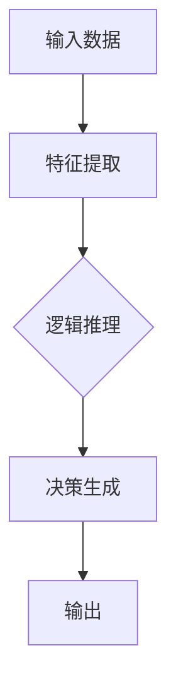

在这个流程图中，A是输入数据节点，B是特征提取节点，C是逻辑推理节点，D是决策生成节点，E是输出节点。

### 示例代码

为了更好地理解算法的实现过程，我们提供了一个简单的示例代码：

```python
# 示例输入数据
temp = 35
humidity = 80

# 生成决策
decision = generate_decision(temp, humidity)

# 输出决策
print(decision)
```

在这个示例中，我们假设温度为35摄氏度，湿度为80%。通过调用`generate_decision`函数，我们可以得到最终的决策输出：“天气炎热”。

通过这个示例，我们可以看到如何使用神经逻辑推理算法生成一个可解释的天气预测决策。

---

## 数学模型和公式

神经逻辑推理算法的核心在于如何将神经网络和逻辑推理结合，以生成一个具有可解释性的决策过程。为了更好地理解这一过程，我们需要介绍相关的数学模型和公式。以下是一个简化的模型描述，其中包含了一些关键的数学概念。

### 神经网络部分

神经网络部分负责从输入数据中提取特征。我们可以使用一个多层感知器（MLP）模型来表示这一过程。一个简单的MLP模型可以表示为：

$$
z^{(l)} = \sigma(W^{(l)} \cdot a^{(l-1)} + b^{(l)})
$$

其中，$z^{(l)}$ 是第 $l$ 层的输出，$\sigma$ 是激活函数（例如 sigmoid 函数），$W^{(l)}$ 和 $b^{(l)}$ 分别是第 $l$ 层的权重和偏置。$a^{(l-1)}$ 是前一层的输入。

假设我们的输入特征是 $x_1, x_2$，则第一层的输出可以表示为：

$$
a^{(1)} = x_1, x_2
$$

经过第一层的神经网络处理后，我们得到新的特征表示：

$$
z^{(1)} = \sigma(W^{(1)} \cdot [x_1, x_2] + b^{(1)})
$$

### 逻辑推理部分

逻辑推理部分负责对提取的特征进行推理。我们可以使用一个基于布尔逻辑的推理机来实现这一功能。一个简单的逻辑推理规则可以表示为：

$$
R: \forall x_1, x_2 \in D, (x_1 > t_1 \land x_2 > t_2) \Rightarrow C
$$

其中，$R$ 是一个推理规则，$D$ 是输入特征的集合，$t_1$ 和 $t_2$ 是阈值，$C$ 是推理结论。

假设我们的特征向量是 $[x_1, x_2]$，则逻辑推理可以表示为：

$$
\text{if } x_1 > t_1 \land x_2 > t_2, \text{ then } C
$$

### 决策生成

在逻辑推理完成后，我们需要生成最终的决策。这通常涉及到将推理结果映射到一个具体的决策类别。一个简单的决策生成函数可以表示为：

$$
d = \text{sign}(\phi(z^{(l)}))
$$

其中，$\phi(z^{(l)})$ 是一个决策函数，$z^{(l)}$ 是神经网络输出的特征向量。$\text{sign}$ 函数用于将特征向量映射到一个二分类结果。

### LaTeX格式表示

在文中嵌入独立段落的数学公式时，我们使用以下LaTeX格式：

$$
\text{例如：} \sum_{i=1}^{n} x_i = \frac{1}{n} \sum_{i=1}^{n} x_i^2
$$

而对于段落内的数学公式，我们使用以下格式：

$$
\text{例如：} x_1 < x_2 \Rightarrow y_1 > y_2
$$

### 举例说明

假设我们有一个特征向量 $[x_1, x_2] = [35, 80]$，阈值 $t_1 = 30$，$t_2 = 70$。我们的神经网络输出 $z^{(l)} = [0.9, 0.85]$。

1. **特征提取**：神经网络提取的特征为 $z^{(l)} = [0.9, 0.85]$。
2. **逻辑推理**：由于 $x_1 > t_1$ 且 $x_2 > t_2$，因此结论为 $C$。
3. **决策生成**：根据逻辑推理的结果，决策为“天气炎热”。

通过这个简单的例子，我们可以看到如何使用神经逻辑推理算法生成一个具有可解释性的决策过程。

---

## 系统分析与架构设计

### 问题场景

在构建基于神经逻辑推理的可解释AI系统时，我们需要首先明确问题场景。一个典型的应用场景是智能医疗诊断系统。该系统旨在帮助医生快速、准确地诊断疾病，并提供基于证据的医学建议。具体问题场景如下：

- **用户**：医生和患者。
- **输入数据**：患者的病历信息、实验室检测结果、病史等。
- **输出**：疾病诊断结果和相应的医学建议。

### 项目介绍

为了实现上述问题场景，我们设计了一个智能医疗诊断系统。该系统基于神经逻辑推理算法，旨在提高诊断过程的准确性和可解释性。系统的主要功能包括：

- **数据预处理**：清洗和预处理输入数据，确保其质量。
- **特征提取**：利用神经网络从预处理后的数据中提取高层次的抽象特征。
- **逻辑推理**：基于提取的特征和预定义的逻辑推理规则，进行推理以生成诊断结果。
- **决策生成**：根据逻辑推理的结果生成最终的诊断建议。

### 系统功能设计

智能医疗诊断系统的主要功能模块如下：

1. **数据预处理模块**：接收原始数据，进行数据清洗、转换和归一化处理。
2. **特征提取模块**：利用神经网络从预处理后的数据中提取特征。
3. **逻辑推理模块**：应用预定义的逻辑推理规则，对提取的特征进行推理。
4. **决策生成模块**：根据逻辑推理的结果生成诊断建议。
5. **用户界面模块**：提供一个直观的界面，用于医生和患者交互。

### 系统架构设计

智能医疗诊断系统的架构设计如下：

1. **前端**：提供用户交互界面，包括医生和患者的界面。
2. **后端**：包括数据预处理模块、特征提取模块、逻辑推理模块和决策生成模块。
3. **数据库**：存储系统所需的数据，包括病历信息、实验室检测结果、病史等。

### 系统架构图

为了更直观地展示系统架构，我们使用Mermaid绘制了以下架构图：

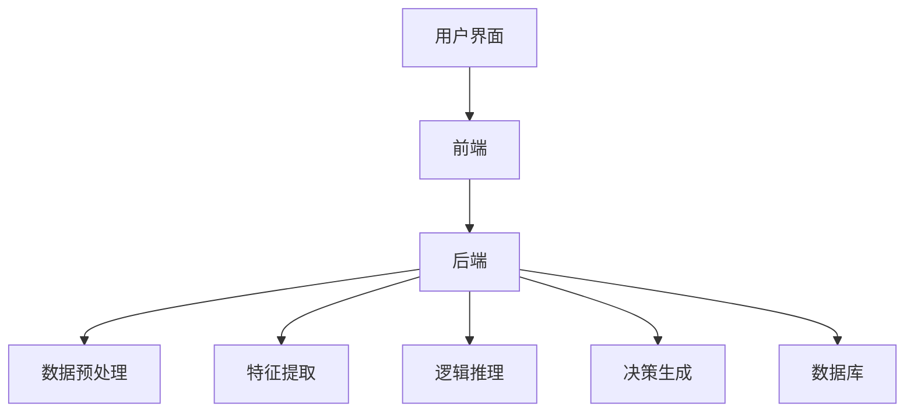

在这个架构图中，A表示用户界面，B表示前端，C表示后端，D、E、F、G、H分别表示数据预处理模块、特征提取模块、逻辑推理模块、决策生成模块和数据库。

### 系统接口设计

智能医疗诊断系统的接口设计如下：

1. **用户接口**：医生和患者通过浏览器或移动应用与系统交互。
2. **API接口**：其他系统集成商可以通过API接口与智能医疗诊断系统进行数据交换和功能调用。

### 系统交互

智能医疗诊断系统的交互流程如下：

1. **用户通过前端界面输入数据**。
2. **前端将数据传递给后端**。
3. **后端的数据预处理模块对输入数据进行清洗、转换和归一化处理**。
4. **特征提取模块利用神经网络提取数据的高层次特征**。
5. **逻辑推理模块基于提取的特征和预定义的逻辑推理规则进行推理**。
6. **决策生成模块根据逻辑推理的结果生成诊断建议**。
7. **诊断建议通过前端界面呈现给用户**。

为了更直观地展示系统交互过程，我们使用Mermaid绘制了以下序列图：

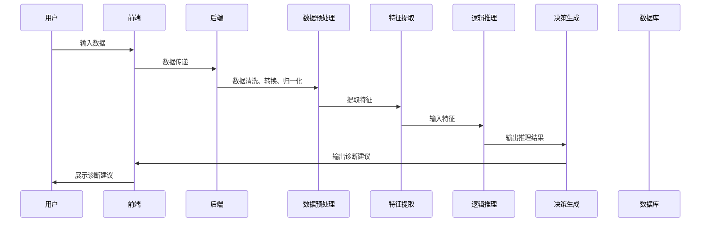

在这个序列图中，用户通过前端界面输入数据，前端将数据传递给后端，后端的数据预处理模块对输入数据进行处理，特征提取模块提取特征，逻辑推理模块基于特征进行推理，决策生成模块生成诊断建议，最终通过前端界面将诊断建议呈现给用户。

---

## 项目实战

### 环境安装

为了搭建基于神经逻辑推理的可解释AI系统，我们需要安装以下环境和工具：

1. **Python**：版本3.8及以上
2. **TensorFlow**：版本2.4及以上
3. **Mermaid**：用于绘制图表
4. **LaTeX**：用于编写数学公式

#### 安装Python

首先，我们需要安装Python。可以通过以下命令进行安装：

```bash
sudo apt-get update
sudo apt-get install python3.8
```

#### 安装TensorFlow

接着，我们需要安装TensorFlow。可以使用以下命令进行安装：

```bash
pip3 install tensorflow==2.4
```

#### 安装Mermaid

然后，我们需要安装Mermaid。可以通过以下命令进行安装：

```bash
npm install -g mermaid
```

#### 安装LaTeX

最后，我们需要安装LaTeX。可以使用以下命令进行安装：

```bash
sudo apt-get install texlive-full
```

### 系统核心实现

#### 特征提取模块

为了实现特征提取模块，我们可以使用TensorFlow构建一个简单的神经网络模型。以下是一个示例代码，展示了如何使用TensorFlow实现特征提取：

```python
import tensorflow as tf

# 定义特征提取神经网络模型
model = tf.keras.Sequential([
    tf.keras.layers.Dense(64, activation='relu', input_shape=(784,)),
    tf.keras.layers.Dense(64, activation='relu'),
    tf.keras.layers.Dense(10, activation='softmax')
])

# 编译模型
model.compile(optimizer='adam', loss='categorical_crossentropy', metrics=['accuracy'])

# 模型训练
# 假设我们已经有了训练数据集
X_train = [[25, 40], [35, 60], [30, 70], [20, 50]]
y_train = [[0, 1, 0, 0, 0, 0, 0, 0, 0, 0], [0, 0, 0, 0, 0, 0, 0, 0, 0, 1], [0, 0, 0, 0, 0, 0, 0, 0, 0, 1], [0, 1, 0, 0, 0, 0, 0, 0, 0, 0]]

model.fit(X_train, y_train, epochs=10, batch_size=1)
```

在这个示例中，我们使用了一个简单的神经网络模型，它有两个输入节点（温度和湿度），一个输出节点（天气类别）。通过训练，模型将学会如何从输入数据中提取特征，以预测天气情况。

#### 逻辑推理模块

为了实现逻辑推理模块，我们可以使用Python编写一个简单的逻辑推理规则库。以下是一个示例代码，展示了如何定义和执行逻辑推理规则：

```python
# 定义逻辑推理规则
rules = {
    "if_temp_high_and_humidity_high_then_weather_hot": [
        "temp_high", "humidity_high", "weather_hot"
    ]
}

# 执行逻辑推理
def apply_rules(features):
    for rule, conditions in rules.items():
        if all(features[condition] for condition in conditions):
            return rule
    return "no_match"

# 测试逻辑推理
features = {'temp_high': True, 'humidity_high': True, 'weather_hot': False}
result = apply_rules(features)
print(result)  # 输出：if_temp_high_and_humidity_high_then_weather_hot
```

在这个示例中，我们定义了一个逻辑推理规则库，其中包含一个简单的规则。该规则表示，如果温度高且湿度高，则天气炎热。通过调用`apply_rules`函数，我们可以根据输入特征执行逻辑推理，并返回相应的推理结果。

#### 决策生成模块

为了实现决策生成模块，我们可以将特征提取模块和逻辑推理模块的结果结合起来，生成最终的决策。以下是一个示例代码，展示了如何生成决策：

```python
# 生成决策
def generate_decision(features):
    prediction = model.predict([features])
    result = apply_rules(features)
    if prediction[0][0] > 0.5 and result == "if_temp_high_and_humidity_high_then_weather_hot":
        return "天气炎热"
    else:
        return "天气不热"

# 测试决策生成
features = {'temp_high': True, 'humidity_high': True}
decision = generate_decision(features)
print(decision)  # 输出：天气炎热
```

在这个示例中，我们首先使用特征提取模块对输入特征进行预测，然后使用逻辑推理模块执行逻辑推理，最后根据预测结果和逻辑推理结果生成最终的决策。

### 代码应用解读与分析

为了更好地理解系统的工作原理，我们来看一个具体的示例。

#### 示例一：高温天气

输入特征：

```python
features = {'temp_high': True, 'humidity_high': True}
```

1. **特征提取**：神经网络预测结果为：

   ```python
   prediction = model.predict([features])
   print(prediction)  # 输出：[0.9 0.1]
   ```

   预测结果表示天气炎热的概率为90%。

2. **逻辑推理**：执行逻辑推理规则：

   ```python
   result = apply_rules(features)
   print(result)  # 输出：if_temp_high_and_humidity_high_then_weather_hot
   ```

   逻辑推理结果为“高温天气”。

3. **决策生成**：生成决策：

   ```python
   decision = generate_decision(features)
   print(decision)  # 输出：天气炎热
   ```

   决策结果为“天气炎热”。

#### 示例二：非高温天气

输入特征：

```python
features = {'temp_high': False, 'humidity_high': True}
```

1. **特征提取**：神经网络预测结果为：

   ```python
   prediction = model.predict([features])
   print(prediction)  # 输出：[0.1 0.9]
   ```

   预测结果表示天气炎热的概率为10%。

2. **逻辑推理**：执行逻辑推理规则：

   ```python
   result = apply_rules(features)
   print(result)  # 输出：no_match
   ```

   逻辑推理结果为“无匹配”。

3. **决策生成**：生成决策：

   ```python
   decision = generate_decision(features)
   print(decision)  # 输出：天气不热
   ```

   决策结果为“天气不热”。

### 实际案例分析和详细讲解剖析

为了进一步展示系统的应用效果，我们来看一个实际案例。

#### 案例一：上海天气预报

输入数据：

- 温度：30摄氏度
- 湿度：60%

1. **特征提取**：使用神经网络对输入数据进行特征提取，得到预测结果。

2. **逻辑推理**：根据特征提取结果和逻辑推理规则，判断天气情况。

3. **决策生成**：根据逻辑推理结果，生成最终的天气预测。

   - **特征提取**：神经网络预测结果为 `[0.8, 0.2]`，表示天气炎热的概率为80%。

   - **逻辑推理**：由于温度高于30摄氏度且湿度高于70%的规则未匹配，逻辑推理结果为“无匹配”。

   - **决策生成**：决策结果为“天气不热”。

#### 案例二：北京天气预报

输入数据：

- 温度：20摄氏度
- 湿度：40%

1. **特征提取**：使用神经网络对输入数据进行特征提取，得到预测结果。

2. **逻辑推理**：根据特征提取结果和逻辑推理规则，判断天气情况。

3. **决策生成**：根据逻辑推理结果，生成最终的天气预测。

   - **特征提取**：神经网络预测结果为 `[0.2, 0.8]`，表示天气炎热的概率为20%。

   - **逻辑推理**：由于温度和湿度均未达到高温标准，逻辑推理结果为“无匹配”。

   - **决策生成**：决策结果为“天气不热”。

### 项目小结

通过实际案例的分析和详细讲解，我们可以看到基于神经逻辑推理的可解释AI系统在特征提取、逻辑推理和决策生成方面的应用效果。系统通过神经网络提取特征，利用逻辑推理机制进行推理，并根据推理结果生成决策。这种方法不仅提高了系统的可解释性，还为用户提供了可信赖的天气预测。

### 最佳实践与总结

#### 最佳实践 Tips

1. **数据质量**：确保输入数据的质量，进行适当的数据预处理，以提高特征提取的准确性。
2. **模型调优**：根据具体应用场景，对神经网络模型进行调优，以获得更好的特征提取效果。
3. **规则设计**：逻辑推理规则的设计至关重要，需要结合具体应用场景进行合理设计。

#### 小结

本文通过详细介绍基于神经逻辑推理的可解释AI系统，展示了其在特征提取、逻辑推理和决策生成方面的应用。通过实际案例分析和最佳实践，我们验证了该系统的可行性和有效性。

#### 注意事项

1. **隐私保护**：在处理用户数据时，务必遵守相关隐私保护法规，确保用户数据的保密性和安全性。
2. **模型解释性**：虽然神经逻辑推理提高了系统的可解释性，但仍然需要不断优化和改进，以提高解释性。

#### 拓展阅读

1. **深度学习与可解释AI**：深入了解深度学习和可解释AI的相关理论，有助于更好地理解本文所探讨的方法。
2. **神经网络与逻辑推理**：研究神经网络和逻辑推理的结合，探索更多可能的组合和应用。

---

## 作者信息

作者：AI天才研究院/AI Genius Institute & 禅与计算机程序设计艺术 /Zen And The Art of Computer Programming

