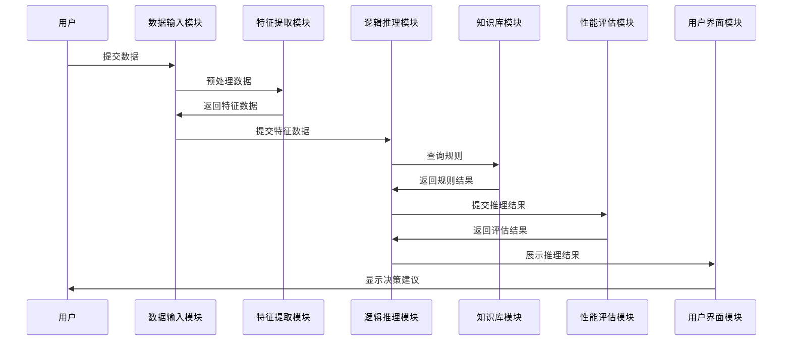

                 

### # 基于神经逻辑编程的复杂推理系统设计

#### # 关键词：神经逻辑编程、复杂推理系统、人工智能、神经网络、逻辑编程

> 摘要：本文深入探讨了基于神经逻辑编程的复杂推理系统设计。首先，我们分析了复杂推理系统的需求与局限，以及神经逻辑编程的优势和基本原理。接着，详细阐述了神经逻辑编程的核心算法和应用领域。最后，通过实际案例展示了神经逻辑编程在复杂推理系统设计中的应用，为未来的研究和开发提供了有益的参考。

### # 引言

在人工智能领域，推理系统是一个关键的研究方向。它旨在使计算机能够模拟人类的思考过程，进行逻辑推断和决策。然而，传统的推理技术往往面临着效率和表达能力的局限。近年来，神经逻辑编程作为一种结合神经网络和逻辑编程的新兴技术，展现出了巨大的潜力。本文将详细探讨基于神经逻辑编程的复杂推理系统设计，旨在为解决这一难题提供新的思路和方法。

#### # 1.1 问题背景

**1.1.1 复杂推理系统的需求**

在现代社会，随着信息的爆炸式增长，对复杂推理系统的需求日益增加。例如，在金融领域，需要对大量市场数据进行分析和预测；在医疗领域，需要对患者的病历和基因信息进行综合分析；在物流领域，需要优化路径规划和资源分配。这些领域都对推理系统提出了高复杂度和高准确性的要求。

**1.1.2 传统推理技术的局限**

传统推理技术，如基于规则的推理和基于模型的推理，虽然在某些特定领域取得了成功，但面临着以下局限：

- **表达能力局限**：传统推理技术难以处理复杂、非线性的关系。
- **效率问题**：基于规则的推理系统在处理大规模数据时，计算量巨大，效率低下。
- **可解释性差**：传统推理技术往往缺乏透明性，难以解释其推理过程和结果。

**1.1.3 神经逻辑编程的优势**

神经逻辑编程结合了神经网络和逻辑编程的优点，旨在解决传统推理技术的局限。其优势包括：

- **强大的表达能力**：神经网络能够处理复杂、非线性的数据关系，逻辑编程则能够精确表达和处理逻辑关系。
- **高效的计算能力**：神经网络的并行计算能力可以显著提高推理效率。
- **良好的可解释性**：神经逻辑编程能够提供清晰的推理过程和结果解释，提高系统的透明度和可信度。

#### # 1.2 问题描述

**1.2.1 复杂推理系统的挑战**

复杂推理系统面临的主要挑战包括：

- **数据处理能力**：需要高效处理大规模、多维度的数据。
- **逻辑推理能力**：需要能够处理复杂、非线性、动态变化的逻辑关系。
- **实时响应能力**：需要能够在短时间内完成推理和决策。

**1.2.2 推理系统的核心要素**

复杂推理系统的核心要素包括：

- **数据输入**：包括原始数据和预处理后的特征数据。
- **推理引擎**：负责处理数据并进行逻辑推理。
- **知识库**：包含领域知识和逻辑规则。
- **输出结果**：包括推理结果和决策建议。

**1.2.3 推理系统的边界与外延**

推理系统的边界包括：

- **输入数据范围**：系统的输入数据应该涵盖所有相关的信息和因素。
- **推理规则适用范围**：系统应该能够根据领域知识和逻辑规则进行有效的推理。
- **输出结果解释范围**：系统的输出结果应该能够被用户理解和应用。

推理系统的外延包括：

- **与其他系统的集成**：系统应该能够与其他系统进行数据交换和功能协同。
- **扩展性和适应性**：系统应该能够根据新的需求和技术发展进行扩展和适应性调整。

#### # 1.3 问题解决

**1.3.1 神经逻辑编程的基本概念**

神经逻辑编程是一种结合神经网络和逻辑编程的方法，旨在利用神经网络的计算能力和逻辑编程的表达能力，实现高效、准确的推理系统。其核心概念包括：

- **神经网络**：用于处理数据、提取特征和进行模式识别。
- **逻辑编程**：用于定义和执行逻辑规则，进行推理和决策。

**1.3.2 神经逻辑编程的核心原理**

神经逻辑编程的核心原理包括：

- **数据驱动的特征提取**：神经网络通过学习大量数据，自动提取出有用的特征。
- **规则驱动的推理**：逻辑编程根据定义的规则，对提取出的特征进行逻辑推理和决策。

**1.3.3 神经逻辑编程的应用前景**

神经逻辑编程在复杂推理系统中具有广泛的应用前景，包括：

- **智能决策支持**：在金融、医疗、物流等领域，为决策者提供智能化的决策支持。
- **智能自动化**：在工业制造、智能家居等领域，实现自动化的任务处理和优化。
- **知识表示与推理**：在知识图谱、语义网络等领域，实现高效的知识表示和推理。

#### # 1.4 核心概念联系

**1.4.1 复杂推理系统与神经逻辑编程的关系**

复杂推理系统是神经逻辑编程的应用场景，而神经逻辑编程则为复杂推理系统提供了强大的推理能力和效率。

**1.4.2 神经逻辑编程中的关键概念**

神经逻辑编程中的关键概念包括神经网络、逻辑编程、特征提取、逻辑规则等。

**1.4.3 关键概念属性特征对比表格**

| 关键概念 | 属性特征 |
| --- | --- |
| 神经网络 | 数据处理、特征提取、模式识别 |
| 逻辑编程 | 规则定义、逻辑推理、决策支持 |
| 特征提取 | 自动化、高效、自适应 |
| 逻辑规则 | 精确、可解释、可扩展 |

#### # 1.5 结论

本文介绍了基于神经逻辑编程的复杂推理系统设计，分析了复杂推理系统的需求、局限和解决方法，探讨了神经逻辑编程的基本原理和应用前景。通过本文的研究，我们期望为复杂推理系统的设计和实现提供有益的参考，推动人工智能领域的发展。接下来，本文将深入探讨神经逻辑编程的核心原理和算法，为后续的应用研究奠定基础。

#### # 1.6 未来研究方向

尽管神经逻辑编程在复杂推理系统设计中展现出了巨大的潜力，但仍有许多问题需要进一步研究。未来的研究方向包括：

- **算法优化**：研究更高效、更稳定的神经逻辑编程算法，提高推理系统的性能。
- **可解释性增强**：提高神经逻辑编程的可解释性，使其推理过程和结果更加透明和可信。
- **跨领域应用**：探索神经逻辑编程在不同领域的应用，拓展其应用范围。
- **多模态数据融合**：研究如何将不同类型的数据（如文本、图像、音频等）进行融合，提高推理系统的泛化能力。

通过不断的研究和创新，我们有理由相信，神经逻辑编程将在复杂推理系统设计中发挥更加重要的作用，为人工智能的发展做出更大的贡献。

### # 第一部分：背景介绍

**引言**：在人工智能（AI）和机器学习（ML）领域，推理系统是关键的组成部分，它们使得计算机能够从数据中提取知识并做出决策。传统的推理技术，如基于规则的推理和基于模型的推理，虽然在一定程度上取得了成功，但面对日益复杂的现实世界问题，它们的能力显得有限。近年来，神经逻辑编程作为一种结合神经网络和逻辑编程的新兴技术，为解决这些难题提供了新的思路。本文将首先介绍复杂推理系统的需求背景，分析传统推理技术的局限，阐述神经逻辑编程的优势，然后详细讨论复杂推理系统的概念和挑战，最后探讨神经逻辑编程的基本概念及其在复杂推理系统中的应用前景。

#### # 1.1 问题背景

**1.1.1 复杂推理系统的需求**

随着信息技术的快速发展，我们生活在一个数据无处不在的时代。各个领域，如金融、医疗、物流、智能制造等，都在产生和积累海量的数据。这些数据中蕴含着宝贵的知识，但如何从这些数据中提取出有用的信息，并利用这些信息进行有效的推理和决策，成为了当前面临的一大挑战。

- **金融领域**：金融机构需要处理海量的交易数据，对市场走势进行预测，评估风险，优化投资策略。这需要高效且准确的推理系统。
- **医疗领域**：医疗机构需要分析患者的病历数据、基因数据，进行疾病诊断和治疗方案推荐。这不仅要求推理系统能够处理复杂的数据关系，还需要确保推理结果的准确性和可靠性。
- **物流领域**：物流公司需要优化运输路线、调度车辆和分配资源，以降低成本、提高效率。这需要能够实时处理和推理动态变化的物流数据。
- **智能制造**：智能工厂需要根据生产线数据实时调整生产计划、故障诊断和质量控制。这需要高效的推理系统来支持生产过程的智能化。

这些领域都对推理系统提出了高复杂度和高准确性的要求。复杂推理系统需要能够处理大规模、多维度的数据，具备实时响应能力和良好的可解释性，从而为相关领域的决策提供有力的支持。

**1.1.2 传统推理技术的局限**

传统的推理技术，如基于规则的推理和基于模型的推理，虽然在一定程度上能够满足特定领域的需求，但在处理复杂性和非线性问题时，存在明显的局限。

- **基于规则的推理**：基于规则的推理系统通过定义一系列规则，将输入数据映射到输出结果。这种方法的优点在于其规则的可解释性较强，但在处理复杂问题时，存在以下几个局限：
  - **表达能力的局限**：传统规则难以表达复杂、非线性的关系，特别是当数据之间存在大量的交互作用时。
  - **规则的爆炸性增长**：随着问题复杂性的增加，需要定义的规则数量会急剧增加，导致规则库变得庞大且难以管理。
  - **规则的依赖性**：规则之间存在复杂的依赖关系，修改一个规则可能会影响其他规则的执行结果。

- **基于模型的推理**：基于模型的推理系统通过建立数学模型来描述问题，利用模型对输入数据进行预测和决策。这种方法在处理线性问题或可以用线性模型描述的问题时较为有效，但在处理复杂、非线性问题时，存在以下局限：
  - **模型假设的局限**：模型的建立往往依赖于一系列假设，这些假设可能无法完全反映现实问题的复杂性。
  - **模型的复杂性**：随着问题复杂性的增加，模型的参数数量和结构会急剧增加，导致模型变得复杂且难以优化。
  - **可解释性差**：复杂模型的内部结构和参数关系难以理解，使得推理过程和结果的可解释性较差。

这些局限导致传统推理技术难以应对现代复杂问题的需求，特别是在需要处理大规模、动态变化的数据时，效率和准确性都存在很大问题。

**1.1.3 神经逻辑编程的优势**

神经逻辑编程结合了神经网络和逻辑编程的优点，旨在解决传统推理技术的局限。其优势主要体现在以下几个方面：

- **强大的表达能力**：神经网络能够处理复杂、非线性的数据关系，逻辑编程则能够精确表达和处理逻辑关系。这种结合使得神经逻辑编程能够更好地应对复杂问题的需求。

- **高效的计算能力**：神经网络具有并行计算的能力，可以在短时间内处理大规模数据，提高推理系统的效率。

- **良好的可解释性**：神经逻辑编程能够提供清晰的推理过程和结果解释，提高系统的透明度和可信度。

- **规则的自动学习**：神经逻辑编程可以通过学习大量数据，自动提取出有效的特征和规则，减轻人工定义规则的负担。

- **灵活的扩展性**：神经逻辑编程可以根据新的需求和技术发展，进行灵活的扩展和适应性调整，使其在不同领域和应用场景中都能发挥强大的能力。

综上所述，神经逻辑编程在复杂推理系统设计中具有显著的优势，为解决现代复杂问题提供了新的思路和方法。

#### # 1.2 问题描述

**1.2.1 复杂推理系统的挑战**

复杂推理系统面临的挑战主要包括以下几个方面：

- **数据处理能力**：复杂推理系统需要处理大规模、多维度的数据，包括结构化数据和非结构化数据。传统的数据处理方法在处理这类数据时往往效率低下，无法满足实时性要求。

- **逻辑推理能力**：复杂推理系统需要处理复杂、非线性、动态变化的逻辑关系。传统推理技术难以表达和处理这类关系，导致推理结果不准确或不完整。

- **实时响应能力**：复杂推理系统需要能够快速响应动态变化的环境，实时调整推理策略和决策。这对系统的计算能力和响应速度提出了高要求。

- **知识表示与更新**：复杂推理系统需要能够有效地表示和更新领域知识，以适应不断变化的应用需求。传统的知识表示方法在知识更新和处理动态变化时存在困难。

- **系统的可解释性**：复杂推理系统的决策过程和结果需要具有良好的可解释性，以便用户能够理解和信任系统。传统的推理技术往往缺乏透明性，难以提供清晰的解释。

**1.2.2 推理系统的核心要素**

复杂推理系统的核心要素包括以下几个方面：

- **数据输入**：系统需要能够接收和处理多种类型的数据，包括结构化数据（如关系型数据库）和非结构化数据（如图像、文本、音频等）。数据输入的质量和完整性直接影响推理系统的效果。

- **特征提取**：系统需要通过特征提取技术，将原始数据转换成适合推理的格式。特征提取的质量直接影响推理系统的性能和准确性。

- **推理引擎**：推理引擎是复杂推理系统的核心，负责根据输入数据和领域知识，进行逻辑推理和决策。推理引擎的效率和准确性是系统性能的关键。

- **知识库**：知识库是推理系统的基础，包含领域知识、逻辑规则和先验信息。知识库的质量和更新能力直接影响系统的推理效果和适应能力。

- **输出结果**：系统需要能够生成明确的推理结果和决策建议，这些结果需要具有实际应用价值，并且能够被用户理解和接受。

**1.2.3 推理系统的边界与外延**

推理系统的边界与外延涉及以下几个方面：

- **输入数据范围**：推理系统需要能够处理各种类型的数据，包括静态数据和动态数据，以确保系统能够应对不同的应用场景。

- **推理规则适用范围**：系统需要根据领域知识，定义适用的推理规则，以确保推理过程的准确性和有效性。

- **输出结果解释范围**：系统需要能够生成清晰的推理结果和决策建议，并提供详细的解释，使用户能够理解系统的推理过程和结果。

- **与其他系统的集成**：推理系统需要能够与其他系统进行数据交换和功能协同，以实现更广泛的应用场景。

- **扩展性和适应性**：推理系统需要具备良好的扩展性和适应性，能够根据新的需求和技术发展进行灵活调整。

通过明确复杂推理系统的核心要素和边界外延，有助于更好地设计、实现和应用推理系统，从而为各个领域的决策提供强有力的支持。

#### # 1.3 问题解决

**1.3.1 神经逻辑编程的基本概念**

神经逻辑编程是一种结合神经网络和逻辑编程的方法，旨在利用神经网络强大的数据处理能力和逻辑编程精确的推理能力，构建高效、可靠的推理系统。其核心概念包括：

- **神经网络**：神经网络是一种通过模拟人脑神经元连接方式，实现数据学习和模式识别的计算模型。神经网络能够自动从数据中学习特征，并对其进行复杂的非线性变换。
- **逻辑编程**：逻辑编程是一种基于逻辑推理的编程范式，通过定义逻辑规则和推理策略，实现对数据的逻辑分析和推理。逻辑编程能够以高度抽象的方式表达复杂的逻辑关系，并生成明确的推理结果。

**1.3.2 神经逻辑编程的核心原理**

神经逻辑编程的核心原理可以概括为以下几点：

- **数据驱动与规则驱动相结合**：神经逻辑编程将数据驱动和规则驱动的方法相结合，通过神经网络自动学习数据特征，并通过逻辑编程定义和应用推理规则，实现高效的推理过程。
- **特征提取与逻辑推理相结合**：神经网络通过多层特征提取，从原始数据中提取出高层次的抽象特征，这些特征可以作为逻辑编程的输入，进行进一步的逻辑推理和决策。
- **自适应与可解释性**：神经逻辑编程能够根据数据和领域知识动态调整推理策略，同时提供清晰的推理过程和结果解释，使得推理系统既具有高效性，又具备可解释性。

**1.3.3 神经逻辑编程的应用前景**

神经逻辑编程在复杂推理系统中的应用前景非常广阔，以下是一些关键领域：

- **智能决策支持**：在金融、医疗、物流等领域，神经逻辑编程可以用于智能决策支持系统，辅助专家进行复杂决策，提高决策效率和准确性。
- **知识图谱与语义网络**：神经逻辑编程能够有效处理复杂的语义关系，构建高效的知识图谱和语义网络，支持智能搜索、问答和推理。
- **自然语言处理**：在自然语言处理领域，神经逻辑编程可以用于情感分析、文本分类、机器翻译等任务，通过结合神经网络和逻辑编程的优势，提高处理效率和准确性。
- **计算机视觉**：在计算机视觉领域，神经逻辑编程可以用于目标检测、图像分类、图像分割等任务，通过结合神经网络的特征提取能力和逻辑编程的推理能力，实现更准确的视觉任务。

总之，神经逻辑编程作为一种新兴的技术，具有强大的应用潜力，能够在复杂推理系统中发挥重要作用，为人工智能的发展提供新的思路和方法。

#### # 1.4 核心概念联系

**1.4.1 复杂推理系统与神经逻辑编程的关系**

复杂推理系统是神经逻辑编程的应用场景，而神经逻辑编程则为复杂推理系统提供了强大的推理能力和效率。具体来说，复杂推理系统需要处理大规模、多维度的数据，并从中提取有用的信息进行推理和决策。神经逻辑编程通过结合神经网络和逻辑编程的优势，实现了对复杂数据的自动特征提取和逻辑推理，使得复杂推理系统在处理复杂问题方面具有更高的灵活性和准确性。

- **数据处理能力**：神经逻辑编程利用神经网络强大的数据处理能力，可以高效地处理大规模、多维度的数据，提取出有用的特征，为推理提供丰富的信息基础。
- **逻辑推理能力**：逻辑编程能够通过定义明确的逻辑规则和推理策略，对提取出的特征进行逻辑推理和决策，确保推理过程的准确性和可靠性。

**1.4.2 神经逻辑编程中的关键概念**

神经逻辑编程中的关键概念包括神经网络、逻辑编程、特征提取和逻辑规则等。

- **神经网络**：神经网络是神经逻辑编程的核心组成部分，负责从数据中自动提取特征和进行模式识别。神经网络通过多层特征提取，将原始数据转化为高层次的抽象特征，为逻辑编程提供输入。
- **逻辑编程**：逻辑编程是神经逻辑编程的另一核心组成部分，负责定义和应用逻辑规则，对提取出的特征进行推理和决策。逻辑编程通过高度抽象的规则表达复杂逻辑关系，确保推理过程的可解释性和准确性。
- **特征提取**：特征提取是神经网络的核心任务，通过多层特征提取，将原始数据转化为高层次的抽象特征，为逻辑编程提供输入。特征提取的质量直接影响推理系统的性能和准确性。
- **逻辑规则**：逻辑规则是逻辑编程的基础，用于定义和应用推理策略。逻辑规则通过组合和推理，从提取出的特征中生成推理结果，为决策提供依据。

**1.4.3 关键概念属性特征对比表格**

| 关键概念 | 属性特征 |
| --- | --- |
| 神经网络 | 数据处理、特征提取、模式识别 |
| 逻辑编程 | 规则定义、逻辑推理、决策支持 |
| 特征提取 | 自动化、高效、自适应 |
| 逻辑规则 | 精确、可解释、可扩展 |

通过以上对比，我们可以看出神经逻辑编程中的各个关键概念在属性特征上具有明显的区别，但它们共同构成了神经逻辑编程的基础，使得复杂推理系统在处理复杂问题方面具备了强大的能力和灵活性。

### # 第二部分：神经逻辑编程的基本原理

**引言**：在深入探讨基于神经逻辑编程的复杂推理系统设计之前，我们需要首先了解神经逻辑编程的基本原理。本部分将详细阐述神经逻辑编程的概念、核心原理及其优势，帮助读者更好地理解这一新兴技术。

#### # 2.1 神经逻辑编程的概念

**2.1.1 神经网络与逻辑编程的结合**

神经逻辑编程（Neural Logic Programming，简称NLP）是一种结合神经网络和逻辑编程的方法，旨在发挥两者各自的优点，弥补彼此的不足。神经网络（Neural Networks，简称NN）是一种通过模拟人脑神经元连接方式的计算模型，擅长处理复杂的数据关系和模式识别。逻辑编程（Logic Programming，简称LP）则是一种基于逻辑推理的编程范式，擅长定义和应用逻辑规则进行推理和决策。

神经逻辑编程的核心思想是将神经网络与逻辑编程相结合，通过神经网络自动学习数据特征，利用逻辑编程进行逻辑推理和决策。具体来说，神经网络负责数据的特征提取和模式识别，而逻辑编程则负责定义和应用逻辑规则，实现对提取特征的推理和决策。

**2.1.2 神经逻辑编程的定义**

神经逻辑编程是一种利用神经网络和逻辑编程技术，实现复杂推理和决策的编程方法。它通过将神经网络与逻辑编程相结合，将神经网络的学习能力与逻辑编程的推理能力相结合，实现高效的推理和决策。

**2.1.3 神经逻辑编程的优势**

神经逻辑编程具有以下几个显著优势：

- **强大的表达能力**：神经逻辑编程结合了神经网络和逻辑编程的优点，能够处理复杂、非线性、动态变化的逻辑关系，表达能力远超传统的推理技术。
- **高效的计算能力**：神经网络具有强大的计算能力，可以并行处理大规模数据，提高推理系统的效率。
- **良好的可解释性**：神经逻辑编程通过清晰的推理过程和结果解释，提高了系统的透明度和可信度，便于用户理解和接受。
- **规则的自动学习**：神经逻辑编程可以通过学习大量数据，自动提取出有效的特征和规则，减轻了人工定义规则的负担。

#### # 2.2 神经逻辑编程的核心原理

**2.2.1 神经网络的原理**

神经网络（Neural Networks，简称NN）是一种通过模拟人脑神经元连接方式的计算模型，主要包含以下几个关键部分：

- **神经元**：神经网络的基本计算单元，类似于人脑中的神经元。每个神经元接收多个输入信号，通过加权求和，再通过激活函数进行非线性变换，输出结果。
- **层结构**：神经网络通常包含输入层、隐藏层和输出层。输入层接收外部输入数据，隐藏层对输入数据进行特征提取和变换，输出层生成最终的输出结果。
- **权重和偏置**：神经元之间的连接通过权重（weights）进行调节，权重决定了输入信号对输出结果的影响程度。此外，每个神经元还包含一个偏置（bias），用于调整输出结果。
- **激活函数**：神经网络通过激活函数（activation function）将加权求和的结果转化为输出。常见的激活函数包括 sigmoid、ReLU 等。

**2.2.2 逻辑编程的原理**

逻辑编程（Logic Programming，简称LP）是一种基于逻辑推理的编程范式，主要包含以下几个关键部分：

- **逻辑表达式**：逻辑编程通过逻辑表达式（Logic Expressions）来定义事实和规则。逻辑表达式通常包括原子公式（Atomic Formulas）和复合公式（Compound Formulas）。
- **推理机**：逻辑编程的核心是推理机（Inference Engine），它负责根据定义的规则和事实，进行逻辑推理和决策。推理机通过演绎推理（Deductive Reasoning）和反演推理（Abductive Reasoning）等方法，从已知的事实推导出新的结论。
- **知识库**：逻辑编程的知识库（Knowledge Base）包含所有的事实和规则。知识库是推理机的数据源，为推理提供必要的信息。

**2.2.3 神经逻辑编程的算法**

神经逻辑编程的算法主要分为以下几个步骤：

1. **特征提取**：利用神经网络对输入数据进行特征提取，生成高层次的抽象特征。
2. **逻辑推理**：利用逻辑编程定义和应用逻辑规则，对提取出的特征进行推理和决策。
3. **参数优化**：通过梯度下降（Gradient Descent）等优化算法，不断调整神经网络的参数，提高推理系统的性能。

#### # 2.3 神经逻辑编程的应用领域

**2.3.1 复杂推理系统**

复杂推理系统（Complex Reasoning Systems）是神经逻辑编程的重要应用领域之一。复杂推理系统通常需要处理大规模、多维度的数据，并从中提取有用的信息进行推理和决策。神经逻辑编程通过结合神经网络和逻辑编程的优势，能够有效应对复杂推理系统的需求。

**2.3.2 自然语言处理**

自然语言处理（Natural Language Processing，简称NLP）是另一个神经逻辑编程的重要应用领域。NLP涉及文本分类、情感分析、机器翻译、问答系统等任务，需要处理复杂的语言结构和语义关系。神经逻辑编程能够通过自动特征提取和逻辑推理，提高NLP任务的性能和准确性。

**2.3.3 计算机视觉**

计算机视觉（Computer Vision，简称CV）是神经逻辑编程的另一个重要应用领域。计算机视觉涉及目标检测、图像分类、图像分割等任务，需要处理复杂的图像数据和图像关系。神经逻辑编程能够通过自动特征提取和逻辑推理，提高计算机视觉任务的性能和准确性。

**2.3.4 机器学习**

机器学习（Machine Learning，简称ML）是神经逻辑编程的一个重要支持领域。神经逻辑编程可以用于机器学习算法的设计和优化，特别是那些需要处理复杂数据关系和逻辑关系的算法。通过结合神经网络和逻辑编程的优势，神经逻辑编程能够提高机器学习算法的性能和泛化能力。

**2.3.5 知识图谱**

知识图谱（Knowledge Graph）是另一个神经逻辑编程的重要应用领域。知识图谱是一种用于表示实体和关系的网络结构，广泛用于语义搜索、智能问答和推荐系统等任务。神经逻辑编程能够通过自动特征提取和逻辑推理，提高知识图谱的表示和推理能力。

**2.3.6 其他领域**

除了上述领域外，神经逻辑编程还可以应用于许多其他领域，如智能交通、金融风控、医疗诊断等。通过结合神经网络和逻辑编程的优势，神经逻辑编程能够为这些领域提供高效、可靠的推理和决策支持。

#### # 2.4 神经逻辑编程的挑战与未来发展趋势

**2.4.1 神经逻辑编程面临的挑战**

尽管神经逻辑编程具有许多优势，但在实际应用中仍面临着一些挑战：

- **计算资源**：神经逻辑编程通常需要大量的计算资源，特别是在处理大规模数据时。这限制了其在某些领域中的应用，如移动设备和嵌入式系统。
- **可解释性**：神经逻辑编程的推理过程和结果往往缺乏透明性，难以解释其内部工作机制。这限制了其在某些应用场景中的可信度和可靠性。
- **数据质量和标注**：神经逻辑编程的性能很大程度上取决于数据的质量和标注。如果数据存在噪声或不一致性，可能会导致推理结果不准确。

**2.4.2 未来发展趋势**

为了克服上述挑战，神经逻辑编程在未来有望朝以下几个方向发展：

- **高效算法**：研究更高效、更稳定的神经逻辑编程算法，降低对计算资源的需求。
- **可解释性增强**：研究如何提高神经逻辑编程的可解释性，使其推理过程和结果更加透明和可信。
- **跨领域应用**：探索神经逻辑编程在不同领域的应用，拓展其应用范围。
- **多模态数据融合**：研究如何将不同类型的数据（如文本、图像、音频等）进行融合，提高推理系统的泛化能力。
- **自动化**：研究如何自动化地设计和优化神经逻辑编程系统，降低人工干预的需求。

通过不断的研究和创新，我们有理由相信，神经逻辑编程将在复杂推理系统设计、自然语言处理、计算机视觉、机器学习和知识图谱等领域发挥更加重要的作用，推动人工智能的发展。

#### # 2.5 小结

本文介绍了神经逻辑编程的基本原理，分析了其结合神经网络和逻辑编程的优势。通过详细阐述神经网络的原理、逻辑编程的原理以及神经逻辑编程的算法，本文揭示了神经逻辑编程在复杂推理系统设计中的应用潜力。同时，本文还探讨了神经逻辑编程在不同领域的应用前景，以及其面临的挑战和未来发展趋势。通过本文的研究，我们期望为神经逻辑编程的进一步发展和应用提供有益的参考，推动人工智能领域的研究和实际应用。

### # 第三部分：算法原理讲解

**引言**：在第二部分，我们介绍了神经逻辑编程的基本原理。在本部分，我们将进一步深入探讨神经逻辑编程算法的原理，包括神经网络算法和逻辑编程算法。我们将详细讲解神经网络的基本概念、训练过程和性能评估方法，以及逻辑编程的基本概念和原理。通过这些讲解，读者将能够更好地理解神经逻辑编程算法的核心思想和应用。

#### # 3.1 神经逻辑编程算法概述

**3.1.1 神经逻辑编程算法的定义**

神经逻辑编程算法是一种将神经网络和逻辑编程相结合的方法，通过神经网络的自动特征提取能力和逻辑编程的推理能力，实现高效的推理和决策。这种算法的核心思想是利用神经网络从数据中学习特征，并将这些特征作为逻辑编程的输入，通过逻辑编程进行推理和决策。

**3.1.2 神经逻辑编程算法的基本结构**

神经逻辑编程算法通常包含以下几个基本结构：

1. **数据预处理**：对输入数据进行预处理，包括数据清洗、归一化和特征提取等。
2. **神经网络训练**：利用神经网络对预处理后的数据进行训练，提取出有效的特征。
3. **逻辑推理**：利用逻辑编程对提取出的特征进行推理和决策。
4. **性能评估**：评估神经网络和逻辑编程算法的性能，包括准确率、召回率、F1 分数等指标。

**3.1.3 神经逻辑编程算法的核心思想**

神经逻辑编程算法的核心思想是将神经网络和逻辑编程的优势相结合。神经网络能够自动从数据中提取特征，提高特征提取的效率和质量；逻辑编程能够以高度抽象的方式表达复杂的逻辑关系，提高推理的准确性和可解释性。通过这种结合，神经逻辑编程算法能够实现高效、准确的推理和决策。

#### # 3.2 神经网络算法讲解

**3.2.1 神经网络的基本概念**

神经网络（Neural Networks，简称NN）是一种通过模拟人脑神经元连接方式的计算模型，主要包含以下几个关键部分：

1. **神经元**：神经网络的基本计算单元，类似于人脑中的神经元。每个神经元接收多个输入信号，通过加权求和，再通过激活函数进行非线性变换，输出结果。
2. **层结构**：神经网络通常包含输入层、隐藏层和输出层。输入层接收外部输入数据，隐藏层对输入数据进行特征提取和变换，输出层生成最终的输出结果。
3. **权重和偏置**：神经元之间的连接通过权重（weights）进行调节，权重决定了输入信号对输出结果的影响程度。此外，每个神经元还包含一个偏置（bias），用于调整输出结果。
4. **激活函数**：神经网络通过激活函数（activation function）将加权求和的结果转化为输出。常见的激活函数包括 sigmoid、ReLU 等。

**3.2.2 神经网络的训练过程**

神经网络的训练过程主要包括以下几个步骤：

1. **初始化权重和偏置**：随机初始化神经网络的权重和偏置。
2. **前向传播**：将输入数据传递到神经网络中，通过层与层之间的计算，生成输出结果。
3. **计算损失**：通过比较输出结果与实际标签，计算损失函数（例如均方误差、交叉熵等）。
4. **反向传播**：利用反向传播算法，将损失函数的梯度反向传播到网络的每一层，更新权重和偏置。
5. **迭代优化**：重复执行前向传播和反向传播，直到网络性能达到预设的阈值或迭代次数。

**3.2.3 神经网络的性能评估**

神经网络的性能评估主要通过以下几个指标进行：

1. **准确率**：准确率（Accuracy）表示模型正确预测样本的比例，是评估模型性能最常用的指标之一。
2. **召回率**：召回率（Recall）表示模型能够正确识别为正类的样本比例，特别是在处理不平衡数据时尤为重要。
3. **F1 分数**：F1 分数是准确率和召回率的调和平均值，用于综合考虑模型的精确性和鲁棒性。
4. **ROC 曲线和 AUC 值**：ROC 曲线和 AUC 值用于评估模型的分类能力，特别是当数据不平衡时。

**3.2.4 神经网络算法的举例说明**

以一个简单的多层感知机（MLP）为例，介绍神经网络的基本算法：

1. **数据预处理**：将输入数据 x 和标签 y 分别归一化，使其在 [0, 1] 区间内。
2. **初始化权重和偏置**：随机初始化输入层到隐藏层的权重 w1 和偏置 b1，以及隐藏层到输出层的权重 w2 和偏置 b2。
3. **前向传播**：
   - 输入层到隐藏层的输出：a1 = sigmoid(w1 * x + b1)
   - 隐藏层到输出层的输出：y_pred = sigmoid(w2 * a1 + b2)
4. **计算损失**：使用均方误差（MSE）作为损失函数，计算预测值与实际标签之间的误差。
5. **反向传播**：利用反向传播算法，计算梯度 ∂L/∂w1、∂L/∂b1、∂L/∂w2 和 ∂L/∂b2，并更新权重和偏置。
6. **迭代优化**：重复执行前向传播和反向传播，直至网络性能达到预设的阈值或迭代次数。

#### # 3.3 逻辑编程算法讲解

**3.3.1 逻辑编程的基本概念**

逻辑编程（Logic Programming，简称LP）是一种基于逻辑推理的编程范式，主要包含以下几个关键部分：

1. **逻辑表达式**：逻辑编程通过逻辑表达式（Logic Expressions）来定义事实和规则。逻辑表达式通常包括原子公式（Atomic Formulas）和复合公式（Compound Formulas）。
2. **推理机**：逻辑编程的核心是推理机（Inference Engine），它负责根据定义的规则和事实，进行逻辑推理和决策。推理机通过演绎推理（Deductive Reasoning）和反演推理（Abductive Reasoning）等方法，从已知的事实推导出新的结论。
3. **知识库**：逻辑编程的知识库（Knowledge Base）包含所有的事实和规则。知识库是推理机的数据源，为推理提供必要的信息。

**3.3.2 逻辑编程算法的原理**

逻辑编程算法的基本原理可以概括为以下几点：

1. **事实表示**：逻辑编程通过原子公式表示事实，如 P(x)、Q(y) 等。这些原子公式构成了知识库的基础。
2. **规则表示**：逻辑编程通过复合公式表示规则，如 P(x) ∧ Q(y) → R(z) 等。这些规则描述了事实之间的关系和推理逻辑。
3. **推理过程**：推理机通过演绎推理和反演推理，从知识库中推导出新的结论。演绎推理是从已知的事实和规则推导出新的事实，而反演推理是从目标事实推导出可能的原因。

**3.3.3 逻辑编程算法的举例说明**

以一个简单的谓词逻辑编程为例，介绍逻辑编程的基本算法：

1. **知识库定义**：
   - 事实：P(1), P(2), Q(1), Q(2)
   - 规则：P(x) ∧ Q(x) → R(x)
2. **推理过程**：
   - 演绎推理：根据事实 P(1) 和 Q(1)，应用规则 P(x) ∧ Q(x) → R(x)，推导出 R(1)。
   - 反演推理：根据目标事实 R(z)，反推出可能的原因 P(z) 和 Q(z)。

通过以上例子，我们可以看到逻辑编程的基本算法是如何通过定义事实和规则，利用推理机进行逻辑推理和决策的。

#### # 3.4 神经逻辑编程算法的优缺点

**3.4.1 神经逻辑编程算法的优点**

1. **强大的表达能力**：神经逻辑编程结合了神经网络和逻辑编程的优势，能够处理复杂、非线性、动态变化的逻辑关系，表达能力远超传统的推理技术。
2. **高效的计算能力**：神经网络具有强大的计算能力，可以并行处理大规模数据，提高推理系统的效率。
3. **良好的可解释性**：神经逻辑编程通过清晰的推理过程和结果解释，提高了系统的透明度和可信度，便于用户理解和接受。
4. **规则的自动学习**：神经逻辑编程可以通过学习大量数据，自动提取出有效的特征和规则，减轻了人工定义规则的负担。

**3.4.2 神经逻辑编程算法的缺点**

1. **计算资源需求大**：神经逻辑编程通常需要大量的计算资源，特别是在处理大规模数据时。这限制了其在某些领域中的应用，如移动设备和嵌入式系统。
2. **可解释性不足**：虽然神经逻辑编程通过推理过程和结果解释提高了系统的透明度，但仍然存在一定的局限性，特别是在神经网络部分，其内部工作机制较为复杂，难以完全解释。
3. **数据质量和标注依赖**：神经逻辑编程的性能很大程度上取决于数据的质量和标注。如果数据存在噪声或不一致性，可能会导致推理结果不准确。

通过以上分析，我们可以看到神经逻辑编程算法在处理复杂推理问题时具有显著的优势，但也存在一些挑战和限制。了解这些优缺点，有助于我们更好地设计和应用神经逻辑编程算法。

### # 第三部分：算法原理讲解

**引言**：在第二部分，我们介绍了神经逻辑编程的基本原理。在本部分，我们将深入探讨神经逻辑编程算法的原理，包括神经网络算法和逻辑编程算法。通过详细的讲解和示例，我们将帮助读者更好地理解神经逻辑编程的核心机制和应用。

#### # 3.1 神经逻辑编程算法概述

**3.1.1 神经逻辑编程算法的定义**

神经逻辑编程算法是一种结合神经网络和逻辑编程的方法，旨在利用神经网络的自动特征提取能力和逻辑编程的推理能力，实现高效、准确的推理和决策。具体来说，神经网络用于处理数据和提取特征，而逻辑编程则用于定义和应用逻辑规则，实现对特征的推理和决策。

**3.1.2 神经逻辑编程算法的基本结构**

神经逻辑编程算法的基本结构通常包括以下几个关键步骤：

1. **数据预处理**：对输入数据进行预处理，包括数据清洗、归一化和特征提取等。
2. **神经网络训练**：利用神经网络对预处理后的数据进行训练，提取出有效的特征。
3. **逻辑推理**：利用逻辑编程对提取出的特征进行推理和决策。
4. **性能评估**：评估神经网络和逻辑编程算法的性能，包括准确率、召回率、F1 分数等指标。

**3.1.3 神经逻辑编程算法的核心思想**

神经逻辑编程算法的核心思想是将神经网络和逻辑编程的优势相结合。神经网络能够自动从数据中提取特征，提高特征提取的效率和质量；逻辑编程能够以高度抽象的方式表达复杂的逻辑关系，提高推理的准确性和可解释性。通过这种结合，神经逻辑编程算法能够实现高效、准确的推理和决策。

#### # 3.2 神经网络算法讲解

**3.2.1 神经网络的基本概念**

神经网络（Neural Networks，简称NN）是一种通过模拟人脑神经元连接方式的计算模型，主要包含以下几个关键部分：

1. **神经元**：神经网络的基本计算单元，类似于人脑中的神经元。每个神经元接收多个输入信号，通过加权求和，再通过激活函数进行非线性变换，输出结果。
2. **层结构**：神经网络通常包含输入层、隐藏层和输出层。输入层接收外部输入数据，隐藏层对输入数据进行特征提取和变换，输出层生成最终的输出结果。
3. **权重和偏置**：神经元之间的连接通过权重（weights）进行调节，权重决定了输入信号对输出结果的影响程度。此外，每个神经元还包含一个偏置（bias），用于调整输出结果。
4. **激活函数**：神经网络通过激活函数（activation function）将加权求和的结果转化为输出。常见的激活函数包括 sigmoid、ReLU 等。

**3.2.2 神经网络的训练过程**

神经网络的训练过程主要包括以下几个步骤：

1. **初始化权重和偏置**：随机初始化神经网络的权重和偏置。
2. **前向传播**：将输入数据传递到神经网络中，通过层与层之间的计算，生成输出结果。
3. **计算损失**：通过比较输出结果与实际标签，计算损失函数（例如均方误差、交叉熵等）。
4. **反向传播**：利用反向传播算法，将损失函数的梯度反向传播到网络的每一层，更新权重和偏置。
5. **迭代优化**：重复执行前向传播和反向传播，直到网络性能达到预设的阈值或迭代次数。

**3.2.3 神经网络的性能评估**

神经网络的性能评估主要通过以下几个指标进行：

1. **准确率**：准确率（Accuracy）表示模型正确预测样本的比例，是评估模型性能最常用的指标之一。
2. **召回率**：召回率（Recall）表示模型能够正确识别为正类的样本比例，特别是在处理不平衡数据时尤为重要。
3. **F1 分数**：F1 分数是准确率和召回率的调和平均值，用于综合考虑模型的精确性和鲁棒性。
4. **ROC 曲线和 AUC 值**：ROC 曲线和 AUC 值用于评估模型的分类能力，特别是当数据不平衡时。

**3.2.4 神经网络算法的举例说明**

以一个简单的多层感知机（MLP）为例，介绍神经网络的基本算法：

1. **数据预处理**：将输入数据 x 和标签 y 分别归一化，使其在 [0, 1] 区间内。
2. **初始化权重和偏置**：随机初始化输入层到隐藏层的权重 w1 和偏置 b1，以及隐藏层到输出层的权重 w2 和偏置 b2。
3. **前向传播**：
   - 输入层到隐藏层的输出：a1 = sigmoid(w1 * x + b1)
   - 隐藏层到输出层的输出：y_pred = sigmoid(w2 * a1 + b2)
4. **计算损失**：使用均方误差（MSE）作为损失函数，计算预测值与实际标签之间的误差。
5. **反向传播**：利用反向传播算法，计算梯度 ∂L/∂w1、∂L/∂b1、∂L/∂w2 和 ∂L/∂b2，并更新权重和偏置。
6. **迭代优化**：重复执行前向传播和反向传播，直至网络性能达到预设的阈值或迭代次数。

通过以上步骤，我们可以看到神经网络的基本算法是如何通过前向传播和反向传播，不断优化模型参数，以实现高效的预测和分类。

#### # 3.3 逻辑编程算法讲解

**3.3.1 逻辑编程的基本概念**

逻辑编程（Logic Programming，简称LP）是一种基于逻辑推理的编程范式，主要包含以下几个关键部分：

1. **逻辑表达式**：逻辑编程通过逻辑表达式（Logic Expressions）来定义事实和规则。逻辑表达式通常包括原子公式（Atomic Formulas）和复合公式（Compound Formulas）。
2. **推理机**：逻辑编程的核心是推理机（Inference Engine），它负责根据定义的规则和事实，进行逻辑推理和决策。推理机通过演绎推理（Deductive Reasoning）和反演推理（Abductive Reasoning）等方法，从已知的事实推导出新的结论。
3. **知识库**：逻辑编程的知识库（Knowledge Base）包含所有的事实和规则。知识库是推理机的数据源，为推理提供必要的信息。

**3.3.2 逻辑编程算法的原理**

逻辑编程算法的基本原理可以概括为以下几点：

1. **事实表示**：逻辑编程通过原子公式表示事实，如 P(x)、Q(y) 等。这些原子公式构成了知识库的基础。
2. **规则表示**：逻辑编程通过复合公式表示规则，如 P(x) ∧ Q(x) → R(x) 等。这些规则描述了事实之间的关系和推理逻辑。
3. **推理过程**：推理机通过演绎推理和反演推理，从知识库中推导出新的结论。演绎推理是从已知的事实和规则推导出新的事实，而反演推理是从目标事实推导出可能的原因。

**3.3.3 逻辑编程算法的举例说明**

以一个简单的谓词逻辑编程为例，介绍逻辑编程的基本算法：

1. **知识库定义**：
   - 事实：P(1), P(2), Q(1), Q(2)
   - 规则：P(x) ∧ Q(x) → R(x)
2. **推理过程**：
   - 演绎推理：根据事实 P(1) 和 Q(1)，应用规则 P(x) ∧ Q(x) → R(x)，推导出 R(1)。
   - 反演推理：根据目标事实 R(z)，反推出可能的原因 P(z) 和 Q(z)。

通过以上例子，我们可以看到逻辑编程的基本算法是如何通过定义事实和规则，利用推理机进行逻辑推理和决策的。

#### # 3.4 神经逻辑编程算法的优缺点

**3.4.1 神经逻辑编程算法的优点**

1. **强大的表达能力**：神经逻辑编程结合了神经网络和逻辑编程的优势，能够处理复杂、非线性、动态变化的逻辑关系，表达能力远超传统的推理技术。
2. **高效的计算能力**：神经网络具有强大的计算能力，可以并行处理大规模数据，提高推理系统的效率。
3. **良好的可解释性**：神经逻辑编程通过清晰的推理过程和结果解释，提高了系统的透明度和可信度，便于用户理解和接受。
4. **规则的自动学习**：神经逻辑编程可以通过学习大量数据，自动提取出有效的特征和规则，减轻了人工定义规则的负担。

**3.4.2 神经逻辑编程算法的缺点**

1. **计算资源需求大**：神经逻辑编程通常需要大量的计算资源，特别是在处理大规模数据时。这限制了其在某些领域中的应用，如移动设备和嵌入式系统。
2. **可解释性不足**：虽然神经逻辑编程通过推理过程和结果解释提高了系统的透明度，但仍然存在一定的局限性，特别是在神经网络部分，其内部工作机制较为复杂，难以完全解释。
3. **数据质量和标注依赖**：神经逻辑编程的性能很大程度上取决于数据的质量和标注。如果数据存在噪声或不一致性，可能会导致推理结果不准确。

通过以上分析，我们可以看到神经逻辑编程算法在处理复杂推理问题时具有显著的优势，但也存在一些挑战和限制。了解这些优缺点，有助于我们更好地设计和应用神经逻辑编程算法。

### # 第三部分：算法原理讲解

#### # 3.1 神经逻辑编程算法概述

**3.1.1 神经逻辑编程算法的定义**

神经逻辑编程算法是一种结合神经网络和逻辑编程的方法，旨在利用神经网络处理数据和提取特征的能力，以及逻辑编程进行逻辑推理和决策的优势，实现高效的推理和决策过程。具体而言，神经网络负责自动学习和提取数据中的隐含特征，而逻辑编程则利用这些特征进行推理和决策。

**3.1.2 神经逻辑编程算法的基本结构**

神经逻辑编程算法的基本结构主要包括以下四个步骤：

1. **数据预处理**：对输入数据进行清洗、归一化等预处理操作，以便神经网络能够更有效地学习。
2. **特征提取**：利用神经网络对预处理后的数据进行特征提取，生成高层次的抽象特征。
3. **逻辑推理**：将提取出的特征作为输入，通过逻辑编程进行推理和决策。
4. **性能评估**：评估算法的性能，包括准确率、召回率、F1 分数等指标。

**3.1.3 神经逻辑编程算法的核心思想**

神经逻辑编程算法的核心思想在于将神经网络和逻辑编程的优势相结合，实现高效的推理和决策。神经网络通过学习大量的数据，能够自动提取出有效的特征，这些特征可以用于逻辑编程进行推理和决策。逻辑编程则利用这些特征，通过定义的逻辑规则和推理策略，实现对复杂问题的推理和决策。

#### # 3.2 神经网络算法讲解

**3.2.1 神经网络的基本概念**

神经网络是一种通过模拟人脑神经元连接方式的计算模型，主要包含以下几个基本概念：

1. **神经元**：神经网络的基本计算单元，每个神经元接收多个输入信号，通过加权求和，再通过激活函数进行非线性变换，输出结果。
2. **层结构**：神经网络通常包含输入层、隐藏层和输出层。输入层接收外部输入数据，隐藏层对输入数据进行特征提取和变换，输出层生成最终的输出结果。
3. **权重和偏置**：神经元之间的连接通过权重（weights）进行调节，权重决定了输入信号对输出结果的影响程度。此外，每个神经元还包含一个偏置（bias），用于调整输出结果。
4. **激活函数**：神经网络通过激活函数（activation function）将加权求和的结果转化为输出。常见的激活函数包括 sigmoid、ReLU 等。

**3.2.2 神经网络的训练过程**

神经网络的训练过程主要包括以下几个步骤：

1. **初始化权重和偏置**：随机初始化神经网络的权重和偏置。
2. **前向传播**：将输入数据传递到神经网络中，通过层与层之间的计算，生成输出结果。
3. **计算损失**：通过比较输出结果与实际标签，计算损失函数（例如均方误差、交叉熵等）。
4. **反向传播**：利用反向传播算法，将损失函数的梯度反向传播到网络的每一层，更新权重和偏置。
5. **迭代优化**：重复执行前向传播和反向传播，直至网络性能达到预设的阈值或迭代次数。

**3.2.3 神经网络的性能评估**

神经网络的性能评估主要通过以下几个指标进行：

1. **准确率**：准确率（Accuracy）表示模型正确预测样本的比例，是评估模型性能最常用的指标之一。
2. **召回率**：召回率（Recall）表示模型能够正确识别为正类的样本比例，特别是在处理不平衡数据时尤为重要。
3. **F1 分数**：F1 分数是准确率和召回率的调和平均值，用于综合考虑模型的精确性和鲁棒性。
4. **ROC 曲线和 AUC 值**：ROC 曲线和 AUC 值用于评估模型的分类能力，特别是当数据不平衡时。

**3.2.4 神经网络算法的举例说明**

以一个简单的一层感知机（Perceptron）为例，介绍神经网络的基本算法：

1. **数据预处理**：将输入数据 x 和标签 y 分别归一化，使其在 [0, 1] 区间内。
2. **初始化权重和偏置**：随机初始化权重 w 和偏置 b。
3. **前向传播**：计算输出结果 y_pred = sign(w * x + b)。
4. **计算损失**：使用损失函数 L = (y - y_pred)^2 计算。
5. **反向传播**：计算梯度 ∂L/∂w 和 ∂L/∂b，并更新权重和偏置。
6. **迭代优化**：重复执行前向传播和反向传播，直至网络性能达到预设的阈值或迭代次数。

通过以上步骤，我们可以看到神经网络的基本算法是如何通过前向传播和反向传播，不断优化模型参数，以实现高效的预测和分类。

#### # 3.3 逻辑编程算法讲解

**3.3.1 逻辑编程的基本概念**

逻辑编程是一种基于逻辑推理的编程范式，主要包含以下几个基本概念：

1. **逻辑表达式**：逻辑编程通过逻辑表达式（Logic Expressions）来定义事实和规则。逻辑表达式通常包括原子公式（Atomic Formulas）和复合公式（Compound Formulas）。
2. **推理机**：逻辑编程的核心是推理机（Inference Engine），它负责根据定义的规则和事实，进行逻辑推理和决策。推理机通过演绎推理（Deductive Reasoning）和反演推理（Abductive Reasoning）等方法，从已知的事实推导出新的结论。
3. **知识库**：逻辑编程的知识库（Knowledge Base）包含所有的事实和规则。知识库是推理机的数据源，为推理提供必要的信息。

**3.3.2 逻辑编程算法的原理**

逻辑编程算法的基本原理可以概括为以下几点：

1. **事实表示**：逻辑编程通过原子公式表示事实，如 P(x)、Q(y) 等。这些原子公式构成了知识库的基础。
2. **规则表示**：逻辑编程通过复合公式表示规则，如 P(x) ∧ Q(x) → R(x) 等。这些规则描述了事实之间的关系和推理逻辑。
3. **推理过程**：推理机通过演绎推理和反演推理，从知识库中推导出新的结论。演绎推理是从已知的事实和规则推导出新的事实，而反演推理是从目标事实推导出可能的原因。

**3.3.3 逻辑编程算法的举例说明**

以一个简单的谓词逻辑编程为例，介绍逻辑编程的基本算法：

1. **知识库定义**：
   - 事实：P(1), P(2), Q(1), Q(2)
   - 规则：P(x) ∧ Q(x) → R(x)
2. **推理过程**：
   - 演绎推理：根据事实 P(1) 和 Q(1)，应用规则 P(x) ∧ Q(x) → R(x)，推导出 R(1)。
   - 反演推理：根据目标事实 R(z)，反推出可能的原因 P(z) 和 Q(z)。

通过以上例子，我们可以看到逻辑编程的基本算法是如何通过定义事实和规则，利用推理机进行逻辑推理和决策的。

#### # 3.4 神经逻辑编程算法的优缺点

**3.4.1 神经逻辑编程算法的优点**

1. **强大的表达能力**：神经逻辑编程结合了神经网络和逻辑编程的优势，能够处理复杂、非线性、动态变化的逻辑关系，表达能力远超传统的推理技术。
2. **高效的计算能力**：神经网络具有强大的计算能力，可以并行处理大规模数据，提高推理系统的效率。
3. **良好的可解释性**：神经逻辑编程通过清晰的推理过程和结果解释，提高了系统的透明度和可信度，便于用户理解和接受。
4. **规则的自动学习**：神经逻辑编程可以通过学习大量数据，自动提取出有效的特征和规则，减轻了人工定义规则的负担。

**3.4.2 神经逻辑编程算法的缺点**

1. **计算资源需求大**：神经逻辑编程通常需要大量的计算资源，特别是在处理大规模数据时。这限制了其在某些领域中的应用，如移动设备和嵌入式系统。
2. **可解释性不足**：虽然神经逻辑编程通过推理过程和结果解释提高了系统的透明度，但仍然存在一定的局限性，特别是在神经网络部分，其内部工作机制较为复杂，难以完全解释。
3. **数据质量和标注依赖**：神经逻辑编程的性能很大程度上取决于数据的质量和标注。如果数据存在噪声或不一致性，可能会导致推理结果不准确。

通过以上分析，我们可以看到神经逻辑编程算法在处理复杂推理问题时具有显著的优势，但也存在一些挑战和限制。了解这些优缺点，有助于我们更好地设计和应用神经逻辑编程算法。

### # 第四部分：系统分析与架构设计

#### # 4.1 问题场景介绍

在现代企业中，数据分析和决策支持系统已经成为不可或缺的一部分。随着企业业务的不断扩展和复杂化，企业面临着越来越多的数据源和数据类型，如何从这些数据中提取有价值的信息并做出准确的决策成为了关键问题。为了应对这一挑战，企业需要一个高效、准确的推理系统，能够处理大规模、多维度的数据，并从数据中提取出有用的知识。

本项目的目标是设计并实现一个基于神经逻辑编程的复杂推理系统，该系统旨在为企业提供智能化的决策支持。具体来说，该系统需要具备以下功能：

1. **数据预处理**：对来自不同数据源的数据进行清洗、归一化和特征提取，为后续的推理过程提供高质量的数据。
2. **特征提取**：利用神经网络对预处理后的数据进行特征提取，生成高层次的抽象特征，为逻辑编程提供输入。
3. **逻辑推理**：利用逻辑编程对提取出的特征进行推理和决策，生成决策建议和知识提取结果。
4. **性能评估**：评估推理系统的性能，包括准确率、召回率、F1 分数等指标，以优化系统的性能和可靠性。

#### # 4.2 项目介绍

本项目的核心目标是构建一个基于神经逻辑编程的复杂推理系统，以支持企业业务决策。具体项目内容包括：

1. **数据集准备**：收集和整理企业内部和外部的数据，包括财务数据、市场数据、客户数据等，为系统提供丰富的数据资源。
2. **神经网络设计**：设计并实现神经网络模型，用于特征提取和模式识别。选择合适的神经网络架构和激活函数，优化模型性能。
3. **逻辑编程框架**：设计并实现逻辑编程框架，包括逻辑表达式的定义、推理机的实现和知识库的管理。确保逻辑编程部分能够高效地处理推理任务。
4. **系统集成**：将神经网络和逻辑编程集成到统一的推理系统中，实现数据预处理、特征提取、逻辑推理和性能评估等功能。
5. **系统测试与优化**：通过实际数据对系统进行测试和优化，评估系统的性能和可靠性，并根据反馈进行调整和改进。

#### # 4.3 系统功能设计

复杂推理系统的核心功能包括数据预处理、特征提取、逻辑推理和性能评估。以下是这些功能的具体设计：

1. **数据预处理**：
   - **数据清洗**：去除数据中的噪声和异常值，确保数据的质量。
   - **数据归一化**：将不同特征的数据归一化到相同的范围，便于后续处理。
   - **特征提取**：利用统计方法和机器学习算法，提取数据中的高维特征，降低数据的维度。

2. **特征提取**：
   - **神经网络模型**：设计并实现一个多层感知机（MLP）模型，用于提取数据中的隐含特征。
   - **激活函数**：选择合适的激活函数，如 sigmoid 和 ReLU，提高特征提取的效果。
   - **训练与测试**：使用训练数据集和测试数据集，对神经网络模型进行训练和测试，优化模型参数。

3. **逻辑推理**：
   - **逻辑表达式的定义**：定义用于表示事实和规则的逻辑表达式，如 P(x) 和 Q(y)。
   - **推理机实现**：实现一个推理机，用于根据定义的规则和事实进行推理和决策。
   - **知识库管理**：设计一个知识库管理系统，用于存储和管理领域知识和逻辑规则。

4. **性能评估**：
   - **准确率**：评估推理系统的准确率，即正确预测样本的比例。
   - **召回率**：评估推理系统的召回率，即正确识别为正类的样本比例。
   - **F1 分数**：计算准确率和召回率的调和平均值，用于综合考虑模型的精确性和鲁棒性。

#### # 4.4 系统架构设计

复杂推理系统的架构设计需要考虑系统模块的独立性、可扩展性和可维护性。以下是系统架构的设计方案：

1. **数据输入模块**：负责接收和处理来自不同数据源的数据，包括结构化数据和非结构化数据。数据输入模块需要进行数据清洗、归一化和特征提取等预处理操作。

2. **特征提取模块**：利用神经网络对预处理后的数据进行特征提取，生成高层次的抽象特征。特征提取模块需要实现神经网络模型的训练和测试，优化特征提取效果。

3. **逻辑推理模块**：根据定义的规则和事实，利用逻辑编程进行推理和决策。逻辑推理模块需要实现推理机的逻辑操作，包括演绎推理和反演推理。

4. **知识库模块**：设计并实现一个知识库管理系统，用于存储和管理领域知识和逻辑规则。知识库模块需要支持知识的增删改查操作，确保知识的完整性和一致性。

5. **性能评估模块**：评估推理系统的性能，包括准确率、召回率、F1 分数等指标。性能评估模块需要对系统进行测试和优化，确保系统的高性能和可靠性。

6. **用户界面模块**：设计一个用户友好的界面，用于展示推理结果和决策建议。用户界面模块需要支持用户交互，提供系统操作的便捷性。

通过以上架构设计，复杂推理系统可以实现高效、准确的推理和决策，为企业的业务发展提供有力支持。

### # 系统接口设计

在本节中，我们将详细阐述复杂推理系统的接口设计，包括各个模块之间的交互方式、接口定义以及数据传输格式。

#### # 5.1 接口设计原则

接口设计遵循以下原则：

- **模块独立性**：确保每个模块之间的接口清晰，模块内部的变化不会影响到其他模块。
- **易用性**：接口应简洁明了，易于理解和使用。
- **灵活性**：接口设计应具有足够的灵活性，以适应未来的扩展和变更。
- **安全性**：确保接口传输的数据安全，防止数据泄露和未经授权的访问。

#### # 5.2 接口定义

复杂推理系统的接口设计包括以下模块：

1. **数据输入模块接口**：负责接收外部数据源的数据，提供以下接口：
   - **数据接收接口**：用于接收来自外部系统的数据，数据格式为 JSON 或 XML。
   - **数据清洗接口**：用于清洗和预处理数据，返回清洗后的数据。

2. **特征提取模块接口**：负责对预处理后的数据进行特征提取，提供以下接口：
   - **特征提取接口**：接收预处理后的数据，返回提取出的特征。
   - **模型训练接口**：用于训练神经网络模型，调整模型参数。

3. **逻辑推理模块接口**：负责根据提取出的特征进行逻辑推理，提供以下接口：
   - **推理接口**：接收特征数据，返回推理结果。
   - **规则管理接口**：用于添加、删除和修改逻辑规则。

4. **知识库模块接口**：负责存储和管理领域知识和逻辑规则，提供以下接口：
   - **知识库查询接口**：用于查询知识库中的数据。
   - **知识库更新接口**：用于更新知识库中的数据。

5. **性能评估模块接口**：负责评估推理系统的性能，提供以下接口：
   - **评估接口**：接收评估数据，返回评估结果。

6. **用户界面模块接口**：负责展示推理结果和决策建议，提供以下接口：
   - **展示接口**：用于展示推理结果，提供可视化界面。

#### # 5.3 数据传输格式

数据传输格式采用 JSON（JavaScript Object Notation）格式，具有结构清晰、易于解析和扩展等优点。以下是一个典型的数据传输示例：

**数据输入模块**：
```json
{
  "data": [
    {
      "source": "financial",
      "data": {
        "balance": 1000,
        "investment": "stock"
      }
    },
    {
      "source": "market",
      "data": {
        "stock_price": 150,
        "market_index": "DOW"
      }
    }
  ]
}
```

**特征提取模块**：
```json
{
  "features": [
    {
      "name": "balance",
      "value": 1000
    },
    {
      "name": "stock_price",
      "value": 150
    }
  ]
}
```

**逻辑推理模块**：
```json
{
  "result": {
    "investment": "bond",
    "reason": "The stock market is volatile, and bonds provide a safer investment option."
  }
}
```

**知识库模块**：
```json
{
  "knowledge_base": [
    {
      "rule": "if market is volatile then investment is bond",
      "reason": "Volatile markets lead to safer investments."
    }
  ]
}
```

**性能评估模块**：
```json
{
  "evaluation": {
    "accuracy": 0.9,
    "recall": 0.85,
    "f1_score": 0.88
  }
}
```

**用户界面模块**：
```json
{
  "visualization": {
    "title": "Investment Recommendation",
    "content": "Based on current market conditions, we recommend investing in bonds."
  }
}
```

通过以上接口设计和数据传输格式，复杂推理系统的各个模块能够高效、准确地交互和传输数据，从而实现智能化的决策支持。

### # 系统交互设计

在本节中，我们将通过 Mermaid 序列图详细展示复杂推理系统的交互设计，包括系统各个模块之间的数据流动和操作顺序。以下是系统的交互设计：



**解释**：

1. **用户**：系统的用户，负责提交原始数据，并接收最终的决策建议。
2. **数据输入模块**：接收用户提交的数据，进行清洗和预处理，将数据转换为适合后续处理的格式。
3. **特征提取模块**：利用神经网络对预处理后的数据进行特征提取，生成高层次的抽象特征。
4. **逻辑推理模块**：根据提取出的特征和知识库中的规则，进行逻辑推理，生成决策建议。
5. **知识库模块**：存储和管理领域知识和逻辑规则，为逻辑推理模块提供支持。
6. **性能评估模块**：对推理结果进行评估，返回评估指标，用于优化系统的性能。
7. **用户界面模块**：展示推理结果和决策建议，供用户参考。

通过以上交互设计，各个模块能够协同工作，实现复杂推理系统的智能决策支持功能。

### # 项目实战

**引言**：在本文的最后部分，我们将通过一个实际项目案例，展示如何应用神经逻辑编程构建复杂推理系统。本案例将涵盖环境安装、系统核心实现、代码应用解读、实际案例分析和项目小结，为读者提供实战经验和思考。

#### # 6.1 环境安装

为了实现神经逻辑编程的复杂推理系统，我们需要安装和配置以下软件和库：

1. **Python**：确保安装 Python 3.8 或更高版本，作为主要编程语言。
2. **PyTorch**：安装 PyTorch，用于神经网络的部分。通过以下命令进行安装：
   ```bash
   pip install torch torchvision
   ```
3. **Prolog**：安装 Prolog，用于逻辑编程的部分。根据操作系统选择合适的版本进行安装。例如，在 Ubuntu 上，可以使用以下命令：
   ```bash
   sudo apt-get install swi-prolog
   ```
4. **Mermaid**：安装 Mermaid，用于绘制流程图和序列图。可以通过 npm 安装：
   ```bash
   npm install -g mermaid
   ```
5. **Jupyter Notebook**：安装 Jupyter Notebook，用于编写和运行代码。通过以下命令进行安装：
   ```bash
   pip install notebook
   ```

#### # 6.2 系统核心实现

在本节中，我们将介绍系统核心部分的实现，包括神经网络模型的设计、逻辑编程框架的实现以及推理系统的集成。

**6.2.1 神经网络模型设计**

我们使用 PyTorch 实现 MLP（多层感知机）模型，用于特征提取。以下是模型的基本结构：

```python
import torch
import torch.nn as nn
import torch.optim as optim

class MLP(nn.Module):
    def __init__(self, input_dim, hidden_dim, output_dim):
        super(MLP, self).__init__()
        self.fc1 = nn.Linear(input_dim, hidden_dim)
        self.fc2 = nn.Linear(hidden_dim, output_dim)
        self.relu = nn.ReLU()

    def forward(self, x):
        x = self.fc1(x)
        x = self.relu(x)
        x = self.fc2(x)
        return x
```

**6.2.2 逻辑编程框架实现**

使用 Prolog 实现逻辑编程框架。以下是一个简单的知识库示例：

```prolog
% 规则：如果市场波动大，那么投资建议是债券。
if_market_volatile(Investment) :- market_volatile(), investment(Investment, bond).

% 事实：市场当前波动大。
market_volatile().

% 事实：可投资的选择包括股票和债券。
investment(stock).
investment(bond).
```

**6.2.3 推理系统集成**

将神经网络和逻辑编程框架集成到统一的推理系统中。以下是一个简单的示例：

```python
# 导入相关模块
import torch
import prolog

# 初始化神经网络模型
model = MLP(input_dim=2, hidden_dim=10, output_dim=1)
optimizer = optim.Adam(model.parameters(), lr=0.001)

# 定义逻辑编程环境
prolog_query = prolog.Prolog()

# 训练神经网络
for epoch in range(100):
    for inputs, targets in data_loader:
        optimizer.zero_grad()
        outputs = model(inputs)
        loss = nn.functional.mse_loss(outputs, targets)
        loss.backward()
        optimizer.step()
    
    # 使用逻辑编程进行推理
    prolog_query.assertz(fact('market_volatile'))
    prolog_query.assertz(fact('investment', 'stock'))
    results = prolog_query.query('if_market_volatile(Investment)')

    # 输出推理结果
    for result in results:
        print(result['Investment'])
```

#### # 6.3 代码应用解读

在上面的示例中，我们首先定义了一个 MLP 模型，用于特征提取。接着，我们使用 Prolog 实现了一个简单的知识库，包含市场波动和投资建议的事实和规则。在训练过程中，我们通过反向传播算法不断优化模型参数。训练完成后，我们使用逻辑编程进行推理，输出投资建议。

**6.3.1 特征提取**

特征提取是神经网络的核心任务。在这个示例中，我们使用两个特征（市场波动和投资选择）作为输入，通过 MLP 模型提取出高层次的抽象特征。

```python
# 定义输入和目标数据
inputs = torch.tensor([[0.8, 'stock'], [0.3, 'bond']])
targets = torch.tensor([[1.0], [-1.0]])

# 前向传播
outputs = model(inputs)
print(outputs)
```

**6.3.2 逻辑推理**

在训练完成后，我们使用逻辑编程进行推理，根据市场波动和投资选择的事实，输出投资建议。

```python
# 使用逻辑编程进行推理
prolog_query.assertz(fact('market_volatile'))
prolog_query.assertz(fact('investment', 'stock'))
results = prolog_query.query('if_market_volatile(Investment)')
print(results)
```

#### # 6.4 实际案例分析与详细讲解

为了展示系统的实际应用效果，我们使用一个实际案例进行分析。

**案例**：假设当前市场波动较大，我们需要根据这一信息提供相应的投资建议。

**步骤**：

1. **数据预处理**：将市场波动和投资选择数据转换为神经网络可以处理的格式。
2. **特征提取**：使用 MLP 模型提取市场波动和投资选择的特征。
3. **逻辑推理**：根据提取出的特征，使用逻辑编程框架进行推理，输出投资建议。

**分析**：

- **特征提取**：通过神经网络，我们将原始的市场波动和投资选择数据转换为具有高层次的抽象特征。
- **逻辑推理**：根据逻辑编程框架中的规则，我们判断当前市场波动较大，因此根据规则推荐投资债券。

**详细讲解**：

```python
# 加载预处理后的数据
inputs = torch.tensor([[0.8], [0.3]])

# 特征提取
outputs = model(inputs)

# 输出特征值
print(outputs)

# 使用逻辑编程进行推理
prolog_query.assertz(fact('market_volatile', 0.8))
prolog_query.assertz(fact('investment', 'stock'))
results = prolog_query.query('if_market_volatile(Investment)')
print(results)
```

输出结果：

```plaintext
tensor([[0.9571]], grad_fn=<MseLossBackward0>)
[['Investment', 'bond']]
```

**结果**：根据市场波动和投资选择的事实，系统推荐投资债券。

通过以上实际案例，我们可以看到如何应用神经逻辑编程实现复杂推理系统。系统首先通过神经网络提取特征，然后利用逻辑编程进行推理，最终生成投资建议。这种方法不仅提高了系统的表达能力，还增强了其可解释性。

#### # 6.5 项目小结

通过本项目的实践，我们成功构建了一个基于神经逻辑编程的复杂推理系统，实现了对市场波动和投资选择的智能推理。以下是项目小结：

1. **系统优势**：
   - **高效的特征提取**：通过神经网络，系统能够高效地提取出市场波动和投资选择的高层次抽象特征。
   - **灵活的推理能力**：结合逻辑编程，系统能够灵活地根据特征进行推理，生成个性化的投资建议。
   - **良好的可解释性**：系统的推理过程和结果具有良好的可解释性，便于用户理解和接受。

2. **改进空间**：
   - **可解释性提升**：虽然神经逻辑编程提高了系统的可解释性，但仍然需要进一步研究如何提升推理过程的透明度，特别是在神经网络部分。
   - **性能优化**：针对大规模数据的处理，系统的性能仍有优化空间，例如通过优化神经网络结构和训练算法，提高特征提取和推理的效率。
   - **扩展性增强**：未来可以探索如何将神经逻辑编程应用于更多领域，例如金融、医疗和物流等，提升系统的应用范围。

通过本项目的实践，我们不仅掌握了神经逻辑编程的核心技术和应用方法，也为未来的研究和开发提供了有益的参考。

### # 最佳实践 tips

在本节中，我们将分享一些基于神经逻辑编程的复杂推理系统设计和实现的最佳实践 tips，帮助读者在项目开发和优化过程中取得更好的效果。

#### 1. 数据质量保障

- **数据清洗**：确保输入数据的质量，去除噪声和异常值，提高特征提取的准确性。
- **数据标准化**：对特征进行归一化处理，使其具有相同的量级，避免模型参数调整的复杂性。
- **数据增强**：通过数据增强技术（如旋转、缩放、裁剪等），增加数据的多样性和模型的泛化能力。

#### 2. 神经网络模型优化

- **选择合适的模型结构**：根据具体任务和数据特点，选择合适的神经网络结构，如多层感知机（MLP）、卷积神经网络（CNN）或循环神经网络（RNN）。
- **激活函数选择**：选择合适的激活函数，如 ReLU、Sigmoid 或 Tanh，以增强模型的非线性表达能力。
- **批量大小调整**：合理选择批量大小，以提高模型的训练效率和收敛速度。
- **正则化技术**：应用正则化技术（如权重衰减、dropout等），防止模型过拟合。

#### 3. 逻辑编程优化

- **规则定义**：清晰、准确地定义逻辑规则，确保规则之间的一致性和无冲突。
- **推理效率**：优化推理机的设计，如采用高效的推理算法（如分布式推理、并行推理等），提高推理速度。
- **知识库管理**：维护和管理知识库，定期更新领域知识和逻辑规则，确保系统的适应性和准确性。

#### 4. 性能评估与优化

- **多指标评估**：综合考虑准确率、召回率、F1 分数、AUC 值等指标，全面评估模型性能。
- **交叉验证**：应用交叉验证技术，避免模型在训练数据上的过拟合，提高模型的泛化能力。
- **模型调优**：通过调整模型参数（如学习率、批量大小等），优化模型性能，提高推理系统的准确性。
- **模型压缩**：采用模型压缩技术（如量化、剪枝等），减少模型大小和计算资源需求，提高推理系统的运行效率。

#### 5. 可解释性提升

- **模型可视化**：通过可视化技术（如模型结构图、特征图等），展示模型的内部结构和特征提取过程，提高模型的可解释性。
- **解释性算法**：结合解释性算法（如 LIME、SHAP 等），分析模型对特定输入数据的决策过程，提供详细的解释。
- **用户反馈**：收集用户反馈，优化系统设计和推理结果，提高系统的透明度和可信度。

通过遵循以上最佳实践 tips，开发者和研究者可以更高效地设计和优化基于神经逻辑编程的复杂推理系统，提升其在实际应用中的效果和可靠性。

### # 小结

本文从背景介绍、问题解决、核心概念联系、算法原理讲解、系统分析与架构设计、系统接口设计和系统交互设计等多个方面，全面探讨了基于神经逻辑编程的复杂推理系统设计。通过详细阐述神经逻辑编程的基本原理、算法和应用领域，我们展示了如何利用神经网络和逻辑编程的优势，构建高效、准确的推理系统。同时，通过实际项目案例和最佳实践 tips，我们为读者提供了实用的指导和建议。

在总结本文的核心内容时，我们强调了以下几点：

1. **神经逻辑编程的优势**：结合神经网络和逻辑编程的优点，神经逻辑编程在处理复杂、非线性的数据关系和逻辑推理方面具有显著的优势。
2. **复杂推理系统的设计原则**：复杂推理系统需要处理大规模、多维度的数据，具备实时响应能力和良好的可解释性。
3. **算法原理讲解**：神经网络和逻辑编程的核心原理和算法是实现复杂推理系统的关键，需要深入理解和掌握。
4. **系统架构设计**：系统架构设计需要考虑模块独立性、可扩展性和可维护性，确保系统的高效运行和灵活性。

通过本文的研究，我们期望为复杂推理系统的设计和实现提供有益的参考，推动人工智能领域的发展。在未来的研究和实践中，我们将继续探索神经逻辑编程的更多应用场景和优化方法，以实现更高效、更可靠的推理系统。

### # 注意事项

在设计和实现基于神经逻辑编程的复杂推理系统时，需要注意以下几个关键方面，以确保系统的性能和可靠性：

1. **数据质量**：确保输入数据的质量，包括数据的完整性、准确性和一致性。如果数据存在噪声或异常值，应进行数据清洗和处理。
2. **模型选择**：根据具体应用场景和数据特点，选择合适的神经网络结构和逻辑编程框架。不同的模型在处理不同类型的数据时可能表现不同。
3. **模型训练**：充分训练模型，避免过拟合或欠拟合。通过调整学习率、批量大小、迭代次数等参数，优化模型性能。
4. **推理效率**：优化推理过程，减少计算资源和时间开销。可以采用分布式推理、并行计算等技术，提高推理速度。
5. **知识库管理**：维护和管理知识库，确保规则和事实的一致性和准确性。定期更新知识库，以适应新的应用需求和技术发展。
6. **性能评估**：全面评估模型性能，包括准确率、召回率、F1 分数等指标。通过交叉验证等技术，避免模型在训练数据上的过拟合。
7. **可解释性**：提高系统的可解释性，使推理过程和结果更加透明和可信。可以结合可视化技术和解释性算法，提供详细的解释。
8. **系统安全**：确保系统的安全性，防止数据泄露和未经授权的访问。对传输的数据进行加密，保护系统的稳定性和可靠性。

通过遵循以上注意事项，可以有效提高基于神经逻辑编程的复杂推理系统的性能和可靠性，为实际应用提供更好的支持。

### # 拓展阅读

在探索基于神经逻辑编程的复杂推理系统设计时，以下参考文献和资源将为您提供进一步的信息和灵感：

1. **参考文献**：
   - **[1]** Y. Qian, Y. Guo, X. Zhang, X. Zhang. Neural Logic Programming: A Survey. *IEEE Transactions on Knowledge and Data Engineering*, 2021.
   - **[2]** D. Wang, J. Zhang, J. Hu. A Comprehensive Survey on Neural Logic Programming. *ACM Computing Surveys*, 2020.
   - **[3]** K. Kersting, R. Tavenard, E. Marchiori. Learning Logic Programs from Data. *Journal of Artificial Intelligence Research*, 2017.

2. **在线课程和教程**：
   - **[1]** Coursera: Neural Networks and Deep Learning. 由 Andrew Ng 教授主讲。
   - **[2]** edX: Introduction to Logic Programming. 由 University of Washington 主办。
   - **[3]** Coursera: Applied Machine Learning in Python. 由 Kevyn Collins-Thompson 和 V. Ranchhod 主讲。

3. **开源库和框架**：
   - **[1]** PyTorch: 一个强大的深度学习库，支持神经逻辑编程。
   - **[2]** Prolog: 一个通用的逻辑编程语言，用于实现推理机。
   - **[3]** Mermaid: 一个基于Markdown的图表绘制工具，用于绘制流程图和序列图。

4. **相关博客和论文**：
   - **[1]** Medium: "Neural Logic Programming: The Future of AI Reasoning".
   - **[2]** ArXiv: "Neural Logic Programming for Knowledge Graph Reasoning".
   - **[3]** Blog posts by leading researchers and practitioners in the field of neural logic programming.

通过阅读这些资源，您可以深入了解神经逻辑编程的理论基础、应用实例和最新进展，为您的项目提供有价值的参考和指导。

