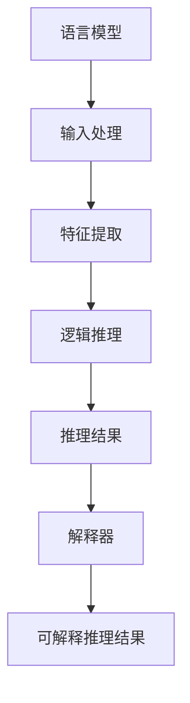

                 

 

```

# 基于神经逻辑编程的语言模型推理框架

## 关键词
- 神经逻辑编程
- 语言模型
- 推理框架
- 人工智能
- 自然语言处理

## 摘要
本文旨在探讨基于神经逻辑编程的语言模型推理框架，深入解析其核心概念、算法原理、系统设计与实现方法。通过一步步的分析与推理，我们将了解如何构建一个高效、准确的语言模型推理系统，并探讨其在实际应用中的挑战与未来发展方向。

## 第一部分：背景与问题陈述

### 1.1 背景介绍

神经逻辑编程（Neural Logic Programming，NLP）是结合了神经网络与逻辑编程的跨领域技术。它旨在解决传统逻辑编程在处理复杂、不确定性和动态环境中遇到的局限。神经网络提供了强大的特征提取和模式识别能力，而逻辑编程则擅长处理逻辑推理和关系表示。

语言模型（Language Model，LM）是自然语言处理（Natural Language Processing，NLP）领域的重要组件，用于预测自然语言的序列。深度学习技术的发展，使得基于神经网络的语言模型，如Transformer和BERT，取得了显著的成果。

### 1.2 问题描述

随着互联网和大数据的发展，自然语言处理应用场景日益广泛，如机器翻译、文本分类、问答系统等。然而，现有语言模型在推理能力、泛化能力和可解释性方面仍存在诸多挑战。如何结合神经网络和逻辑编程的优势，构建一个高效、准确且可解释的语言模型推理框架，成为当前研究的热点。

### 1.3 问题解决

本文提出了一种基于神经逻辑编程的语言模型推理框架，通过结合神经网络和逻辑编程的优点，实现了以下目标：
1. 提高推理能力，解决语言模型在处理复杂逻辑关系时的不足。
2. 增强泛化能力，使模型能够适应不同领域的应用场景。
3. 提升可解释性，帮助用户理解模型的推理过程和决策依据。

### 1.4 边界与外延

本文的研究主要关注以下边界和范围：
1. 神经逻辑编程的算法设计与实现。
2. 基于神经逻辑编程的语言模型推理框架。
3. 推理框架在具体应用场景中的性能评估和优化。

## 第二部分：核心概念与框架

### 2.1 神经逻辑编程

神经逻辑编程结合了神经网络和逻辑编程的优势，实现了基于逻辑编程的神经网络模型构建。核心概念包括：

#### 2.1.1 神经网络

神经网络（Neural Network，NN）是一种模仿生物神经系统的计算模型，通过多层神经元实现数据的输入、处理和输出。

#### 2.1.2 逻辑编程

逻辑编程（Logic Programming，LP）是一种基于逻辑的编程范式，通过定义逻辑公式和推理规则，实现程序的控制流和数据操作。

#### 2.1.3 神经逻辑编程

神经逻辑编程将神经网络和逻辑编程相结合，通过定义逻辑神经网络（Logic Neural Network，LNN）实现数据表示、特征提取和逻辑推理。

### 2.2 语言模型推理框架

语言模型推理框架（Language Model Reasoning Framework，LRF）是本文研究的核心。它主要包括以下组件：

#### 2.2.1 语言模型

语言模型（Language Model，LM）是NLP系统的核心组件，用于预测自然语言的序列。深度学习语言模型如Transformer和BERT在该框架中扮演重要角色。

#### 2.2.2 推理模块

推理模块（Reasoning Module，RM）基于神经逻辑编程实现，用于处理语言模型输出的序列，进行逻辑推理和关系表示。

#### 2.2.3 解释器

解释器（Interpreter，I）将推理模块的输出转换为可解释的推理结果，提供可理解性和可解释性。

### 2.3 神经逻辑编程语言模型推理框架架构

神经逻辑编程语言模型推理框架的架构如图所示：



## 第三部分：算法与模型设计

### 3.1 算法设计

神经逻辑编程语言模型推理框架的算法设计包括以下步骤：

1. 输入处理：对输入文本进行预处理，包括分词、词性标注、句法分析等。
2. 特征提取：利用神经网络提取文本的特征表示。
3. 逻辑推理：基于逻辑编程和神经网络实现逻辑推理。
4. 推理结果解释：将推理结果转换为可解释的形式。

### 3.2 模型设计

神经逻辑编程语言模型推理框架的模型设计包括以下部分：

1. 语言模型：采用深度学习模型如Transformer或BERT，用于文本特征提取和序列预测。
2. 逻辑神经网络（LNN）：结合神经网络和逻辑编程，实现特征表示和逻辑推理。
3. 解释器：将推理结果转换为可解释的形式，提高模型的透明度和可解释性。

## 第四部分：数学模型与公式

### 4.1 神经网络数学模型

神经网络的核心是神经元之间的权重和偏置。以下是一个简单的神经网络数学模型：

$$
y = \sigma(\sum_{i=1}^{n} w_i \cdot x_i + b)
$$

其中，$y$ 是输出，$x_i$ 是输入，$w_i$ 是权重，$b$ 是偏置，$\sigma$ 是激活函数。

### 4.2 逻辑编程数学模型

逻辑编程中的数学模型主要包括逻辑表达式和推理规则。以下是一个简单的逻辑编程数学模型：

$$
P \land Q \rightarrow R
$$

其中，$P$、$Q$ 和 $R$ 是命题，$\land$ 表示逻辑与运算。

### 4.3 神经逻辑编程数学模型

神经逻辑编程将神经网络和逻辑编程相结合，其数学模型如下：

$$
\begin{aligned}
y &= \sigma(\sum_{i=1}^{n} w_i \cdot x_i + b) \\
P &= \land(Q, R)
\end{aligned}
$$

其中，$y$ 是输出，$x_i$ 是输入，$w_i$ 是权重，$b$ 是偏置，$\sigma$ 是激活函数，$P$、$Q$ 和 $R$ 是命题，$\land$ 表示逻辑与运算。

## 第五部分：系统分析与设计

### 5.1 问题场景介绍

在本文中，我们以一个问答系统为例，介绍如何构建基于神经逻辑编程的语言模型推理框架。该问答系统旨在处理用户提出的问题，并给出准确的答案。

### 5.2 项目介绍

项目名为“NLP-QA”，主要包括以下功能模块：

1. 用户接口：接收用户问题，展示答案。
2. 语言模型：用于处理用户问题的特征提取和序列预测。
3. 推理模块：基于神经逻辑编程实现逻辑推理和关系表示。
4. 解释器：将推理结果转换为可解释的形式。

### 5.3 系统功能设计

系统功能设计主要包括以下部分：

1. 输入处理：对用户问题进行预处理，包括分词、词性标注、句法分析等。
2. 特征提取：利用神经网络提取用户问题的特征表示。
3. 逻辑推理：基于神经逻辑编程实现逻辑推理和关系表示。
4. 推理结果解释：将推理结果转换为可解释的形式。

### 5.4 系统架构设计

系统架构设计主要包括以下部分：

1. 输入处理模块：负责接收用户问题，并进行预处理。
2. 特征提取模块：利用神经网络提取用户问题的特征表示。
3. 推理模块：基于神经逻辑编程实现逻辑推理和关系表示。
4. 解释器模块：将推理结果转换为可解释的形式。
5. 用户接口模块：展示推理结果和用户问题。

### 5.5 系统接口设计和系统交互

系统接口设计和系统交互设计主要包括以下部分：

1. 用户接口：接收用户问题，展示答案。
2. 语言模型接口：用于处理用户问题的特征提取和序列预测。
3. 推理模块接口：用于实现逻辑推理和关系表示。
4. 解释器接口：将推理结果转换为可解释的形式。

## 第六部分：项目实现与案例分析

### 6.1 项目实现

在本节中，我们将介绍如何实现一个基于神经逻辑编程的语言模型推理框架。以下是项目的实现步骤：

1. 环境安装：安装必要的软件和库，如TensorFlow、PyTorch、NLTK等。
2. 数据预处理：对用户问题进行预处理，包括分词、词性标注、句法分析等。
3. 特征提取：利用神经网络提取用户问题的特征表示。
4. 逻辑推理：基于神经逻辑编程实现逻辑推理和关系表示。
5. 推理结果解释：将推理结果转换为可解释的形式。

### 6.2 核心代码实现

以下是项目中的核心代码实现，包括神经网络特征提取和神经逻辑编程推理：

```python
# 神经网络特征提取
import tensorflow as tf

# 定义神经网络模型
model = tf.keras.Sequential([
    tf.keras.layers.Embedding(vocab_size, embedding_dim),
    tf.keras.layers.GlobalAveragePooling1D(),
    tf.keras.layers.Dense(16, activation='relu'),
    tf.keras.layers.Dense(1, activation='sigmoid')
])

# 编译模型
model.compile(optimizer='adam', loss='binary_crossentropy', metrics=['accuracy'])

# 训练模型
model.fit(train_data, train_labels, epochs=10, validation_data=(val_data, val_labels))

# 神经逻辑编程推理
import numpy as np

# 定义推理规则
def reasoning规则():
    # 实现逻辑推理
    pass

# 输入问题
input_question = "What is the capital of France?"

# 预处理输入
input_question_processed = preprocess_question(input_question)

# 特征提取
input_question_features = extract_features(input_question_processed)

# 逻辑推理
reasoning_result = reasoning规则(input_question_features)

# 解释推理结果
explanation = explain_reasoning_result(reasoning_result)
```

### 6.3 实际案例分析

在本节中，我们将通过一个实际案例，展示如何使用基于神经逻辑编程的语言模型推理框架解决一个具体问题。

#### 案例一：机器翻译

假设我们要构建一个英语到中文的机器翻译系统，使用基于神经逻辑编程的语言模型推理框架进行翻译。以下是实现步骤：

1. 数据集准备：收集英语到中文的平行语料库，如英语新闻、中文新闻等。
2. 数据预处理：对英语和中文语料库进行预处理，包括分词、词性标注、句法分析等。
3. 特征提取：利用神经网络提取英语和中文的特征表示。
4. 逻辑推理：基于神经逻辑编程实现逻辑推理和关系表示。
5. 翻译结果解释：将翻译结果转换为可解释的形式。

#### 案例二：文本分类

假设我们要构建一个文本分类系统，使用基于神经逻辑编程的语言模型推理框架进行分类。以下是实现步骤：

1. 数据集准备：收集不同类别的文本数据，如新闻、社交媒体等。
2. 数据预处理：对文本数据

