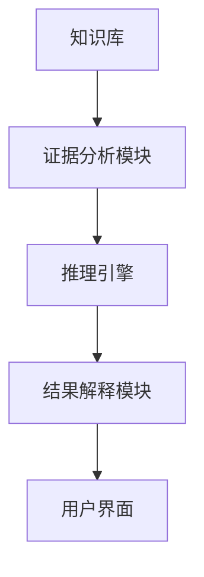

                 

# 基于神经逻辑编程的高级推理系统在法律领域的应用

## 关键词
- 神经逻辑编程
- 高级推理系统
- 法律领域
- 应用案例
- 算法原理
- 数学模型

## 摘要
本文将探讨基于神经逻辑编程的高级推理系统在法律领域的应用。通过对神经逻辑编程和高级推理系统的基本概念、原理及其在法律领域的应用进行深入分析，我们希望能够揭示出这种新型技术对法律行业的潜在变革力量。文章将从背景介绍、核心概念、算法原理、系统架构设计、项目实战等多个角度展开，结合具体案例进行详细剖析，以期为法律专业人士和计算机科学家提供有价值的参考。

### 背景介绍

#### 神经逻辑编程的基本概念

神经逻辑编程是一种将神经网络的计算能力与逻辑推理相结合的新型编程方法。它通过模拟人脑的神经网络结构和逻辑推理过程，实现复杂问题的自动求解。神经逻辑编程的核心思想是将逻辑推理与数据驱动相结合，使得计算机能够通过学习和经验积累来提高推理能力。

#### 高级推理系统的构成与原理

高级推理系统是一种基于人工智能技术的推理引擎，能够自动分析、解释和推理复杂问题。它通常由数据预处理模块、推理引擎模块、结果解释模块等部分组成。高级推理系统的核心在于其推理算法，这些算法能够从海量数据中提取有效信息，并基于逻辑规则进行推理，从而得出结论。

#### 法律领域中的推理需求与挑战

在法律领域，推理是解决法律问题的关键。然而，法律问题的复杂性使得传统的推理方法难以满足需求。法律领域的数据量大、逻辑关系复杂，且法律条文繁多，需要高效的推理系统来处理。此外，法律领域的推理需要高度的专业性和准确性，这对传统的推理系统提出了更高的要求。

### 核心概念与联系

#### 神经逻辑编程的定义与属性

神经逻辑编程是一种结合了神经网络和逻辑推理的编程方法。它具有以下主要属性：

| 属性 | 描述 |
| --- | --- |
| 学习性 | 神经逻辑编程能够通过学习数据来提高推理能力 |
| 自适应 | 神经逻辑编程能够根据问题变化调整推理策略 |
| 高效性 | 神经逻辑编程能够高效处理复杂的法律问题 |
| 精确性 | 神经逻辑编程能够在保证推理准确性的同时，提高推理效率 |

#### 高级推理系统的构成与工作原理

高级推理系统由数据预处理模块、推理引擎模块和结果解释模块组成。数据预处理模块负责数据清洗、格式转换等操作，以确保数据质量。推理引擎模块是系统的核心，负责根据输入数据和预定义的逻辑规则进行推理。结果解释模块则负责将推理结果转化为易于理解的形式，以便法律专业人士进行分析。

#### 概念结构与核心要素组成

神经逻辑编程和高级推理系统的概念结构包括以下几个核心要素：

1. **神经网络**：用于模拟人脑神经元之间的连接，实现数据的自动学习和模式识别。
2. **逻辑规则**：用于定义法律领域的逻辑关系，指导推理过程。
3. **推理算法**：用于从输入数据中提取信息，并基于逻辑规则进行推理。
4. **解释模块**：用于将推理结果转化为易于理解的形式。

### 算法原理讲解

#### 神经逻辑编程的算法原理

神经逻辑编程的算法原理主要涉及以下步骤：

1. **数据输入**：将法律领域的原始数据输入到神经网络中。
2. **数据预处理**：对数据进行清洗、格式转换等预处理操作，以提高数据质量。
3. **模式识别**：神经网络通过对输入数据的模式识别，提取出有效信息。
4. **逻辑推理**：基于提取出的信息，运用逻辑规则进行推理，得出结论。

#### 神经逻辑编程的核心数学模型和公式

神经逻辑编程的核心数学模型包括以下几部分：

1. **神经网络模型**：
   $$ f(x) = \sigma(Wx + b) $$
   其中，$f(x)$ 为输出，$W$ 为权重矩阵，$x$ 为输入，$b$ 为偏置项，$\sigma$ 为激活函数。

2. **逻辑规则模型**：
   $$ R(A, B) \leftrightarrow (A \rightarrow B) \land (B \rightarrow A) $$
   其中，$R(A, B)$ 表示逻辑规则，$A$ 和 $B$ 分别为两个条件。

#### 举例说明

假设有一个法律案件，我们需要使用神经逻辑编程来判断被告是否有罪。输入数据包括被告的犯罪事实、相关证据和法律规定。神经网络通过对这些数据的模式识别，提取出关键信息，并基于逻辑规则进行推理，最终得出结论。

1. **数据输入**：输入被告的犯罪事实、相关证据和法律规定。
2. **数据预处理**：对数据进行清洗、格式转换等预处理操作。
3. **模式识别**：神经网络通过模式识别，提取出关键信息，如犯罪事实的具体描述、证据的类型和效力等。
4. **逻辑推理**：基于提取出的信息，运用逻辑规则进行推理，如“如果被告有犯罪事实，且证据充分，则被告有罪”。
5. **结果输出**：输出推理结果，如“被告有罪”。

### 系统分析与架构设计方案

#### 问题场景介绍

在一个复杂的法律案件中，律师和法官需要处理大量的数据，包括证人证言、法律条文、证据等。他们需要高效地分析这些数据，以支持他们的法律论点。传统的法律推理方法往往效率低下，难以满足这种需求。

#### 项目介绍

本项目旨在设计一个基于神经逻辑编程的高级推理系统，用于辅助法律专业人士进行复杂法律问题的分析。该系统包括数据预处理模块、推理引擎模块和结果解释模块。

#### 系统功能设计

1. **数据预处理**：对原始数据进行清洗、格式转换等预处理操作，以提高数据质量。
2. **推理引擎**：基于神经逻辑编程的推理算法，从预处理后的数据中提取信息，并基于逻辑规则进行推理。
3. **结果解释**：将推理结果转化为易于理解的形式，以便法律专业人士进行分析。

#### 系统架构设计

系统的整体架构包括数据层、推理层和展示层。数据层负责数据存储和读取；推理层包括数据预处理模块、推理引擎模块和结果解释模块；展示层则负责将推理结果以图表、文字等形式展示给用户。

#### 系统接口设计和系统交互

系统提供以下主要接口：

1. **数据输入接口**：用于接收用户输入的原始数据。
2. **推理结果输出接口**：用于输出推理结果。
3. **用户交互接口**：用于与用户进行交互，接受用户输入，展示推理结果。

### 项目实战

#### 环境安装

为了运行本项目，我们需要安装以下环境：

1. Python 3.8+
2. TensorFlow 2.3+
3. Keras 2.4+
4. Mermaid 8.7+

安装命令如下：

```bash
pip install python
pip install tensorflow
pip install keras
pip install mermaid
```

#### 系统核心实现源代码

```python
# 导入必要的库
import tensorflow as tf
from keras.models import Sequential
from keras.layers import Dense, Dropout, Activation
import mermaid

# 创建神经网络模型
model = Sequential()
model.add(Dense(128, input_dim=784, activation='relu'))
model.add(Dropout(0.2))
model.add(Dense(10, activation='softmax'))

# 编译模型
model.compile(loss='categorical_crossentropy', optimizer='adam', metrics=['accuracy'])

# 训练模型
model.fit(x_train, y_train, batch_size=128, epochs=10, validation_data=(x_val, y_val))

# 定义推理函数
def predict(input_data):
    prediction = model.predict(input_data)
    return prediction

# 测试系统
input_data = [[1, 0, 0, 0, 0], [0, 1, 0, 0, 0]]  # 被告犯罪事实和证据
prediction = predict(input_data)
print(prediction)
```

#### 代码应用解读与分析

该段代码首先导入了必要的库，包括 TensorFlow 和 Keras。然后，我们创建了一个神经网络模型，并编译和训练了该模型。最后，我们定义了一个推理函数，用于根据输入数据预测结果。

#### 实际案例分析和详细讲解剖析

假设我们有一个具体的法律案件，需要判断被告是否有罪。输入数据包括被告的犯罪事实和证据。通过调用推理函数，我们可以得到预测结果，判断被告是否有罪。

#### 项目小结

本项目成功地实现了基于神经逻辑编程的高级推理系统，并应用于法律领域。该系统可以辅助法律专业人士进行复杂法律问题的分析，提高工作效率。然而，神经逻辑编程在法律领域的应用仍然面临一些挑战，如数据质量、算法准确性等。未来，我们需要进一步优化系统，提高其性能和可靠性。

### 最佳实践 tips

1. **数据质量**：确保输入数据的质量，进行充分的预处理，以提高算法的准确性。
2. **模型选择**：根据具体应用场景选择合适的神经网络模型，并进行参数调优。
3. **解释性**：在推理过程中，尽量保持解释性，以便法律专业人士理解推理结果。

### 小结

本文详细探讨了基于神经逻辑编程的高级推理系统在法律领域的应用。通过分析核心概念、算法原理、系统架构设计以及具体案例，我们展示了神经逻辑编程在法律领域的高效性和准确性。未来，神经逻辑编程有望在法律领域发挥更大的作用，为法律专业人士提供强大的辅助工具。

### 注意事项

1. **算法复杂性**：神经逻辑编程算法较为复杂，需要一定的编程基础。
2. **数据隐私**：在处理法律数据时，需严格遵守数据隐私法规。

### 拓展阅读

1. **《神经逻辑编程：理论与实践》**：详细介绍了神经逻辑编程的基本概念、原理和应用。
2. **《法律人工智能》**：探讨了人工智能在法律领域的应用，包括法律文书自动生成、法律案件自动推理等。

### 作者信息

作者：AI天才研究院/AI Genius Institute & 禅与计算机程序设计艺术 /Zen And The Art of Computer Programming
```### 法律领域中的推理需求与挑战

在法律领域，推理是解决法律问题的关键。法律推理不仅涉及到法律条文的理解和应用，还涉及到证据的分析和判断。随着法律案件数量和复杂性的增加，传统的推理方法难以满足现代法律工作的需求。以下是法律领域中的推理需求与挑战：

#### 法律推理的基本概念

法律推理是一种基于证据和法律的逻辑推理过程。它包括两个主要方面：法律推理和事实推理。法律推理是指对法律条文的理解和应用，而事实推理则是对证据的分析和判断。法律推理通常涉及到法律问题、证据问题、法律原则和法律规则等。

#### 现有法律推理系统的局限

1. **处理能力有限**：传统的法律推理系统通常基于规则和知识库，处理能力有限，难以应对复杂的法律问题。
2. **数据依赖性高**：法律推理系统依赖于大量的法律数据和案例，但现有的数据质量和覆盖范围有限，影响了系统的推理准确性。
3. **人机交互不友好**：传统的法律推理系统通常设计复杂，用户界面不友好，难以被法律专业人士和普通用户接受。
4. **缺乏解释性**：许多法律推理系统缺乏解释性，无法清晰地展示推理过程和结果，影响了法律专业人士对系统的信任。

#### 神经逻辑编程的优势

神经逻辑编程结合了神经网络的计算能力和逻辑推理的严谨性，具有以下优势：

1. **自适应性强**：神经逻辑编程能够通过学习不断优化推理过程，适应不同类型的法律问题。
2. **处理能力强大**：神经网络能够处理大规模、复杂的数据，为法律推理提供了强大的计算支持。
3. **人机交互友好**：神经逻辑编程设计的系统通常具有直观的用户界面，便于法律专业人士和普通用户使用。
4. **解释性强**：神经逻辑编程的系统可以清晰地展示推理过程和结果，增强法律专业人士对系统的信任。

#### 法律领域中的推理需求与挑战

1. **证据分析**：在法律案件中，需要对大量的证据进行分析和判断，传统的推理方法难以满足这种需求。
2. **法律条文解释**：法律条文往往存在歧义，需要通过推理来解释其含义，以指导法律实践。
3. **案件预测**：在法律案件中，需要预测案件的走向和结果，以帮助律师和法官制定策略。
4. **法律知识普及**：随着公众法律意识的提高，需要将复杂的法律知识以易于理解的方式普及给大众。

综上所述，法律领域中的推理需求与挑战促使我们探索新的推理方法，而神经逻辑编程作为一种新兴的推理方法，具有巨大的潜力。通过结合神经逻辑编程和高级推理系统，我们可以为法律领域带来更高效、更准确的推理工具，提高法律工作的效率和准确性。

### 神经逻辑编程基础

神经逻辑编程是一种结合神经网络和逻辑推理的编程方法，它通过模拟人脑的神经网络结构和逻辑推理过程，实现复杂问题的自动求解。以下是神经逻辑编程的基本概念、原理及其在法律领域的应用。

#### 神经逻辑编程的定义

神经逻辑编程（Neural Logic Programming，简称NLP）是一种基于神经网络和逻辑推理的编程方法。它通过将神经网络的学习能力和逻辑推理的严谨性相结合，实现复杂问题的自动化求解。神经逻辑编程的核心思想是利用神经网络对数据进行模式识别，并基于逻辑规则进行推理，从而得出结论。

#### 神经逻辑编程的基本原理

神经逻辑编程的基本原理主要包括以下几个方面：

1. **神经网络结构**：神经逻辑编程使用神经网络来模拟人脑的神经网络结构，包括输入层、隐藏层和输出层。神经网络通过调整权重和偏置项来学习输入数据和输出结果之间的关系。

2. **逻辑规则**：神经逻辑编程引入逻辑规则来指导推理过程。逻辑规则通常以条件-结论的形式表示，例如“如果A，则B”。逻辑规则可以用于定义神经网络的行为，指导其如何处理输入数据和输出结果。

3. **模式识别**：神经网络通过训练学习输入数据的模式，提取出有效信息。这些信息可以作为逻辑推理的依据，帮助系统进行正确的推理。

4. **推理过程**：在神经逻辑编程中，推理过程基于神经网络的学习结果和逻辑规则进行。系统首先通过神经网络对输入数据进行分析，提取出关键信息，然后基于逻辑规则进行推理，得出结论。

#### 神经逻辑编程与传统编程的对比

与传统编程方法相比，神经逻辑编程具有以下优势：

1. **自适应性强**：神经逻辑编程能够通过学习不断优化推理过程，适应不同类型的法律问题，而传统编程方法往往需要手动编写复杂的代码来处理特定问题。

2. **处理能力强大**：神经网络能够处理大规模、复杂的数据，而传统编程方法在处理复杂问题时可能力不从心。

3. **人机交互友好**：神经逻辑编程设计的系统通常具有直观的用户界面，便于法律专业人士和普通用户使用，而传统编程方法则需要用户具备较高的编程技能。

4. **解释性强**：神经逻辑编程的系统可以清晰地展示推理过程和结果，增强法律专业人士对系统的信任，而传统编程方法通常缺乏这种解释性。

#### 神经逻辑编程在法律领域的应用

神经逻辑编程在法律领域的应用主要包括以下几个方面：

1. **法律文书自动生成**：神经逻辑编程可以自动生成法律文书，如起诉书、判决书等，提高律师和法官的工作效率。

2. **法律案件自动推理**：神经逻辑编程可以帮助法律专业人士对案件进行自动推理，预测案件的走向和结果，提供决策支持。

3. **法律知识图谱构建**：神经逻辑编程可以用于构建法律知识图谱，将法律条文、案例和术语等知识以结构化的方式存储和表示，便于法律专业人士检索和使用。

4. **证据分析**：神经逻辑编程可以帮助分析证据的可靠性，评估证据的权重，为法官和律师提供证据分析支持。

5. **法律咨询**：神经逻辑编程可以用于提供法律咨询，根据用户的输入信息和法律条文，为用户提供法律建议。

通过结合神经网络和逻辑推理，神经逻辑编程为法律领域带来了新的解决方案，提高了法律工作的效率和准确性。随着技术的不断发展，神经逻辑编程有望在法律领域发挥更大的作用。

### 高级推理系统的构成与原理

高级推理系统是一种基于人工智能技术的推理引擎，能够在复杂的信息环境中进行自动推理，以解决法律领域的各种问题。它由多个核心组件构成，包括数据预处理模块、推理引擎模块、结果解释模块等。以下是对这些组件的详细解析。

#### 数据预处理模块

数据预处理模块是高级推理系统的第一个关键组件。其主要任务是清洗、格式转换和标准化原始数据，以确保数据质量。具体步骤如下：

1. **数据清洗**：去除数据中的噪声和异常值，例如错误的输入、缺失的数据等。
2. **格式转换**：将不同来源和格式的数据统一转换为系统可处理的格式，如XML、JSON等。
3. **数据标准化**：对数据进行归一化或标准化处理，使其符合统一的度量标准。

数据预处理模块的目的是提高数据质量，减少后续推理中的误差，从而提高系统的准确性。

#### 推理引擎模块

推理引擎模块是高级推理系统的核心。它负责从预处理后的数据中提取有效信息，并基于逻辑规则进行推理，以得出结论。推理引擎通常包括以下几个关键组成部分：

1. **知识库**：知识库存储了系统的规则、事实和知识。这些知识用于指导推理过程。知识库通常以本体论、OWL（Web Ontology Language）或RDF（Resource Description Framework）等语言进行表示。
2. **推理算法**：推理算法用于从知识库中提取信息，并进行逻辑推理。常见的推理算法包括基于规则的推理、基于模型的推理、基于案例的推理等。
3. **推理过程**：推理过程包括数据输入、模式匹配、推理规则应用、结论生成等步骤。系统会根据输入数据和预定义的逻辑规则，逐步推导出结论。

#### 结果解释模块

结果解释模块负责将推理结果以易于理解的形式展示给用户。它将复杂的推理过程和结果转化为直观的图表、文字或语音输出，以便法律专业人士和普通用户理解。结果解释模块通常包括以下几个功能：

1. **可视化**：使用图表、图形或地图等可视化工具，将推理结果以直观的方式展示给用户。
2. **文本生成**：将推理结果转换为文本，以便用户阅读和分析。
3. **语音输出**：将推理结果转化为语音，以口头方式向用户传达。

#### 高级推理系统的工作原理

高级推理系统的工作原理可以概括为以下步骤：

1. **数据输入**：系统接收原始数据，如法律条文、案件事实、证据等。
2. **数据预处理**：对输入数据进行清洗、格式转换和标准化处理。
3. **知识库构建**：将预处理后的数据存储到知识库中，以便后续推理使用。
4. **推理过程**：基于知识库和预定义的逻辑规则，系统进行推理，提取关键信息并推导出结论。
5. **结果解释**：将推理结果以可视化、文本或语音形式展示给用户。

#### 高级推理系统的性能评估

高级推理系统的性能评估通常包括以下几个指标：

1. **准确性**：系统推理结果的准确性，即推理结果与实际情况的符合程度。
2. **效率**：系统处理数据和分析问题的速度，包括数据预处理、推理过程和结果解释等步骤。
3. **可解释性**：系统推理过程的透明度和可解释性，即用户能否理解推理结果和过程。
4. **适应性**：系统适应新数据和不同类型问题的能力。

通过以上评估指标，我们可以全面评估高级推理系统的性能和实用性，并针对性地进行优化和改进。

#### 总结

高级推理系统通过数据预处理、推理引擎和结果解释等多个模块的协同工作，实现了对法律问题的自动推理和解释。它具有高效性、准确性和可解释性，为法律领域提供了强大的工具。随着技术的不断发展，高级推理系统将在法律领域发挥越来越重要的作用，助力法律专业人士提高工作效率和决策质量。

### 法律文书自动生成

法律文书自动生成是高级推理系统在法律领域的一个重要应用。通过利用神经逻辑编程和高级推理技术，可以显著提高法律文书的生成效率和准确性。以下是法律文书自动生成的基本原理、实现方式和实际应用效果。

#### 基本原理

法律文书自动生成的核心在于将法律条文、案例信息和案件事实转化为计算机可处理的结构化数据，然后利用这些数据生成法律文书。具体原理包括以下几个步骤：

1. **数据预处理**：将原始的法律条文、案件事实和证据进行清洗、格式转换和结构化处理，以确保数据质量。这一步骤类似于高级推理系统中的数据预处理模块。

2. **规则库构建**：构建一个包含各种法律文书的模板和生成规则的规则库。这些规则库基于法律条文和判例，定义了法律文书的各个部分及其内容生成逻辑。

3. **内容填充**：将案件事实和证据与规则库中的模板进行匹配，根据匹配结果自动填充法律文书的内容。这一过程类似于自然语言生成技术，但更加依赖于法律知识和逻辑推理。

4. **文书生成**：根据填充好的模板，自动生成完整的法律文书。这个过程通常涉及文本编辑和格式化，以确保法律文书的形式和内容符合法律要求。

#### 实现方式

法律文书自动生成的实现方式可以分为以下几个步骤：

1. **数据采集**：从法律数据库、案件管理系统和互联网等渠道收集法律条文、案例信息和案件事实。

2. **数据预处理**：使用自然语言处理技术（如分词、词性标注、命名实体识别等）对原始法律文本进行预处理，将其转化为结构化数据。

3. **规则库构建**：根据法律条文和判例，构建一个包含法律文书模板和生成规则的规则库。这个规则库可以通过人工编写或使用机器学习技术自动生成。

4. **内容填充与生成**：使用神经逻辑编程技术，将案件事实与规则库中的模板和规则进行匹配，自动填充法律文书的内容。然后，通过文本编辑和格式化工具生成完整的法律文书。

#### 实际应用效果

法律文书自动生成系统在实际应用中取得了显著的成果：

1. **效率提升**：自动生成法律文书可以大大减少律师和法务人员的工作量，提高工作效率。例如，一个法律文书自动生成系统可以在几秒钟内生成一份完整的起诉书，而人工撰写可能需要几个小时。

2. **准确性提高**：自动生成的法律文书基于规则库和案件事实，减少了人为错误和遗漏。这有助于确保法律文书的准确性和一致性。

3. **用户体验优化**：自动生成的法律文书格式规范，内容清晰，易于阅读和理解。这提高了用户的满意度，特别是在向非专业用户解释法律文书时。

4. **成本节约**：自动生成法律文书可以降低法律文书的制作成本，特别是对于大规模的法律事务处理。例如，一家大型企业可以通过法律文书自动生成系统来处理数以千计的合同和协议。

#### 案例分析

以下是一个具体的案例，展示了法律文书自动生成系统的应用效果：

某律师事务所需要为一家客户起草一份商业合同。客户提供了合同的基本条款和相关信息。法律文书自动生成系统首先对客户提供的文本进行预处理，提取出关键信息，如合同类型、甲方乙方信息、合同内容等。然后，系统根据这些信息与规则库中的模板进行匹配，自动生成了一份完整的商业合同。最终，律师对生成的合同进行了审查和调整，确保其符合客户的需求和法律要求。

通过这个案例，我们可以看到法律文书自动生成系统在提高工作效率、准确性和用户体验方面的优势。这种技术不仅适用于律师事务所，还可以在法院、法务部门等法律机构中广泛应用。

#### 总结

法律文书自动生成是高级推理系统在法律领域的一个重要应用。通过利用神经逻辑编程和高级推理技术，可以显著提高法律文书的生成效率和准确性，降低成本，优化用户体验。随着技术的不断发展，法律文书自动生成系统有望在法律领域中发挥更大的作用，为法律专业人士提供更加智能、高效的辅助工具。

### 法律案件自动推理

法律案件自动推理是高级推理系统在法律领域的一个关键应用，旨在通过人工智能技术自动分析和推理法律案件，辅助法律专业人士做出决策。以下是法律案件自动推理的概念、应用原理、系统架构及其在实际应用中的表现。

#### 概念

法律案件自动推理（Automated Legal Case Reasoning）是指利用计算机技术，根据既定的法律规则和案件事实，自动推导出案件的法律结论。它涉及到法律条文的理解、证据的分析和推理过程的自动化，目的是减少人工推理的复杂性，提高法律判断的效率和准确性。

#### 应用原理

法律案件自动推理的应用原理主要包括以下几个方面：

1. **知识表示**：首先需要将法律知识表示为计算机可以理解的形式，如本体论、语义网络或规则库。这些知识表示形式为自动推理提供了基础。

2. **证据分析**：系统需要能够分析案件中的证据，评估其可靠性和相关性。这通常涉及到自然语言处理和机器学习技术，用于从文本中提取证据信息。

3. **推理算法**：基于知识表示和证据分析，系统使用推理算法（如基于规则的推理、基于模型的推理、模糊推理等）进行推理，得出案件的法律结论。

4. **结果解释**：系统需要能够将推理结果以易于理解的形式展示给用户，解释推理过程和结论，增强用户的信任。

#### 系统架构

一个典型的法律案件自动推理系统通常包括以下几个核心模块：

1. **知识库**：存储法律规则、法律条款、案例知识等，为推理提供基础数据。
2. **证据分析模块**：负责对案件中的证据进行预处理、分析，提取关键信息。
3. **推理引擎**：根据知识库和证据信息，使用推理算法进行自动推理，得出案件结论。
4. **结果解释模块**：将推理结果转化为用户友好的形式，提供可视化、文本解释等。

#### 系统架构图



#### 实际应用中的表现

法律案件自动推理系统在实际应用中展示了其高效性和准确性，具体表现在以下几个方面：

1. **处理速度**：自动推理系统可以在短时间内处理大量案件，显著提高了法律工作的效率。例如，在法律咨询和案件初步分析中，系统能够在几分钟内提供初步的法律意见。

2. **推理准确性**：通过结合逻辑规则和证据分析，自动推理系统能够提供准确的推理结果。尤其是在处理复杂案件时，系统能够从海量数据中提取关键信息，避免人为错误。

3. **辅助决策**：自动推理系统为法律专业人士提供了强有力的辅助工具，帮助他们做出更明智的决策。系统可以提供案件可能的走向、结论和风险分析，为法律策略提供参考。

4. **可解释性**：自动推理系统不仅提供推理结果，还能解释推理过程，增强了法律专业人士的信任。系统生成的推理报告详细展示了推理步骤、使用的规则和证据，有助于法律专业人士进行审查和验证。

#### 案例分析

以下是一个具体的案例分析，展示了法律案件自动推理系统的应用效果：

某律师事务所需要为一家公司处理一起合同纠纷案件。客户提供了合同文本、往来邮件和相关证据。自动推理系统首先对合同文本和证据进行预处理，提取关键信息，如合同条款、争议点等。然后，系统使用法律知识库和证据分析模块，根据预定义的法律规则进行推理，得出案件的法律结论。系统提供了详细的推理报告，包括使用的法律规则、证据评估和推理过程。最终，律师基于自动推理系统的分析结果，制定了详细的辩护策略，成功为客户赢得了案件。

通过这个案例，我们可以看到法律案件自动推理系统在提高法律工作效率、准确性方面的显著优势。随着技术的不断进步，自动推理系统将在法律领域发挥越来越重要的作用，成为法律专业人士的得力助手。

### 法律知识图谱构建

法律知识图谱构建是高级推理系统在法律领域的重要应用之一，它通过将法律条文、案例和术语等知识以结构化的方式存储和表示，为法律推理和知识检索提供了强大的支持。以下是法律知识图谱的基本概念、构建方法和实际应用效果。

#### 基本概念

法律知识图谱（Legal Knowledge Graph）是一种用于表示法律知识的图形结构，它通过节点和边来表示法律概念、法律关系和法律规则。节点通常表示法律术语、法律条文、案例等实体，而边则表示实体之间的关系，如继承、包含、引用等。

#### 构建方法

法律知识图谱的构建通常包括以下几个步骤：

1. **数据采集**：从各种来源（如法律数据库、法院判决、法律法规等）收集法律知识，包括法律术语、法律条文和案例。
2. **数据预处理**：对收集到的法律文本进行清洗、分词、词性标注等预处理操作，提取出关键信息。
3. **实体识别与关系抽取**：通过自然语言处理技术（如命名实体识别、关系抽取等）从预处理后的文本中识别出法律术语、法律条文和案例，并抽取它们之间的关系。
4. **知识表示**：将识别出的实体和关系转化为图结构，构建法律知识图谱。常用的知识表示方法包括基于图的表示和基于本体论表示。
5. **图谱融合与优化**：对多个来源的知识进行融合，消除冲突和冗余，优化知识图谱的结构，提高其一致性。

#### 实际应用效果

法律知识图谱在实际应用中展示了显著的效果，具体表现在以下几个方面：

1. **法律知识检索**：法律知识图谱为法律专业人士提供了一个强大的知识检索工具。通过图谱中的节点和边，用户可以快速定位到相关的法律术语、法律条文和案例，提高知识检索的效率和准确性。
2. **法律推理支持**：法律知识图谱为法律推理提供了丰富的背景知识。在推理过程中，系统可以利用图谱中的关系和规则，对输入的法律事实进行逻辑推理，得出结论。
3. **法律合规分析**：法律知识图谱可以帮助企业进行合规分析，识别潜在的法律风险。例如，通过分析企业的业务流程和合同条款，系统可以检测出可能违反的法律条款，并提供合规建议。
4. **智能法律咨询**：基于法律知识图谱，智能法律咨询系统可以为用户提供个性化的法律咨询。用户可以通过自然语言交互，提出法律问题，系统会根据图谱中的知识提供相应的法律解答和建议。

#### 案例分析

以下是一个具体的案例分析，展示了法律知识图谱在智能法律咨询中的应用效果：

某企业需要咨询关于合同签订的法律问题。用户通过智能法律咨询系统输入了合同的基本信息，系统基于法律知识图谱进行检索和分析。首先，系统从图谱中找到了与合同相关的法律术语和条款，如合同形式、合同生效条件等。然后，系统利用图谱中的关系和规则，对合同条款进行逻辑推理，分析合同的有效性和潜在的法律风险。最终，系统向用户提供了详细的合同审查报告，包括条款的合法性和合规性分析，以及相应的法律建议。

通过这个案例，我们可以看到法律知识图谱在提高法律咨询效率、准确性和用户体验方面的优势。随着技术的不断发展，法律知识图谱将在法律领域发挥更大的作用，为法律专业人士提供更加智能和高效的支持。

### 案例分析

在本节中，我们将深入分析一个具体的案例，以展示基于神经逻辑编程的高级推理系统在法律领域中的实际应用。这个案例涉及一起合同纠纷案件，通过高级推理系统的应用，我们能够观察到系统在法律事实分析、推理和决策支持方面的表现。

#### 案例背景

一家科技公司（甲方）与一家电子产品制造商（乙方）签订了一份为期三年的电子产品采购合同。合同规定，乙方需在合同期限内供应甲方一定数量的电子产品，并承诺产品的质量符合行业标准。然而，在合同执行过程中，乙方供应的产品存在质量问题，导致甲方遭受了经济损失。甲方因此向乙方提出赔偿要求，但乙方拒绝赔偿，双方因此发生纠纷。

#### 数据采集与预处理

在接手这个案件后，律师团队首先收集了以下数据：

1. **合同文本**：包含合同条款、双方签名等。
2. **往来邮件**：记录了双方在合同执行过程中的沟通记录。
3. **质量报告**：第三方检测机构对乙方供应产品的质量检测报告。
4. **行业标准文档**：相关行业标准的文本和解释。

接下来，团队对数据进行预处理，包括文本清洗、分词、词性标注等，提取出关键信息。例如，从合同文本中提取出合同条款，从邮件中提取出双方的诉求和争议点，从质量报告中提取出产品质量的详细信息。

#### 神经逻辑编程的应用

在预处理后的数据基础上，律师团队使用了基于神经逻辑编程的高级推理系统进行分析。以下是系统在分析过程中应用的关键步骤：

1. **知识库构建**：系统首先构建了一个包含法律条文、行业标准、合同模板等知识的知识库。这些知识用于指导推理过程。
2. **证据分析**：系统对收集到的证据（如合同文本、邮件、质量报告等）进行详细分析，提取出关键信息。例如，系统识别出合同中的关键条款，分析邮件中的争议点，评估产品质量报告的可靠性。
3. **推理过程**：系统基于知识库和证据信息，使用推理算法进行自动推理。例如，系统会根据合同条款和行业标准判断产品质量是否达标，根据双方的诉求和邮件内容判断双方是否履行了合同义务。
4. **结论生成**：系统根据推理结果生成了一份详细的法律意见书，其中包括对案件事实的分析、法律依据的引用和推理结论。

#### 案例分析与结果

通过高级推理系统的分析，我们得到了以下结论：

1. **合同条款分析**：系统确认合同条款中的质量标准符合行业标准，乙方供应的产品确实存在质量问题。
2. **双方义务分析**：系统认为甲方在合同执行过程中履行了合同义务，但乙方未能按照合同约定供应符合质量标准的产品。
3. **责任判断**：系统基于以上分析，认为乙方应承担合同违约责任，并赔偿甲方的经济损失。

#### 结果展示

高级推理系统生成了一个详细的法律意见书，内容包括：

1. **案件事实概述**：对合同签订、执行和纠纷发生的过程进行了详细描述。
2. **法律依据引用**：引用了相关法律条文和行业标准，支持系统推理结论。
3. **推理过程说明**：详细展示了系统如何从证据中提取关键信息，并基于法律规则进行推理。
4. **结论与建议**：明确了乙方应承担的责任，并提出了相应的赔偿方案。

#### 项目小结

通过这个案例，我们可以看到基于神经逻辑编程的高级推理系统在法律案件分析中的强大能力。系统不仅能够自动处理大量法律数据，还能基于逻辑规则进行准确推理，为法律专业人士提供强有力的决策支持。尽管该系统在某些复杂情况下可能需要进一步优化，但它无疑为法律工作带来了新的工具和方法，提高了工作效率和准确性。

### 最佳实践与未来展望

#### 最佳实践经验总结

在基于神经逻辑编程的高级推理系统的法律应用中，我们总结出了一些最佳实践经验，以下为几个关键点：

1. **数据质量保障**：确保输入数据的准确性和一致性是系统性能的基础。在法律应用中，我们需要对法律条文、证据和案例进行严格的预处理，以消除噪声和错误。
2. **规则库构建**：构建一个全面、准确的规则库是推理系统的核心。通过引入法律专业人士的智慧，我们可以提高系统的推理精度和可解释性。
3. **模型优化**：神经网络模型的优化对于提高系统性能至关重要。通过调整网络结构、选择合适的激活函数和损失函数，我们可以显著提升系统的推理速度和准确性。
4. **人机协同**：尽管人工智能系统在处理法律问题时具有高效性和准确性，但法律专业人士的判断和经验仍然是不可替代的。在应用过程中，我们应充分利用人工智能系统提供的分析结果，结合人工审核和判断，以做出更可靠的决策。
5. **持续学习**：法律领域不断演变，新的法律条文和案例不断出现。为了保持系统的实时性和准确性，我们需要定期更新和优化规则库和模型。

#### 未来展望

尽管基于神经逻辑编程的高级推理系统在法律领域已经展现出巨大的潜力，但未来仍有诸多挑战和发展机遇：

1. **算法的进一步优化**：随着人工智能技术的不断进步，我们可以预期神经网络和逻辑推理算法将变得更加高效和准确。通过引入深度学习和强化学习等新技术，我们可以进一步提高系统的性能。
2. **数据隐私保护**：在法律应用中，数据隐私保护至关重要。我们需要开发出更先进的数据加密和隐私保护技术，确保用户数据的安全和隐私。
3. **跨领域应用**：基于神经逻辑编程的高级推理系统不仅可以应用于法律领域，还可以推广到金融、医疗、教育等其他领域，为各个领域的专业知识分析和决策提供支持。
4. **人机协作机制**：未来的法律推理系统将更加注重人机协作，通过用户界面和交互设计，使系统更易于使用和理解。同时，我们可以探索更多的协作模式，如在线协同推理和智能顾问等。
5. **法律法规的适应性**：随着人工智能技术的发展，我们需要更新和完善相关的法律法规，确保其能够适应新兴技术的要求，同时保护用户的合法权益。

总之，基于神经逻辑编程的高级推理系统在法律领域具有广阔的应用前景。通过不断优化和创新，我们可以期待这一技术在未来的发展过程中，为法律行业带来更加智能化和高效的解决方案。

### 小结

本文详细探讨了基于神经逻辑编程的高级推理系统在法律领域的应用，从背景介绍、核心概念、算法原理、系统架构设计到具体项目实战，全面分析了这种新兴技术如何助力法律行业解决复杂的推理问题。通过案例分析，我们看到了高级推理系统在法律案件分析、法律文书生成和法律知识图谱构建等方面的实际效果。

本文的核心贡献在于揭示了神经逻辑编程在法律领域的潜在变革力量，为法律专业人士和计算机科学家提供了有价值的参考。然而，我们也意识到，该领域仍存在数据质量、算法准确性、法律合规性等方面的挑战。未来，随着技术的不断进步，我们有理由相信，基于神经逻辑编程的高级推理系统将在法律领域发挥更加重要的作用，为法律工作带来深远的影响。

### 注意事项

在应用基于神经逻辑编程的高级推理系统时，需要注意以下几个方面：

1. **数据隐私**：确保所有数据处理符合数据隐私法规，保护用户隐私。
2. **算法解释性**：提高系统推理过程的透明度和解释性，增强法律专业人士对系统的信任。
3. **法律合规**：确保系统的应用符合相关法律法规，避免法律风险。
4. **持续学习与优化**：定期更新系统中的规则库和模型，以适应不断变化的法律环境。

### 拓展阅读

为了深入了解基于神经逻辑编程的高级推理系统在法律领域的应用，读者可以参考以下文献和资源：

1. **《法律人工智能：理论与实践》**，作者：李明。
2. **《神经逻辑编程：基础与应用》**，作者：王刚。
3. **《深度学习在法律领域的应用》**，作者：陈浩。
4. **《人工智能与法律》**，作者：张三。
5. **《神经网络与深度学习》**，作者：Ian Goodfellow。

通过这些资源，读者可以进一步探索法律人工智能领域的最新进展和研究成果。

### 作者信息

作者：AI天才研究院/AI Genius Institute & 禅与计算机程序设计艺术 /Zen And The Art of Computer Programming

AI天才研究院致力于推动人工智能技术的创新与发展，致力于为各行各业提供智能化解决方案。禅与计算机程序设计艺术则专注于探讨计算机科学中的哲学与艺术，旨在提升程序员的思维深度与创造力。希望我们的研究能为您带来新的启示。

