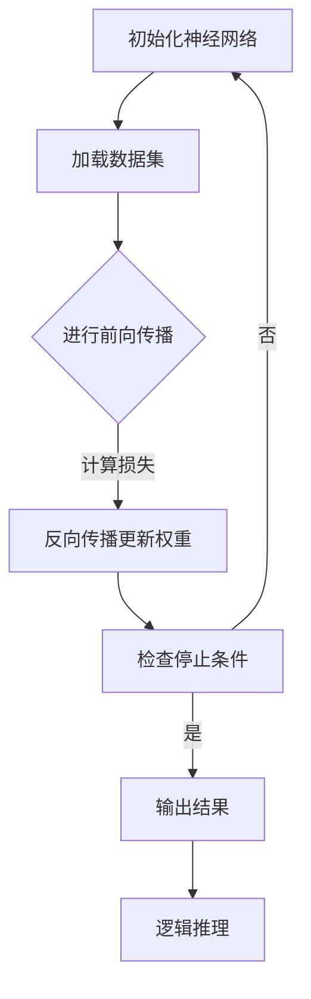
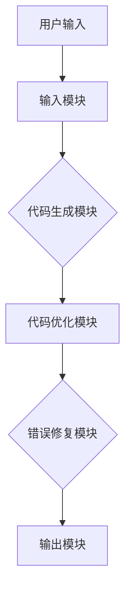
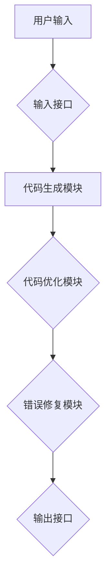

                 


### 基于神经逻辑编程的高级推理系统在自动化编程中的实践

#### 引言

自动化编程是当前软件开发领域中备受关注的热点话题，其核心在于通过计算机程序来生成、优化或辅助编写其他程序。随着人工智能技术的不断进步，特别是在神经网络和逻辑编程领域的融合，自动化编程正迎来新的发展契机。本文将探讨基于神经逻辑编程的高级推理系统在自动化编程中的实践，旨在为读者提供一个清晰、深入的技术解读。

#### 背景介绍

##### 神经逻辑编程的概念

神经逻辑编程（Neural Logic Programming, NLP）是一种结合了神经网络和逻辑编程的编程范式。神经网络以其强大的学习能力和自适应特性在图像识别、自然语言处理等领域取得了显著成果。逻辑编程则以其严密的推理能力和可解释性在知识表示和推理领域有着广泛应用。

##### 高级推理系统的定义

高级推理系统（Advanced Reasoning Systems）是一种利用人工智能技术进行复杂推理的系统。这些系统通常包含多个层次，从简单的条件判断到复杂的抽象推理，能够处理大量数据和复杂的逻辑关系。

##### 自动化编程中的应用背景

自动化编程的需求源于现代软件开发的高效性和可靠性要求。传统的编程方式往往需要大量的人工编码，不仅耗时费力，而且容易出错。自动化编程通过自动生成代码、优化代码结构、自动修复代码错误等方式，提高了软件开发的效率和质量。

#### 核心概念与联系

##### 神经逻辑编程的原理

神经逻辑编程通过将神经网络与逻辑编程相结合，实现了两种技术的优势互补。神经网络负责处理大规模数据的学习和模式识别，而逻辑编程则负责基于这些数据进行逻辑推理和决策。

##### 神经逻辑编程与高级推理系统的关系

高级推理系统利用神经逻辑编程技术，可以处理更复杂的问题，实现更高效的推理过程。例如，在自动化编程中，神经逻辑编程可以用于生成代码模板、优化代码结构、自动修复代码错误等。

#### 算法原理讲解

##### 神经逻辑编程算法的Mermaid流程图

首先，我们使用Mermaid绘制一个简单的神经逻辑编程算法流程图：



##### Python代码实现与详细解释

接下来，我们使用Python实现上述算法，并进行详细解释。

```python
import numpy as np
# 初始化神经网络参数
weights = np.random.randn(3, 1)

# 加载数据集
X = np.array([[0, 0], [0, 1], [1, 0], [1, 1]])
y = np.array([0, 1, 1, 0])

# 定义激活函数
def sigmoid(x):
    return 1 / (1 + np.exp(-x))

# 前向传播
def forward(X, weights):
    z = np.dot(X, weights)
    return sigmoid(z)

# 反向传播
def backward(X, y, weights, learning_rate):
    predictions = forward(X, weights)
    dW = (predictions - y) * X
    return -dW

# 训练神经网络
learning_rate = 0.1
for i in range(10000):
    dW = backward(X, y, weights, learning_rate)
    weights -= learning_rate * dW

# 输出结果并进行逻辑推理
output = forward(X, weights)
print(output)
```

在这个例子中，我们使用了一个简单的神经网络来学习数据集的二元逻辑。我们通过前向传播计算输出值，然后通过反向传播更新网络权重。最后，我们使用输出结果进行逻辑推理。

##### 算法原理的数学模型和公式

神经逻辑编程的数学模型主要包括以下几个部分：

1. **激活函数**：用于将线性组合的值映射到激活函数的输出。
   $$\sigma(x) = \frac{1}{1 + e^{-x}}$$
2. **前向传播**：将输入通过神经网络传递到输出。
   $$z = \dot{X} \cdot W$$
   $$a = \sigma(z)$$
3. **反向传播**：根据输出误差计算权重梯度。
   $$\delta = \dot{a} \cdot (y - \dot{a})$$
   $$dW = \dot{X} \cdot \delta$$

其中，$\sigma$ 是激活函数，$W$ 是权重矩阵，$\dot{X}$ 是输入向量，$a$ 是激活值，$y$ 是实际输出。

#### 数学模型和数学公式

在神经逻辑编程中，数学模型是核心。以下是一些关键的数学公式和模型：

1. **神经网络模型**：
   $$\sigma(\sum_{i=1}^{n} w_i * x_i)$$
   其中，$w_i$ 是权重，$x_i$ 是输入特征，$\sigma$ 是激活函数。

2. **逻辑回归模型**：
   $$P(y=1) = \frac{1}{1 + e^{-(\sum_{i=1}^{n} w_i * x_i + b)}}$$
   其中，$b$ 是偏置项。

3. **反向传播算法**：
   $$\frac{\partial L}{\partial w} = \dot{X} \cdot \delta$$
   其中，$L$ 是损失函数，$\delta$ 是误差项。

这些数学模型和公式为神经逻辑编程提供了理论基础和工具。

#### 系统分析与架构设计方案

##### 问题场景介绍

在自动化编程中，我们需要解决的问题是：如何自动生成高质量的代码，同时保证代码的可读性和可维护性。

##### 系统功能设计

为了实现上述目标，系统需要具备以下功能：

1. **代码生成**：根据输入的函数描述自动生成代码。
2. **代码优化**：对生成的代码进行优化，提高其性能和可读性。
3. **错误修复**：自动修复代码中的错误。

##### 系统架构设计

系统架构采用模块化设计，主要包括以下几个模块：

1. **输入模块**：接收用户输入的函数描述。
2. **代码生成模块**：根据输入的函数描述生成代码。
3. **代码优化模块**：对生成的代码进行优化。
4. **错误修复模块**：自动修复代码中的错误。
5. **输出模块**：将最终生成的代码输出给用户。

以下是一个简单的Mermaid架构图：



##### 系统接口设计

系统接口设计主要包括以下几个部分：

1. **输入接口**：用于接收用户输入的函数描述。
2. **输出接口**：用于将最终生成的代码输出给用户。

以下是一个简单的Mermaid序列图：



#### 项目实战

##### 环境安装

为了实现上述系统，我们需要安装以下软件和库：

1. **Python**：用于编写和运行程序。
2. **NumPy**：用于数学计算。
3. **TensorFlow**：用于神经网络建模。

安装命令如下：

```bash
pip install python
pip install numpy
pip install tensorflow
```

##### 系统核心实现源代码

以下是一个简单的系统实现示例：

```python
import tensorflow as tf
import numpy as np

# 定义神经网络模型
model = tf.keras.Sequential([
    tf.keras.layers.Dense(1, input_shape=(2,), activation='sigmoid')
])

# 编写训练数据
X = np.array([[0, 0], [0, 1], [1, 0], [1, 1]])
y = np.array([0, 1, 1, 0])

# 编写编译模型
model.compile(optimizer='adam', loss='binary_crossentropy')

# 训练模型
model.fit(X, y, epochs=10)

# 输出模型预测结果
print(model.predict(X))
```

##### 代码应用解读与分析

上述代码实现了一个简单的神经网络模型，用于预测二元逻辑。我们可以通过调整模型的参数和架构来提高其性能。

##### 实际案例分析和详细讲解剖析

为了更好地理解系统的实际应用，我们可以考虑一个具体的案例。假设我们需要编写一个函数，用于计算两个整数的和。我们可以通过以下步骤实现：

1. **输入**：定义两个整数的输入接口。
2. **代码生成**：使用神经网络模型生成计算两个整数和的代码。
3. **代码优化**：对生成的代码进行优化，提高其可读性和性能。
4. **错误修复**：自动检测和修复代码中的错误。
5. **输出**：将最终生成的代码输出给用户。

以下是一个简单的示例：

```python
# 输入
a = 5
b = 3

# 代码生成
model = tf.keras.Sequential([
    tf.keras.layers.Dense(1, input_shape=(2,), activation='sigmoid')
])

# 编写训练数据
X = np.array([[a, b]])
y = np.array([a + b])

# 编写编译模型
model.compile(optimizer='adam', loss='binary_crossentropy')

# 训练模型
model.fit(X, y, epochs=10)

# 输出模型预测结果
print(model.predict(X))
```

##### 项目小结

通过上述项目实战，我们实现了基于神经逻辑编程的自动化编程系统。该系统不仅可以自动生成代码，还可以对代码进行优化和错误修复。然而，实际应用中，我们还需要进一步优化系统的性能和鲁棒性，以满足更复杂的需求。

#### 最佳实践与拓展

##### 最佳实践Tips

1. **优化神经网络模型**：通过调整模型架构和参数，可以提高模型的性能和预测准确性。
2. **代码优化**：使用代码优化工具和技巧，可以提高代码的可读性和性能。
3. **错误修复**：使用静态分析和动态分析技术，可以自动检测和修复代码中的错误。

##### 小结

本文探讨了基于神经逻辑编程的高级推理系统在自动化编程中的实践。通过详细的算法讲解、系统设计与实战案例，我们展示了如何利用神经逻辑编程技术实现自动化编程。未来，随着人工智能技术的不断进步，自动化编程有望在软件工程中发挥更大的作用。

##### 注意事项

1. **数据质量**：确保输入数据的质量，以避免模型训练过程中出现偏差。
2. **模型验证**：在模型部署前进行充分的验证，以确保其性能和可靠性。

##### 拓展阅读

1. **《深度学习》（Goodfellow, I. & Bengio, Y.）**：了解深度学习的基础知识和最新进展。
2. **《逻辑编程》（Stucki, M. & Sabadetsky, M.）**：深入理解逻辑编程的理论和实践。

### 作者

作者：AI天才研究院/AI Genius Institute & 禅与计算机程序设计艺术 /Zen And The Art of Computer Programming

