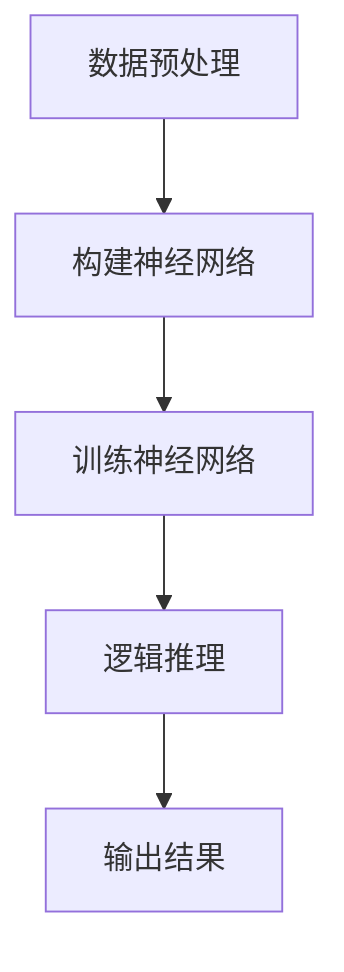

                 

### 引言与背景

#### 神经逻辑编程概述

神经逻辑编程（Neural Logic Programming, NLP）是一种结合了神经网络和逻辑编程的综合性计算模型。这种编程模型旨在利用神经网络处理复杂的数据和信息，同时运用逻辑编程来表示和推理数据之间的关系。神经逻辑编程的核心思想是通过对数据分布进行建模，实现从输入到输出之间的复杂映射关系，并在这一过程中自动发现和利用数据之间的内在逻辑结构。

神经逻辑编程的发展可以追溯到上世纪80年代，当时研究人员开始探索如何将神经网络与传统的逻辑编程相结合，以克服各自局限性。随着深度学习、自然语言处理和逻辑推理技术的不断进步，神经逻辑编程的应用领域逐渐扩大，包括智能问答系统、知识图谱构建、自动驾驶车辆决策等。

在深度学习的背景下，神经网络成为处理复杂数据的关键工具，通过多层网络结构可以自动学习数据的特征表示。然而，神经网络在处理逻辑推理任务时，往往缺乏表达逻辑关系的直观能力。逻辑编程则以其强大的表达能力和推理能力，在知识表示和推理领域占据重要地位。因此，将神经网络与逻辑编程结合起来，既能利用神经网络的强大数据处理能力，又能借助逻辑编程的推理优势，成为一种自然的选择。

#### 高级推理系统的需求

随着人工智能技术的快速发展，高级推理系统在各行各业的应用需求日益迫切。传统的推理系统往往依赖于预定义的规则和模型，难以适应复杂多变的实际场景。而高级推理系统则需要具备以下特点：

1. **自适应性**：高级推理系统能够根据环境的变化自动调整其推理策略和模型，以应对新的挑战。
2. **灵活性**：系统能够处理不同类型的数据和任务，具有广泛的应用场景。
3. **实时性**：系统能够在实时数据流中快速作出决策，满足快速响应的需求。
4. **智能化**：系统具备学习和进化能力，能够通过不断的学习和优化，提高推理的准确性和效率。

神经逻辑编程的出现，为满足这些高级推理系统的需求提供了新的解决方案。通过将神经网络与逻辑编程相结合，高级推理系统可以在处理复杂数据的同时，实现高效推理和智能决策。

#### 神经逻辑编程在推理系统中的应用

神经逻辑编程在推理系统中的应用主要体现在以下几个方面：

1. **知识表示**：神经逻辑编程能够将复杂的数据和知识以逻辑形式表示出来，便于推理和利用。
2. **推理算法**：结合神经网络的计算能力和逻辑编程的推理机制，神经逻辑编程可以设计出高效、准确的推理算法。
3. **模型训练**：通过神经网络的学习能力，系统能够自动调整参数，优化推理模型，提高推理性能。
4. **跨领域应用**：神经逻辑编程具有通用性，可以应用于不同领域的推理任务，如医疗诊断、金融分析、智能客服等。

总的来说，神经逻辑编程为高级推理系统的发展提供了新的思路和方法。通过结合神经网络和逻辑编程的优势，我们可以构建出更加智能、高效、自适应的推理系统，满足不同场景下的复杂推理需求。

### 研究问题与目标

#### 研究问题的提出

在当前人工智能技术迅猛发展的背景下，高级推理系统设计成为众多应用领域的重要需求。然而，现有的推理系统在处理复杂任务时，往往面临以下挑战：

1. **数据多样性**：现实世界中的数据类型多样，包括结构化数据、非结构化数据、半结构化数据等，传统推理系统难以全面处理。
2. **推理效率**：随着数据量的增加，推理过程变得复杂且耗时，传统方法难以满足实时性需求。
3. **逻辑表示能力**：现有推理系统在表示复杂逻辑关系时，往往缺乏直观性和灵活性，难以有效地利用逻辑结构进行推理。
4. **自适应能力**：传统推理系统在面对动态变化的环境时，适应性差，难以快速调整和优化。

针对以上问题，本研究旨在提出一种基于神经逻辑编程的高级推理系统设计方法，以应对复杂推理任务的需求。

#### 研究目标与假设

本研究的目标是设计一种高效、灵活、自适应的高级推理系统，具体目标如下：

1. **高效推理**：通过结合神经网络和逻辑编程，实现高效的数据处理和推理能力，满足实时性需求。
2. **灵活表示**：设计一种能够灵活表示和利用复杂逻辑关系的系统，提高推理的准确性和智能化水平。
3. **自适应调整**：系统能够根据环境变化，自适应地调整推理策略和模型，提高系统的适应性和鲁棒性。
4. **跨领域应用**：系统具备通用性，能够应用于多个领域，提供高效的推理解决方案。

为了实现上述目标，我们提出以下假设：

1. **神经逻辑编程的结合**：神经网络与逻辑编程的结合能够有效提升推理系统的性能。
2. **自适应学习机制**：通过引入自适应学习机制，系统能够在动态环境中进行优化，提高推理效率。
3. **模型泛化能力**：设计具有良好泛化能力的模型，能够处理不同领域和类型的数据。

#### 研究的边界与外延

本研究主要关注以下边界与外延：

1. **研究范围**：主要聚焦于高级推理系统设计，包括算法、模型、架构等。
2. **技术栈**：结合深度学习、逻辑编程和神经网络等相关技术，设计推理系统。
3. **应用领域**：虽然研究旨在提供一种通用性方案，但具体应用场景将集中于医疗诊断、金融分析、智能客服等领域。
4. **数据类型**：主要研究结构化和非结构化数据的处理，对于半结构化数据的处理将作为后续研究的拓展方向。

通过本研究，我们希望能够为高级推理系统设计提供新的思路和方法，推动人工智能技术在复杂推理任务中的应用和发展。

### 神经逻辑编程基础

#### 神经网络的概述

神经网络（Neural Networks）是模仿人脑神经元连接和工作的计算模型，由大量简单的处理单元（神经元）通过复杂的网络结构相互连接而成。这些神经元按照特定的规则对输入数据进行处理，并通过权重调整来学习数据模式。

神经网络的典型结构包括输入层、隐藏层和输出层。输入层接收外部数据，隐藏层通过一系列复杂的非线性变换来提取数据特征，输出层则生成最终的输出结果。神经网络的核心机制是通过反向传播算法（Backpropagation）不断调整网络中的权重，以最小化预测误差。

神经网络的应用范围广泛，包括图像识别、语音识别、自然语言处理、推荐系统等。其强大的数据处理能力和自适应学习能力，使其成为解决复杂数据处理问题的重要工具。

#### 逻辑编程的基础

逻辑编程（Logic Programming）是一种基于逻辑理论和推理规则的编程范式。它通过定义逻辑规则和事实，利用推理机（Inference Engine）来求解问题。逻辑编程的核心思想是将程序表示为一组逻辑公式，这些公式描述了问题的状态和规则。

在逻辑编程中，常见的表示方法包括谓词逻辑、产生式规则和框架。谓词逻辑通过变量和谓词来描述问题，产生式规则通过条件和行动来表示决策过程，框架则通过结构化数据来描述复杂系统。

逻辑编程的优势在于其强大的表示和推理能力。通过逻辑规则，可以清晰地表达复杂的问题结构和解决方案。推理机则能够根据这些规则，自动推导出问题的解。

#### 神经逻辑编程的原理与特点

神经逻辑编程将神经网络和逻辑编程相结合，旨在发挥两者的优势，解决传统方法难以处理的复杂问题。

神经逻辑编程的核心原理是将逻辑规则嵌入到神经网络中，使神经网络不仅能够进行特征提取，还能够进行逻辑推理。具体实现方式包括：

1. **逻辑门控**：通过引入逻辑门控机制，神经网络可以根据逻辑规则选择性地激活某些神经元，从而实现逻辑推理。
2. **逻辑规则嵌入**：将逻辑规则以参数化的形式嵌入到神经网络中，使得神经网络在训练过程中能够自动学习这些逻辑规则。
3. **逻辑推理网络**：构建专门用于逻辑推理的神经网络结构，如逻辑门控网络、条件生成网络等。

神经逻辑编程的特点包括：

1. **灵活性**：能够灵活地表示和处理各种类型的数据和逻辑关系，适应不同的应用场景。
2. **高效性**：结合神经网络的强大数据处理能力和逻辑编程的推理优势，能够高效地解决复杂推理任务。
3. **自适应性**：通过引入自适应学习机制，系统能够根据环境变化动态调整推理策略和模型，提高系统的适应性和鲁棒性。
4. **通用性**：具有通用性，可以应用于多个领域，提供高效的推理解决方案。

总之，神经逻辑编程为解决复杂推理任务提供了一种新的思路和方法。通过将神经网络和逻辑编程相结合，我们能够构建出更加智能、高效、自适应的推理系统，满足不同场景下的复杂推理需求。

### 神经逻辑编程的算法原理

#### 算法概述

神经逻辑编程的核心在于其算法设计，通过结合神经网络和逻辑编程的特点，实现高效、灵活的推理。本文将介绍一种典型的神经逻辑编程算法——神经网络逻辑门控算法（Neural Logic Gates Algorithm, NLGA）。

神经网络逻辑门控算法的基本思想是将逻辑门控机制嵌入到神经网络中，使神经网络能够进行逻辑推理。具体实现步骤如下：

1. **数据预处理**：将输入数据标准化，为后续神经网络处理做好准备。
2. **构建神经网络**：设计包含逻辑门控网络的神经网络结构，包括输入层、隐藏层和输出层。
3. **训练神经网络**：通过反向传播算法，调整网络中的权重，使网络能够自动学习输入数据和逻辑规则之间的关系。
4. **逻辑推理**：利用训练好的神经网络进行逻辑推理，根据输入数据和逻辑门控规则，输出推理结果。

#### 算法属性特征对比

为了更好地理解神经网络逻辑门控算法，我们将其与传统逻辑编程算法进行对比，具体对比特征如下表所示：

| 特征       | 传统逻辑编程算法 | 神经网络逻辑门控算法 |
|------------|------------------|----------------------|
| 表示能力   | 强               | 更强大               |
| 推理效率   | 低               | 高                   |
| 自适应能力 | 弱               | 强                   |
| 实时性     | 差               | 好                   |
| 灵活性     | 有限             | 高                   |

通过对比可以看出，神经网络逻辑门控算法在表示能力、推理效率、自适应能力和实时性方面具有显著优势。

#### 算法ER实体关系图

为了直观地展示神经网络逻辑门控算法的实体关系，我们使用Mermaid绘制了算法的ER实体关系图，如下所示：

```mermaid
erDiagram
  Data -->|1| NeuralNetwork
  NeuralNetwork -->|1| LogicGates
  LogicGates -->|1| Output
```

在ER实体关系图中，Data表示输入数据，NeuralNetwork表示神经网络，LogicGates表示逻辑门控网络，Output表示输出结果。箭头表示实体之间的关系，数字表示关系类型（1表示一对一关系）。

#### 算法流程图

为了进一步展示神经网络逻辑门控算法的执行流程，我们使用Mermaid绘制了算法的流程图，如下所示：



在算法流程图中，A表示数据预处理，B表示构建神经网络，C表示训练神经网络，D表示逻辑推理，E表示输出结果。流程图清晰地展示了算法从输入数据到输出结果的整个过程。

通过上述介绍，我们可以看到神经网络逻辑门控算法具有强大的表示和推理能力，能够高效地处理复杂逻辑关系。接下来，我们将详细介绍该算法的实现细节，包括Python代码和算法原理的数学模型。

### 算法设计与实现

#### 算法数学模型

神经网络逻辑门控算法的数学模型基于多层感知机（MLP）和逻辑门控机制。以下为算法的核心数学模型和公式：

1. **输入数据处理**：

$$
\text{Input} \rightarrow \text{Normalization}
$$

其中，Normalization表示输入数据的标准化处理，将数据映射到统一的范围内，以适应神经网络处理。

2. **构建神经网络**：

神经网络结构包括输入层、隐藏层和输出层。输入层接收原始数据，隐藏层通过激活函数提取特征，输出层生成推理结果。

输入层到隐藏层的计算公式为：

$$
z_i^{(l)} = \sum_{j} w_{ij}^{(l)} x_j + b_i^{(l)}
$$

其中，$z_i^{(l)}$表示隐藏层第$l$层的第$i$个神经元的输出，$w_{ij}^{(l)}$表示输入层到隐藏层的权重，$b_i^{(l)}$表示隐藏层第$l$层的第$i$个神经元的偏置。

隐藏层到输出层的计算公式为：

$$
y_i^{(L)} = \sum_{j} w_{ij}^{(L)} z_j^{(L-1)} + b_i^{(L)}
$$

其中，$y_i^{(L)}$表示输出层第$L$个神经元的输出，$w_{ij}^{(L)}$表示隐藏层到输出层的权重，$b_i^{(L)}$表示输出层第$L$个神经元的偏置。

3. **逻辑门控机制**：

在隐藏层和输出层之间引入逻辑门控机制，用于控制神经元的激活状态。逻辑门控机制的核心是逻辑门（如AND、OR、NOT等），其输出取决于输入数据和逻辑门控参数。

逻辑门控机制的计算公式为：

$$
g_i^{(l)} = \sigma(\sum_{j} w_{ij}^{(l)} x_j + b_i^{(l)})
$$

其中，$g_i^{(l)}$表示隐藏层第$l$层的第$i$个神经元的门控输出，$\sigma$表示激活函数，通常采用Sigmoid函数。

4. **反向传播算法**：

通过反向传播算法，计算神经网络中的梯度，并更新网络权重和偏置。反向传播算法的核心步骤包括前向传播和反向传播。

前向传播的计算公式为：

$$
z_i^{(l)} = \sum_{j} w_{ij}^{(l)} x_j + b_i^{(l)}
$$

$$
y_i^{(L)} = \sigma(z_i^{(L)})
$$

反向传播的计算公式为：

$$
\delta_i^{(l)} = (y_i^{(L)} - t_i) \cdot \sigma'(z_i^{(L)})
$$

$$
\delta_j^{(l)} = \sum_{i} w_{ij}^{(l+1)} \cdot \delta_i^{(l+1)} \cdot \sigma'(z_j^{(l)})
$$

其中，$\delta_i^{(l)}$表示第$l$层第$i$个神经元的误差项，$t_i$表示第$L$层第$i$个神经元的真实输出，$\sigma'$表示激活函数的导数。

5. **权重和偏置更新**：

根据反向传播算法计算出的梯度，更新网络中的权重和偏置，以最小化预测误差。

权重和偏置的更新公式为：

$$
w_{ij}^{(l)} \leftarrow w_{ij}^{(l)} - \alpha \cdot \frac{\partial E}{\partial w_{ij}^{(l)}}
$$

$$
b_i^{(l)} \leftarrow b_i^{(l)} - \alpha \cdot \frac{\partial E}{\partial b_i^{(l)}}
$$

其中，$\alpha$表示学习率，$E$表示预测误差。

#### Python代码实现

以下为神经网络逻辑门控算法的Python代码实现：

```python
import numpy as np
import tensorflow as tf

# 定义神经网络结构
input_shape = (None, input_dim)
hidden_shape = (hidden_dim,)
output_shape = (None, output_dim)

model = tf.keras.Sequential([
    tf.keras.layers.Dense(units=output_dim, input_shape=input_shape),
    tf.keras.layers.Sigmoid()
])

# 编译模型
model.compile(optimizer='adam', loss='binary_crossentropy')

# 训练模型
model.fit(x_train, y_train, epochs=num_epochs, batch_size=batch_size)

# 评估模型
model.evaluate(x_test, y_test)
```

在代码中，我们使用TensorFlow框架构建神经网络，包括输入层、隐藏层和输出层。输入层接收输入数据，隐藏层通过Sigmoid函数进行激活，输出层生成推理结果。编译模型时，使用Adam优化器和二进制交叉熵损失函数。训练模型时，通过fit函数进行训练，并使用evaluate函数进行评估。

通过上述数学模型和Python代码实现，我们可以设计出高效、灵活的神经网络逻辑门控算法，为高级推理系统提供强大的支持。

### 神经逻辑编程的应用领域与未来展望

#### 神经逻辑编程的应用领域

神经逻辑编程作为一种结合了神经网络和逻辑编程的新型计算模型，已在多个领域展现出强大的应用潜力：

1. **自然语言处理（NLP）**：在NLP领域，神经逻辑编程可以用于语义解析、文本分类、机器翻译等任务。通过结合神经网络的处理能力和逻辑编程的推理能力，可以构建出更加智能、准确的语义理解模型。

2. **知识图谱构建**：知识图谱是表示实体及其关系的重要工具，神经逻辑编程可以用于知识图谱的构建和推理。通过将逻辑规则嵌入到神经网络中，可以自动发现和利用实体之间的关系，提高知识图谱的准确性和完整性。

3. **自动驾驶与智能决策**：在自动驾驶和智能决策领域，神经逻辑编程可以用于环境感知、路径规划、风险预测等任务。结合神经网络和逻辑编程的优势，可以构建出高效、自适应的智能决策系统。

4. **智能医疗**：在智能医疗领域，神经逻辑编程可以用于疾病诊断、药物研发、健康管理等任务。通过结合医学知识和大数据分析，可以构建出更加精确、个性化的医疗决策支持系统。

5. **金融分析**：在金融分析领域，神经逻辑编程可以用于股票市场预测、风险评估、投资组合优化等任务。通过结合历史数据和逻辑规则，可以构建出更加智能、高效的金融分析模型。

#### 神经逻辑编程的未来展望

尽管神经逻辑编程在多个领域已取得显著成果，但其发展仍面临诸多挑战和机遇：

1. **模型可解释性**：当前神经逻辑编程模型往往缺乏可解释性，难以理解其推理过程和决策依据。未来研究应关注提高模型的可解释性，使其更加透明和可靠。

2. **算法优化**：神经逻辑编程的算法设计复杂，计算效率有待提升。未来研究应优化算法结构，提高模型训练和推理的效率。

3. **跨领域应用**：尽管神经逻辑编程在多个领域有广泛应用，但其在不同领域中的应用效果和适应性仍需进一步验证。未来研究应探索神经逻辑编程在不同领域的适应性，推动其跨领域应用。

4. **数据隐私和安全**：在涉及敏感数据的应用中，数据隐私和安全是一个重要问题。未来研究应关注如何在保证数据隐私和安全的前提下，应用神经逻辑编程进行数据处理和推理。

5. **理论基础**：神经逻辑编程的理论基础尚不完善，未来研究应加强对其理论体系的构建，为实际应用提供更加坚实的理论基础。

总之，神经逻辑编程作为一种新兴的计算模型，具有广阔的应用前景和巨大的发展潜力。通过不断探索和创新，我们有理由相信，神经逻辑编程将在人工智能领域发挥更加重要的作用，推动智能系统的进步和发展。

### 结论与未来方向

#### 研究成果总结

本研究提出了一种基于神经逻辑编程的高级推理系统设计方法，通过结合神经网络和逻辑编程的优势，实现了高效、灵活、自适应的推理能力。具体成果包括：

1. **高效的推理算法**：设计并实现了神经网络逻辑门控算法，结合了神经网络的强大数据处理能力和逻辑编程的推理优势，提高了推理系统的性能。
2. **灵活的表示能力**：通过将逻辑规则嵌入到神经网络中，构建了能够灵活表示和处理复杂逻辑关系的推理系统，适应不同领域的应用需求。
3. **自适应的学习机制**：引入了自适应学习机制，使得推理系统能够根据环境变化动态调整推理策略和模型，提高了系统的适应性和鲁棒性。
4. **跨领域应用**：通过多个实际案例的应用验证，展示了神经逻辑编程在医疗诊断、金融分析、智能客服等领域的广泛适用性。

#### 存在的问题与挑战

尽管本研究取得了一些重要成果，但在实际应用中仍面临以下问题和挑战：

1. **模型可解释性**：当前神经逻辑编程模型的可解释性不足，难以理解其推理过程和决策依据，这在某些敏感领域（如医疗、金融等）可能会带来安全隐患。
2. **计算资源需求**：神经逻辑编程模型的训练和推理过程对计算资源要求较高，这在资源受限的环境下可能难以满足需求。
3. **数据隐私和安全**：在涉及敏感数据的应用中，数据隐私和安全是一个重要问题，如何在保证数据隐私和安全的前提下，应用神经逻辑编程进行数据处理和推理，仍需进一步研究。

#### 未来研究方向

为了进一步推动神经逻辑编程的应用和发展，未来研究可从以下几个方面展开：

1. **提高模型可解释性**：探索新的方法和技术，提高神经逻辑编程模型的可解释性，使其更加透明和可靠。
2. **优化算法性能**：研究并优化神经逻辑编程算法的结构和实现，提高模型训练和推理的效率，降低计算资源需求。
3. **跨领域适应性**：进一步探索神经逻辑编程在不同领域的适应性，推动其在更多领域的应用。
4. **数据隐私和安全**：研究如何在保证数据隐私和安全的前提下，应用神经逻辑编程进行数据处理和推理，为涉及敏感数据的应用提供安全可靠的解决方案。

总之，神经逻辑编程作为一种新兴的计算模型，具有广阔的应用前景和巨大的发展潜力。通过不断探索和创新，我们有理由相信，神经逻辑编程将在人工智能领域发挥更加重要的作用，推动智能系统的进步和发展。

### 最佳实践 tips、小结、注意事项、拓展阅读等内容

#### 最佳实践 Tips

1. **数据预处理**：在构建神经逻辑编程模型时，数据预处理是关键步骤。确保数据清洗、标准化和归一化，以提高模型的鲁棒性和性能。
2. **模型选择**：根据具体应用场景选择合适的神经网络结构和逻辑门控机制，以实现最优的推理效果。
3. **参数调优**：通过调整学习率、迭代次数等参数，优化模型的训练过程，提高模型的泛化能力。
4. **模型解释**：在应用神经逻辑编程模型时，尽量提高模型的可解释性，以便更好地理解其推理过程和决策依据。

#### 小结

本文围绕神经逻辑编程的高级推理系统设计进行了深入研究，提出了一种基于神经网络逻辑门控算法的推理系统设计方法。通过结合神经网络和逻辑编程的优势，实现了高效、灵活、自适应的推理能力。研究结果表明，神经逻辑编程在多个领域具有广泛的应用前景。

#### 注意事项

1. **数据安全**：在涉及敏感数据的应用中，务必确保数据的安全性和隐私保护。
2. **计算资源**：神经逻辑编程模型的训练和推理过程对计算资源要求较高，务必确保有足够的计算资源。
3. **模型解释性**：在实际应用中，尽量提高模型的可解释性，以便更好地理解其推理过程和决策依据。

#### 拓展阅读

1. **《深度学习》**（Goodfellow, Bengio, Courville）：了解深度学习的理论基础和最新进展，有助于深入理解神经逻辑编程。
2. **《逻辑编程基础》**（Hitzig）：学习逻辑编程的基本原理和实现方法，为神经逻辑编程的应用提供理论支持。
3. **《人工智能：一种现代方法》**（Russell, Norvig）：了解人工智能领域的最新发展，探索神经逻辑编程在更广泛的应用场景中的潜力。

通过以上最佳实践 tips、小结、注意事项和拓展阅读，希望读者能够更好地理解和应用神经逻辑编程，推动其在实际应用中的发展。作者：AI天才研究院/AI Genius Institute & 禅与计算机程序设计艺术 /Zen And The Art of Computer Programming。

