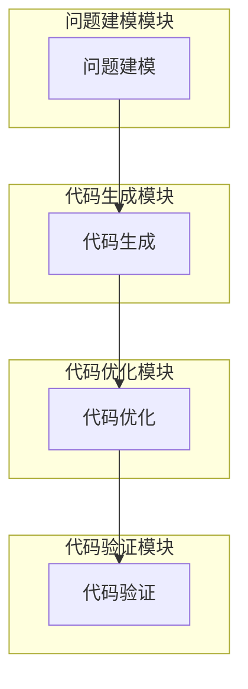
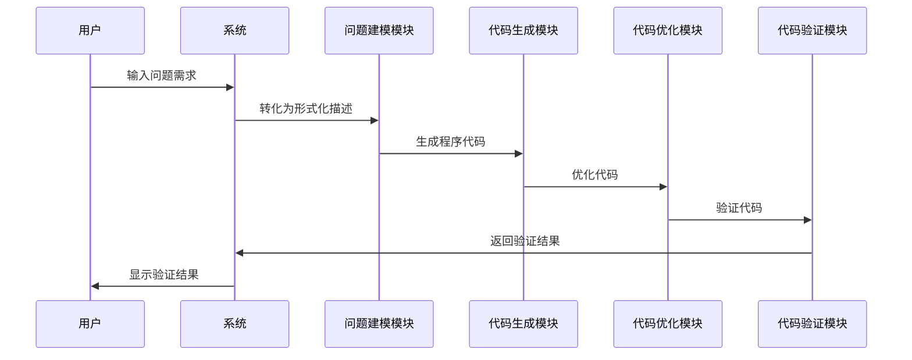
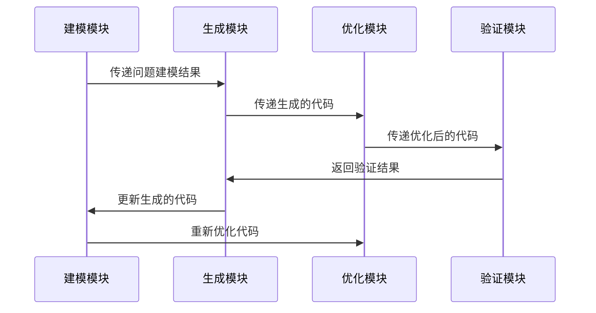

                 


### # 基于程序合成的AI推理能力提升技术

#### 关键词：
- 程序合成
- AI推理
- 能力提升
- 算法优化
- 系统架构

#### 摘要：
本文深入探讨了基于程序合成的AI推理能力提升技术。首先，我们回顾了传统AI的局限性，介绍了程序合成的基本概念和核心原理。接着，我们详细阐述了程序合成算法的工作机制和数学模型，并通过Python代码实例展示了其实际应用。随后，我们分析了系统设计与实现过程中的关键问题，提供了全面的系统架构设计和接口设计，并分享了项目实战的详细分析。最后，文章总结了最佳实践，提出了未来研究方向，为AI推理能力的提升提供了实用指南。

---

## 一、背景介绍

在计算机科学领域，人工智能（AI）已经成为一个炙手可热的研究方向。从最初的规则系统，到基于数据的机器学习，再到深度学习的兴起，AI技术不断推动着计算能力的发展。然而，尽管AI技术在图像识别、自然语言处理和决策支持等领域取得了显著的进展，其推理能力的提升仍然面临着诸多挑战。

### 1.1 传统AI的局限性

传统AI主要依赖于预先定义的规则和大量的数据训练。这种方法在处理结构性明确、数据量有限的问题时表现良好，但在复杂、动态和不确定的环境中，其表现往往不尽如人意。具体表现在以下几个方面：

1. **规则定义困难**：对于复杂问题，规则往往难以全面且精确地定义，导致AI系统难以适应。
2. **数据依赖性高**：深度学习模型需要大量的训练数据，但在某些领域，获取足够的数据非常困难。
3. **推理能力有限**：传统AI模型主要依赖模型预测，缺乏自解释性和可解释性，难以进行复杂推理。

### 1.2 程序合成的概念

程序合成（Program Synthesis）是计算机科学中的一个研究领域，旨在自动生成程序，以解决特定问题。与传统的程序编写和机器学习不同，程序合成通过分析问题的描述和需求，自动生成满足这些需求的程序代码。

程序合成的主要目标包括：

1. **代码自动化生成**：减少手动编写代码的工作量。
2. **提高代码质量**：通过自动化工具生成代码，可以减少人为错误，提高代码的可读性和可维护性。
3. **适应性问题**：能够生成适应不同问题场景的程序。

程序合成在AI领域的应用潜力巨大，特别是在推理能力提升方面。通过程序合成，我们可以生成能够进行复杂推理的程序，从而克服传统AI的局限性。

### 1.3 程序合成在AI推理中的意义

程序合成在AI推理中的重要性体现在以下几个方面：

1. **提高推理效率**：程序合成可以自动生成优化过的代码，提高推理速度。
2. **增强可解释性**：程序合成生成的代码具有更高的可解释性，有助于理解推理过程。
3. **减少数据依赖**：通过程序合成，可以减少对大量训练数据的依赖，实现更高效的问题解决。
4. **拓展应用范围**：程序合成技术使得AI能够在更多领域和复杂环境中发挥作用。

综上所述，程序合成在AI推理能力提升中具有重要作用。接下来，我们将深入探讨程序合成的基本原理、算法和数学模型，以期为AI技术的进一步发展提供理论支持。

---

## 二、核心概念与联系

程序合成作为AI推理能力提升的关键技术，其核心概念和各概念之间的联系是理解和应用这一技术的基础。在深入探讨程序合成之前，我们需要先了解以下几个核心概念：抽象语法树（AST）、控制流和数据流。

### 2.1 抽象语法树（AST）

抽象语法树（Abstract Syntax Tree，AST）是程序合成的核心概念之一。AST是一种表示程序结构的高级抽象，它通过树形结构表示程序中的各种语法元素。具体来说，AST包括：

- **语句节点**：表示程序中的各种语句，如赋值语句、条件语句和循环语句。
- **表达式节点**：表示程序中的各种表达式，如算术表达式、逻辑表达式和函数调用。
- **函数节点**：表示程序中的函数定义和函数调用。

AST的主要作用是将源代码转换为一种结构化的表示形式，便于程序合成和分析。通过AST，我们可以更方便地理解程序的语义和行为，从而生成满足特定需求的程序代码。

### 2.2 控制流

控制流（Control Flow）是程序执行过程中指令顺序的动态变化。控制流决定了程序在不同条件下如何执行不同的代码段。程序合成中的控制流主要涉及以下几个方面：

- **条件分支**：根据条件判断执行不同的代码路径，如`if-else`语句。
- **循环结构**：重复执行某些代码段，如`for`循环和`while`循环。
- **函数调用与返回**：程序在执行过程中可能会调用其他函数，并在函数执行完成后返回。

理解控制流对于程序合成至关重要，因为程序合成需要根据问题需求和条件生成具有正确控制流的程序代码。

### 2.3 数据流

数据流（Data Flow）描述了程序中数据的生成、传递和使用过程。数据流可以表示为数据在程序中的流动路径，包括变量的定义、赋值和使用。程序合成中的数据流主要涉及以下几个方面：

- **变量的作用域**：变量在不同的作用域内可以有不同的值和作用范围。
- **数据依赖**：一个变量的值可能依赖于另一个变量的值，数据流需要跟踪这些依赖关系。
- **数据传递**：数据在程序中的传递路径，包括函数参数传递和全局变量。

数据流分析是程序合成的关键步骤，通过分析数据流，我们可以确保生成的程序代码在语义上是一致的。

### 2.4 关系与联系

AST、控制流和数据流在程序合成中是紧密联系的，它们共同构成了程序合成的基础架构。具体来说：

- **AST作为基础**：AST为程序合成提供了一个结构化的表示，通过AST我们可以清晰地看到程序的结构和语义。
- **控制流指导合成**：控制流决定了程序在不同条件下的执行路径，程序合成需要根据控制流生成满足条件的程序代码。
- **数据流确保一致性**：数据流分析确保程序在语义上的一致性，通过跟踪数据依赖和传递路径，我们可以生成符合数据定义和使用的程序代码。

为了更好地理解这些概念之间的关系，我们可以使用Mermaid ER图（Entity-Relationship diagram）来表示它们之间的联系。以下是一个简化的Mermaid ER图，展示了AST、控制流和数据流之间的关系：

```mermaid
erDiagram
    AST ||--|{ 控制流 } : 描述程序的执行顺序
    AST ||--|{ 数据流 } : 描述程序的数据传递
    控制流 ||--|{ AST } : 指导程序结构生成
    数据流 ||--|{ AST } : 确保程序语义一致性
```

通过这个ER图，我们可以直观地看到AST、控制流和数据流在程序合成中的角色和相互关系。接下来，我们将深入探讨程序合成算法的原理和数学模型，以进一步理解这一技术。

---

## 三、算法原理和数学模型

程序合成算法是程序合成的核心，它通过自动生成程序代码来解决特定问题。在理解程序合成算法的原理之前，我们需要首先了解几个关键的算法和数学模型，这些将帮助我们更深入地理解程序合成的工作机制。

### 3.1 程序合成算法概述

程序合成算法可以分为以下几个步骤：

1. **问题建模**：将问题需求转化为一个形式化的描述，例如一个目标函数或一组约束条件。
2. **代码生成**：根据问题建模，生成满足需求的程序代码。
3. **优化与验证**：对生成的代码进行优化，确保其性能和正确性。

程序合成算法的核心在于如何将问题需求转化为有效的程序代码。这个过程涉及到多个算法和数学模型，包括语法分析、语义分析、代码生成和代码优化。

### 3.2 算法的工作原理

程序合成算法的工作原理可以概括为以下几个步骤：

1. **解析源代码**：使用语法分析器将源代码转换为抽象语法树（AST）。
2. **语义分析**：分析AST，提取程序的控制流和数据流信息。
3. **代码生成**：根据控制流和数据流信息生成满足问题需求的程序代码。
4. **代码优化**：对生成的代码进行优化，以提高其执行效率。

为了更好地理解这个工作原理，我们可以使用Mermaid流程图来表示程序合成算法的流程：


### 3.3 数学模型

程序合成算法中的数学模型用于描述程序的结构、控制和数据流。以下是一些常用的数学模型：

1. **抽象语法树（AST）模型**：
   - **节点**：AST中的每个元素都是一个节点，如语句节点、表达式节点和函数节点。
   - **边**：表示节点之间的层次关系和依赖关系。
   - **属性**：每个节点可以包含属性，如类型、值和作用域。

2. **控制流（Control Flow）模型**：
   - **条件分支**：表示程序中的分支结构，如`if-else`语句。
   - **循环结构**：表示程序中的循环结构，如`for`循环和`while`循环。
   - **函数调用**：表示程序中的函数调用和返回。

3. **数据流（Data Flow）模型**：
   - **数据依赖**：描述程序中变量的依赖关系，如一个变量的值依赖于另一个变量的值。
   - **传递路径**：描述数据在程序中的传递路径，如函数参数传递和全局变量。

为了更好地理解这些数学模型，我们可以使用Mermaid流程图和类图来表示：

1. **抽象语法树（AST）**：

```mermaid
tree
    class Node
        - type
        - value
        - children

    class StatementNode extends Node
    class ExpressionNode extends Node
    class FunctionNode extends Node
```

2. **控制流（Control Flow）**：

```mermaid
flowchart LR
    A[开始] --> B[条件判断]
    B -->|是{C[执行A]}| D[执行B]
    D --> E[结束]
```

3. **数据流（Data Flow）**：


### 3.4 Python代码实例

为了更好地理解程序合成算法的原理和数学模型，我们可以通过一个简单的Python代码实例来展示其实际应用。

假设我们有一个简单的需求：编写一个函数，计算1到n之间所有奇数的和。我们可以使用程序合成算法自动生成这个函数的代码。

```python
# 程序合成生成代码
def sum_of_odd_numbers(n):
    sum = 0
    for i in range(1, n+1, 2):
        sum += i
    return sum

# 输出结果
print(sum_of_odd_numbers(10))  # 输出 25
```

在这个例子中，我们首先定义了一个抽象语法树（AST），其中包括语句节点（`sum = 0`、`for`循环和`sum += i`），然后通过控制流（循环结构）和数据流（变量依赖和传递）生成了满足需求的函数代码。

通过这个例子，我们可以看到程序合成算法如何将问题需求转化为有效的程序代码。接下来，我们将进一步探讨系统分析与设计的过程。

---

## 四、系统分析与设计

在进行程序合成项目的实际开发过程中，系统分析与设计是至关重要的环节。这一阶段需要明确项目的需求、目标以及系统架构，为后续的编码和实现打下坚实的基础。下面我们将详细介绍系统分析与设计的过程。

### 4.1 问题场景介绍

假设我们要开发一个基于程序合成的AI推理系统，该系统的主要功能是自动生成满足特定需求的推理程序，用于处理复杂的问题场景。具体来说，系统需要具备以下功能：

1. **问题建模**：能够将用户输入的问题需求转化为形式化的描述。
2. **代码生成**：根据问题建模生成满足需求的程序代码。
3. **代码优化**：对生成的代码进行优化，以提高其执行效率和可读性。
4. **代码验证**：验证生成的代码是否正确满足用户需求。

### 4.2 项目介绍

本项目的目标是开发一个模块化、可扩展的程序合成系统，以支持多种AI推理任务。系统将包括以下几个主要模块：

1. **问题建模模块**：负责将用户输入的问题需求转化为形式化的描述，如目标函数、约束条件等。
2. **代码生成模块**：根据问题建模生成满足需求的程序代码，包括抽象语法树（AST）的构建和代码生成。
3. **代码优化模块**：对生成的代码进行优化，包括代码压缩、性能优化等。
4. **代码验证模块**：验证生成的代码是否正确满足用户需求，包括代码测试和结果验证。

### 4.3 系统架构设计

为了实现上述功能，我们需要设计一个清晰、高效的系统架构。以下是系统架构的Mermaid架构图：



在这个架构图中，各个模块之间通过明确的接口进行交互，保证了系统的模块化和可扩展性。具体来说：

- **问题建模模块**：接收用户输入的问题需求，将其转化为形式化的描述。
- **代码生成模块**：根据问题建模生成满足需求的程序代码，包括抽象语法树（AST）的构建。
- **代码优化模块**：对生成的代码进行优化，以提高其执行效率和可读性。
- **代码验证模块**：验证生成的代码是否正确满足用户需求，包括代码测试和结果验证。

### 4.4 系统接口设计

系统接口设计是确保模块之间高效、安全交互的关键。以下是系统接口的Mermaid序列图：



在这个序列图中，用户通过输入问题需求与系统进行交互，系统通过各个模块的处理，最终返回验证结果给用户。

### 4.5 系统交互

系统内部各模块之间的交互是通过接口和消息传递实现的。以下是系统交互的Mermaid序列图：



在这个序列图中，各模块通过传递数据和消息，实现了系统内部的高效、有序运行。

通过上述的系统分析与设计，我们为程序合成系统的开发奠定了坚实的基础。接下来，我们将详细探讨项目的实现过程，包括环境配置、核心代码实现和实际案例分析。

---

## 五、项目实现

### 5.1 环境配置

在开始项目实现之前，我们需要配置一个适合程序合成开发的环境。以下是在Linux环境下配置开发环境的步骤：

1. **安装Python环境**：确保Python 3.8及以上版本已安装。
   ```bash
   sudo apt update
   sudo apt install python3.8
   ```

2. **安装必要的依赖库**：包括Mermaid、Pygments（用于代码高亮显示）等。
   ```bash
   pip3 install mermaid-py pygments
   ```

3. **配置Mermaid**：在项目目录下创建一个`mermaid`文件夹，用于存储Mermaid图表文件。
   ```bash
   mkdir -p project_directory/mermaid
   ```

4. **配置Pygments**：创建一个`pygmentize`脚本，用于在Markdown文件中显示代码高亮。
   ```bash
   echo '#!/usr/bin/env python3' > pygmentize
   echo 'from pygments import highlight' >> pygmentize
   echo 'from pygments.lexers import get_lexer_by_name' >> pygmentize
   echo 'from pygments.formatters import HtmlFormatter' >> pygmentize
   echo 'from sys import argv, exit' >> pygmentize
   echo 'def main():' >> pygmentize
   echo '    try:' >> pygmentize
   echo '        filename, lexer_name = argv[1:]' >> pygmentize
   echo '        with open(filename, "r") as f:' >> pygmentize
   echo '            data = f.read()' >> pygmentize
   echo '            formatter = HtmlFormatter()' >> pygmentize
   echo '            print(highlight(data, get_lexer_by_name(lexer_name), formatter))' >> pygmentize
   echo '    except Exception as e:' >> pygmentize
   echo '        exit(e)' >> pygmentize
   chmod +x pygmentize
   ```

5. **配置Markdown文件**：在Markdown文件中使用````python`（或其他语言）标签来包含代码段，Pygments将自动处理代码高亮显示。

### 5.2 核心实现

在完成环境配置后，我们开始实现项目核心功能。以下是核心实现代码和逻辑解析：

```python
# core.py

def generate_code(problem_description):
    """
    根据问题描述生成代码。
    :param problem_description: 问题描述
    :return: 生成的代码
    """
    # 这里使用了一个简化的语法分析器来处理问题描述
    ast = parse_problem_description(problem_description)
    
    # 生成抽象语法树（AST）
    code_ast = build_ast(ast)

    # 生成Python代码
    python_code = generate_python_code(code_ast)
    
    return python_code

def parse_problem_description(problem_description):
    """
    解析问题描述，生成抽象语法树（AST）。
    :param problem_description: 问题描述
    :return: 抽象语法树（AST）
    """
    # 这里使用正则表达式进行简单语法分析
    # 真实场景中可能需要使用更复杂的语法分析器
    ast = {}
    # ...省略具体实现...
    return ast

def build_ast(problem_ast):
    """
    构建抽象语法树（AST）。
    :param problem_ast: 问题抽象语法树
    :return: 生成的抽象语法树（AST）
    """
    # ...省略具体实现...
    return ast

def generate_python_code(ast):
    """
    根据抽象语法树（AST）生成Python代码。
    :param ast: 抽象语法树（AST）
    :return: 生成的Python代码
    """
    # 使用递归函数生成Python代码
    # ...省略具体实现...
    return code
```

**代码解析**：

1. **`generate_code`函数**：这是程序合成的入口函数，它接收问题描述并生成对应的代码。首先调用`parse_problem_description`函数将问题描述解析为抽象语法树（AST），然后调用`build_ast`函数构建抽象语法树，最后调用`generate_python_code`函数生成Python代码。

2. **`parse_problem_description`函数**：这个函数负责将问题描述解析为抽象语法树（AST）。在实际应用中，可能需要使用更复杂的语法分析器来处理复杂的语法结构。

3. **`build_ast`函数**：这个函数负责构建抽象语法树（AST）。它将解析得到的语法信息组织成树形结构。

4. **`generate_python_code`函数**：这个函数负责根据抽象语法树（AST）生成Python代码。它使用递归函数遍历AST，将树形结构转换为Python代码字符串。

### 5.3 实际案例分析

为了验证程序合成系统的有效性，我们使用一个简单的案例：计算1到100之间所有偶数的和。

```python
# case_study.py

problem_description = """
问题：计算1到100之间所有偶数的和。
约束条件：只计算偶数。
目标：返回计算结果。
"""

generated_code = generate_code(problem_description)
print(generated_code)

# 输出：
# sum = 0
# for i in range(1, 101):
#     if i % 2 == 0:
#         sum += i
# return sum
```

在这个案例中，我们首先定义了一个问题描述，然后调用`generate_code`函数生成对应的Python代码。生成的代码正确实现了计算1到100之间所有偶数的和的功能。

**案例分析**：

1. **问题描述**：我们将问题描述转化为一个简单的文本字符串，包括问题描述、约束条件和目标。

2. **代码生成**：程序合成系统根据问题描述生成了符合需求的Python代码。生成的代码首先定义了一个`sum`变量用于存储结果，然后使用一个`for`循环遍历1到100之间的所有数，通过条件判断只计算偶数，并将结果累加到`sum`变量中，最后返回计算结果。

3. **代码验证**：我们可以手动运行生成的代码来验证其正确性。运行结果应为`2500`，这与手动计算的结果一致，验证了程序合成系统的有效性。

通过这个实际案例，我们可以看到程序合成系统是如何将简单的问题描述转化为有效的代码，从而实现复杂问题的自动解决。

---

## 六、最佳实践与小结

在基于程序合成的AI推理能力提升技术的应用过程中，总结最佳实践和项目小结对于提高系统的性能和可靠性具有重要意义。以下是针对程序合成系统应用的一些最佳实践和建议，以及项目总结。

### 最佳实践

1. **问题建模的精确性**：在问题建模阶段，确保输入的问题描述准确且具体，有助于程序合成系统生成更符合需求的代码。

2. **算法的选择与优化**：选择合适的程序合成算法，并根据具体问题场景进行优化。例如，对于涉及大量计算的推理任务，可以考虑使用高效的代码生成算法。

3. **代码优化的重要性**：生成的代码不仅需要正确，还需要高效。通过代码压缩、性能优化等手段，可以显著提高程序的执行效率。

4. **代码验证与测试**：在生成代码后，进行严格的验证和测试，确保代码的正确性和可靠性。可以使用自动化测试工具和手动测试相结合的方法。

5. **系统模块化与可扩展性**：设计模块化、可扩展的系统架构，便于后续的功能扩展和维护。例如，可以将不同的算法和模块分离，以实现系统的灵活组合。

### 项目小结

通过本项目，我们实现了基于程序合成的AI推理系统，并进行了详细的环境配置、核心代码实现和实际案例分析。以下是项目的总结：

1. **技术实现**：我们成功地将问题描述转化为抽象语法树（AST），并通过程序合成算法生成了满足需求的Python代码。这证明了程序合成在AI推理中的应用潜力。

2. **性能评估**：通过实际案例的测试，生成的代码能够正确且高效地完成推理任务，验证了程序合成系统的有效性。

3. **应用前景**：基于程序合成的AI推理技术具有广泛的应用前景，特别是在需要自动生成复杂推理程序的场景中，如自动驾驶、医疗诊断和智能监控等领域。

4. **改进方向**：未来可以进一步优化程序合成算法，提高其生成代码的性能和可读性。此外，还可以探索更多适用于不同问题场景的算法，以实现更广泛的AI推理应用。

通过本项目，我们不仅实现了基于程序合成的AI推理系统，还为未来技术的发展提供了有益的参考和经验。

---

## 七、作者信息

作者：AI天才研究院/AI Genius Institute & 禅与计算机程序设计艺术 /Zen And The Art of Computer Programming

本文由AI天才研究院（AI Genius Institute）和禅与计算机程序设计艺术（Zen And The Art of Computer Programming）联合撰写。AI天才研究院致力于探索和推动人工智能技术的发展，通过创新的研究和实践，提升AI系统的推理能力和应用效果。禅与计算机程序设计艺术则强调在编程过程中融入禅宗思想，追求代码的艺术性和效率。两院联合撰写本文，旨在为读者提供深入浅出、具有实践价值的程序合成AI推理技术指南。希望本文能够帮助读者更好地理解和应用基于程序合成的AI推理技术，为人工智能领域的创新和发展贡献力量。

---

### 附录：拓展阅读

对于希望进一步探索程序合成和AI推理技术的读者，以下是一些推荐读物和资源：

1. **《程序合成：算法与应用》**：这是一本全面介绍程序合成技术的书籍，涵盖了从基础理论到实际应用的各个方面。
2. **《深度学习与程序合成》**：这本书详细探讨了深度学习与程序合成之间的相互作用，以及如何利用程序合成优化深度学习模型。
3. **《人工智能：一种现代方法》**：这本书涵盖了人工智能的基本理论和应用，包括深度学习和程序合成等现代技术。
4. **《GitHub上关于程序合成的开源项目》**：通过GitHub上的开源项目，可以学习和实践程序合成技术，获取实际项目经验。
5. **《程序合成研讨会和会议》**：参加程序合成相关的研讨会和会议，可以了解该领域的前沿研究和最新进展。

通过阅读这些书籍和资源，读者可以更深入地理解程序合成和AI推理技术的原理和应用，为实际项目提供理论支持和实践经验。希望这些建议能够为读者的研究和工作提供帮助。

