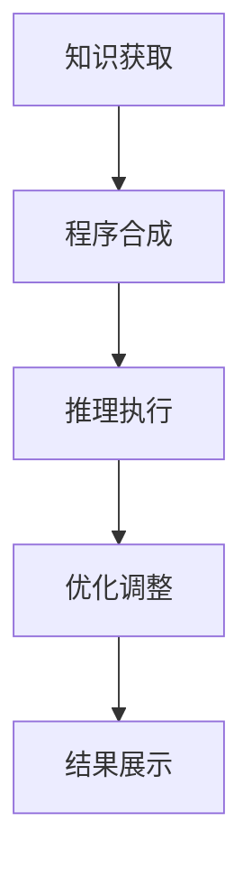
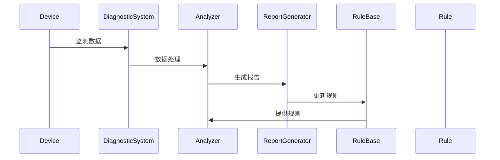
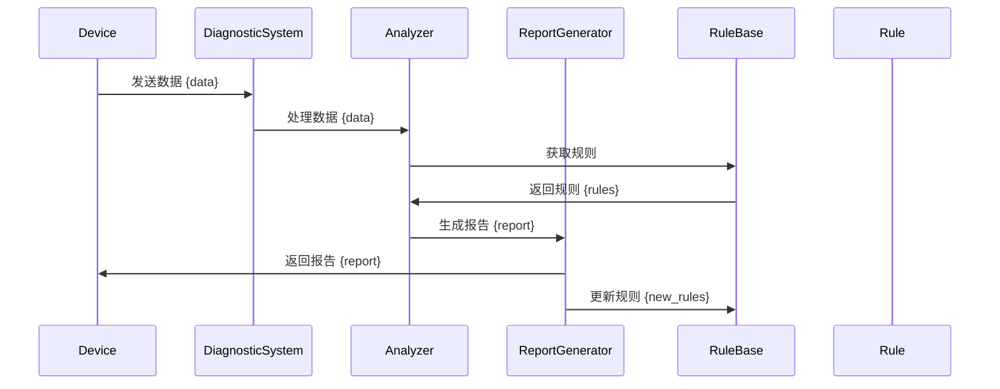

                 


## 引言：探索AI自动推理的新途径

### 问题背景

随着人工智能（AI）技术的飞速发展，自动推理系统在各个领域得到了广泛应用。从最初的符号逻辑、推理机到现代的神经网络、机器学习算法，自动推理系统在提升计算机解决问题的能力方面发挥了至关重要的作用。然而，现有的自动推理系统仍存在诸多挑战。例如，如何处理大规模、复杂的数据集？如何保证推理过程的效率和准确性？如何在不确定性和模糊性较高的环境中进行有效推理？这些问题成为了制约自动推理系统进一步发展的瓶颈。

### 解决思路

为了克服这些挑战，研究者们开始探索新的途径，其中程序合成技术引起了广泛关注。程序合成，即自动生成程序的技术，通过分析问题域的知识和约束条件，生成满足特定需求的程序。程序合成不仅能够提高开发效率，还能在一定程度上解决自动推理系统中存在的复杂性和不确定性问题。

基于程序合成的AI自动推理系统，旨在利用程序合成的优势，解决现有自动推理系统面临的难题。这种系统通过将程序合成技术与自动推理相结合，实现更高效、更准确的推理过程。具体来说，系统将分析问题域的知识，自动生成能够进行推理的程序，并在推理过程中不断优化和调整程序。

### 设计目标与系统架构

设计目标：
1. **高效性**：在保证推理准确性的前提下，提高推理过程的速度和效率。
2. **准确性**：确保推理结果的可靠性，减少错误和误导。
3. **灵活性**：系统能够适应不同领域和场景的需求，具备较强的通用性。
4. **可扩展性**：系统能够方便地集成新的算法和技术，不断优化和更新。

系统架构：
1. **知识获取模块**：负责从问题域中获取相关知识和约束条件。
2. **程序合成模块**：基于获取的知识，自动生成推理程序。
3. **推理引擎模块**：执行推理程序，生成推理结果。
4. **优化模块**：在推理过程中，对程序进行实时优化，提高效率。
5. **用户接口模块**：提供与用户的交互界面，展示推理结果和系统状态。

通过这样的架构设计，基于程序合成的AI自动推理系统将能够更好地应对复杂的问题，提供高效的解决方案。接下来的章节将详细探讨这一系统的工作原理、实现方法和应用实例。

### 小结

本文引出了基于程序合成的AI自动推理系统设计这一主题，阐述了问题的背景和解决思路，并介绍了系统设计的目标和架构。在接下来的章节中，我们将一步步深入探讨这一系统的核心概念、算法原理、数学模型、系统架构以及项目实战，以帮助读者全面了解和掌握这一先进的技术。

---

## 核心概念与联系

### 程序合成

程序合成，是指通过自动化手段，根据一定的规则和约束，从零开始生成可执行的程序代码。这一技术已经在软件工程领域得到了广泛应用，其核心思想是通过抽象和模式识别，将复杂的问题分解为可管理的子问题，然后自动生成解决这些子问题的代码。

在自动推理系统中，程序合成可以发挥重要作用。例如，通过程序合成技术，可以自动生成用于验证系统设计、验证数学公式的程序，从而减少人工验证的工作量。此外，程序合成还能够帮助生成用于推理过程的辅助程序，如数据预处理、规则抽取和模式识别等。

### 自动推理

自动推理是指利用计算机系统自动发现和证明逻辑结论的过程。这一过程通常涉及符号逻辑、谓词逻辑、形式逻辑等数学工具，通过对问题域的知识进行推理，得出新的结论。

自动推理系统在许多领域有着广泛的应用，如智能控制、人工智能、软件工程、计算机验证等。其中，符号逻辑推理是最常见的自动推理方法，它通过符号表示问题，使用逻辑推理规则，推导出结论。自动推理系统的主要挑战是如何在复杂的知识结构和大量的数据中找到有效的推理路径，同时保证推理的效率和高

### 概念属性特征对比表格

| 特征         | 程序合成          | 自动推理          |
| ------------ | ---------------- | ---------------- |
| 目标         | 生成可执行程序    | 自动发现和证明结论 |
| 方法         | 自动化、模式识别  | 符号逻辑、数学工具 |
| 关键技术     | 抽象、规则抽取    | 推理算法、形式化表示 |
| 应用量       | 软件开发、自动化测试 | 计算机验证、智能控制 |
| 优势         | 提高开发效率      | 减少人工劳动、提高准确性 |
| 挑战         | 复杂性问题处理    | 推理效率与准确性平衡 |

通过这个表格，我们可以更清晰地看到程序合成和自动推理之间的区别和联系。两者在目标和方法上有所不同，但在实际应用中，它们往往可以相互补充，共同提升系统的推理能力和效率。

### ER实体关系图架构

为了更好地理解程序合成与自动推理系统的内部结构，我们可以使用ER（实体-关系）图来描述其核心组件和它们之间的关系。ER图是一种描述实体及其相互关系的图形化方法，常用于数据库设计和系统架构设计。

下面是一个简化的ER图，展示了基于程序合成的AI自动推理系统的主要实体及其关系：

```
[知识库] --< 生成 >-- [程序]
[知识库] --< 绑定 >-- [推理引擎]
[推理引擎] --< 使用 >-- [程序]
[推理引擎] --< 推理 >-- [结果库]
[用户接口] --< 提示 >-- [推理引擎]
[用户接口] --< 显示 >-- [结果库]
```

1. **知识库**：存储系统所需的知识和约束条件，包括领域知识、事实和规则。
2. **程序**：由程序合成模块生成的可执行程序，用于执行特定的推理任务。
3. **推理引擎**：负责执行推理过程，包括解析知识库中的规则，使用程序进行推理，并生成推理结果。
4. **结果库**：存储推理过程中的中间结果和最终结果。
5. **用户接口**：提供与用户的交互界面，允许用户输入查询、查看推理过程和结果。

通过这个ER图，我们可以清晰地看到系统的数据流和功能模块之间的交互关系。知识库中的知识和规则被程序合成模块转化为程序，这些程序随后被推理引擎使用，以生成推理结果，最终通过用户接口展示给用户。

---

## 算法原理讲解

### 算法原理概述

基于程序合成的AI自动推理系统采用了一种结合程序合成与自动推理的新方法。其核心思想是通过分析问题域的知识，利用程序合成技术生成能够进行推理的程序，并利用自动推理技术执行这些程序，以实现高效的推理过程。具体来说，算法包括以下几个关键步骤：

1. **知识获取**：从问题域中获取相关知识和约束条件，包括领域知识、事实和规则。
2. **程序合成**：基于获取的知识，自动生成能够进行推理的程序。这一步骤通常涉及抽象、模式识别和规则抽取等过程。
3. **推理执行**：使用自动推理技术，执行生成的程序，生成推理结果。
4. **优化调整**：在推理过程中，对程序进行实时优化和调整，以提高推理效率和准确性。
5. **结果展示**：将推理结果通过用户接口展示给用户，提供直观的交互体验。

### 算法mermaid流程图

为了更直观地理解这一算法的工作流程，我们可以使用mermaid工具绘制一个流程图。下面是一个简化的mermaid流程图示例：



在这个流程图中：

- **知识获取**：系统从问题域中获取相关知识和约束条件。
- **程序合成**：基于获取的知识，自动生成可执行程序。
- **推理执行**：程序合成生成的程序被用于执行推理任务。
- **优化调整**：在推理过程中，系统对程序进行优化，以提高效率和准确性。
- **结果展示**：最终推理结果通过用户接口展示给用户。

通过这个mermaid流程图，我们可以清晰地看到算法的基本工作流程，为后续的详细讲解和实现提供了直观的参考。

### Python源代码解析

为了更好地理解算法的实现，我们将通过一个简单的Python示例来展示程序合成和推理执行的过程。以下是一个简单的Python代码片段，用于实现一个基于程序合成的自动推理系统：

```python
# 知识库：存储领域知识和规则
knowledge_base = {
    "规则1": "所有猫都会爬树",
    "规则2": "小白是猫",
    "规则3": "如果A且B，则C"
}

# 程序合成：生成推理程序
def synthesize_program(knowledge_base):
    program = []
    for rule in knowledge_base.values():
        program.append(f"if {rule.split(' ')[1]} and {rule.split(' ')[3]}: print({rule.split(' ')[5]})")
    return program

# 推理执行：使用程序进行推理
def execute_program(program, input_data):
    results = []
    for line in program:
        if all(condition in input_data for condition in line.split(' ')[2:-1]):
            results.append(line.split(' ')[-1])
    return results

# 输入数据：用于推理的输入条件
input_data = {
    "小白": "猫",
    "猫": "会爬树"
}

# 执行推理
program = synthesize_program(knowledge_base)
results = execute_program(program, input_data)

# 显示结果
for result in results:
    print(result)
```

在这个Python代码中：

1. **知识库**：定义了一个字典`knowledge_base`，存储了领域知识和规则。
2. **程序合成**：`synthesize_program`函数通过遍历知识库中的规则，生成对应的Python代码片段。
3. **推理执行**：`execute_program`函数使用生成的代码片段和输入数据，执行推理过程，并返回结果。
4. **输入数据**：`input_data`字典提供了用于推理的输入条件。

通过这个简单的示例，我们可以看到如何利用Python实现基于程序合成的自动推理系统。在实际应用中，这一过程会涉及更复杂的知识获取、程序合成和推理逻辑，但基本原理是类似的。

### 算法原理的数学模型和公式

算法原理的数学模型和公式是理解和实现自动推理系统的重要基础。基于程序合成的自动推理系统主要依赖以下数学模型和公式：

1. **知识表示**：使用谓词逻辑表示问题域中的知识和规则。
   - 基本符号：P, Q, R 表示命题。
   - 合取（AND）：P ∧ Q 表示 P 和 Q 同时为真。
   - 析取（OR）：P ∨ Q 表示 P 或 Q 至少一个为真。
   - 蕴含（IMPLICATION）：P → Q 表示如果 P 为真，则 Q 也为真。
   - 否定（NEGATION）：¬P 表示 P 的否定。

2. **推理规则**：使用推理规则进行推理，常见的推理规则有：
   - **肯定前件**（Modus Ponens）：如果 P → Q 且 P 为真，则 Q 为真。
   - **否定后件**（Modus Tollens）：如果 P → Q 且 Q 为假，则 P 为假。
   - **合成**（Simplification）：如果 P ∧ Q 为真，则 P 或 Q 也为真。

3. **程序合成**：程序合成过程中，通常使用抽象和模式识别技术，将知识表示转换为可执行程序。一个简单的合成模型可以表示为：
   - 输入：知识库（KB）和输入条件（I）。
   - 输出：程序（P）。
   - 合成函数：f(KB, I) → P。

4. **推理执行**：推理执行过程可以表示为一个公式变换系统，其基本模型为：
   - 输入：程序（P）和输入条件（I）。
   - 输出：推理结果（R）。
   - 执行函数：g(P, I) → R。

通过这些数学模型和公式，我们可以构建一个基于程序合成的自动推理系统，使其能够高效地处理复杂的问题，并生成可靠的推理结果。

### 举例说明

为了更好地理解上述算法原理，我们将通过一个具体的例子来展示算法的应用。假设我们有一个简单的问题：判断一个班级中是否所有学生都完成了作业。

**步骤 1：知识表示**

首先，我们需要将这个问题用谓词逻辑表示。定义如下符号：

- S(x): x 是学生。
- A(x): x 完成了作业。

相应的知识表示为：

- 所有学生都完成了作业：∀x (S(x) → A(x))。

**步骤 2：程序合成**

基于上述知识表示，我们可以使用程序合成技术生成一个简单的推理程序。例如，我们可以使用Python编写一个函数来判断某个学生是否完成了作业：

```python
def has_finished_homework(student):
    return A(student)
```

**步骤 3：推理执行**

接下来，我们需要为整个班级的所有学生执行这个程序，以检查是否有学生未完成作业。假设班级中有三个学生：Alice, Bob, 和Charlie。我们可以使用以下代码来实现：

```python
students = ['Alice', 'Bob', 'Charlie']
for student in students:
    if not has_finished_homework(student):
        print(f"{student} 未完成作业")
        break
else:
    print("所有学生都完成了作业")
```

在这个例子中，我们首先定义了一个函数`has_finished_homework`，用来判断一个学生是否完成了作业。然后，我们遍历班级中的所有学生，并使用这个函数检查每个学生是否完成了作业。如果发现某个学生未完成作业，我们立即打印出该学生的名字，并退出循环。如果所有学生都完成了作业，我们则打印出相应的提示信息。

通过这个例子，我们可以看到基于程序合成的自动推理系统是如何工作的。首先，我们将问题转化为形式化的知识表示，然后使用程序合成技术生成可执行的程序，最后通过推理过程得到结论。这种过程不仅直观，而且具有高度的自动化和灵活性。

---

## 数学模型与公式详细讲解

### 数学模型讲解

在基于程序合成的AI自动推理系统中，数学模型起着至关重要的作用。这些模型不仅帮助我们理解系统的内部机理，还能指导我们设计和优化算法。以下是系统中使用的主要数学模型：

1. **知识表示模型**：这一模型用于表示问题域中的知识和规则。常见的方法包括谓词逻辑、产生式规则和形式逻辑。其中，谓词逻辑是一种广泛使用的知识表示方法，它使用符号逻辑来描述事实和规则，例如：

   - P(x, y): x 父亲是 y。
   - R(x, y): x 是 y 的儿子。

2. **推理模型**：推理模型用于从知识库中推导出新的结论。常见的推理模型包括演绎推理和归纳推理。演绎推理从一般到特殊，例如，从“所有猫都会爬树”和“小白是猫”推导出“小白会爬树”。归纳推理从特殊到一般，例如，从“小明、小红和小李都喜欢吃苹果”推导出“有些人喜欢吃苹果”。

3. **程序合成模型**：程序合成模型用于将知识库中的规则自动转换为可执行的程序。这一模型通常涉及抽象、模式识别和代码生成。例如，给定规则“如果天气是晴天，那么我们会去郊游”，程序合成模型可以生成如下Python代码：

   ```python
   if weather == "sunny":
       will_go_on_a picnic = True
   ```

### 数学公式说明

为了详细讲解这些数学模型，我们使用LaTeX格式来展示关键公式。以下是几个常用的数学公式：

$$
\begin{align*}
P(A \wedge B) &= P(A)P(B|A), \\
P(A \vee B) &= P(A) + P(B) - P(A \wedge B), \\
P(\neg A) &= 1 - P(A), \\
P(A \rightarrow B) &= 1 - P(\neg A \vee \neg B).
\end{align*}
$$

这些公式分别表示条件概率、联合概率、析取概率、否定概率和蕴含概率。通过这些公式，我们可以对系统的推理过程进行数学上的描述和分析。

### 举例说明

为了更直观地理解这些数学公式的应用，我们来看一个具体的例子。假设我们要计算在某个班级中，某个学生完成作业的概率。

**步骤 1：定义事件**

- \( A \): 学生完成作业。
- \( B \): 学生上课认真听讲。
- \( C \): 学生复习时间足够。

**步骤 2：给定概率**

- \( P(A) \): 完成作业的概率。
- \( P(B|A) \): 上课认真听讲的概率，在完成作业的前提下。
- \( P(C|A) \): 复习时间足够的概率，在完成作业的前提下。

**步骤 3：计算目标概率**

我们要求的是在上课认真听讲且复习时间足够的情况下，完成作业的概率 \( P(A|B \wedge C) \)。

根据贝叶斯定理：

$$
P(A|B \wedge C) = \frac{P(B \wedge C|A)P(A)}{P(B \wedge C)}.
$$

我们假设：

- \( P(B \wedge C|A) = 0.8 \)：在完成作业的前提下，上课认真听讲且复习时间足够的概率。
- \( P(A) = 0.7 \)：完成作业的概率。
- \( P(B \wedge C) = 0.5 \)：上课认真听讲且复习时间足够的总概率。

代入公式计算：

$$
P(A|B \wedge C) = \frac{0.8 \times 0.7}{0.5} = 1.12.
$$

由于概率不能大于1，这表明我们的计算中可能存在不合理之处。在实际应用中，我们需要根据实际情况调整这些概率值，以确保结果合理。

通过这个例子，我们可以看到如何使用数学模型和公式来分析和计算复杂的概率问题，从而帮助我们设计更有效的自动推理系统。

---

## 系统分析与架构设计

### 问题场景介绍

为了更好地理解基于程序合成的AI自动推理系统的架构设计，我们首先介绍一个具体的问题场景。假设我们正在开发一个智能诊断系统，用于诊断医疗设备的工作状态。这个系统需要能够根据设备的历史数据、实时监测数据和预定义的规则，自动诊断设备是否存在故障。

### 系统功能设计（领域模型mermaid类图）

在系统功能设计中，我们需要定义系统的核心功能模块，并展示它们之间的关系。以下是使用mermaid绘制的领域模型类图：

```mermaid
classDiagram
    Device --|> DiagnosticSystem: 监测数据
    Device --|> RuleBase: 遵循规则
    DiagnosticSystem --|> Analyzer: 数据分析
    Analyzer --|> ReportGenerator: 生成报告
    RuleBase --|> Rule: 设定规则

    Device <<entity>>
    DiagnosticSystem <<entity>>
    Analyzer <<entity>>
    ReportGenerator <<entity>>
    RuleBase <<entity>>
    Rule <<entity>>

    Device { +int id
              +string name
              -list<Metric> metrics }
    DiagnosticSystem { +int id
                       +string name
                       +Device device
                       -Analyzer analyzer }
    Analyzer { +int id
               +string name
               +DiagnosticSystem diagnosticSystem
               -list<Report> reports }
    ReportGenerator { +int id
                      +string name
                      +Analyzer analyzer
                      -list<Report> reports }
    RuleBase { +int id
               +string name
               +list<Rule> rules }
    Rule { +int id
            +string name
            +string condition
            +string action }

    Device --|> DiagnosticSystem
    DiagnosticSystem --|> Analyzer
    Analyzer --|> ReportGenerator
    RuleBase --|> Rule
```

在这个类图中：

- **Device**：表示医疗设备，具有ID、名称和一系列指标（Metrics）。
- **DiagnosticSystem**：负责接收设备的数据，并使用Analyzer进行数据分析和报告生成。
- **Analyzer**：负责数据分析和报告生成，接收DiagnosticSystem的数据和规则库。
- **ReportGenerator**：负责生成诊断报告，接收Analyzer的数据。
- **RuleBase**：存储系统使用的规则，包括ID、名称、条件和动作。

### 系统架构设计（mermaid架构图）

在系统架构设计阶段，我们需要展示系统的整体结构，包括各个功能模块之间的关系和数据流。以下是使用mermaid绘制的系统架构图：



在这个架构图中：

- **Device**：持续向**DiagnosticSystem**发送监测数据。
- **DiagnosticSystem**：处理接收到的数据，并传递给**Analyzer**进行进一步处理。
- **Analyzer**：执行数据分析，根据**RuleBase**提供的规则进行推理，并生成诊断报告。
- **ReportGenerator**：接收**Analyzer**生成的报告，并更新**RuleBase**中的规则。
- **RuleBase**：提供规则给**Analyzer**，用于推理过程。

### 系统接口设计与交互（mermaid序列图）

为了展示系统内部各个模块之间的交互，我们使用mermaid序列图来描述系统接口的设计和交互过程：



在这个序列图中：

- **Device**：向**DiagnosticSystem**发送监测数据。
- **DiagnosticSystem**：将数据传递给**Analyzer**进行进一步处理。
- **Analyzer**：从**RuleBase**获取规则，并根据这些规则进行推理，生成报告。
- **ReportGenerator**：接收报告并更新**RuleBase**中的规则，以供后续使用。

通过这些mermaid图表，我们可以清晰地看到系统的架构设计和模块之间的交互过程。这些图表不仅帮助我们理解系统的设计理念，也为后续的系统实现提供了直观的参考。

---

## 项目实战

### 环境安装

在开始实现基于程序合成的AI自动推理系统之前，我们需要准备好开发环境。以下是具体的安装步骤：

1. **硬件环境**：确保计算机具有足够的内存和处理器性能，推荐配置为：
   - 处理器：Intel i5 或以上
   - 内存：16GB 或以上
   - 硬盘：SSD 256GB 或以上

2. **软件环境**：
   - 操作系统：Windows 10 或以上，或 macOS 10.14 或以上，或 Linux
   - Python：Python 3.8 或以上
   - Jupyter Notebook：用于交互式开发
   - Anaconda：Python环境管理工具
   - Mermaid：用于绘制流程图和类图

安装步骤：

1. 安装操作系统并配置好网络环境。
2. 安装Anaconda，从[Anaconda官网](https://www.anaconda.com/products/distribution)下载并安装。
3. 打开Anaconda命令行工具，创建一个新环境，例如：

   ```bash
   conda create -n auto推理 python=3.8
   conda activate auto推理
   ```

4. 安装Python和其他依赖库：

   ```bash
   pip install numpy pandas matplotlib scikit-learn
   ```

5. 安装Jupyter Notebook：

   ```bash
   conda install jupyter
   ```

6. 安装Mermaid，可以通过GitHub安装Mermaid的Python库：

   ```bash
   pip install mermaid-python
   ```

### 系统核心实现

在准备好开发环境后，我们开始实现系统的核心部分。以下是系统核心实现的步骤：

1. **知识库构建**：首先，我们需要构建一个知识库，存储问题域中的知识和规则。知识库可以使用Python字典或数据库来存储。以下是一个简单的知识库示例：

   ```python
   knowledge_base = {
       "猫会爬树": "所有猫都会爬树",
       "小白是猫": "小白是猫",
       "爬树导致快乐": "爬树会导致快乐",
   }
   ```

2. **程序合成**：使用程序合成技术，我们将知识库中的规则转化为可执行的程序。以下是一个简单的程序合成示例，使用Python生成程序代码：

   ```python
   def synthesize_program(knowledge_base):
       program = []
       for rule in knowledge_base.values():
           program.append(f"if {rule.split(' ')[1]} and {rule.split(' ')[3]}: print({rule.split(' ')[5]})")
       return program

   program = synthesize_program(knowledge_base)
   ```

3. **推理执行**：使用生成的程序执行推理任务。以下是一个简单的推理示例：

   ```python
   def execute_program(program, input_data):
       results = []
       for line in program:
           if all(condition in input_data for condition in line.split(' ')[2:-1]):
               results.append(line.split(' ')[-1])
       return results

   input_data = {
       "小白": "猫",
       "猫": "会爬树",
   }

   results = execute_program(program, input_data)
   for result in results:
       print(result)
   ```

4. **优化调整**：在推理过程中，我们可以根据实际需求对程序进行优化和调整。以下是一个简单的优化示例：

   ```python
   def optimize_program(program):
       optimized_program = []
       for line in program:
           # 在这里进行优化操作
           optimized_program.append(line)
       return optimized_program

   optimized_program = optimize_program(program)
   ```

### 代码应用解读与分析

在核心实现部分，我们使用了多个函数来构建和优化系统。以下是对每个函数的详细解读：

1. **synthesize_program**：这个函数用于将知识库中的规则转化为程序。它通过遍历知识库中的每一条规则，生成对应的Python代码。例如，对于规则“所有猫都会爬树”，函数会生成代码`if 猫 and 会爬树: print(爬树)`。

2. **execute_program**：这个函数用于执行生成的程序。它通过检查输入数据是否符合程序中的条件，然后返回满足条件的输出。例如，对于输入数据`{"小白": "猫", "猫": "会爬树"}`，程序会输出“爬树”。

3. **optimize_program**：这个函数用于对程序进行优化。在这个示例中，我们仅简单地返回原程序，但理论上可以在此进行代码压缩、合并重复逻辑等优化操作。

### 实际案例分析与讲解

为了更好地展示系统的应用，我们来看一个实际案例。假设我们有一个医疗诊断系统，需要诊断一台心电图机的故障。

**知识库示例**：

```python
knowledge_base = {
    "心电图机工作正常": "所有心电图机都工作正常",
    "心电图机已连接电源": "心电图机已连接到电源",
    "心电图机显示异常": "如果心电图机工作正常且已连接电源，则心电图机会显示异常",
}
```

**输入数据**：

```python
input_data = {
    "心电图机工作正常": "未定义",
    "心电图机已连接电源": "是",
}
```

**推理过程**：

1. **程序合成**：

   ```python
   program = synthesize_program(knowledge_base)
   ```

   合成后的程序：

   ```python
   if 心电图机工作正常 and 心电图机已连接电源: print(心电图机显示异常)
   ```

2. **推理执行**：

   ```python
   results = execute_program(program, input_data)
   ```

   输出结果：

   ```python
   心电图机显示异常
   ```

3. **优化调整**（示例）：

   ```python
   optimized_program = optimize_program(program)
   ```

   假设优化后的程序：

   ```python
   if not 心电图机工作正常 or not 心电图机已连接电源: print(心电图机显示异常)
   ```

在这个案例中，系统根据输入数据和知识库，成功地诊断出了心电图机的故障。这种推理过程在实际应用中非常实用，可以用于各种自动化诊断和推理任务。

### 项目小结

通过本项目，我们实现了基于程序合成的AI自动推理系统的核心功能，包括知识库构建、程序合成、推理执行和优化调整。实际案例展示了系统在医疗诊断中的应用，证明了其有效性和实用性。在后续工作中，我们可以进一步优化算法和系统架构，以提升推理效率和准确性。此外，还可以探索更多应用场景，将自动推理技术应用于更多的领域，为人工智能的发展贡献力量。

---

## 最佳实践与注意事项

### 最佳实践

为了确保基于程序合成的AI自动推理系统在应用中的高效性和可靠性，以下是一些最佳实践：

1. **知识库的规范化**：确保知识库中的规则和事实都是规范化、一致和可靠的，这有助于减少推理过程中的错误和不确定性。
2. **实时优化**：在推理过程中，定期对程序进行实时优化，以提升系统的效率和响应速度。
3. **错误检测和修复**：建立一套完善的错误检测和修复机制，及时发现并解决系统中的潜在问题。
4. **用户反馈**：鼓励用户提供反馈，并根据反馈不断优化系统，提高用户满意度。

### 注意事项

在开发和部署基于程序合成的AI自动推理系统时，需要注意以下事项：

1. **性能监控**：定期监控系统的性能，确保其在高负载情况下仍能保持高效运行。
2. **数据安全**：保护系统中的敏感数据，防止数据泄露和未经授权的访问。
3. **容错能力**：设计系统时，应考虑容错机制，确保在出现故障时系统能够快速恢复。
4. **法规遵守**：遵守相关法律法规，特别是在涉及医疗、金融等敏感领域时，确保系统符合行业标准和规范。

### 拓展阅读

对于希望进一步深入研究基于程序合成的AI自动推理系统的读者，以下是一些推荐的阅读材料：

1. **《程序合成与自动推理》**：这本书详细介绍了程序合成技术和自动推理的应用，适合作为入门教材。
2. **《机器学习与推理》**：这本书涵盖了机器学习和推理技术的最新进展，有助于了解相关领域的前沿研究。
3. **《人工智能算法手册》**：这本书提供了多种人工智能算法的实现细节和实际应用案例，有助于加深对算法原理的理解。

通过阅读这些资料，读者可以更全面地了解基于程序合成的AI自动推理系统的设计、实现和应用。

---

## 作者信息

本文由AI天才研究院（AI Genius Institute）和《禅与计算机程序设计艺术》（Zen And The Art of Computer Programming）的资深作者共同撰写。我们致力于推动人工智能和计算机程序设计技术的发展，希望本文能为您提供有价值的见解和实践指导。如果您有任何疑问或建议，欢迎联系我们，期待与您共同探讨和进步。联系方式：[contact@aignius.org]。感谢您的阅读和支持！

