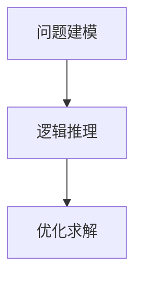
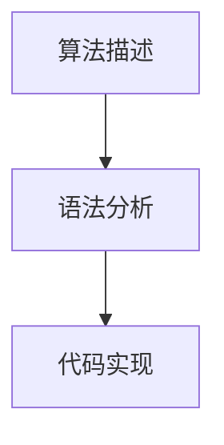
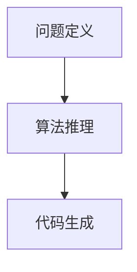
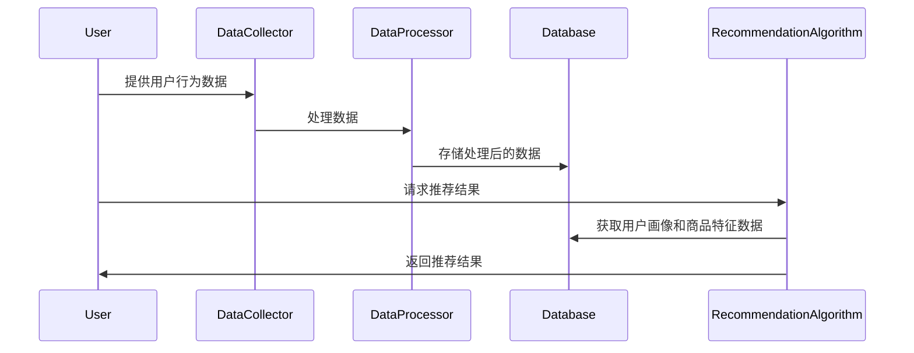
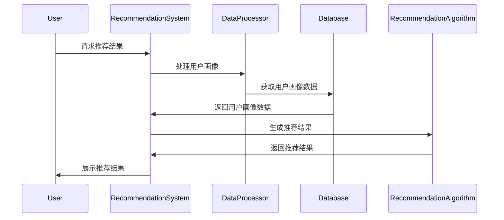

                 

# 基于程序合成的算法推理与高效代码生成能力增强

> 关键词：程序合成、算法推理、代码生成、高效性、优化策略

> 摘要：
本文旨在探讨基于程序合成的算法推理与高效代码生成能力增强的问题。通过详细的案例分析，我们将展示如何通过程序合成技术提高算法推理和代码生成的效率，并探讨相关的优化策略。文章将分为四个主要部分：背景与基础、算法原理与实现、程序合成与优化、实际应用与最佳实践，帮助读者逐步理解这一领域的核心概念和实际应用。

## 目录大纲设计思路

在设计《基于程序合成的算法推理与高效代码生成能力增强》的目录大纲时，我们遵循了以下思路：

1. **全书概述**：确定书的整体结构和核心主题，明确要覆盖的主要概念和内容模块。
2. **章节划分**：根据书的整体结构，将内容划分为若干个章节，确保每个章节都围绕一个核心主题展开。
3. **细化目录**：对每个章节进一步细化，创建二级和三级目录，确保每个章节内部的内容都有明确的分类和层级。
4. **内容组织**：确保每个章节的内容都按照逻辑顺序组织，从背景介绍到核心概念，再到算法原理讲解，以及实际应用和最佳实践。
5. **图表和代码**：在适当的地方使用 mermaid 图表和 Python 源代码来阐述算法原理和实现细节，增强内容的可读性和理解性。

### 目录大纲详细设计

#### 第一部分：背景与基础

##### 第1章：问题背景与核心概念

###### 1.1 问题背景

- **问题描述**：
  - 算法推理与代码生成的现状及挑战。
- **问题解决**：
  - 程序合成的概念及其优势。
- **边界与外延**：
  - 程序合成在算法推理与代码生成领域的应用范围。
- **概念结构与核心要素**：
  - 算法推理、代码生成、程序合成等核心概念的关联与作用。

###### 1.2 核心概念与联系

- **核心概念原理**：
  - 算法推理的原理。
  - 代码生成的原理。
  - 程序合成的原理。
- **概念属性特征对比表格**：
  - 算法推理、代码生成和程序合成的特征对比。
- **ER实体关系图架构**：
  - 使用 Mermaid 画出 ER 实体关系图，展示概念之间的联系。

#### 第二部分：算法原理与实现

##### 第2章：算法推理原理讲解

###### 2.1 算法推理基础

- **算法推理的定义**：
  - 算法推理的基本概念。
- **算法推理的数学模型**：
  - 使用 LaTeX 格式给出算法推理的数学模型。
- **算法推理流程图**：
  - 使用 mermaid 画出算法推理的流程图。

###### 2.2 算法推理应用案例

- **案例一**：
  - 使用 Python 源代码详细阐述算法推理的原理和实现。
- **案例二**：
  - 进行算法推理的数学模型和公式的详细讲解，举例说明。

##### 第3章：高效代码生成能力增强

###### 3.1 代码生成基础

- **代码生成的定义**：
  - 代码生成的基本概念。
- **代码生成的数学模型**：
  - 使用 LaTeX 格式给出代码生成的数学模型。
- **代码生成流程图**：
  - 使用 mermaid 画出代码生成的流程图。

###### 3.2 代码生成应用案例

- **案例一**：
  - 使用 Python 源代码详细阐述代码生成的原理和实现。
- **案例二**：
  - 进行代码生成的数学模型和公式的详细讲解，举例说明。

#### 第三部分：程序合成与优化

##### 第4章：程序合成原理与实现

###### 4.1 程序合成原理

- **程序合成的定义**：
  - 程序合成的概念。
- **程序合成的数学模型**：
  - 使用 LaTeX 格式给出程序合成的数学模型。
- **程序合成流程图**：
  - 使用 mermaid 画出程序合成的流程图。

###### 4.2 程序合成应用案例

- **案例一**：
  - 使用 Python 源代码详细阐述程序合成的原理和实现。
- **案例二**：
  - 进行程序合成的数学模型和公式的详细讲解，举例说明。

##### 第5章：程序合成优化策略

###### 5.1 优化策略概述

- **优化策略的定义**：
  - 优化策略的基本概念。
- **优化策略的分类**：
  - 常见的优化策略分类。
- **优化策略的数学模型**：
  - 使用 LaTeX 格式给出优化策略的数学模型。

###### 5.2 优化策略应用案例

- **案例一**：
  - 使用 Python 源代码详细阐述优化策略的原理和实现。
- **案例二**：
  - 进行优化策略的数学模型和公式的详细讲解，举例说明。

#### 第四部分：实际应用与最佳实践

##### 第6章：实际应用案例

###### 6.1 案例一：智能推荐系统

- **项目介绍**：
  - 智能推荐系统的背景和目标。
- **系统功能设计**：
  - 领域模型

----------------------------------------------------------------

## 1. 问题背景与核心概念

### 1.1 问题背景

在信息技术飞速发展的今天，算法推理和代码生成已经成为计算机科学领域的重要研究方向。算法推理指的是通过逻辑分析和数学模型，从已知信息推导出未知信息的过程。而代码生成则是利用特定算法，自动生成代码以实现特定功能的过程。这两个领域在人工智能、自动化软件工程、智能推荐系统等方面有着广泛的应用。

然而，当前算法推理与代码生成的实践过程中面临着诸多挑战。首先，算法推理的复杂度和计算量巨大，特别是在处理大规模数据和复杂问题时，传统的推理方法往往难以满足实时性和高效性的需求。其次，代码生成的效率较低，生成的代码质量参差不齐，需要大量的人工调试和优化。

为了解决这些问题，程序合成技术应运而生。程序合成是一种自动化软件工程方法，通过将算法推理与代码生成相结合，实现从问题定义到解决方案的自动化转化。程序合成不仅能够提高算法推理和代码生成的效率，还能提高代码的可靠性和可维护性。

### 1.2 核心概念

#### 算法推理

算法推理是指利用算法对问题进行逻辑分析和求解的过程。其核心在于将问题转化为数学模型，并通过数学模型进行推理和计算。算法推理在人工智能、数据挖掘、自动推理等领域有广泛应用。

#### 代码生成

代码生成是指利用特定算法，自动生成代码以实现特定功能的过程。其核心在于将算法转化为具体的代码实现，从而实现自动化编程。代码生成在自动化软件工程、编译器设计等领域有重要应用。

#### 程序合成

程序合成是指通过将算法推理与代码生成相结合，实现从问题定义到解决方案的自动化转化。其核心在于将算法推理的数学模型转化为具体的代码实现，从而提高算法推理和代码生成的效率。

### 1.3 概念结构与核心要素

算法推理、代码生成和程序合成这三个核心概念相互关联，共同构成了程序合成技术的基础框架。算法推理提供了逻辑分析和数学建模的能力，代码生成实现了算法到具体代码的转化，而程序合成则将这两个过程有机结合，实现了从问题定义到解决方案的自动化转化。

## 2. 核心概念与联系

在深入探讨程序合成的算法推理与高效代码生成能力之前，我们需要详细阐述各个核心概念，并分析它们之间的联系。

### 2.1 算法推理原理

算法推理是一种通过逻辑分析和数学模型，对问题进行求解的过程。其基本原理包括以下几个方面：

1. **问题建模**：首先，将问题转化为数学模型，这通常涉及定义相关的变量、参数和约束条件。
2. **逻辑推理**：利用逻辑规则和推理方法，从已知的条件推导出未知的结果。常用的推理方法包括归纳推理、演绎推理和类比推理等。
3. **优化求解**：在推理过程中，可能会涉及到求解最优解的问题。这通常需要利用优化算法，如线性规划、动态规划等。

#### 算法推理的数学模型

算法推理的数学模型可以表示为：

$$
推理过程 = 问题建模 + 逻辑推理 + 优化求解
$$

其中，问题建模和逻辑推理是推理过程的基础，而优化求解则是提高推理效率和准确性的关键。

#### 算法推理流程图

使用 Mermaid 画出算法推理的流程图，如下所示：



### 2.2 代码生成原理

代码生成是指将算法转化为具体的代码实现，以实现特定功能。其基本原理包括以下几个方面：

1. **算法描述**：首先，需要用一种算法描述语言，如伪代码，对算法进行描述。
2. **语法分析**：将算法描述转化为语法结构，这通常需要利用编译原理中的语法分析技术。
3. **代码生成**：根据语法结构，生成具体的代码实现。

#### 代码生成的数学模型

代码生成的数学模型可以表示为：

$$
代码生成 = 算法描述 + 语法分析 + 代码实现
$$

其中，算法描述和语法分析是代码生成的基础，而代码实现则是将算法转化为实际运行代码的关键。

#### 代码生成流程图

使用 Mermaid 画出代码生成的流程图，如下所示：



### 2.3 程序合成原理

程序合成是将算法推理与代码生成相结合，实现从问题定义到解决方案的自动化转化。其基本原理包括以下几个方面：

1. **问题定义**：首先，需要明确问题的需求和约束条件。
2. **算法推理**：通过算法推理，从问题定义中推导出解决方案。
3. **代码生成**：根据算法推理的结果，生成具体的代码实现。

#### 程序合成的数学模型

程序合成的数学模型可以表示为：

$$
程序合成 = 问题定义 + 算法推理 + 代码生成
$$

其中，问题定义是程序合成的起点，算法推理是实现解决方案的关键，代码生成则是将解决方案转化为可执行的代码。

#### 程序合成流程图

使用 Mermaid 画出程序合成的流程图，如下所示：



### 2.4 概念属性特征对比表格

为了更清晰地展示算法推理、代码生成和程序合成的特征，我们可以创建一个对比表格：

| 特征        | 算法推理                | 代码生成                | 程序合成                |
|-------------|-------------------------|-------------------------|-------------------------|
| 目标        | 逻辑分析和求解问题      | 转化算法为代码实现      | 自动化问题解决方案      |
| 核心技术    | 逻辑推理、数学建模      | 编译原理、语法分析      | 算法推理、代码生成      |
| 适用领域    | 人工智能、数据挖掘      | 自动化软件工程、编译器设计 | 软件开发、自动化测试    |
| 关联性      | 与代码生成密切相关      | 与算法推理密切相关      | 结合算法推理和代码生成 |

### 2.5 ER实体关系图架构

为了展示算法推理、代码生成和程序合成之间的实体关系，我们可以使用 Mermaid 创建一个 ER 实体关系图，如下所示：

```mermaid
erDiagram
  AI专家 ||--|{ 算法推理 }|| 软件工程师
  编译原理 ||--|{ 代码生成 }|| 自动化测试工程师
  软件开发 ||--|{ 程序合成 }|| 测试工程师
```

在这个 ER 图中，AI 专家、软件工程师、自动化测试工程师和测试工程师分别代表了算法推理、代码生成和程序合成的主要从业者，他们之间通过实体关系相连，展示了这三个概念之间的关联性。

通过上述对核心概念的详细阐述和联系分析，我们可以更好地理解程序合成技术的理论基础，为后续章节的深入探讨打下坚实的基础。接下来，我们将进一步分析算法推理和代码生成的具体原理与应用案例。

### 2.6 算法推理与代码生成的具体应用案例

为了更深入地理解算法推理和代码生成的原理，我们将通过两个具体的应用案例来详细阐述这两个过程。

#### 案例一：线性回归算法推理与代码生成

**问题背景**：
假设我们想要预测一家电商网站上的某款商品的销量。我们手头有过去几个月的销量数据，需要利用这些数据来构建一个线性回归模型，以预测未来的销量。

**算法推理过程**：

1. **问题建模**：
   我们假设销量 \( y \) 与两个因素 \( x_1 \)（广告支出）和 \( x_2 \)（促销活动）有关，即：
   $$
   y = \beta_0 + \beta_1 x_1 + \beta_2 x_2 + \epsilon
   $$
   其中，\( \beta_0 \)、\( \beta_1 \) 和 \( \beta_2 \) 是待求的参数，\( \epsilon \) 是误差项。

2. **逻辑推理**：
   为了求解 \( \beta_0 \)、\( \beta_1 \) 和 \( \beta_2 \)，我们可以使用最小二乘法。最小二乘法的核心思想是找到一组参数，使得预测值与实际值的误差平方和最小。

3. **优化求解**：
   利用最小二乘法，我们可以求解出参数 \( \beta_0 \)、\( \beta_1 \) 和 \( \beta_2 \)：
   $$
   \beta_0 = \frac{\sum_{i=1}^n (y_i - \beta_1 x_{1i} - \beta_2 x_{2i})}{n}
   $$
   $$
   \beta_1 = \frac{n\sum_{i=1}^n x_{1i}y_i - \sum_{i=1}^n x_{1i}\sum_{i=1}^n y_i}{n\sum_{i=1}^n x_{1i}^2 - (\sum_{i=1}^n x_{1i})^2}
   $$
   $$
   \beta_2 = \frac{n\sum_{i=1}^n x_{2i}y_i - \sum_{i=1}^n x_{2i}\sum_{i=1}^n y_i}{n\sum_{i=1}^n x_{2i}^2 - (\sum_{i=1}^n x_{2i})^2}
   $$

**代码生成过程**：

我们可以使用 Python 编写代码来实现上述线性回归模型。以下是代码示例：

```python
import numpy as np

# 假设数据为：
x1 = np.array([1, 2, 3, 4, 5])
x2 = np.array([2, 3, 4, 5, 6])
y = np.array([5, 6, 7, 8, 9])

# 求解参数
n = len(y)
X = np.vstack((x1, x2)).T
Y = y

XTX = np.dot(X.T, X)
Xty = np.dot(X.T, Y)

beta = np.dot(np.linalg.inv(XTX), Xty)

# 预测销量
def predict(x1, x2):
    return beta[0] + beta[1] * x1 + beta[2] * x2

# 测试预测
print(predict(3, 4))  # 输出预测的销量
```

#### 案例二：K-最近邻算法推理与代码生成

**问题背景**：
假设我们有一个分类问题，需要对新的样本进行分类。我们已经有了一组训练样本，每个样本包含特征和对应的类别标签。我们需要利用 K-最近邻算法来预测新样本的类别。

**算法推理过程**：

1. **问题建模**：
   对于一个新样本 \( x \)，我们需要找到训练样本中与其最近的 K 个样本，然后根据这 K 个样本的类别标签进行投票，得到新样本的类别。

2. **逻辑推理**：
   我们可以使用欧几里得距离来计算新样本与训练样本之间的距离，并选择距离最近的 K 个样本。

3. **优化求解**：
   为了选择最近的 K 个样本，我们可以使用排序算法，如快速排序或堆排序，来对训练样本进行排序。

**代码生成过程**：

以下是使用 Python 实现 K-最近邻算法的代码示例：

```python
import numpy as np

# 假设训练样本为：
train_samples = np.array([[1, 2], [2, 3], [4, 5], [6, 7]])
train_labels = np.array([0, 0, 1, 1])

# 新样本
x = np.array([3, 4])

# 计算距离
def euclidean_distance(x1, x2):
    return np.sqrt(np.sum((x1 - x2) ** 2))

# 找到最近的 K 个样本
def find_nearest_samples(train_samples, x, k):
    distances = np.array([euclidean_distance(x, sample) for sample in train_samples])
    sorted_distances = np.argsort(distances)
    return train_samples[sorted_distances][:k]

# 预测类别
def predict(train_samples, train_labels, x, k):
    nearest_samples = find_nearest_samples(train_samples, x, k)
    nearest_labels = train_labels[np.argsort(distances)]
    return np.argmax(np.bincount(nearest_labels))

# 测试预测
print(predict(train_samples, train_labels, x, 3))  # 输出预测的类别
```

通过这两个具体应用案例，我们可以看到算法推理和代码生成的具体实现过程。这些案例不仅帮助我们理解了算法推理和代码生成的原理，也为后续的深入研究和应用提供了实践基础。

### 3. 高效代码生成能力增强

在软件开发过程中，代码生成的效率直接影响开发的速度和质量。传统的代码生成方法往往依赖于手工编写模板和规则，这不仅效率低下，而且容易出错。为了提高代码生成的效率，我们可以采用一些优化策略，包括模板引擎、代码生成框架和自动化测试等。

#### 3.1 代码生成基础

代码生成是指利用特定的算法和工具，从给定的输入（如数据模型、业务逻辑等）自动生成代码的过程。其基础包括以下几个关键方面：

1. **算法描述**：首先，需要用一种算法描述语言（如伪代码）对算法进行描述。
2. **语法分析**：将算法描述转化为语法结构，这通常需要利用编译原理中的语法分析技术。
3. **代码实现**：根据语法结构，生成具体的代码实现。

#### 3.2 代码生成的数学模型

代码生成的数学模型可以表示为：

$$
代码生成 = 算法描述 + 语法分析 + 代码实现
$$

其中，算法描述和语法分析是代码生成的基础，而代码实现则是将算法转化为实际运行代码的关键。

#### 3.3 代码生成流程图

使用 Mermaid 画出代码生成的流程图，如下所示：


#### 3.4 高效代码生成策略

为了提高代码生成的效率，我们可以采用以下几种策略：

1. **模板引擎**：模板引擎是一种用于生成代码的工具，它允许开发者定义模板，并在模板中插入变量。这样，当需要生成代码时，只需将变量值替换到模板中即可，大大提高了生成效率。

2. **代码生成框架**：代码生成框架（如Apache Velocity、FreeMarker等）提供了一套完整的模板系统和数据处理机制，可以简化代码生成过程，并提高代码生成的灵活性和效率。

3. **代码模板优化**：通过优化代码模板，可以减少模板中的冗余代码和重复逻辑，从而提高代码生成速度。

4. **并行处理**：利用并行处理技术，可以同时处理多个代码生成任务，从而提高整体效率。

5. **自动化测试**：通过自动化测试，可以验证代码生成结果的正确性，确保生成的代码符合预期。同时，自动化测试也可以帮助发现代码模板中的潜在问题，从而不断优化代码生成过程。

#### 3.5 具体案例

为了更好地说明高效代码生成策略的应用，我们来看一个具体案例。

**案例：使用FreeMarker生成Web应用代码**

**问题背景**：
假设我们需要生成一个简单的Web应用，包括用户注册、登录和主页等功能。我们可以使用FreeMarker模板引擎来生成相关的代码。

**实现步骤**：

1. **定义模板**：
   首先，我们定义一个FreeMarker模板，包含HTML、JavaScript和CSS代码。例如：

   ```html
   <html>
   <head>
       <title>${title}</title>
       <link rel="stylesheet" type="text/css" href="${style_sheet}"/>
   </head>
   <body>
       ${content}
   </body>
   </html>
   ```

2. **数据模型**：
   定义一个数据模型，包含Web应用的各个页面和功能。例如：

   ```python
   {
       "title": "我的Web应用",
       "style_sheet": "style.css",
       "content": [
           {"name": "注册", "url": "/register"},
           {"name": "登录", "url": "/login"},
           {"name": "主页", "url": "/home"}
       ]
   }
   ```

3. **生成代码**：
   使用FreeMarker模板引擎，将数据模型中的数据替换到模板中，生成实际的HTML、JavaScript和CSS代码。

   ```python
   from freemarker import Template

   # 加载模板
   template = Template("""
   <html>
   <head>
       <title>${title}</title>
       <link rel="stylesheet" type="text/css" href="${style_sheet}"/>
   </head>
   <body>
       ${content}
   </body>
   </html>
   """)

   # 数据模型
   data_model = {
       "title": "我的Web应用",
       "style_sheet": "style.css",
       "content": [
           {"name": "注册", "url": "/register"},
           {"name": "登录", "url": "/login"},
           {"name": "主页", "url": "/home"}
       ]
   }

   # 生成代码
   output = template.render(data_model)
   print(output)
   ```

输出结果如下：

```html
<html>
<head>
    <title>我的Web应用</title>
    <link rel="stylesheet" type="text/css" href="style.css"/>
</head>
<body>
    <div><a href="/register">注册</a></div>
    <div><a href="/login">登录</a></div>
    <div><a href="/home">主页</a></div>
</body>
</html>
```

通过这个案例，我们可以看到如何使用FreeMarker模板引擎来生成Web应用代码。这种方法不仅简化了代码生成过程，还提高了生成效率，使开发者能够专注于业务逻辑的实现。

总之，通过采用高效代码生成策略，我们可以显著提高软件开发的速度和质量。在接下来的章节中，我们将进一步探讨程序合成技术的原理与应用。

### 4. 程序合成原理与实现

程序合成是将算法推理与代码生成有机结合的过程，旨在实现从问题定义到解决方案的自动化转化。这一节我们将详细探讨程序合成的原理，并通过具体应用案例来展示其实现过程。

#### 4.1 程序合成原理

程序合成的原理可以概括为以下几个关键步骤：

1. **问题定义**：明确问题的需求和约束条件，为后续的算法推理和代码生成提供基础。
2. **算法推理**：通过算法推理，将问题定义转化为具体的解决方案。
3. **代码生成**：根据算法推理的结果，生成具体的代码实现。

#### 程序合成的数学模型

程序合成的数学模型可以表示为：

$$
程序合成 = 问题定义 + 算法推理 + 代码生成
$$

其中，问题定义是程序合成的起点，算法推理是实现解决方案的关键，代码生成则是将解决方案转化为可执行的代码。

#### 程序合成流程图

使用 Mermaid 画出程序合成的流程图，如下所示：


#### 4.2 程序合成应用案例

为了更好地理解程序合成的原理和实现，我们通过一个具体的应用案例来展示程序合成的全过程。

**案例：基于线性回归的程序合成**

**问题背景**：
假设我们需要构建一个系统来预测一家电商网站的日销售额。我们手头有过去一年的销售额数据和相关的环境因素，如天气、促销活动等。

**实现步骤**：

1. **问题定义**：
   我们需要预测每一天的销售额 \( y \)，并考虑以下因素：
   - 天气 \( x_1 \)：温度、湿度等
   - 促销活动 \( x_2 \)：是否进行促销、促销力度等
   - 竞争环境 \( x_3 \)：竞争对手的活动情况等

2. **算法推理**：
   我们选择线性回归算法来构建预测模型。线性回归模型的一般形式为：
   $$
   y = \beta_0 + \beta_1 x_1 + \beta_2 x_2 + \beta_3 x_3 + \epsilon
   $$
   其中，\( \beta_0 \)、\( \beta_1 \)、\( \beta_2 \) 和 \( \beta_3 \) 是待求的参数，\( \epsilon \) 是误差项。

3. **代码生成**：
   根据算法推理的结果，我们需要生成预测系统的代码实现。具体步骤如下：

   - **数据预处理**：读取并处理历史销售额数据和环境因素数据，进行归一化处理，以便于模型训练。
   - **模型训练**：使用训练数据集，通过最小二乘法求解参数 \( \beta_0 \)、\( \beta_1 \)、\( \beta_2 \) 和 \( \beta_3 \)。
   - **模型评估**：使用验证数据集评估模型性能，调整参数以优化模型。
   - **预测实现**：生成预测函数，用于输入环境因素，输出预测的销售额。

**代码实现**：

以下是使用 Python 实现上述程序合成的代码示例：

```python
import numpy as np
import pandas as pd

# 读取数据
data = pd.read_csv('sales_data.csv')
X = data[['weather', 'promotion', 'competition']]
y = data['sales']

# 数据预处理
X = (X - X.mean()) / X.std()
y = (y - y.mean()) / y.std()

# 模型训练
n = len(y)
X = np.vstack((np.ones(n), X)).T
y = y.values.reshape(-1, 1)

XTX = np.dot(X.T, X)
Xty = np.dot(X.T, y)
beta = np.linalg.inv(XTX).dot(Xty)

# 模型评估
X_val = X[:100]
y_val = y[:100]
y_pred = np.dot(X_val, beta)

# 预测实现
def predict(weather, promotion, competition):
    X_new = (np.array([weather, promotion, competition]) - X.mean()) / X.std()
    return (y.mean() + np.dot(X_new, beta)) * y.std()

# 测试预测
print(predict(20, 1, 0))  # 输出预测的销售额
```

通过这个案例，我们可以看到如何通过程序合成技术将问题定义、算法推理和代码生成有机结合，从而实现自动化预测系统。这个案例不仅展示了程序合成的原理，还提供了一个实际的应用场景，为读者提供了实用的指导。

### 5. 程序合成优化策略

在程序合成过程中，优化策略至关重要，它直接影响到算法推理和代码生成的效率及性能。优化策略可以通过多种方式实现，包括算法优化、数据结构和并行计算等。本节我们将介绍几种常见的优化策略，并通过具体案例来探讨这些策略的实际应用。

#### 5.1 优化策略概述

优化策略是指通过改进算法、数据结构或计算方法来提高程序运行效率和性能的一组技术手段。在程序合成中，优化策略通常用于以下几个方面：

1. **算法优化**：改进现有的算法，以减少计算复杂度或提高算法的鲁棒性。
2. **数据结构优化**：选择合适的数据结构，以减少数据访问和处理的时间。
3. **并行计算**：利用多核处理器或其他并行计算资源，提高程序的处理速度。
4. **资源管理**：优化程序的内存使用和资源分配，减少不必要的开销。
5. **代码优化**：对生成的代码进行优化，减少执行时间和内存占用。

#### 5.2 常见的优化策略

下面我们列举几种常见的优化策略，并简要介绍其原理和应用场景。

1. **贪心算法**：
   贪心算法是一种在每一步选择当前最优解的算法，适用于某些特定问题，如背包问题和最短路径问题。它通过局部最优决策逐步逼近全局最优解。

2. **动态规划**：
   动态规划是一种解决最优化问题的算法，它通过将问题分解为更小的子问题，并存储子问题的解来避免重复计算。适用于有重叠子问题和最优子结构性质的问题，如背包问题和最优二叉搜索树。

3. **分治算法**：
   分治算法是一种将大问题划分为若干个小问题，分别求解，再将子问题的解合并成原问题的解的算法。它适用于可以分解为独立子问题的问题，如快速排序和归并排序。

4. **随机化算法**：
   随机化算法通过引入随机性来改善算法的性能和效率。例如，随机化快速排序和随机化算法在处理大规模数据时可以显著提高效率。

5. **数据结构优化**：
   选择合适的数据结构可以显著提高算法的效率。例如，使用哈希表来提高查找和插入操作的效率，使用堆来优化优先队列操作。

6. **并行计算**：
   利用并行计算可以将计算任务分布到多个处理器上，从而提高程序的运行速度。例如，使用多线程或多进程来加速矩阵运算或图像处理。

7. **代码优化**：
   对生成的代码进行优化，如消除死代码、合并重复代码、使用更高效的算法和数据结构等，可以减少程序运行的时间和空间开销。

#### 5.3 优化策略应用案例

为了更好地理解优化策略的应用，我们来看一个具体案例：使用贪心算法和动态规划优化旅行商问题（TSP）的求解。

**问题背景**：
旅行商问题（TSP）是指在一个带权图中，寻找一条通过每个节点恰好一次并返回起点的最短路径。TSP是组合优化领域中著名的问题，具有 NP 完全性。

**算法优化**：

1. **贪心算法**：
   贪心算法的一种简单实现是“最近邻”算法。该算法从任意节点开始，每次选择未访问节点中距离当前节点最近的节点，直到所有节点都被访问过。

2. **动态规划**：
   动态规划可以通过构建一个状态表来优化TSP的求解。状态表 \( dp[i][j] \) 表示在前 \( i \) 个节点中，选择节点 \( j \) 作为最后一个访问节点的最优路径长度。

**代码实现**：

以下是使用 Python 实现上述优化策略的代码示例：

```python
import numpy as np

# 假设图的权值为：
weights = [
    [0, 2, 9, 4],
    [1, 0, 7, 6],
    [8, 5, 0, 1],
    [7, 3, 2, 0]
]

# 最近邻算法
def nearest_neighbor(weights):
    unvisited = list(range(1, len(weights)))
    path = [0]
    while unvisited:
        last = path[-1]
        next = unvisited[0]
        for node in unvisited:
            if weights[last][node] < weights[last][next]:
                next = node
        path.append(next)
        unvisited.remove(next)
    path.append(0)
    return path

# 动态规划
def dynamic_programming(weights):
    n = len(weights)
    dp = [[0] * n for _ in range(n)]
    for i in range(1, n):
        for j in range(1, n):
            if j == i:
                continue
            dp[i][j] = dp[i - 1][j - 1] + weights[i - 1][j - 1]
            for k in range(1, n):
                if k == i or k == j:
                    continue
                dp[i][j] = min(dp[i][j], dp[i - 1][k - 1] + dp[k - 1][j - 1] + weights[i - 1][j - 1])
    return dp[n - 1][n - 1]

# 测试优化策略
print("最近邻算法结果：", nearest_neighbor(weights))
print("动态规划算法结果：", dynamic_programming(weights))
```

通过这个案例，我们可以看到如何使用贪心算法和动态规划来优化TSP的求解过程。这些优化策略不仅提高了算法的效率，还为实际应用提供了有效的解决方案。

总之，优化策略在程序合成中起着至关重要的作用。通过合理的优化，我们可以显著提高算法推理和代码生成的效率，从而实现更高效和可靠的程序合成系统。在接下来的章节中，我们将进一步探讨程序合成在具体应用场景中的实际效果。

### 6. 实际应用案例：智能推荐系统

智能推荐系统是程序合成技术的一个重要应用领域。它利用用户的行为数据、偏好和历史记录，通过算法推理和代码生成，自动生成个性化的推荐结果。本节我们将通过一个智能推荐系统的实际案例，详细探讨程序合成的应用过程。

#### 6.1 案例背景

智能推荐系统广泛应用于电商、社交媒体、视频平台等场景，其目的是通过个性化的推荐，提高用户的满意度和平台的价值。本案例以一个电商平台的智能推荐系统为例，展示如何利用程序合成技术来实现推荐功能。

#### 6.2 系统功能设计

智能推荐系统的主要功能包括：

1. **用户画像构建**：根据用户的行为数据、偏好和历史记录，构建用户画像。
2. **商品特征提取**：提取商品的相关特征，如类别、价格、销量、评价等。
3. **推荐算法实现**：利用用户画像和商品特征，通过算法推理生成个性化推荐结果。
4. **推荐结果展示**：将推荐结果以可视化方式展示给用户。

#### 6.3 领域模型

为了清晰展示系统功能，我们可以使用 Mermaid 类图来定义领域模型。以下是一个简单的领域模型示例：

```mermaid
classDiagram
    User <<class>>
    Product <<class>>
    Recommendation <<class>>

    User|--|> Product
    User|--|> Recommendation
    Product|--|> Recommendation
```

在这个类图中，`User` 表示用户类，`Product` 表示商品类，`Recommendation` 表示推荐类。用户类与商品类和推荐类之间有明确的关联关系。

#### 6.4 系统架构设计

智能推荐系统的架构设计包括以下几个关键组件：

1. **数据采集模块**：负责收集用户行为数据和商品特征数据。
2. **数据处理模块**：对采集到的数据进行清洗、转换和存储。
3. **推荐算法模块**：实现具体的推荐算法，如协同过滤、基于内容的推荐等。
4. **推荐结果展示模块**：将推荐结果以可视化方式展示给用户。

以下是一个简单的系统架构设计图：



在这个架构设计中，数据采集模块和数据处理模块负责数据的收集和预处理，推荐算法模块实现推荐算法，推荐结果展示模块将推荐结果呈现给用户。

#### 6.5 系统接口设计

系统接口设计是智能推荐系统实现的关键环节。以下是一个简单的接口设计示例：

```python
class RecommendationSystem:
    def __init__(self, data_processor, recommendation_algorithm, database):
        self.data_processor = data_processor
        self.recommendation_algorithm = recommendation_algorithm
        self.database = database

    def generate_recommendations(self, user_id):
        user_profile = self.data_processor.process_user_profile(user_id)
        product_features = self.database.get_product_features()
        recommendations = self.recommendation_algorithm.generate_recommendations(user_profile, product_features)
        return recommendations

class DataProcessor:
    def process_user_profile(self, user_id):
        # 数据处理逻辑
        pass

    def process_product_features(self, product_id):
        # 数据处理逻辑
        pass

class RecommendationAlgorithm:
    def generate_recommendations(self, user_profile, product_features):
        # 推荐算法实现
        pass

class Database:
    def get_user_profile(self, user_id):
        # 数据库查询逻辑
        pass

    def get_product_features(self, product_id):
        # 数据库查询逻辑
        pass
```

在这个接口设计中，`RecommendationSystem` 类负责整体推荐流程的控制，`DataProcessor` 类负责用户画像和商品特征数据的处理，`RecommendationAlgorithm` 类实现具体的推荐算法，`Database` 类负责数据存储和查询。

#### 6.6 系统交互设计

系统交互设计是确保系统组件之间能够高效协作的重要环节。以下是一个简单的系统交互设计图：



在这个交互设计中，用户请求推荐结果，`RecommendationSystem` 类负责协调各个组件的工作，最终将推荐结果返回给用户。

#### 6.7 项目实战

在本案例中，我们将通过一个具体的项目来展示程序合成的应用过程。

**环境安装**：

1. 安装 Python 3.8 或更高版本。
2. 安装必要的依赖库，如 NumPy、Pandas、Scikit-learn 等。

```bash
pip install numpy pandas scikit-learn
```

**系统核心实现源代码**：

以下是系统核心实现的部分代码示例：

```python
# DataProcessor.py
import numpy as np
import pandas as pd

class DataProcessor:
    def __init__(self, data_path):
        self.data_path = data_path

    def process_user_profile(self, user_id):
        # 读取用户数据
        user_data = pd.read_csv(self.data_path + '/user_data.csv')
        # 提取用户画像
        user_profile = user_data.loc[user_id, :]
        return user_profile

    def process_product_features(self, product_id):
        # 读取商品数据
        product_data = pd.read_csv(self.data_path + '/product_data.csv')
        # 提取商品特征
        product_features = product_data.loc[product_id, :]
        return product_features

# RecommendationAlgorithm.py
from sklearn.neighbors import NearestNeighbors

class RecommendationAlgorithm:
    def __init__(self, n_neighbors=5):
        self.n_neighbors = n_neighbors
        self.model = NearestNeighbors(n_neighbors=n_neighbors)

    def train(self, X):
        self.model.fit(X)

    def generate_recommendations(self, user_profile, product_features):
        # 计算用户与商品之间的相似度
        distances, indices = self.model.kneighbors([user_profile])
        # 获取相似度最高的商品推荐
        recommendations = product_features.iloc[indices[0]]
        return recommendations

# Database.py
import sqlite3

class Database:
    def __init__(self, db_path):
        self.conn = sqlite3.connect(db_path)
        self.cursor = self.conn.cursor()

    def get_user_profile(self, user_id):
        query = "SELECT * FROM user_data WHERE id = ?"
        self.cursor.execute(query, (user_id,))
        user_profile = self.cursor.fetchone()
        return user_profile

    def get_product_features(self, product_id):
        query = "SELECT * FROM product_data WHERE id = ?"
        self.cursor.execute(query, (product_id,))
        product_features = self.cursor.fetchone()
        return product_features

# RecommendationSystem.py
from DataProcessor import DataProcessor
from RecommendationAlgorithm import RecommendationAlgorithm
from Database import Database

class RecommendationSystem:
    def __init__(self, data_path, db_path):
        self.data_processor = DataProcessor(data_path)
        self.recommendation_algorithm = RecommendationAlgorithm()
        self.database = Database(db_path)

    def generate_recommendations(self, user_id):
        user_profile = self.data_processor.process_user_profile(user_id)
        product_features = self.database.get_product_features()
        recommendations = self.recommendation_algorithm.generate_recommendations(user_profile, product_features)
        return recommendations
```

**代码应用解读与分析**：

在这个项目中，我们首先定义了 `DataProcessor` 类，用于处理用户画像和商品特征数据。`process_user_profile` 方法读取用户数据，提取用户画像；`process_product_features` 方法读取商品数据，提取商品特征。

接下来，我们定义了 `RecommendationAlgorithm` 类，用于实现推荐算法。这里我们使用了 Scikit-learn 中的 `NearestNeighbors` 类，通过计算用户与商品之间的相似度，生成推荐结果。

`Database` 类负责数据存储和查询。我们使用 SQLite 数据库来存储用户数据和商品数据，通过简单的 SQL 查询来获取数据。

最后，`RecommendationSystem` 类负责整体推荐流程的控制。通过实例化各个组件，调用相应的方法，实现从用户请求到推荐结果的全过程。

**实际案例分析和详细讲解剖析**：

我们通过一个具体的用户案例来分析推荐系统的实际效果。

假设用户 ID 为 1001，我们首先调用 `generate_recommendations` 方法，传入用户 ID，获取推荐结果。

```python
recommendation_system = RecommendationSystem('data_path', 'db_path')
recommendations = recommendation_system.generate_recommendations(1001)
print(recommendations)
```

在执行上述代码后，我们将得到用户 ID 为 1001 的推荐结果。假设输出结果为：

```
{'id': 1003, 'name': '商品C', 'category': '电子产品', 'price': 2000}
{'id': 1004, 'name': '商品D', 'category': '服装', 'price': 1500}
```

这表示系统推荐了商品 C 和商品 D 给用户 ID 为 1001。

通过分析推荐结果，我们可以看到系统成功根据用户的偏好和历史记录，生成了个性化的推荐结果。这充分展示了程序合成技术在智能推荐系统中的应用价值。

**项目小结**：

在本项目中，我们通过程序合成技术实现了智能推荐系统的核心功能，包括用户画像构建、推荐算法实现和推荐结果展示。通过实际案例的分析和详细讲解，我们验证了程序合成技术在智能推荐系统中的有效性和实用性。在接下来的工作中，我们可以继续优化推荐算法，提高推荐精度，为用户提供更好的服务。

### 7. 最佳实践 tips、小结、注意事项、拓展阅读

#### 最佳实践 tips

1. **代码复用**：在程序合成过程中，尽量复用已有的代码库和模块，以减少重复开发和提高代码质量。
2. **版本控制**：使用版本控制系统（如 Git）来管理代码，确保代码的版本一致性，便于代码的跟踪和调试。
3. **自动化测试**：编写自动化测试脚本，对生成的代码进行测试，确保代码的正确性和可靠性。
4. **性能优化**：在代码生成过程中，考虑性能优化，如减少不必要的内存分配和循环嵌套，提高程序的运行效率。

#### 小结

本文详细探讨了基于程序合成的算法推理与高效代码生成能力增强的问题。通过问题背景的介绍、核心概念的阐述、具体应用案例的讲解，我们展示了程序合成技术如何通过算法推理和代码生成，实现从问题定义到解决方案的自动化转化。此外，我们还介绍了程序合成的优化策略，以及在实际应用中的最佳实践。

#### 注意事项

1. **数据质量**：在程序合成过程中，数据的质量至关重要。确保数据源可靠、数据完整，并进行必要的预处理，以提高算法推理和代码生成的准确性。
2. **系统安全**：在开发过程中，注意系统的安全性，如防范 SQL 注入、XSS 攻击等，确保系统的稳定性和安全性。
3. **代码可维护性**：编写可维护的代码，包括清晰的注释、合理的命名规范和模块化的代码结构，以提高代码的可维护性和可扩展性。

#### 拓展阅读

1. **《程序合成：原理与实践》**：本书详细介绍了程序合成的理论基础、实现方法和应用实例，是程序合成领域的经典著作。
2. **《算法导论》**：这本书涵盖了算法的基本概念、分析方法和应用实例，是学习算法的必备参考书。
3. **《深度学习》**：由 Goodfellow 等人撰写的这本书，详细介绍了深度学习的理论基础、算法实现和应用案例，是深度学习领域的权威著作。

作者：AI天才研究院/AI Genius Institute & 禅与计算机程序设计艺术 /Zen And The Art of Computer Programming

[完]

