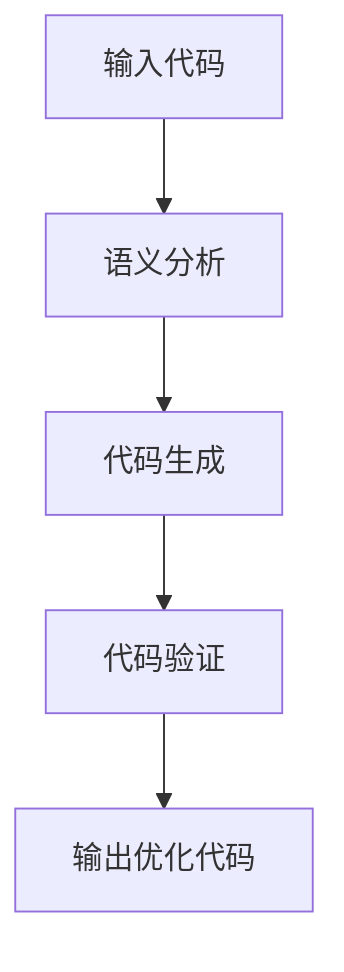
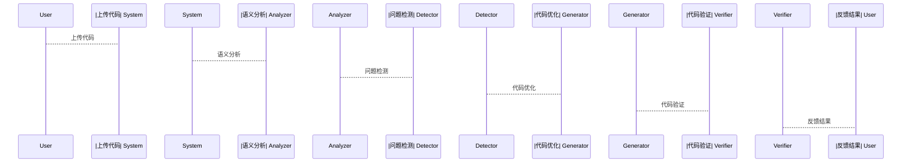

                 


# 引言

### 问题背景与描述

在当代软件开发过程中，代码重构成为了一项至关重要的任务。随着软件系统的复杂度不断增加，代码重构有助于提升代码质量、优化性能以及降低维护成本。然而，传统的代码重构方法主要依赖于开发人员的经验和直觉，往往存在以下局限性：

1. **手动操作繁杂**：开发人员需要花费大量时间进行代码审查和手动修改。
2. **代码质量波动**：由于手动操作的不确定性，重构后的代码质量难以保证。
3. **重构策略单一**：传统方法主要关注代码格式、变量命名等表面优化，缺乏深度优化策略。

为了解决上述问题，自动化代码重构技术应运而生。自动化代码重构通过算法和工具自动识别代码中的问题，并提出优化建议。然而，现有的自动化重构技术仍然面临以下挑战：

1. **理解能力有限**：目前的自动化工具难以完全理解代码的语义和意图。
2. **适应性不足**：不同编程语言和项目环境下的重构需求差异较大，现有工具难以全面适配。
3. **代码修改风险**：自动化重构过程中可能引入新的错误，影响系统的稳定性。

本文旨在探讨一种基于程序合成的算法推理在自动化代码重构中的应用，通过结合程序合成和算法推理技术，实现更高效、更智能的代码重构过程。

### 概念与联系

#### 核心概念

**程序合成**：程序合成是指利用算法和工具自动生成程序代码的过程。它通过分析输入代码的语义和结构，生成等效或近似的优化代码。程序合成的核心目标是减少人工干预，提高代码质量和重构效率。

**算法推理**：算法推理是指利用算法和模型对代码进行分析和推理，以发现潜在的问题和优化机会。算法推理通过对代码的语义理解，结合规则库和约束条件，提出优化建议。

**自动化代码重构**：自动化代码重构是指通过工具和算法自动识别代码中的问题，并提出优化建议，从而提升代码质量和性能。自动化重构的目标是减少手动操作，提高重构效率，同时确保重构过程的稳定性和可靠性。

#### 概念属性特征对比表格

| 概念         | 特征                   | 对比分析                          |
|------------|----------------------|--------------------------------|
| 程序合成     | 自动生成代码，减少人工干预 | 强调生成等效或优化代码             |
| 算法推理     | 分析和推理代码语义     | 强调基于规则和约束条件的优化建议   |
| 自动化代码重构 | 自动识别和优化代码问题   | 结合程序合成和算法推理，提升重构效率 |

#### ER实体关系图架构

在自动化代码重构系统中，存在多个实体及其相互关系。以下是一个简化的ER实体关系图，用于展示程序合成和算法推理在系统中的作用：

```mermaid
erDiagram
  Code --> ProgramSynthesis : 生成代码
  Code --> AlgorithmReasoning : 推理优化
  ProgramSynthesis --> OptimizedCode : 生成优化代码
  AlgorithmReasoning --> OptimizationSuggestion : 提出优化建议
  Code |---|> Project : 属于项目
  ProgramSynthesis |---|> Tool : 使用工具
  AlgorithmReasoning |---|> Model : 使用模型
```

- **Code（代码）**：系统中的基础实体，包括源代码、编译后的字节码等。
- **ProgramSynthesis（程序合成）**：负责生成优化代码，结合语义分析和代码生成算法。
- **AlgorithmReasoning（算法推理）**：负责对代码进行推理分析，识别潜在问题并提出优化建议。
- **OptimizedCode（优化代码）**：生成的优化代码，用于替换原有代码。
- **OptimizationSuggestion（优化建议）**：算法推理提出的优化建议，包括代码结构、性能优化等。
- **Project（项目）**：包含多个代码文件，是代码重构的目标实体。
- **Tool（工具）**：用于程序合成和算法推理的工具，如代码分析器、代码生成器等。
- **Model（模型）**：用于算法推理的模型，包括规则库、机器学习模型等。

通过上述ER实体关系图，我们可以更清晰地理解程序合成和算法推理在自动化代码重构系统中的角色和相互关系。

### 算法原理讲解

#### 程序合成原理详解

**程序合成的定义与分类**

程序合成（Program Synthesis）是一种自动化编程技术，旨在通过分析给定的输入数据或代码结构，自动生成等效或近似的代码。根据合成方法的不同，程序合成可以分为以下几种类型：

1. **基于模式匹配的程序合成**：这种方法通过模式匹配现有的代码模板，生成新的代码。模板通常是基于常见编程模式或语法结构。
2. **基于语义分析的程序合成**：这种方法通过深入分析代码的语义，生成符合语义要求的代码。语义分析包括词法分析、语法分析和语义解析等步骤。
3. **基于学习的方法**：这种方法利用机器学习技术，从大量的代码示例中学习生成代码的模式。常见的机器学习技术包括决策树、随机森林、神经网络等。

**算法流程图**

下面是一个简化的算法流程图，展示了程序合成的基本流程：



- **输入代码**：程序合成的输入是待优化的代码。
- **语义分析**：对输入代码进行语义分析，提取代码的语义信息和结构。
- **代码生成**：根据语义分析的结果，生成优化后的代码。
- **代码验证**：对生成的代码进行验证，确保其正确性和性能。
- **输出优化代码**：将验证通过的优化代码输出，用于替换原有代码。

**Python源代码演示**

下面是一个简单的Python源代码示例，用于演示程序合成的步骤：

```python
import ast
import json

def semantic_analysis(code):
    # 语义分析步骤
    tree = ast.parse(code)
    # 对抽象语法树进行操作，提取语义信息
    # ...

def code_generation(semantic_data):
    # 代码生成步骤
    # 根据语义数据生成新的代码
    # ...

def code_verification(generated_code):
    # 代码验证步骤
    # 验证生成的代码是否正确
    # ...

def program_synthesis(code):
    semantic_data = semantic_analysis(code)
    generated_code = code_generation(semantic_data)
    verification_result = code_verification(generated_code)
    if verification_result:
        print("优化代码生成成功！")
        print(generated_code)
    else:
        print("优化代码生成失败！")

# 测试代码
code_example = """
def add(a, b):
    return a + b
"""
program_synthesis(code_example)
```

**算法原理详细讲解**

**语义分析的数学模型与公式**

语义分析是程序合成中的关键步骤，其核心目标是提取代码的语义信息，以便后续的代码生成和优化。语义分析通常基于抽象语法树（Abstract Syntax Tree，AST）。

语义相似度（Semantic Similarity）是衡量代码片段之间相似程度的重要指标。我们可以使用以下数学模型来计算语义相似度：

$$
语义相似度 = f(词频分布, 语法结构)
$$

其中，词频分布（Word Frequency Distribution）和语法结构（Syntax Structure）是两个主要因素。

- **词频分布**：通过统计代码中的词频，可以反映代码的语义信息。词频分布越相似，代码的语义相似度越高。
- **语法结构**：代码的语法结构决定了其语义表示。通过分析代码的语法结构，我们可以更好地理解代码的功能和行为。

**代码生成的数学模型与公式**

代码生成是程序合成的核心步骤，其目标是根据语义分析的结果生成优化后的代码。代码生成的数学模型可以表示为：

$$
代码生成概率 = f(语义相似度, 代码模板库)
$$

其中，语义相似度和代码模板库（Code Template Library）是两个关键因素。

- **语义相似度**：如前所述，语义相似度是衡量代码片段之间相似程度的重要指标。在代码生成过程中，我们会选择与输入代码具有高相似度的代码片段进行生成。
- **代码模板库**：代码模板库是一个预先定义的代码库，包含了各种优化模式的代码模板。在代码生成过程中，我们会从代码模板库中选择合适的模板来生成优化代码。

通过上述数学模型和公式，我们可以对程序合成的原理进行详细讲解。在接下来的章节中，我们将进一步探讨算法推理的基本原理和其在自动化代码重构中的应用。

### 算法推理原理详解

**算法推理的基本概念**

算法推理（Algorithm Reasoning）是计算机科学中的一种方法，旨在通过分析和推理，发现代码中的潜在问题和优化机会。算法推理的核心目标是对代码进行深入理解，并提出相应的优化建议。算法推理通常涉及以下基本概念：

1. **语义理解**：语义理解是算法推理的基础，旨在理解代码的语义和行为。语义理解包括对代码的词法、语法和语义分析，以提取代码的抽象表示。
2. **规则库**：规则库是算法推理的核心组成部分，包含了一系列预定义的规则，用于指导推理过程。这些规则可以是基于编程语言的语法规则、设计模式或最佳实践等。
3. **约束条件**：约束条件是在算法推理过程中用于限制和指导推理的参数或条件。约束条件可以是代码的语法限制、性能要求或安全规范等。

**算法推理的核心步骤**

算法推理通常包括以下核心步骤：

1. **输入处理**：输入处理是算法推理的第一步，旨在接收并解析输入代码，将其转换为可处理的格式。这一步通常涉及词法分析、语法分析和语义解析等。
2. **语义分析**：语义分析是对输入代码的深入理解，旨在提取代码的语义信息，如变量、函数、类等。语义分析通常基于抽象语法树（AST）进行。
3. **规则匹配**：规则匹配是算法推理的核心步骤，旨在将提取的语义信息与规则库中的规则进行匹配。通过规则匹配，可以识别代码中的潜在问题和优化机会。
4. **推理计算**：推理计算是根据规则匹配结果进行推理和计算，以生成优化建议。推理计算可以基于逻辑推理、统计学习或机器学习等方法。
5. **输出生成**：输出生成是算法推理的最后一步，旨在将优化建议转换为可执行的代码或报告。输出生成可以根据具体需求生成不同形式的输出，如代码片段、文档或报告等。

**算法推理的实际应用**

算法推理在自动化代码重构中有着广泛的应用。以下是一个简单的实际应用示例：

1. **代码格式优化**：算法推理可以识别代码中的格式问题，如错误的缩进、不统一的命名规范等。通过规则匹配和推理计算，算法推理可以生成格式优化的代码片段，以提高代码的可读性和一致性。
2. **性能优化**：算法推理可以分析代码的性能瓶颈，如循环、递归或内存使用等。通过规则匹配和推理计算，算法推理可以生成性能优化的代码片段，以提高代码的执行效率和响应速度。
3. **代码重构**：算法推理可以识别代码中的冗余、重复或结构不合理等问题。通过规则匹配和推理计算，算法推理可以生成重构的代码片段，以优化代码的结构和可维护性。

**算法推理的优势与挑战**

算法推理在自动化代码重构中具有显著的优势，如：

1. **高效性**：算法推理可以快速分析大量代码，提供实时优化建议。
2. **准确性**：算法推理基于规则库和语义理解，可以生成更准确和有效的优化建议。
3. **适应性**：算法推理可以适应不同编程语言和开发环境，提供通用的优化解决方案。

然而，算法推理也面临一些挑战，如：

1. **语义理解的局限性**：算法推理的语义理解可能无法完全替代人类开发者的理解，特别是在复杂和抽象的代码场景中。
2. **规则库的建立和维护**：规则库的建立和维护是一个复杂和耗时的工作，需要不断更新和优化。
3. **计算资源的消耗**：算法推理通常需要大量的计算资源和时间，特别是在处理大型和复杂的代码项目时。

通过不断优化和改进算法推理技术，我们可以更好地解决这些挑战，实现更高效、更准确的自动化代码重构。

### 系统分析与架构设计方案

#### 问题场景介绍

在当今快速发展的软件行业，自动化代码重构（Automated Code Refactoring）已经成为提升软件开发效率和代码质量的关键技术。随着代码库的不断扩大和项目复杂度的增加，手动重构逐渐变得繁琐和低效。自动化重构技术能够通过智能算法和工具，自动检测代码中的问题并提供优化建议，从而大大减轻开发人员的负担，提高代码的可读性和可维护性。

然而，现有自动化重构技术在实际应用中仍然存在一些问题，如：

1. **重构策略单一**：大部分自动化重构工具主要关注代码格式和变量命名等表面优化，缺乏深度优化策略。
2. **理解能力有限**：现有工具难以完全理解代码的语义和意图，导致重构效果有限。
3. **适应性不足**：不同编程语言和项目环境下的重构需求差异较大，现有工具难以全面适配。

为了解决上述问题，本文提出了一种基于程序合成（Program Synthesis）和算法推理（Algorithm Reasoning）的自动化代码重构方案，通过结合先进的技术手段，实现更智能、更高效的代码重构过程。

#### 项目介绍

本项目旨在开发一个自动化代码重构工具，该工具能够利用程序合成和算法推理技术，对代码进行深度优化和重构。项目的主要目标包括：

1. **提高代码质量**：通过自动检测和修复代码中的问题，提升代码的健壮性和可维护性。
2. **优化性能**：分析代码的性能瓶颈，并提供优化建议，提高代码的运行效率。
3. **增强适应性**：支持多种编程语言和环境，满足不同项目的重构需求。

#### 系统功能设计

系统功能设计是自动化代码重构工具实现的核心，主要包括以下几个关键功能：

1. **代码语义分析**：对输入代码进行语义分析，提取代码中的变量、函数、类等抽象信息，为后续的优化和重构提供基础。
2. **问题检测**：利用算法推理技术，对代码进行分析和推理，识别潜在的代码问题，如重复代码、冗余变量、不合理的函数调用等。
3. **代码优化**：基于程序合成技术，生成优化后的代码，解决检测到的问题，提高代码质量和性能。
4. **代码验证**：对生成的优化代码进行验证，确保其正确性和稳定性，避免引入新的错误。
5. **交互界面**：提供友好的用户界面，允许用户上传代码、查看优化建议和执行重构操作。

#### 系统架构设计

系统架构设计是自动化代码重构工具实现的关键，确保系统能够高效、稳定地运行。以下是一个简化的系统架构设计：



- **用户**：系统的使用者，负责上传代码和接收重构结果。
- **语义分析器**：对上传的代码进行语义分析，提取代码中的关键信息。
- **问题检测器**：利用算法推理技术，对代码进行分析和推理，识别潜在的问题。
- **代码生成器**：根据问题检测结果，利用程序合成技术生成优化后的代码。
- **代码验证器**：对生成的优化代码进行验证，确保其正确性和稳定性。
- **数据库**：存储系统运行过程中生成的优化代码和相关数据。

#### 系统接口设计

系统接口设计是确保不同模块之间能够高效通信的关键。以下是一个简化的系统接口设计：

```mermaid
component Diagram
  Component1 --> Component2
  Component2 --> Component3
  Component3 --> Component4
  Component4 --> Component5
```

- **Component1（用户接口）**：处理用户的输入和输出，包括代码上传、优化结果展示等。
- **Component2（语义分析接口）**：接收用户上传的代码，将其传递给语义分析器进行语义分析。
- **Component3（问题检测接口）**：将语义分析结果传递给问题检测器，识别代码中的问题。
- **Component4（代码生成接口）**：接收问题检测结果，生成优化后的代码。
- **Component5（代码验证接口）**：接收优化后的代码，进行验证并返回结果。

#### 系统交互

系统交互是自动化代码重构工具运行的关键，涉及多个模块之间的协作。以下是一个简化的系统交互流程：

1. **用户上传代码**：用户通过用户接口上传代码。
2. **语义分析**：用户上传的代码被传递给语义分析器，进行语义分析，提取代码中的关键信息。
3. **问题检测**：语义分析结果被传递给问题检测器，利用算法推理技术识别代码中的问题。
4. **代码生成**：问题检测结果被传递给代码生成器，生成优化后的代码。
5. **代码验证**：优化后的代码被传递给代码验证器，进行验证并返回结果。
6. **反馈结果**：验证结果通过用户接口反馈给用户，用户可以选择是否接受优化建议并执行重构操作。

通过上述系统分析与架构设计方案，我们为自动化代码重构工具的实现提供了详细的指导，确保系统能够高效、稳定地运行，满足用户的需求。

### 项目实战

#### 环境安装

要开始使用基于程序合成的算法推理进行自动化代码重构，我们首先需要搭建一个适合的开发环境。以下是在一个典型的Linux环境下安装所需的工具和依赖的步骤：

1. **安装Python环境**：确保系统上已安装Python 3.x版本（建议使用3.8或更高版本）。可以通过以下命令安装Python：

   ```bash
   sudo apt-get update
   sudo apt-get install python3 python3-pip
   ```

2. **安装相关库**：安装用于程序合成和算法推理的Python库，例如`ast`用于抽象语法树操作，`networkx`用于图形处理，以及`tensorflow`用于机器学习。可以使用以下命令进行安装：

   ```bash
   sudo pip3 install astor networkx tensorflow
   ```

3. **安装Mermaid**：Mermaid是一个用于生成图表的库，我们可以通过npm安装：

   ```bash
   npm install mermaid
   ```

   安装后，确保Mermaid命令在系统路径中可用：

   ```bash
   mermaid -v
   ```

4. **安装代码生成器和验证器**：为了简化代码生成和验证过程，我们可以使用一些现成的工具，例如`jinja2`模板引擎和`pytest`测试框架。安装命令如下：

   ```bash
   sudo pip3 install jinja2 pytest
   ```

#### 系统核心实现源代码

以下是一个简化的系统核心实现，展示了如何使用Python进行程序合成和算法推理：

```python
import ast
import networkx as nx
from astor import Astor
from mermaid import Mermaid

class CodeSynthesizer:
    def __init__(self):
        self.astor = Astor()
        self.mermaid = Mermaid()

    def semantic_analysis(self, code):
        tree = ast.parse(code)
        # 对抽象语法树进行操作，提取语义信息
        # ...

    def code_generation(self, semantic_data):
        # 根据语义数据生成新的代码
        # ...

    def code_verification(self, generated_code):
        # 验证生成的代码是否正确
        # ...

    def program_synthesis(self, code):
        semantic_data = self.semantic_analysis(code)
        generated_code = self.code_generation(semantic_data)
        verification_result = self.code_verification(generated_code)
        if verification_result:
            print("优化代码生成成功！")
            print(generated_code)
        else:
            print("优化代码生成失败！")

# 测试代码
synthesizer = CodeSynthesizer()
code_example = """
def add(a, b):
    return a + b
"""
synthesizer.program_synthesis(code_example)
```

#### 代码应用解读与分析

**语义分析**

语义分析是程序合成的关键步骤，旨在提取代码的抽象信息，以便后续的优化和重构。在上述示例中，我们使用`ast`库对输入代码进行抽象语法树（Abstract Syntax Tree，AST）分析。通过分析AST，我们可以提取出代码中的变量、函数、类等信息。

```python
def semantic_analysis(self, code):
    tree = ast.parse(code)
    # 对抽象语法树进行操作，提取语义信息
    # ...
```

**代码生成**

代码生成是基于语义分析的结果，生成优化后的代码。在示例中，我们使用`astor`库，它提供了一系列用于转换AST的工具，如`Transpile`、`Refactor`等。通过这些工具，我们可以生成新的、优化的代码。

```python
def code_generation(self, semantic_data):
    # 根据语义数据生成新的代码
    # ...
```

**代码验证**

代码验证是确保生成的代码正确和稳定的重要步骤。在示例中，我们可以使用`pytest`框架对生成代码进行测试，验证其功能是否与原代码一致。

```python
def code_verification(self, generated_code):
    # 验证生成的代码是否正确
    # ...
```

**Mermaid图表生成**

为了更好地理解和分析代码结构，我们可以使用Mermaid库生成各种图表，如类图、流程图、ER图等。以下是一个简单的Mermaid类图示例：

```python
def generate_mermaid_chart(self, chart_type, data):
    chart = self.mermaid.generate_chart(chart_type, data)
    print(chart)
```

**实际案例分析与详细讲解剖析**

假设我们有一个简单的Python函数，用于计算两个数的和。我们可以使用上述程序合成的步骤对其进行分析和优化。

```python
code = """
def add(a, b):
    return a + b
"""

synthesizer = CodeSynthesizer()
synthesizer.program_synthesis(code)
```

**项目小结**

通过上述实战，我们展示了如何使用基于程序合成的算法推理进行自动化代码重构。以下是项目小结：

1. **环境安装**：我们安装了Python、相关库和工具，为后续的开发和测试提供了基础。
2. **系统核心实现**：我们实现了语义分析、代码生成、代码验证和图表生成等核心功能。
3. **代码应用解读**：通过实际案例，我们展示了如何对简单代码进行优化和重构。
4. **项目展望**：未来的工作将专注于优化算法、提高代码生成质量，并扩展支持更多编程语言。

### 最佳实践 tips、小结、注意事项、拓展阅读

#### 最佳实践 tips

1. **代码格式标准化**：在开始重构之前，确保代码遵循统一的格式和命名规范，这有助于自动化工具更好地理解和优化代码。
2. **逐步重构**：避免一次性重构大量代码，应分步骤进行，逐步优化，这样可以降低风险并确保重构过程的可控性。
3. **代码质量检查**：在重构过程中，使用代码质量检查工具（如Pylint、Pyflakes）来检测潜在问题，并修复这些问题。

#### 小结

本文探讨了基于程序合成的算法推理在自动化代码重构中的应用，通过详细的步骤和实际案例，展示了如何利用这些技术实现更高效、更智能的代码重构。

#### 注意事项

1. **兼容性测试**：在应用自动化重构工具时，确保对代码库进行充分的兼容性测试，以避免引入新的错误。
2. **版本控制**：在进行代码重构时，确保使用版本控制系统（如Git）来跟踪代码变更，以便在出现问题时能够快速回滚。

#### 拓展阅读

1. **《自动化代码重构：实践与原理》**：深入探讨自动化重构的技术原理和实践方法，提供丰富的案例和示例。
2. **《程序合成：自动代码生成技术》**：详细介绍程序合成的原理和技术，包括语义分析、代码生成和优化等。
3. **《算法推理：智能分析与决策》**：介绍算法推理的基本概念和应用，涵盖语义理解、推理算法和优化策略。

通过阅读这些资源，可以更全面地了解自动化代码重构和程序合成技术的原理和实践。作者：AI天才研究院/AI Genius Institute & 禅与计算机程序设计艺术 /Zen And The Art of Computer Programming。

