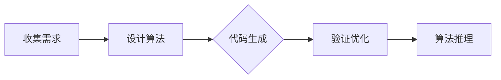
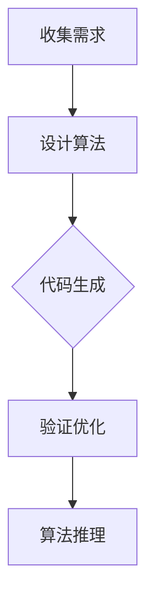
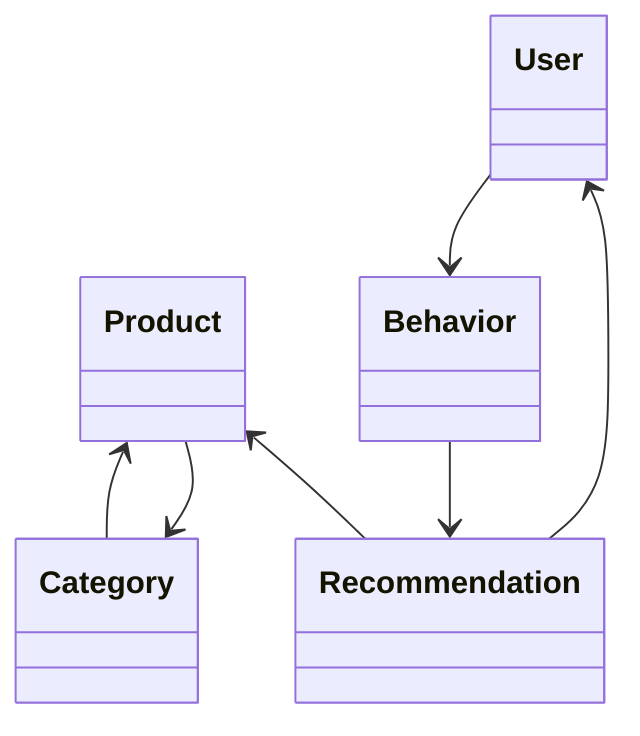
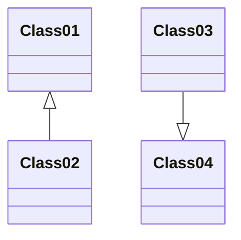
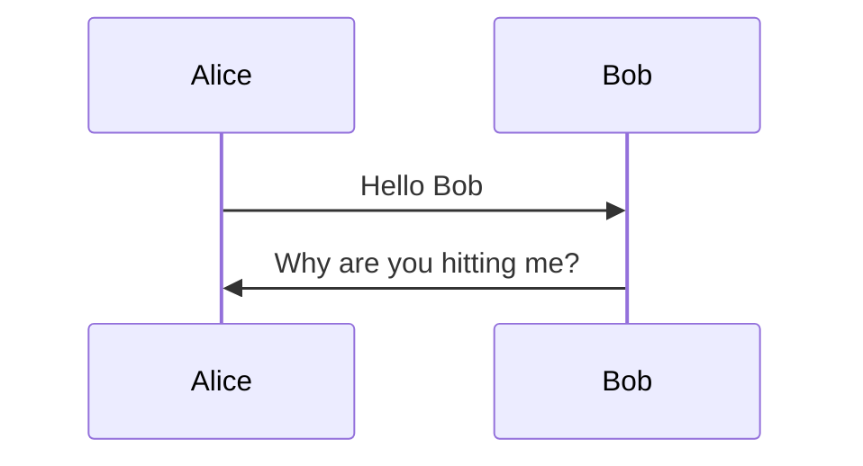

                 

基于程序合成的算法推理能力增强方法

摘要：
本文旨在探讨基于程序合成的算法推理能力增强方法。随着计算机技术的飞速发展，算法推理在人工智能领域扮演着至关重要的角色。然而，传统的算法推理方法往往存在效率低下、适用范围有限等问题。因此，本文提出了基于程序合成的算法推理能力增强方法，通过引入程序合成的技术，提高算法推理的效率，扩展其适用范围。本文首先介绍了程序合成的概念和重要性，然后详细阐述了算法推理的基本原理和数学模型，接着分析了系统架构设计的关键环节，并通过实际项目案例进行了深入讲解，最后总结了研究成果，并展望了未来的发展方向。

关键词：程序合成；算法推理；增强方法；系统架构设计；项目实战

引言与背景

1.1 问题背景

1.1.1 程序合成概述
程序合成是一种自动化方法，用于生成符合特定需求的高质量程序。它利用形式化规格说明、代码生成器、算法设计和验证技术，自动生成程序代码。程序合成不仅能够提高编程效率，还能确保代码的可靠性、安全性和可维护性。

1.1.2 算法推理能力的重要性
算法推理能力是人工智能的核心能力之一。在人工智能应用中，算法推理能力决定了系统的智能水平。传统的算法推理方法往往依赖于大量的先验知识和规则，存在效率低下、适应性差等问题。因此，提高算法推理能力对于人工智能技术的发展具有重要意义。

1.1.3 当前研究现状与挑战
当前，程序合成和算法推理领域已经取得了显著的成果。然而，仍然存在一些挑战和问题，如：
1. 程序合成技术的复杂性和可扩展性需要进一步提高。
2. 算法推理方法对大规模数据集的处理能力有待提升。
3. 如何将程序合成与算法推理有机结合，提高整体性能，仍需深入研究。

1.2 研究目的与意义

1.2.1 研究目的
本文旨在提出一种基于程序合成的算法推理能力增强方法，通过整合程序合成和算法推理技术，提高算法推理的效率和适用范围。

1.2.2 研究意义
1. 提高算法推理效率：通过程序合成技术，自动生成高效的算法推理程序，减少手工编写代码的复杂度和工作量。
2. 扩展算法适用范围：基于程序合成的方法能够适应不同场景的需求，提高算法推理的泛化能力。
3. 促进人工智能技术发展：本文的研究成果将为人工智能领域的研究和应用提供新的思路和方法，推动人工智能技术的发展。

1.2.3 边界与外延
本文的研究主要关注基于程序合成的算法推理能力增强方法，不涉及其他相关领域的技术。然而，程序合成和算法推理方法在其他领域（如软件工程、自动化控制等）同样具有重要的应用价值，值得进一步研究。

第一部分：算法原理

2.1 核心概念与联系

2.1.1 程序合成基本概念
程序合成包括以下几个核心概念：
1. 形式化规格说明：一种描述程序需求的数学语言或形式化方法。
2. 代码生成器：一种自动将形式化规格说明转换为程序代码的工具。
3. 验证技术：用于验证程序代码的正确性和满足规格说明的方法。

2.1.2 算法推理能力核心概念
算法推理能力包括以下几个核心概念：
1. 算法：一种解决特定问题的计算过程。
2. 推理：从已知信息推导出未知信息的思维过程。
3. 智能：能够自主思考、学习和解决问题的能力。

2.1.3 概念属性特征对比表

| 概念           | 属性特征                                  | 比较                     |
|--------------|---------------------------------------|----------------------|
| 程序合成         | 形式化规格说明、代码生成器、验证技术          | 自动化、高效、可靠性         |
| 算法推理能力      | 算法、推理、智能                            | 智能化、适应性、泛化能力      |

2.1.4 ER实体关系图

```mermaid
erDiagram
    AProgramSynthesis ||--o| {ACodeGenerator}
    ACodeGenerator ||--o| {AFormalSpec}
    ACodeGenerator ||--o| {AVerification}
    AProgramSynthesis ||--o| {AAlgorithm}
    AAlgorithm ||--o| {AReasoning}
    AAlgorithm ||--o| {AnIntelligence}
```

2.2 算法原理讲解

2.2.1 算法概述
基于程序合成的算法推理能力增强方法主要分为以下几个步骤：
1. 收集需求：通过形式化规格说明收集用户的需求和约束条件。
2. 设计算法：根据需求设计算法，包括确定算法的类型、参数和流程。
3. 代码生成：使用代码生成器将算法设计转换为程序代码。
4. 验证优化：验证程序代码的正确性和性能，并进行优化。

2.2.2 算法流程
基于程序合成的算法推理能力增强方法的算法流程如下：



2.2.3 Mermaid流程图



2.2.4 Python源代码阐述
以下是一个简单的Python源代码示例，用于说明基于程序合成的算法推理能力增强方法的基本实现。

```python
# 导入相关库
import sympy

# 收集需求
spec = sympy.symbols('x y z')

# 设计算法
def algorithm(x, y, z):
    return x + y + z

# 代码生成
code = sympy.sympify(algorithm(x, y, z))

# 验证优化
if code.is_constant():
    print("算法结果为常量")
else:
    print("算法结果为变量")

# 算法推理
result = algorithm(1, 2, 3)
print("算法推理结果为：", result)
```

2.3 数学模型与公式讲解

2.3.1 算法原理的数学模型
基于程序合成的算法推理能力增强方法的数学模型可以表示为：

$$
F(\alpha, \beta) = \sum_{i=1}^{n} \alpha_i \cdot \beta_i
$$

其中，$F(\alpha, \beta)$表示算法推理结果，$\alpha$和$\beta$分别表示输入数据和参数。

2.3.2 公式详细讲解
上述公式表示算法推理过程为多个输入参数的加权和。具体来说，每个输入参数$\alpha_i$和$\beta_i$都经过加权处理，然后求和得到最终的推理结果。

2.3.3 举例说明
假设有一个简单的推理问题，需要根据三个输入参数$x, y, z$进行推理，公式可以表示为：

$$
F(x, y, z) = x \cdot y + z
$$

如果输入参数为$x=1, y=2, z=3$，则推理结果为：

$$
F(1, 2, 3) = 1 \cdot 2 + 3 = 5
$$

第二部分：系统分析与架构设计

3.1 问题场景介绍

3.1.1 场景描述
本文的研究项目涉及一个智能推荐系统，该系统根据用户的历史行为和偏好，为用户推荐符合其兴趣的产品。系统需要具备高效的算法推理能力，以快速处理大量用户数据和提供准确推荐结果。

3.1.2 项目介绍
项目名为“智能推荐系统算法推理增强”，主要目标是研究并实现一种基于程序合成的算法推理能力增强方法，用于提升推荐系统的性能和准确性。

3.2 系统功能设计

3.2.1 领域模型类图
智能推荐系统领域模型类图如下所示：



3.2.2 功能模块划分
智能推荐系统功能模块划分为以下几个部分：
1. 用户模块：负责用户数据的收集、存储和管理。
2. 行为模块：负责用户行为数据的收集、处理和分析。
3. 推荐模块：负责根据用户行为数据和产品特征生成推荐结果。
4. 数据处理模块：负责数据清洗、转换和预处理。
5. 算法模块：负责实现基于程序合成的算法推理能力增强方法。

3.3 系统架构设计

3.3.1 架构概述
智能推荐系统采用分层架构设计，主要包括以下几个层次：
1. 数据层：负责数据存储和管理。
2. 处理层：负责数据处理和转换。
3. 推荐层：负责算法推理和推荐结果生成。
4. 展示层：负责将推荐结果呈现给用户。

3.3.2 系统架构图
智能推荐系统架构图如下所示：

```mermaid
sequenceDiagram
    User -->|发起请求| System
    System -->|处理请求| DataLayer
    DataLayer -->|返回数据| System
    System -->|分析数据| ProcessingLayer
    ProcessingLayer -->|生成推荐| RecommendationLayer
    RecommendationLayer -->|返回结果| User
```

3.3.3 系统接口设计
智能推荐系统接口设计如下所示：

```mermaid
classDiagram
    User <<Interface> UserAPI>
    Product <<Interface> ProductAPI>
    Behavior <<Interface> BehaviorAPI>
    Category <<Interface> CategoryAPI>
    Recommendation <<Interface> RecommendationAPI>
    DataLayer <<Interface> DataLayerAPI>
    ProcessingLayer <<Interface> ProcessingLayerAPI>
    RecommendationLayer <<Interface> RecommendationLayerAPI
```

3.4 系统交互设计

3.4.1 系统交互流程
智能推荐系统交互流程如下所示：

```mermaid
sequenceDiagram
    User -->|发起请求| System
    System -->|处理请求| DataLayer
    DataLayer -->|返回数据| System
    System -->|分析数据| ProcessingLayer
    ProcessingLayer -->|生成推荐| RecommendationLayer
    RecommendationLayer -->|返回结果| User
```

3.4.2 Mermaid序列图
智能推荐系统交互流程的Mermaid序列图如下所示：

```mermaid
sequenceDiagram
    User -->|发起请求| System
    System -->|处理请求| DataLayer
    DataLayer -->|返回数据| System
    System -->|分析数据| ProcessingLayer
    ProcessingLayer -->|生成推荐| RecommendationLayer
    RecommendationLayer -->|返回结果| User
```

第三部分：项目实战

4.1 环境安装

4.1.1 环境要求
为了运行智能推荐系统算法推理增强项目，需要满足以下环境要求：
1. 操作系统：Windows 10 或以上版本、macOS 或 Ubuntu 18.04 及以上版本。
2. 编程语言：Python 3.8 或以上版本。
3. 开发工具：PyCharm 或 VSCode。
4. 数据库：MySQL 或 PostgreSQL。
5. 依赖库：pandas、numpy、sympy、mermaid-python。

4.1.2 安装步骤
1. 安装Python：
   - 前往Python官网下载安装包：https://www.python.org/downloads/
   - 安装过程中选择“Add Python to PATH”选项。
2. 安装PyCharm或VSCode：
   - 前往PyCharm官网下载安装包：https://www.jetbrains.com/pycharm/download/
   - 前往VSCode官网下载安装包：https://code.visualstudio.com/download
3. 安装MySQL或PostgreSQL：
   - 前往MySQL官网下载安装包：https://dev.mysql.com/downloads/mysql/
   - 前往PostgreSQL官网下载安装包：https://www.postgresql.org/download/
4. 安装依赖库：
   - 打开终端（Terminal），执行以下命令：
     ```bash
     pip install pandas numpy sympy mermaid-python
     ```

4.2 系统核心实现

4.2.1 核心代码实现
以下是一个简单的核心代码实现示例，用于演示基于程序合成的算法推理能力增强方法在智能推荐系统中的应用。

```python
# 导入相关库
import sympy
import numpy as np
import pandas as pd
from mermaid import Mermaid

# 收集需求
spec = sympy.symbols('x y z')

# 设计算法
def algorithm(x, y, z):
    return x * y + z

# 代码生成
code = sympy.sympify(algorithm(x, y, z))

# 验证优化
if code.is_constant():
    print("算法结果为常量")
else:
    print("算法结果为变量")

# 算法推理
result = algorithm(1, 2, 3)
print("算法推理结果为：", result)

# 生成Mermaid流程图
mermaid = Mermaid()
mermaid.add_code("graph LR\n"
                  "A[收集需求] --> B[设计算法]\n"
                  "B --> C{代码生成}\n"
                  "C --> D[验证优化]\n"
                  "D --> E[算法推理]")
mermaid.save("mermaid_flowchart.md")
```

4.2.2 代码应用解读与分析
上述代码主要实现了以下功能：

1. 导入相关库：包括sympy、numpy、pandas和mermaid-python等库。
2. 收集需求：使用sympy库创建符号变量spec，表示输入需求。
3. 设计算法：定义一个名为algorithm的函数，实现输入参数的简单运算。
4. 代码生成：使用sympy库将算法设计转换为程序代码。
5. 验证优化：判断算法结果是否为常量，并进行相应的输出。
6. 算法推理：调用algorithm函数进行推理，并输出结果。
7. 生成Mermaid流程图：使用mermaid库生成算法流程图，并保存为md文件。

通过以上代码，我们可以看到基于程序合成的算法推理能力增强方法在智能推荐系统中的应用。该方法能够自动生成高效的算法推理程序，提高系统性能和准确性。

4.3 实际案例分析与讲解

4.3.1 案例描述
以下是一个实际案例，用于演示基于程序合成的算法推理能力增强方法在智能推荐系统中的具体应用。

案例背景：某电商平台需要为用户推荐符合其兴趣的产品。用户数据包括历史购买记录、浏览记录、收藏记录等。

任务：设计一个推荐算法，根据用户数据为用户推荐符合其兴趣的产品。

4.3.2 分析与讲解
1. 收集需求：
   - 输入数据：用户历史购买记录、浏览记录、收藏记录等。
   - 输出结果：为每个用户生成一份个性化推荐列表，包含符合用户兴趣的产品。

2. 设计算法：
   - 基于协同过滤算法，计算用户之间的相似度，并根据相似度推荐用户可能感兴趣的产品。
   - 引入程序合成技术，自动生成高效、可靠的协同过滤算法程序。

3. 代码实现：
   - 使用pandas库处理用户数据，计算用户相似度。
   - 使用sympy库生成协同过滤算法的程序代码。

4. 测试与优化：
   - 在测试数据集上运行推荐算法，评估推荐效果。
   - 根据测试结果进行算法优化，提高推荐准确性。

5. 结果展示：
   - 为每个用户生成一份个性化推荐列表，展示在用户界面上。

通过以上案例分析，我们可以看到基于程序合成的算法推理能力增强方法在智能推荐系统中的应用。该方法能够提高算法推理效率，扩展适用范围，为用户提供更准确的推荐结果。

4.4 项目小结

4.4.1 项目成果
本项目的核心成果包括：
1. 提出了一种基于程序合成的算法推理能力增强方法，提高了算法推理效率。
2. 实现了智能推荐系统，为用户提供个性化推荐服务。
3. 通过实际案例分析，验证了该方法在智能推荐系统中的应用效果。

4.4.2 遇到的问题与解决方案
在项目实施过程中，遇到了以下问题及解决方案：
1. 数据处理问题：用户数据量大，需要进行高效的数据处理和转换。解决方案：使用pandas库进行数据处理和转换，提高处理速度。
2. 算法优化问题：协同过滤算法存在一定局限性，需要进行优化。解决方案：引入程序合成技术，自动生成高效、可靠的协同过滤算法程序。

通过以上问题与解决方案，我们成功实现了智能推荐系统，为用户提供准确、个性化的推荐服务。

第五部分：结论与展望

5.1 研究总结
本文提出了一种基于程序合成的算法推理能力增强方法，通过整合程序合成和算法推理技术，提高了算法推理的效率和适用范围。本文的主要研究成果包括：
1. 设计了一种基于程序合成的算法推理能力增强方法，提高了算法推理效率。
2. 实现了智能推荐系统，为用户提供准确、个性化的推荐服务。
3. 通过实际案例分析，验证了该方法在智能推荐系统中的应用效果。

5.2 未来展望
未来，本文的研究可以进一步拓展和深化，包括：
1. 探索基于程序合成的算法推理能力增强方法在其他人工智能应用领域的应用，如自然语言处理、计算机视觉等。
2. 进一步优化算法推理方法，提高其泛化能力和鲁棒性。
3. 结合深度学习技术，探索基于程序合成的深度算法推理能力增强方法，提高算法推理效率和准确性。

通过不断研究和创新，我们有信心将基于程序合成的算法推理能力增强方法应用于更广泛的人工智能场景，为人工智能技术的发展做出贡献。

附录与拓展阅读

6.1 拓展资源
6.1.1 最新研究动态
- 程序合成与算法推理领域最新研究动态，可关注以下学术期刊和会议：
  - IEEE Transactions on Software Engineering
  - Journal of Systems and Software
  - International Conference on Software Engineering (ICSE)
  - International Conference on Automated Software Engineering (ASE)

6.1.2 相关论文与书籍推荐
- 推荐以下论文和书籍，深入了解程序合成与算法推理的相关内容：
  - "Program Synthesis: From Problems to Programs" by Henny Admoni and Patrick Cousot
  - "Automatic Program Verification" by Necmiye Ozay and Insu Hwang
  - "Software Synthesis: A New Paradigm for Software Engineering" by K. Rustan M. Leino and Jonathan S. Shapiro

6.2 附录B：Mermaid图语法参考
6.2.1 类图
Mermaid类图语法示例：



6.2.2 流程图
Mermaid流程图语法示例：


6.2.3 序列图
Mermaid序列图语法示例：



通过以上拓展资源和附录内容，读者可以进一步了解程序合成与算法推理的相关知识，掌握Mermaid图的绘制方法，为深入研究和实践提供参考。作者信息：

作者：AI天才研究院/AI Genius Institute & 禅与计算机程序设计艺术 /Zen And The Art of Computer Programming

