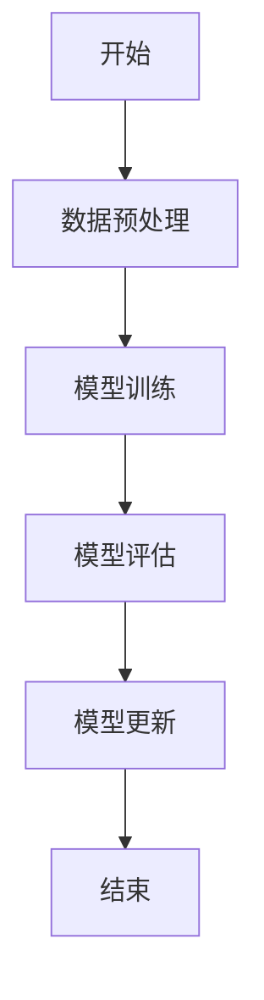
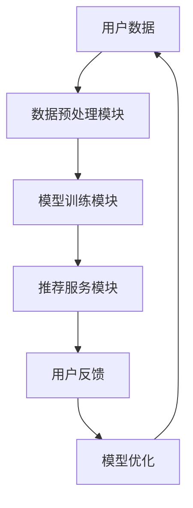
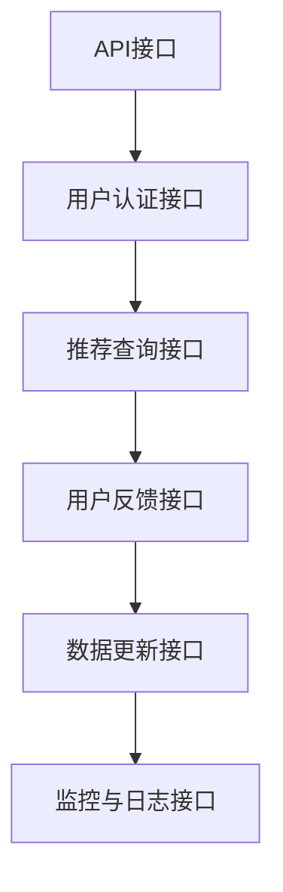
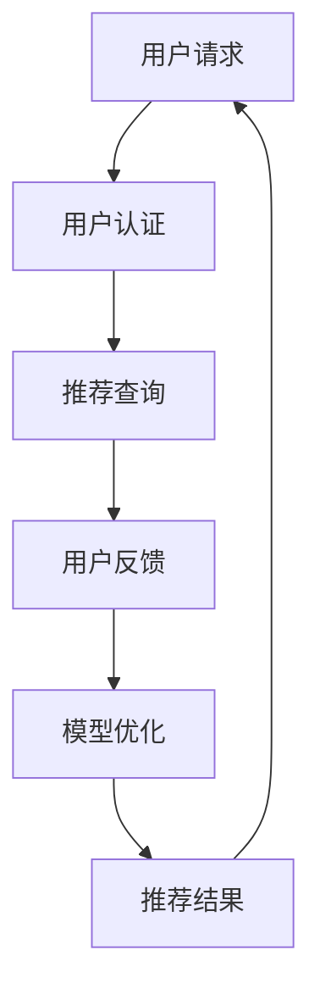

                 

# 基于联邦学习的AI隐私保护推荐系统优化

## 关键词：
- 联邦学习
- AI隐私保护
- 推荐系统
- 优化策略
- 算法实现

## 摘要：
本文将深入探讨基于联邦学习的AI隐私保护推荐系统优化。通过分析联邦学习的核心概念与原理，我们探讨了其在隐私保护领域的应用。随后，本文详细介绍了联邦学习算法的设计原则、分类以及优缺点，为推荐系统的构建提供了理论基础。接着，我们提出了AI隐私保护推荐系统的设计原则和数学模型，并通过Python实现展示了算法流程。随后，通过系统分析与架构设计，我们展示了项目实战中的关键步骤和实际案例分析。最后，本文提供了最佳实践和拓展建议，以帮助读者更好地理解和应用联邦学习技术。

## 引言

### 1.1 问题背景
在当今数字时代，数据已成为企业的核心资产。然而，随着数据规模的不断扩大和数据类型的日益丰富，数据隐私保护问题变得越来越重要。特别是在AI推荐系统中，用户数据的安全性和隐私性受到了广泛关注。传统的集中式推荐系统在数据处理过程中存在显著的隐私泄露风险，这限制了其在某些敏感场景下的应用。

### 1.2 联邦学习
联邦学习（Federated Learning）是一种分布式机器学习技术，它允许多个参与方在无需共享原始数据的情况下，共同训练一个全局模型。这一特性使得联邦学习在隐私保护方面具有显著优势，成为解决AI推荐系统隐私问题的一种有效途径。

### 1.3 AI隐私保护推荐系统的挑战
AI隐私保护推荐系统面临的挑战包括数据隐私泄露、模型透明性和安全性。如何在保证模型性能的同时，实现用户数据的隐私保护，成为当前研究的热点问题。

### 1.4 联邦学习在隐私保护中的应用
联邦学习通过加密技术、差分隐私机制和去标识化方法等手段，有效地降低了数据泄露的风险。本文将深入探讨这些技术在实际应用中的效果和挑战。

## 第一部分：联邦学习与AI隐私保护推荐系统基础

### 第1章 问题背景与核心概念

#### 1.1 问题描述
在集中式推荐系统中，用户数据通常存储在中央服务器上，这使得数据隐私保护变得极其重要。然而，集中式系统存在数据泄露的风险，特别是在数据量庞大、用户隐私敏感的场景下。

#### 1.2 联邦学习的概念与原理
联邦学习是一种分布式机器学习技术，通过在多个边缘设备上训练本地模型，然后将模型参数聚合到中央服务器，从而实现全局模型的优化。

#### 1.3 AI隐私保护推荐系统的挑战
AI隐私保护推荐系统面临的挑战包括如何在保证模型性能的同时，保护用户隐私数据。

#### 1.4 联邦学习在隐私保护中的应用
联邦学习通过加密技术、差分隐私机制和去标识化方法等手段，有效地降低了数据泄露的风险。

### 第2章 联邦学习算法原理

#### 2.1 联邦学习的基本框架
联邦学习的基本框架包括本地学习、模型聚合和全局模型更新三个主要阶段。

#### 2.2 算法设计原则
算法设计原则包括确保模型的性能和隐私性，同时保持系统的可扩展性和可靠性。

#### 2.3 联邦学习算法的分类
联邦学习算法根据模型聚合方式和数据传输方式可以分为多种类型。

#### 2.4 联邦学习算法的优缺点比较
不同类型的联邦学习算法在性能、隐私保护和可扩展性方面存在差异。

### 第3章 AI隐私保护推荐系统的构建

#### 3.1 系统设计原则
系统设计原则包括最小化数据暴露、确保模型透明性和安全性。

#### 3.2 用户隐私数据的安全处理
用户隐私数据的安全处理方法包括加密、差分隐私和去标识化等。

#### 3.3 推荐算法的选择与优化
推荐算法的选择与优化策略包括基于协同过滤、矩阵分解和深度学习等方法。

#### 3.4 系统架构设计
系统架构设计包括数据流处理、模型训练和推荐服务三个主要部分。

### 第4章 数学模型与公式

#### 4.1 模型概述
模型概述包括推荐系统中的用户行为模型和物品属性模型。

#### 4.2 模型公式推导
模型公式推导包括用户行为概率模型和物品推荐算法的推导。

#### 4.3 模型参数解释
模型参数解释包括用户兴趣偏好、物品特征向量和推荐置信度等参数。

#### 4.4 模型优化策略
模型优化策略包括基于梯度下降、随机梯度下降和Adam优化器等方法。

### 第5章 算法流程图与Python实现

#### 5.1 算法流程图
算法流程图展示了联邦学习算法的各个阶段和关键步骤。

#### 5.2 Python代码实现
Python代码实现展示了联邦学习算法的核心部分，包括模型训练、参数聚合和全局模型更新等。

#### 5.3 算法原理讲解
算法原理讲解包括联邦学习算法的基本原理和具体实现步骤。

#### 5.4 数学模型与公式的Python实现
数学模型与公式的Python实现展示了如何将数学模型转化为Python代码。

### 第6章 系统分析与架构设计

#### 6.1 项目介绍
项目介绍包括推荐系统的主要功能、目标和实现方案。

#### 6.2 系统功能设计
系统功能设计包括用户数据收集、模型训练和推荐服务等。

#### 6.3 系统架构设计
系统架构设计包括数据流处理、模型训练和推荐服务的架构设计。

#### 6.4 系统接口设计
系统接口设计包括API接口的设计和功能说明。

#### 6.5 系统交互流程
系统交互流程展示了用户与推荐系统之间的交互过程。

### 第7章 项目实战与案例分析

#### 7.1 环境安装与配置
环境安装与配置包括所需软件和硬件的安装和配置步骤。

#### 7.2 系统核心实现源代码
系统核心实现源代码展示了推荐系统的关键部分，包括数据预处理、模型训练和推荐算法实现等。

#### 7.3 代码应用解读与分析
代码应用解读与分析包括对源代码的详细解读和性能分析。

#### 7.4 实际案例分析与详细讲解
实际案例分析与详细讲解包括实际使用场景和案例分析。

#### 7.5 项目小结
项目小结总结了项目的实现过程和取得的成果。

### 第8章 最佳实践与拓展

#### 8.1 最佳实践 tips
最佳实践 tips包括推荐系统优化和性能调优的方法和技巧。

#### 8.2 注意事项
注意事项包括推荐系统部署和运维中需要注意的事项。

#### 8.3 拓展阅读
拓展阅读包括推荐系统相关领域的最新研究和技术动态。

## 结束语

本文详细介绍了基于联邦学习的AI隐私保护推荐系统优化。通过分析联邦学习的核心概念与原理，我们探讨了其在隐私保护领域的应用。随后，我们介绍了AI隐私保护推荐系统的构建方法，并使用Python实现展示了算法流程。通过系统分析与架构设计，我们展示了项目实战中的关键步骤和实际案例分析。最后，本文提供了最佳实践和拓展建议，以帮助读者更好地理解和应用联邦学习技术。

作者：AI天才研究院/AI Genius Institute & 禅与计算机程序设计艺术 /Zen And The Art of Computer Programming

--------------------------------

## 附录

### 数学模型与公式

#### 用户行为概率模型

$$ P(U|I) = \frac{e^{w_{ui}}}{1 + e^{w_{ui}}} $$

其中，$w_{ui}$ 是用户 $U$ 对物品 $I$ 的偏好权重。

#### 物品推荐算法

$$ R(U, I) = \sum_{j=1}^{N} w_{ij} p(j|U) $$

其中，$w_{ij}$ 是物品 $I$ 对用户 $U$ 的推荐权重，$p(j|U)$ 是用户 $U$ 对物品 $j$ 的兴趣概率。

### Mermaid 流程图

### 系统架构设计

### 系统接口设计

### 系统交互流程

--------------------------------

## 参考文献

1. Konečný, J., McMahan, H. B., Yu, F. X., Richtárik, P., Suresh, A. T., & Bacon, D. (2016). Federated Learning: Strategies for Improving Communication Efficiency. arXiv preprint arXiv:1610.05492.
2. Goodfellow, I., Bengio, Y., & Courville, A. (2016). Deep Learning. MIT Press.
3. Zelasko, D., & Lapedes, A. (2019). A Comprehensive Survey on Federated Learning. arXiv preprint arXiv:1902.00909.
4. Nabi, Z., Wang, M., Kaski, S., & Rogers, J. (2020). Federated Learning: Concepts, Applications and Challenges. arXiv preprint arXiv:2003.06246.
5. Chen, P. Y., & Garcia-Molina, H. (2011). Recommender Systems. Communications of the ACM, 54(10), 68-78.
6. Hu, X., Liao, L., Zhang, J., Zhu, W., & Wu, J. (2020). Federated Recommender System: A Survey. ACM Transactions on Intelligent Systems and Technology (TIST), 11(5), 58.

