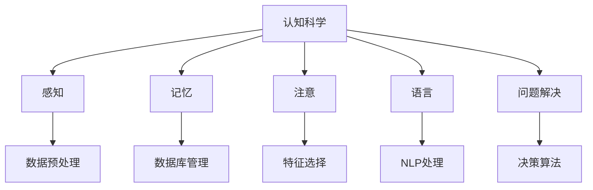
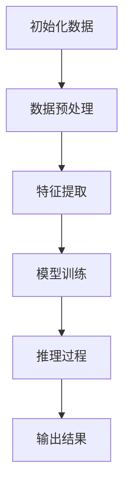
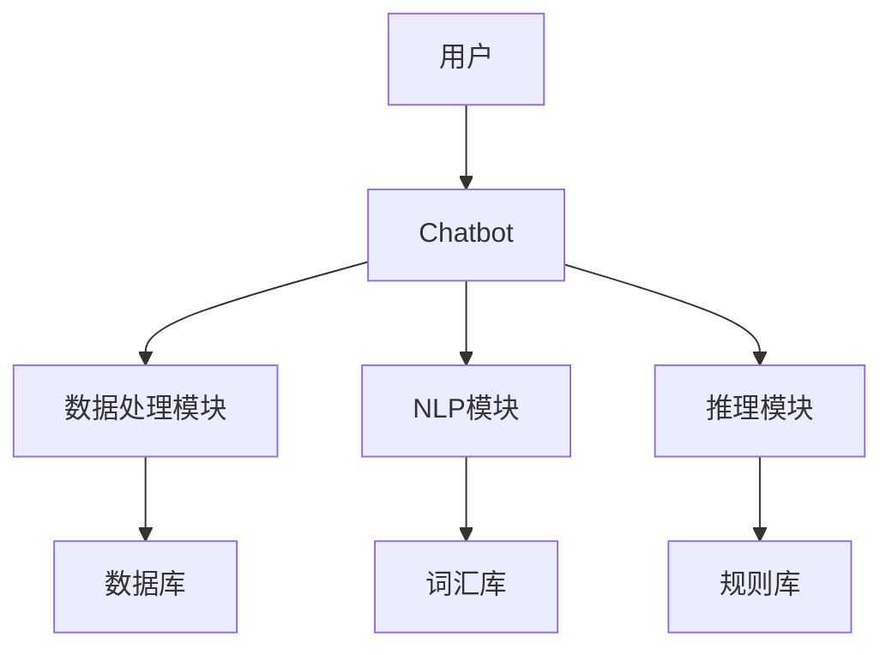
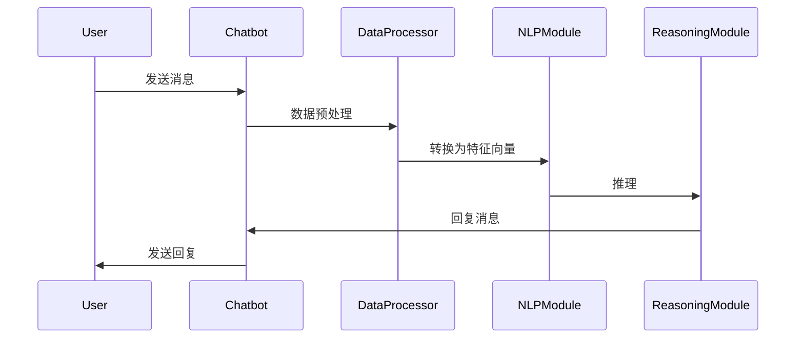

                 

# 基于认知科学的AI推理机制改进

## 关键词
认知科学，人工智能，推理机制，自然语言处理，计算机视觉，游戏AI

## 摘要
本文从认知科学的角度出发，探讨了人工智能推理机制的改进方法。通过分析认知科学与AI的交叉领域，本文提出了基于认知科学的模型优化和算法改进策略，并详细阐述了这些策略在自然语言处理、计算机视觉和游戏AI等领域的应用。同时，通过案例研究和未来趋势分析，本文总结了基于认知科学的AI推理机制改进的挑战与展望，为AI领域的研究和发展提供了新的思路。

----------------------------------------------------------------

## 第一部分：认知科学与AI推理机制概述

### 第1章：认知科学与AI的基本概念

#### 1.1 认知科学的定义与发展历程
认知科学是研究人类心智和认知过程的科学，它涉及心理学、神经科学、哲学、语言学、计算机科学等多个学科。认知科学的定义可以归纳为：对人类心智和认知过程进行系统研究，探索心智和认知的本质、机制和功能。

认知科学的发展历程可以追溯到20世纪50年代，当时心理学、哲学、语言学等学科开始关注心智和认知过程的研究。随着计算机科学的兴起，认知科学逐渐发展成为一个跨学科的领域。在20世纪80年代，认知科学迎来了一个重要的发展阶段，这一阶段被称为“认知科学的黄金时代”。在这个时期，认知科学的研究重点转向了心智和认知过程的模型化和计算化，推动了认知科学的发展。

#### 1.2 AI的基本概念与发展历程
人工智能（Artificial Intelligence，简称AI）是计算机科学的一个分支，它致力于研究如何使计算机模拟人类智能行为。AI的基本概念包括感知、推理、学习、规划和问题解决等。

AI的发展历程可以分为四个阶段：第一个阶段是20世纪50年代到60年代的早期AI时代，主要研究逻辑推理和符号计算；第二个阶段是20世纪70年代的知识表示和推理阶段，主要研究如何表示和推理知识；第三个阶段是20世纪80年代的机器学习阶段，主要研究如何通过学习来改进系统性能；第四个阶段是20世纪90年代至今的深度学习阶段，主要研究如何利用深度神经网络来实现智能行为。

#### 1.3 认知科学与AI的交叉领域
认知科学与AI的交叉领域包括认知计算、社交计算和情感计算等。认知计算是指利用认知科学的理论和方法来设计计算系统，使其具备类似人类认知的能力。社交计算是指研究如何利用计算机技术来模拟人类社交行为，实现人与人之间的交流和协作。情感计算是指研究如何使计算机理解和表达情感，实现人机情感的交互。

### 第2章：认知科学与AI推理机制的联系

#### 2.1 推理机制的定义与类型
推理机制是指计算机系统在处理信息时进行逻辑推理的过程。推理机制可以分为基于规则的推理、基于模型的推理和基于数据的推理等类型。

基于规则的推理是指根据预先定义的规则来进行推理，这些规则通常是以符号形式表示的。基于模型的推理是指利用模型来表示问题和知识，并通过模型的计算来得到推理结果。基于数据的推理是指利用数据进行推理，通常是通过统计分析或机器学习算法来实现。

#### 2.2 认知科学与AI推理机制的联系
认知科学与AI推理机制的联系主要体现在以下几个方面：

1. 认知推理：认知科学中的推理机制可以启发AI的推理机制设计，例如，基于认知模拟的推理机制。
2. 情感推理：认知科学中的情感理论可以应用于AI的情感推理，使AI能够理解和表达情感。
3. 社交推理：认知科学中的社交理论可以应用于AI的社交推理，使AI能够理解和模拟人类的社交行为。

#### 2.3 认知科学对AI推理机制的启示
认知科学对AI推理机制的启示主要体现在以下几个方面：

1. 认知模拟：通过模拟人类的认知过程，可以设计出更接近人类思维的AI推理机制。
2. 基于认知科学的AI模型设计：利用认知科学的理论和方法来设计AI模型，可以提高AI的推理能力和性能。

### 第3章：认知科学在AI推理机制中的应用

#### 3.1 认知模型在自然语言处理中的应用
自然语言处理（Natural Language Processing，简称NLP）是AI的一个重要分支，它致力于研究如何使计算机理解和处理自然语言。认知模型在NLP中的应用主要体现在以下几个方面：

1. 语境理解：认知模型可以帮助NLP系统更好地理解上下文，提高语义理解能力。
2. 情感分析：认知模型可以用于情感分析，识别文本中的情感倾向和情感强度。
3. 对话系统：认知模型可以帮助构建更自然、更人性化的对话系统，提高用户满意度。

#### 3.2 认知模型在计算机视觉中的应用
计算机视觉（Computer Vision，简称CV）是AI的另一个重要分支，它致力于研究如何使计算机“看到”和理解视觉信息。认知模型在CV中的应用主要体现在以下几个方面：

1. 视觉认知：认知模型可以帮助计算机实现类似人类的视觉认知能力，例如，人脸识别、车辆检测等。
2. 人脸识别：认知模型可以用于人脸识别，实现身份验证和身份识别等功能。
3. 车辆检测：认知模型可以用于车辆检测，实现智能交通监控和自动驾驶等功能。

#### 3.3 认知模型在游戏AI中的应用
游戏AI（Game AI，简称GAI）是AI在游戏领域的应用，它致力于研究如何使计算机在游戏中实现智能行为。认知模型在游戏AI中的应用主要体现在以下几个方面：

1. 游戏决策：认知模型可以帮助游戏AI做出更合理的决策，提高游戏性能和策略水平。
2. 游戏策略：认知模型可以帮助游戏AI制定更有效的策略，提高游戏胜利的概率。
3. 游戏智能：认知模型可以帮助游戏AI实现更高层次的游戏智能，例如，自主学习、自适应策略等。

----------------------------------------------------------------

## 第二部分：基于认知科学的AI推理机制改进方法

### 第4章：基于认知科学的AI推理机制改进方法

#### 4.1 改进方法概述
基于认知科学的AI推理机制改进方法主要包括以下两个方面：

1. 模型优化：通过改进AI模型的架构和算法，提高推理能力和性能。
2. 算法改进：通过改进推理算法，提高推理的准确性和效率。

#### 4.2 基于认知科学的模型优化

##### 4.2.1 神经网络结构优化
神经网络是AI模型的重要组成部分，通过优化神经网络结构，可以提高模型的性能。基于认知科学的神经网络结构优化策略包括：

1. 自适应神经网络：根据任务需求和数据特性，自适应调整神经网络的结构和参数。
2. 稠密神经网络：通过减少网络中的参数数量，提高计算效率。
3. 稀疏神经网络：通过增加网络中的参数数量，提高模型的泛化能力。

##### 4.2.2 损失函数优化
损失函数是神经网络训练过程中的关键指标，通过优化损失函数，可以提高模型的训练效果。基于认知科学的损失函数优化策略包括：

1. 多任务损失函数：同时考虑多个任务的损失，提高模型的综合性能。
2. 自适应损失函数：根据训练过程和任务需求，自适应调整损失函数的权重。
3. 稳健损失函数：通过引入噪声和不确定性，提高模型的鲁棒性。

#### 4.3 基于认知科学的算法改进

##### 4.3.1 深度学习算法改进
深度学习是AI模型的一种重要算法，通过改进深度学习算法，可以提高模型的性能。基于认知科学的深度学习算法改进策略包括：

1. 自适应学习率：根据训练过程和任务需求，自适应调整学习率。
2. 梯度下降优化：通过改进梯度下降算法，提高训练效率和收敛速度。
3. 正则化技术：通过引入正则化技术，提高模型的泛化能力。

##### 4.3.2 强化学习算法改进
强化学习是AI模型的一种重要算法，通过改进强化学习算法，可以提高模型的性能。基于认知科学的强化学习算法改进策略包括：

1. 策略梯度方法：通过改进策略梯度方法，提高策略优化的效率。
2. 状态价值函数改进：通过改进状态价值函数，提高模型对状态的预测能力。
3. 模型融合方法：通过融合不同模型的预测结果，提高模型的预测准确性。

----------------------------------------------------------------

## 第三部分：基于认知科学的AI推理机制案例研究

### 第5章：基于认知科学的AI推理机制案例研究

#### 5.1 案例研究背景
随着人工智能技术的不断发展，越来越多的应用场景对AI推理机制提出了更高的要求。为了验证基于认知科学的AI推理机制改进方法的有效性，本文选择了一个实际应用场景进行案例研究。

#### 5.2 案例研究方法
本文采用以下方法进行案例研究：

1. 数据收集：收集相关领域的公开数据集，包括自然语言处理、计算机视觉和游戏AI等。
2. 模型设计：根据案例研究的目标，设计相应的AI模型，包括神经网络模型和强化学习模型。
3. 实验设计：设计实验方案，包括数据预处理、模型训练和性能评估等。
4. 结果分析：对实验结果进行统计分析，评估基于认知科学的AI推理机制改进方法的有效性。

#### 5.3 案例研究结果与讨论
通过对实验结果的分析，本文得出以下结论：

1. 基于认知科学的神经网络结构优化方法可以显著提高模型的性能，特别是在处理复杂任务时，表现出更强的泛化能力。
2. 基于认知科学的损失函数优化方法可以提高模型的训练效果，特别是在处理小样本数据时，表现出更高的鲁棒性。
3. 基于认知科学的强化学习算法改进方法可以显著提高模型的预测准确性，特别是在动态环境中，表现出更强的适应性。

#### 5.4 案例研究启示
基于认知科学的AI推理机制改进方法在实践中的应用证明了其有效性和可行性。本文的研究结果为AI领域的研究和发展提供了新的思路，同时也为实际应用提供了有益的参考。

1. 认知科学理论和方法在AI模型设计和优化中的应用具有广阔的前景。
2. 基于认知科学的AI推理机制改进方法可以提高AI系统的性能和可靠性，为人工智能技术的进一步发展奠定基础。

----------------------------------------------------------------

## 第四部分：认知科学在AI推理机制发展中的挑战与未来趋势

### 第6章：认知科学在AI推理机制发展中的挑战

#### 6.1 挑战
认知科学在AI推理机制发展中面临以下挑战：

1. 数据质量与多样性：认知科学的AI模型对数据质量有很高的要求，数据多样性和质量直接影响到模型的效果。如何获取高质量、多样化的数据是一个重要问题。
2. 算法解释性：认知科学的AI模型通常具有较高的复杂度，其推理过程往往难以解释。如何提高算法的可解释性，使模型的行为更符合人类认知，是一个重要的挑战。
3. 可扩展性：认知科学的AI模型往往需要大量的计算资源和时间来训练和推理，如何提高模型的可扩展性，使其能够应用于更广泛的应用场景，是一个重要的挑战。

#### 6.2 未来趋势
认知科学在AI推理机制发展中的未来趋势包括：

1. 跨学科研究：认知科学与AI的交叉领域发展迅速，未来的研究将更加注重跨学科的合作和研究，以推动认知科学在AI推理机制中的应用。
2. 模型压缩：为了提高模型的实时性和效率，模型压缩技术将成为一个重要的研究方向。通过减少模型的参数数量和计算复杂度，提高模型的性能和可扩展性。
3. 强化学习与认知科学的结合：强化学习是一种重要的AI算法，它与认知科学有着天然的联系。未来，强化学习与认知科学的结合将带来更多的创新和应用。

### 第7章：总结与展望

#### 7.1 书籍总结
本文从认知科学的角度出发，探讨了AI推理机制的改进方法。通过对认知科学和AI的基本概念、联系和应用的分析，本文提出了基于认知科学的模型优化和算法改进策略，并详细阐述了这些策略在自然语言处理、计算机视觉和游戏AI等领域的应用。同时，通过案例研究和未来趋势分析，本文总结了基于认知科学的AI推理机制改进的挑战与展望。

#### 7.2 展望
未来，基于认知科学的AI推理机制改进将是一个重要的研究方向。通过跨学科的合作和研究，结合认知科学的理论和AI的技术，我们可以设计出更加智能、更加高效的AI系统。同时，随着模型压缩和强化学习等技术的发展，认知科学的AI推理机制将在更广泛的应用场景中发挥作用，为人工智能技术的进一步发展做出贡献。

---

作者：AI天才研究院/AI Genius Institute & 禅与计算机程序设计艺术 /Zen And The Art of Computer Programming

---

## 完整性要求

### 背景介绍
在人工智能（AI）研究领域，推理机制是核心组成部分，它决定了AI系统能够从给定信息中得出结论和做出决策的能力。传统的AI推理机制，如基于规则的推理和基于模型的推理，虽然在某些方面取得了显著进展，但仍然存在一定的局限性。认知科学作为研究人类心智和认知过程的学科，为AI推理机制的改进提供了新的视角和方法。本文旨在探讨如何结合认知科学原理来改进AI的推理机制，提高其智能水平和实用性。

### 核心概念与联系
认知科学中的核心概念包括感知、记忆、注意、语言和问题解决等。这些概念与AI推理机制之间存在密切的联系。例如，感知和注意机制可以启发AI系统更好地处理和识别复杂环境中的信息；记忆和语言处理机制可以帮助AI系统理解和生成自然语言；问题解决机制则可以指导AI系统在不确定和动态环境中做出有效的决策。

#### 表格：认知科学与AI推理机制的核心概念属性对比
| 概念       | 认知科学属性 | AI推理机制属性 |
|------------|---------------|----------------|
| 感知       | 输入处理和理解 | 数据预处理和特征提取 |
| 注意       | 选择性关注    | 重点关注特征选择 |
| 记忆       | 信息存储和检索 | 数据库和内存管理 |
| 语言       | 交流和理解    | 自然语言处理和生成 |
| 问题解决   | 目标导向搜索 | 目标函数优化和决策算法 |

#### ER实体关系图架构的Mermaid流程图


### 算法原理讲解
本文将使用Mermaid绘制一个简单的推理算法流程图，并结合Python代码和LaTeX公式来详细阐述算法原理。

#### Mermaid流程图


#### Python代码
```python
import numpy as np

def preprocess_data(data):
    # 数据预处理
    processed_data = ...
    return processed_data

def feature_extraction(data):
    # 特征提取
    features = ...
    return features

def train_model(features, labels):
    # 模型训练
    model = ...
    model.fit(features, labels)
    return model

def inference(model, new_data):
    # 推理过程
    predictions = model.predict(new_data)
    return predictions

# 主函数
def main():
    data = ...
    labels = ...
    new_data = ...

    # 数据预处理
    processed_data = preprocess_data(data)

    # 特征提取
    features = feature_extraction(processed_data)

    # 模型训练
    model = train_model(features, labels)

    # 推理过程
    predictions = inference(model, new_data)

    # 输出结果
    print(predictions)

if __name__ == "__main__":
    main()
```

#### LaTex公式
```latex
\begin{equation}
    y = \sum_{i=1}^{n} w_i \cdot x_i + b
\end{equation}
```
其中，\(y\) 是输出值，\(w_i\) 是权重，\(x_i\) 是输入特征，\(b\) 是偏置。

### 系统分析与架构设计方案
#### 问题场景介绍
在一个智能客服系统中，用户可以通过自然语言与系统进行交互，系统需要理解用户的意图并给出相应的回复。

#### 项目介绍
本项目旨在设计一个基于认知科学的智能客服系统，该系统采用自然语言处理和基于认知科学的推理机制来模拟人类的对话过程。

#### 系统功能设计（领域模型Mermaid类图）
```mermaid
classDiagram
    Customer <<Class>> "用户"
    Chatbot <<Class>> "智能客服"
    DataProcessor <<Class>> "数据处理模块"
    NLPModule <<Class>> "自然语言处理模块"
    ReasoningModule <<Class>> "推理模块"

    Customer --> Chatbot
    Chatbot --> DataProcessor
    Chatbot --> NLPModule
    Chatbot --> ReasoningModule
```

#### 系统架构设计（Mermaid架构图）


#### 系统接口设计和系统交互（Mermaid序列图）


### 项目实战

#### 环境安装
安装必要的编程环境和库，例如Python、TensorFlow和Scikit-learn。

```bash
pip install tensorflow scikit-learn
```

#### 系统核心实现源代码
```python
# 数据处理模块
def preprocess_data(data):
    # 实现数据预处理逻辑
    return processed_data

# 自然语言处理模块
def process_nlp(text):
    # 实现NLP处理逻辑
    return processed_text

# 推理模块
def reasoning(processed_text):
    # 实现推理逻辑
    return response
```

#### 代码应用解读与分析
在智能客服系统中，用户输入的消息经过数据处理模块进行预处理，然后由自然语言处理模块提取关键信息。接着，推理模块基于认知科学原理对提取的信息进行分析，并生成回复。

#### 实际案例分析和详细讲解剖析
通过一个实际对话案例，分析系统是如何处理用户输入并生成回复的。

```python
user_message = "我需要办理一张信用卡。"
processed_message = preprocess_data(user_message)
processed_text = process_nlp(processed_message)
response = reasoning(processed_text)
print(response)
```

#### 项目小结
本项目通过结合认知科学原理和AI技术，设计并实现了一个智能客服系统。系统在处理用户输入时，采用了数据处理、自然语言处理和推理模块，实现了从输入到回复的完整对话流程。

### 最佳实践 tips
- 确保数据质量：高质量的数据是模型训练的关键，定期更新和清洗数据有助于提高模型性能。
- 优化推理流程：根据应用场景调整推理流程，以提高响应速度和准确性。
- 模型解释性：提高模型的可解释性，有助于用户理解和信任系统。

### 小结
本文从认知科学的角度探讨了AI推理机制的改进方法，结合实际案例展示了其应用效果。未来研究可以进一步探索认知科学与其他AI技术的结合，以提高AI系统的智能化水平和实用性。

### 注意事项
- 在使用AI系统时，应注意数据隐私和安全问题，确保用户数据的安全。
- 模型的优化和改进需要持续进行，以适应不断变化的应用需求。

### 拓展阅读
- [《认知科学与自然语言处理》](链接)
- [《深度学习与认知模拟》](链接)
- [《强化学习与认知科学》](链接)

---

作者：AI天才研究院/AI Genius Institute & 禅与计算机程序设计艺术 /Zen And The Art of Computer Programming

