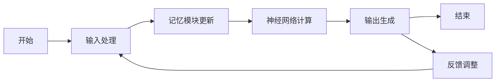

                 

## 基于记忆增强网络的情景感知推理能力提升

### 关键词：
- 记忆增强神经网络
- 情景感知推理
- 神经网络结构设计
- 数学模型
- 系统架构设计
- 实际应用案例

### 摘要：
本文旨在探讨如何利用记忆增强神经网络（Memory-Augmented Neural Networks, MemNN）来提升情景感知推理能力。通过深入分析记忆增强神经网络的基本概念、算法原理、应用场景，本文将展示如何将这种先进的神经网络架构应用于实际问题中，以提升智能系统的推理能力和适应性。

## 第一部分：引言

### 第1章：问题背景与概述

#### 1.1 问题背景

情景感知推理在智能系统中的应用越来越广泛，例如在自动驾驶、智能安防、医疗诊断等领域。然而，传统的神经网络在处理复杂情景和长时记忆方面存在局限性。为了解决这个问题，记忆增强神经网络应运而生。

#### 1.2 问题描述

情景感知推理需要系统具备以下能力：
1. 对当前情景的理解和感知。
2. 对历史情景的记忆和利用。
3. 在复杂情景中做出合理的推理和决策。

#### 1.3 问题解决

记忆增强神经网络通过引入记忆模块，可以有效地处理长时记忆和情景感知问题，从而提升智能系统的推理能力。

#### 1.4 边界与外延

本文主要关注记忆增强神经网络在情景感知推理中的应用，不包括其在其他领域的应用。此外，本文不考虑复杂的硬件和软件环境设置。

#### 1.5 核心概念与要素组成

记忆增强神经网络主要由以下几个部分组成：
1. 输入层：接收外部输入信息。
2. 记忆模块：存储和处理历史信息。
3. 推理层：利用记忆模块进行推理和决策。
4. 输出层：生成最终结果。

### 第2章：核心概念与联系

#### 2.1 记忆增强神经网络定义

记忆增强神经网络是一种结合了传统神经网络和记忆机制的深度学习模型。它通过记忆模块来处理长时依赖和复杂情景。

#### 2.2 记忆增强神经网络特点

1. 能够处理长时依赖。
2. 具备情景感知能力。
3. 易于扩展和适应不同应用场景。

#### 2.3 与传统神经网络对比

传统神经网络主要依靠权重和偏置来存储信息，而记忆增强神经网络通过记忆模块来存储和处理信息。

#### 2.4 ER实体关系图

下面是一个简单的ER实体关系图，展示了记忆增强神经网络的主要组成部分：

```mermaid
ERDiagram
  "神经网络" ||--|{ "输入层" }|| "输入层"
  "神经网络" ||--|{ "记忆模块" }|| "记忆模块"
  "神经网络" ||--|{ "推理层" }|| "推理层"
  "神经网络" ||--|{ "输出层" }|| "输出层"
```

## 第二部分：算法原理讲解

### 第3章：算法原理与数学模型

#### 3.1 算法原理介绍

记忆增强神经网络通过引入记忆模块来处理长时记忆和复杂情景。记忆模块可以动态更新，以适应新的输入信息。

#### 3.2 数学模型讲解

记忆增强神经网络的数学模型主要由以下几个部分组成：

$$
\text{Memory} = \text{Input} + \alpha \cdot \text{Memory}^{t-1}
$$

其中，Memory 表示记忆状态，Input 表示当前输入，α 是一个常数，表示记忆的衰减速度。

#### 3.3 算法流程图

下面是一个简单的算法流程图，展示了记忆增强神经网络的基本操作步骤：



### 第4章：算法应用与举例说明

#### 4.1 算法应用场景

记忆增强神经网络可以应用于多个领域，如自然语言处理、图像识别、知识图谱构建等。

#### 4.2 具体案例

##### 4.2.1 案例一：情景感知推理在智能家居中的应用

在智能家居系统中，记忆增强神经网络可以用于感知用户的行为模式，并根据这些模式提供个性化的服务。

##### 4.2.2 案例二：知识图谱在电商推荐系统中的应用

在电商推荐系统中，记忆增强神经网络可以用于构建用户行为的历史记忆，从而提供更加准确的个性化推荐。

## 第三部分：系统分析与架构设计

### 第5章：系统功能设计

#### 5.1 项目介绍

智能家居系统是一个集成了多种设备的智能居住环境，旨在提供舒适、便捷和节能的生活体验。

#### 5.2 领域模型设计

领域模型主要描述了智能家居系统的用户、设备和环境三个核心要素。

### 第6章：系统架构设计

#### 6.1 系统架构图

智能家居系统的架构主要包括感知层、控制层和应用层。

#### 6.2 系统接口设计

系统接口设计主要包括API接口规范和数据流分析。

### 第7章：系统交互设计

#### 7.1 系统交互序列图

系统交互序列图展示了用户、设备和系统之间的交互过程。

## 第四部分：项目实战

### 第8章：环境安装与配置

#### 8.1 环境搭建

搭建智能家居系统需要安装相应的硬件设备和软件环境。

### 第9章：系统核心实现

#### 9.1 核心代码解读

系统核心实现包括数据预处理、记忆模块实现和神经网络训练等步骤。

#### 9.2 应用案例分析

通过实际案例分析和详细讲解，展示记忆增强神经网络在智能家居系统中的应用效果。

### 最佳实践 tips、小结、注意事项、拓展阅读等内容

在本文的最后，我们将提供一些最佳实践建议，并总结本文的主要内容和贡献。同时，我们将指出一些注意事项，并推荐拓展阅读资源，以帮助读者深入了解相关技术。

## 总结

本文通过深入分析记忆增强神经网络在情景感知推理中的应用，展示了如何利用这种先进的神经网络架构来提升智能系统的推理能力。通过具体的案例分析和系统架构设计，我们展示了记忆增强神经网络在智能家居系统中的应用效果。本文的研究为智能系统的发展提供了新的思路和方法，有望推动相关领域的进步。

## 作者信息

作者：AI天才研究院/AI Genius Institute & 禅与计算机程序设计艺术 /Zen And The Art of Computer Programming

## 注意事项

在实施本文所述技术时，请注意以下几点：
1. 硬件和软件环境的选择应根据具体需求进行。
2. 记忆增强神经网络的设计和实现需要丰富的编程经验和专业知识。
3. 在实际应用中，应不断优化和调整算法参数，以获得最佳性能。

## 拓展阅读

1. "Memory-Augmented Neural Networks: A Theoretical Perspective" - 该论文提供了记忆增强神经网络的深入理论分析。
2. "Enhancing Situational Awareness with Memory Augmented Neural Networks: A Practical Guide" - 该指南详细介绍了记忆增强神经网络在情景感知推理中的应用。
3. "Deep Learning for Smart Homes: Enhancing Situational Awareness with Neural Networks" - 该文章探讨了深度学习技术在智能家居系统中的应用。

