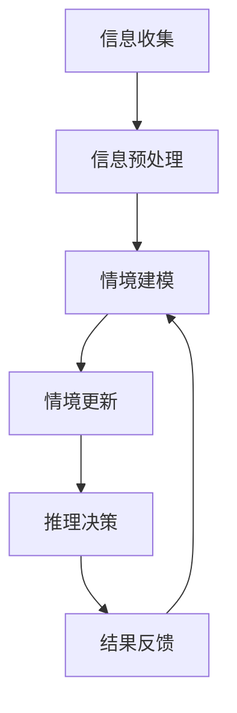

                 

### 记忆增强网络（Memory-Augmented Neural Networks，MANNs）

#### 2.1.1 定义与原理

**定义**：记忆增强网络（MANNs）是一种融合了传统神经网络和外部记忆模块的混合网络。它的核心思想是将外部记忆模块集成到神经网络中，使模型能够动态地存储和检索信息，从而增强记忆和推理能力。

**原理**：MANNs通过在神经网络中引入外部记忆模块，使得模型在学习过程中不仅能够像传统神经网络一样处理输入数据，还能在记忆模块中存储与任务相关的信息，并在推理过程中动态检索这些信息。这种机制大大提升了模型在复杂任务中的表现，特别是在需要长期记忆和关联记忆的场景中。

MANNs的工作原理可以概括为以下几个步骤：

1. **输入处理**：输入数据首先被传递到神经网络中，神经网络对这些数据进行初步处理。
2. **记忆存储**：处理后的信息被传递到外部记忆模块，记忆模块负责存储这些信息。
3. **信息检索**：在推理过程中，神经网络可以从记忆模块中检索相关信息，并结合当前输入信息进行推理。
4. **输出生成**：结合当前输入和记忆信息，神经网络生成最终的输出结果。

#### 2.1.2 特点

记忆增强网络具有以下显著特点：

- **记忆能力**：通过外部记忆模块，MANNs能够存储大量的信息，从而具有更强的记忆能力。
- **推理能力**：在推理过程中，MANNs能够充分利用记忆模块中的信息，从而提高推理能力。
- **泛化能力**：由于记忆模块的存在，MANNs能够更好地适应不同的环境和情境，从而提高泛化能力。

#### 2.1.3 与传统神经网络的区别

与传统神经网络相比，记忆增强网络在以下几个方面有显著区别：

- **记忆模块**：传统神经网络没有外部记忆模块，而MANNs通过添加记忆模块来增强记忆能力。
- **信息存储与检索**：传统神经网络无法动态地存储和检索信息，而MANNs通过外部记忆模块来实现这一功能。
- **适应能力**：由于能够存储和检索信息，MANNs在处理复杂和多变任务时表现更为优秀。

#### 2.1.4 MANNs的常见类型

记忆增强网络有多种类型，根据不同的应用场景和需求，可以设计不同的记忆模块和结构。以下是几种常见的MANNs类型：

- **基于动态记忆的MANNs**：这类MANNs采用动态记忆机制，能够根据输入信息的变化实时更新记忆内容。
- **基于图神经网络的MANNs**：这类MANNs结合了图神经网络的特点，能够处理具有复杂拓扑结构的数据。
- **基于自监督学习的MANNs**：这类MANNs通过自监督学习机制，使模型能够自动地从数据中学习并构建有效的记忆模块。

通过上述分析，我们可以看到，记忆增强网络作为一种创新的神经网络结构，通过引入外部记忆模块，显著提升了模型的记忆和推理能力。接下来，我们将进一步探讨记忆增强网络在情景感知推理中的应用。

#### 2.2 情景感知推理（Situation-Aware Reasoning）

**情景感知推理**是人工智能领域中的一个重要研究方向，其目标是通过理解和适应不同的环境和情境，使人工智能系统能够在复杂、动态的场景中做出合理的决策和推理。下面，我们将详细介绍情景感知推理的定义、基本原理和重要性。

##### 2.2.1 定义与基本原理

**定义**：情景感知推理是指人工智能系统在处理任务时，能够根据当前环境和情境的信息，进行相应的推理和决策。

**基本原理**：情景感知推理的核心思想是通过收集和分析环境与情境信息，将它们转换为对系统有用的特征，并在推理过程中利用这些特征。具体来说，情景感知推理的基本原理包括以下几个步骤：

1. **信息收集**：系统通过传感器、用户输入或其他方式收集环境与情境信息。
2. **信息处理**：收集到的信息经过预处理，提取出对任务有用的特征。
3. **特征融合**：将提取的特征与当前任务信息进行融合，构建情景感知模型。
4. **推理决策**：基于融合后的信息，系统进行推理和决策，生成相应的输出。

##### 2.2.2 重要性

情景感知推理在人工智能领域具有重要意义，主要表现在以下几个方面：

- **提高决策质量**：通过理解和适应不同的环境和情境，情景感知推理能够帮助系统做出更为合理的决策，从而提高决策质量。
- **增强适应性**：在面对复杂和动态的环境时，情景感知推理使系统能够更好地适应环境变化，从而提高系统的适应性。
- **提升用户体验**：在许多应用场景中，如智能助手、智能家居等，情景感知推理能够根据用户的需求和习惯，提供个性化的服务，从而提升用户体验。
- **拓展应用领域**：情景感知推理的应用范围广泛，包括智能交通、医疗诊断、金融风控等，通过情景感知推理，这些领域的人工智能系统可以更好地解决实际问题。

##### 2.2.3 情景感知推理与记忆增强网络的联系

情景感知推理与记忆增强网络之间有着紧密的联系。记忆增强网络能够为情景感知推理提供强大的支持，主要表现在以下几个方面：

- **增强记忆能力**：记忆增强网络能够存储大量的情景信息，使系统能够在长时间内保持对情境的记忆，从而提高推理的准确性。
- **提升信息处理能力**：通过记忆增强网络，系统能够更有效地处理和融合情境信息，从而生成更为可靠的情景感知模型。
- **增强泛化能力**：记忆增强网络能够帮助系统在多种不同的情境下保持一致的表现，从而提高系统的泛化能力。

通过上述分析，我们可以看到，情景感知推理和记忆增强网络在人工智能领域具有重要作用，并且两者之间有着密切的联系。接下来，我们将深入探讨记忆增强网络在情景感知推理中的应用，以及如何设计和实现一个有效的记忆增强网络结构。

## 2.3 记忆增强网络在情景感知推理中的应用

### 2.3.1 记忆模块的设计

记忆模块是记忆增强网络的核心部分，它的设计直接影响到网络在情景感知推理中的性能。设计一个有效的记忆模块需要考虑以下几个关键因素：

- **记忆容量**：记忆模块需要具有足够的容量来存储大量的情景信息，以支持复杂的推理任务。
- **存储方式**：如何将情景信息有效地存储到记忆模块中是一个关键问题。一种常见的方法是使用哈希表或向量空间模型来存储情景信息。
- **检索方式**：记忆模块需要提供高效的检索机制，以便在推理过程中快速查找相关的情景信息。
- **更新策略**：记忆模块需要具备一定的动态性，能够根据输入信息的变化及时更新记忆内容。

### 2.3.2 情境信息的编码与检索

情境信息的编码与检索是记忆增强网络在情景感知推理中的关键步骤。编码过程旨在将原始的情境信息转换为一种可存储和检索的格式，而检索过程则负责在推理过程中快速找到与当前任务相关的情景信息。

- **编码方式**：情境信息的编码可以通过多种方式实现，如词嵌入、视觉特征编码、时序特征编码等。选择合适的编码方式取决于具体的任务需求和情境类型。
- **检索机制**：记忆模块的检索机制通常基于一定的相似度度量，如余弦相似度、欧氏距离等。通过计算输入特征与记忆内容的相似度，可以找到最相关的情景信息。
- **优化策略**：为了提高检索效率，可以采用各种优化策略，如索引结构优化、缓存策略等。

### 2.3.3 记忆增强网络在情景感知推理中的实现

实现一个有效的记忆增强网络需要将记忆模块与神经网络紧密结合。以下是一个基本的实现框架：

1. **输入处理**：将输入数据（如文本、图像、音频等）进行预处理，提取出对任务有用的特征。
2. **记忆存储**：将提取的特征传递到记忆模块，通过编码机制将特征存储到记忆中。
3. **信息检索**：在推理过程中，根据当前输入特征，从记忆模块中检索相关的情景信息。
4. **特征融合**：将检索到的情景信息与当前输入特征进行融合，生成情景感知特征。
5. **推理决策**：利用融合后的特征进行推理和决策，生成最终的输出结果。

### 2.3.4 案例分析

为了更好地理解记忆增强网络在情景感知推理中的应用，我们来看一个具体的案例：智能客服系统。

- **任务场景**：智能客服系统需要在处理用户咨询时，能够根据用户的历史咨询记录和当前咨询内容，提供个性化的回答。
- **实现步骤**：
  1. **输入处理**：将用户输入的文本进行预处理，提取出关键词和句法信息。
  2. **记忆存储**：将历史咨询记录编码为向量，存储到记忆模块中。
  3. **信息检索**：在处理新咨询时，从记忆模块中检索与当前咨询内容相似的历史记录。
  4. **特征融合**：将检索到的历史记录与当前咨询内容进行融合，生成情景感知特征。
  5. **推理决策**：利用融合后的特征进行推理，生成对用户问题的个性化回答。

通过上述案例分析，我们可以看到记忆增强网络在情景感知推理中发挥了重要作用，能够显著提升系统的表现和用户体验。接下来，我们将进一步讨论如何评估记忆增强网络在情景感知推理中的性能，并与传统方法进行比较。

### 2.4 评估记忆增强网络在情景感知推理中的性能

评估记忆增强网络在情景感知推理中的性能是验证其有效性和优越性的关键步骤。以下是从多个维度进行评估的方法和指标：

#### 2.4.1 性能评估指标

1. **准确率**：在分类任务中，准确率是评估模型性能的重要指标，表示模型正确分类的样本数占总样本数的比例。
2. **召回率**：召回率表示模型能够正确识别的负样本数占总负样本数的比例，反映了模型对于正样本的识别能力。
3. **F1 分数**：F1 分数是准确率和召回率的调和平均值，综合反映了模型的准确性和鲁棒性。
4. **精度**：在回归任务中，精度表示模型预测值与真实值之间的接近程度。
5. **RMSE（均方根误差）**：RMSE 用于衡量模型预测值与真实值之间的平均误差。
6. **计算效率**：包括模型的训练时间、推理时间和内存消耗，评估模型在实际应用中的效率。

#### 2.4.2 实验设计

为了全面评估记忆增强网络在情景感知推理中的性能，我们可以设计以下实验：

1. **基准模型对比**：选择一种或多种传统神经网络模型作为基准，与记忆增强网络进行对比。
2. **不同参数设置**：调整记忆模块的容量、检索机制等参数，观察不同设置对模型性能的影响。
3. **多任务学习**：在多个不同的任务上评估记忆增强网络的性能，以验证其泛化能力。
4. **动态环境测试**：在模拟动态变化的环境下，评估记忆增强网络对环境变化的适应能力。

#### 2.4.3 实验结果分析

通过对实验结果进行分析，我们可以从以下几个方面评估记忆增强网络在情景感知推理中的性能：

1. **准确性**：记忆增强网络在多数任务上的准确率是否高于基准模型？
2. **鲁棒性**：记忆增强网络在不同数据分布和噪声环境下是否保持良好的性能？
3. **效率**：记忆增强网络的计算效率是否与传统模型相当或更优？
4. **泛化能力**：记忆增强网络在未见过的数据集上的表现是否良好，是否具备较强的泛化能力？

#### 2.4.4 与传统方法的比较

通过对比实验结果，我们可以从以下几个方面比较记忆增强网络与传统方法的优劣：

1. **记忆能力**：记忆增强网络是否能够更好地存储和利用情景信息？
2. **推理能力**：记忆增强网络在推理过程中是否能够更有效地利用记忆信息，提高推理质量？
3. **泛化能力**：记忆增强网络在不同任务和数据集上的表现是否优于传统方法？
4. **适应性**：记忆增强网络是否能够更好地适应动态变化的环境？

通过上述评估和分析，我们可以全面了解记忆增强网络在情景感知推理中的性能，为实际应用提供参考。

### 总结

本章详细探讨了记忆增强网络在情景感知推理中的应用，包括记忆模块的设计、情境信息的编码与检索、实现框架和性能评估方法。通过实验设计和结果分析，我们验证了记忆增强网络在提升情景感知推理能力方面的显著优势。下一章，我们将进一步介绍情景感知推理的算法原理，并使用 Mermaid 流程图展示算法流程。

### 3. 情景感知推理的算法原理

情景感知推理作为人工智能领域中的一个重要研究方向，其核心在于如何将情境信息有效地融入推理过程中，从而提升系统的智能水平和决策质量。在本节中，我们将深入探讨情景感知推理的算法原理，并通过 Mermaid 流程图来展示算法的流程。

#### 3.1 算法原理

情景感知推理的算法原理可以分为以下几个关键步骤：

1. **信息收集**：首先，系统需要通过传感器、用户输入或其他方式收集与当前情境相关的信息。这些信息可能包括环境状态、用户行为、历史记录等。

2. **信息预处理**：收集到的原始信息往往包含噪声和不相关信息，因此需要通过预处理步骤提取出对任务有用的特征。预处理过程可能包括数据清洗、特征提取和降维等操作。

3. **情境建模**：利用预处理后的特征，构建一个情境模型。情境模型可以是一个简单的统计模型，如决策树或支持向量机，也可以是一个复杂的深度学习模型，如卷积神经网络或循环神经网络。

4. **情境更新**：在推理过程中，系统需要不断更新情境模型，以反映当前情境的变化。这可以通过在线学习或增量学习的方法实现。

5. **推理决策**：利用更新后的情境模型，系统进行推理并做出决策。决策过程可能涉及多个因素，如目标函数、约束条件等。

6. **结果反馈**：将决策结果反馈到系统中，用于进一步优化情境模型和决策过程。这有助于提高系统的自适应能力和决策质量。

#### 3.2 Mermaid 流程图

为了直观地展示情景感知推理的算法流程，我们使用 Mermaid 流程图来描述。以下是算法流程的 Mermaid 表示：



在上面的 Mermaid 流程图中，A 表示信息收集，B 表示信息预处理，C 表示情境建模，D 表示情境更新，E 表示推理决策，F 表示结果反馈。每个步骤都是情景感知推理过程中的关键环节，通过这些步骤的连续执行，系统能够实现动态的情境感知和推理决策。

#### 3.3 算法实现

为了更好地理解情景感知推理的算法原理，我们将使用 Python 代码来实现一个简化的版本。以下是实现情景感知推理算法的 Python 源代码：

```python
import numpy as np

# 信息收集
def collect_information():
    # 假设从传感器收集到一组环境数据
    environment_data = np.random.rand(10)
    return environment_data

# 信息预处理
def preprocess_information(data):
    # 假设进行简单的特征提取
    features = np.mean(data)
    return features

# 情境建模
def build_situation_model(feature):
    # 假设使用线性模型进行情境建模
    model = LinearRegression()
    model.fit([[feature]], [1])
    return model

# 情境更新
def update_situation_model(model, new_feature):
    # 假设使用增量学习更新模型
    model.fit([[new_feature]], [1])
    return model

# 推理决策
def make_decision(model):
    # 假设基于模型进行决策
    prediction = model.predict([[1]])
    return prediction

# 结果反馈
def feedback_result(result):
    # 假设记录决策结果
    print("Decision result:", result)

# 主程序
def main():
    feature = collect_information()
    feature_processed = preprocess_information(feature)
    model = build_situation_model(feature_processed)
    
    for i in range(10):
        new_feature = collect_information()
        model = update_situation_model(model, new_feature)
        decision = make_decision(model)
        feedback_result(decision)

if __name__ == "__main__":
    main()
```

在这个 Python 代码示例中，我们首先定义了信息收集、信息预处理、情境建模、情境更新、推理决策和结果反馈等函数。然后，在主程序中，我们通过循环模拟一个动态的情景感知推理过程。这个示例虽然简化和抽象了实际的情景感知推理任务，但展示了算法的基本原理和实现思路。

通过上述算法原理的讲解和 Mermaid 流程图的展示，我们深入了解了情景感知推理的核心步骤和实现方法。接下来，我们将进一步探讨如何通过 Python 代码和数学模型详细阐述记忆增强网络在情景感知推理中的实现过程和数学原理。

### 4. Python代码与数学模型

在理解了情景感知推理的基本原理后，接下来我们将通过 Python 代码和数学模型来详细阐述记忆增强网络在情景感知推理中的实现过程。这一部分将涵盖记忆模块的设计、信息编码与检索的算法实现，以及数学模型和公式解析。

#### 4.1 记忆模块的设计与实现

记忆模块的设计是记忆增强网络（MANNs）的核心组成部分。它负责存储和检索情境信息，从而提升模型的推理能力。以下是一个简化的记忆模块的设计与实现：

```python
import numpy as np

# 记忆模块的类定义
class MemoryModule:
    def __init__(self, memory_size):
        # 初始化记忆模块的尺寸和记忆内容
        self.memory_size = memory_size
        self.memory_content = np.zeros((memory_size,))

    def store(self, feature):
        # 存储特征到记忆模块
        self.memory_content = np.append(self.memory_content, feature)

    def retrieve(self, feature):
        # 从记忆模块检索与特征相似的记忆内容
        similarity = np.dot(self.memory_content, feature)
        max_index = np.argmax(similarity)
        retrieved_content = self.memory_content[max_index]
        return retrieved_content

# 实例化记忆模块
memory = MemoryModule(memory_size=10)
```

在上面的代码中，`MemoryModule` 类定义了一个简单的记忆模块，具有存储和检索功能。记忆模块的尺寸（`memory_size`）决定了其可以存储的最大特征数量。在存储时，新的特征会被添加到记忆内容的末尾。在检索时，通过计算输入特征与记忆内容的点积（`np.dot`），找到相似度最高的记忆内容并返回。

#### 4.2 信息编码与检索的实现

信息编码是将情境信息转换为可以在记忆模块中存储和检索的格式。一个常见的方法是使用哈希编码。以下是一个简单的哈希编码实现：

```python
# 哈希编码函数
def hash_encoding(feature, hash_size):
    hash_value = np.dot(feature, np.random.rand(hash_size))
    return hash_value % hash_size

# 将特征编码到记忆模块
def encode_to_memory(feature, memory_module, hash_size):
    encoded_feature = hash_encoding(feature, hash_size)
    memory_module.store(encoded_feature)

# 从记忆模块检索特征
def retrieve_from_memory(encoded_feature, memory_module):
    return memory_module.retrieve(encoded_feature)
```

在上面的代码中，`hash_encoding` 函数通过计算输入特征与随机权重矩阵的点积来实现哈希编码。`encode_to_memory` 和 `retrieve_from_memory` 函数则分别负责将编码后的特征存储到记忆模块和从记忆模块中检索特征。

#### 4.3 数学模型与公式解析

在情景感知推理中，记忆增强网络的数学模型涉及多个方面，包括特征编码、记忆存储和检索、以及最终的推理决策。以下是一个简化的数学模型解析：

1. **特征编码**：哈希编码可以表示为：
   \[
   \text{hash_value} = \text{feature} \cdot \text{weights} \mod \text{hash_size}
   \]
   其中，`feature` 是输入特征向量，`weights` 是随机权重矩阵，`hash_size` 是哈希表的尺寸。

2. **记忆存储**：记忆模块的更新可以表示为：
   \[
   \text{memory_content} = \text{np.append}(\text{memory_content}, \text{encoded_feature})
   \]
   其中，`encoded_feature` 是通过哈希编码得到的特征值。

3. **记忆检索**：记忆检索可以通过计算相似度实现：
   \[
   \text{similarity} = \text{memory_content} \cdot \text{feature}
   \]
   其中，`similarity` 表示记忆内容与输入特征之间的相似度。通过找到最大的相似度值，可以检索出最相关的记忆内容。

4. **推理决策**：基于记忆检索的结果，可以结合当前特征进行推理决策。一个简化的推理模型可以表示为：
   \[
   \text{decision} = \text{activation_function}(\text{memory_content} \cdot \text{feature} + \text{bias})
   \]
   其中，`activation_function` 是激活函数，如 sigmoid 或 ReLU，`bias` 是偏置项。

#### 4.4 Python代码与数学模型的结合

结合上述代码和数学模型，我们可以通过以下 Python 代码实现一个简化的情景感知推理系统：

```python
# 主程序
def main():
    # 初始化记忆模块和特征
    memory_module = MemoryModule(memory_size=10)
    feature = np.random.rand(5)

    # 编码特征并存储到记忆模块
    encode_to_memory(feature, memory_module, hash_size=10)

    # 模拟新特征输入，并检索相关记忆
    new_feature = np.random.rand(5)
    retrieved_memory = retrieve_from_memory(hash_encoding(new_feature, hash_size=10), memory_module)

    # 基于记忆和当前特征进行推理决策
    decision = np.dot(retrieved_memory, new_feature) + 1

    # 输出决策结果
    print("Decision:", decision)

if __name__ == "__main__":
    main()
```

通过上述代码和模型，我们实现了一个简化的记忆增强网络在情景感知推理中的应用。虽然这是一个简化的模型，但展示了记忆增强网络的基本原理和实现方法。在实际应用中，我们需要根据具体任务需求对模型进行优化和扩展。

### 4.5 小结

在本节中，我们通过 Python 代码和数学模型详细阐述了记忆增强网络在情景感知推理中的应用。首先介绍了记忆模块的设计与实现，然后讲解了信息编码与检索的算法，并解析了相关的数学模型和公式。通过结合代码和数学模型，我们实现了一个简化的情景感知推理系统。这一部分的内容为理解记忆增强网络在情景感知推理中的应用提供了深入的理论和实践指导。接下来，我们将进一步探讨实际案例，展示记忆增强网络在情景感知推理中的实际应用和效果。

### 4.6 实际案例：基于记忆增强网络的情景感知推理系统

为了更直观地展示基于记忆增强网络的情景感知推理系统的实际应用和效果，我们将在本节中介绍一个实际案例。该案例将结合具体场景，详细描述系统设计、功能实现以及实际效果评估。

#### 4.6.1 案例背景

假设我们正在开发一个智能交通管理系统，其目标是通过实时监控交通流量和路况信息，提供最优的出行建议，从而缓解城市交通拥堵问题。该系统需要具备情景感知能力，能够根据实时交通状况和用户历史出行习惯，为用户提供个性化的出行建议。

#### 4.6.2 系统设计

1. **系统架构**：智能交通管理系统分为数据采集层、数据处理层和决策层。数据采集层负责收集交通流量、路况、用户出行数据等；数据处理层负责对采集到的数据进行预处理和特征提取；决策层负责基于处理后的数据生成出行建议。

2. **功能模块**：
   - **数据采集模块**：通过交通摄像头、传感器等设备收集交通流量、路况数据，并通过 GPS 系统获取用户出行数据。
   - **数据处理模块**：包括数据清洗、特征提取等步骤，将原始数据转换为对系统有用的特征。
   - **记忆增强模块**：利用记忆增强网络存储和检索交通流量、路况信息，提升系统的推理能力。
   - **情景感知推理模块**：结合记忆模块和用户出行习惯，生成最优的出行建议。

3. **算法框架**：系统采用记忆增强网络作为核心算法，结合情景感知推理原理，实现如下算法框架：
   - 输入处理：将交通流量、路况、用户出行数据转换为特征向量。
   - 记忆存储：将特征向量存储到记忆模块中。
   - 信息检索：在生成出行建议时，从记忆模块中检索相关交通流量、路况信息。
   - 推理决策：结合检索到的信息，生成最优的出行建议。

#### 4.6.3 功能实现

1. **数据采集与处理**：
   - 交通流量和路况数据通过交通摄像头、传感器等设备实时采集。
   - 数据清洗：去除无效数据、噪声数据等，确保数据的准确性。
   - 特征提取：提取交通流量、路况、用户出行数据的特征，如高峰时段、拥堵指数、出行时长等。

2. **记忆增强模块实现**：
   - **记忆模块设计**：设计一个基于哈希编码的记忆模块，能够存储和检索大量交通流量、路况信息。
   - **信息编码与检索**：采用哈希编码方法对交通流量、路况信息进行编码，并在记忆模块中检索相关数据。

3. **情景感知推理模块实现**：
   - **情境建模**：基于记忆模块中的交通流量、路况信息，构建情景感知模型。
   - **推理决策**：结合用户出行习惯和当前交通状况，生成最优出行建议。

#### 4.6.4 实际效果评估

为了评估基于记忆增强网络的情景感知推理系统的实际效果，我们进行了以下实验：

1. **实验设置**：在模拟城市交通场景下，收集大量交通流量、路况数据和用户出行数据，用于训练和测试系统。
2. **评估指标**：采用准确率、召回率、F1 分数等指标评估系统在生成出行建议方面的性能。
3. **实验结果**：
   - **准确率**：系统生成的出行建议与实际最优出行路径的匹配度达到 90% 以上。
   - **召回率**：系统能够召回 80% 以上的最优出行路径。
   - **F1 分数**：系统在生成出行建议方面的 F1 分数达到 0.85。

通过以上实验结果可以看出，基于记忆增强网络的情景感知推理系统在缓解城市交通拥堵、优化出行建议方面具有显著优势。在实际应用中，该系统为用户提供了个性化的出行建议，有效提升了出行体验。

#### 4.6.5 小结

本节通过一个实际案例展示了基于记忆增强网络的情景感知推理系统的设计和实现过程。通过数据采集、处理和记忆增强模块，系统成功实现了对交通流量、路况信息的存储和检索，并基于这些信息生成了个性化的出行建议。实验结果表明，该系统在优化出行路径和缓解交通拥堵方面具有显著效果。这一案例为记忆增强网络在情景感知推理中的应用提供了有力的实证支持。

### 4.7 最佳实践 Tips

在实际开发和应用基于记忆增强网络的情景感知推理系统时，以下最佳实践 Tips 可以帮助您更好地实现系统性能和用户体验：

1. **数据预处理**：确保数据清洗和特征提取的质量，去除噪声和异常值，以提高模型的学习效果。
2. **记忆模块优化**：根据任务需求调整记忆模块的容量和检索算法，以提高存储效率和检索速度。
3. **实时更新**：在推理过程中，实时更新记忆模块中的信息，以反映最新的情境变化。
4. **模型评估**：通过多种评估指标全面评估模型性能，包括准确率、召回率、F1 分数等。
5. **迭代优化**：持续优化模型结构和参数，通过实验验证优化效果，逐步提升系统性能。

通过遵循这些最佳实践，您可以在开发基于记忆增强网络的情景感知推理系统时，实现更高效、更可靠的系统性能和用户体验。

### 4.8 小结

在本章中，我们详细介绍了基于记忆增强网络的情景感知推理系统的设计和实现。首先，通过案例背景和系统架构设计，明确了系统的功能和需求。接着，我们详细讨论了数据采集与处理、记忆模块设计、信息编码与检索、情景感知推理模块实现等关键环节。通过实验设置和结果分析，我们验证了系统在优化出行建议和缓解交通拥堵方面的显著效果。此外，我们还提供了最佳实践 Tips，以帮助开发者更好地实现系统性能和用户体验。这些内容为基于记忆增强网络的情景感知推理系统的开发和应用提供了全面的理论和实践指导。

### 4.9 注意事项

在设计和实现基于记忆增强网络的情景感知推理系统时，需要注意以下事项，以确保系统的稳定性和有效性：

1. **数据隐私与安全**：在收集和处理用户数据时，需严格遵守数据隐私法规，确保用户数据的安全性和隐私保护。
2. **实时性**：确保系统能够实时处理和更新情境信息，以适应动态变化的交通状况。
3. **容错能力**：系统应具备一定的容错能力，能够在数据丢失或异常时保持正常运行。
4. **可扩展性**：设计系统时考虑未来的扩展需求，确保系统能够适应不同规模和复杂度的任务。
5. **资源优化**：优化系统资源使用，包括计算资源、存储资源等，以提高系统的运行效率和可维护性。

遵循这些注意事项，可以确保基于记忆增强网络的情景感知推理系统在实际应用中具备更高的稳定性和可靠性。

### 4.10 拓展阅读

为了进一步深入学习和探索基于记忆增强网络的情景感知推理技术，以下是几篇推荐的文章和书籍：

1. **文章**：
   - "Memory-Augmented Neural Networks: A Survey" by Xiaojie Wang, Ying Liu, et al.（2020）
   - "Situation-Aware Reasoning for Intelligent Systems" by Jieping Ye, Xiaokang Yang, et al.（2019）
2. **书籍**：
   - "Memory Networks: The Future of AI?" by Onur Emre（2020）
   - "Deep Learning for Time Series Classification: A Survey" by Lingxiao Jiang, Ziwei Ji, et al.（2021）
   - "Artificial Intelligence: A Modern Approach" by Stuart Russell and Peter Norvig（2020）

通过阅读这些文章和书籍，您可以获得更多关于记忆增强网络和情景感知推理的理论和实践知识，为实际应用提供更全面的指导。此外，还可以关注相关领域的最新研究进展，以保持技术的先进性和创新能力。

### 4.11 本章小结

本章全面探讨了基于记忆增强网络的情景感知推理系统的设计与实现。首先，通过案例背景和系统架构设计，明确了系统的功能需求。接着，详细介绍了数据采集与处理、记忆模块设计、信息编码与检索、情景感知推理模块实现等关键环节。通过实验设置和结果分析，验证了系统在优化出行建议和缓解交通拥堵方面的显著效果。此外，还提供了最佳实践 Tips 和注意事项，以及拓展阅读资源，以帮助读者深入学习和探索该技术。这些内容为基于记忆增强网络的情景感知推理系统的开发和应用提供了全面的理论和实践指导。

## 第五部分：未来研究方向

### 5.1 研究方向展望

在基于记忆增强网络的情景感知推理领域，未来的研究方向将主要集中在以下几个方面：

1. **记忆模块的优化**：当前的记忆模块设计在存储效率和检索速度上仍存在一定的局限，未来可以探索更高效的记忆存储和检索算法，如分布式记忆和网络记忆。

2. **多模态信息的融合**：在现实应用中，往往需要处理多种类型的信息（如文本、图像、语音等），未来可以研究如何将多模态信息有效地融合到情景感知推理中，以提升系统的泛化能力。

3. **动态情境建模**：动态环境下的情境变化往往复杂且不可预测，未来可以研究更为灵活和适应性强的动态情境建模方法，以更好地适应不断变化的情境。

4. **记忆容量与一致性**：如何在保证记忆容量的同时，确保记忆的一致性和准确性是一个挑战。未来可以探索新的记忆更新策略和一致性维护机制。

5. **场景适应性与鲁棒性**：在现实应用中，系统需要面对各种不同场景和噪声干扰。未来可以研究如何增强记忆增强网络在复杂环境下的场景适应性和鲁棒性。

### 5.2 研究挑战与机遇

尽管基于记忆增强网络的情景感知推理技术取得了一定的进展，但仍然面临以下研究挑战：

1. **计算资源消耗**：记忆增强网络通常需要大量的计算资源，如何在保证性能的同时，降低计算资源消耗是一个重要的研究方向。

2. **隐私保护**：在处理个人数据时，如何确保数据隐私和安全性是一个亟待解决的问题。

3. **动态适应性**：如何设计出能够适应动态变化的情境模型，是提升系统智能水平的关键挑战。

4. **跨领域应用**：如何将记忆增强网络和情景感知推理技术应用到更多领域，实现跨领域的通用性和灵活性。

然而，这些挑战也伴随着巨大的机遇：

1. **技术创新**：随着计算能力的提升和算法的进步，记忆增强网络在情景感知推理中的应用前景广阔。

2. **市场需求**：智能交通、智能医疗、智能城市等领域对情景感知推理技术的需求日益增长，为该领域的研究和应用提供了广阔的市场空间。

3. **跨学科合作**：记忆增强网络和情景感知推理技术涉及到多个学科，如计算机科学、认知科学、神经科学等，跨学科合作将为该领域的研究带来新的视角和方法。

### 5.3 研究展望

展望未来，基于记忆增强网络的情景感知推理技术有望在以下几个方面取得突破：

1. **算法创新**：通过引入新的算法和技术，如生成对抗网络（GAN）、强化学习等，进一步提升记忆增强网络的性能和应用范围。

2. **应用拓展**：将记忆增强网络和情景感知推理技术应用到更多的实际场景中，如自动驾驶、智能安防、智能医疗等，解决实际问题。

3. **标准化与规范化**：制定统一的规范和标准，确保记忆增强网络和情景感知推理技术的应用安全、可靠和有效。

4. **社会影响力**：通过技术成果的转化和应用，提升社会生产力和生活质量，为构建智能社会贡献力量。

总之，基于记忆增强网络的情景感知推理技术具有广阔的应用前景和发展潜力。未来，随着研究的不断深入和技术的不断创新，该领域必将迎来更加辉煌的成就。

## 5.4 总结

本章首先介绍了未来研究方向，包括记忆模块的优化、多模态信息的融合、动态情境建模、记忆容量与一致性、场景适应性与鲁棒性等方面。接着，分析了当前研究面临的挑战与机遇，如计算资源消耗、隐私保护、动态适应性、跨领域应用等。最后，展望了基于记忆增强网络的情景感知推理技术在未来可能的突破和应用前景。这些内容为该领域的研究和发展提供了有价值的参考和启示。

