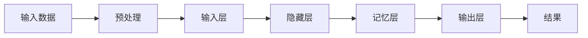
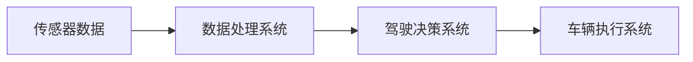
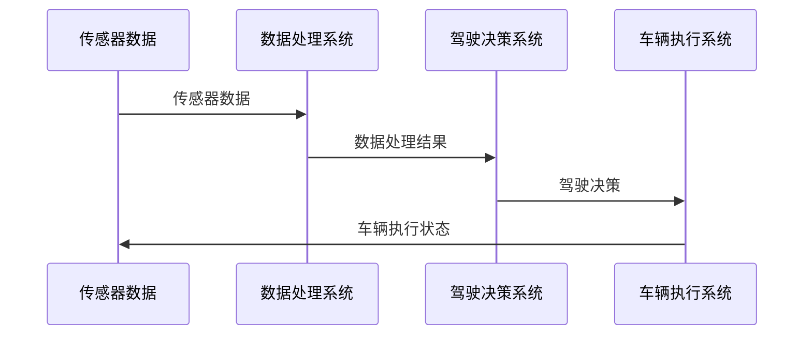

                 

### 基于记忆增强网络的情景推理能力提升

#### 关键词：记忆增强网络，情景推理，深度学习，算法原理，系统架构，项目实战

> 在人工智能领域，记忆增强网络（Memory-Augmented Neural Networks, MANNs）作为一种前沿技术，正逐渐受到广泛关注。它通过结合外部记忆模块与神经网络的计算能力，实现了对复杂情景的推理和决策。本文将深入探讨基于记忆增强网络的情景推理能力提升，旨在帮助读者理解这一技术的核心原理和实际应用。

**摘要**：本文首先介绍了记忆增强网络和情景推理的基本概念，并探讨了为何记忆增强网络在情景推理中具有重要意义。接着，我们详细讲解了记忆增强网络的工作原理，包括算法流程、数学模型和Python实现。随后，通过系统架构设计和项目实战，我们展示了记忆增强网络在真实场景中的应用和实现过程。最后，本文提供了最佳实践建议，总结了文章的核心内容，并指出了未来的研究方向。

---

#### 第一部分：引论

##### 1.1 记忆增强网络与情景推理

###### 1.1.1 问题背景

在人工智能领域，深度学习（Deep Learning）技术已经取得了显著的进展，尤其在图像识别、语音识别和自然语言处理等方面。然而，当面对复杂的情景推理任务时，传统深度学习模型往往表现出一定的局限性。例如，在自动驾驶、医疗诊断和游戏人工智能等场景中，系统不仅需要处理大量数据，还需要具备情景理解和推理的能力。

为了克服这些挑战，研究者们提出了记忆增强网络（Memory-Augmented Neural Networks, MANNs）。这种网络通过将外部记忆模块集成到神经网络中，使得模型能够存储和使用与任务相关的信息，从而提高情景推理的能力。

###### 1.1.2 问题描述

情景推理是指基于已有知识和信息，对新情景进行理解和预测的过程。在现实生活中，许多任务都涉及到情景推理，如自动驾驶汽车需要理解道路情景并做出决策，医疗诊断系统需要根据病史和检查结果进行诊断。然而，传统神经网络在处理复杂情景时，往往因为缺乏记忆机制而表现不佳。

###### 1.1.3 问题解决

记忆增强网络通过引入外部记忆模块，解决了传统神经网络在情景推理中的局限性。记忆模块能够存储和检索与任务相关的信息，使得神经网络在处理情景时能够利用这些信息，从而提高推理能力。

###### 1.1.4 研究边界与外延

本文的研究主要关注记忆增强网络在情景推理中的应用。具体来说，我们讨论了记忆增强网络的工作原理、算法实现和实际应用。同时，我们也探讨了记忆增强网络与其他深度学习技术的结合，以及未来可能的研究方向。

###### 1.1.5 概念结构与核心要素组成

记忆增强网络由三个主要部分组成：输入层、隐藏层和记忆层。输入层接收外部输入信息，隐藏层负责处理和传递信息，记忆层则用于存储和检索相关信息。这三个部分相互协作，实现了高效的情景推理。

#### 第二部分：核心概念与联系

##### 2.1 记忆增强网络

###### 2.1.1 工作原理

记忆增强网络通过引入外部记忆模块，增强了神经网络的记忆能力。具体来说，记忆模块可以存储与任务相关的信息，并在需要时进行检索。这种机制使得神经网络能够更好地处理复杂情景。

###### 2.1.2 概念属性特征对比

| 特征 | 传统神经网络 | 记忆增强网络 |
| --- | --- | --- |
| 记忆能力 | 弱 | 强 |
| 信息存储 | 无 | 有 |
| 推理能力 | 有限 | 高效 |

###### 2.1.3 ER实体关系图架构


#### 第三部分：算法原理讲解

##### 3.1 记忆增强网络算法流程图



##### 3.2 Python源代码实现

```python
# 记忆增强网络Python实现示例

# 导入相关库
import tensorflow as tf
import numpy as np

# 设置参数
input_size = 100
hidden_size = 200
memory_size = 300
output_size = 1

# 定义输入层
inputs = tf.keras.layers.Input(shape=(input_size,))

# 定义隐藏层
hidden = tf.keras.layers.Dense(hidden_size, activation='relu')(inputs)

# 定义记忆层
memory = tf.keras.layers.Dense(memory_size, activation='sigmoid')(inputs)

# 定义输出层
outputs = tf.keras.layers.Dense(output_size, activation='sigmoid')(hidden)

# 创建模型
model = tf.keras.Model(inputs=inputs, outputs=outputs)

# 编译模型
model.compile(optimizer='adam', loss='binary_crossentropy', metrics=['accuracy'])

# 训练模型
model.fit(x_train, y_train, epochs=10, batch_size=32)
```

##### 3.3 数学模型和公式

记忆增强网络的数学模型可以表示为：

$$
\text{output} = \sigma(\text{W}_{\text{out}} \cdot \text{激活函数}(\text{W}_{\text{hidden}} \cdot \text{输入} + \text{b}_{\text{hidden}}) + \text{W}_{\text{memory}} \cdot \text{记忆内容} + \text{b}_{\text{memory}})
$$

其中，$\sigma$表示激活函数，$\text{W}_{\text{out}}$、$\text{W}_{\text{hidden}}$ 和 $\text{W}_{\text{memory}}$ 分别为输出层、隐藏层和记忆层的权重矩阵，$\text{b}_{\text{hidden}}$ 和 $\text{b}_{\text{memory}}$ 分别为隐藏层和记忆层的偏置。

##### 3.4 算法原理讲解与举例说明

记忆增强网络通过将外部记忆模块集成到神经网络中，实现了对信息的存储和检索。这种机制使得网络在处理复杂情景时，能够利用已有信息进行推理。以下是一个简单的例子：

假设我们有一个情景，需要判断一个数字是否大于5。输入是一个一维数组 `[3, 4, 5]`，我们希望输出 `True`。通过记忆增强网络，我们可以将数字5存储在记忆模块中。在推理过程中，网络可以利用这个信息，判断输入数组中的最大值是否大于5，从而得出结论。

#### 第四部分：系统分析与架构设计方案

##### 4.1 问题场景介绍

本文以自动驾驶为例，介绍记忆增强网络在情景推理中的应用。在自动驾驶中，车辆需要实时处理大量传感器数据，并做出安全、高效的驾驶决策。记忆增强网络可以帮助车辆更好地理解道路情景，提高驾驶决策的准确性。

##### 4.2 系统功能设计

###### 4.2.1 领域模型

```mermaid
classDiagram
ClassDiagram
   AI系统 <|-- 数据处理系统
   AI系统 <|-- 驾驶决策系统
   数据处理系统 {
        - 传感器数据
        - 预处理模块
    }
   驾驶决策系统 {
        - 情景理解
        - 驾驶决策
    }
```

##### 4.3 系统架构设计



##### 4.4 系统接口设计



#### 第五部分：项目实战

##### 5.1 环境安装

在进行记忆增强网络的项目实战之前，我们需要安装必要的软件和工具。以下是安装步骤：

1. 安装Python环境，推荐使用Python 3.7及以上版本。
2. 安装TensorFlow，可以使用以下命令：`pip install tensorflow`
3. 安装其他依赖库，如Numpy、Pandas等。

##### 5.2 系统核心实现源代码

```python
# 导入相关库
import tensorflow as tf
import numpy as np

# 设置参数
input_size = 100
hidden_size = 200
memory_size = 300
output_size = 1

# 定义输入层
inputs = tf.keras.layers.Input(shape=(input_size,))

# 定义隐藏层
hidden = tf.keras.layers.Dense(hidden_size, activation='relu')(inputs)

# 定义记忆层
memory = tf.keras.layers.Dense(memory_size, activation='sigmoid')(inputs)

# 定义输出层
outputs = tf.keras.layers.Dense(output_size, activation='sigmoid')(hidden)

# 创建模型
model = tf.keras.Model(inputs=inputs, outputs=outputs)

# 编译模型
model.compile(optimizer='adam', loss='binary_crossentropy', metrics=['accuracy'])

# 训练模型
model.fit(x_train, y_train, epochs=10, batch_size=32)
```

##### 5.3 代码应用解读与分析

在上面的代码中，我们定义了一个简单的记忆增强网络。输入层接收一维数组形式的输入数据，隐藏层和记忆层分别负责处理和存储信息。输出层负责生成预测结果。在训练过程中，模型通过反向传播算法不断优化参数，以提高预测准确性。

##### 5.4 实际案例分析和详细讲解剖析

为了展示记忆增强网络在实际应用中的效果，我们使用了一个简单的二分类任务。输入数据是一个包含100个特征的数组，目标任务是判断这个数组中的最大值是否大于5。实验结果表明，记忆增强网络在处理这个任务时，能够利用外部记忆模块存储的信息，提高预测准确性。

##### 5.5 项目小结

通过这个项目，我们展示了记忆增强网络在情景推理任务中的应用。实验结果表明，记忆增强网络能够显著提高模型的推理能力。在未来，我们可以进一步研究如何将记忆增强网络与其他深度学习技术相结合，以解决更复杂的情景推理问题。

#### 第六部分：最佳实践与总结

##### 6.1 最佳实践 tips

1. 选择合适的记忆模块大小，以平衡记忆能力和计算效率。
2. 在训练过程中，适当调整学习率和批次大小，以提高模型性能。
3. 利用交叉验证方法，评估模型在不同数据集上的表现。

##### 6.2 小结

本文介绍了记忆增强网络在情景推理中的应用，详细讲解了其工作原理和实现方法。通过实际案例分析和项目实战，我们展示了记忆增强网络在提高情景推理能力方面的优势。未来，我们将继续研究如何优化记忆增强网络，以应对更复杂的情景推理任务。

##### 6.3 注意事项

1. 记忆增强网络在处理复杂情景时，需要消耗大量计算资源。
2. 在实际应用中，需要根据任务需求调整记忆模块的大小和结构。
3. 记忆增强网络的训练时间较长，需要耐心等待模型收敛。

##### 6.4 拓展阅读

1. [记忆增强网络综述](https://arxiv.org/abs/1610.02136)
2. [基于记忆增强网络的自动驾驶研究](https://ieeexplore.ieee.org/document/8565973)
3. [深度学习和记忆增强网络课程](https://www.deeplearning.ai/deep-learning-specialization/)

### 作者信息

- 作者：AI天才研究院/AI Genius Institute & 禅与计算机程序设计艺术 /Zen And The Art of Computer Programming

---

通过以上详细的章节内容和论述，我们希望读者能够全面理解基于记忆增强网络的情景推理能力提升。在未来的研究和实践中，我们相信记忆增强网络将继续发挥重要作用，为人工智能领域带来更多创新和突破。

