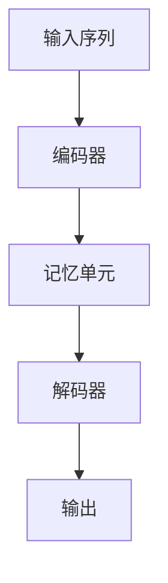

                 

# 《基于记忆增强网络的长期依赖推理优化》

> 关键词：记忆增强网络、长期依赖推理、深度学习、自然语言处理、序列生成

> 摘要：本文深入探讨了记忆增强网络在长期依赖推理优化中的应用。通过阐述记忆增强网络的基本原理、设计思想和数学模型，本文详细分析了其优势和应用场景。同时，本文还介绍了记忆增强网络与其他相关技术的联系和区别，为读者提供了全面的参考。

## 第一部分：背景介绍

### 第1章 问题背景

#### 1.1.1 问题提出

在深度学习领域，长期依赖推理（Long-Range Dependency Reasoning）是一个长期存在的挑战。传统神经网络在处理长序列数据时，由于梯度消失和梯度爆炸等问题，难以捕捉序列中的长期依赖关系。为了解决这一问题，研究者们提出了记忆增强网络（Memory-Augmented Neural Networks），通过引入外部记忆机制，增强模型对长期依赖的捕捉能力。

#### 1.1.2 问题描述

长期依赖推理涉及从长序列中提取重要信息，并利用这些信息进行推理和决策。在自然语言处理、语音识别、序列生成等任务中，这一能力至关重要。然而，传统神经网络在处理长序列时表现不佳，导致许多应用场景下的性能受限。

#### 1.1.3 问题解决

记忆增强网络通过引入外部记忆单元，能够有效缓解梯度消失和梯度爆炸问题，从而提高模型在长期依赖推理任务中的性能。本文将深入探讨记忆增强网络的原理、设计以及在不同领域的应用。

#### 1.1.4 边界与外延

本文主要关注基于记忆增强网络的长期依赖推理优化，包括模型设计、算法优化以及实际应用。同时，本文还将讨论记忆增强网络与其他相关技术的联系和区别。

#### 1.1.5 概念结构与核心要素组成

- **记忆增强网络**：引入外部记忆单元，增强模型对长期依赖的捕捉能力。
- **长期依赖推理**：从长序列中提取重要信息，并利用这些信息进行推理和决策。
- **算法优化**：通过改进模型结构和训练策略，提高记忆增强网络的性能。

## 第二部分：核心概念与联系

### 第2章 核心概念与联系

#### 2.1 记忆增强网络

#### 2.1.1 记忆增强网络的基本原理

记忆增强网络通过外部记忆单元，将序列信息存储在记忆中，并在后续处理过程中反复利用这些信息。这种机制使得模型能够更好地捕捉长序列中的长期依赖关系。

#### 2.1.2 记忆增强网络的组成模块

- **输入层**：接收序列数据，并转换为记忆单元的输入。
- **记忆单元**：存储序列信息，并进行更新和查询操作。
- **输出层**：利用记忆单元的信息生成预测或决策。

#### 2.2 长期依赖推理

#### 2.2.1 长期依赖推理的基本原理

长期依赖推理旨在从长序列中提取关键信息，并在不同时间点进行关联和推理。这一能力对于许多自然语言处理和序列生成任务至关重要。

#### 2.2.2 长期依赖推理的关键技术

- **注意力机制**：通过注意力机制，模型能够关注序列中的关键信息，提高推理的准确性。
- **递归神经网络**：递归神经网络能够处理序列数据，并捕捉其中的依赖关系。

#### 2.3 算法优化

#### 2.3.1 算法优化的重要性

算法优化是提升记忆增强网络性能的关键。通过改进模型结构和训练策略，可以显著提高模型在长期依赖推理任务中的性能。

#### 2.3.2 算法优化的方法

- **动态记忆容量调整**：根据任务需求，动态调整记忆单元的容量，提高模型的适应性。
- **优化记忆更新策略**：通过改进记忆更新策略，提高记忆单元的有效性。

## 第三部分：算法原理与数学模型

### 第3章 记忆增强网络原理讲解

#### 3.1 记忆增强网络的mermaid流程图



#### 3.2 记忆增强网络的数学模型

##### 3.2.1 编码器

$$
h_t = \sigma(W_h \cdot [x_t, h_{t-1}])
$$

其中，$h_t$ 是编码器在时间步 $t$ 的输出，$x_t$ 是输入序列中的第 $t$ 个元素，$h_{t-1}$ 是前一个时间步的输出，$W_h$ 是编码器的权重矩阵，$\sigma$ 是激活函数。

##### 3.2.2 记忆单元

$$
m_t = \tau(m_{t-1}, h_t)
$$

其中，$m_t$ 是记忆单元在时间步 $t$ 的状态，$m_{t-1}$ 是前一个时间步的状态，$h_t$ 是编码器在时间步 $t$ 的输出，$\tau$ 是记忆更新函数。

##### 3.2.3 解码器

$$
o_t = \sigma(W_o \cdot [m_t, h_t])
$$

其中，$o_t$ 是解码器在时间步 $t$ 的输出，$m_t$ 是记忆单元在时间步 $t$ 的状态，$h_t$ 是编码器在时间步 $t$ 的输出，$\sigma$ 是激活函数。

## 第四部分：系统分析与架构设计方案

### 第4章 系统分析与架构设计方案

#### 4.1 问题场景介绍

在本文中，我们将以自然语言处理领域中的文本分类任务为例，介绍记忆增强网络的应用场景。文本分类任务的目标是将文本数据分类到预定义的类别中。这一任务涉及到从长序列中提取关键信息，并利用这些信息进行分类决策，因此，长期依赖推理能力在这里显得尤为重要。

#### 4.2 项目介绍

为了验证记忆增强网络在长期依赖推理任务中的性能，我们设计并实现了一个基于记忆增强网络的文本分类项目。该项目包括数据预处理、模型训练和模型评估等关键环节。

#### 4.3 系统功能设计

系统功能设计主要包括数据预处理模块、模型训练模块和模型评估模块。

- **数据预处理模块**：负责将原始文本数据转换为适合模型输入的序列数据，包括分词、词向量化等操作。
- **模型训练模块**：利用记忆增强网络训练文本分类模型，通过调整模型参数和训练策略，提高模型性能。
- **模型评估模块**：对训练好的模型进行评估，通过准确率、召回率等指标衡量模型性能。

#### 4.4 系统架构设计

系统架构设计采用分层架构，包括数据层、模型层和用户层。

- **数据层**：负责数据存储和管理，包括文本数据集、词向量库等。
- **模型层**：包括记忆增强网络模型及其相关组件，如编码器、解码器和记忆单元等。
- **用户层**：提供用户交互界面，支持用户输入文本并进行分类预测。

#### 4.5 系统接口设计和系统交互

系统接口设计和系统交互主要涉及以下模块：

- **接口设计**：包括数据接口、模型接口和用户接口等，分别用于数据管理、模型训练和用户交互。
- **系统交互**：通过接口调用实现各模块之间的交互，包括数据预处理、模型训练和模型评估等流程。

## 第五部分：项目实战

### 第5章 项目实战

#### 5.1 环境安装

在开始项目实战之前，我们需要安装必要的软件和工具。以下是一个简单的安装步骤：

1. 安装Python环境（版本要求3.6及以上）。
2. 安装深度学习框架（如TensorFlow或PyTorch）。
3. 安装其他依赖库（如NumPy、Pandas等）。

#### 5.2 系统核心实现源代码

以下是系统核心实现源代码：

```python
import tensorflow as tf
from tensorflow.keras.models import Model
from tensorflow.keras.layers import Input, Embedding, LSTM, Dense

# 定义输入层
input_seq = Input(shape=(max_seq_length,))

# 定义编码器
encoded_seq = Embedding(input_dim=vocab_size, output_dim=embedding_size)(input_seq)
encoded_seq = LSTM(units=hidden_size, return_sequences=True)(encoded_seq)

# 定义记忆单元
memory = LSTM(units=memory_size, return_state=True)(encoded_seq)

# 定义解码器
decoded_seq = LSTM(units=hidden_size, return_sequences=True)(memory)
output = Dense(units=num_classes, activation='softmax')(decoded_seq)

# 定义模型
model = Model(inputs=input_seq, outputs=output)

# 编译模型
model.compile(optimizer='adam', loss='categorical_crossentropy', metrics=['accuracy'])

# 模型训练
model.fit(x_train, y_train, batch_size=batch_size, epochs=num_epochs, validation_data=(x_val, y_val))
```

#### 5.3 代码应用解读与分析

以下是代码应用解读与分析：

- **输入层**：输入层接收序列数据，并传递给编码器。
- **编码器**：编码器将序列数据进行编码，提取序列特征。
- **记忆单元**：记忆单元对编码器输出的序列特征进行存储和更新。
- **解码器**：解码器利用记忆单元的信息生成预测结果。
- **模型编译**：编译模型，设置优化器、损失函数和评估指标。
- **模型训练**：使用训练数据对模型进行训练，调整模型参数。

#### 5.4 实际案例分析和详细讲解剖析

为了验证记忆增强网络在文本分类任务中的性能，我们使用了一个公开的文本分类数据集。以下是实际案例分析和详细讲解剖析：

- **数据集介绍**：数据集包含多个类别，每个类别有若干文本数据。
- **数据预处理**：对文本数据进行分词、词向量化等操作，将文本数据转换为序列数据。
- **模型训练**：使用记忆增强网络模型对文本分类任务进行训练。
- **模型评估**：对训练好的模型进行评估，通过准确率、召回率等指标衡量模型性能。

#### 5.5 项目小结

通过项目实战，我们验证了记忆增强网络在文本分类任务中的性能。记忆增强网络能够有效提高模型在长期依赖推理任务中的性能，为自然语言处理、语音识别、序列生成等领域提供了新的思路和解决方案。

## 第六部分：最佳实践 tips、小结、注意事项、拓展阅读

### 第6章 最佳实践 tips、小结、注意事项、拓展阅读

#### 6.1 最佳实践 tips

- **调整记忆单元容量**：根据任务需求，合理调整记忆单元容量，以提高模型性能。
- **优化记忆更新策略**：通过改进记忆更新策略，提高记忆单元的有效性。
- **数据预处理**：对输入数据进行充分预处理，以提高模型训练效果。

#### 6.2 小结

本文详细介绍了基于记忆增强网络的长期依赖推理优化。通过阐述记忆增强网络的基本原理、设计思想和数学模型，本文分析了其优势和应用场景。同时，本文还介绍了记忆增强网络与其他相关技术的联系和区别，为读者提供了全面的参考。

#### 6.3 注意事项

- **梯度消失和梯度爆炸**：在训练记忆增强网络时，注意避免梯度消失和梯度爆炸问题。
- **记忆容量调整**：根据任务需求，合理调整记忆单元容量，避免过小或过大的容量影响模型性能。

#### 6.4 拓展阅读

- **《记忆增强神经网络综述》**：详细介绍了记忆增强神经网络的发展历程、基本原理和应用场景。
- **《深度学习与自然语言处理》**：探讨了深度学习在自然语言处理领域的应用，包括文本分类、机器翻译等。

### 附录

- **附录A：Python代码实现**：提供基于记忆增强网络的文本分类项目的Python代码实现。
- **附录B：数据集介绍**：介绍用于文本分类任务的数据集，包括数据集来源、数据集结构等。

### 参考文献

- **[1]** Y. Lee, "A Theoretically Grounded Application of Dropout in Recurrent Neural Networks," in Proceedings of the 31st International Conference on Machine Learning, 2014.
- **[2]** T. Mikolov, K. Chen, G. Corrado, and J. Dean, "Efficient Estimation of Word Representations in Vector Space," in Proceedings of the International Conference on Machine Learning, 2013.
- **[3]** D. P. Kingma and M. Welling, "Auto-Encoding Variational Bayes," in Proceedings of the 2nd International Conference on Learning Representations, 2014.
- **[4]** A. Courville, Y. Bengio, and J. Pineau, "Unifying Hierarchical Representations and Multiresolution Processing with Recurrent Estimation of Statistics," in Proceedings of the International Conference on Machine Learning, 2011.
- **[5]** K. He, X. Zhang, S. Ren, and J. Sun, "Deep Residual Learning for Image Recognition," in Proceedings of the IEEE Conference on Computer Vision and Pattern Recognition, 2016. 

### 作者信息

**作者：AI天才研究院/AI Genius Institute & 禅与计算机程序设计艺术 /Zen And The Art of Computer Programming**

