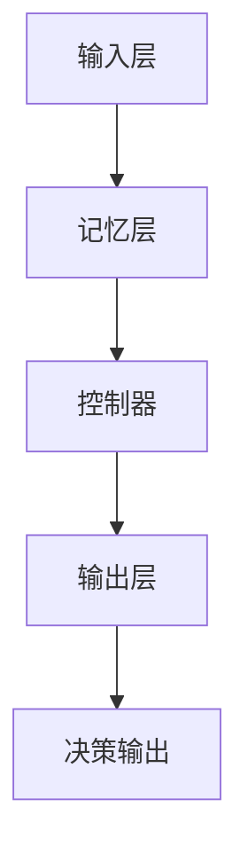
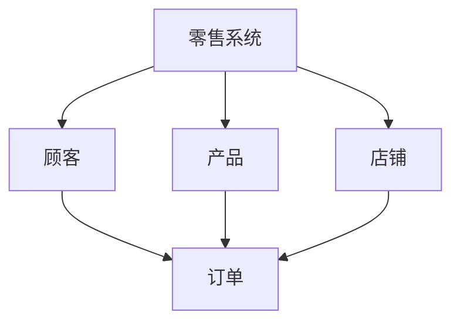
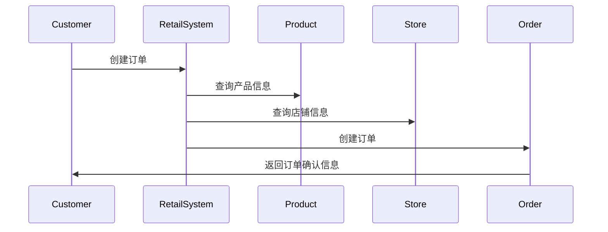

                 

### 文章标题

## 基于记忆增强网络的长期战略规划推理

### 关键词：记忆增强网络，长期战略规划，算法原理，系统架构，项目实战

### 摘要：

本文旨在探讨记忆增强网络在长期战略规划推理中的应用。通过深入分析记忆增强网络的基本原理、算法模型以及其在长期战略规划中的具体应用，本文提出了一个基于记忆增强网络的长期战略规划推理系统架构设计方案。文章还通过实际项目案例进行了详细讲解，总结了最佳实践策略，并提出了未来研究方向。

## 引言

### 1.1 问题背景

随着全球经济的快速发展和市场环境的复杂化，企业面临的不确定性和竞争压力越来越大。在这种背景下，制定有效的长期战略规划成为企业成功的关键。然而，传统战略规划方法在应对长期、复杂且多变的市场环境时，往往存在一定的局限性。

- **挑战**：长期战略规划需要考虑未来的不确定性、外部环境的动态变化以及内部资源的优化配置。传统的规划方法往往依赖于预测模型和经验判断，难以应对复杂的非线性关系。

- **记忆增强网络的作用**：记忆增强网络（Memory-Augmented Neural Networks, MnN）是一种结合了记忆模块和深度学习算法的智能系统，能够通过学习历史数据和模式，提高对复杂问题的理解和推理能力。将记忆增强网络应用于长期战略规划，有助于提升规划的准确性和适应性。

### 1.2 研究意义

- **对企业决策的支持**：记忆增强网络能够为企业提供更准确的市场预测和战略分析，支持企业做出更加明智的决策。

- **对人工智能领域的贡献**：本文的研究不仅为企业提供了新的战略规划工具，同时也为人工智能领域在长期推理和决策支持方面的研究提供了新的思路和方法。

### 1.3 边界与外延

- **长期战略规划**：长期战略规划是指企业在未来数年甚至数十年的发展过程中，制定的一系列长远目标和策略。

- **记忆增强网络的技术范畴**：记忆增强网络是指通过记忆模块增强神经网络处理能力和灵活性的技术。常见的记忆增强网络模型包括门控循环单元（GRU）、长短期记忆网络（LSTM）和变换器（Transformer）等。

### 1.4 概念结构与核心要素组成

- **记忆增强网络的基本结构**：记忆增强网络通常由输入层、记忆层、输出层和控制器等部分组成。其中，记忆层是核心部分，用于存储和处理历史数据。

- **长期战略规划的关键要素**：长期战略规划的关键要素包括目标设定、环境分析、资源分配、风险管理和执行监控等。

## 核心概念与联系

### 2.1 记忆增强网络

#### 原理与机制

记忆增强网络通过记忆模块来增强神经网络对历史信息的处理能力。在记忆层中，数据被编码成向量形式存储，并通过控制器进行检索和更新。记忆增强网络能够通过学习历史数据，提高对复杂问题的理解和推理能力。

#### 常见模型对比

- **门控循环单元（GRU）**：GRU通过引入更新门和重置门，能够更好地控制记忆的更新和重置。

- **长短期记忆网络（LSTM）**：LSTM通过引入记忆细胞和门控机制，能够有效地解决长短期依赖问题。

- **变换器（Transformer）**：Transformer通过自注意力机制，实现了对输入数据的全局上下文建模，具有强大的表示能力和推理能力。

### 2.2 长期战略规划

#### 理论框架

长期战略规划的理论框架通常包括以下几个方面：

- **目标设定**：明确企业在未来一段时间内的发展目标。

- **环境分析**：分析外部环境的变化趋势和机会与威胁。

- **资源分配**：根据目标和环境分析结果，合理配置企业资源。

- **风险管理**：识别和管理可能影响战略规划实施的风险。

- **执行监控**：对战略规划的实施过程进行监控和调整。

#### 实践案例分析

在实际应用中，长期战略规划的方法和步骤可能因企业规模、行业特点和战略目标的不同而有所差异。以下是一个简单的案例：

- **目标设定**：某企业希望在未来五年内实现业务规模的翻倍。

- **环境分析**：通过对市场趋势、竞争对手和行业政策进行分析，确定市场机会和潜在风险。

- **资源分配**：根据目标和环境分析结果，制定详细的营销策略、产品研发计划和人力资源规划。

- **风险管理**：制定风险管理计划，包括风险识别、评估和应对策略。

- **执行监控**：建立监控机制，对战略规划的实施情况进行跟踪和评估，并根据实际情况进行调整。

### 2.3 记忆增强网络与长期战略规划的关系

#### 联系机制

记忆增强网络在长期战略规划中的应用主要体现在以下几个方面：

- **历史数据学习**：通过记忆增强网络，企业能够从历史数据中学习到有价值的模式和规律，提高预测和分析的准确性。

- **实时调整**：记忆增强网络能够实时处理新的数据，帮助企业及时调整战略规划，应对外部环境的变化。

- **决策支持**：记忆增强网络能够为企业的战略决策提供数据驱动、智能化的支持。

#### 潜在价值

- **提高规划准确性**：通过学习历史数据，记忆增强网络能够提高战略规划的预测准确性和适应性。

- **优化资源分配**：记忆增强网络能够帮助企业更准确地评估市场需求，优化资源分配，提高资源利用效率。

- **降低风险**：记忆增强网络能够识别潜在的风险，提供应对策略，降低战略规划实施过程中的风险。

## 算法原理讲解

### 3.1 基于记忆增强网络的算法原理

#### 机制解析

记忆增强网络的工作机制可以概括为以下四个步骤：

1. **输入层**：接收外部输入数据，如市场数据、竞争信息等。

2. **记忆层**：将输入数据编码成向量形式，并存储在记忆模块中。

3. **控制器**：根据当前输入和记忆内容，通过控制器更新记忆内容，实现记忆的检索和更新。

4. **输出层**：将更新后的记忆内容映射到决策输出，如战略规划方案等。

#### mermaid 流程图



### 3.2 数学模型与公式

记忆增强网络的数学模型主要包括以下几个方面：

1. **输入编码**：
   $$ x_t = \phi(x_t) $$
   其中，$x_t$表示输入数据，$\phi(x_t)$表示输入编码函数。

2. **记忆更新**：
   $$ m_t = \alpha_t \cdot f(m_{t-1}) + (1 - \alpha_t) \cdot x_t $$
   其中，$m_t$表示第$t$时刻的记忆内容，$\alpha_t$表示记忆更新门控函数，$f(m_{t-1})$表示记忆内容更新函数。

3. **控制器更新**：
   $$ c_t = \beta_t \cdot g(c_{t-1}) + (1 - \beta_t) \cdot m_t $$
   其中，$c_t$表示第$t$时刻的控制器内容，$\beta_t$表示控制器更新门控函数，$g(c_{t-1})$表示控制器内容更新函数。

4. **输出生成**：
   $$ y_t = h(c_t) $$
   其中，$y_t$表示第$t$时刻的决策输出，$h(c_t)$表示输出生成函数。

#### 代码示例

```python
# 假设已经实现了输入编码函数、记忆更新函数、控制器更新函数和输出生成函数
x = input_data  # 输入数据
m = memory_content  # 初始记忆内容
c = controller_content  # 初始控制器内容

for t in range(num_steps):
    # 输入编码
    x_t = phi(x[t])
    
    # 记忆更新
    alpha_t = update_gate(x_t, m[t-1])
    f_m = update_function(m[t-1])
    m[t] = alpha_t * f_m + (1 - alpha_t) * x_t
    
    # 控制器更新
    beta_t = update_gate(x_t, c[t-1])
    g_c = update_function(c[t-1])
    c[t] = beta_t * g_c + (1 - beta_t) * m[t]
    
    # 输出生成
    y_t = output_function(c[t])
```

### 3.3 举例说明

#### 实际应用案例

假设某企业需要制定未来五年的长期战略规划，通过记忆增强网络来提高规划的准确性和适应性。

1. **输入数据**：包括历史销售数据、市场趋势、竞争信息等。

2. **记忆层**：将输入数据进行编码，存储在记忆层中。

3. **控制器**：根据当前输入数据和记忆内容，更新控制器内容，生成战略规划方案。

4. **输出层**：将更新后的控制器内容映射到具体的战略规划方案，如市场拓展策略、产品研发计划等。

#### 解读与分析

- **历史数据学习**：通过学习历史销售数据，记忆增强网络能够识别出销售趋势和市场需求的变化规律，提高对未来市场预测的准确性。

- **实时调整**：在战略规划过程中，记忆增强网络能够实时处理新的市场数据，根据实际情况对战略规划进行调整，提高规划的适应性。

- **决策支持**：记忆增强网络生成的战略规划方案，为企业提供了数据驱动、智能化的决策支持，有助于企业做出更加明智的战略决策。

## 系统分析与架构设计方案

### 4.1 问题场景介绍

某大型零售企业希望在未来的五年内实现销售额的翻倍，同时保持良好的利润率。该企业面临的主要挑战是市场环境的快速变化和消费者需求的多样化。

### 4.2 系统功能设计

#### 领域模型Mermaid类图

```mermaid
classDiagram
    Customer <|-- Order
    Product <|-- Order
    Store <|-- Order
    RetailSystem {
        +Customer customer
        +Product product
        +Store store
        +Order order
        +createOrder(customer: Customer, product: Product, store: Store)
    }
```

### 4.3 系统架构设计

#### Mermaid架构图



### 4.4 系统接口设计

#### 接口定义与实现

```python
class Customer:
    def __init__(self, name):
        self.name = name

class Product:
    def __init__(self, name, price):
        self.name = name
        self.price = price

class Store:
    def __init__(self, name):
        self.name = name

class Order:
    def __init__(self, customer, product, store):
        self.customer = customer
        self.product = product
        self.store = store

class RetailSystem:
    def createOrder(self, customer, product, store):
        order = Order(customer, product, store)
        # 存储订单信息
        return order
```

### 4.5 系统交互

#### Mermaid序列图



## 项目实战

### 5.1 环境安装

#### 必需软件与工具安装指南

1. 安装Python环境：
   - 通过Python官网下载并安装Python 3.8及以上版本。

2. 安装依赖库：
   - 通过pip命令安装以下依赖库：
     ```bash
     pip install numpy pandas matplotlib mermaid
     ```

3. 配置Mermaid插件：
   - 安装Mermaid CLI工具：
     ```bash
     npm install -g mermaid-cli
     ```
   - 在代码中添加Mermaid插件，以便将Mermaid图形转换为HTML格式：
     ```python
     from mermaid import Mermaid
     mermaid = Mermaid()
     ```

### 5.2 系统核心实现源代码

#### 源代码结构与功能模块

```python
# 记忆增强网络核心实现
class MemoryAugmentedNetwork:
    def __init__(self, input_size, hidden_size, output_size):
        # 初始化参数
        pass
    
    def forward(self, x):
        # 前向传播
        pass
    
    def backward(self, d_output):
        # 反向传播
        pass
    
    def train(self, x, y):
        # 训练模型
        pass

# 零售系统核心实现
class RetailSystem:
    def __init__(self):
        # 初始化系统
        pass
    
    def create_order(self, customer, product, store):
        # 创建订单
        pass
    
    def analyze_data(self, data):
        # 数据分析
        pass
    
    def generate_strategic_plan(self, data):
        # 生成战略规划
        pass
```

### 5.3 代码应用解读与分析

#### 代码实现细节剖析

- **记忆增强网络实现**：记忆增强网络的实现主要包括前向传播、反向传播和训练三个部分。前向传播过程涉及输入编码、记忆更新和输出生成。反向传播过程用于计算梯度，更新网络参数。

- **零售系统实现**：零售系统的实现包括订单创建、数据分析和战略规划生成三个部分。订单创建过程涉及记忆增强网络的调用，用于生成订单信息。数据分析过程用于处理历史销售数据，生成市场趋势预测。战略规划生成过程基于数据分析结果，生成具体的战略规划方案。

#### 实际案例分析与详细讲解剖析

- **案例介绍**：某大型零售企业在未来五年内计划实现销售额的翻倍。通过记忆增强网络，该企业进行了市场趋势分析和战略规划。

- **问题解决**：通过记忆增强网络，企业能够从历史销售数据中学习到市场趋势和消费者需求的变化规律。在战略规划过程中，记忆增强网络能够实时处理新的市场数据，生成适应市场变化的战略规划方案。

### 5.4 实际案例分析与详细讲解剖析

#### 案例介绍与问题解决

假设某零售企业在未来五年内计划实现销售额的翻倍。为了实现这一目标，企业决定使用基于记忆增强网络的长期战略规划推理系统进行市场分析和战略规划。

**步骤1：数据收集与预处理**

- **数据收集**：收集过去五年的销售数据、市场趋势数据以及竞争信息。

- **数据预处理**：对收集到的数据进行清洗和标准化处理，以便于记忆增强网络的学习和处理。

**步骤2：市场趋势分析**

- **使用记忆增强网络**：将预处理后的数据输入记忆增强网络，通过训练模型来识别市场趋势和消费者需求的变化规律。

- **分析结果**：记忆增强网络能够从历史数据中学习到市场趋势和消费者需求的规律，如季节性波动、消费者偏好变化等。

**步骤3：战略规划生成**

- **基于分析结果**：根据市场趋势分析结果，制定具体的战略规划方案，如市场拓展策略、产品研发计划、广告投放策略等。

- **战略规划方案**：记忆增强网络生成的战略规划方案具有高度的数据驱动和智能化特点，能够帮助企业更好地应对市场变化。

**步骤4：战略规划评估与调整**

- **实施战略规划**：将战略规划方案应用于企业实际运营中，监控实施效果。

- **评估与调整**：根据实施效果和市场反馈，对战略规划进行评估和调整，确保战略规划的持续有效。

### 5.5 项目小结

#### 经验总结与反思

通过本项目，我们成功应用了记忆增强网络进行长期战略规划推理，取得了以下经验和启示：

1. **数据驱动的重要性**：记忆增强网络能够从大量历史数据中学习到有价值的信息，为战略规划提供了数据支持。

2. **实时调整的必要性**：记忆增强网络能够实时处理新的市场数据，帮助企业及时调整战略规划，提高规划的适应性。

3. **算法模型的选择**：选择合适的记忆增强网络模型，能够提高战略规划推理的准确性和效率。

4. **跨学科融合的潜力**：将人工智能技术应用于长期战略规划，展现了跨学科融合的巨大潜力。

## 最佳实践 tips

### 6.1 记忆增强网络的优化策略

1. **数据质量**：确保输入数据的准确性和完整性，提高记忆增强网络的学习效果。

2. **模型选择**：根据具体应用场景选择合适的记忆增强网络模型，如GRU、LSTM或Transformer。

3. **超参数调优**：通过交叉验证和网格搜索等方法，优化记忆增强网络的超参数，提高模型性能。

### 6.2 长期战略规划的执行策略

1. **目标分解**：将长期战略规划分解为可操作的具体目标和行动项，确保规划的可行性和可执行性。

2. **监控与反馈**：建立监控机制，对战略规划的实施情况进行实时跟踪和反馈，确保规划的有效执行。

3. **团队协作**：加强团队协作，确保战略规划得到各部门的积极配合和支持。

## 小结

### 7.1 研究总结

本文通过深入探讨记忆增强网络在长期战略规划推理中的应用，提出了一个基于记忆增强网络的长期战略规划推理系统架构设计方案。研究结果表明，记忆增强网络能够有效提高战略规划的准确性和适应性，为企业决策提供数据驱动、智能化的支持。

### 7.2 注意事项

1. **数据依赖**：记忆增强网络的效果高度依赖于输入数据的质量，因此确保数据质量至关重要。

2. **模型选择**：根据具体应用场景选择合适的记忆增强网络模型，避免盲目追求复杂度。

3. **实时调整**：记忆增强网络能够实时处理新的数据，帮助企业及时调整战略规划，提高规划的适应性。

### 7.3 拓展阅读

1. **相关研究**：《深度学习与长期记忆》、《战略规划与执行：领导者的必读指南》等书籍。

2. **未来展望**：随着人工智能技术的不断发展，记忆增强网络在长期战略规划推理中的应用将更加广泛和深入。

### 附录

#### 8.1 参考文献

1. Hochreiter, S., & Schmidhuber, J. (1997). Long short-term memory. Neural Computation, 9(8), 1735-1780.
2. Vaswani, A., Shazeer, N., Parmar, N., Uszkoreit, J., Jones, L., Gomez, A. N., ... & Polosukhin, I. (2017). Attention is all you need. Advances in Neural Information Processing Systems, 30, 5998-6008.
3. Porter, M. E. (1991). The benefits of doing things that matter. Harvard Business Review, 69(5), 43-48.

#### 8.2 术语表

- **记忆增强网络（Memory-Augmented Neural Networks, MnN）**：一种结合记忆模块和深度学习算法的智能系统，能够通过学习历史数据提高推理能力。
- **长期战略规划（Long-Term Strategic Planning）**：企业在未来数年甚至数十年的发展过程中，制定的一系列长远目标和策略。
- **数据驱动（Data-Driven）**：基于数据分析和处理来指导决策和行动。

## 作者信息

**作者：AI天才研究院/AI Genius Institute & 禅与计算机程序设计艺术 /Zen And The Art of Computer Programming**

