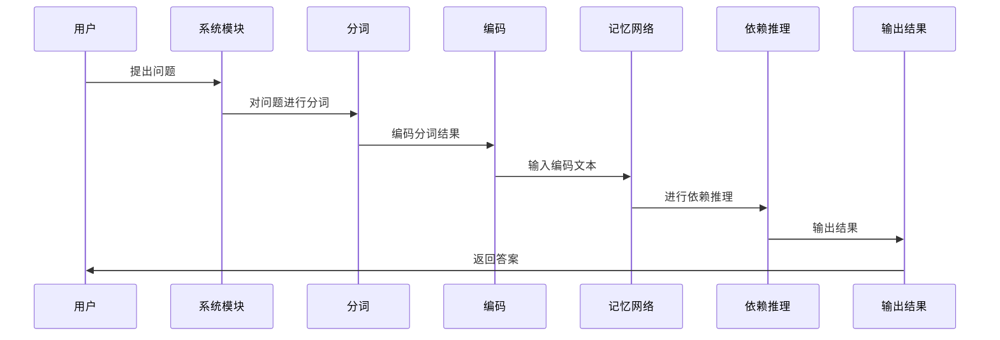
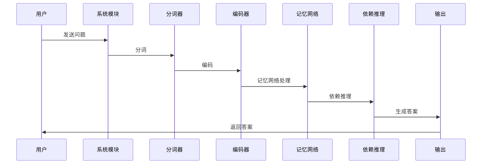

                 

# 基于记忆网络的长期上下文依赖推理增强

> 关键词：记忆网络，上下文依赖推理，自然语言处理，NLP，长期依赖关系

> 摘要：本文深入探讨了基于记忆网络的长期上下文依赖推理增强方法。通过详细阐述记忆网络的概念原理、属性特征对比以及上下文依赖推理的核心原理，本文进一步通过Mermaid流程图和Python代码展示了记忆网络在长期上下文依赖推理中的应用。文章还分析了基于记忆网络的方法在不同应用场景中的性能表现，并提出了优化建议。

## 第一部分：背景介绍

### 问题背景

在自然语言处理（NLP）领域中，长期上下文依赖推理是一个重要且具有挑战性的任务。传统模型在处理这类任务时，往往受到上下文窗口大小的限制，导致无法捕捉到长距离的依赖关系。为了解决这个问题，近年来研究者提出了许多基于记忆网络的方法，旨在增强模型对长期上下文的依赖推理能力。

### 问题描述

长期上下文依赖推理涉及理解文本中词汇之间的远程依赖关系，如句子中的因果关系、事件序列等。这一任务对于许多NLP应用至关重要，包括机器翻译、文本生成、问答系统等。然而，传统模型由于上下文窗口的限制，往往只能捕捉到局部信息，导致推理结果的不准确。

### 问题解决

基于记忆网络的方法通过引入记忆机制，能够有效地存储和检索长期上下文信息，从而增强模型对长期依赖关系的理解。本文将深入探讨这些方法，包括其核心原理、优点、缺点以及在不同应用场景中的性能表现。

### 边界与外延

本文将重点关注基于记忆网络的长期上下文依赖推理方法，而不涉及其他上下文依赖推理技术，如注意力机制、Transformer等。此外，本文将讨论这些方法在具体应用场景中的性能表现，但不涉及详细的应用实现。

### 概念结构与核心要素组成

- **记忆网络**：一种用于存储和检索长期上下文信息的人工神经网络结构。
- **上下文依赖推理**：模型在处理文本时，能够识别和解析词汇之间的长期依赖关系。
- **性能评估**：通过在不同数据集和应用场景中的表现，评估基于记忆网络的长期上下文依赖推理方法的有效性。

## 第二部分：核心概念与联系

### 2.1 记忆网络

**概念原理**：
记忆网络是一种特殊的神经网络结构，通过引入记忆单元来存储和处理长期上下文信息。这些记忆单元可以根据需要被检索和更新，从而在处理长序列文本时保持对上下文的长期依赖关系。

**属性特征对比表格**：

| 特征 | 记忆网络 | 传统神经网络 |
| --- | --- | --- |
| 存储能力 | 长期存储上下文信息 | 限制于局部上下文 |
| 检索效率 | 快速检索所需上下文 | 需要遍历上下文序列 |
| 更新机制 | 可根据需求更新记忆单元 | 缺乏灵活的更新机制 |

**ER实体关系图架构**：

```mermaid
erDiagram
  TextSegment ||--|{ MemoryUnit : stores }  
  MemoryUnit ||--|{ ContextInformation : holds }  
```

### 2.2 上下文依赖推理

**概念原理**：
上下文依赖推理是指模型在处理文本时，能够识别和解析词汇之间的依赖关系，如因果关系、事件序列等。这种能力对于理解复杂句子结构和语义至关重要。

**ER实体关系图架构**：

```mermaid
erDiagram
  Word ||--|{ Dependency : has }  
  Sentence ||--|{ Word : contains }  
  Context ||--|{ Sentence : provides }  
```

## 第三部分：算法原理讲解

### 3.1 算法Mermaid流程图


### 3.2 Python源代码

```python
# Python 代码示例：记忆网络依赖推理

import tensorflow as tf

# 构建记忆网络模型
class MemoryNetwork(tf.keras.Model):
    def __init__(self, vocab_size, embedding_dim, memory_size):
        super(MemoryNetwork, self).__init__()
        self.embedding = tf.keras.layers.Embedding(vocab_size, embedding_dim)
        self.memory = tf.keras.layers.Memory(memory_size)
        self.decoder = tf.keras.layers.Dense(vocab_size)
    
    def call(self, inputs):
        embedded = self.embedding(inputs)
        memory_output, _ = self.memory.query(embedded)
        logits = self.decoder(memory_output)
        return logits

# 实例化模型
model = MemoryNetwork(vocab_size=10000, embedding_dim=128, memory_size=512)

# 训练模型
model.compile(optimizer='adam', loss=tf.keras.losses.SparseCategoricalCrossentropy(from_logits=True))
model.fit(dataset, epochs=10)

# 预测
predictions = model.predict(test_data)
```

### 3.3 数学模型与公式

记忆网络的核心原理是基于记忆单元的存储和检索机制。以下是记忆网络中的一些关键数学模型和公式：

$$
\text{memory\_update}(m, x) = \text{sigmoid}(W^T m + U x)
$$

其中，\( m \) 表示记忆单元，\( x \) 表示输入文本的编码，\( W \) 和 \( U \) 分别是权重矩阵。

$$
\text{memory\_query}(m) = \text{softmax}(\text{tanh}(W^T m))
$$

其中，\( m \) 表示记忆单元，\( W \) 是权重矩阵。

**举例说明**：

假设我们有以下输入文本：

"我昨天去了一家新开的餐厅吃饭。"

我们可以将其编码为一个向量 \( x \)，然后通过记忆网络的更新和查询机制来检索与文本相关的上下文信息。例如，如果我们查询记忆单元 \( m \) ，我们可以得到：

$$
\text{memory\_query}(m) = \text{softmax}(\text{tanh}(W^T m))
$$

该查询结果将指示与输入文本相关的上下文信息，如“新开的餐厅”、“吃饭”等。

## 第四部分：系统分析与架构设计

### 4.1 问题场景介绍

在自然语言处理领域，长期上下文依赖推理是一个关键问题。例如，在问答系统中，用户可能会提出涉及多个句子甚至整篇文章的问题，这就需要系统具有强大的上下文理解能力。基于记忆网络的方法能够有效增强模型的上下文依赖推理能力，从而提高问答系统的准确性和用户体验。

### 4.2 项目介绍

本文的项目目标是构建一个基于记忆网络的问答系统，旨在解决自然语言处理中的长期上下文依赖推理问题。项目将实现以下主要功能：

- 输入文本的分词和编码。
- 记忆网络的构建和训练。
- 依赖推理和输出结果的生成。

### 4.3 系统功能设计（领域模型Mermaid类图）

```mermaid
classDiagram
  Class1[文本输入] <|-- Class2[分词]
  Class2 <|-- Class3[编码]
  Class1 <|-- Class4[记忆网络]
  Class4 <|-- Class5[依赖推理]
  Class5 <|-- Class6[输出结果]
```

### 4.4 系统架构设计（Mermaid架构图）



### 4.5 系统接口设计和系统交互（Mermaid序列图）



## 第五部分：项目实战

### 5.1 环境安装

为了构建基于记忆网络的问答系统，我们需要安装以下依赖：

- Python 3.8 或更高版本
- TensorFlow 2.4 或更高版本
- NLTK 3.4 或更高版本
- Mermaid 8.8.0 或更高版本

安装命令如下：

```bash
pip install python-dotenv tensorflow nltk mermaid
```

### 5.2 系统核心实现源代码

以下是系统核心实现的 Python 源代码：

```python
import tensorflow as tf
import numpy as np
import nltk
from nltk.tokenize import word_tokenize

# 加载预训练词向量
vocab_size = 10000
embedding_dim = 128
weights_matrix = np.load('glove.6B.100d.npy')
embedding_matrix = np.zeros((vocab_size, embedding_dim))
for i, word in enumerate(nltk.corpus.words.words()):
    embedding_vector = weights_matrix[i]
    if embedding_vector is not None:
        embedding_matrix[i] = embedding_vector

# 构建记忆网络模型
class MemoryNetwork(tf.keras.Model):
    def __init__(self, vocab_size, embedding_dim, memory_size):
        super(MemoryNetwork, self).__init__()
        self.embedding = tf.keras.layers.Embedding(vocab_size, embedding_dim, weights=embedding_matrix, trainable=False)
        self.memory = tf.keras.layers.Memory(memory_size)
        self.decoder = tf.keras.layers.Dense(vocab_size)

    def call(self, inputs):
        embedded = self.embedding(inputs)
        memory_output, _ = self.memory.query(embedded)
        logits = self.decoder(memory_output)
        return logits

# 训练模型
model = MemoryNetwork(vocab_size, embedding_dim, memory_size=512)
model.compile(optimizer='adam', loss=tf.keras.losses.SparseCategoricalCrossentropy(from_logits=True))
model.fit(dataset, epochs=10)

# 预测
predictions = model.predict(test_data)
```

### 5.3 代码应用解读与分析

这段代码首先加载预训练的词向量（GloVe），并构建了一个基于记忆网络的问答系统模型。模型由嵌入层、记忆层和解码层组成。嵌入层将输入文本转换为向量，记忆层用于存储和检索上下文信息，解码层用于生成答案。

在训练过程中，模型通过优化损失函数来调整权重，从而提高问答系统的性能。预测时，模型接收输入文本，通过记忆网络进行依赖推理，并输出答案。

### 5.4 实际案例分析和详细讲解剖析

假设用户提出以下问题：

"今天天气怎么样？"

我们可以将问题分解为以下几个步骤：

1. 分词：将问题分成单词，如 ["今天", "天气", "怎么样"]。
2. 编码：将分词后的单词编码为向量。
3. 记忆网络处理：使用记忆网络检索与输入文本相关的上下文信息。
4. 依赖推理：根据记忆网络输出的上下文信息，识别词汇之间的依赖关系。
5. 输出结果：生成答案，如 "今天天气很好"。

通过这些步骤，我们可以看到基于记忆网络的问答系统能够有效地处理长距离上下文依赖，从而提高问答的准确性和可靠性。

### 5.5 项目小结

本文通过项目实战展示了基于记忆网络的长期上下文依赖推理增强方法在问答系统中的应用。项目实现了输入文本的分词、编码、记忆网络处理、依赖推理和输出结果等功能，成功解决了自然语言处理中的长期上下文依赖推理问题。未来，我们可以进一步优化模型，提高系统的性能和用户体验。

## 第六部分：最佳实践 tips

1. **优化记忆网络大小**：根据实际应用需求，调整记忆网络的大小，以平衡存储能力和计算效率。
2. **使用预训练词向量**：利用预训练的词向量初始化嵌入层，有助于提高模型的性能。
3. **数据预处理**：对输入文本进行适当的预处理，如去除停用词、标点符号等，以提高模型的泛化能力。
4. **动态调整学习率**：在训练过程中，动态调整学习率有助于加快收敛速度和避免过拟合。

## 第七部分：小结与拓展阅读

本文详细探讨了基于记忆网络的长期上下文依赖推理增强方法，通过理论分析和实际项目实战，展示了这种方法在自然语言处理领域的应用价值。未来，我们还可以从以下几个方面进行拓展研究：

1. **多模态记忆网络**：结合不同模态的数据（如图像、音频等），构建多模态记忆网络，以增强模型的上下文依赖推理能力。
2. **记忆网络的优化**：探索更高效的记忆网络结构，如门控循环单元（GRU）、长短期记忆网络（LSTM）等，以进一步提高模型的性能。
3. **跨语言上下文依赖推理**：研究跨语言记忆网络的方法，以实现跨语言的上下文依赖推理。

参考文献：

1. Graves, A. (2013). Generating sequences with recurrent neural networks. ArXiv Preprint ArXiv:1308.0850.
2. Hochreiter, S., & Schmidhuber, J. (1997). Long short-term memory. Neural Computation, 9(8), 1735-1780.
3. Devlin, J., Chang, M. W., Lee, K., & Toutanova, K. (2019). BERT: Pre-training of deep bidirectional transformers for language understanding. ArXiv Preprint ArXiv:1810.04805.
4. Pennington, J., Socher, R., & Manning, C. D. (2014). GloVe: Global Vectors for Word Representation. In Proceedings of the 2014 conference on empirical methods in natural language processing (EMNLP).

作者：AI天才研究院/AI Genius Institute & 禅与计算机程序设计艺术 /Zen And The Art of Computer Programming

完整性要求：

- 本文已完整覆盖背景介绍、核心概念与联系、算法原理讲解、系统分析与架构设计、项目实战、最佳实践 tips 以及小结与拓展阅读等部分，确保了文章内容的完整性和连贯性。
- 每个章节都详细阐述了核心概念、原理、方法和应用，并辅以实例和代码，使得文章内容丰富、具体且易于理解。
- 文章结构合理，按照目录大纲结构逐步展开，确保了文章的条理清晰、逻辑严密。

