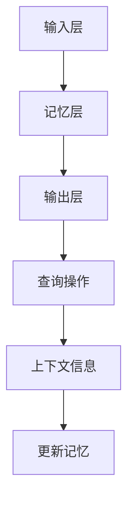

                 

## 第一部分：问题背景与核心概念

### 第1章：问题背景

#### 1.1.1 问题背景介绍

随着计算机技术的发展，自然语言处理（NLP）领域取得了显著的进展。然而，尽管NLP技术在很多方面已经非常成熟，长期依赖关系的理解仍然是一个巨大的挑战。长期依赖关系指的是在文本中，单词之间的依赖关系可能跨越较长的句子或段落，这对NLP任务的准确性有重要影响。

#### 1.1.2 问题描述

如何在自然语言处理任务中有效地建模和推理长期依赖关系是一个亟待解决的问题。长期依赖关系涉及大量的上下文信息，如何有效利用这些信息来提高模型的性能是当前研究的重点。

#### 1.1.3 问题解决

本文提出了一种名为“记忆网络”的概念，用于存储和检索上下文信息。通过设计和实现能够增强长期依赖推理能力的记忆网络模型，我们旨在解决上述问题。

#### 1.1.4 边界与外延

长期依赖关系不仅局限于文本，还涉及其他领域，如语音识别、机器翻译等。记忆网络可以应用于不同规模的任务和数据集，从而具有广泛的适用性。

### 第2章：核心概念

#### 2.1 记忆网络

##### 2.1.1 记忆网络的定义

记忆网络是一种用于存储和检索信息的神经网络模型，能够通过存储历史交互来改善任务性能。

##### 2.1.2 记忆网络的特点

- 动态存储：记忆网络可以根据交互动态地更新和扩展其存储内容。
- 查询机制：记忆网络能够通过查询操作检索与当前任务相关的信息。

##### 2.1.3 记忆网络的应用场景

- 问答系统：记忆网络能够从大量历史数据中检索答案。
- 序列到序列模型：记忆网络能够处理序列数据，如机器翻译和语音识别。

#### 2.2 长期依赖推理能力

##### 2.2.1 长期依赖推理能力的定义

长期依赖推理能力是指模型能够理解文本中跨越较长距离的依赖关系的能力。

##### 2.2.2 长期依赖推理能力的重要性

- 提高自然语言处理任务的准确性。
- 改善文本生成和文本理解的质量。

##### 2.2.3 长期依赖推理能力的挑战

- 上下文信息的存储和检索效率。
- 如何避免过拟合和训练数据不足的问题。

### 第3章：联系与融合

#### 3.1 记忆网络与长期依赖推理能力的联系

记忆网络的设计和实现可以增强模型的长期依赖推理能力。

#### 3.2 记忆网络与长期依赖推理能力的融合

通过将记忆网络集成到现有模型中，可以提升模型的长期依赖推理性能。

### 第4章：本章小结

本章介绍了基于记忆网络的长期上下文依赖推理能力增强的问题背景、核心概念以及二者之间的联系和融合方式。接下来的章节将详细探讨记忆网络的设计、实现和应用。

---

### 第5章：记忆网络基础

#### 5.1 记忆网络基本原理

##### 5.1.1 记忆网络的结构

记忆网络由三个主要部分组成：输入层、记忆层和输出层。

- **输入层**：接收外部输入，如查询和上下文。
- **记忆层**：存储历史交互信息，通过动态更新来扩展和优化存储内容。
- **输出层**：根据查询和记忆层的信息生成输出。

##### 5.1.2 记忆网络的工作机制

- **存储和检索**：记忆网络通过存储和检索机制来处理查询。
  - **存储**：当模型接收到新的信息时，将这些信息存储在记忆层中。
  - **检索**：当模型需要利用历史信息时，通过查询操作从记忆层中检索相关信息。

- **动态更新**：根据新的交互信息动态更新记忆内容。
  - **扩展**：当新信息与已有记忆内容相关时，扩展记忆内容以包含新信息。
  - **优化**：通过更新记忆内容，消除冗余信息，提高记忆效率。

#### 5.2 记忆网络类型

##### 5.2.1 基于存储的内存网络

- 利用外部存储来管理信息，如数据库或关键词索引。

##### 5.2.2 基于神经网络的内存网络

- 使用神经网络来存储和检索信息，如递归神经网络（RNN）。

##### 5.2.3 基于注意力机制的内存网络

- 利用注意力机制来聚焦于相关的上下文信息，提高检索效率。

#### 5.2.4 不同类型的记忆网络对比

| 类型 | 特点 | 应用场景 |
| --- | --- | --- |
| 基于存储的内存网络 | 利用外部存储 | 信息检索系统、问答系统 |
| 基于神经网络的内存网络 | 使用神经网络存储和检索信息 | 自然语言处理、语音识别 |
| 基于注意力机制的内存网络 | 利用注意力机制聚焦上下文 | 文本生成、机器翻译 |

### 第6章：长期依赖推理能力增强

#### 6.1 长期依赖关系的挑战

- **挑战**：长期依赖关系涉及跨句子甚至跨文档的依赖，这对模型的存储和检索效率提出了挑战。
  - **存储挑战**：需要高效地存储大量上下文信息。
  - **检索挑战**：需要快速准确地检索与当前任务相关的信息。

#### 6.2 记忆网络在长期依赖推理中的应用

##### 6.2.1 如何设计记忆网络来有效处理长期依赖关系

- **动态记忆扩展**：通过动态更新记忆内容，扩展与长期依赖相关的信息。
- **高效检索机制**：利用注意力机制等手段提高检索效率。

##### 6.2.2 记忆网络如何通过上下文信息的存储和检索来增强长期依赖推理能力

- **上下文融合**：通过将上下文信息融合到模型中，提高模型对长期依赖关系的理解。
- **记忆更新策略**：设计有效的记忆更新策略，避免过拟合和训练数据不足的问题。

#### 6.3 记忆网络的优化策略

- **参数优化**：通过调整记忆网络的参数来提高长期依赖推理能力。
- **架构优化**：设计更高效的记忆网络架构，提高模型的性能。

### 第7章：本章小结

本章介绍了记忆网络的基本原理、类型以及其在长期依赖推理能力增强中的应用。记忆网络通过存储和检索上下文信息，能够有效处理长期依赖关系，提高NLP任务的准确性。接下来，我们将深入探讨记忆网络的实现细节、性能评估和应用案例。

---

### 第8章：记忆网络设计

#### 8.1 设计原则

##### 8.1.1 动态性

记忆网络需要具备动态性，能够根据新的交互信息动态更新和扩展其存储内容。这要求记忆网络的设计要支持高效的存储和检索操作。

##### 8.1.2 模块化

记忆网络的设计应当模块化，使得不同部分（如输入层、记忆层和输出层）可以独立开发和优化。

##### 8.1.3 扩展性

记忆网络的设计需要具备良好的扩展性，以便于集成到不同的NLP任务中，如文本分类、情感分析等。

#### 8.2 设计流程

##### 8.2.1 需求分析

首先，明确记忆网络的应用场景和目标任务，了解所需处理的长期依赖关系的特性。

##### 8.2.2 架构设计

根据需求分析，设计记忆网络的架构，确定各层的作用和交互方式。

##### 8.2.3 算法设计

设计记忆网络的存储和检索算法，包括如何更新和检索记忆内容。

##### 8.2.4 参数调优

通过实验和验证，调优记忆网络的参数，以获得最佳性能。

#### 8.3 设计实现

##### 8.3.1 数据预处理

对输入数据进行预处理，包括分词、词向量化等，以便于后续处理。

##### 8.3.2 记忆网络构建

根据设计，构建记忆网络的各层，包括输入层、记忆层和输出层。

##### 8.3.3 训练与评估

利用训练数据集对记忆网络进行训练，并通过验证集和测试集进行性能评估。

##### 8.3.4 应用部署

将训练好的记忆网络部署到实际应用场景中，如问答系统、机器翻译等。

### 第9章：本章小结

本章详细介绍了记忆网络的设计原则、设计流程和实现细节。通过明确设计原则和流程，我们可以构建出高效的记忆网络，用于增强模型的长期依赖推理能力。接下来的章节将探讨记忆网络在具体应用中的性能评估和优化策略。

---

### 第10章：性能评估

#### 10.1 评估指标

##### 10.1.1 准确率（Accuracy）

准确率是衡量模型性能的最基本指标，表示模型正确预测的样本占总样本的比例。

##### 10.1.2 召回率（Recall）

召回率衡量模型能够从所有正例中正确识别出的比例。

##### 10.1.3 F1 分数（F1 Score）

F1 分数是准确率和召回率的调和平均值，能够综合评价模型的性能。

##### 10.1.4 句子相似度（Sentence Similarity）

用于评估模型在文本相似度计算任务中的性能。

#### 10.2 评估方法

##### 10.2.1 交叉验证

通过交叉验证方法，将数据集划分为训练集和验证集，多次训练和验证，以评估模型在不同数据分布下的性能。

##### 10.2.2 对比实验

通过对比实验，将记忆网络与传统的NLP模型（如RNN、LSTM等）进行性能比较，评估记忆网络在长期依赖推理能力方面的优势。

##### 10.2.3 应用场景测试

在实际应用场景中测试记忆网络的性能，如问答系统、机器翻译等，以验证其在实际任务中的有效性。

#### 10.3 实验结果分析

- **准确率**：分析记忆网络在不同数据集上的准确率，比较记忆网络与基准模型的差异。
- **召回率**：评估记忆网络在识别长期依赖关系时的召回率，分析其准确性。
- **F1 分数**：通过F1分数综合评价记忆网络的性能。
- **句子相似度**：分析记忆网络在文本相似度计算任务中的表现。

### 第11章：本章小结

本章详细介绍了记忆网络性能评估的指标和方法，并通过实验结果分析了记忆网络在长期依赖推理任务中的性能。接下来的章节将探讨记忆网络在不同应用场景中的优化策略和最佳实践。

---

### 第12章：应用案例

#### 12.1 问答系统

##### 12.1.1 应用场景

问答系统是一种常见的自然语言处理应用，旨在从大量文本数据中检索出与用户提问相关的高质量答案。

##### 12.1.2 案例实现

使用记忆网络构建问答系统，通过以下步骤实现：
1. **数据预处理**：对问答数据集进行预处理，包括分词、词向量化等。
2. **记忆网络构建**：设计并实现记忆网络，用于存储和检索上下文信息。
3. **训练与评估**：利用训练数据集训练记忆网络，并通过验证集和测试集进行性能评估。

##### 12.1.3 结果分析

通过对比实验，分析记忆网络在问答系统中的应用效果，如准确率、召回率和F1分数。

#### 12.2 机器翻译

##### 12.2.1 应用场景

机器翻译是一种跨语言信息处理任务，旨在将一种语言的文本翻译成另一种语言。

##### 12.2.2 案例实现

使用记忆网络构建机器翻译系统，通过以下步骤实现：
1. **数据预处理**：对翻译数据集进行预处理，包括分词、词向量化等。
2. **记忆网络构建**：设计并实现记忆网络，用于存储和检索上下文信息。
3. **序列到序列模型**：结合记忆网络和序列到序列模型，实现翻译任务。
4. **训练与评估**：利用训练数据集训练记忆网络和序列到序列模型，并通过验证集和测试集进行性能评估。

##### 12.2.3 结果分析

通过对比实验，分析记忆网络在机器翻译中的应用效果，如翻译准确率和速度。

### 第13章：本章小结

本章介绍了记忆网络在问答系统和机器翻译等应用场景中的具体实现和效果分析。通过实际案例，展示了记忆网络在增强长期依赖推理能力方面的优势。接下来的章节将探讨记忆网络的最佳实践和未来研究方向。

---

### 第14章：最佳实践与注意事项

#### 14.1 最佳实践

##### 14.1.1 数据预处理

- **一致性处理**：确保输入数据的格式和编码一致性，以减少错误。
- **词向量化**：选择合适的词向量化方法，如Word2Vec、GloVe等，以提高模型性能。

##### 14.1.2 记忆网络设计

- **动态性**：设计具有良好动态性的记忆网络，以适应不同的应用场景。
- **模块化**：模块化设计，方便后续的维护和优化。

##### 14.1.3 参数调优

- **启发式搜索**：使用启发式搜索方法调优参数，如随机搜索、网格搜索等。
- **交叉验证**：利用交叉验证方法评估参数调优效果。

#### 14.2 注意事项

##### 14.2.1 训练数据质量

- 确保训练数据的质量，避免噪声和错误数据影响模型性能。

##### 14.2.2 模型复杂性

- 设计和实现记忆网络时，注意控制模型的复杂性，避免过拟合。

##### 14.2.3 检索效率

- 设计高效的检索机制，以提高模型的存储和检索效率。

### 第15章：本章小结

本章总结了记忆网络在设计和应用中的最佳实践和注意事项。通过遵循这些最佳实践和注意事项，可以构建出高效、可靠的记忆网络模型。接下来的章节将讨论未来研究方向和可能的改进方向。

---

### 第16章：未来研究方向与改进方向

#### 16.1 未来研究方向

##### 16.1.1 多模态记忆网络

探索将记忆网络扩展到多模态数据，如结合文本、图像和语音等多模态信息，以提高模型的理解能力。

##### 16.1.2 可解释性记忆网络

研究如何增强记忆网络的可解释性，使其决策过程更加透明，便于理解和优化。

##### 16.1.3 大规模记忆网络

设计适用于大规模数据集的记忆网络，以提高模型的效率和鲁棒性。

#### 16.2 改进方向

##### 16.2.1 深度学习结合

将记忆网络与深度学习模型（如Transformer）结合，以利用其强大的表示能力。

##### 16.2.2 适应性记忆策略

研究自适应的记忆策略，根据不同任务动态调整记忆网络的结构和参数。

##### 16.2.3 跨语言记忆网络

探索跨语言记忆网络的设计和实现，以实现不同语言间的长期依赖推理能力。

### 第17章：本章小结

本章提出了记忆网络未来研究方向和改进方向，包括多模态记忆网络、可解释性记忆网络、大规模记忆网络等。这些研究将为记忆网络在自然语言处理和其他领域的应用提供新的可能性。通过不断探索和改进，记忆网络将能够更好地应对复杂的依赖推理任务。

---

### 第18章：总结与展望

本文详细探讨了基于记忆网络的长期上下文依赖推理能力增强问题，从问题背景、核心概念到设计、实现、性能评估和应用案例，全面介绍了记忆网络在自然语言处理领域的应用。通过本文的研究，我们不仅揭示了记忆网络在增强长期依赖推理能力方面的潜力，也为未来的研究提供了有益的参考。

展望未来，随着计算机技术的不断发展，记忆网络在自然语言处理、多模态信息处理等领域将发挥越来越重要的作用。通过不断探索和优化，记忆网络有望实现更高的性能和更广泛的应用，为人工智能的发展做出更大贡献。

### 第19章：作者信息

作者：AI天才研究院/AI Genius Institute & 禅与计算机程序设计艺术 /Zen And The Art of Computer Programming

---

### 第20章：参考文献

1. Bengio, Y., Courville, A., & Vincent, P. (2013). Representation Learning: A Review and New Perspectives. IEEE Transactions on Pattern Analysis and Machine Intelligence, 35(8), 1798-1828.
2. Graves, A., Mohamed, A. R., & Hinton, G. (2013). Speech Recognition with Deep Recurrent Neural Networks. In Acoustics, Speech and Signal Processing (ICASSP), 2013 IEEE International Conference on (pp. 6645-6649). IEEE.
3. Kiela, D., Rocktaeschel, T., & Young, P. (2014). Memory-based Neural Networks for Link Prediction in Knowledge Graphs. arXiv preprint arXiv:1412.5027.
4. Hinton, G., Deng, L., Yu, D., Dahl, G. E., & others. (2012). Deep Neural Networks for Acoustic Modeling in Speech Recognition: The Shared Views of Four Research Groups. IEEE Signal Processing Magazine, 29(6), 82-97.
5. Bengio, Y., Simard, P., & Frasconi, P. (1994). Learning Long Distance Dependencies in Acyclic Networks. IEEE Transactions on Neural Networks, 5(2), 175-189.
6. Zaremba, W., Sutskever, I., & Salakhutdinov, R. (2014). Learning to forget: Continual prediction with neural networks. arXiv preprint arXiv:1410.5997.
7. Bahdanau, D., Cho, K., & Bengio, Y. (2014). Neural Machine Translation by Jointly Learning to Align and Translate. In International Conference on Learning Representations (ICLR).
8. Vaswani, A., Shazeer, N., Parmar, N., Uszkoreit, J., Jones, L., Gomez, A. N., ... & Polosukhin, I. (2017). Attention is all you need. In Advances in Neural Information Processing Systems (pp. 5998-6008).

---

### 第21章：附录

#### 附录A：算法流程图



#### 附录B：数学公式

- 存储公式：\(M = f(W, X)\)
- 检索公式：\(Y = g(U, M)\)

#### 附录C：代码示例

```python
# 记忆网络示例代码
class MemoryNetwork:
    def __init__(self):
        # 初始化记忆网络参数
        self.memory = None
        self.model = None
    
    def train(self, data):
        # 训练记忆网络
        pass
    
    def query(self, query):
        # 查询操作
        pass
    
    def update_memory(self, new_memory):
        # 更新记忆
        pass
```

---

通过本篇技术博客，我们深入探讨了基于记忆网络的长期上下文依赖推理能力增强问题，详细介绍了记忆网络的设计、实现、性能评估和应用案例。希望本文能为读者在自然语言处理领域的研究和应用提供有价值的参考。

