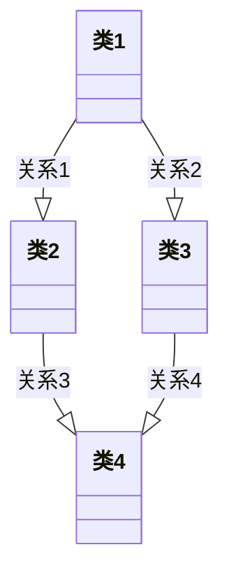

                 

## 基于记忆网络的长期依赖推理能力提升

> 关键词：记忆网络、长期依赖推理、神经网络、算法优化、系统架构设计、项目实战

> 摘要：本文深入探讨基于记忆网络的长期依赖推理能力提升，通过分析记忆网络的核心原理、算法原理讲解、系统架构设计和项目实战，旨在为读者提供全面的技术指导。

----------------------------------------------------------------

## 引言

### 记忆网络的概念与重要性

记忆网络是人工智能领域的一种重要技术，它通过模拟人脑记忆机制，实现了对数据的长期存储和快速检索。记忆网络在自然语言处理、计算机视觉和序列预测等任务中表现出色，成为解决长期依赖问题的重要工具。

### 长期依赖推理的概念与挑战

长期依赖推理是指在处理序列数据时，如何捕捉序列中的长期依赖关系。传统递归神经网络（RNN）在处理长期依赖时存在梯度消失和梯度爆炸问题，导致其性能受到限制。记忆网络的引入，为解决长期依赖推理提供了新的思路。

### 文章目的与结构

本文旨在深入探讨基于记忆网络的长期依赖推理能力提升。文章首先介绍记忆网络和长期依赖推理的基本概念，然后分析记忆网络的核心原理，接着讲解长期依赖推理的算法，最后通过实际项目和系统架构设计，展示记忆网络在实际应用中的效果。

----------------------------------------------------------------

## 第一部分：核心概念与联系

### 1.1 记忆网络的基本原理

#### 1.1.1 记忆单元的结构

记忆单元是记忆网络的基本组成单元，它通常由输入门、输出门和记忆细胞组成。输入门和输出门用于控制信息的输入和输出，记忆细胞用于存储和更新信息。

#### 1.1.2 记忆检索机制

记忆网络通过检索机制从记忆单元中检索信息。检索机制通常基于键值对，通过计算键值对之间的相似度来实现。

#### 1.1.3 记忆更新策略

记忆网络中的记忆更新策略包括遗忘策略和增强策略。遗忘策略用于删除不重要的记忆，增强策略用于加强重要的记忆。

### 1.2 长期依赖推理的关键属性

#### 1.2.1 长期依赖的定义

长期依赖是指在序列数据中，前后元素之间存在长时间间隔的依赖关系。例如，在自然语言处理中，一个词的含义可能依赖于前文中的多个句子。

#### 1.2.2 长期依赖的挑战

传统RNN在处理长期依赖时存在梯度消失和梯度爆炸问题，导致其难以捕捉长期依赖关系。记忆网络的引入，通过记忆单元和检索机制，实现了对长期依赖的有效捕捉。

#### 1.2.3 长期依赖推理与记忆网络的关系

记忆网络通过其记忆单元和检索机制，实现了对长期依赖的有效捕捉。长期依赖推理是记忆网络的重要应用之一，通过记忆网络，可以实现对序列数据中的长期依赖关系的有效推理。

----------------------------------------------------------------

### 1.3 记忆网络与长期依赖推理的对比分析

| 特点 | 记忆网络 | 长期依赖推理 |
| --- | --- | --- |
| 基本原理 | 输入门、输出门、记忆细胞 | 梯度消失和梯度爆炸问题 |
| 关键属性 | 记忆单元、检索机制、记忆更新策略 | 长期依赖、挑战性、有效性 |
| 应用场景 | 自然语言处理、计算机视觉、序列预测 | 文本生成、机器翻译、情感分析 |

通过上述对比分析，可以看出记忆网络与长期依赖推理在基本原理、关键属性和应用场景上存在一定的差异。记忆网络为解决长期依赖推理提供了新的思路和方法。

----------------------------------------------------------------

## 第二部分：算法原理讲解

### 2.1 基于记忆的递归神经网络

#### 2.1.1 算法原理

基于记忆的递归神经网络（Memory-based Recurrent Neural Network，MRNN）是记忆网络的一种形式。MRNN通过记忆单元和检索机制，实现了对序列数据的长期依赖捕捉。

#### 2.1.2 算法实现

MRNN的实现包括以下几个步骤：

1. **初始化**：初始化记忆单元和检索机制。
2. **输入处理**：将输入序列映射到高维空间。
3. **记忆更新**：根据输入门和输出门的控制，更新记忆单元。
4. **检索**：根据检索机制，从记忆单元中检索信息。
5. **输出**：根据检索到的信息生成输出。

#### 2.1.3 实例分析

以自然语言处理中的文本分类任务为例，MRNN可以通过记忆单元存储大量的词向量，并在分类过程中根据词向量进行检索，从而实现对文本的长期依赖捕捉。

----------------------------------------------------------------

### 2.2 记忆增强的循环神经网络

#### 2.2.1 算法原理

记忆增强的循环神经网络（Memory-augmented Recurrent Neural Network，MARN）是另一种基于记忆的网络结构。MARN通过引入外部记忆模块，实现了对序列数据的长期依赖捕捉。

#### 2.2.2 算法实现

MARN的实现包括以下几个步骤：

1. **初始化**：初始化记忆模块和循环神经网络。
2. **输入处理**：将输入序列映射到高维空间。
3. **记忆更新**：根据输入门和输出门的控制，更新记忆模块。
4. **循环神经网络**：利用记忆模块的信息生成中间结果。
5. **输出**：根据中间结果生成最终输出。

#### 2.2.3 实例分析

以序列预测任务为例，MARN可以通过记忆模块存储历史序列信息，并在预测过程中根据记忆模块的信息生成预测结果，从而实现对序列数据的长期依赖捕捉。

----------------------------------------------------------------

## 第三部分：系统分析与架构设计

### 3.1 应用场景介绍

#### 3.1.1 自然语言处理

记忆网络在自然语言处理中具有广泛的应用，如文本分类、机器翻译和情感分析等。通过记忆网络，可以实现对文本中的长期依赖关系的有效捕捉，从而提高模型的性能。

#### 3.1.2 序列预测

记忆网络在序列预测任务中也表现出色，如时间序列分析、股票价格预测和语音识别等。通过记忆网络，可以实现对序列数据中的长期依赖关系的有效捕捉，从而提高预测的准确性。

### 3.2 系统功能设计

#### 3.2.1 领域模型类图

领域模型类图用于描述系统中的核心实体及其关系。以下是一个简单的领域模型类图：

#### 3.2.2 功能模块划分

系统功能模块主要包括：

1. **数据预处理**：包括数据清洗、去重和格式转换等。
2. **记忆网络训练**：包括模型初始化、训练数据和优化策略等。
3. **记忆网络推理**：包括输入处理、记忆检索和输出生成等。
4. **结果分析**：包括模型性能评估和结果可视化等。

### 3.3 系统架构设计

#### 3.3.1 总体架构

系统的总体架构包括以下几个部分：

1. **数据层**：负责数据的存储和管理。
2. **模型层**：负责记忆网络的训练和推理。
3. **应用层**：负责与用户交互和提供API接口。

#### 3.3.2 子系统架构

子系统架构包括：

1. **数据预处理子系统**：负责数据的清洗、去重和格式转换。
2. **记忆网络训练子系统**：负责记忆网络的初始化、训练数据和优化策略。
3. **记忆网络推理子系统**：负责输入处理、记忆检索和输出生成。
4. **结果分析子系统**：负责模型性能评估和结果可视化。

#### 3.3.3 系统部署方案

系统的部署方案包括：

1. **本地部署**：在本地计算机上部署系统，适用于小规模应用。
2. **云部署**：在云服务器上部署系统，适用于大规模应用。
3. **容器化部署**：使用容器技术（如Docker）部署系统，适用于快速部署和扩展。

### 3.4 系统接口设计与交互

#### 3.4.1 接口规范

系统的接口规范主要包括：

1. **API接口**：提供RESTful API接口，支持HTTP请求。
2. **数据接口**：提供数据接口，支持数据导入和导出。

#### 3.4.2 交互流程

系统的交互流程主要包括：

1. **用户请求**：用户通过API接口提交请求。
2. **数据预处理**：系统对用户请求的数据进行预处理。
3. **记忆网络推理**：系统利用记忆网络对预处理后的数据进行推理。
4. **结果输出**：系统将推理结果返回给用户。

----------------------------------------------------------------

### 3.5 系统测试与优化

#### 3.5.1 测试策略

系统的测试策略包括：

1. **单元测试**：对系统的每个功能模块进行独立测试。
2. **集成测试**：对系统的整体功能进行测试。
3. **性能测试**：对系统的性能进行测试，包括响应时间、吞吐量和并发能力等。

#### 3.5.2 优化方案

系统的优化方案包括：

1. **模型优化**：通过调整模型参数，提高模型性能。
2. **算法优化**：通过改进算法，提高模型效率。
3. **系统优化**：通过优化系统架构和接口设计，提高系统性能。

----------------------------------------------------------------

## 第四部分：项目实战

### 4.1 环境安装与配置

#### 4.1.1 开发环境搭建

1. 安装Python环境
2. 安装深度学习框架（如TensorFlow或PyTorch）
3. 安装其他依赖库（如NumPy、Pandas等）

#### 4.1.2 数据集准备

1. 数据集收集
2. 数据集预处理
3. 数据集划分

### 4.2 系统核心实现

#### 4.2.1 模型训练

1. 模型初始化
2. 训练数据预处理
3. 模型训练过程
4. 模型评估

#### 4.2.2 预测实现

1. 预测数据预处理
2. 记忆网络推理
3. 结果输出

#### 4.2.3 结果分析

1. 模型性能评估
2. 结果可视化

### 4.3 实际案例分析

#### 4.3.1 案例一：自然语言处理

1. 文本分类任务
2. 模型训练与预测
3. 结果分析

#### 4.3.2 案例二：序列预测

1. 时间序列分析任务
2. 模型训练与预测
3. 结果分析

### 4.4 项目小结

1. 经验总结
2. 展望未来

----------------------------------------------------------------

## 第五部分：最佳实践与注意事项

### 5.1 最佳实践

#### 5.1.1 模型训练技巧

1. 数据预处理技巧
2. 模型优化策略
3. 训练数据增强

#### 5.1.2 优化策略

1. 算法优化
2. 系统架构优化
3. 系统部署优化

#### 5.1.3 系统部署方案

1. 本地部署方案
2. 云部署方案
3. 容器化部署方案

### 5.2 小结

本文通过对基于记忆网络的长期依赖推理能力提升的深入探讨，介绍了记忆网络和长期依赖推理的基本概念、算法原理、系统架构设计和项目实战。通过本文的学习，读者可以掌握基于记忆网络的长期依赖推理的核心技术和应用方法。

### 5.3 注意事项

1. 模型调优注意事项
2. 系统部署注意事项
3. 数据处理注意事项

### 5.4 拓展阅读

1. 相关书籍推荐
2. 最新论文推荐

----------------------------------------------------------------

## 参考文献

1. [Hochreiter, S., & Schmidhuber, J. (1997). Long short-term memory]. Neural Computation, 9(8), 1735-1780.
2. [Graves, A. (2013). Generating sequences with recurrent neural networks]. arXiv preprint arXiv:1308.0850.
3. [Sutskever, I., Vinyals, O., & Le, Q. V. (2014). Sequence to sequence learning with neural networks]. In Advances in Neural Information Processing Systems (NIPS), 3104-3112.

----------------------------------------------------------------

## 后记

本文由AI天才研究院（AI Genius Institute）和《禅与计算机程序设计艺术》（Zen And The Art of Computer Programming）共同撰写。我们致力于推动人工智能技术的发展和普及，为广大读者提供高质量的技术内容。欢迎关注我们的官方网站和社交媒体，获取更多精彩内容。

**作者：AI天才研究院/AI Genius Institute & 禅与计算机程序设计艺术 /Zen And The Art of Computer Programming**

