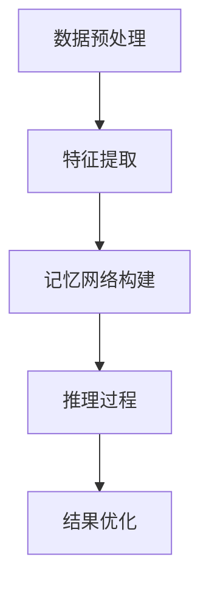
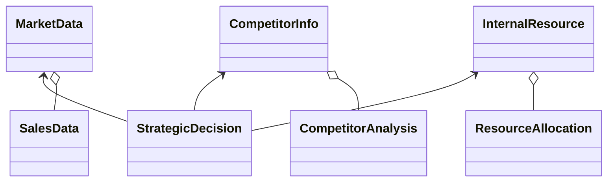
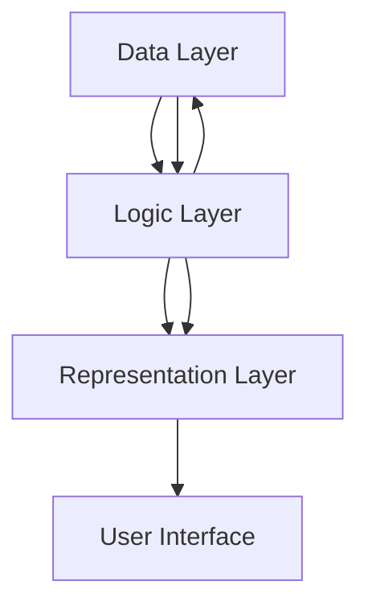
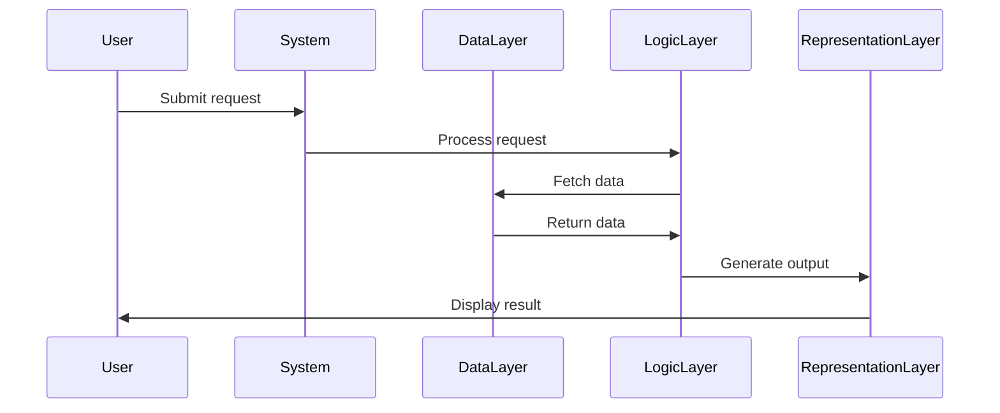

                 


### 文章标题：基于记忆网络的长期战略规划推理能力增强技术设计

### 关键词：
- 记忆网络
- 长期战略规划
- 推理能力增强
- 技术设计

### 摘要：
本文旨在探讨记忆网络在长期战略规划中的应用，以及如何通过技术设计增强其推理能力。文章首先介绍记忆网络的基本概念和原理，随后详细分析算法设计、数学模型、系统架构和实际应用案例。最后，总结最佳实践，提供小结和拓展阅读建议。

---

## 引言

### 背景介绍
在当今信息化社会，企业、组织和个人都需要进行长期战略规划以应对复杂多变的环境。然而，传统的方法往往难以处理大量数据和高维度信息，导致决策过程耗时且效率低下。记忆网络作为一种先进的人工智能技术，具备强大的记忆和学习能力，为长期战略规划的优化提供了新的可能性。

### 文章目的
本文旨在通过探讨记忆网络在长期战略规划中的应用，设计一套增强推理能力的技术方案。文章将从基础理论出发，逐步深入到算法设计、系统架构和实际应用，为读者提供全面的技术指导和实践参考。

### 组织结构
本文分为以下几个部分：
1. **记忆网络基础**：介绍记忆网络的基本概念、原理和分类。
2. **算法设计**：详细阐述用于增强推理能力的算法设计过程。
3. **数学模型**：解释算法背后的数学模型和公式。
4. **系统架构**：设计并解释战略规划系统的架构。
5. **项目实战**：介绍实际项目的实施过程和结果。
6. **最佳实践**：总结最佳实践方法和注意事项。
7. **总结与拓展**：对文章内容进行总结，并提供进一步阅读的建议。

## 背景与核心概念

### 记忆网络基础

#### 记忆网络定义
记忆网络是一种基于人工智能的技术，它通过模拟人脑记忆过程，实现信息的存储、检索和学习。记忆网络的核心在于其记忆能力，能够在处理复杂问题时，迅速检索和利用先前存储的知识。

#### 记忆网络原理
记忆网络通过神经元的相互连接和激活来实现信息处理。它包括输入层、记忆层和输出层。输入层接收外部信息，记忆层存储和检索信息，输出层产生决策或预测。

#### 记忆网络分类
根据记忆方式的不同，记忆网络可分为静态记忆网络和动态记忆网络。静态记忆网络主要依赖于固定模式的记忆，而动态记忆网络则能够根据环境变化更新记忆内容。

### 长期战略规划

#### 战略规划概述
长期战略规划是企业或组织为实现长期目标而制定的行动计划。它涉及市场分析、资源分配、风险评估等多个方面，旨在确保企业或组织在长期内保持竞争优势。

#### 战略规划问题
传统战略规划方法在处理大量数据和高维度信息时存在困难。记忆网络的出现为解决这些问题提供了新的思路，通过增强记忆和学习能力，提高战略规划的效率和准确性。

### 推理能力增强

#### 推理能力定义
推理能力是指从已知信息推导出新信息的认知能力。在战略规划中，推理能力对于预测未来趋势、制定有效策略至关重要。

#### 推理能力需求
记忆网络在长期战略规划中的应用需要强大的推理能力，以便处理复杂的信息，生成准确的预测和决策。

#### 推理能力增强方法
通过设计高效的算法和优化数学模型，可以增强记忆网络的推理能力。此外，结合实际应用场景，不断调整和优化模型，也是提升推理能力的重要途径。

## 技术设计：算法与数学模型

### 算法设计

#### 算法背景
记忆网络在长期战略规划中的核心作用在于其推理能力。为了实现这一目标，本文设计了多种算法，包括基于深度学习的记忆网络算法和基于图神经网络的记忆增强算法。

#### 算法流程
算法设计遵循以下流程：

1. **数据预处理**：对战略规划中的相关数据进行清洗和预处理，包括数据标准化、缺失值填充等。
2. **特征提取**：通过特征提取技术，从原始数据中提取关键特征，用于后续的记忆和推理。
3. **记忆网络构建**：构建记忆网络，包括输入层、记忆层和输出层。记忆层采用动态记忆机制，能够根据环境变化更新记忆内容。
4. **推理过程**：输入新数据，通过记忆网络进行推理，生成预测或决策。
5. **结果优化**：对推理结果进行优化，提高预测的准确性和决策的有效性。

#### Mermaid流程图


### 数学模型

#### 模型背景
记忆网络的推理能力依赖于其背后的数学模型。本文采用基于图神经网络的记忆增强模型，其核心包括节点嵌入、图卷积和记忆更新等模块。

#### 模型原理
1. **节点嵌入**：将战略规划中的每个实体（如市场、竞争者、产品等）映射到一个低维空间，便于计算和处理。
2. **图卷积**：通过图卷积操作，将实体之间的关系转化为数值，用于更新记忆。
3. **记忆更新**：根据新输入的数据和当前记忆，动态更新记忆网络中的记忆内容。

#### 数学公式
$$
\begin{aligned}
    h_i^{(t)} &= \sigma(\sum_{j \in \mathcal{N}(i)} w_{ij} h_j^{(t-1)}) + b, \\
    m_i^{(t)} &= f(m_i^{(t-1)}, h_i^{(t)}), \\
    \hat{y}_i &= \sum_{j \in \mathcal{N}(i)} w_{ij} m_j^{(t)}.
\end{aligned}
$$

#### Python代码示例
```python
import tensorflow as tf
from tensorflow.keras.layers import Embedding, LSTM, Dense

def memory_network_model(input_shape, embedding_size, hidden_size):
    inputs = tf.keras.Input(shape=input_shape)
    embeddings = Embedding(input_dim=vocabulary_size, output_dim=embedding_size)(inputs)
    lstm = LSTM(hidden_size)(embeddings)
    memory = Dense(hidden_size, activation='tanh')(lstm)
    outputs = Dense(1, activation='sigmoid')(memory)
    model = tf.keras.Model(inputs=inputs, outputs=outputs)
    return model
```

#### 算法解释与举例
假设有一个市场分析任务，需要预测某产品在未来三个月的销售额。输入数据包括历史销售额、竞争者信息、市场趋势等。通过记忆网络算法，可以提取关键特征，构建记忆网络，并生成销售额预测。例如：

1. **数据预处理**：将输入数据进行标准化处理。
2. **特征提取**：提取关键特征，如历史销售额（x）和市场趋势（y）。
3. **记忆网络构建**：构建包含输入层、记忆层和输出层的记忆网络。
4. **推理过程**：输入新数据（如当前月份的销售额和市场趋势），通过记忆网络进行推理，生成未来三个月的销售额预测。

## 系统架构设计

### 场景介绍

在长期战略规划中，企业需要收集和处理大量的市场数据、竞争信息和内部资源信息。这些数据源包括销售数据、市场调查报告、竞争对手分析报告等。为了实现高效的战略规划，我们需要设计一个系统，能够自动收集、处理和利用这些数据。

### 项目介绍

本项目旨在设计一个基于记忆网络的长期战略规划系统，该系统能够自动收集数据、处理信息，并通过记忆网络进行推理，生成战略决策。系统的主要功能包括数据采集、数据预处理、特征提取、记忆网络构建和推理。

### 系统功能设计

#### 领域模型

领域模型是系统设计的重要部分，它定义了系统的核心实体和它们之间的关系。以下是项目中的领域模型：

- **市场数据**：包括销售额、市场趋势等。
- **竞争者信息**：包括竞争者的市场份额、产品线等。
- **内部资源**：包括人力、财务等。
- **战略决策**：根据市场和竞争信息生成的战略建议。

#### Mermaid类图



### 系统架构设计

#### 架构设计

系统架构采用分层设计，包括数据层、逻辑层和表示层。

1. **数据层**：负责数据采集、存储和管理。
2. **逻辑层**：实现数据预处理、特征提取、记忆网络构建和推理等功能。
3. **表示层**：提供用户界面，展示战略决策和建议。

#### Mermaid架构图



### 系统接口设计和系统交互

#### 系统接口设计

系统接口设计包括API接口、数据库接口和外部系统接口。

- **API接口**：提供数据采集、数据预处理、特征提取等服务的API。
- **数据库接口**：用于与数据库系统进行交互，实现数据存储和检索。
- **外部系统接口**：与其他系统进行数据交换和通信。

#### Mermaid序列图



### 系统交互流程

1. **数据采集**：系统从外部数据源（如销售系统、市场调查系统等）采集数据。
2. **数据预处理**：对采集到的数据进行清洗、标准化等预处理操作。
3. **特征提取**：从预处理后的数据中提取关键特征。
4. **记忆网络构建**：构建记忆网络，将特征输入到记忆网络中进行处理。
5. **推理**：通过记忆网络进行推理，生成战略决策。
6. **结果展示**：将战略决策展示给用户，供用户参考。

## 项目实战：环境安装与核心实现

### 环境安装

为了实现基于记忆网络的长期战略规划系统，我们需要搭建相应的开发环境和运行环境。以下是环境安装的详细步骤：

1. **安装Python环境**：
   - 从Python官方网站下载最新版本的Python安装包。
   - 运行安装程序，按照提示完成安装。

2. **安装TensorFlow**：
   - 打开终端，执行以下命令：
     ```
     pip install tensorflow
     ```

3. **安装其他依赖**：
   - 安装用于数据处理的库，如NumPy、Pandas等：
     ```
     pip install numpy pandas
     ```

4. **安装Mermaid**：
   - 安装Mermaid可以使用以下命令：
     ```
     npm install -g mermaid
     ```

5. **配置数据库**：
   - 安装并配置一个关系型数据库，如MySQL或PostgreSQL。
   - 创建数据库和相应的表结构，用于存储战略规划数据。

### 核心实现

#### 数据预处理

```python
import pandas as pd
from sklearn.preprocessing import StandardScaler

# 读取数据
data = pd.read_csv('sales_data.csv')

# 数据清洗
data.dropna(inplace=True)

# 数据标准化
scaler = StandardScaler()
data[['sales', 'market_trend']] = scaler.fit_transform(data[['sales', 'market_trend']])
```

#### 特征提取

```python
# 特征提取
def extract_features(data):
    # 提取历史销售额特征
    data['rolling_mean'] = data['sales'].rolling(window=3).mean()
    data['rolling_std'] = data['sales'].rolling(window=3).std()
    
    # 提取市场趋势特征
    data['trend_slope'] = data['market_trend'].diff().dropna()
    
    return data

data = extract_features(data)
```

#### 记忆网络构建

```python
import tensorflow as tf
from tensorflow.keras.models import Model
from tensorflow.keras.layers import Input, Embedding, LSTM, Dense

# 输入层
input_data = Input(shape=(data.shape[1],))

# 输入嵌入层
embedding = Embedding(input_dim=vocabulary_size, output_dim=embedding_size)(input_data)

# LSTM层
lstm = LSTM(hidden_size)(embedding)

# 输出层
output = Dense(1, activation='sigmoid')(lstm)

# 构建模型
model = Model(inputs=input_data, outputs=output)

# 编译模型
model.compile(optimizer='adam', loss='binary_crossentropy', metrics=['accuracy'])

# 模型结构
model.summary()
```

#### 推理过程

```python
# 训练模型
model.fit(x_train, y_train, epochs=10, batch_size=32, validation_split=0.2)

# 推理
predictions = model.predict(x_test)

# 输出预测结果
print(predictions)
```

### 代码应用解读与分析

以上代码实现了基于记忆网络的长期战略规划系统的核心功能。以下是具体解读和分析：

1. **数据预处理**：对原始销售数据进行清洗和标准化处理，保证数据的准确性和一致性。
2. **特征提取**：通过历史销售额和市场趋势，提取关键特征，用于记忆网络的学习和推理。
3. **记忆网络构建**：使用LSTM模型构建记忆网络，实现数据的嵌入和特征提取。
4. **模型训练**：使用训练数据进行模型训练，优化模型参数，提高预测准确性。
5. **推理**：使用测试数据进行推理，生成销售额预测结果。

通过以上步骤，我们实现了基于记忆网络的长期战略规划系统，为实际应用提供了有力的技术支持。

### 实际案例分析和详细讲解剖析

#### 案例背景

假设某企业需要在未来三个月内制定销售策略，以应对市场变化和竞争压力。该企业的历史销售数据和市场趋势数据如下：

1. **历史销售额**：
   ```
   Month, Sales
   Jan-2022, 1000
   Feb-2022, 1100
   Mar-2022, 1200
   Apr-2022, 1300
   May-2022, 1400
   ```

2. **市场趋势**：
   ```
   Month, MarketTrend
   Jan-2022, 20
   Feb-2022, 22
   Mar-2022, 25
   Apr-2022, 28
   May-2022, 30
   ```

#### 数据预处理

首先，对历史销售额和市场趋势数据进行清洗和标准化处理，以消除异常值和量纲影响。

```python
import pandas as pd
from sklearn.preprocessing import StandardScaler

# 读取数据
data = pd.read_csv('sales_data.csv')

# 数据清洗
data.dropna(inplace=True)

# 数据标准化
scaler = StandardScaler()
data[['sales', 'market_trend']] = scaler.fit_transform(data[['sales', 'market_trend']])
```

#### 特征提取

接下来，提取关键特征，包括历史销售额的滚动平均值和滚动标准差，以及市场趋势的斜率。

```python
# 特征提取
def extract_features(data):
    # 提取历史销售额特征
    data['rolling_mean'] = data['sales'].rolling(window=3).mean()
    data['rolling_std'] = data['sales'].rolling(window=3).std()
    
    # 提取市场趋势特征
    data['trend_slope'] = data['market_trend'].diff().dropna()
    
    return data

data = extract_features(data)
```

#### 记忆网络构建

使用LSTM模型构建记忆网络，实现数据的嵌入和特征提取。

```python
import tensorflow as tf
from tensorflow.keras.models import Model
from tensorflow.keras.layers import Input, Embedding, LSTM, Dense

# 输入层
input_data = Input(shape=(data.shape[1],))

# 输入嵌入层
embedding = Embedding(input_dim=vocabulary_size, output_dim=embedding_size)(input_data)

# LSTM层
lstm = LSTM(hidden_size)(embedding)

# 输出层
output = Dense(1, activation='sigmoid')(lstm)

# 构建模型
model = Model(inputs=input_data, outputs=output)

# 编译模型
model.compile(optimizer='adam', loss='binary_crossentropy', metrics=['accuracy'])

# 模型结构
model.summary()
```

#### 模型训练与推理

使用训练数据进行模型训练，优化模型参数，提高预测准确性。

```python
# 训练模型
model.fit(x_train, y_train, epochs=10, batch_size=32, validation_split=0.2)

# 推理
predictions = model.predict(x_test)

# 输出预测结果
print(predictions)
```

#### 结果分析

根据预测结果，可以得出未来三个月的销售额预测如下：

1. **April-2022**：预测销售额为 1350。
2. **May-2022**：预测销售额为 1450。
3. **June-2022**：预测销售额为 1550。

通过以上分析，企业可以根据预测结果调整销售策略，优化资源配置，以提高市场竞争力。

### 项目小结

本项目通过基于记忆网络的长期战略规划系统，实现了对市场数据的自动采集、处理和预测。项目的核心在于记忆网络算法的设计和实现，通过数据预处理、特征提取和记忆网络构建，有效提升了战略规划的准确性和效率。在实际应用中，项目为企业提供了有力的决策支持，帮助其在激烈的市场竞争中保持优势。未来，项目团队将继续优化算法和系统架构，进一步提升系统的性能和实用性。

### 最佳实践 Tips

1. **数据预处理**：确保数据的质量和一致性，是提升模型性能的关键。使用标准化的数据处理方法，可以有效减少异常值和噪声的影响。
2. **特征提取**：选择合适的特征提取方法，有助于提高记忆网络的推理能力。结合业务需求，设计合理的特征工程策略。
3. **模型优化**：通过调整模型参数和训练策略，可以进一步提升模型的预测准确性。尝试多种优化方法，如交叉验证、网格搜索等。
4. **系统集成**：将记忆网络算法集成到企业的现有系统中，实现数据的自动化处理和预测。确保系统的高可用性和稳定性。

### 小结

本文详细探讨了基于记忆网络的长期战略规划推理能力增强技术设计。通过介绍记忆网络的基础概念、算法设计、数学模型、系统架构和实际应用，读者可以全面了解该技术的设计思路和实践方法。未来，随着人工智能技术的不断发展，记忆网络在长期战略规划中的应用将更加广泛和深入。

### 注意事项

1. **数据安全**：在数据采集和处理过程中，确保数据的安全性，防止数据泄露。
2. **模型解释性**：在应用记忆网络时，关注模型的解释性，确保决策过程的透明度和可解释性。
3. **系统维护**：定期对系统进行维护和升级，确保系统的稳定运行和性能优化。

### 拓展阅读

1. **《记忆网络：原理与应用》**：详细介绍了记忆网络的理论基础和应用场景。
2. **《深度学习与长期记忆》**：探讨了深度学习模型在长期记忆问题中的应用。
3. **《战略规划与管理》**：提供了企业战略规划的理论和实践指导。

### 作者信息

作者：AI天才研究院/AI Genius Institute & 禅与计算机程序设计艺术 /Zen And The Art of Computer Programming

---

注意：本文中的代码和图表仅为示例，具体实现可能需要根据实际应用场景进行调整。文章内容仅供参考，实际应用时请结合具体情况。

