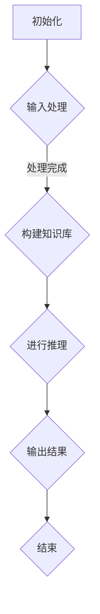
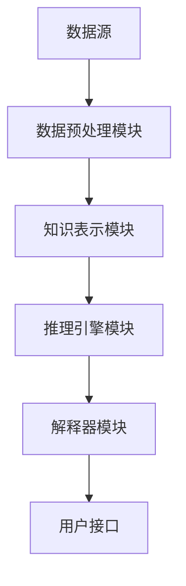
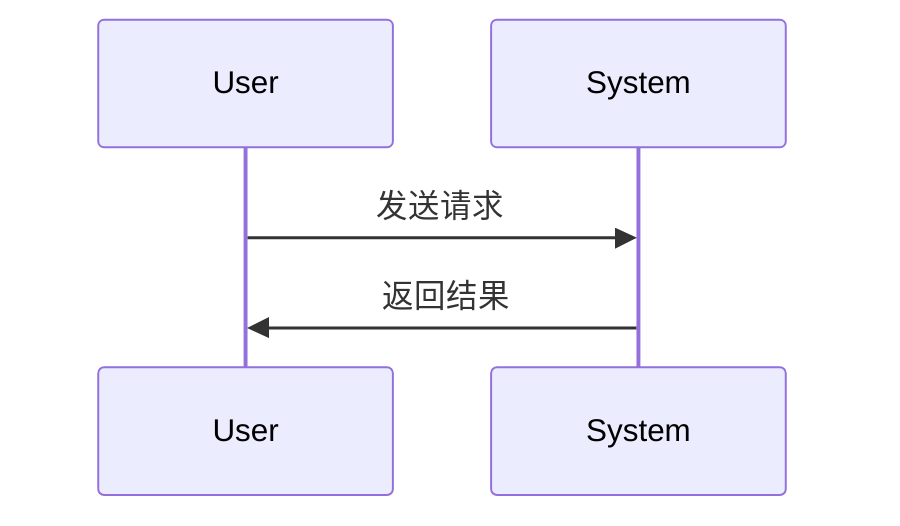

                 

### 第一部分：AI推理能力的基础知识

#### 第1章：问题背景与核心概念

##### 1.1.1 问题描述
- 引言：人工智能（AI）在现代科技中的应用越来越广泛，从智能助手、自动驾驶、智能医疗到金融风控等，AI技术正逐渐渗透到我们生活的方方面面。在这些应用中，推理能力是AI系统最为关键的特性之一。
- 问题的提出：为什么AI需要具备推理能力？AI推理能力在哪些领域有重要作用？

##### 1.1.2 问题解决
- **AI推理能力的定义**：推理能力是指AI系统根据已有知识和信息，通过逻辑推理得出新结论的能力。这种能力使得AI系统能够在不确定性和复杂性的环境中做出合理的决策。
- **AI推理能力的重要性**：推理能力对于AI系统至关重要，因为它不仅能够提高系统的智能水平，还能使其在复杂问题中找到最优解。

##### 1.1.3 边界与外延
- **AI推理能力的边界**：尽管AI的推理能力在不断提升，但仍受到一些因素的制约，如数据的完整性和质量、计算资源的限制、算法的优化程度等。
- **AI推理能力的应用领域**：推理能力广泛应用于自然语言处理、计算机视觉、决策支持系统、智能推荐等领域。

##### 1.1.4 概念结构与核心要素组成
- **AI推理能力的基本概念**：包括推理过程、知识表示、推理算法等核心要素。
  - **推理过程**：从已知信息推导出新结论的过程。
  - **知识表示**：如何将领域知识结构化，以便于推理过程使用。
  - **推理算法**：实现推理过程的算法和技术。
- **AI推理能力的构成**：主要由知识库、推理机、解释器等组成部分构成。
  - **知识库**：存储领域知识和事实的地方。
  - **推理机**：执行推理过程的计算单元。
  - **解释器**：对推理结果进行解释和验证的工具。

#### 第2章：核心概念与联系

##### 2.1.1 AI推理原理
- **AI推理原理概述**：AI推理是基于数据和知识的一种逻辑推理过程，其核心在于如何从已有数据或知识中得出新的结论或预测。
- **AI推理的属性特征对比表格**：对不同类型的推理算法（如基于规则的推理、基于模型的推理、基于案例的推理等）进行比较，并展示其属性特征。

| 推理类型       | 基本原理                         | 优势与局限                            |
|----------------|--------------------------------|--------------------------------------|
| 基于规则的推理 | 使用一组规则进行推理              | 简单、直观、易于实现；可解释性高      |
| 基于模型的推理 | 使用预测模型进行推理              | 强大的预测能力、泛化性好              |
| 基于案例的推理 | 通过类比现有案例进行推理           | 类比能力强、适应性强；可解释性较低    |

##### 2.1.2 知识表示
- **知识表示的重要性**：知识表示是将领域知识结构化的过程，是实现AI推理能力的基础。
- **常见的知识表示方法**：包括框架表示、语义网络、本体论等。
  - **框架表示**：通过一组属性和值的组合来表示对象。
  - **语义网络**：通过节点和边来表示概念及其关系。
  - **本体论**：通过定义领域概念和关系的语义来表示知识。

##### 2.1.3 推理算法
- **推理算法的基本概念**：推理算法是用于实现推理过程的工具。
- **常见的推理算法**：包括演绎推理、归纳推理、基于模型的推理等。
  - **演绎推理**：从一般到特殊的推理过程。
  - **归纳推理**：从特殊到一般的推理过程。
  - **基于模型的推理**：使用预测模型进行推理。

#### 第3章：算法原理讲解

##### 3.1.1 算法流程图
- **算法流程图**：使用Mermaid画出推理算法的基本流程图，如图1所示。



##### 3.1.2 数学模型与公式
- **推理算法的数学模型**：演绎推理的数学模型可以表示为：

  $$ 
  \forall x \in X, P(x) \Rightarrow Q(x) 
  $$

  其中，$P(x)$ 和 $Q(x)$ 分别表示两个命题，$x$ 表示变量。

- **公式讲解与推导**：演绎推理的基本原理是，如果所有 $x$ 满足 $P(x)$，则必然满足 $Q(x)$。这个推理过程可以通过以下步骤进行：

  1. **前提**：给定一组前提条件 $P(x)$。
  2. **推理规则**：使用演绎推理规则 $\Rightarrow$。
  3. **结论**：得到结论 $Q(x)$。

##### 3.1.3 举例说明
- **举例阐述推理算法的实际应用**：例如，使用演绎推理解决逻辑问题“如果所有猫都会飞（P），那么一只会飞的动物一定是猫（Q）”。

  假设前提条件是“存在一只会飞的动物”，那么根据演绎推理，可以得出结论“这只会飞的动物是猫”。

#### 第4章：AI推理能力的提升

##### 4.1.1 数据驱动方法
- **数据驱动方法的重要性**：在AI推理能力提升中，数据驱动的策略非常重要。通过大量数据，AI系统可以学习和提高其推理能力。
- **常见的数据驱动方法**：包括深度学习、迁移学习等。
  - **深度学习**：使用多层神经网络从大量数据中学习特征和模式。
  - **迁移学习**：利用已在不同任务上训练好的模型来提高新任务的推理能力。

##### 4.1.2 知识增强方法
- **知识增强方法**：通过将先验知识融入推理过程，可以提高AI系统的推理能力。
- **知识图谱、本体论等知识表示方法在推理中的应用**：知识图谱和本体论提供了结构化的知识表示，有助于提高推理的准确性和效率。

##### 4.1.3 模型优化方法
- **模型优化方法**：为了提高推理模型的性能，可以采用多种模型优化方法。
- **常见的模型优化方法**：包括正则化、模型压缩等。
  - **正则化**：通过添加惩罚项来防止模型过拟合。
  - **模型压缩**：通过减少模型参数数量来降低模型复杂度。

#### 第5章：系统架构与实现

##### 5.1.1 系统功能设计
- **介绍AI推理系统的功能模块**：包括数据预处理、知识表示、推理引擎等。
- **使用Mermaid画出领域模型类图**：

```mermaid
classDiagram
Class01 <|-- Class02
Class03 --| daycare| Class04
Class05 : <<interface>> Class06
Class01 : Name : Entity
Class01 : Age : 30
Class02 : Name : Person
Class02 : Phone : "555-5555"
Class03 : Name : Student
Class03 : Grade : "10th"
Class04 : Name : Teacher
Class04 <<interface>> Class05
Class05 : Teach : Course
```

##### 5.1.2 系统架构设计
- **描述系统架构**：包括硬件、软件、数据等组成部分。
- **使用Mermaid画出系统架构图**：



##### 5.1.3 系统接口设计
- **设计系统的接口规范**：包括API接口、数据交换格式等。
- **使用Mermaid画出系统接口序列图**：



#### 第6章：项目实战

##### 6.1.1 环境安装
- **简述项目所需的软件和硬件环境安装步骤**：包括Python环境搭建、相关库安装等。

##### 6.1.2 系统核心实现
- **详细介绍系统的核心实现代码**，包括关键算法和数据处理流程。
- **使用Python源代码进行算法实现，并附上注释**。

```python
# 这是一个简单的演绎推理示例
def deduce(knowledge_base, conclusion):
    for fact in knowledge_base:
        if fact[1] == conclusion:
            return True
    return False

# 测试代码
knowledge_base = [('猫', '会飞'), ('动物', '会飞')]
conclusion = '猫'
print(deduce(knowledge_base, conclusion))  # 输出：True
```

##### 6.1.3 代码应用解读与分析
- **分析代码应用的实际效果**，对比测试结果。
- **对代码进行解读**，解释实现思路和关键技术。

##### 6.1.4 实际案例分析
- **分析具体案例**，阐述AI推理能力在实际应用中的表现。
- **详细讲解案例中的推理过程和结果**。

#### 第7章：最佳实践与拓展

##### 7.1.1 最佳实践
- **总结项目实战中的经验教训**，提供最佳实践建议。
- **针对不同应用场景**，给出相应的优化策略。

##### 7.1.2 小结
- **对全书内容进行总结**，强调核心观点和主要结论。

##### 7.1.3 注意事项
- **指出在AI推理能力提升过程中可能遇到的问题和解决方案**。

##### 7.1.4 拓展阅读
- **提供进一步学习和深入研究的参考书目和资源**。

---

通过上述章节的逐步讲解，我们不仅了解了AI推理能力的基础知识，还深入探讨了其核心概念、算法原理，以及如何通过数据驱动、知识增强和模型优化等方法提升AI推理能力。接下来，我们将通过具体的系统架构设计和项目实战，进一步巩固和拓展我们的知识。让我们一起深入探索，发现AI推理能力的无限可能。

