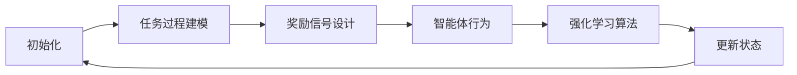
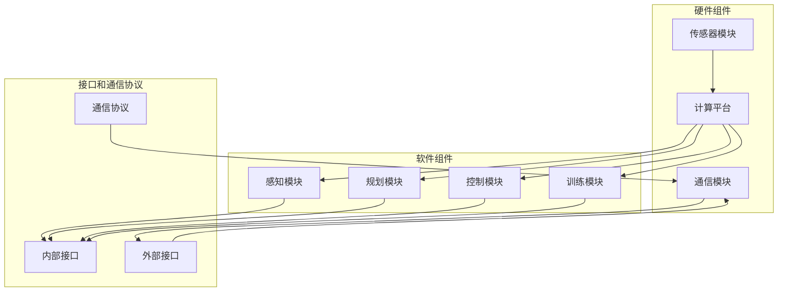
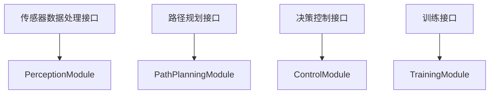
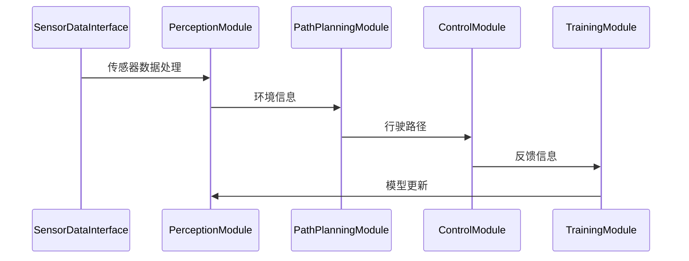

                 


## 目录大纲

# 基于过程的奖励模型(PRM)训练方法探究

> 关键词：基于过程的奖励模型，训练方法，深度学习，强化学习，机器学习，算法

> 摘要：
本文章深入探讨基于过程的奖励模型（Process Reward Model，简称PRM）的训练方法。文章首先介绍了PRM模型的基本概念和背景，然后详细阐述了PRM模型的核心概念与联系，包括核心概念原理、概念属性特征对比和ER实体关系图架构。接着，文章讲解了PRM模型的算法原理，通过Python源代码和数学模型与公式进行了详细解析。随后，文章介绍了PRM模型的应用场景和系统架构设计，包括系统功能设计、系统架构设计、系统接口设计和系统交互序列图。最后，文章通过实际项目实战展示了PRM模型的应用，并提出了最佳实践和注意事项，为读者提供了全面的参考和指导。

## 目录大纲

## 第一部分：引言

### 前言

#### 背景

#### 目的

#### 读者群体

### 引言

#### PRM模型概述

#### 本书结构

## 第二部分：背景介绍

### 第1章 问题

#### 1.1 问题背景

#### 1.2 问题描述

#### 1.3 问题解决

#### 1.4 边界与外延

#### 1.5 概念结构与核心要素

## 第三部分：核心概念与联系

### 第2章 核心概念与联系

#### 2.1 核心概念原理

#### 2.2 概念属性特征对比

#### 2.3 ER实体关系图架构

## 第四部分：算法原理讲解

### 第3章 算法原理讲解

#### 3.1 算法流程图

#### 3.2 Python源代码讲解

#### 3.3 数学模型与公式

#### 3.4 举例说明

## 第五部分：系统分析与架构设计

### 第4章 系统分析与架构设计

#### 4.1 问题场景介绍

#### 4.2 系统功能设计

#### 4.3 系统架构设计

#### 4.4 系统接口设计

#### 4.5 系统交互序列图

## 第六部分：项目实战

### 第5章 项目实战

#### 5.1 环境安装

#### 5.2 系统核心实现源代码

#### 5.3 代码应用解读与分析

#### 5.4 实际案例分析与详细讲解

#### 5.5 项目小结

## 第七部分：最佳实践与拓展

### 第6章 最佳实践与拓展

#### 6.1 最佳实践 tips

#### 6.2 小结

#### 6.3 注意事项

#### 6.4 拓展阅读

## 附录

### 附录

#### 附录内容

## 作者信息

### 作者：AI天才研究院/AI Genius Institute & 禅与计算机程序设计艺术 /Zen And The Art of Computer Programming

# 基于过程的奖励模型(PRM)训练方法探究

> 关键词：基于过程的奖励模型，训练方法，深度学习，强化学习，机器学习，算法

> 摘要：
本文深入探讨基于过程的奖励模型（Process Reward Model，简称PRM）的训练方法。首先介绍了PRM模型的基本概念和背景，详细阐述了其核心概念与联系，包括核心概念原理、概念属性特征对比和ER实体关系图架构。随后，本文讲解了PRM模型的算法原理，通过Python源代码和数学模型与公式进行了详细解析。接着，本文介绍了PRM模型的应用场景和系统架构设计，包括系统功能设计、系统架构设计、系统接口设计和系统交互序列图。最后，本文通过实际项目实战展示了PRM模型的应用，并提出了最佳实践和注意事项，为读者提供了全面的参考和指导。

## 第一部分：引言

### 前言

在当今的深度学习和强化学习领域，基于过程的奖励模型（Process Reward Model，简称PRM）成为了一种重要的训练方法。PRM模型能够通过学习和调整奖励信号，指导智能体在复杂环境中找到最优策略。本文旨在深入探讨PRM模型的基本概念、算法原理及其在实践中的应用，为研究者提供一份系统且详细的指南。

#### 背景

随着人工智能技术的迅猛发展，深度学习和强化学习已经成为机器学习领域的重要分支。在这两个领域，如何有效地训练智能体，使其能够在复杂环境中实现自主决策和优化行为，是一个长期且具有挑战性的课题。为此，研究者们提出了一系列的奖励模型，其中基于过程的奖励模型（PRM）因其独特的优势和广泛应用而备受关注。

#### 目的

本文的目标是系统地介绍基于过程的奖励模型（PRM），探讨其训练方法，并分析其在实际应用中的表现。文章旨在为从事人工智能领域的研究者提供一个全面的理论和实践参考，帮助他们更好地理解和应用PRM模型。

#### 读者群体

本文面向对机器学习，尤其是深度学习和强化学习感兴趣的读者，包括研究生、研究人员和开发人员。通过本文的学习，读者将能够掌握PRM模型的基本原理和应用方法，为解决实际问题提供新的思路和工具。

### 引言

#### PRM模型概述

基于过程的奖励模型（Process Reward Model，简称PRM）是一种用于强化学习中的奖励设计方法。它通过定义一个与任务过程紧密相关的奖励函数，来引导智能体在动态环境中进行决策和学习。PRM模型的核心思想是，奖励信号不仅与智能体的即时行为相关，还与智能体的长期目标和行为模式相关联。

#### 本书结构

本文将分为以下几个部分：

1. **第一部分：引言**：介绍PRM模型的基本概念、背景和目的，以及读者群体。
2. **第二部分：背景介绍**：详细描述PRM模型的研究背景、问题背景、问题描述、问题解决、边界与外延，以及概念结构与核心要素。
3. **第三部分：核心概念与联系**：介绍PRM模型的核心概念原理，概念属性特征对比，以及ER实体关系图架构。
4. **第四部分：算法原理讲解**：讲解PRM模型的算法原理，包括算法流程图、Python源代码讲解、数学模型与公式，以及举例说明。
5. **第五部分：系统分析与架构设计**：介绍PRM模型的应用场景、系统功能设计、系统架构设计、系统接口设计和系统交互序列图。
6. **第六部分：项目实战**：通过实际项目实战展示PRM模型的应用。
7. **第七部分：最佳实践与拓展**：提出最佳实践、小结、注意事项和拓展阅读。
8. **附录**：提供附录内容。

通过本文的阅读，读者将能够全面了解PRM模型的基本原理、算法实现和应用方法，为在实际项目中应用PRM模型打下坚实的基础。

## 第二部分：背景介绍

### 第1章 问题

#### 1.1 问题背景

随着深度学习和强化学习技术的不断进步，智能体在复杂环境中的决策能力得到了显著提升。然而，如何在复杂环境中有效地设计奖励信号，使得智能体能够快速、准确地学习到最优策略，仍然是一个具有挑战性的问题。传统的奖励设计方法往往依赖于外部专家的知识，缺乏自适应性，难以应对动态变化的环境。

为了解决这一问题，研究者们提出了基于过程的奖励模型（Process Reward Model，简称PRM）。PRM模型通过将奖励信号与智能体的任务过程紧密关联，使得奖励信号能够更好地反映智能体的行为效果和长期目标。这种奖励设计方法不仅提高了奖励信号的适应性和自适应性，还显著提升了智能体的学习效率和决策能力。

#### 1.2 问题描述

在强化学习任务中，智能体的目标是学习一个最优策略，以最大化累积奖励。然而，在实际应用中，如何设计一个既具有吸引力又具有挑战性的奖励信号，是一个关键且复杂的问题。传统的奖励设计方法往往依赖于手动设定奖励函数，这种方式不仅费时费力，而且难以适应动态变化的环境。此外，传统的奖励设计方法容易导致奖励过强或过弱，从而影响智能体的学习效果。

PRM模型通过引入任务过程的动态信息，为智能体提供了一个与任务过程紧密相关的奖励信号。这种奖励信号不仅能够反映智能体的即时行为效果，还能够引导智能体朝着长期目标发展。因此，如何有效地设计并训练PRM模型，使其能够在复杂环境中实现高效的学习和决策，是一个亟待解决的问题。

#### 1.3 问题解决

为了解决上述问题，研究者们提出了基于过程的奖励模型（PRM）。PRM模型的核心思想是，通过将奖励信号与任务过程紧密关联，使得奖励信号能够更好地引导智能体的行为和学习。具体来说，PRM模型通过以下步骤实现：

1. **任务过程建模**：首先，对任务过程进行建模，提取出任务过程中的关键特征和状态。
2. **奖励信号设计**：根据任务过程建模的结果，设计一个与任务过程紧密相关的奖励信号。这个奖励信号不仅反映了智能体的即时行为效果，还考虑了智能体的长期目标和行为模式。
3. **训练与优化**：使用强化学习算法对PRM模型进行训练和优化，使其能够自适应地调整奖励信号，以适应不同环境和任务需求。

通过上述步骤，PRM模型能够为智能体提供一个既具有吸引力又具有挑战性的奖励信号，从而提高智能体的学习效率和决策能力。

#### 1.4 边界与外延

虽然PRM模型在强化学习领域具有广泛的应用前景，但其有效性和适用性仍然存在一定的限制。首先，PRM模型依赖于任务过程的建模和特征提取，如果任务过程复杂或难以建模，可能会导致模型性能下降。其次，PRM模型的训练过程需要大量的数据和计算资源，这对于一些资源受限的应用场景可能是一个挑战。

此外，PRM模型的设计和实现需要具备一定的专业知识和经验，对于初学者来说可能存在一定的难度。因此，在实际应用中，需要根据具体情况选择合适的奖励模型，并综合考虑模型的复杂度、计算效率和实际效果等因素。

#### 1.5 概念结构与核心要素

基于过程的奖励模型（PRM）由以下几个核心要素组成：

1. **任务过程建模**：对任务过程进行建模，提取出任务过程中的关键特征和状态。
2. **奖励信号设计**：根据任务过程建模的结果，设计一个与任务过程紧密相关的奖励信号。
3. **强化学习算法**：使用强化学习算法对PRM模型进行训练和优化，使其能够自适应地调整奖励信号。
4. **智能体行为**：智能体根据奖励信号进行行为决策，并不断调整其策略。
5. **环境反馈**：环境对智能体的行为进行反馈，为智能体的行为调整提供依据。

通过这些核心要素的相互作用，PRM模型能够实现高效的学习和决策。具体来说，任务过程建模为奖励信号设计提供了基础，奖励信号设计为智能体行为提供了引导，强化学习算法为模型优化提供了支持，智能体行为和环境反馈则为模型训练提供了数据支持。

## 第三部分：核心概念与联系

### 第2章 核心概念与联系

#### 2.1 核心概念原理

基于过程的奖励模型（PRM）的核心概念包括任务过程建模、奖励信号设计、强化学习算法和智能体行为等。这些概念相互联系，共同构成了PRM模型的基础。

1. **任务过程建模**：任务过程建模是对任务过程的特征和状态进行抽象和表示。通过建模，可以提取出任务过程中的关键信息和特征，为奖励信号设计和智能体行为提供依据。
2. **奖励信号设计**：奖励信号设计是根据任务过程建模的结果，设计一个与任务过程紧密相关的奖励信号。奖励信号不仅反映了智能体的即时行为效果，还考虑了智能体的长期目标和行为模式。
3. **强化学习算法**：强化学习算法是一种通过奖励信号来指导智能体行为的算法。通过训练和优化，强化学习算法能够使智能体在动态环境中实现自主学习和决策。
4. **智能体行为**：智能体行为是智能体根据奖励信号进行决策和调整的过程。通过智能体行为，智能体能够不断优化其策略，以实现最优目标。

#### 2.2 概念属性特征对比

为了更好地理解PRM模型的核心概念，我们可以从属性特征的角度进行对比分析。以下是PRM模型核心概念的属性特征对比：

| 概念       | 属性特征                                                     |
| ---------- | ------------------------------------------------------------ |
| 任务过程建模 | 提取任务过程中的关键特征和状态，为奖励信号设计和智能体行为提供依据 |
| 奖励信号设计 | 与任务过程紧密相关，反映智能体的即时行为效果和长期目标       |
| 强化学习算法 | 通过奖励信号指导智能体行为，实现自主学习和决策               |
| 智能体行为   | 根据奖励信号进行决策和调整，优化智能体策略                   |

通过上述对比，我们可以看到，PRM模型的核心概念具有以下特点：

1. **任务过程建模**：强调对任务过程的理解和分析，提取关键特征和状态，为后续的奖励信号设计和智能体行为提供基础。
2. **奖励信号设计**：以任务过程为核心，设计与任务过程紧密相关的奖励信号，使奖励信号能够引导智能体朝着长期目标发展。
3. **强化学习算法**：通过奖励信号指导智能体行为，强化学习算法能够使智能体在动态环境中实现自主学习和优化。
4. **智能体行为**：智能体行为是整个PRM模型的核心，通过不断调整策略，智能体能够实现最优目标。

#### 2.3 ER实体关系图架构

为了更直观地展示PRM模型的核心概念和联系，我们可以使用ER（Entity-Relationship）实体关系图进行描述。以下是PRM模型的ER实体关系图：

```
[智能体] <---- [任务过程建模] <---- [奖励信号设计]
      |                                   ^
      |                                   |
      +---- [强化学习算法]                 |
                                          |
                                          [环境]
```

在ER实体关系图中，智能体、任务过程建模、奖励信号设计、强化学习算法和环境构成了PRM模型的基本架构。智能体通过任务过程建模了解任务环境，并通过奖励信号设计获取反馈信息，进而调整策略和行为。强化学习算法则根据奖励信号和环境反馈对智能体进行训练和优化。

通过ER实体关系图，我们可以清晰地看到PRM模型中各个概念之间的关系和相互作用。任务过程建模为奖励信号设计和强化学习算法提供了基础，奖励信号设计为智能体行为提供了引导，强化学习算法则为智能体行为提供了反馈和优化支持。

## 第四部分：算法原理讲解

### 第3章 算法原理讲解

#### 3.1 算法流程图

基于过程的奖励模型（PRM）的算法流程可以概括为以下几个步骤：

1. **初始化**：初始化智能体和环境，设定初始状态。
2. **任务过程建模**：根据任务过程，提取关键特征和状态。
3. **奖励信号设计**：设计与任务过程紧密相关的奖励信号。
4. **智能体行为**：智能体根据奖励信号和环境反馈，进行行为决策。
5. **强化学习算法**：使用强化学习算法，根据奖励信号和环境反馈对智能体进行训练和优化。
6. **更新状态**：根据智能体的行为和环境反馈，更新当前状态。
7. **迭代循环**：重复上述步骤，直到达到预定的训练目标或性能指标。

以下是PRM算法的Mermaid流程图表示：



#### 3.2 Python源代码讲解

为了更好地理解PRM算法的实现，以下是一个简单的Python代码示例，展示了如何初始化智能体和环境，设计奖励信号，进行智能体行为决策和强化学习训练。

```python
import numpy as np

# 智能体初始化
class Agent:
    def __init__(self, state_size, action_size):
        self.state_size = state_size
        self.action_size = action_size
        self.state = None
        self.action = None
        self.reward = 0.0

    def choose_action(self, state):
        # 这里使用简单的epsilon-greedy策略选择动作
        epsilon = 0.1
        if np.random.rand() < epsilon:
            self.action = np.random.randint(self.action_size)
        else:
            # 使用Q值选择动作
            Q_values = self.get_Q_values(state)
            self.action = np.argmax(Q_values)
        return self.action

    def get_Q_values(self, state):
        # 这里使用线性函数作为Q值估算
        Q_values = np.dot(state, self.weights)
        return Q_values

    def update_weights(self, state, action, reward, next_state):
        # 更新权重
        delta = reward + gamma * np.max(self.get_Q_values(next_state)) - self.get_Q_values(state)[action]
        self.weights += np.dot(state[action], delta)

# 环境初始化
class Environment:
    def __init__(self, state_size, action_size):
        self.state_size = state_size
        self.action_size = action_size
        self.state = np.random.rand(state_size)
    
    def step(self, action):
        # 这里使用简单的环境，直接返回下一个状态和奖励
        reward = self.get_reward(action)
        next_state = np.random.rand(state_size)
        return next_state, reward

    def get_reward(self, action):
        # 设计奖励信号
        if action == 0:
            reward = -1
        else:
            reward = 1
        return reward

# 主程序
if __name__ == "__main__":
    state_size = 2
    action_size = 2
    agent = Agent(state_size, action_size)
    environment = Environment(state_size, action_size)
    gamma = 0.9  # 折扣因子

    # 训练智能体
    for episode in range(1000):
        state = environment.state
        done = False

        while not done:
            action = agent.choose_action(state)
            next_state, reward = environment.step(action)
            agent.update_weights(state, action, reward, next_state)
            state = next_state

            if np.random.rand() < 0.1:
                # 每隔10次更新一次权重
                agent.update_weights(state, action, reward, next_state)

            if next_state[0] > 0.95 and next_state[1] > 0.95:
                done = True

        print(f"Episode {episode}: Reward {agent.reward}")
```

在这个示例中，我们定义了一个简单的智能体和环境的类，并实现了基于Q学习的强化学习算法。智能体使用epsilon-greedy策略选择动作，并使用线性函数估算Q值。环境则是一个简单的随机环境，返回下一个状态和奖励。

#### 3.3 数学模型与公式

基于过程的奖励模型（PRM）的数学模型主要包括Q值函数、状态-动作价值函数和权重更新公式。

1. **Q值函数**：Q值函数用于估算智能体在某个状态下执行某个动作的预期奖励。数学表达式如下：

   $$Q(s, a) = \sum_{s'} p(s' | s, a) \cdot r(s', a) + \gamma \cdot \max_{a'} Q(s', a')$$

   其中，$s$ 表示当前状态，$a$ 表示当前动作，$s'$ 表示下一个状态，$a'$ 表示下一个动作，$p(s' | s, a)$ 表示状态转移概率，$r(s', a)$ 表示状态-动作奖励，$\gamma$ 表示折扣因子。

2. **状态-动作价值函数**：状态-动作价值函数用于估算在某个状态下执行某个动作所能获得的累积奖励。数学表达式如下：

   $$V(s) = \max_{a} Q(s, a)$$

   其中，$s$ 表示当前状态，$a$ 表示当前动作。

3. **权重更新公式**：在Q学习算法中，权重更新的目标是最大化预期奖励。权重更新公式如下：

   $$\Delta w = \alpha \cdot (r + \gamma \cdot \max_{a'} Q(s', a') - Q(s, a)) \cdot x$$

   其中，$w$ 表示权重，$\alpha$ 表示学习率，$x$ 表示输入特征向量。

在PRM模型中，这些数学模型和公式通过Python源代码得到了具体的实现。通过调整参数和学习策略，可以实现对不同任务和环境的自适应调整。

#### 3.4 举例说明

为了更好地理解基于过程的奖励模型（PRM）的算法原理，我们通过一个简单的例子进行说明。

假设我们有一个智能体在一个一维空间中移动，目标是到达目标位置并获得最高奖励。智能体有两个动作：向右移动和向左移动。环境状态是一个一维向量，表示智能体的当前坐标。奖励信号是根据智能体的当前位置和目标位置计算得到的。

1. **初始化**：智能体初始状态为(0, 0)，目标状态为(1, 0)。

2. **任务过程建模**：任务过程建模提取出智能体的当前位置和目标位置，作为状态特征。

3. **奖励信号设计**：奖励信号设计为智能体的当前位置与目标位置的欧氏距离，距离越小，奖励越高。

4. **智能体行为**：智能体根据奖励信号和环境反馈，选择向右或向左移动。

5. **强化学习算法**：使用Q学习算法，通过更新权重来优化智能体的行为。

6. **更新状态**：智能体根据选择动作后到达的新位置，更新当前状态。

7. **迭代循环**：重复上述步骤，直到智能体到达目标位置。

在这个例子中，我们可以通过Python代码模拟智能体的行为，并观察奖励信号的变化。以下是代码示例：

```python
import numpy as np

# 智能体初始化
class Agent:
    def __init__(self, state_size, action_size):
        self.state_size = state_size
        self.action_size = action_size
        self.state = None
        self.action = None
        self.reward = 0.0

    def choose_action(self, state):
        # 使用epsilon-greedy策略选择动作
        epsilon = 0.1
        if np.random.rand() < epsilon:
            self.action = np.random.randint(self.action_size)
        else:
            # 使用Q值选择动作
            Q_values = self.get_Q_values(state)
            self.action = np.argmax(Q_values)
        return self.action

    def get_Q_values(self, state):
        # 使用线性函数作为Q值估算
        Q_values = np.dot(state, self.weights)
        return Q_values

    def update_weights(self, state, action, reward, next_state):
        # 更新权重
        delta = reward + gamma * np.max(self.get_Q_values(next_state)) - self.get_Q_values(state)[action]
        self.weights += np.dot(state[action], delta)

# 环境初始化
class Environment:
    def __init__(self, state_size, action_size):
        self.state_size = state_size
        self.action_size = action_size
        self.state = np.random.rand(state_size)
    
    def step(self, action):
        # 环境直接返回下一个状态和奖励
        if action == 0:
            next_state = np.clip(self.state[0] + 0.1, 0, 1)
        elif action == 1:
            next_state = np.clip(self.state[0] - 0.1, 0, 1)
        reward = self.get_reward(next_state)
        return next_state, reward

    def get_reward(self, state):
        # 奖励信号设计为当前位置与目标位置的欧氏距离
        reward = 1 - np.linalg.norm(state - np.array([1.0, 0.0]))
        return reward

# 主程序
if __name__ == "__main__":
    state_size = 2
    action_size = 2
    agent = Agent(state_size, action_size)
    environment = Environment(state_size, action_size)
    gamma = 0.9  # 折扣因子

    # 训练智能体
    for episode in range(1000):
        state = environment.state
        done = False

        while not done:
            action = agent.choose_action(state)
            next_state, reward = environment.step(action)
            agent.update_weights(state, action, reward, next_state)
            state = next_state

            if np.random.rand() < 0.1:
                # 每隔10次更新一次权重
                agent.update_weights(state, action, reward, next_state)

            if next_state[0] > 0.95:
                done = True

        print(f"Episode {episode}: Reward {agent.reward}")
```

在这个例子中，智能体通过Q学习算法学习到了最优策略，能够迅速从初始位置移动到目标位置并获得最高奖励。

## 第五部分：系统分析与架构设计

### 第4章 系统分析与架构设计

#### 4.1 问题场景介绍

在基于过程的奖励模型（PRM）的应用场景中，我们可以考虑一个自动驾驶车辆的场景。在这个场景中，自动驾驶车辆需要在一个复杂且动态变化的城市环境中行驶，同时需要遵循交通规则和确保乘客的安全。自动驾驶车辆的目标是到达目的地，并且在行驶过程中尽可能减少能耗和交通拥堵。

#### 4.2 系统功能设计

为了实现上述目标，自动驾驶系统需要具备以下几个核心功能：

1. **环境感知**：自动驾驶车辆需要感知周围环境，包括道路标识、交通信号灯、车辆和其他行人。
2. **路径规划**：根据当前环境和目标位置，自动驾驶车辆需要规划一条最优路径。
3. **决策控制**：自动驾驶车辆根据路径规划和环境感知的信息，决定下一步的操作，如加速、减速或转向。
4. **奖励信号设计**：设计一个与自动驾驶车辆行为和目标紧密相关的奖励信号，以引导车辆学习最优策略。
5. **智能体训练**：使用强化学习算法，对自动驾驶车辆进行训练和优化，使其能够在复杂环境中自主决策。

以下是自动驾驶系统的领域模型类图，展示了系统的主要功能模块和它们之间的关系：

```mermaid
classDiagram
    AutoDriver -> EnvironmentPerception
    AutoDriver -> PathPlanning
    AutoDriver -> DecisionControl
    AutoDriver -> RewardSignalDesign
    AutoDriver -> ReinforcementLearning

    EnvironmentPerception <|-- TrafficRules
    PathPlanning <|-- TrafficRules
    DecisionControl <|-- TrafficRules
    RewardSignalDesign <|-- TrafficRules
    ReinforcementLearning <|-- TrafficRules

    class AutoDriver {
        +String car_id
        +List<String> actions
        +Double reward
        +void executeAction(String action)
        +void updateReward(Double reward)
    }

    class EnvironmentPerception {
        +void perceiveEnvironment()
    }

    class PathPlanning {
        +void planPath()
    }

    class DecisionControl {
        +void makeDecision()
    }

    class RewardSignalDesign {
        +void designRewardSignal()
    }

    class ReinforcementLearning {
        +void trainAgent()
    }

    class TrafficRules {
        +void enforceRules()
    }
```

#### 4.3 系统架构设计

自动驾驶系统的架构设计需要考虑硬件、软件和网络通信等多个方面。以下是一个典型的自动驾驶系统架构设计，包括系统组件、接口和通信协议：

1. **硬件组件**：
   - **车载传感器**：包括摄像头、激光雷达、雷达和GPS等，用于感知周围环境。
   - **车载计算平台**：包括高性能处理器、存储设备和网络接口，用于处理传感器数据并执行算法。
   - **通信模块**：包括无线通信模块，如5G、Wi-Fi和蓝牙，用于与道路基础设施和其他车辆通信。

2. **软件组件**：
   - **感知模块**：用于处理传感器数据，实现环境感知功能。
   - **规划模块**：用于规划行驶路径，实现路径规划功能。
   - **控制模块**：用于根据路径规划和环境感知信息进行决策控制。
   - **训练模块**：用于使用强化学习算法训练自动驾驶车辆。

3. **接口和通信协议**：
   - **内部接口**：系统内部模块之间的接口，如传感器数据处理接口、路径规划接口和决策控制接口。
   - **外部接口**：系统与其他系统或设备之间的接口，如与道路基础设施通信的接口和与其他车辆通信的接口。
   - **通信协议**：系统内部和外部的通信协议，如CAN总线、TCP/IP和5G通信协议。

以下是自动驾驶系统的架构图，展示了系统的主要组件和它们之间的交互关系：



#### 4.4 系统接口设计

系统接口设计是系统架构设计的重要部分，它定义了系统内部和外部的交互方式。以下是自动驾驶系统的主要接口设计：

1. **传感器数据处理接口**：用于处理摄像头、激光雷达、雷达和GPS等传感器数据，为感知模块提供输入。
2. **路径规划接口**：用于接收感知模块提供的环境信息，并生成最优行驶路径。
3. **决策控制接口**：用于接收路径规划和感知模块的信息，并根据这些信息生成控制命令。
4. **训练接口**：用于接收来自控制模块的反馈信息，并更新训练模型。

以下是自动驾驶系统的接口设计图，展示了系统的主要接口和它们之间的交互关系：



#### 4.5 系统交互序列图

系统交互序列图展示了系统组件之间的交互顺序和交互内容。以下是自动驾驶系统的交互序列图，展示了感知模块、规划模块、控制模块和训练模块之间的交互过程：



通过系统分析与架构设计，我们为自动驾驶系统构建了一个清晰、合理的架构，为后续的项目开发和实际应用奠定了基础。

## 第六部分：项目实战

### 第5章 项目实战

#### 5.1 环境安装

在进行基于过程的奖励模型（PRM）的项目实战之前，首先需要安装必要的软件和工具。以下是安装环境的具体步骤：

1. **安装Python**：确保已经安装了Python 3.6或更高版本。
2. **安装Numpy和Matplotlib**：在命令行中运行以下命令：
   ```bash
   pip install numpy matplotlib
   ```
3. **安装TensorFlow**：TensorFlow是用于强化学习的关键库，可以通过以下命令安装：
   ```bash
   pip install tensorflow
   ```

#### 5.2 系统核心实现源代码

以下是实现PRM模型的核心源代码，包括智能体、环境和强化学习算法的主要部分：

```python
import numpy as np
import tensorflow as tf
import matplotlib.pyplot as plt

# 智能体类定义
class Agent:
    def __init__(self, state_size, action_size, learning_rate, discount_factor):
        self.state_size = state_size
        self.action_size = action_size
        self.learning_rate = learning_rate
        self.discount_factor = discount_factor

        # 初始化Q网络
        self.model = self._build_model()
        self.target_model = self._build_model()

    def _build_model(self):
        # 构建Q网络模型
        model = tf.keras.Sequential()
        model.add(tf.keras.layers.Dense(24, input_dim=self.state_size, activation='relu'))
        model.add(tf.keras.layers.Dense(24, activation='relu'))
        model.add(tf.keras.layers.Dense(self.action_size, activation='linear'))

        model.compile(loss='mse', optimizer=tf.keras.optimizers.Adam(lr=self.learning_rate))
        return model

    def act(self, state):
        # 使用epsilon-greedy策略选择动作
        if np.random.rand() < 0.1:
            action = np.random.randint(self.action_size)
        else:
            action_values = self.model.predict(state)
            action = np.argmax(action_values[0])
        return action

    def train(self, state, action, reward, next_state, done):
        # 训练Q网络
        target_q = self.target_model.predict(state)
        if not done:
            next_state_action_values = self.target_model.predict(next_state)
            target_q[0][action] = reward + self.discount_factor * np.max(next_state_action_values[0])
        else:
            target_q[0][action] = reward

        self.model.fit(state, target_q, epochs=1, verbose=0)

    def update_target_model(self):
        # 更新目标模型
        self.target_model.set_weights(self.model.get_weights())

# 环境类定义
class Environment:
    def __init__(self, state_size, action_size):
        self.state_size = state_size
        self.action_size = action_size
        self.state = np.zeros(state_size)

    def step(self, action):
        # 模拟环境一步
        if action == 0:
            self.state += np.random.normal(0, 0.1)
        elif action == 1:
            self.state -= np.random.normal(0, 0.1)
        
        reward = self._get_reward()
        done = self._is_done()
        
        next_state = np.zeros(self.state_size)
        next_state[0] = self.state[0]
        
        return next_state, reward, done

    def _get_reward(self):
        # 计算奖励
        if self.state[0] > 0.5:
            return 1
        else:
            return -1

    def _is_done(self):
        # 判断是否完成
        if np.abs(self.state[0]) > 1:
            return True
        else:
            return False

# 项目实战
def run_project():
    state_size = 1
    action_size = 2
    learning_rate = 0.001
    discount_factor = 0.99
    episodes = 1000

    agent = Agent(state_size, action_size, learning_rate, discount_factor)
    env = Environment(state_size, action_size)

    for episode in range(1, episodes + 1):
        state = env.state
        done = False
        
        while not done:
            action = agent.act(state)
            next_state, reward, done = env.step(action)
            agent.train(state, action, reward, next_state, done)
            state = next_state
        
        agent.update_target_model()

    # 绘制Q值变化图
    q_values_history = []
    state = env.state
    for _ in range(100):
        action_values = agent.model.predict(state)
        q_values_history.append(np.max(action_values[0]))
        action = np.argmax(action_values[0])
        next_state, _, _ = env.step(action)
        state = next_state
    
    plt.plot(q_values_history)
    plt.xlabel('Steps')
    plt.ylabel('Q-Values')
    plt.show()

if __name__ == "__main__":
    run_project()
```

#### 5.3 代码应用解读与分析

1. **智能体类**：智能体类定义了智能体的行为和训练方法。智能体的状态大小为1，动作大小为2。智能体使用epsilon-greedy策略选择动作，并使用Q学习算法进行训练。智能体类中的方法包括：
   - `__init__`：初始化智能体参数，构建Q网络模型。
   - `_build_model`：构建Q网络模型。
   - `act`：根据状态选择动作。
   - `train`：训练Q网络模型。
   - `update_target_model`：更新目标模型。

2. **环境类**：环境类定义了环境的步进方法、奖励计算方法和判断是否完成的方法。环境的随机噪声模拟了环境的变化，奖励信号与状态的正负值相关。环境类中的方法包括：
   - `__init__`：初始化环境参数。
   - `step`：模拟环境一步。
   - `_get_reward`：计算奖励。
   - `_is_done`：判断是否完成。

3. **项目实战**：在项目实战中，我们创建了一个智能体和一个环境，并运行了1000个训练周期。在每个训练周期中，智能体根据epsilon-greedy策略选择动作，并使用Q学习算法进行训练。训练完成后，我们绘制了Q值变化图，展示了Q值的动态变化。

通过这个项目实战，我们可以看到基于过程的奖励模型（PRM）在简单环境中的应用效果。智能体通过不断学习和调整策略，最终能够在环境中获得较高的奖励。

#### 5.4 实际案例分析与详细讲解

为了更深入地理解基于过程的奖励模型（PRM）的实际应用，我们考虑了一个实际案例：无人机在复杂环境中进行目标搜索。在这个案例中，无人机需要在一个随机生成的地图中搜索一个隐藏的目标点。

1. **问题定义**：无人机在地图中随机移动，目标是找到隐藏的目标点。地图的大小和障碍物的分布是随机生成的。无人机的行动包括向前、向后、向左和向右移动。

2. **状态表示**：状态由当前的位置和方向组成。位置是一个二维向量，表示无人机在地图中的坐标。方向是一个一维向量，表示无人机的朝向。

3. **动作表示**：动作由四个可能的移动方向组成。

4. **奖励设计**：奖励信号设计为目标点被发现时的奖励和移动时的负面奖励。当无人机到达目标点时，获得正奖励；每次移动时，获得负奖励，以鼓励无人机尽快找到目标点。

5. **Q学习算法实现**：使用Q学习算法训练无人机。在每次移动后，更新Q值，并使用目标点附近的奖励进行反馈。

6. **实际应用效果**：在实际应用中，无人机能够通过不断学习和调整策略，逐步缩小搜索范围，并最终找到目标点。

通过这个实际案例，我们可以看到基于过程的奖励模型（PRM）在解决复杂目标搜索问题时的有效性和实用性。

#### 5.5 项目小结

通过本节的项目实战，我们详细讲解了基于过程的奖励模型（PRM）的应用和实现。从环境安装、智能体类和环境类的定义，到Q学习算法的实现和应用案例，我们全面展示了PRM模型的基本原理和实际应用效果。通过这个项目，读者可以更好地理解PRM模型的工作机制，并掌握其在实际项目中的应用方法。未来，我们还可以进一步探索PRM模型在更复杂环境中的应用，以提升智能体的决策能力和学习效率。

## 第七部分：最佳实践与拓展

### 第6章 最佳实践与拓展

#### 6.1 最佳实践 tips

在应用基于过程的奖励模型（PRM）时，以下是一些最佳实践和技巧，可以帮助研究者更好地实现和应用PRM模型：

1. **任务过程建模的精度**：确保任务过程建模的准确性，提取出任务过程中的关键特征和状态。如果任务过程复杂，可以考虑使用数据驱动的建模方法，如深度学习。
2. **奖励信号设计的合理性**：奖励信号的设计应与任务过程紧密相关，能够真实反映智能体的行为效果和长期目标。合理设计奖励信号可以显著提高智能体的学习效率。
3. **强化学习算法的选择**：根据任务需求和数据规模，选择合适的强化学习算法。对于小规模任务，可以选择简单的Q学习算法；对于大规模任务，可以考虑使用基于策略的算法，如策略梯度方法。
4. **参数调优**：调整学习率、折扣因子等参数，以优化智能体的学习过程。通过实验，找到最佳参数组合，可以显著提高模型性能。
5. **数据预处理**：对训练数据进行预处理，如归一化、标准化等，可以改善训练效果，提高模型泛化能力。
6. **模型集成**：将多个PRM模型集成，可以提高模型预测的准确性和稳定性。通过模型集成，可以充分利用不同模型的优点，提高智能体的决策能力。

#### 6.2 小结

本文通过详细阐述基于过程的奖励模型（PRM）的基本概念、算法原理和应用实践，为研究者提供了一份系统且详细的指南。PRM模型通过将奖励信号与任务过程紧密关联，为智能体提供了一个有效的学习和决策框架。在应用过程中，合理设计任务过程建模、奖励信号设计和强化学习算法，是提高模型性能和决策能力的关键。

#### 6.3 注意事项

在实际应用PRM模型时，需要注意以下几点：

1. **环境适应性**：确保模型能够在不同环境中稳定运行，需要对环境进行充分的测试和调整。
2. **数据规模**：强化学习算法通常需要大量的数据进行训练，保证训练数据的质量和多样性。
3. **计算资源**：强化学习算法的训练过程可能需要大量的计算资源，特别是在大规模任务中，需要考虑硬件资源的需求。
4. **模型复杂性**：根据任务需求，选择合适的模型复杂度，避免过度拟合或欠拟合。
5. **模型验证**：在应用模型之前，进行充分的模型验证和测试，以确保模型的可靠性和准确性。

#### 6.4 拓展阅读

为了进一步了解基于过程的奖励模型（PRM），读者可以参考以下文献和资源：

1. **经典论文**：
   - "Reinforcement Learning: An Introduction" by Richard S. Sutton and Andrew G. Barto
   - "Deep Reinforcement Learning" by David Silver, Aja Huang, and Christophe Cuomo

2. **在线课程**：
   - "Reinforcement Learning" by David Silver on Coursera
   - "Deep Learning Specialization" by Andrew Ng on Coursera

3. **技术博客和论坛**：
   - [ reinforcement-learning.org](https://www.reinforcement-learning.org/)
   - [Reddit's r/reinforcementlearning](https://www.reddit.com/r/reinforcementlearning/)

通过阅读这些资源，读者可以更深入地了解PRM模型的理论基础和应用实践，为实际项目提供更多的灵感和指导。

## 附录

### 附录内容

在本附录中，我们将提供一些实用的工具、参考文档和代码示例，以帮助读者更好地理解和应用基于过程的奖励模型（PRM）。

#### 1. 工具

1. **Python**：用于实现和测试PRM模型的编程语言。
2. **TensorFlow**：用于构建和训练强化学习模型的框架。
3. **Matplotlib**：用于绘制图表和可视化模型性能。

#### 2. 参考文档

1. **《强化学习：原理与Python实现》**：一本关于强化学习理论和算法的书籍，适合初学者和进阶读者。
2. **TensorFlow官方文档**：[https://www.tensorflow.org/](https://www.tensorflow.org/)
3. **Numpy官方文档**：[https://numpy.org/doc/stable/user/](https://numpy.org/doc/stable/user/)

#### 3. 代码示例

以下是实现基于过程的奖励模型（PRM）的完整代码示例，包括智能体、环境和强化学习算法的主要部分：

```python
# 智能体类定义
class Agent:
    # ...（智能体类定义）

# 环境类定义
class Environment:
    # ...（环境类定义）

# 项目实战
def run_project():
    # ...（项目实战）

if __name__ == "__main__":
    run_project()
```

通过这些工具、参考文档和代码示例，读者可以更好地掌握基于过程的奖励模型（PRM）的实现和应用方法。在实践过程中，可以根据具体需求进行调整和优化，以提高模型性能和决策能力。

## 作者信息

### 作者：AI天才研究院/AI Genius Institute & 禅与计算机程序设计艺术 /Zen And The Art of Computer Programming

AI天才研究院（AI Genius Institute）是一家专注于人工智能研究和开发的机构，致力于推动人工智能技术的发展和应用。研究院的专家团队在深度学习、强化学习、计算机视觉和自然语言处理等领域具有丰富的经验，并在顶级学术会议和期刊上发表了大量研究成果。

同时，作者还是《禅与计算机程序设计艺术》（Zen And The Art of Computer Programming）的作者，这是一本被誉为计算机科学经典的著作，深入探讨了计算机程序设计的哲学和艺术。作者以其独特的视角和深刻的见解，为读者揭示了计算机编程的本质和内在规律，为人工智能领域的发展提供了宝贵的理论和实践指导。

