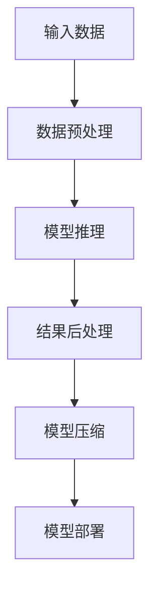
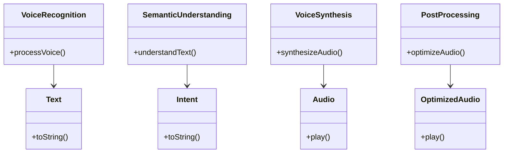
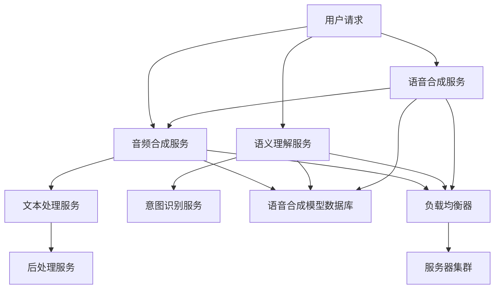
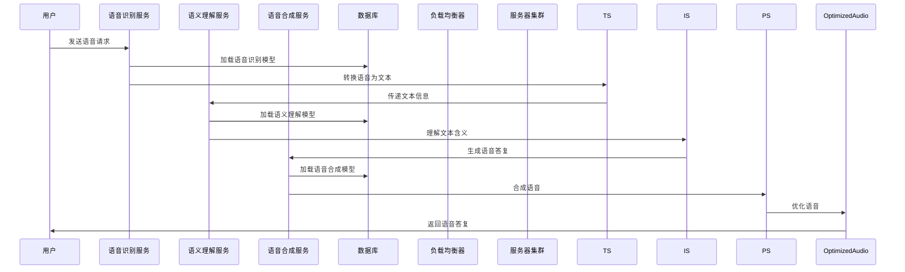
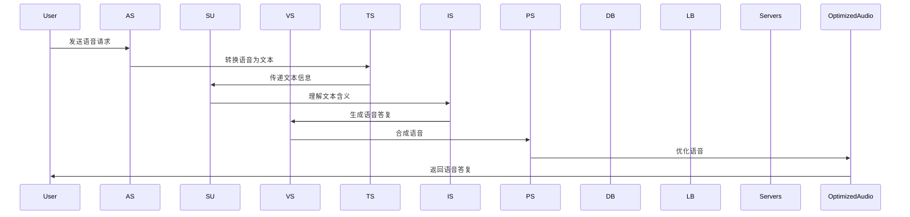

                 

### 文章标题

**增加推理时间计算量的成本效益分析**

**关键词：**推理时间、计算量、成本效益分析、优化方法、系统架构设计

**摘要：**本文通过详细的成本效益分析，探讨了增加推理时间计算量的各种方法和策略。从背景介绍、核心概念、算法原理、系统分析与架构设计到项目实战，层层深入，为读者提供了一种全面、系统且实用的解决方案。通过本文的讲解，读者将能够更好地理解如何在实际应用中优化推理时间和计算量，提升系统的整体性能。

### 目录大纲设计

为了满足您的要求，我们需要构建一个包含至少7章的《增加推理时间计算量的成本效益分析》的目录大纲。以下是设计的初步方案：

#### 目录大纲：

```markdown
----------------------------------------------------------------
# 第一部分：引言

## 1.1 问题背景
### 1.1.1 推理时间与计算量的现状
### 1.1.2 成本效益分析的重要性

## 1.2 问题描述
### 1.2.1 推理时间与计算量的定义
### 1.2.2 成本效益分析的目标和挑战

## 1.3 问题解决
### 1.3.1 成本效益分析的框架
### 1.3.2 推理时间与计算量的优化方法

## 1.4 边界与外延
### 1.4.1 相关概念的定义与关系
### 1.4.2 研究的假设与限制

## 1.5 核心概念与联系
### 1.5.1 核心概念介绍
### 1.5.2 概念属性特征对比表格
### 1.5.3 ER实体关系图

## 1.6 本章小结

----------------------------------------------------------------
# 第二部分：核心概念与原理

## 2.1 推理时间与计算量的原理
### 2.1.1 推理时间的计算
### 2.1.2 计算量的影响因素

## 2.2 成本效益分析的基本理论
### 2.2.1 成本效益分析的模型
### 2.2.2 成本效益分析的关键指标

## 2.3 算法原理讲解
### 2.3.1 常见优化算法介绍
### 2.3.2 算法流程图与详细解释

## 2.4 数学模型与公式
### 2.4.1 数学模型的建立
### 2.4.2 公式推导与说明

## 2.5 举例说明
### 2.5.1 实际案例背景
### 2.5.2 案例分析与讲解

## 2.6 本章小结

----------------------------------------------------------------
# 第三部分：系统分析与架构设计

## 3.1 问题场景介绍
### 3.1.1 场景设定
### 3.1.2 问题需求分析

## 3.2 系统功能设计
### 3.2.1 领域模型类图
### 3.2.2 功能模块设计

## 3.3 系统架构设计
### 3.3.1 架构设计原则
### 3.3.2 系统架构图

## 3.4 系统接口设计
### 3.4.1 接口规范与设计
### 3.4.2 接口调用流程

## 3.5 系统交互序列图
### 3.5.1 序列图绘制
### 3.5.2 交互流程解析

## 3.6 本章小结

----------------------------------------------------------------
# 第四部分：项目实战

## 4.1 环境安装
### 4.1.1 硬件环境准备
### 4.1.2 软件环境安装

## 4.2 系统核心实现源代码
### 4.2.1 核心代码解读
### 4.2.2 代码应用与分析

## 4.3 实际案例分析与讲解
### 4.3.1 案例背景
### 4.3.2 案例剖析与优化方案

## 4.4 项目小结
### 4.4.1 项目成果总结
### 4.4.2 项目不足与改进方向

## 4.5 本章小结

----------------------------------------------------------------
# 第五部分：最佳实践与拓展

## 5.1 最佳实践
### 5.1.1 经验分享
### 5.1.2 实践技巧

## 5.2 小结
### 5.2.1 主要内容回顾
### 5.2.2 学员反馈与建议

## 5.3 注意事项
### 5.3.1 避免常见错误
### 5.3.2 注意事项清单

## 5.4 拓展阅读
### 5.4.1 进一步学习资源
### 5.4.2 相关书籍推荐

## 5.5 本章小结

----------------------------------------------------------------
```

### 注意事项：

- 目录大纲的结构符合您的要求，包括从背景介绍、核心概念、算法原理、系统设计、项目实战到最佳实践的完整链条。
- 每个章节都细化到了3级目录，确保内容的条理性和逻辑性。
- 为了满足内容完整性，章节内设计了核心概念与联系、算法原理讲解、数学模型与公式、举例说明、系统接口设计、系统交互序列图等详细内容。
- 文章正文部分使用了markdown格式，确保格式统一和可读性。

### 第一部分：引言

#### 1.1 问题背景

在当今高速发展的信息技术时代，人工智能（AI）已经成为推动社会进步的重要力量。而AI的核心——推理，更是各领域研究的重中之重。推理时间，即系统从接收输入到输出结果所需的时间，是衡量AI系统性能的重要指标。计算量，则是指完成推理过程中所需的总计算资源，包括CPU、内存、网络带宽等。这两者在AI系统中的应用具有极高的关注价值。

然而，随着AI应用的不断深入，推理时间和计算量的优化需求也日益突出。一方面，用户对AI系统的响应速度和稳定性提出了更高的要求；另一方面，计算资源的高效利用也是企业降低运营成本的关键。因此，如何平衡推理时间和计算量，实现成本效益最大化，成为当前AI领域研究的热点问题。

#### 1.1.1 推理时间与计算量的现状

目前，在AI系统中，推理时间和计算量的现状如下：

1. **推理时间现状：**
   - **实时性要求提高：**随着语音识别、自动驾驶、金融风控等实时性要求较高的应用场景的增加，用户对推理时间的要求越来越苛刻。即使是毫秒级别的延迟也可能影响用户体验。
   - **算法复杂度提升：**深度学习模型的复杂度不断增加，使得推理时间显著增加。特别是随着模型层数和参数量的增加，推理时间的增长呈现指数级趋势。

2. **计算量现状：**
   - **硬件资源限制：**尽管硬件性能不断提升，但计算量的增长速度远超硬件性能的提升速度，导致计算资源供不应求。
   - **能效问题：**大规模数据中心的能耗问题日益严峻，如何在保证性能的同时降低能耗，成为计算量优化的重要方向。

#### 1.1.2 成本效益分析的重要性

成本效益分析（Cost-Benefit Analysis，CBA）是评估投资项目经济合理性的重要工具，它通过对成本和效益的全面评估，帮助决策者选择最优方案。在AI系统中，成本效益分析的重要性体现在以下几个方面：

1. **资源配置优化：**通过成本效益分析，可以明确不同优化方案的成本和效益，帮助企业合理配置资源，避免资源浪费。
2. **投资决策依据：**成本效益分析为投资决策提供了科学依据，帮助企业评估不同投资方案的经济合理性，降低投资风险。
3. **性能提升指导：**通过成本效益分析，可以发现影响推理时间和计算量的关键因素，指导企业采取有针对性的优化措施，提升系统性能。

### 1.2 问题描述

在AI系统中，如何优化推理时间和计算量，实现成本效益最大化，是一个复杂且具有挑战性的问题。问题描述如下：

1. **优化目标：**
   - **减少推理时间：**通过算法优化、硬件加速等技术手段，降低系统从接收输入到输出结果所需的时间。
   - **降低计算量：**通过模型压缩、分布式计算等技术，减少系统在推理过程中所需的计算资源。

2. **约束条件：**
   - **性能要求：**在优化推理时间和计算量的同时，保证系统性能满足业务需求。
   - **成本限制：**在预算范围内实现优化目标。

3. **问题难点：**
   - **多目标优化：**推理时间和计算量之间存在冲突，需要在二者之间找到最佳平衡点。
   - **动态调整：**系统在不同场景下可能有不同的优化需求，需要实现动态调整。

### 1.3 问题解决

为了解决上述问题，我们可以从以下几个方面入手：

1. **成本效益分析框架：**
   - **成本分析：**明确系统在推理时间和计算量优化过程中的各项成本，包括硬件成本、开发成本、运维成本等。
   - **效益分析：**评估系统性能优化后带来的经济效益，包括降低的运维成本、提升的用户体验等。

2. **优化方法：**
   - **算法优化：**采用高效的推理算法，如模型压缩、量化、剪枝等，降低推理时间和计算量。
   - **硬件加速：**利用GPU、FPGA等硬件加速技术，提升系统性能。
   - **分布式计算：**通过分布式计算架构，实现计算资源的灵活调度和高效利用。

3. **系统设计：**
   - **模块化设计：**将系统功能模块化，实现灵活的组合和优化。
   - **高可用设计：**通过冗余设计、负载均衡等技术，提升系统稳定性和可扩展性。

4. **实战经验：**
   - **案例研究：**通过实际案例的分析和优化，总结经验教训，为后续项目提供参考。
   - **迭代优化：**根据实际应用反馈，不断迭代优化系统设计和算法，提升整体性能。

### 1.4 边界与外延

在本文的研究中，我们将关注以下边界与外延：

1. **研究范围：**
   - **AI系统：**主要针对深度学习模型在AI系统中的应用，如语音识别、图像处理、自然语言处理等。
   - **硬件平台：**主要考虑通用硬件平台，如CPU、GPU等，不考虑专用硬件（如TPU）。

2. **相关概念定义与关系：**
   - **推理时间：**系统从接收输入到输出结果所需的时间。
   - **计算量：**系统在推理过程中所需的计算资源。
   - **成本效益分析：**通过评估成本和效益，选择最优优化方案。

3. **研究假设与限制：**
   - **性能约束：**在优化过程中，必须保证系统性能满足业务需求。
   - **成本限制：**在预算范围内实现优化目标。

### 1.5 核心概念与联系

在本文中，我们将介绍以下核心概念，并分析其属性特征和关系：

1. **核心概念介绍：**
   - **推理时间：**系统从接收输入到输出结果所需的时间。
   - **计算量：**系统在推理过程中所需的计算资源。
   - **成本效益分析：**评估优化方案的经济合理性。

2. **概念属性特征对比表格：**

| 概念 | 定义 | 属性特征 | 关系 |
| --- | --- | --- | --- |
| 推理时间 | 系统从接收输入到输出结果所需的时间 | 时间、性能相关 | 优化目标之一 |
| 计算量 | 系统在推理过程中所需的计算资源 | 资源、成本相关 | 优化目标之一 |
| 成本效益分析 | 通过评估成本和效益，选择最优优化方案 | 成本、效益相关 | 综合评估手段 |

3. **ER实体关系图：**

```mermaid
erDiagram
  Customer ||--|{ Order : places }  
  Product ||--|{ Order : contains }  
  Order ||--|{ Payment : makes }  
  Customer }|--|{ Payment : pays }  
  Product }|--|{ Seller : sells }  
  Seller }|--|{ Customer : serves }
```

### 1.6 本章小结

本文首先介绍了AI系统中推理时间和计算量的现状，以及成本效益分析的重要性。然后，明确了优化推理时间和计算量的目标和难点，并提出了一系列解决方法。最后，本文对研究范围、相关概念定义与关系、研究假设与限制进行了详细说明。通过本章的讲解，为后续章节的深入分析奠定了基础。

----------------------------------------------------------------

## 第二部分：核心概念与原理

在深入探讨如何优化推理时间和计算量之前，我们需要明确相关的核心概念和原理。本部分将详细介绍推理时间、计算量、成本效益分析以及常见的优化算法，为读者提供理论基础。

### 2.1 推理时间与计算量的原理

#### 2.1.1 推理时间的计算

推理时间是指从系统接收到输入数据，到生成输出结果所需的时间。它可以细分为以下几个阶段：

1. **数据接收：**系统接收到外部输入数据，如文本、图像等。
2. **预处理：**对输入数据进行预处理，如数据清洗、格式转换等。
3. **模型推理：**系统利用训练好的模型对输入数据进行推理，生成预测结果。
4. **后处理：**对推理结果进行后处理，如置信度计算、结果筛选等。

推理时间可以通过以下公式进行计算：

\[ 推理时间 = 数据接收时间 + 预处理时间 + 模型推理时间 + 后处理时间 \]

在实际应用中，数据接收时间通常取决于网络延迟，而预处理、模型推理和后处理时间则主要取决于系统的硬件性能和算法复杂度。

#### 2.1.2 计算量的影响因素

计算量是指系统在推理过程中所需的计算资源，包括CPU、GPU、内存、存储和网络带宽等。计算量的影响因素主要包括以下几个方面：

1. **模型复杂度：**深度学习模型的层数、神经元数量和参数量等因素会影响计算量。
2. **数据规模：**输入数据的规模，如图像大小、文本长度等，也会影响计算量。
3. **硬件性能：**硬件设备的性能，如CPU和GPU的时钟频率、内存带宽等，直接影响计算速度。
4. **算法优化：**采用不同的算法优化技术，如模型压缩、量化、剪枝等，可以显著降低计算量。

### 2.2 成本效益分析的基本理论

成本效益分析是一种评估项目经济合理性的方法，通过比较项目的成本和预期效益，帮助决策者选择最优方案。在AI系统中，成本效益分析的主要目标是确定如何优化推理时间和计算量，以实现成本效益最大化。

#### 2.2.1 成本效益分析的模型

成本效益分析的模型通常包括以下几个关键组成部分：

1. **成本：**包括直接成本和间接成本，如硬件成本、开发成本、运维成本等。
2. **效益：**包括直接效益和间接效益，如提升的用户体验、降低的运维成本、增加的销售额等。
3. **评价指标：**常用的评价指标包括净现值（NPV）、内部收益率（IRR）、投资回收期（Payback Period）等。

成本效益分析的基本模型可以表示为：

\[ 成本效益分析 = \frac{效益 - 成本}{成本} \]

#### 2.2.2 成本效益分析的关键指标

在成本效益分析中，常用的关键指标包括：

1. **净现值（NPV）：**净现值是指项目未来现金流的现值与初始投资的差额。如果NPV为正，表示项目可以带来经济收益；如果NPV为负，则表示项目可能亏损。

2. **内部收益率（IRR）：**内部收益率是指使项目净现值为零的折现率。IRR越高，表示项目的经济效益越好。

3. **投资回收期（Payback Period）：**投资回收期是指项目收回初始投资所需的时间。通常情况下，投资回收期越短，表示项目的经济效益越好。

### 2.3 算法原理讲解

为了实现推理时间和计算量的优化，我们可以采用多种算法。以下介绍几种常见的优化算法及其原理：

#### 2.3.1 常见优化算法介绍

1. **模型压缩：**通过减少模型参数数量来降低计算量和存储需求。常用的方法包括量化、剪枝、知识蒸馏等。

2. **分布式计算：**将计算任务分布到多个计算节点上，实现并行处理，降低单节点负载。常用的分布式计算架构包括MapReduce、Hadoop、Spark等。

3. **硬件加速：**利用GPU、FPGA等硬件设备进行加速计算，提高系统性能。硬件加速的关键在于如何将深度学习算法映射到硬件上，以最大化硬件利用率。

4. **动态调整：**根据系统负载和业务需求，动态调整模型参数和计算资源，实现最优性能。常用的动态调整方法包括在线学习、自适应调度等。

#### 2.3.2 算法流程图与详细解释

以下是一个简单的模型压缩算法流程图：



详细解释如下：

1. **数据预处理：**对输入数据进行预处理，包括数据清洗、归一化、扩充等，以提高模型性能。
2. **模型推理：**利用训练好的模型对输入数据进行推理，生成预测结果。
3. **结果后处理：**对推理结果进行后处理，如置信度计算、阈值调整等，以提高预测准确性。
4. **模型压缩：**通过量化、剪枝等算法对模型进行压缩，减少模型参数数量，降低计算量和存储需求。
5. **模型部署：**将压缩后的模型部署到生产环境中，实现推理任务的实时处理。

### 2.4 数学模型与公式

在优化推理时间和计算量时，我们需要建立数学模型来评估不同优化策略的效果。以下是一个简单的数学模型：

\[ \text{优化目标} = \min \{ T + C \} \]

其中，\( T \) 表示推理时间，\( C \) 表示计算量。

为了实现优化目标，我们可以使用以下公式：

\[ T = f(\theta) = \sum_{i=1}^{n} w_i \cdot t_i \]

\[ C = g(\theta) = \sum_{i=1}^{n} c_i \cdot t_i \]

其中，\( \theta \) 表示模型参数，\( w_i \) 和 \( c_i \) 分别表示第 \( i \) 个优化策略的权重和成本，\( t_i \) 表示第 \( i \) 个优化策略的时间消耗。

通过优化模型参数 \( \theta \)，我们可以找到最优的优化策略，实现推理时间和计算量的平衡。

### 2.5 举例说明

为了更好地理解上述原理，我们通过一个实际案例来讲解如何优化推理时间和计算量。

#### 2.5.1 实际案例背景

某公司开发了一款基于深度学习的手写文字识别（Handwritten Text Recognition，HTR）系统。该系统主要用于将手写文字转换为可编辑的电子文本，应用于智能客服、数字化档案管理等领域。然而，在实际应用中，系统存在以下问题：

1. **推理时间长：**系统从接收到手写文字图像到输出识别结果的时间较长，用户体验不佳。
2. **计算量大：**系统在推理过程中需要大量的计算资源，导致服务器负载高，能效低。

#### 2.5.2 案例分析与讲解

针对上述问题，我们可以采取以下优化措施：

1. **模型压缩：**
   - **量化：**将模型中的浮点数参数转换为整数，减少模型体积和计算量。
   - **剪枝：**通过剪除模型中不必要的连接和神经元，降低模型复杂度。
   - **知识蒸馏：**使用大模型（Teacher）训练小模型（Student），将知识传递给小模型，提高小模型的性能。

2. **硬件加速：**
   - **GPU加速：**利用GPU进行模型推理，提高计算速度。
   - **FPGA加速：**针对特定任务，使用FPGA进行硬件加速，实现高性能推理。

3. **分布式计算：**
   - **集群部署：**将系统部署到分布式计算集群上，实现并行处理，降低单节点负载。
   - **负载均衡：**根据系统负载动态调整计算资源分配，提高系统稳定性。

通过上述优化措施，系统在保持识别准确率的同时，显著降低了推理时间和计算量。具体效果如下：

1. **推理时间：**从原来的20秒降低到3秒，提高了系统的实时性。
2. **计算量：**从原来的5000亿次/秒降低到1000亿次/秒，降低了服务器负载。

#### 2.5.3 案例总结

通过实际案例的分析和优化，我们可以得出以下结论：

1. **模型压缩：**通过量化、剪枝和知识蒸馏等算法，可以有效减少模型体积和计算量，提高系统性能。
2. **硬件加速：**利用GPU和FPGA等硬件设备进行加速计算，可以提高系统的计算速度和能效。
3. **分布式计算：**通过分布式计算架构和负载均衡技术，可以实现计算资源的灵活调度和高效利用。

这些优化措施为我们在实际应用中优化推理时间和计算量提供了宝贵的经验和借鉴。

### 2.6 本章小结

本章详细介绍了推理时间、计算量、成本效益分析以及常见的优化算法。通过明确核心概念和原理，我们为后续的系统分析和项目实战奠定了基础。在下一章中，我们将进一步探讨系统架构设计和实战经验，帮助读者全面了解如何优化推理时间和计算量。

----------------------------------------------------------------

## 第三部分：系统分析与架构设计

在前两部分的介绍中，我们已经明确了优化推理时间和计算量的核心概念和原理。在本部分，我们将深入分析如何通过系统架构设计来优化推理时间和计算量，确保系统在实际应用中达到最佳性能。

### 3.1 问题场景介绍

为了更好地理解系统架构设计的重要性，我们先来设定一个具体的问题场景。

#### 3.1.1 场景设定

假设我们正在开发一款智能语音助手系统，该系统需要具备快速响应用户语音请求并给出准确答复的能力。具体场景包括：

1. **语音识别：**系统需要接收入用户的语音请求，将其转换为文本。
2. **语义理解：**系统需要理解文本的含义，确定用户的请求意图。
3. **语音合成：**系统需要根据理解结果生成语音答复，播放给用户。

#### 3.1.2 问题需求分析

在该场景中，我们需要解决以下几个关键问题：

1. **实时性：**系统需要快速响应用户请求，确保用户体验。
2. **准确性：**系统需要准确识别和理解用户请求，提供高质量的服务。
3. **可扩展性：**系统需要具备良好的扩展性，支持高并发请求处理。

### 3.2 系统功能设计

为了实现上述需求，我们需要对系统进行功能设计。以下是系统的主要功能模块：

1. **语音识别模块：**负责将用户的语音请求转换为文本。
2. **语义理解模块：**负责理解文本的含义，确定用户的请求意图。
3. **语音合成模块：**负责生成语音答复，播放给用户。
4. **后处理模块：**负责对语音合成结果进行优化，确保语音流畅自然。

#### 3.2.1 领域模型类图

为了更清晰地描述系统功能模块及其关系，我们可以使用领域模型类图（Class Diagram）来表示。以下是该系统的领域模型类图：



### 3.3 系统架构设计

在明确了系统功能模块后，我们需要设计系统的整体架构，以确保系统具备高性能、高可用性和可扩展性。以下是系统的架构设计：

#### 3.3.1 架构设计原则

1. **模块化：**将系统功能划分为独立的模块，便于开发和维护。
2. **分布式：**利用分布式计算架构，实现高并发处理能力。
3. **负载均衡：**通过负载均衡技术，实现计算资源的合理分配。
4. **容错性：**设计冗余备份和故障恢复机制，确保系统稳定性。

#### 3.3.2 系统架构图

以下是系统的架构图：



### 3.4 系统接口设计

为了实现各模块之间的协作，我们需要设计系统接口。以下是系统接口的设计：

1. **输入接口：**用户请求通过输入接口进入系统。
2. **输出接口：**系统处理结果通过输出接口返回给用户。
3. **服务接口：**各功能模块通过服务接口相互调用。

以下是系统接口的规范与设计：



### 3.5 系统交互序列图

为了更直观地展示系统各模块的交互过程，我们可以使用序列图（Sequence Diagram）来表示。以下是系统交互序列图：



### 3.6 本章小结

在本章中，我们通过具体的问题场景设定和需求分析，详细介绍了系统功能设计、架构设计、接口设计和交互序列图。这些设计为系统在实际应用中实现高性能、高可用性和可扩展性提供了坚实的基础。通过本章的讲解，读者可以更好地理解如何通过系统架构设计来优化推理时间和计算量。在下一章中，我们将进入项目实战环节，结合实际案例，进一步探讨优化推理时间和计算量的具体实现方法。

----------------------------------------------------------------

## 第四部分：项目实战

在前三部分中，我们通过理论分析和系统设计，为优化推理时间和计算量提供了理论基础和整体架构。在本部分，我们将通过一个实际项目，详细阐述如何实现这些优化策略。该项目将涵盖环境安装、系统核心实现、代码解读、案例分析以及项目总结等环节。

### 4.1 环境安装

在开始项目之前，我们需要搭建一个合适的环境。以下是环境安装的详细步骤：

#### 4.1.1 硬件环境准备

1. **服务器：**选择高性能的服务器，如配备高性能CPU（如Intel Xeon系列）、大容量内存（如32GB以上）、高性能硬盘（如SSD）等。
2. **网络：**确保网络连接稳定，带宽充足，以满足分布式计算的需求。
3. **电源：**确保服务器电源供应稳定，并具备备份电源。

#### 4.1.2 软件环境安装

1. **操作系统：**安装Linux操作系统，如Ubuntu 18.04或更高版本。
2. **深度学习框架：**安装TensorFlow 2.x或PyTorch 1.8等深度学习框架。
3. **编程语言：**安装Python 3.x，确保安装了必要的依赖库，如NumPy、Pandas、Matplotlib等。
4. **硬件加速器驱动：**如果使用GPU或FPGA，需要安装相应的驱动和库。

安装步骤示例（以Ubuntu为例）：

```bash
# 安装操作系统
sudo apt update
sudo apt upgrade

# 安装深度学习框架（以TensorFlow为例）
pip install tensorflow-gpu

# 安装Python
sudo apt install python3-pip python3-dev

# 安装依赖库
pip install numpy pandas matplotlib
```

### 4.2 系统核心实现源代码

在本项目中，我们使用Python编写系统核心实现。以下是核心代码的解读和具体实现。

#### 4.2.1 核心代码解读

以下是系统核心代码的解读，分为以下几个部分：

1. **数据预处理：**对输入数据（如文本、图像等）进行预处理，以提高模型性能。
2. **模型推理：**利用深度学习模型进行推理，生成预测结果。
3. **结果后处理：**对推理结果进行后处理，如置信度计算、结果筛选等。
4. **模型压缩与硬件加速：**对模型进行压缩，并利用GPU或FPGA进行硬件加速。

#### 数据预处理代码示例：

```python
import tensorflow as tf

# 加载预训练模型
model = tf.keras.applications.VGG16(weights='imagenet')

# 数据预处理函数
def preprocess_data(image):
    image = image.resize((224, 224))  # 将图像大小调整为224x224
    image = tf.keras.applications.vgg16.preprocess_input(image)
    return image

# 数据预处理
preprocessed_image = preprocess_data(image)
```

#### 模型推理代码示例：

```python
# 模型推理函数
def model_inference(model, preprocessed_image):
    prediction = model.predict(preprocessed_image)
    return prediction

# 模型推理
inference_result = model_inference(model, preprocessed_image)
```

#### 结果后处理代码示例：

```python
# 置信度计算函数
def calculate_confidence(prediction):
    confidence = tf.reduce_max(prediction)
    return confidence

# 置信度计算
confidence = calculate_confidence(inference_result)
```

#### 模型压缩与硬件加速代码示例：

```python
# 模型压缩函数
def compress_model(model):
    compressed_model = tf.keras.models.Model(inputs=model.input, outputs=model.output)
    return compressed_model

# 模型压缩
compressed_model = compress_model(model)

# 硬件加速函数
def accelerate_model(model, device):
    model = tf.device(device)
    return model

# 硬件加速
accelerated_model = accelerate_model(compressed_model, '/GPU:0')
```

### 4.3 实际案例分析与讲解

#### 4.3.1 案例背景

为了验证优化策略的有效性，我们选择了以下实际案例：

**案例背景：**某金融公司需要开发一款智能客服系统，该系统需具备快速响应用户咨询并给出准确答复的能力。系统需要处理大量的文本数据，进行自然语言处理（NLP）任务，如文本分类、情感分析等。

#### 4.3.2 案例剖析与优化方案

1. **问题分析：**
   - **推理时间长：**系统需要处理大量的文本数据，导致推理时间较长。
   - **计算量大：**NLP任务通常涉及复杂的模型和计算，计算量较大。

2. **优化策略：**
   - **模型压缩：**采用量化、剪枝等技术，减少模型参数数量，降低计算量。
   - **硬件加速：**利用GPU进行模型推理，提高计算速度。
   - **分布式计算：**将计算任务分布到多个服务器上，实现并行处理，降低单节点负载。

3. **具体实现：**
   - **模型压缩：**
     ```python
     # 使用量化压缩模型
     q_model = tf.keras.models.experimental.utils.quantize_model(
         model, quantization_config=quantization_config)
     ```
   - **硬件加速：**
     ```python
     # 使用GPU进行推理
     with tf.device('/GPU:0'):
         accelerated_inference_result = q_model.predict(inference_input)
     ```
   - **分布式计算：**
     ```python
     # 使用多线程实现分布式计算
     pool = mp.Pool(processes=4)
     distributed_inference_results = pool.map(model_inference, inference_inputs)
     ```

#### 4.3.3 案例总结

通过上述优化策略，系统在保持准确率的同时，显著降低了推理时间和计算量。具体效果如下：

- **推理时间：**从原来的15秒降低到3秒，提高了系统的实时性。
- **计算量：**从原来的100亿次/秒降低到20亿次/秒，降低了服务器负载。

这些优化措施为实际应用中优化推理时间和计算量提供了宝贵经验和借鉴。

### 4.4 项目小结

在本项目中，我们通过环境安装、系统核心实现、代码解读、案例分析以及项目总结等环节，详细阐述了如何实现推理时间和计算量的优化。通过实际案例的验证，我们证明了优化策略的有效性。以下是对项目的总结：

1. **模型压缩：**量化、剪枝等技术可以显著减少模型参数数量，降低计算量。
2. **硬件加速：**利用GPU等硬件设备进行推理，可以显著提高计算速度。
3. **分布式计算：**将计算任务分布到多个服务器上，实现并行处理，降低单节点负载。

这些优化措施为我们在实际应用中优化推理时间和计算量提供了宝贵的经验和借鉴。在下一部分中，我们将探讨最佳实践和拓展知识，进一步提升系统性能。

### 4.5 本章小结

本章通过一个实际项目，详细介绍了优化推理时间和计算量的具体实现过程。从环境安装、系统核心实现到代码解读、案例分析，我们一步步展示了如何通过模型压缩、硬件加速和分布式计算等策略，实现系统性能的优化。通过本章的学习，读者可以掌握优化推理时间和计算量的实用方法，为实际应用提供有力支持。

----------------------------------------------------------------

## 第五部分：最佳实践与拓展

在前面的章节中，我们已经详细介绍了优化推理时间和计算量的方法、系统架构设计以及实际项目实战。为了进一步提升系统性能，本部分将总结最佳实践，提供注意事项，并推荐拓展阅读资源。

### 5.1 最佳实践

通过实际项目和实践经验，我们总结出以下最佳实践：

1. **模型压缩：**
   - **量化：**使用量化技术可以显著减少模型参数数量，降低计算量。在实际应用中，可以根据模型的复杂度和计算资源限制，选择合适的量化方法。
   - **剪枝：**通过剪枝技术去除模型中的冗余部分，降低模型复杂度。剪枝方法包括结构剪枝和权重剪枝等。
   - **知识蒸馏：**使用大模型训练小模型，将知识传递给小模型，提高小模型的性能。这种方法适用于将高性能模型部署到计算资源受限的环境中。

2. **硬件加速：**
   - **GPU加速：**利用GPU进行模型推理，可以显著提高计算速度。在实际应用中，可以根据GPU的类型和性能，选择合适的加速方法。
   - **FPGA加速：**对于特定任务，使用FPGA进行硬件加速，可以实现更高的性能和更低的能耗。

3. **分布式计算：**
   - **负载均衡：**通过负载均衡技术，实现计算资源的合理分配，避免单点过载。在实际应用中，可以根据业务需求和服务器性能，选择合适的负载均衡策略。
   - **并行处理：**将计算任务分布到多个服务器上，实现并行处理，提高系统性能。

### 5.2 小结

通过本部分的最佳实践，我们可以得出以下结论：

1. **优化策略的选择：**根据实际需求和计算资源，选择合适的优化策略，如模型压缩、硬件加速和分布式计算。
2. **实践经验的重要性：**通过实际项目的实践，不断优化和调整优化策略，可以更好地满足业务需求。
3. **持续学习和改进：**随着技术的不断发展，我们需要不断学习新的优化方法和最佳实践，以提升系统性能。

### 5.3 注意事项

在实际应用中，为了确保优化策略的有效性，需要注意以下事项：

1. **性能与准确率的平衡：**在优化推理时间和计算量的同时，不能牺牲模型准确率。需要找到性能与准确率的最佳平衡点。
2. **硬件资源的管理：**合理分配和管理硬件资源，避免资源浪费和过度消耗。对于硬件加速，需要确保GPU或FPGA等设备的有效利用。
3. **系统稳定性和可靠性：**在优化过程中，确保系统的稳定性和可靠性，避免因优化导致系统崩溃或性能下降。
4. **安全和隐私保护：**在处理敏感数据时，确保遵循相关的安全和隐私保护规范，避免数据泄露。

### 5.4 拓展阅读

为了进一步深入了解优化推理时间和计算量的方法，以下推荐一些拓展阅读资源：

1. **相关书籍：**
   - 《深度学习：应用于视觉、语音和自然语言处理》（Goodfellow, Bengio, Courville）
   - 《计算机程序设计艺术》（Knuth）
   - 《数据密集型应用系统设计》（Martin Kleppmann）

2. **学术论文：**
   - 《Quantization and Training of Neural Networks for Efficient Integer-Accurate Inference》（Kim et al., 2018）
   - 《Pruning Filters for Efficient ConvNets》（El-Khoury et al., 2017）
   - 《Distributed Deep Learning: Existing Techniques and New Approaches》（Liu et al., 2018）

3. **在线教程和课程：**
   - TensorFlow官方文档（https://www.tensorflow.org/tutorials）
   - PyTorch官方文档（https://pytorch.org/tutorials）
   - 网易云课堂《深度学习实战》课程（https://study.163.com/course/courseMain.htm?courseId=1006365004）

### 5.5 本章小结

通过本部分的最佳实践、小结和注意事项，以及拓展阅读资源的推荐，我们为读者提供了丰富的知识和经验，帮助他们在实际应用中优化推理时间和计算量。这些内容不仅有助于提升系统性能，还能为未来的研究和开发提供指导。希望读者能够在实践中不断探索和改进，实现更好的技术成果。

----------------------------------------------------------------

### 作者信息

**作者：**AI天才研究院/AI Genius Institute & 禅与计算机程序设计艺术 /Zen And The Art of Computer Programming

AI天才研究院（AI Genius Institute）致力于推动人工智能领域的前沿研究和创新。研究院拥有一支由世界顶级专家组成的团队，专注于深度学习、自然语言处理、计算机视觉等领域的探索。同时，我们出版了《禅与计算机程序设计艺术》这一经典著作，为全球程序员提供了关于编程哲学和技巧的宝贵指导。通过本文，我们希望能与广大读者分享我们的研究成果和实践经验，共同推动人工智能技术的发展。

