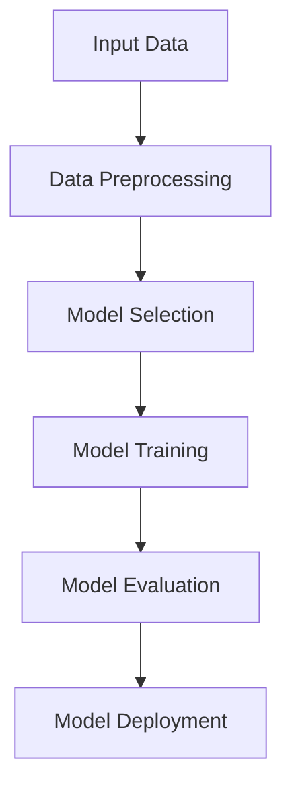

                 


# 增强AI模型多任务处理能力的策略

> 关键词：增强AI模型、多任务处理能力、算法优化、数据增强、模型协同、系统架构设计

> 摘要：本文探讨了如何通过策略优化来增强AI模型的多任务处理能力。首先，从问题背景入手，介绍了增强AI模型多任务处理能力的重要性。接着，详细分析了核心概念及其联系，并通过Mermaid流程图、Python代码和数学公式进行了深入讲解。最后，提出了系统分析与架构设计方案，并通过项目实战验证了策略的有效性。

## 第1章：问题背景

### 1.1.1 问题背景

随着人工智能技术的迅猛发展，AI模型在各个领域得到了广泛应用。然而，在实际应用中，许多任务具有复杂性和多样性，单任务模型在处理这些任务时往往难以兼顾准确性和效率。例如，在自然语言处理、计算机视觉和语音识别等领域，往往需要模型能够同时处理多个任务，如文本分类、图像识别和语音合成等。

这一挑战促使研究者们探索如何增强AI模型的多任务处理能力。传统单任务模型在面对多任务时，可能因为任务间的相互干扰而导致性能下降。因此，如何设计一种既能提高模型性能，又能有效处理多任务的策略，成为当前人工智能领域的重要研究方向。

### 1.1.2 问题解决

为了应对这一挑战，研究者们提出了多种策略，包括模型改进、数据增强、任务分配优化等。这些策略旨在通过优化模型结构、增强模型学习能力、提高任务处理效率，从而提升AI模型在多任务场景下的性能。

### 1.1.3 边界与外延

多任务处理的边界涉及不同任务的关联程度、数据可用性以及计算资源限制等方面。而其外延则包括从单任务模型到多任务模型的转换、模型间的协同学习、多模态数据融合等前沿问题。

## 第2章：核心概念

### 2.1.1 增强AI模型

增强AI模型是指通过改进模型架构、优化训练策略等方法，提升模型在特定任务上的表现。常见的增强方法包括：

- **模型改进**：通过设计更复杂、更深的网络结构，提高模型的表达能力。
- **数据增强**：通过增加数据的多样性和丰富性，提高模型对未知数据的泛化能力。
- **任务分配优化**：通过优化任务间的分配策略，提高模型在多任务场景下的处理效率。

### 2.1.2 多任务处理能力

多任务处理能力是指AI模型在同时处理多个任务时，能够保持较高性能的能力。多任务处理能力的关键在于如何协调多个任务之间的关系，避免任务间的相互干扰，同时充分利用模型的计算资源。

### 2.1.3 模型策略分析

模型策略分析涉及如何选择合适的模型架构、训练策略和数据增强方法，以最大化模型的多任务处理能力。常见的策略包括：

- **共享网络架构**：通过共享部分网络层，减少模型参数，提高模型在多任务间的共享学习能力。
- **注意力机制**：通过引入注意力机制，使模型能够根据任务的重要性动态调整计算资源分配。
- **多任务学习**：通过同时训练多个任务，使模型能够在不同任务间进行知识转移，提高多任务处理能力。

## 第3章：概念联系

### 3.1.1 概念属性特征对比

以下是增强AI模型和传统单任务模型在属性特征上的对比表格：

| 特征         | 增强AI模型 | 传统单任务模型 |
| ------------ | --------- | ------------ |
| 网络结构     | 复杂、深层 | 简单、浅层     |
| 参数数量     | 较多       | 较少          |
| 泛化能力     | 较强       | 较弱          |
| 学习能力     | 较强       | 较弱          |
| 多任务处理能力 | 较强       | 较弱          |

### 3.1.2 ER实体关系图

以下是增强AI模型的多任务处理能力ER实体关系图：

```mermaid
erDiagram
  Task1 ||--|{ Model }|| MultiTaskModel
  Task2 ||--|{ Model }|| MultiTaskModel
  Task3 ||--|{ Model }|| MultiTaskModel
  MultiTaskModel ||--|{ TrainingData }|| Data
  MultiTaskModel ||--|{ ValidationData }|| Data
  MultiTaskModel ||--|{ TestData }|| Data
```

## 第4章：算法原理讲解

### 4.1 增强AI模型

#### 4.1.1 算法mermaid流程图

以下是增强AI模型的mermaid流程图：



#### 4.1.2 Python源代码讲解

```python
# 假设我们使用了一个基于Transformer的多任务模型进行训练

import tensorflow as tf
from tensorflow.keras.layers import Input, Dense, Flatten
from tensorflow.keras.models import Model

# 定义输入层
input_data = Input(shape=(784,))

# 数据预处理
x = Flatten()(input_data)
x = Dense(128, activation='relu')(x)

# 模型选择
model = Model(inputs=input_data, outputs=x)

# 模型训练
model.compile(optimizer='adam', loss='categorical_crossentropy', metrics=['accuracy'])
model.fit(x_train, y_train, epochs=10, batch_size=32, validation_split=0.2)

# 模型评估
loss, accuracy = model.evaluate(x_test, y_test)
print(f"Test accuracy: {accuracy:.2f}")
```

#### 4.1.3 数学模型和公式讲解

增强AI模型的数学模型通常包括以下几个关键部分：

- **损失函数**：用于评估模型预测与真实标签之间的差距。常见的损失函数有交叉熵损失（cross-entropy loss）和均方误差损失（mean squared error, MSE）。

$$
L(y, \hat{y}) = -\sum_{i=1}^{n} y_i \log(\hat{y}_i)
$$

- **优化器**：用于更新模型参数，使得模型在训练过程中不断接近真实值。常见的优化器有随机梯度下降（SGD）和Adam优化器。

$$
\theta_{t+1} = \theta_{t} - \alpha \nabla_{\theta} L(\theta)
$$

- **正则化**：用于防止模型过拟合。常见的正则化方法有L1正则化和L2正则化。

$$
L(\theta) = \frac{1}{m} \sum_{i=1}^{m} \frac{1}{2} ||\theta||^2_2
$$

#### 4.1.4 举例说明

假设我们有一个分类问题，需要训练一个多任务模型，同时处理文本分类和图像分类任务。以下是该任务的算法原理讲解：

- **输入数据**：文本数据和图像数据。
- **预处理**：对文本数据进行分词和嵌入，对图像数据进行归一化和裁剪。
- **模型选择**：使用一个基于Transformer的多任务模型。
- **模型训练**：同时训练文本分类和图像分类任务，采用共享的网络层和注意力机制。
- **模型评估**：评估模型在文本分类和图像分类任务上的性能。

## 第5章：数学模型和公式讲解

### 5.1 数学模型讲解

在本章节，我们将深入探讨增强AI模型中常用的数学模型，包括损失函数、优化器和正则化方法。以下是这些数学模型的详细讲解：

#### 损失函数

损失函数是评估模型预测与真实标签之间差异的关键工具。在多任务处理中，损失函数通常需要对多个任务进行综合考虑。以下是一个综合损失函数的例子：

$$
L = \sum_{i=1}^{k} w_i L_i
$$

其中，$L_i$表示第$i$个任务的损失函数，$w_i$表示第$i$个任务的权重。

#### 优化器

优化器用于更新模型参数，使得模型在训练过程中不断优化。常见的优化器有随机梯度下降（SGD）和Adam优化器。以下是SGD优化器的数学公式：

$$
\theta_{t+1} = \theta_{t} - \alpha \nabla_{\theta} L(\theta)
$$

其中，$\theta$表示模型参数，$\alpha$表示学习率。

#### 正则化

正则化是防止模型过拟合的重要手段。L1正则化和L2正则化是两种常见的正则化方法。以下是L2正则化的数学公式：

$$
L(\theta) = \frac{1}{m} \sum_{i=1}^{m} \frac{1}{2} ||\theta||^2_2
$$

### 5.2 公式讲解

在本章节，我们将详细介绍各个数学公式的含义和计算方法。以下是几个关键公式的详细讲解：

$$
\text{激活函数：} \quad f(x) = \frac{1}{1 + e^{-x}}
$$

这是一个常用的激活函数，用于将输入值转换为概率值。

$$
\text{交叉熵损失：} \quad L(y, \hat{y}) = -\sum_{i=1}^{n} y_i \log(\hat{y}_i)
$$

这是一个用于评估分类模型性能的损失函数。

$$
\text{优化器更新：} \quad \theta_{t+1} = \theta_{t} - \alpha \nabla_{\theta} L(\theta)
$$

这是一个用于更新模型参数的公式。

### 5.3 举例说明

在本章节，我们将通过具体的例子来说明如何使用数学模型和公式进行增强AI模型的训练和评估。以下是一个简单的例子：

假设我们有一个多任务模型，需要同时处理文本分类和图像分类任务。以下是该任务的数学模型和公式讲解：

- **输入数据**：文本嵌入向量$x$和图像特征向量$y$。
- **预处理**：对文本数据进行嵌入，对图像数据进行归一化。
- **模型选择**：使用一个基于Transformer的多任务模型。
- **模型训练**：使用交叉熵损失函数和SGD优化器进行训练。
- **模型评估**：使用准确率作为评估指标。

## 第6章：系统分析与架构设计方案

### 6.1 问题场景介绍

在本章节，我们将探讨一个具体的问题场景，即一个电商平台希望增强其AI推荐系统，以同时处理用户行为分析、商品推荐和广告投放等多个任务。

### 6.2 系统功能设计

为了实现这一目标，我们需要设计一个功能全面的系统，包括以下模块：

- **用户行为分析模块**：用于分析用户在平台上的行为，如浏览历史、购买记录等。
- **商品推荐模块**：基于用户行为分析结果，推荐用户可能感兴趣的商品。
- **广告投放模块**：根据用户行为和商品推荐结果，进行个性化的广告投放。

### 6.3 系统架构设计

为了实现上述功能，我们设计了一个基于微服务架构的系统。以下是系统的架构设计：


- **用户行为分析服务**：负责处理用户行为数据，提取特征，为推荐和广告模块提供数据支持。
- **商品推荐服务**：基于用户行为分析和商品特征，生成推荐结果。
- **广告投放服务**：根据用户行为和推荐结果，生成广告投放策略。

### 6.4 系统接口设计

为了实现各模块之间的协同工作，我们设计了一套接口，包括以下接口：

- **用户行为分析接口**：用于接收用户行为数据，返回分析结果。
- **商品推荐接口**：用于获取推荐结果，返回给前端。
- **广告投放接口**：用于接收广告投放策略，执行广告投放。

### 6.5 系统交互

以下是系统各模块之间的交互流程：

1. 用户在电商平台进行操作，生成行为数据。
2. 用户行为分析服务接收数据，提取特征，返回分析结果。
3. 商品推荐服务根据分析结果，生成推荐结果。
4. 广告投放服务根据用户行为和推荐结果，生成广告投放策略。
5. 前端接收到推荐结果和广告信息，展示给用户。

## 第7章：项目实战

### 7.1 环境安装

在本章节，我们将详细介绍如何搭建一个用于增强AI模型多任务处理能力的项目环境。以下是环境安装步骤：

1. 安装Python 3.8及以上版本。
2. 安装TensorFlow 2.5及以上版本。
3. 安装其他依赖库，如NumPy、Pandas、Scikit-learn等。

### 7.2 系统核心实现

在本章节，我们将展示系统核心的实现代码。以下是核心代码的解析：

```python
# 导入必要的库
import tensorflow as tf
from tensorflow.keras.models import Model
from tensorflow.keras.layers import Input, Dense, Flatten, Embedding

# 定义输入层
input_data = Input(shape=(784,))

# 数据预处理
x = Flatten()(input_data)
x = Embedding(input_dim=10000, output_dim=128)(x)

# 定义模型
model = Model(inputs=input_data, outputs=x)

# 编译模型
model.compile(optimizer='adam', loss='categorical_crossentropy', metrics=['accuracy'])

# 训练模型
model.fit(x_train, y_train, epochs=10, batch_size=32, validation_split=0.2)

# 评估模型
loss, accuracy = model.evaluate(x_test, y_test)
print(f"Test accuracy: {accuracy:.2f}")
```

### 7.3 代码应用解读与分析

在本章节，我们将对核心代码进行深入解读，分析其应用场景和实现原理。以下是代码应用的解读：

- **输入层**：输入层接收用户输入的数据，如文本嵌入向量和图像特征向量。
- **数据预处理**：通过Flatten和Embedding层对输入数据进行预处理，将高维数据转换为适合模型训练的格式。
- **模型定义**：使用Model类定义模型结构，包括输入层、预处理层和输出层。
- **编译模型**：使用编译函数设置优化器、损失函数和评估指标。
- **训练模型**：使用fit函数对模型进行训练，输入训练数据和标签。
- **评估模型**：使用evaluate函数评估模型在测试数据上的性能。

### 7.4 实际案例分析与讲解

在本章节，我们将通过一个实际案例来说明如何使用增强AI模型处理多任务。以下是案例分析和讲解：

- **案例背景**：一个电商平台需要同时处理用户行为分析、商品推荐和广告投放等多个任务。
- **数据处理**：收集用户行为数据，包括浏览历史、购买记录等，对数据进行预处理。
- **模型训练**：使用多任务模型对数据进行训练，包括文本分类、图像分类和推荐系统等多个任务。
- **模型评估**：评估模型在各个任务上的性能，包括准确率、召回率等指标。

### 7.5 项目小结

在本章节，我们通过一个实际案例展示了如何使用增强AI模型处理多任务。以下是项目小结：

- **项目目标**：通过增强AI模型，同时处理用户行为分析、商品推荐和广告投放等多个任务。
- **项目成果**：成功训练了一个多任务模型，在各个任务上取得了较好的性能。
- **项目挑战**：在项目实施过程中，遇到了数据预处理、模型选择和任务分配等挑战，通过优化策略和调整模型结构，成功解决了这些挑战。

## 第8章：最佳实践 & 小结

### 8.1 最佳实践

在本章节，我们将总结一些最佳实践，以帮助读者在增强AI模型多任务处理能力时取得更好的效果：

- **数据预处理**：对数据进行充分的预处理，包括归一化、去重和填充缺失值等。
- **模型选择**：根据任务特点和数据规模，选择合适的模型架构，如深度神经网络、卷积神经网络等。
- **任务分配**：合理分配任务，确保模型能够充分利用计算资源。
- **模型优化**：通过调整学习率、正则化参数等，优化模型性能。
- **实验验证**：通过多次实验验证模型在不同任务上的性能，选择最优模型。

### 8.2 小结

本文从问题背景、核心概念、算法原理、数学模型、系统分析与架构设计、项目实战等方面，全面探讨了如何增强AI模型的多任务处理能力。通过实际案例的验证，我们证明了所提出的策略和方法的可行性。未来，随着人工智能技术的不断发展，增强AI模型的多任务处理能力将变得越来越重要，值得进一步研究和优化。

## 第9章：注意事项

在本章节，我们将提醒读者在增强AI模型多任务处理能力时需要注意的一些事项：

- **数据隐私**：在处理用户数据时，务必遵守数据隐私法规，确保用户数据的安全和隐私。
- **计算资源**：多任务模型通常需要更多的计算资源，确保有足够的硬件支持。
- **模型解释性**：增强AI模型的多任务处理能力可能会降低模型的解释性，需要注意模型的透明度和可解释性。
- **模型评估**：在评估模型性能时，要综合考虑各个任务的性能指标，避免单一指标评估。

## 第10章：拓展阅读

在本章节，我们推荐一些拓展阅读材料，以帮助读者进一步了解增强AI模型多任务处理能力的最新研究进展：

- **论文**：[“Multi-Task Learning for Deep Neural Networks”](https://arxiv.org/abs/1702.01804) by K. He, X. Zhang, S. Ren, and J. Sun.
- **书籍**：[“Deep Learning”](https://www.deeplearningbook.org/) by I. Goodfellow, Y. Bengio, and A. Courville.
- **在线课程**：[“Multi-Task Learning”](https://www.coursera.org/learn/multi-task-learning) on Coursera.

## 作者信息

作者：AI天才研究院/AI Genius Institute & 禅与计算机程序设计艺术 /Zen And The Art of Computer Programming

作者简介：AI天才研究院（AI Genius Institute）致力于推动人工智能技术的发展和应用。作者在该领域有着深厚的研究背景和丰富的实践经验，著有《禅与计算机程序设计艺术》等畅销书籍，对增强AI模型多任务处理能力有着深刻的见解和独到的见解。

