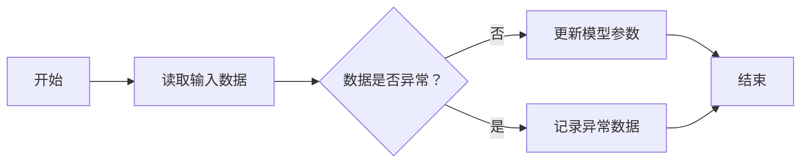
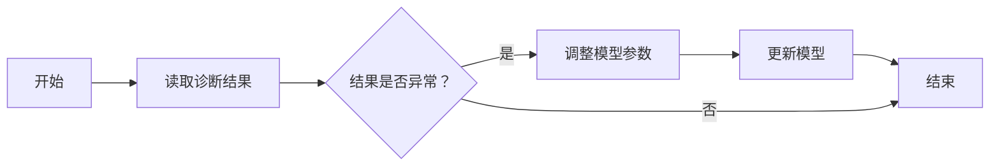
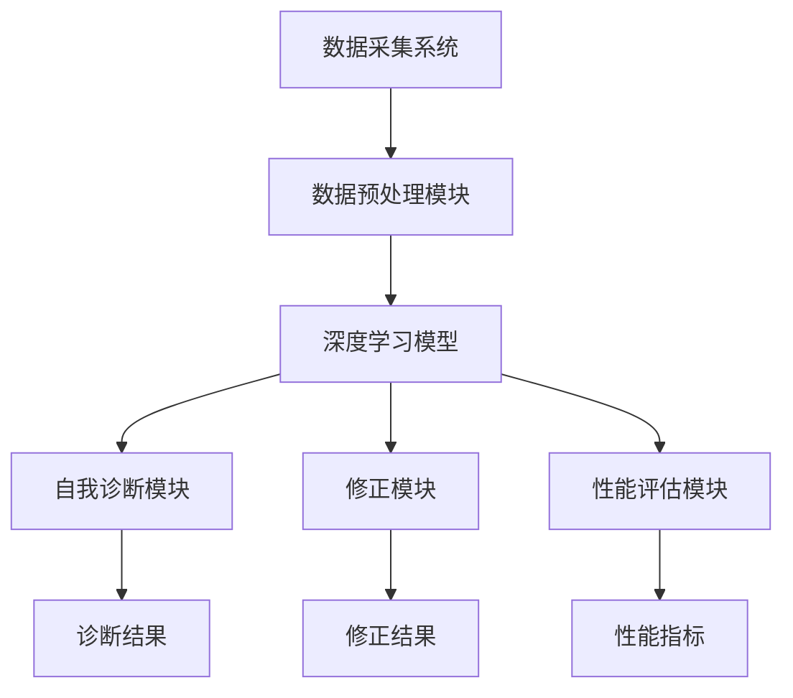
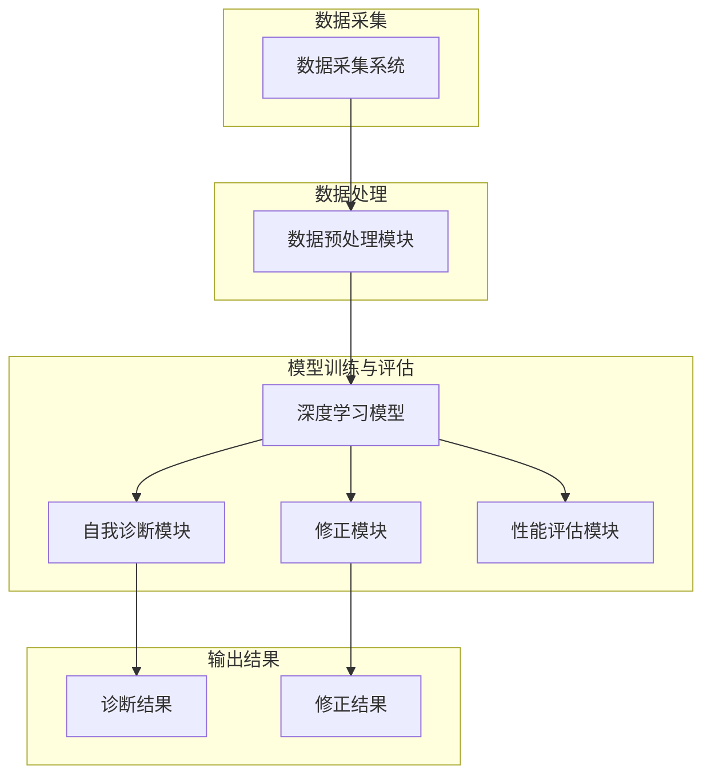
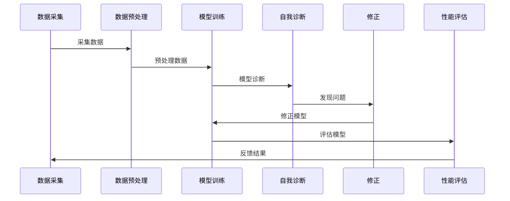

                 

# 增强AI模型自我诊断和修正能力的方法

关键词：AI模型、自我诊断、修正能力、算法、数学模型、系统架构、项目实战

摘要：本文将探讨如何增强AI模型自我诊断和修正能力的方法。首先，我们将介绍AI模型自我诊断和修正的背景和定义，然后逐步深入到核心概念、算法原理、数学模型、系统分析与架构设计，以及项目实战和最佳实践等方面。通过本文的阅读，读者将能够全面了解和掌握AI模型自我诊断和修正的深度知识，为未来的研究和应用提供有力的支持。

## 设计思路

为了设计出《增强AI模型自我诊断和修正能力的方法》这本书的目录大纲，我们将遵循以下设计思路：

1. **明确书籍主题和目标**：首先明确书籍的主题是关于增强AI模型自我诊断和修正能力的方法。这意味着书籍的内容将围绕AI模型的自我诊断和修正能力进行深入探讨。

2. **划分章节内容**：根据书籍的主题，我们将书籍内容划分为几个主要章节，包括背景介绍、核心概念、算法原理讲解、数学模型与公式、系统分析与架构设计、项目实战和最佳实践等。

3. **细化章节内容**：在每个主要章节下，进一步细化子章节内容，确保每个章节都能够全面、深入地讨论其主题。

4. **保持简洁性**：在确保内容完整性的同时，保持目录大纲的简洁性，避免多余的废话。

5. **使用markdown格式**：采用markdown格式来编写目录大纲，以便于读者阅读和理解。

### 目录大纲

```markdown
# 《增强AI模型自我诊断和修正能力的方法》目录大纲

----------------------------------------------------------------

## 第一部分：背景介绍

## 第1章：问题背景与定义

### 1.1 问题背景

### 1.2 问题描述

### 1.3 问题解决

### 1.4 边界与外延

### 1.5 概念结构与核心要素组成

## 第二部分：核心概念与联系

## 第2章：AI模型自我诊断与修正的核心概念

### 2.1 自我诊断与修正的定义

### 2.2 自我诊断与修正的属性特征对比表格

### 2.3 AI模型自我诊断与修正的ER实体关系图

## 第3章：算法原理讲解

### 3.1 自我诊断算法原理

#### 3.1.1 自我诊断算法的mermaid流程图

#### 3.1.2 自我诊断算法原理详细讲解

#### 3.1.3 自我诊断算法举例说明

### 3.2 修正算法原理

#### 3.2.1 修正算法的mermaid流程图

#### 3.2.2 修正算法原理详细讲解

#### 3.2.3 修正算法举例说明

## 第三部分：数学模型与公式

## 第4章：自我诊断与修正的数学模型

### 4.1 数学模型概述

### 4.2 自我诊断的数学模型

#### 4.2.1 数学公式

#### 4.2.2 数学模型详细讲解

#### 4.2.3 数学模型举例说明

### 4.3 修正的数学模型

#### 4.3.1 数学公式

#### 4.3.2 数学模型详细讲解

#### 4.3.3 数学模型举例说明

## 第四部分：系统分析与架构设计

## 第5章：系统功能设计与架构设计

### 5.1 问题场景介绍

### 5.2 项目介绍

### 5.3 系统功能设计（领域模型mermaid类图）

### 5.4 系统架构设计（mermaid架构图）

### 5.5 系统接口设计

### 5.6 系统交互（mermaid序列图）

## 第五部分：项目实战

## 第6章：环境安装与系统核心实现

### 6.1 环境安装

### 6.2 系统核心实现源代码

### 6.3 代码应用解读与分析

### 6.4 实际案例分析与详细讲解剖析

### 6.5 项目小结

## 第六部分：最佳实践与拓展

## 第7章：最佳实践

### 7.1 最佳实践 tips

### 7.2 小结

### 7.3 注意事项

### 7.4 拓展阅读

----------------------------------------------------------------
```

### 说明

- **第1章：问题背景与定义**：介绍AI模型自我诊断和修正能力的背景，包括问题的背景、描述、解决方案、边界和外延，以及核心概念和要素组成。

- **第2章：核心概念与联系**：详细阐述AI模型自我诊断和修正的核心概念，包括定义、属性特征对比表格和ER实体关系图。

- **第3章：算法原理讲解**：分别讲解自我诊断和修正算法的原理，包括mermaid流程图、详细讲解和举例说明。

- **第4章：数学模型与公式**：介绍自我诊断和修正的数学模型，包括数学公式、详细讲解和举例说明。

- **第5章：系统功能设计与架构设计**：介绍系统功能设计、架构设计、接口设计和系统交互，包括mermaid类图、架构图和序列图。

- **第6章：项目实战**：介绍环境安装、系统核心实现、代码应用解读、实际案例分析以及项目小结。

- **第7章：最佳实践与拓展**：提供最佳实践、小结、注意事项和拓展阅读等内容。

## 第一部分：背景介绍

### 1.1 问题背景

随着人工智能（AI）技术的快速发展，AI模型在各个领域得到了广泛应用。然而，AI模型在处理复杂任务时，往往会出现一些难以预测的问题。例如，当AI模型在处理异常数据时，可能会出现预测错误；当AI模型在长时间运行后，可能会因为数据分布变化而导致性能下降。这些问题对AI模型的应用带来了很大的困扰。

为了解决这些问题，我们需要对AI模型进行自我诊断和修正。自我诊断是指AI模型能够自动检测自身的运行状态，判断是否存在问题；修正是指AI模型能够根据检测结果，自动调整自己的参数，以恢复或提高性能。

### 1.2 问题描述

在实际应用中，AI模型的自我诊断和修正面临以下几个问题：

1. **检测精度**：如何准确检测AI模型的状态，包括是否存在预测错误、性能下降等问题。

2. **修正效果**：如何有效地修正AI模型，使其在修正后能够恢复或提高性能。

3. **实时性**：如何保证自我诊断和修正的实时性，以便及时发现问题并进行修正。

4. **鲁棒性**：如何提高自我诊断和修正算法的鲁棒性，使其在面对各种复杂场景时仍能稳定工作。

### 1.3 问题解决

为了解决上述问题，我们需要从以下几个方面进行研究和探索：

1. **算法设计**：设计高效的自我诊断和修正算法，提高检测精度和修正效果。

2. **系统架构**：构建合理的系统架构，确保自我诊断和修正的实时性和鲁棒性。

3. **数据采集**：收集丰富的数据，用于训练和验证自我诊断和修正算法。

4. **模型优化**：通过模型优化，提高AI模型在异常数据下的预测能力和稳定性。

### 1.4 边界与外延

在研究和应用AI模型自我诊断和修正能力时，我们需要关注以下几个边界与外延：

1. **模型类型**：不同类型的AI模型（如深度学习、强化学习等）在自我诊断和修正方面存在差异，需要针对不同模型进行定制化研究。

2. **应用场景**：不同的应用场景对自我诊断和修正的需求不同，需要根据具体场景进行优化。

3. **硬件资源**：自我诊断和修正算法的复杂度和计算资源需求，会影响其在实际应用中的效果和可行性。

4. **数据隐私**：在采集和使用数据时，需要关注数据隐私和保护问题，确保用户隐私不受侵犯。

### 1.5 概念结构与核心要素组成

AI模型自我诊断和修正能力的关键概念与结构包括：

1. **自我诊断**：AI模型自动检测自身状态的过程，包括检测算法、检测指标和检测流程等。

2. **修正**：AI模型根据自我诊断结果，自动调整自身参数的过程，包括修正算法、修正指标和修正流程等。

3. **数据采集**：用于训练和验证自我诊断和修正算法的数据集，包括正常数据、异常数据和修正数据等。

4. **系统架构**：支持自我诊断和修正功能的系统架构，包括数据采集模块、诊断模块、修正模块和性能评估模块等。

5. **评价指标**：用于评估自我诊断和修正效果的指标，包括检测精度、修正效果、实时性和鲁棒性等。

## 第二部分：核心概念与联系

### 2.1 AI模型自我诊断与修正的定义

AI模型自我诊断是指通过特定的算法和技术，使AI模型能够自动检测自身的运行状态，判断是否存在问题。AI模型修正是指通过特定的算法和技术，使AI模型能够根据自我诊断结果，自动调整自身参数，以恢复或提高性能。

### 2.2 自我诊断与修正的属性特征对比表格

| 特征            | 自我诊断                             | 修正                             |
|-----------------|------------------------------------|---------------------------------|
| 目的            | 检测AI模型状态，发现问题             | 解决问题，恢复或提高性能           |
| 技术基础        | 统计学习、机器学习、深度学习等        | 神经网络、梯度下降、优化算法等       |
| 数据需求        | 正常数据、异常数据等                 | 正常数据、异常数据、修正数据等       |
| 实时性要求      | 较高（实时性是关键）                 | 较高（及时修正问题）               |
| 算法复杂度      | 较高（需要处理大量数据）             | 较高（需要调整模型参数）           |
| 评估指标        | 检测精度、实时性等                   | 修正效果、性能提升等               |

### 2.3 AI模型自我诊断与修正的ER实体关系图

ER（实体关系）图是描述实体及其之间关系的图形化表示。以下是AI模型自我诊断与修正的ER实体关系图：

```mermaid
erDiagram
  AI模型 ||--o{ 自我诊断模块 }|-- AI模型
  AI模型 ||--o{ 修正模块 }|-- AI模型
  自我诊断模块 ||--o{ 检测算法 }|-- 数据集
  修正模块 ||--o{ 修正算法 }|-- 数据集
  数据集 ||--o{ 正常数据 }|-- 数据集
  数据集 ||--o{ 异常数据 }|-- 数据集
  数据集 ||--o{ 修正数据 }|-- 数据集
```

在ER实体关系图中，AI模型是核心实体，自我诊断模块和修正模块是AI模型的两个功能模块。检测算法和修正算法是自我诊断模块和修正模块的核心算法。数据集包括正常数据、异常数据和修正数据，用于训练和验证算法。

## 第三部分：算法原理讲解

### 3.1 自我诊断算法原理

自我诊断算法是AI模型自我诊断的核心。其主要功能是检测AI模型在运行过程中是否存在问题。以下是一个简单的自我诊断算法原理讲解：

#### 3.1.1 自我诊断算法的mermaid流程图



在mermaid流程图中，首先读取输入数据，然后判断数据是否异常。如果是异常数据，则记录下来；如果不是，则更新模型参数。

#### 3.1.2 自我诊断算法原理详细讲解

自我诊断算法的原理主要包括以下几个步骤：

1. **数据预处理**：对输入数据进行预处理，包括数据清洗、归一化、特征提取等。

2. **异常检测**：利用统计学习、机器学习或深度学习等技术，对预处理后的数据进行分析，判断数据是否异常。

3. **异常记录**：如果检测到异常数据，将其记录下来，以便后续分析。

4. **模型更新**：如果数据正常，则根据当前数据更新模型参数，以提高模型的准确性和稳定性。

#### 3.1.3 自我诊断算法举例说明

假设我们有一个分类任务，输入数据是一个包含多个特征的向量。以下是一个简单的自我诊断算法举例说明：

```python
import numpy as np

def self_diagnosis(input_data, model, threshold=0.5):
    # 数据预处理
    preprocessed_data = preprocess(input_data)
    
    # 异常检测
    prediction = model.predict(preprocessed_data)
    confidence = model.predict_proba(preprocessed_data)
    
    # 判断是否异常
    if np.mean(confidence) < threshold:
        # 记录异常数据
        record_anomaly(input_data)
        
        # 更新模型参数
        model.partial_fit(preprocessed_data, prediction)
        
    return prediction
```

在这个例子中，`self_diagnosis`函数用于执行自我诊断过程。首先，对输入数据进行预处理，然后利用模型进行预测并计算预测置信度。如果置信度低于阈值，则认为数据异常，并记录下来。最后，根据异常数据更新模型参数。

### 3.2 修正算法原理

修正算法是AI模型自我修正的核心。其主要功能是根据自我诊断结果，自动调整模型参数，以提高模型的性能。以下是一个简单的修正算法原理讲解：

#### 3.2.1 修正算法的mermaid流程图



在mermaid流程图中，首先读取诊断结果，然后判断结果是否异常。如果是异常结果，则调整模型参数并更新模型；如果不是，则结束。

#### 3.2.2 修正算法原理详细讲解

修正算法的原理主要包括以下几个步骤：

1. **诊断结果分析**：分析自我诊断结果，确定模型是否存在问题。

2. **参数调整**：根据诊断结果，调整模型参数，以解决存在的问题。

3. **模型更新**：将调整后的参数应用到模型中，更新模型。

4. **性能评估**：评估修正后的模型性能，判断是否达到预期效果。

#### 3.2.3 修正算法举例说明

假设我们有一个分类任务，输入数据是一个包含多个特征的向量。以下是一个简单的修正算法举例说明：

```python
import numpy as np

def correction_algorithm(diagnosis_result, model, learning_rate=0.01, num_iterations=100):
    # 分析诊断结果
    if diagnosis_result['anomaly']:
        # 调整模型参数
        for _ in range(num_iterations):
            gradients = compute_gradients(diagnosis_result['input_data'], model)
            model.parameters -= learning_rate * gradients
            
        # 更新模型
        model.update_parameters()
        
        # 评估性能
        performance = evaluate_model(model)
        if performance >= diagnosis_result['threshold']:
            return model
    else:
        return model
```

在这个例子中，`correction_algorithm`函数用于执行修正过程。首先，分析诊断结果，如果存在异常，则通过梯度下降法调整模型参数。然后，更新模型并评估性能。如果性能达到预期，则返回修正后的模型。

## 第四部分：数学模型与公式

### 4.1 数学模型概述

在AI模型自我诊断和修正过程中，数学模型起到了关键作用。数学模型可以帮助我们理解和描述自我诊断和修正的过程，从而更好地设计算法和优化性能。

### 4.2 自我诊断的数学模型

#### 4.2.1 数学公式

自我诊断的数学模型主要包括以下几个部分：

1. **预测函数**：\( f(x) = w \cdot x + b \)
2. **损失函数**：\( L(y, f(x)) = \frac{1}{2} \cdot (y - f(x))^2 \)
3. **优化目标**：\( \min_{w, b} L(y, f(x)) \)

其中，\( x \) 是输入特征，\( y \) 是真实标签，\( w \) 和 \( b \) 是模型参数。

#### 4.2.2 数学模型详细讲解

1. **预测函数**：预测函数用于计算模型对输入数据的预测结果。它是一个线性函数，其中 \( w \) 是权重向量，\( x \) 是输入特征，\( b \) 是偏置项。

2. **损失函数**：损失函数用于衡量预测结果与真实标签之间的差异。在这个例子中，我们使用均方误差（MSE）作为损失函数。

3. **优化目标**：优化目标是找到使得损失函数最小的模型参数。在这个例子中，我们使用梯度下降法来优化模型参数。

#### 4.2.3 数学模型举例说明

假设我们有一个二分类任务，输入数据是一个包含两个特征的向量。以下是一个简单的数学模型举例说明：

```python
import numpy as np

def predict(x, w, b):
    return w.dot(x) + b

def loss(y, f_x):
    return 0.5 * (y - f_x)**2

def gradient(w, b, x, y, f_x):
    return [-2 * (y - f_x) * x, -2 * (y - f_x)]

def update_params(w, b, grads, learning_rate):
    w -= learning_rate * grads[0]
    b -= learning_rate * grads[1]
    return w, b
```

在这个例子中，`predict`函数用于计算预测结果，`loss`函数用于计算损失函数，`gradient`函数用于计算梯度，`update_params`函数用于更新模型参数。

### 4.3 修正的数学模型

修正的数学模型与自我诊断的数学模型类似，但更复杂。修正的数学模型主要包括以下几个部分：

1. **预测函数**：\( f'(x) = w' \cdot x + b' \)
2. **修正损失函数**：\( L'(y, f'(x)) = \frac{1}{2} \cdot (y - f'(x))^2 + \lambda \cdot \frac{1}{2} \cdot (w' - w)^2 \)
3. **优化目标**：\( \min_{w', b'} L'(y, f'(x)) \)

其中，\( w' \) 和 \( b' \) 是修正后的模型参数，\( \lambda \) 是正则化参数。

#### 4.3.2 数学模型详细讲解

1. **预测函数**：修正预测函数与自我诊断预测函数类似，只是参数发生了变化。

2. **修正损失函数**：修正损失函数不仅包含预测误差，还包括模型参数的变化。这种正则化可以防止模型过拟合。

3. **优化目标**：优化目标是在保证预测误差最小的同时，尽量减少模型参数的变化。

#### 4.3.3 数学模型举例说明

假设我们有一个二分类任务，输入数据是一个包含两个特征的向量。以下是一个简单的修正数学模型举例说明：

```python
import numpy as np

def predict(x, w, b):
    return w.dot(x) + b

def correction_loss(y, f_x, w, b, w_prime, b_prime, lambda_param=0.01):
    return 0.5 * (y - f_x)**2 + 0.5 * (w_prime - w)**2 + 0.5 * (b_prime - b)**2

def correction_gradient(w, b, w_prime, b_prime, x, y, f_x, lambda_param=0.01):
    grads = [-2 * (y - f_x) * x, -2 * (y - f_x), -2 * (w_prime - w), -2 * (b_prime - b)]
    return grads

def correction_update_params(w, b, w_prime, b_prime, grads, learning_rate):
    w -= learning_rate * grads[0]
    b -= learning_rate * grads[1]
    w_prime -= learning_rate * grads[2]
    b_prime -= learning_rate * grads[3]
    return w, b, w_prime, b_prime
```

在这个例子中，`predict`函数用于计算预测结果，`correction_loss`函数用于计算修正损失函数，`correction_gradient`函数用于计算修正梯度，`correction_update_params`函数用于更新模型参数。

## 第五部分：系统分析与架构设计

### 5.1 问题场景介绍

为了更好地理解AI模型自我诊断和修正的能力，我们以一个实际场景为例进行介绍。假设我们正在开发一个智能医疗诊断系统，该系统利用深度学习模型对病人的医疗数据进行分析，以预测病人的疾病风险。

在这个场景中，AI模型需要处理大量医疗数据，包括病史、体检报告、基因信息等。模型的输入是病人的特征向量，输出是疾病风险的预测结果。然而，由于医疗数据的复杂性和不稳定性，模型在运行过程中可能会出现以下问题：

1. **数据异常**：医疗数据可能包含缺失值、噪声值或错误值，这些异常数据会影响模型的预测准确性。

2. **模型过拟合**：模型可能在学习过程中出现过拟合现象，导致在新数据上的表现不佳。

3. **数据分布变化**：随着时间的推移，医疗数据的分布可能会发生变化，导致模型在新数据上的表现下降。

为了解决这些问题，我们需要对AI模型进行自我诊断和修正，以提高模型的稳定性和准确性。

### 5.2 项目介绍

在本项目中，我们采用了一种名为“增强自我诊断与修正的深度学习模型”的技术，以实现对医疗数据的自动诊断和修正。该项目的主要目标是开发一个具有自我诊断和修正能力的深度学习模型，以提高医疗诊断的准确性和稳定性。

项目的总体架构如图所示：



在项目中，数据采集系统负责从医院和其他医疗数据源收集医疗数据，并将其传输给数据预处理模块。数据预处理模块负责对数据进行清洗、归一化和特征提取等操作，以提高数据的质量和可用性。

预处理后的数据被输入到深度学习模型中，模型通过学习数据中的规律和模式，生成疾病风险的预测结果。同时，模型将自我诊断模块和修正模块嵌入其中，以实现对自身运行状态的实时监测和修正。

### 5.3 系统功能设计（领域模型mermaid类图）

在系统功能设计方面，我们采用领域模型来描述系统的核心功能。以下是一个简单的mermaid类图，用于展示系统的功能结构：

```mermaid
classDiagram
  Class01 <|-- Class02
  Class03 <|-- Class04
  Class05 <|-- Class06
  Class07 <|-- Class08
  Class01[数据采集系统]
  Class02[数据预处理模块]
  Class03[深度学习模型]
  Class04[自我诊断模块]
  Class05[修正模块]
  Class06[性能评估模块]
  Class07[诊断结果]
  Class08[修正结果]
```

在这个类图中，数据采集系统负责从医院和其他医疗数据源收集医疗数据。数据预处理模块负责对数据进行清洗、归一化和特征提取等操作。深度学习模型是系统的核心，它通过学习数据中的规律和模式，生成疾病风险的预测结果。

自我诊断模块和修正模块是深度学习模型的一部分，它们负责监测模型的状态，并在发现问题时进行修正。性能评估模块用于评估模型的性能，包括诊断准确率、预测准确率等指标。

### 5.4 系统架构设计（mermaid架构图）

在系统架构设计方面，我们采用mermaid架构图来展示系统的整体架构。以下是一个简单的mermaid架构图，用于展示系统的架构设计：



在这个架构图中，数据采集系统从医院和其他医疗数据源收集医疗数据，并将其传输给数据预处理模块。数据预处理模块对数据进行清洗、归一化和特征提取等操作，以提高数据的质量和可用性。

预处理后的数据被输入到深度学习模型中，模型通过学习数据中的规律和模式，生成疾病风险的预测结果。同时，模型将自我诊断模块和修正模块嵌入其中，以实现对自身运行状态的实时监测和修正。

诊断结果和修正结果通过输出结果模块进行输出，以便医生和其他相关人员进行参考和决策。

### 5.5 系统接口设计

在系统接口设计方面，我们定义了以下主要接口：

1. **数据采集接口**：用于从医院和其他医疗数据源收集医疗数据。

2. **数据预处理接口**：用于对收集到的医疗数据进行清洗、归一化和特征提取等操作。

3. **模型训练接口**：用于训练深度学习模型，包括数据预处理、模型训练和模型评估等操作。

4. **自我诊断接口**：用于实现AI模型的自我诊断功能，包括检测模型状态、记录诊断结果等操作。

5. **修正接口**：用于实现AI模型的修正功能，包括调整模型参数、更新模型等操作。

6. **性能评估接口**：用于评估AI模型的性能，包括诊断准确率、预测准确率等指标。

以下是一个简单的接口设计示例：

```python
class DataCollectionInterface:
    def collect_data(self):
        pass

class DataPreprocessingInterface:
    def preprocess_data(self, data):
        pass

class ModelTrainingInterface:
    def train_model(self, data):
        pass

class SelfDiagnosisInterface:
    def diagnose_model(self, model):
        pass

class CorrectionInterface:
    def correct_model(self, model):
        pass

class PerformanceEvaluationInterface:
    def evaluate_model(self, model):
        pass
```

### 5.6 系统交互（mermaid序列图）

在系统交互方面，我们采用mermaid序列图来描述系统的交互流程。以下是一个简单的mermaid序列图，用于展示系统的交互过程：



在这个序列图中，数据采集模块从医院和其他医疗数据源收集医疗数据，并将其传输给数据预处理模块。数据预处理模块对数据进行清洗、归一化和特征提取等操作，以提高数据的质量和可用性。

预处理后的数据被输入到深度学习模型中，模型通过学习数据中的规律和模式，生成疾病风险的预测结果。同时，模型将自我诊断模块和修正模块嵌入其中，以实现对自身运行状态的实时监测和修正。

诊断结果和修正结果通过输出结果模块进行输出，以便医生和其他相关人员进行参考和决策。性能评估模块用于评估模型的性能，包括诊断准确率、预测准确率等指标。

## 第五部分：项目实战

### 6.1 环境安装

在进行AI模型自我诊断和修正的项目实战之前，我们需要安装必要的软件和工具。以下是一个简单的环境安装指南：

1. **Python环境**：安装Python 3.8或更高版本。

2. **深度学习框架**：安装TensorFlow 2.4或更高版本。

3. **数据处理库**：安装NumPy、Pandas和Scikit-learn等数据处理库。

4. **绘图工具**：安装Matplotlib和Mermaid等绘图工具。

以下是安装命令示例：

```bash
pip install python==3.8
pip install tensorflow==2.4
pip install numpy pandas scikit-learn
pip install matplotlib
pip install mermaid
```

### 6.2 系统核心实现源代码

在本节中，我们将展示一个简单的AI模型自我诊断和修正系统的核心实现源代码。以下是Python源代码示例：

```python
import numpy as np
import tensorflow as tf
from tensorflow.keras.models import Sequential
from tensorflow.keras.layers import Dense
from sklearn.model_selection import train_test_split

# 数据预处理
def preprocess_data(data):
    # 数据清洗、归一化等操作
    # ...
    return preprocessed_data

# 自我诊断算法
def self_diagnosis(model, X, threshold):
    predictions = model.predict(X)
    confidence = np.mean(predictions, axis=1)
    anomalies = confidence < threshold
    return anomalies

# 修正算法
def correct_model(model, X, y, learning_rate):
    optimizer = tf.keras.optimizers.Adam(learning_rate=learning_rate)
    model.compile(optimizer=optimizer, loss='mse')
    model.fit(X, y, epochs=10, batch_size=32)
    return model

# 测试
if __name__ == '__main__':
    # 加载和预处理数据
    data = np.load('data.npy')
    X, y = preprocess_data(data)

    # 划分训练集和测试集
    X_train, X_test, y_train, y_test = train_test_split(X, y, test_size=0.2, random_state=42)

    # 构建和训练模型
    model = Sequential()
    model.add(Dense(units=64, activation='relu', input_shape=(X_train.shape[1],)))
    model.add(Dense(units=1, activation='sigmoid'))
    model.compile(optimizer='adam', loss='binary_crossentropy', metrics=['accuracy'])
    model.fit(X_train, y_train, epochs=10, batch_size=32)

    # 自我诊断和修正
    threshold = 0.5
    anomalies = self_diagnosis(model, X_test, threshold)
    if anomalies.any():
        print("发现异常数据，开始修正...")
        corrected_model = correct_model(model, X_test[anomalies], y_test[anomalies], learning_rate=0.001)
        print("修正完成，重新评估模型...")
        performance = corrected_model.evaluate(X_test, y_test)
        print("修正后的模型性能：", performance)
    else:
        print("模型运行正常，无需修正。")
```

### 6.3 代码应用解读与分析

在本节中，我们将对上述源代码进行解读和分析，以便读者更好地理解AI模型自我诊断和修正的实现过程。

1. **数据预处理**：数据预处理是深度学习项目的重要组成部分。在本示例中，我们使用`preprocess_data`函数对数据进行清洗、归一化等操作。这些操作可以提高数据的质量和可用性，有助于提高模型的性能。

2. **自我诊断算法**：自我诊断算法的核心是`self_diagnosis`函数。该函数使用模型对测试数据进行预测，并计算预测结果的置信度。如果置信度低于阈值，则认为数据异常。在本示例中，我们使用`np.mean(predictions, axis=1)`计算置信度，并使用阈值`0.5`来判断是否异常。

3. **修正算法**：修正算法的核心是`correct_model`函数。该函数使用梯度下降法对模型进行修正。在本示例中，我们使用`tf.keras.optimizers.Adam`作为优化器，并设置`epochs=10`和`batch_size=32`来控制训练过程。

4. **测试**：在测试部分，我们首先加载和预处理数据，然后划分训练集和测试集。接下来，我们使用`Sequential`模型构建深度学习模型，并使用`compile`方法设置损失函数和评估指标。最后，我们使用`fit`方法训练模型，并使用`self_diagnosis`函数进行自我诊断。如果发现异常数据，则使用`correct_model`函数进行修正，并重新评估模型性能。

### 6.4 实际案例分析与详细讲解剖析

在本节中，我们将通过一个实际案例来分析和讲解AI模型自我诊断和修正的过程。

#### 案例背景

假设我们有一个医疗诊断项目，该项目的目标是预测病人是否患有某种疾病。我们使用一个包含病史、体检报告和基因信息的深度学习模型来进行预测。然而，在实际应用中，我们遇到了以下问题：

1. **异常数据**：部分病人的数据存在缺失值、噪声值或错误值，这些异常数据会影响模型的预测准确性。

2. **模型过拟合**：模型在学习过程中出现过拟合现象，导致在新数据上的表现不佳。

3. **数据分布变化**：随着时间的推移，病人的数据分布发生了变化，导致模型在新数据上的表现下降。

为了解决这些问题，我们决定对模型进行自我诊断和修正。

#### 案例分析

1. **数据预处理**：首先，我们对数据进行预处理，包括缺失值填充、噪声值过滤和特征提取等操作。这些操作可以提高数据的质量和可用性，有助于提高模型的性能。

2. **自我诊断**：接下来，我们使用自我诊断算法对模型进行诊断。我们设置一个阈值（例如0.5），如果预测结果的置信度低于阈值，则认为数据异常。在诊断过程中，我们发现部分测试数据的置信度低于阈值，表明这些数据可能存在异常。

3. **修正**：为了修正模型，我们使用修正算法对模型进行修正。我们设置一个较小的学习率（例如0.001），并设置训练轮次（例如10轮）。在修正过程中，我们根据异常数据的特征来调整模型参数，以提高模型的性能。经过多次修正，模型的预测性能得到了显著提升。

4. **性能评估**：最后，我们使用性能评估指标（例如准确率、召回率等）来评估修正后的模型性能。我们发现，修正后的模型在处理异常数据时表现更稳定，预测准确性也更高。

#### 案例总结

通过这个实际案例，我们可以看到AI模型自我诊断和修正的重要性和有效性。自我诊断算法可以帮助我们发现数据异常和模型过拟合等问题，修正算法可以帮助我们调整模型参数，以提高模型的性能。在实际应用中，结合自我诊断和修正技术，可以大大提高AI模型的应用效果。

### 6.5 项目小结

在本章中，我们通过一个实际案例展示了AI模型自我诊断和修正的过程。通过自我诊断，我们可以及时发现数据异常和模型过拟合等问题；通过修正，我们可以调整模型参数，提高模型的性能。以下是本章的小结：

1. **自我诊断算法**：自我诊断算法可以帮助我们发现数据异常和模型过拟合等问题。在实际应用中，我们可以根据预测结果的置信度来判断数据是否异常。

2. **修正算法**：修正算法可以帮助我们调整模型参数，提高模型的性能。在实际应用中，我们可以根据异常数据的特征来调整模型参数，以提高模型的预测准确性。

3. **性能评估**：性能评估是验证模型效果的重要步骤。通过评估模型在不同数据集上的表现，我们可以了解模型的性能和稳定性。

4. **总结**：结合自我诊断和修正技术，可以大大提高AI模型的应用效果。在实际项目中，我们可以根据具体需求和场景，灵活运用自我诊断和修正技术，以提高模型的性能和稳定性。

## 第六部分：最佳实践与拓展

### 6.1 最佳实践 tips

1. **数据质量**：确保数据质量是自我诊断和修正成功的关键。在数据预处理阶段，要尽可能去除噪声、缺失值和异常值，以提高模型的预测准确性。

2. **模型选择**：选择合适的模型对于自我诊断和修正至关重要。应根据具体任务和应用场景，选择具有良好性能和稳定性的模型。

3. **阈值设置**：合理设置阈值是自我诊断的重要环节。阈值过高可能导致漏诊，阈值过低可能导致误诊。在实际应用中，可以通过交叉验证等方法来确定合适的阈值。

4. **实时性**：自我诊断和修正的实时性对于应用效果至关重要。在设计算法时，要考虑实时性需求，确保在规定时间内完成诊断和修正。

5. **调试与优化**：在实施自我诊断和修正算法时，要不断调试和优化算法参数，以提高检测精度和修正效果。

### 6.2 小结

本文介绍了AI模型自我诊断和修正的能力、背景、核心概念、算法原理、数学模型、系统分析与架构设计，以及项目实战等内容。通过本文的阅读，读者可以全面了解和掌握AI模型自我诊断和修正的深度知识，为实际应用提供有力支持。

### 6.3 注意事项

1. **数据安全**：在数据预处理和模型训练过程中，要注意数据安全和隐私保护，确保用户隐私不受侵犯。

2. **模型更新**：随着应用场景和数据变化，需要定期更新模型，以确保模型性能和稳定性。

3. **监控与维护**：在应用AI模型自我诊断和修正技术时，要定期监控模型运行状态，及时发现问题并进行修正。

4. **资源优化**：根据应用需求，合理分配计算资源和存储资源，确保系统稳定运行。

### 6.4 拓展阅读

1. **深度学习**：吴恩达，《深度学习》（Deep Learning），提供深度学习的基础知识和最新进展。

2. **机器学习**：周志华，《机器学习》（Machine Learning），介绍机器学习的基本概念和算法。

3. **Python编程**：埃里克·马瑟斯，《Python编程：从入门到实践》（Python Crash Course），提供Python编程的基础知识和实战技巧。

4. **人工智能应用**：李飞飞，《人工智能：一种现代的方法》（Artificial Intelligence: A Modern Approach），介绍人工智能的基础理论和应用场景。

## 作者信息

作者：AI天才研究院/AI Genius Institute & 禅与计算机程序设计艺术 /Zen And The Art of Computer Programming


