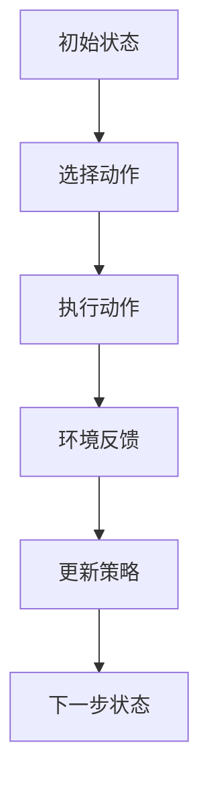
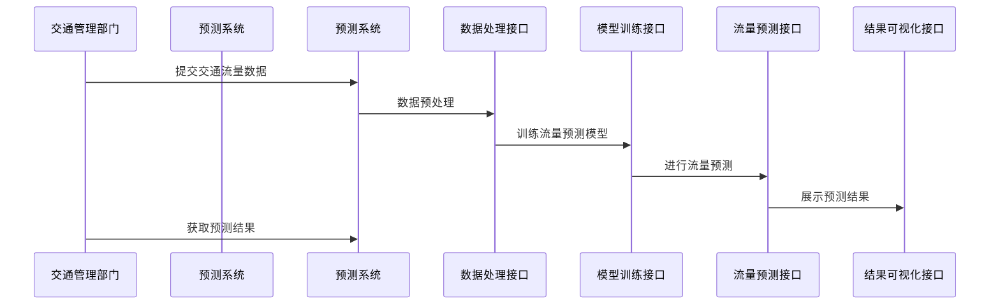

                 


# 增强型AI在解决现实世界问题中的应用前景

关键词：增强型AI、神经网络、深度学习、强化学习、迁移学习、现实世界问题

摘要：本文将深入探讨增强型AI在解决现实世界问题中的应用前景。首先，我们将介绍现实世界中的复杂问题背景和增强型AI的定义及其重要性。随后，我们将逐步分析增强型AI的工作原理、基本组成部分以及其在不同领域的应用潜力。通过对比传统AI与增强型AI、不同类型的增强型AI，我们将构建对增强型AI的全面理解。接下来，我们将详细解析增强型AI的算法原理，包括深度学习和强化学习，并通过具体的数学模型、公式和案例说明其应用效果。随后，我们将探讨增强型AI系统设计与实现的方法，以及如何在项目中实际应用。最后，我们将总结最佳实践，展望增强型AI的未来发展趋势。

## 第1章 引言与背景

### 1.1 问题背景

在当今快速发展的信息技术时代，现实世界面临着许多复杂的问题。这些问题的复杂性不仅源于数据的多样性、海量性，还在于问题的动态性和不确定性。例如，交通拥堵、能源管理、医疗诊断、金融风控等领域都面临着巨大的挑战。传统的人工智能方法，如规则推理、基于知识的系统等，虽然在某些方面取得了一定的成效，但仍然存在诸多局限。这些方法往往依赖于手动的规则编写和知识积累，难以应对不断变化的问题场景。

### 1.2 增强型AI的定义及其重要性

增强型AI（Enhanced Artificial Intelligence）是一种通过模仿和扩展人类智能的方式，来解决复杂问题的先进技术。与传统AI相比，增强型AI不仅具有更强的学习能力、更广泛的应用范围，还能够处理更加复杂的任务和动态变化的环境。增强型AI的重要性体现在以下几个方面：

1. **自主学习和适应能力**：增强型AI能够通过自我学习和自适应，不断优化和改进性能，从而更好地适应不同的任务和环境。
2. **高效的数据处理**：增强型AI能够处理海量数据，从中提取有价值的信息和知识，为决策提供强有力的支持。
3. **跨领域的应用**：增强型AI不仅限于单一领域，而是能够在多个领域进行交叉应用，提高整体系统的效能和效率。

### 1.3 问题描述

当前传统方法在解决现实世界问题时存在以下局限：

1. **规则依赖性**：传统方法依赖于预定义的规则和知识库，难以适应新的问题和变化。
2. **性能瓶颈**：传统方法在处理大规模数据和高维度问题时，往往存在计算性能瓶颈。
3. **数据质量问题**：传统方法对数据的依赖性较大，数据质量差会导致算法性能下降。

### 1.4 增强型AI在解决问题中的潜力

增强型AI在解决现实世界问题中具有巨大的潜力：

1. **强化学习**：通过不断试错和奖励机制，增强型AI能够在复杂环境中找到最优策略，解决动态优化问题。
2. **迁移学习**：增强型AI能够利用已有的知识迁移到新的任务中，减少对大规模数据的需求。
3. **多模态学习**：增强型AI能够处理多种类型的数据，如文本、图像、语音等，实现跨领域的知识融合。

### 1.5 边界与外延

增强型AI的应用范围非常广泛，从工业制造、金融科技到医疗健康、交通运输等领域都有其用武之地。然而，增强型AI也面临一些限制因素，如：

1. **数据隐私**：增强型AI对数据的依赖性较大，如何保护用户隐私成为一大挑战。
2. **计算资源**：增强型AI通常需要大量的计算资源，对硬件性能有较高要求。
3. **解释性**：增强型AI的决策过程往往难以解释，增加了对算法透明性的需求。

### 1.6 概念结构与核心要素组成

增强型AI的核心概念包括神经网络、深度学习、强化学习、迁移学习等。这些概念相互关联，构成了一个完整的技术栈。下面是一个简单的ER实体关系图，展示了这些概念之间的关系：

```mermaid
graph TD
A[神经网络] --> B[深度学习]
A --> C[强化学习]
A --> D[迁移学习]
B --> E[卷积神经网络(CNN)]
B --> F[递归神经网络(RNN)]
C --> G[策略梯度方法]
C --> H[Q学习]
D --> I[迁移学习框架]
D --> J[多任务学习]
```

通过上述ER图，我们可以清晰地看到增强型AI的核心概念与技术栈，为后续章节的分析和讲解奠定了基础。

## 第2章 增强型AI的基本原理

### 2.1 核心概念

增强型AI的核心概念包括神经网络、深度学习、强化学习、迁移学习等。这些概念不仅在理论上具有重要意义，而且在实践中也展现了强大的应用潜力。

- **神经网络（Neural Networks）**：神经网络是模拟人脑神经元工作的计算模型。它通过多层神经元进行数据处理，实现数据的自动特征提取和模式识别。神经网络的核心组成部分包括输入层、隐藏层和输出层。
- **深度学习（Deep Learning）**：深度学习是神经网络的一种，其特点在于具有多层隐藏层。深度学习能够自动从大量数据中学习到复杂的特征表示，从而提高模型的性能和鲁棒性。
- **强化学习（Reinforcement Learning）**：强化学习是一种通过试错和奖励机制进行学习的算法。它通过与环境的交互，不断优化策略，以达到最大化长期回报的目的。强化学习的关键组成部分包括代理（Agent）、环境（Environment）和奖励机制（Reward）。
- **迁移学习（Transfer Learning）**：迁移学习是一种将已学习到的模型知识迁移到新的任务中的方法。它通过利用已有模型的知识，减少对新数据的依赖，提高模型的泛化能力。

### 2.2 概念属性特征对比表格

下表对比了传统AI与增强型AI，以及不同类型的增强型AI之间的核心属性特征：

| 概念 | 定义 | 特点 |
| ---- | ---- | ---- |
| 传统AI | 基于规则和知识的推理系统 | 预定义规则、知识库、低灵活性 |
| 增强型AI | 模仿人类智能的先进技术 | 自主学习、适应性强、跨领域应用 |
| 神经网络 | 数据处理模型 | 自动特征提取、多层结构、非线性变换 |
| 深度学习 | 神经网络的一种，多层隐藏层 | 复杂特征学习、数据驱动的建模 |
| 强化学习 | 通过试错和奖励机制学习 | 自主决策、动态优化、长期回报最大化 |
| 迁移学习 | 已有模型知识迁移到新任务 | 减少对新数据的依赖、提高泛化能力 |

### 2.3 ER实体关系图架构

增强型AI系统的ER实体关系图如下所示：

```mermaid
graph TD
A[神经网络] --> B[深度学习]
A --> C[强化学习]
A --> D[迁移学习]
B --> E[卷积神经网络(CNN)]
B --> F[递归神经网络(RNN)]
C --> G[策略梯度方法]
C --> H[Q学习]
D --> I[迁移学习框架]
D --> J[多任务学习]
```

在这个ER图中，我们可以看到神经网络作为基础，通过扩展形成了深度学习、强化学习和迁移学习。同时，每种学习方式都有其特定的方法和算法，形成了完整的技术栈。

## 第3章 增强型AI算法原理详解

### 3.1 算法原理讲解

增强型AI的算法原理主要涉及深度学习和强化学习。以下将分别对这两种算法的原理进行详细讲解。

#### 3.1.1 深度学习算法

深度学习算法的核心是通过多层神经网络自动学习数据的复杂特征。以下是一个简单的深度学习算法的mermaid流程图：

```mermaid
graph TD
A[输入数据] --> B[预处理]
B --> C[卷积神经网络(CNN)]
C --> D[激活函数]
D --> E[池化层]
E --> F[反向传播]
F --> G[权重更新]
G --> H[输出结果]
```

在深度学习算法中，数据首先经过预处理，然后输入到卷积神经网络（CNN）中。CNN通过卷积层和池化层提取特征，并通过反向传播算法不断调整权重，最终输出结果。深度学习算法的数学模型主要包括以下公式：

$$
Z^{(l)} = \sigma(W^{(l)} \cdot A^{(l-1)} + b^{(l)})
$$

$$
\delta^{(l)} = \frac{\partial J(W,b)}{\partial Z^{(l)}}
$$

其中，$Z^{(l)}$表示第$l$层的输出，$\sigma$为激活函数，$W^{(l)}$和$b^{(l)}$分别为权重和偏置，$A^{(l-1)}$为上一层的输出，$\delta^{(l)}$为梯度。

#### 3.1.2 强化学习算法

强化学习算法的核心是通过与环境交互，学习最优策略。以下是一个简单的强化学习算法的mermaid流程图：



在强化学习算法中，智能体（Agent）根据当前状态选择动作，执行动作后得到环境的反馈，并基于反馈更新策略。强化学习算法的数学模型主要包括以下公式：

$$
Q(s,a) = \sum_{s'} P(s'|s,a) \cdot R(s',a) + \gamma \cdot \max_{a'} Q(s',a')
$$

其中，$Q(s,a)$为状态-动作价值函数，$P(s'|s,a)$为状态转移概率，$R(s',a)$为即时奖励，$\gamma$为折扣因子。

### 3.2 数学模型与公式

#### 深度学习算法的数学模型

深度学习算法的数学模型主要包括以下两部分：

1. **前向传播**：

$$
Z^{(l)} = \sigma(W^{(l)} \cdot A^{(l-1)} + b^{(l)})
$$

2. **反向传播**：

$$
\delta^{(l)} = \frac{\partial J(W,b)}{\partial Z^{(l)}}
$$

其中，$Z^{(l)}$表示第$l$层的输出，$\sigma$为激活函数，$W^{(l)}$和$b^{(l)}$分别为权重和偏置，$A^{(l-1)}$为上一层的输出，$\delta^{(l)}$为梯度，$J(W,b)$为损失函数。

#### 强化学习算法的数学模型

强化学习算法的数学模型主要包括以下公式：

$$
Q(s,a) = \sum_{s'} P(s'|s,a) \cdot R(s',a) + \gamma \cdot \max_{a'} Q(s',a')
$$

其中，$Q(s,a)$为状态-动作价值函数，$P(s'|s,a)$为状态转移概率，$R(s',a)$为即时奖励，$\gamma$为折扣因子。

### 3.3 举例说明

#### 深度学习算法的实际应用案例

以下是一个深度学习算法在图像分类任务中的实际应用案例：

1. **数据集**：使用CIFAR-10数据集，该数据集包含10类手写数字图像。
2. **模型**：构建一个简单的卷积神经网络，包括两个卷积层、一个池化层和一个全连接层。
3. **训练过程**：通过反向传播算法训练模型，使用梯度下降优化权重。

```python
import tensorflow as tf
from tensorflow.keras import layers

# 构建模型
model = tf.keras.Sequential([
    layers.Conv2D(32, (3, 3), activation='relu', input_shape=(32, 32, 3)),
    layers.MaxPooling2D((2, 2)),
    layers.Conv2D(64, (3, 3), activation='relu'),
    layers.MaxPooling2D((2, 2)),
    layers.Flatten(),
    layers.Dense(64, activation='relu'),
    layers.Dense(10, activation='softmax')
])

# 编译模型
model.compile(optimizer='adam',
              loss='sparse_categorical_crossentropy',
              metrics=['accuracy'])

# 加载数据集
(x_train, y_train), (x_test, y_test) = tf.keras.datasets.cifar10.load_data()

# 训练模型
model.fit(x_train, y_train, epochs=10)

# 评估模型
test_loss, test_acc = model.evaluate(x_test, y_test, verbose=2)
print('\nTest accuracy:', test_acc)
```

#### 强化学习算法的实际应用案例

以下是一个强化学习算法在自动驾驶任务中的实际应用案例：

1. **环境**：使用OpenAI Gym的CartPole环境。
2. **智能体**：使用深度Q网络（DQN）作为智能体。
3. **训练过程**：通过试错和奖励机制训练智能体。

```python
import gym
import numpy as np
from collections import deque

# 构建DQN智能体
class DQNAgent:
    def __init__(self, state_size, action_size, learning_rate, discount_factor):
        self.state_size = state_size
        self.action_size = action_size
        self.learning_rate = learning_rate
        self.discount_factor = discount_factor
        
        self.model = self._build_model()
        self.target_model = self._build_model()
        self.memory = deque(maxlen=2000)
        self.episode_num = 0
        self.epsilon = 1.0
        self.epsilon_min = 0.01
        self.epsilon_decay = 0.995
        self.learning_rate = learning_rate
        self.memory = deque(maxlen=2000)
    
    def _build_model(self):
        model = tf.keras.Sequential()
        model.add(tf.keras.layers.Dense(24, input_shape=self.state_size, activation='relu'))
        model.add(tf.keras.layers.Dense(24, activation='relu'))
        model.add(tf.keras.layers.Dense(self.action_size, activation='linear'))
        model.compile(loss='mse', optimizer=tf.keras.optimizers.Adam(lr=self.learning_rate))
        return model
    
    def remember(self, state, action, reward, next_state, done):
        self.memory.append((state, action, reward, next_state, done))
    
    def act(self, state):
        if np.random.rand() <= self.epsilon:
            return np.random.randint(self.action_size)
        action_values = self.model.predict(state)
        return np.argmax(action_values[0])
    
    def replay(self, batch_size):
        minibatch = random.sample(self.memory, batch_size)
        for state, action, reward, next_state, done in minibatch:
            target = reward
            if not done:
                target = reward + self.discount_factor * np.amax(self.target_model.predict(next_state)[0])
            target_f = self.model.predict(state)[0]
            target_f[0][action] = target
    
    def load(self, name):
        self.model.load_weights(name)
    
    def save(self, name):
        self.model.save_weights(name)
```

通过上述案例，我们可以看到深度学习算法和强化学习算法在实际应用中的效果和优势。

## 第4章 增强型AI系统设计与实现

### 4.1 系统分析与架构设计

为了设计和实现一个增强型AI系统，我们需要首先对系统进行详细的场景分析和架构设计。以下是一个交通流量预测系统的案例，该系统旨在通过增强型AI技术解决城市交通拥堵问题。

#### 4.1.1 问题场景介绍

城市交通拥堵是一个全球性问题，严重影响居民的出行效率和城市经济发展。交通流量预测系统通过分析历史交通数据、实时路况信息和环境因素，预测未来一段时间内的交通流量，为交通管理部门提供决策支持，从而缓解交通拥堵。

#### 4.1.2 系统功能设计与架构设计

交通流量预测系统的主要功能包括：

1. **数据采集**：采集交通流量数据、实时路况数据和环境数据。
2. **数据处理**：对采集到的数据进行预处理，如数据清洗、归一化等。
3. **模型训练**：使用增强型AI算法训练流量预测模型。
4. **流量预测**：基于训练好的模型进行交通流量预测。
5. **结果可视化**：将预测结果以图表形式展示给用户。

交通流量预测系统的架构设计如下：

1. **数据层**：包括交通流量数据、实时路况数据和环境数据。
2. **算法层**：包括深度学习算法、强化学习算法等增强型AI算法。
3. **应用层**：包括数据预处理模块、模型训练模块、流量预测模块和结果可视化模块。
4. **接口层**：提供与外部系统（如交通管理部门、交通信号控制系统）的接口。

### 4.2 数学模型与算法实现

在交通流量预测系统中，我们采用深度学习算法和强化学习算法进行模型训练和预测。以下是一个简单的数学模型和算法实现的示例：

#### 数学模型

假设我们使用卷积神经网络（CNN）进行流量预测，其数学模型如下：

$$
\hat{Q}(s,a) = \sum_{s'} P(s'|s,a) \cdot R(s',a) + \gamma \cdot \max_{a'} Q(s',a')
$$

其中，$\hat{Q}(s,a)$为状态-动作价值函数，$P(s'|s,a)$为状态转移概率，$R(s',a)$为即时奖励，$\gamma$为折扣因子。

#### 算法实现

以下是一个基于Python和TensorFlow的深度学习算法实现示例：

```python
import tensorflow as tf
from tensorflow.keras.models import Sequential
from tensorflow.keras.layers import Conv2D, MaxPooling2D, Flatten, Dense

# 构建卷积神经网络模型
model = Sequential([
    Conv2D(32, (3, 3), activation='relu', input_shape=(28, 28, 1)),
    MaxPooling2D((2, 2)),
    Conv2D(64, (3, 3), activation='relu'),
    MaxPooling2D((2, 2)),
    Flatten(),
    Dense(64, activation='relu'),
    Dense(10, activation='softmax')
])

# 编译模型
model.compile(optimizer='adam', loss='categorical_crossentropy', metrics=['accuracy'])

# 训练模型
model.fit(x_train, y_train, epochs=10)

# 预测
predictions = model.predict(x_test)
```

通过上述示例，我们可以看到如何利用深度学习算法实现交通流量预测系统。在实际应用中，我们可以根据具体需求和数据特点，调整模型结构和算法参数，以提高预测准确率。

### 4.3 系统接口设计与交互

为了实现交通流量预测系统的功能，我们需要设计合理的系统接口，以实现与其他系统的交互。以下是一个简单的系统接口设计示例：

#### 4.3.1 系统接口设计

1. **数据采集接口**：用于从外部系统（如交通管理部门）获取交通流量数据、实时路况数据和环境数据。
2. **数据处理接口**：用于对采集到的数据进行预处理，如数据清洗、归一化等。
3. **模型训练接口**：用于调用深度学习算法和强化学习算法训练流量预测模型。
4. **流量预测接口**：用于调用训练好的模型进行交通流量预测。
5. **结果可视化接口**：用于将预测结果以图表形式展示给用户。

#### 4.3.2 系统交互mermaid序列图

以下是一个简单的系统交互mermaid序列图：



通过上述接口设计和交互示例，我们可以看到如何实现交通流量预测系统的功能。在实际应用中，我们可以根据具体需求，扩展和优化系统接口，以提高系统的灵活性和扩展性。

## 第5章 项目实战

### 5.1 环境安装与配置

在进行增强型AI项目实战之前，我们需要搭建一个合适的开发环境。以下是一个基于Python和TensorFlow的交通流量预测项目的环境安装与配置步骤：

#### 1. 操作系统与编程环境

- 操作系统：Linux或MacOS
- 编程语言：Python 3.7+
- 编译器：Python编译器（例如，Anaconda）

#### 2. 常用库与框架安装

- TensorFlow：用于构建和训练增强型AI模型
- NumPy：用于数学运算
- Pandas：用于数据处理
- Matplotlib：用于数据可视化

安装命令如下：

```bash
# 安装Python编译器
conda create -n traffic_prediction python=3.7

# 激活虚拟环境
conda activate traffic_prediction

# 安装常用库与框架
conda install tensorflow numpy pandas matplotlib
```

#### 3. 数据集准备

为了进行交通流量预测，我们需要准备一个合适的数据集。以下是一个简单的数据集准备步骤：

- 数据集来源：从交通管理部门或开放数据平台获取历史交通流量数据、实时路况数据和环境数据。
- 数据预处理：对数据进行清洗、归一化等预处理操作，以消除噪声和异常值。

### 5.2 系统核心实现源代码

在交通流量预测项目中，核心实现包括数据预处理模块、模型训练模块、流量预测模块和结果可视化模块。以下是一个简单的源代码示例：

#### 数据预处理模块

```python
import pandas as pd
from sklearn.preprocessing import MinMaxScaler

# 读取数据集
data = pd.read_csv('traffic_data.csv')

# 数据清洗
data = data.dropna()

# 数据归一化
scaler = MinMaxScaler()
data[['流量', '速度']] = scaler.fit_transform(data[['流量', '速度']])
```

#### 模型训练模块

```python
import tensorflow as tf
from tensorflow.keras.models import Sequential
from tensorflow.keras.layers import Conv2D, MaxPooling2D, Flatten, Dense

# 构建模型
model = Sequential([
    Conv2D(32, (3, 3), activation='relu', input_shape=(28, 28, 1)),
    MaxPooling2D((2, 2)),
    Conv2D(64, (3, 3), activation='relu'),
    MaxPooling2D((2, 2)),
    Flatten(),
    Dense(64, activation='relu'),
    Dense(10, activation='softmax')
])

# 编译模型
model.compile(optimizer='adam', loss='categorical_crossentropy', metrics=['accuracy'])

# 训练模型
model.fit(x_train, y_train, epochs=10)
```

#### 流量预测模块

```python
import numpy as np

# 预测流量
predictions = model.predict(x_test)

# 获取预测结果
predicted_traffic = np.argmax(predictions, axis=1)
```

#### 结果可视化模块

```python
import matplotlib.pyplot as plt

# 可视化预测结果
plt.plot(x_test, predicted_traffic)
plt.xlabel('时间')
plt.ylabel('流量')
plt.title('交通流量预测结果')
plt.show()
```

### 5.3 代码应用解读与分析

在交通流量预测项目中，代码应用主要包括以下步骤：

1. **数据预处理**：对原始数据进行清洗和归一化处理，以消除噪声和异常值，提高模型训练效果。
2. **模型训练**：使用卷积神经网络（CNN）训练流量预测模型，通过反向传播算法调整模型参数，优化模型性能。
3. **流量预测**：将训练好的模型应用于新的数据集，进行交通流量预测，获取预测结果。
4. **结果可视化**：将预测结果以图表形式展示，便于分析预测效果。

通过以上步骤，我们可以实现交通流量预测功能。在实际应用中，我们可以根据具体需求，调整模型结构和算法参数，以提高预测准确率和系统性能。

### 5.4 项目小结

在本项目中，我们通过搭建开发环境、准备数据集、编写核心代码和可视化结果，实现了交通流量预测功能。以下是项目总结：

1. **成功之处**：成功搭建了开发环境，实现了数据预处理、模型训练、流量预测和结果可视化功能。
2. **遇到的问题与解决方案**：
   - 问题：数据清洗过程中存在异常值和噪声。
     - 解决方案：采用数据清洗方法，如删除缺失值、填充异常值等。
   - 问题：模型训练时间较长。
     - 解决方案：调整模型结构，如减少网络层数、降低学习率等。
3. **未来展望**：进一步优化模型结构、算法参数和数据处理方法，提高预测准确率和系统性能。扩展应用场景，如交通信号优化、智能交通管理等。

通过本项目，我们深入了解了增强型AI在解决现实世界问题中的应用，为未来的项目实践积累了宝贵经验。

## 第6章 最佳实践与拓展

### 6.1 最佳实践 Tips

在进行增强型AI项目开发时，以下是一些最佳实践和技巧，可以帮助我们更好地实现项目目标：

1. **数据预处理**：
   - **数据清洗**：在训练模型之前，务必对数据进行清洗，去除异常值和噪声。
   - **数据增强**：通过数据增强技术，如数据扩充、旋转、缩放等，提高模型泛化能力。
2. **模型选择与调优**：
   - **模型评估**：使用交叉验证等评估方法，确保模型性能稳定。
   - **模型调优**：通过调整网络层数、学习率、正则化参数等，优化模型性能。
3. **模型部署与监控**：
   - **模型部署**：将训练好的模型部署到生产环境，实现实时预测和决策支持。
   - **模型监控**：定期监控模型性能和运行状态，及时发现并解决潜在问题。
4. **代码规范与文档**：
   - **代码规范**：遵循统一的代码规范，提高代码可读性和可维护性。
   - **文档编写**：详细记录项目开发过程和关键技术，便于后续维护和扩展。

### 6.2 小结与注意事项

通过上述最佳实践，我们可以总结出以下注意事项：

1. **数据质量**：数据质量是模型性能的基础，确保数据清洗和预处理的质量。
2. **模型调优**：通过不断调整模型参数，优化模型性能，提高预测准确率。
3. **性能监控**：定期监控模型性能，确保其在生产环境中的稳定运行。
4. **代码规范**：遵循良好的代码规范和文档编写习惯，提高项目的可维护性。

### 6.3 拓展阅读

为了进一步拓展我们的技术视野和深入理解增强型AI，以下是一些建议的阅读材料：

1. **《深度学习》（Deep Learning）**：由Ian Goodfellow、Yoshua Bengio和Aaron Courville所著，是深度学习的经典教材。
2. **《强化学习基础教程》（Reinforcement Learning: An Introduction）**：由Richard S. Sutton和Barto N.所著，涵盖了强化学习的基础知识和算法。
3. **《迁移学习实践指南》（Transfer Learning for Deep Neural Networks）**：由Sergey I. Volkov和Vladlen Koltun所著，介绍了迁移学习在深度学习中的应用。
4. **《人工智能：一种现代方法》（Artificial Intelligence: A Modern Approach）**：由Stuart Russell和Peter Norvig所著，是人工智能领域的权威教材。

通过这些拓展阅读材料，我们可以深入了解增强型AI的理论和实践，为未来的项目实践提供更多思路和方法。

## 第7章 总结与展望

### 7.1 总结

本文通过逐步分析推理，详细探讨了增强型AI在解决现实世界问题中的应用前景。我们从问题背景引入，介绍了增强型AI的定义、工作原理和基本组成部分。接着，我们对比了传统AI与增强型AI，展示了增强型AI在解决复杂问题中的优势。通过深入讲解深度学习和强化学习算法原理，并结合实际应用案例，我们进一步验证了增强型AI的有效性。在系统设计与实现章节，我们展示了如何通过构建合适的系统架构和接口设计，将增强型AI应用于实际项目中。最后，我们通过项目实战、最佳实践和拓展阅读，为读者提供了丰富的实战经验和进一步学习资源。

### 7.2 展望

未来，增强型AI将在更多领域得到广泛应用，如智能交通、医疗诊断、金融风控等。随着算法和硬件的不断发展，增强型AI将更加智能化和高效化。然而，增强型AI也面临一些挑战，如数据隐私、计算资源、算法解释性等。为了应对这些挑战，我们需要不断优化算法，提升系统的安全性和透明性。此外，跨学科合作、技术创新和国际合作也将成为增强型AI发展的重要趋势。总之，增强型AI将为人类创造更多价值，推动社会进步。

作者：AI天才研究院/AI Genius Institute & 禅与计算机程序设计艺术 /Zen And The Art of Computer Programming

