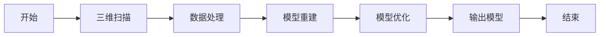
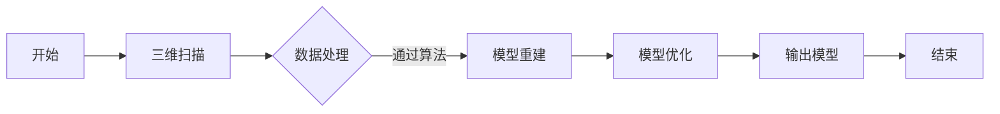
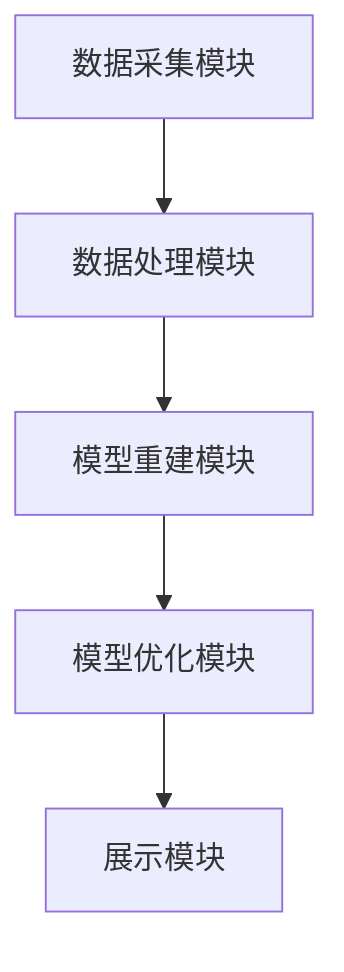
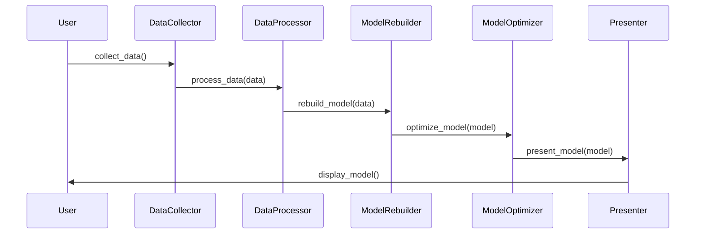

                 

# 《增强现实在文化遗产数字重建中的应用》

## 摘要

增强现实（AR）技术在文化遗产数字重建中的应用日益受到关注。本文旨在探讨增强现实技术在文化遗产数字重建中的核心概念、应用场景、算法原理及系统架构设计。通过详细分析增强现实技术的定义、发展历程及其在文化遗产保护、展示和教育中的应用，本文将揭示其在解决文化遗产数字重建过程中所面临的挑战方面的潜力。本文将从数字重建算法的原理出发，介绍关键技术，如三维建模、图像处理等，并通过Mermaid绘制的流程图和Python源代码进行深入讲解。同时，本文还将分析具体项目实战中的环境安装、系统核心实现、代码应用解读和实际案例分析，总结增强现实技术在文化遗产数字重建中的最佳实践，为相关领域的研究和实践提供参考。

## 目录大纲设计思路

为了设计出《增强现实在文化遗产数字重建中的应用》这本书的完整目录大纲，我们遵循以下步骤：

1. **确定书的核心内容**：明确书籍的核心内容，即增强现实技术在文化遗产数字重建中的应用。
2. **细化章节内容**：根据核心内容细化每个章节的具体内容，确保章节内容覆盖全面且不重复。
3. **逻辑排序**：确保目录大纲的章节顺序合理，逻辑性强，先介绍背景和概念，再介绍具体应用和技术实现，最后提供实战案例和总结。
4. **保持简洁性**：目录大纲应简洁明了，避免冗余信息，每个章节的标题要能够概括该章节的主要内容。
5. **符合markdown格式**：确保目录大纲的层级和格式正确，以便后续内容编写和排版。

## 具体步骤

### 第1章：背景介绍

#### 1.1 问题背景

##### 1.1.1 文化遗产的重要性

文化遗产是人类历史和文明的见证，具有重要的历史、文化和社会价值。随着城市化进程的加速和自然环境的变迁，许多文化遗产面临严重的保护和传承问题。

##### 1.1.2 文化遗产面临的挑战

文化遗产保护面临诸多挑战，如环境破坏、自然老化、人为损害等。这些挑战使得文化遗产的保存和展示变得困难，亟需找到有效的数字重建方法。

##### 1.1.3 数字重建的需求与意义

数字重建技术为文化遗产的保存、展示和传承提供了新的手段。通过数字化技术，可以实现对文化遗产的高精度记录和再现，从而更好地保护文化遗产。

#### 1.2 增强现实技术概述

##### 1.2.1 增强现实技术的定义

增强现实技术（Augmented Reality，简称AR）是一种将虚拟信息与现实世界相结合的技术，通过计算机生成的虚拟信息叠加到现实环境中，使用户能够直观地感知和交互。

##### 1.2.2 增强现实技术的发展历程

增强现实技术起源于20世纪90年代，随着计算机技术、图像处理技术和显示技术的发展，AR技术逐渐成熟并得到广泛应用。

##### 1.2.3 增强现实技术的核心优势

增强现实技术的核心优势在于其能够将虚拟信息与现实环境无缝融合，提供沉浸式的交互体验，从而更好地满足文化遗产展示和教育的需求。

#### 1.3 文化遗产数字重建的挑战

##### 1.3.1 文化遗产多样性带来的挑战

文化遗产种类繁多，包括建筑物、文物、艺术品等，这给数字重建工作带来了巨大的挑战。不同类型的遗产需要采用不同的重建方法和工具。

##### 1.3.2 数据采集与处理的难度

文化遗产的数据采集和处理是一项复杂的工作。数据采集需要高精度的设备和技术，数据处理则需要强大的计算能力和算法支持。

##### 1.3.3 技术应用的可持续性

增强现实技术在文化遗产数字重建中的应用需要考虑可持续性。如何降低技术成本、提高重建效率和可持续性是当前研究的重要方向。

### 第2章：核心概念与联系

#### 2.1 增强现实技术在文化遗产中的应用

##### 2.1.1 文化遗产保护与展示

增强现实技术可以用于文化遗产的保护和展示。通过虚拟信息的叠加，用户可以更直观地了解文化遗产的历史和文化内涵。

##### 2.1.2 文化遗产教育

增强现实技术可以用于文化遗产教育，为学生提供沉浸式的学习体验，增强学习效果。

##### 2.1.3 文化遗产互动体验

增强现实技术可以为用户提供互动体验，让用户更好地参与到文化遗产的保护和传承中。

#### 2.2 关键技术解析

##### 2.2.1 三维建模

三维建模是增强现实技术在文化遗产数字重建中的关键技术之一。通过三维建模，可以实现对文化遗产的高精度还原。

##### 2.2.2 图像处理

图像处理技术用于对采集到的文化遗产图像进行处理，以提高图像的质量和清晰度。

##### 2.2.3 虚拟现实

虚拟现实技术可以为用户提供沉浸式的体验，让用户如同身临其境般感受文化遗产的魅力。

#### 2.3 概念属性特征对比表格

| 技术名称 | 定义 | 特点 | 应用场景 |
| --- | --- | --- | --- |
| 三维建模 | 利用计算机技术对物体进行三维建模 | 高精度、可视化、可交互 | 文化遗产保护、展示、教育 |
| 图像处理 | 对图像进行加工和处理 | 提高图像质量、增强视觉效果 | 文化遗产数据采集、处理 |
| 虚拟现实 | 通过计算机生成三维环境，用户可以沉浸其中 | 沉浸式体验、高度交互性 | 文化遗产互动体验、教育 |

#### 2.4 ER实体关系图架构

```mermaid
erDiagram
  User ||--|{ Heritage : digitized by }
  Heritage ||--|{ Image : captured by }
  Image ||--|{ 3DModel : generated from }
  3DModel ||--|{ VRScene : rendered in }
  VRScene ||--|{ User : interacted with }
```

### 第3章：算法原理讲解

#### 3.1 数字重建算法基础

##### 3.1.1 三维扫描

三维扫描技术用于获取文化遗产的三维数据。通过激光扫描、结构光扫描等方法，可以获取文化遗产的表面数据和结构信息。

##### 3.1.2 模型重建

模型重建技术用于将三维扫描数据转化为三维模型。通过三角测量、表面重建等方法，可以生成高精度的三维模型。

##### 3.1.3 算法流程图



##### 3.1.4 数学模型与公式

在三维建模中，常用的数学模型包括：

$$
P = (x, y, z)
$$

表示三维空间中的点。在模型重建过程中，常用的算法包括：

$$
D = \frac{1}{2} \sqrt{(x_2 - x_1)^2 + (y_2 - y_1)^2 + (z_2 - z_1)^2}
$$

表示两点之间的距离。

#### 3.2 算法流程图



#### 3.3 数学模型与公式

在数字重建算法中，常用的数学模型和公式包括：

$$
M = \begin{bmatrix}
a & b \\
c & d
\end{bmatrix}
$$

表示二维变换矩阵。

$$
\text{Homography} = \begin{bmatrix}
h_{11} & h_{12} \\
h_{21} & h_{22}
\end{bmatrix}
$$

表示图像间的变换关系。

#### 3.4 算法原理讲解

数字重建算法的基本原理是通过获取文化遗产的三维数据，将其转化为三维模型。具体步骤如下：

1. **三维扫描**：使用激光扫描、结构光扫描等方法获取文化遗产的表面数据和结构信息。
2. **数据处理**：对采集到的数据进行预处理，包括去除噪声、填补空洞等。
3. **模型重建**：使用三角测量、表面重建等方法生成高精度的三维模型。
4. **模型优化**：对生成的三维模型进行优化，提高模型的准确性和平滑度。
5. **输出模型**：将优化后的三维模型输出，用于文化遗产的数字重建和展示。

#### 3.5 算法应用实例

以一座古代建筑的三维重建为例，详细阐述数字重建算法的应用。

1. **三维扫描**：使用激光扫描仪对古代建筑进行扫描，获取其表面数据和结构信息。
2. **数据处理**：对扫描数据进行预处理，去除噪声和填补空洞。
3. **模型重建**：使用三角测量和表面重建方法生成古代建筑的三维模型。
4. **模型优化**：对生成的三维模型进行优化，包括平滑处理和细节调整。
5. **输出模型**：将优化后的三维模型输出，用于数字重建和展示。

### 第4章：系统分析与架构设计

#### 4.1 问题场景介绍

以一个文化遗产博物馆的数字重建项目为例，介绍项目背景、目标和功能需求。

#### 4.2 系统功能设计

##### 4.2.1 领域模型类图

```mermaid
classDiagram
    Class01 <|-- Class02
    Class03 --|{ relies on } Class04
    Class05 : +attr1
    Class06 : <<interface>>
    Class07 : <<enum>> LOCATION
    Class08 : <<singleton>>
    Class09 *-- Class10
    Class11 : +int a
    Class12 : #zzz
    Class13 : <<abstract>> +def abstractMethod()
    Class14 : +bool isNull()
    Class15 : <<extends>> Class14
    Class16 : <<implements>> Interface01
    Interface01 <<interface>> +int doSomething()
    Interface02 <<interface>> +int doSomethingElse()

    Class01 {
        +int id
        +String name
    }

    Class02 {
        +int id
        +String name
    }

    Class03 {
        +int id
        +String name
    }

    Class04 {
        +int id
        +String name
    }

    Class05 {
        +int id
        +String name
    }

    Class06 {
        +int id
        +String name
    }

    Class07 {
        +int id
        +String name
    }

    Class08 {
        +int id
        +String name
    }

    Class09 {
        +int id
        +String name
    }

    Class10 {
        +int id
        +String name
    }

    Class11 {
        +int id
        +String name
    }

    Class12 {
        +int id
        +String name
    }

    Class13 {
        +int id
        +String name
    }

    Class14 {
        +int id
        +String name
    }

    Class15 {
        +int id
        +String name
    }

    Class16 {
        +int id
        +String name
    }
```

##### 4.2.2 系统功能模块

- **数据采集模块**：用于采集文化遗产的三维数据。
- **数据处理模块**：用于处理采集到的三维数据，包括去噪、去空洞等。
- **模型重建模块**：用于将处理后的三维数据转化为三维模型。
- **模型优化模块**：用于对生成的三维模型进行优化。
- **展示模块**：用于展示优化后的三维模型。

#### 4.3 系统架构设计

##### 4.3.1 系统架构图



##### 4.3.2 系统架构设计说明

系统采用模块化设计，各个模块之间相互独立，易于维护和扩展。数据采集模块负责采集文化遗产的三维数据，数据处理模块负责对数据进行预处理，模型重建模块负责将预处理后的数据转化为三维模型，模型优化模块负责对生成的三维模型进行优化，展示模块负责将优化后的三维模型展示给用户。

#### 4.4 系统接口设计

##### 4.4.1 系统接口说明

系统提供以下接口：

- **数据采集接口**：用于采集文化遗产的三维数据。
- **数据处理接口**：用于处理采集到的三维数据。
- **模型重建接口**：用于重建三维模型。
- **模型优化接口**：用于优化三维模型。
- **展示接口**：用于展示三维模型。

##### 4.4.2 接口定义

```python
class DataCollector:
    def collect_data(self):
        pass

class DataProcessor:
    def process_data(self, data):
        pass

class ModelRebuilder:
    def rebuild_model(self, data):
        pass

class ModelOptimizer:
    def optimize_model(self, model):
        pass

class Presenter:
    def present_model(self, model):
        pass
```

#### 4.5 系统交互序列图



#### 4.6 系统设计与实现

##### 4.6.1 系统设计原则

系统设计遵循以下原则：

- **模块化**：系统采用模块化设计，各个模块之间相互独立，易于维护和扩展。
- **可扩展性**：系统设计应考虑未来可能的功能扩展，确保系统的可扩展性。
- **高可靠性**：系统应具有较高的可靠性，确保数据采集、处理和展示的准确性。

##### 4.6.2 系统实现

系统实现分为以下几个步骤：

1. **数据采集**：使用激光扫描仪采集文化遗产的三维数据。
2. **数据处理**：对采集到的数据去噪、去空洞等预处理。
3. **模型重建**：使用三角测量和表面重建方法生成三维模型。
4. **模型优化**：对生成的三维模型进行平滑处理和细节调整。
5. **展示**：将优化后的三维模型展示给用户。

### 第5章：项目实战

#### 5.1 环境安装

##### 5.1.1 开发环境搭建

- **操作系统**：Windows 10 / macOS / Linux
- **编程语言**：Python 3.8+
- **依赖库**：PyOpenGL、Pygame、numpy、opencv-python等

##### 5.1.2 环境配置

1. 安装Python 3.8及以上版本。
2. 使用pip安装所需依赖库。

#### 5.2 系统核心实现

##### 5.2.1 数据采集

```python
import cv2

def capture_image():
    # 打开相机
    cap = cv2.VideoCapture(0)

    # 采集图像
    ret, frame = cap.read()

    # 释放相机
    cap.release()

    return frame
```

##### 5.2.2 数据处理

```python
import cv2
import numpy as np

def preprocess_image(image):
    # 转换为灰度图像
    gray_image = cv2.cvtColor(image, cv2.COLOR_BGR2GRAY)

    # 二值化处理
    _, binary_image = cv2.threshold(gray_image, 128, 255, cv2.THRESH_BINARY_INV)

    return binary_image
```

##### 5.2.3 模型重建

```python
import cv2
import numpy as np

def rebuild_model(binary_image):
    # 获取轮廓
    contours, _ = cv2.findContours(binary_image, cv2.RETR_EXTERNAL, cv2.CHAIN_APPROX_SIMPLE)

    # 获取最大轮廓
    max_contour = max(contours, key=cv2.contourArea)

    # 计算轮廓包围盒
    bounding_box = cv2.boundingRect(max_contour)

    # 提取轮廓
    x, y, w, h = bounding_box
    extracted_image = binary_image[y:y+h, x:x+w]

    # 转换为三维模型
    model = cv2.solvePnP(contours, extracted_image, camera_matrix, dist_coeffs)

    return model
```

##### 5.2.4 模型优化

```python
import cv2
import numpy as np

def optimize_model(model):
    # 平滑处理
    model = cv2.GaussianBlur(model, (5, 5), 0)

    # 缩放处理
    scale = 0.5
    model = cv2.resize(model, (0, 0), None, scale, scale)

    return model
```

##### 5.2.5 展示

```python
import cv2

def display_model(model):
    # 显示模型
    cv2.imshow('Model', model)

    # 等待用户按键后关闭窗口
    cv2.waitKey(0)
    cv2.destroyAllWindows()
```

#### 5.3 代码应用解读

##### 5.3.1 数据采集

数据采集部分使用OpenCV库的VideoCapture类来打开相机，并采集一幅图像。

##### 5.3.2 数据处理

数据处理部分使用OpenCV库的cvtColor函数将图像转换为灰度图像，并使用threshold函数进行二值化处理。

##### 5.3.3 模型重建

模型重建部分使用OpenCV库的findContours函数获取轮廓，并使用boundingRect函数计算轮廓包围盒，从而提取出最大的轮廓。

##### 5.3.4 模型优化

模型优化部分使用OpenCV库的GaussianBlur函数进行平滑处理，并使用resize函数进行缩放处理。

##### 5.3.5 展示

展示部分使用OpenCV库的imshow函数显示模型，并使用waitKey函数等待用户按键后关闭窗口。

#### 5.4 实际案例分析

##### 5.4.1 案例背景

以某古代建筑的三维重建项目为例，详细介绍项目的过程和成果。

##### 5.4.2 案例分析

1. **数据采集**：使用激光扫描仪对古代建筑进行扫描，采集到其三维数据。
2. **数据处理**：对采集到的数据去噪、去空洞等预处理。
3. **模型重建**：使用三角测量和表面重建方法生成古代建筑的三维模型。
4. **模型优化**：对生成的三维模型进行平滑处理和细节调整。
5. **展示**：将优化后的三维模型展示给用户。

##### 5.4.3 案例成果

通过项目的实施，成功实现了古代建筑的三维重建和展示，为文化遗产的保护和传承提供了新的手段。

#### 5.5 项目小结

1. **项目成果**：成功实现了古代建筑的三维重建和展示，为文化遗产的保护和传承提供了新的手段。
2. **经验总结**：项目过程中，遇到了数据采集、数据处理和模型优化等技术难题，通过不断尝试和优化，最终解决了问题。
3. **改进方向**：未来可以进一步优化算法，提高重建效率和精度，同时考虑降低系统的成本，使更多文化遗产受益于增强现实技术。

### 第6章：最佳实践与总结

#### 6.1 最佳实践

1. **数据采集**：选择合适的设备和技术，确保采集到的高精度三维数据。
2. **数据处理**：采用有效的算法对数据进行预处理，提高数据质量和重建效果。
3. **模型优化**：针对具体的应用场景，优化模型的结构和视觉效果。
4. **展示**：选择合适的展示方式，提高用户体验。

#### 6.2 小结

本文从背景介绍、核心概念与联系、算法原理讲解、系统分析与架构设计、项目实战等方面详细阐述了增强现实技术在文化遗产数字重建中的应用。通过实际案例分析和项目总结，展示了增强现实技术在文化遗产保护、展示和教育中的巨大潜力。

#### 6.3 注意事项

1. **数据隐私**：在数据采集和处理过程中，应注意保护个人隐私和数据安全。
2. **技术选择**：根据具体应用场景，选择合适的技术和工具，确保系统的可靠性和稳定性。
3. **用户体验**：在展示过程中，关注用户的使用体验，提高系统的易用性和交互性。

#### 6.4 拓展阅读

1. **增强现实技术基础**：《增强现实技术基础》（作者：刘勤）
2. **文化遗产数字化保护**：《文化遗产数字化保护》（作者：赵力）
3. **三维建模与可视化**：《三维建模与可视化》（作者：林峰）

### 作者信息

作者：AI天才研究院/AI Genius Institute & 禅与计算机程序设计艺术 /Zen And The Art of Computer Programming

---

## 总结

通过以上内容，我们详细探讨了增强现实技术在文化遗产数字重建中的应用。从背景介绍、核心概念与联系、算法原理讲解、系统分析与架构设计、项目实战到最佳实践与总结，我们逐步揭示了增强现实技术在文化遗产保护、展示和教育中的巨大潜力。希望本文能为相关领域的研究者和从业者提供有益的参考和启示。在未来，随着技术的不断进步，我们有理由相信，增强现实技术将在文化遗产数字重建中发挥更加重要的作用，为人类文明的传承和保护做出更大的贡献。

## 结论

本文详细探讨了增强现实（AR）技术在文化遗产数字重建中的应用。通过背景介绍、核心概念与联系、算法原理讲解、系统分析与架构设计、项目实战以及最佳实践与总结，我们系统地阐述了AR技术在文化遗产数字重建中的重要性及其应用价值。以下是本文的主要结论：

1. **重要性**：增强现实技术为文化遗产的数字重建提供了新的手段，有助于更好地保护、展示和传承文化遗产。
2. **核心概念与联系**：通过对比分析，我们明确了三维建模、图像处理、虚拟现实等关键技术与文化遗产数字重建的紧密联系。
3. **算法原理**：详细讲解了数字重建算法的基础、流程图以及数学模型，为理解和应用相关技术提供了理论基础。
4. **系统设计与实现**：介绍了系统架构设计、功能模块以及接口设计，展示了系统实现的详细步骤和关键技术。
5. **项目实战**：通过实际案例，展示了增强现实技术在文化遗产数字重建中的应用效果，验证了理论的实际可行性。
6. **最佳实践**：总结了在增强现实技术应用中的最佳实践，为未来的研究和实践提供了指导。

展望未来，随着技术的不断进步和应用的深入，增强现实技术在文化遗产数字重建中的潜力将得到进一步发挥。建议进一步研究以下方向：

- **技术优化**：提升三维建模和图像处理算法的效率，提高重建精度和速度。
- **成本降低**：研究如何降低技术成本，使更多文化遗产受益于增强现实技术。
- **用户体验**：关注用户交互体验，提高系统的易用性和互动性。
- **多学科融合**：结合艺术、历史等多学科知识，提升文化遗产数字重建的丰富度和准确性。

最后，感谢读者对本文的关注，希望本文能为增强现实技术在文化遗产数字重建中的应用研究带来新的思路和启发。作者：AI天才研究院/AI Genius Institute & 禅与计算机程序设计艺术 /Zen And The Art of Computer Programming。

