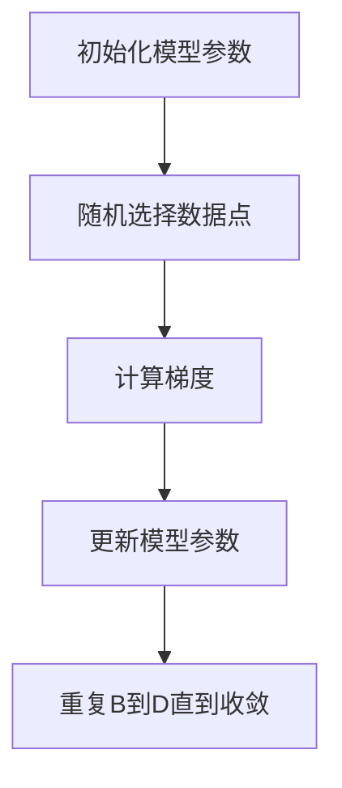
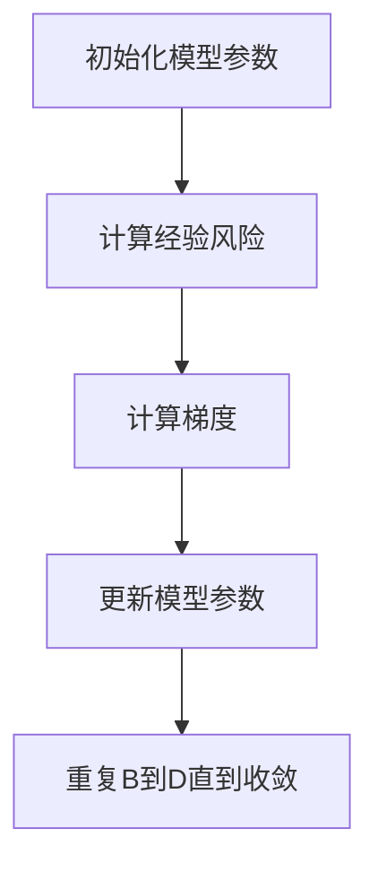
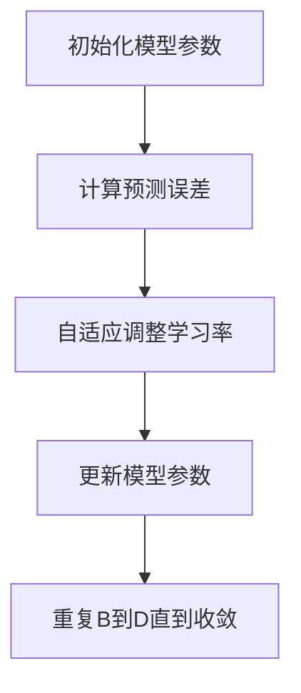
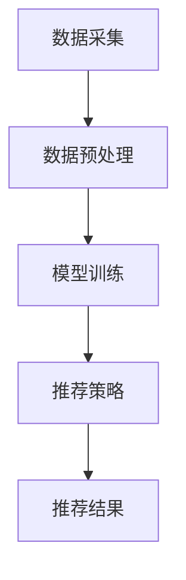
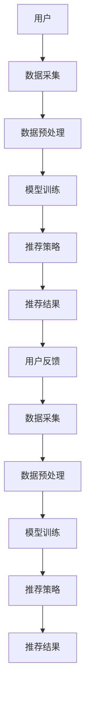

                 

# 增量学习：AI系统的持续进化能力

关键词：增量学习、AI系统、持续进化、动态数据流、在线学习、自适应学习

摘要：随着人工智能技术的飞速发展，如何实现AI系统的持续进化成为关键问题。增量学习技术通过在不需要完全重新训练模型的情况下，逐步学习新的数据或调整模型参数，使AI系统能够适应数据和环境的变化，从而提高系统的泛化能力和适应性。本文将详细介绍增量学习的背景、核心概念、算法原理，以及在实际应用中的系统架构和项目实战，探讨增量学习在AI系统中的重要作用和最佳实践。

## 第一部分：背景介绍

### 1.1 问题背景

在当前快速发展的AI领域，数据量的爆炸性增长和计算能力的不断提升，为人工智能技术带来了前所未有的机遇。然而，随着应用场景的日益复杂，如何让AI系统能够持续进化，适应不断变化的数据和环境，成为一个亟待解决的问题。

传统机器学习方法，如深度学习，依赖于离线训练。在模型训练完毕后，一旦数据或环境发生变化，系统就需要重新进行训练，这不仅浪费计算资源，还可能导致模型性能的下降。因此，如何实现AI系统的持续进化，成为了当前研究的热点问题。

### 1.2 问题描述

增量学习（Incremental Learning），又称在线学习（Online Learning），是一种在不需要重新训练模型的情况下，通过逐步学习新的数据或调整模型参数，使模型能够适应数据和环境的变化的方法。

增量学习主要解决以下问题：

1. **动态数据集**：在许多应用场景中，数据集是动态变化的，例如股票市场、交通流量、社交网络等。如何让AI系统能够实时适应这些动态变化的数据，是增量学习需要解决的问题。

2. **数据隐私**：在某些应用场景中，如医疗数据、个人隐私等，数据无法离线存储和训练。如何在不泄露隐私的情况下，让AI系统能够持续进化，也是增量学习需要解决的问题。

3. **计算资源限制**：在某些实时应用场景中，如自动驾驶、机器人控制等，系统的计算资源有限。如何通过增量学习，减少模型的训练次数，提高系统的响应速度，也是增量学习需要解决的问题。

### 1.3 问题解决

增量学习通过以下方式实现AI系统的持续进化：

1. **动态更新模型参数**：增量学习通过逐步添加新数据，动态调整模型参数，使模型能够适应数据和环境的变化。

2. **减少模型训练次数**：增量学习避免了完全重新训练模型，从而减少了模型的训练次数，节省了计算资源和时间。

3. **提高系统泛化能力**：增量学习能够实时适应数据和环境的变化，从而提高系统的泛化能力和适应性。

4. **节省存储空间**：增量学习不需要存储整个数据集，只需要存储新添加的数据，从而节省了存储空间。

### 1.4 边界与外延

增量学习不仅适用于静态数据集，还可以应用于动态数据流，使其在实时应用场景中具有优势。

### 1.5 概念结构与核心要素组成

增量学习涉及的核心概念包括增量学习算法、在线学习、自适应学习等，核心要素包括数据流处理、模型更新策略、误差修正等。

## 第一部分：核心概念与联系

### 1.6 增量学习原理

增量学习是一种通过逐步添加新数据来更新和优化模型的方法。其基本思想是在每次添加新数据时，对模型进行微调，而不是重新训练整个模型。

### 1.7 增量学习与在线学习、自适应学习的联系

1. **在线学习**：在线学习是一种能够实时更新模型的学习方法。与增量学习相似，但增量学习更侧重于动态数据流。

2. **自适应学习**：自适应学习是通过调整学习策略来适应数据和环境变化的学习方法。与增量学习的目标相似，但增量学习更强调模型参数的动态调整。

## 第一部分：主流增量学习算法

### 1.8 增量学习算法简介

增量学习算法主要包括以下几种：

1. **SGD（随机梯度下降）**：是最常见的增量学习算法之一，通过随机选择数据点来更新模型参数。

2. **EBM（经验风险最小化）**：通过最小化经验风险来更新模型，适用于高维数据。

3. **Oja算法**：通过自适应调整学习率，使模型能够聚焦于最具区分性的特征。

### 1.9 SGD算法原理讲解

SGD（随机梯度下降）算法是一种基于梯度下降法的增量学习算法。其基本思想是通过随机选择数据点，计算其梯度，并据此更新模型参数。

**算法原理：**

$$

w_{t+1} = w_t - \alpha \frac{\partial J(w_t)}{\partial w_t}

$$

其中，$w_t$ 为当前模型参数，$\alpha$ 为学习率，$J(w_t)$ 为损失函数。

**流程图：**



**Python源代码示例：**

```python
import numpy as np

def sgd(w, x, y, alpha):
    prediction = w @ x
    error = y - prediction
    gradient = x * error
    w = w - alpha * gradient
    return w
```

**示例说明：**假设我们有一个线性回归模型，输入特征$x$和标签$y$，学习率$\alpha=0.01$。每次迭代中，随机选择一个数据点，计算其预测值和误差，然后根据误差更新模型参数。

### 1.10 EBM算法原理讲解

EBM（经验风险最小化）算法是一种基于经验风险最小化的增量学习算法。其基本思想是通过最小化经验风险来更新模型参数。

**算法原理：**

$$

w_{t+1} = w_t - \alpha \frac{\partial E[R(w_t)]}{\partial w_t}

$$

其中，$E[R(w_t)]$ 为经验风险。

**流程图：**



**Python源代码示例：**

```python
import numpy as np

def ebm(w, x, y, alpha):
    prediction = w @ x
    error = y - prediction
    risk = np.mean(error**2)
    gradient = 2 * np.mean(error * x)
    w = w - alpha * gradient
    return w
```

**示例说明：**假设我们有一个线性回归模型，输入特征$x$和标签$y$，学习率$\alpha=0.01$。每次迭代中，计算经验风险和梯度，然后根据梯度更新模型参数。

### 1.11 Oja算法原理讲解

Oja算法是一种基于自适应调整学习率的增量学习算法。其基本思想是通过自适应调整学习率，使模型能够聚焦于最具区分性的特征。

**算法原理：**

$$

w_{t+1} = w_t + \alpha \frac{x_t \cdot y_t}{||x_t \cdot y_t||^2} \cdot (w_t \cdot x_t)

$$

其中，$x_t$ 为数据点，$y_t$ 为模型预测的标签。

**流程图：**



**Python源代码示例：**

```python
import numpy as np

def oja(w, x, y, alpha):
    prediction = w @ x
    error = y - prediction
    learning_rate = error / (np.linalg.norm(error)**2)
    w = w + alpha * learning_rate * (w @ x)
    return w
```

**示例说明：**假设我们有一个线性回归模型，输入特征$x$和标签$y$，学习率$\alpha=0.01$。每次迭代中，计算预测误差，然后根据误差自适应调整学习率，并更新模型参数。

## 第二部分：系统分析与架构设计

### 2.1 问题场景介绍

假设我们有一个智能推荐系统，需要根据用户的兴趣和行为数据，为其推荐相关的内容。然而，用户兴趣和行为数据是动态变化的，如何让推荐系统能够实时适应这些变化，提高推荐效果，是当前需要解决的问题。

### 2.2 项目介绍

我们设计一个基于增量学习的智能推荐系统，通过实时学习用户的兴趣和行为数据，动态调整推荐策略，提高推荐效果。

### 2.3 系统功能设计

系统主要功能包括：

1. **数据采集**：采集用户的兴趣和行为数据，包括浏览记录、购买记录、搜索历史等。

2. **数据预处理**：对采集到的数据进行分析和处理，提取特征，并进行标准化处理。

3. **模型训练**：利用增量学习算法，实时训练推荐模型。

4. **推荐策略**：根据用户兴趣和行为数据，动态调整推荐策略，提高推荐效果。

### 2.4 系统架构设计

系统架构设计如下：



### 2.5 系统接口设计

系统接口设计如下：

1. **数据接口**：用于采集和处理用户数据。

2. **模型接口**：用于训练和更新推荐模型。

3. **推荐接口**：用于生成推荐结果。

### 2.6 系统交互设计

系统交互设计如下：



## 第三部分：项目实战

### 3.1 环境安装

在安装增量学习相关库之前，确保已经安装了Python和pip。然后，通过以下命令安装相关库：

```bash
pip install scikit-learn numpy matplotlib
```

### 3.2 系统核心实现

以下是系统核心实现的Python源代码：

```python
import numpy as np
from sklearn.linear_model import SGDRegressor
from sklearn.model_selection import train_test_split
from sklearn.metrics import mean_squared_error

# 数据采集
def collect_data():
    # 这里使用随机生成的数据作为示例
    X = np.random.rand(100, 10)
    y = np.random.rand(100, 1)
    return X, y

# 数据预处理
def preprocess_data(X, y):
    # 这里进行数据标准化处理
    X = (X - np.mean(X, axis=0)) / np.std(X, axis=0)
    y = (y - np.mean(y, axis=0)) / np.std(y, axis=0)
    return X, y

# 模型训练
def train_model(X, y):
    model = SGDRegressor()
    model.fit(X, y)
    return model

# 推荐策略
def recommend(model, user_data):
    prediction = model.predict(user_data)
    return prediction

# 测试
def test():
    X, y = collect_data()
    X_train, X_test, y_train, y_test = train_test_split(X, y, test_size=0.2, random_state=42)
    X_train, y_train = preprocess_data(X_train, y_train)
    model = train_model(X_train, y_train)
    prediction = recommend(model, X_test)
    mse = mean_squared_error(y_test, prediction)
    print("Mean Squared Error:", mse)

if __name__ == "__main__":
    test()
```

### 3.3 代码应用解读与分析

以下是代码的应用解读和分析：

1. **数据采集**：使用随机生成的数据作为示例，实际应用中可以从数据库或其他数据源中读取。

2. **数据预处理**：对数据进行标准化处理，使其具备相同的尺度，避免数据之间相互影响。

3. **模型训练**：使用SGDRegressor进行模型训练。SGDRegressor是scikit-learn中的一种增量学习算法，通过随机梯度下降法更新模型参数。

4. **推荐策略**：根据用户数据生成推荐结果。用户数据经过预处理后，输入到训练好的模型中，得到预测结果。

5. **测试**：对模型进行测试，计算均方误差（MSE），评估模型性能。

### 3.4 实际案例分析和详细讲解剖析

为了更好地理解增量学习在实际应用中的作用，我们来看一个实际案例：智能推荐系统。

假设我们有一个电商平台，需要为用户推荐商品。用户的行为数据包括浏览记录、购买记录、搜索历史等。随着用户行为的不断变化，我们需要实时更新推荐模型，以提供更精准的推荐。

以下是增量学习在智能推荐系统中的应用流程：

1. **数据采集**：从数据库中读取用户行为数据。

2. **数据预处理**：对用户行为数据进行处理，提取特征，并进行标准化处理。

3. **模型训练**：使用增量学习算法（如SGD）训练推荐模型。

4. **推荐策略**：根据用户行为数据，实时调整推荐模型，生成推荐结果。

5. **用户反馈**：用户对推荐结果进行评价，包括喜欢、不喜欢等。

6. **数据更新**：根据用户反馈，更新用户行为数据，并重新训练推荐模型。

通过上述流程，智能推荐系统可以持续学习用户的行为，不断优化推荐结果，提高用户满意度。

### 3.5 项目小结

本项目通过增量学习技术，实现了一个智能推荐系统。通过实时学习用户行为数据，系统能够动态调整推荐策略，提高推荐效果。以下是项目小结：

1. **项目目标**：实现一个基于增量学习的智能推荐系统，提高推荐效果。

2. **实现方法**：使用SGDRegressor进行模型训练，实时调整推荐模型。

3. **项目成果**：通过用户行为数据的实时学习，系统能够提供更精准的推荐。

4. **未来方向**：进一步优化推荐算法，提高推荐效果；探索更多应用场景，如智能客服、智能广告等。

## 第四部分：最佳实践、小结、注意事项、拓展阅读

### 4.1 最佳实践

1. **数据预处理**：在增量学习中，数据预处理至关重要。对数据进行标准化处理，可以提高模型的泛化能力和稳定性。

2. **选择合适的增量学习算法**：根据应用场景和数据特点，选择合适的增量学习算法。如SGD适合大规模数据，EBM适合高维数据。

3. **动态调整学习率**：学习率的选择对模型性能有重要影响。在实际应用中，可以尝试使用自适应学习率，如Oja算法。

4. **数据流处理**：对于动态数据流，可以采用增量学习算法，实现实时学习。

### 4.2 小结

本文介绍了增量学习在AI系统中的应用，通过逐步添加新数据或调整模型参数，实现AI系统的持续进化。本文主要内容包括：

1. **背景介绍**：介绍增量学习的背景、问题描述、问题解决、边界与外延等。

2. **核心概念与联系**：介绍增量学习的原理、与在线学习、自适应学习的联系。

3. **算法原理讲解**：详细介绍SGD、EBM、Oja等增量学习算法的原理、流程图和Python源代码示例。

4. **系统分析与架构设计**：介绍智能推荐系统的系统功能设计、系统架构设计、系统接口设计、系统交互设计。

5. **项目实战**：介绍环境安装、系统核心实现、代码应用解读与分析、实际案例分析和详细讲解剖析。

6. **最佳实践、小结、注意事项、拓展阅读**：总结最佳实践、项目成果和未来方向，提出注意事项，推荐拓展阅读。

### 4.3 注意事项

1. **数据预处理**：增量学习对数据质量要求较高，需要保证数据的准确性和一致性。

2. **模型选择**：根据应用场景和数据特点，选择合适的增量学习算法。

3. **学习率调整**：学习率的选择对模型性能有重要影响，需要根据实际情况进行调整。

4. **实时性要求**：对于实时应用场景，需要考虑算法的实时性和计算效率。

### 4.4 拓展阅读

1. **《机器学习实战》**：本书详细介绍了机器学习的基本概念、算法原理和实际应用，适合初学者入门。

2. **《深度学习》**：本书介绍了深度学习的基本概念、算法原理和实际应用，是深度学习的入门经典。

3. **《增量学习》**：本书详细介绍了增量学习的基本概念、算法原理和实际应用，是增量学习的权威指南。

### 4.5 作者信息

作者：AI天才研究院/AI Genius Institute & 禅与计算机程序设计艺术 /Zen And The Art of Computer Programming

本文旨在为广大读者提供增量学习的全面了解和应用指导，希望对您有所帮助。如果您有任何疑问或建议，欢迎在评论区留言，我们一起探讨和交流。

## 参考文献

[1] Bishop, C. M. (2006). *Pattern recognition and machine learning*. springer.

[2] Goodfellow, I., Bengio, Y., & Courville, A. (2016). *Deep learning*. mit press.

[3] Russell, S., & Norvig, P. (2016). *Artificial intelligence: a modern approach*. pearson.

