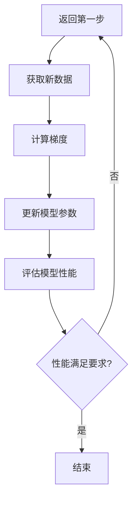
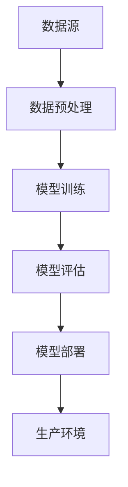
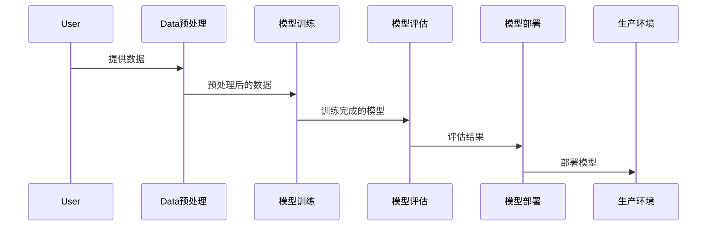
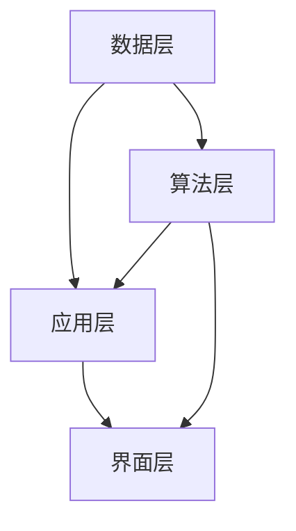
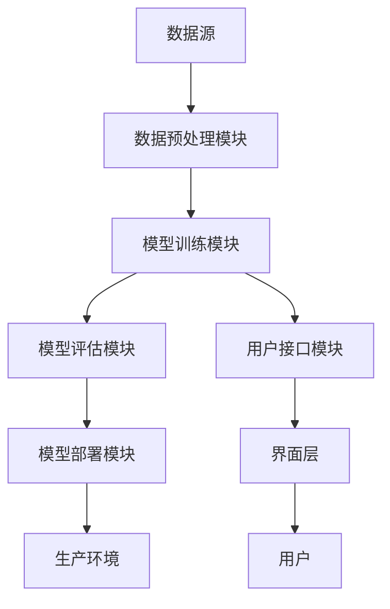
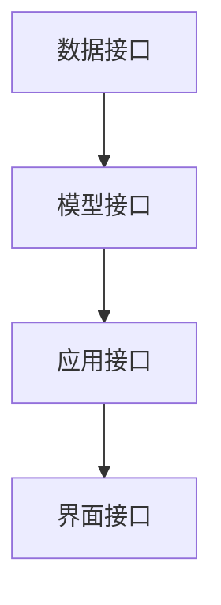
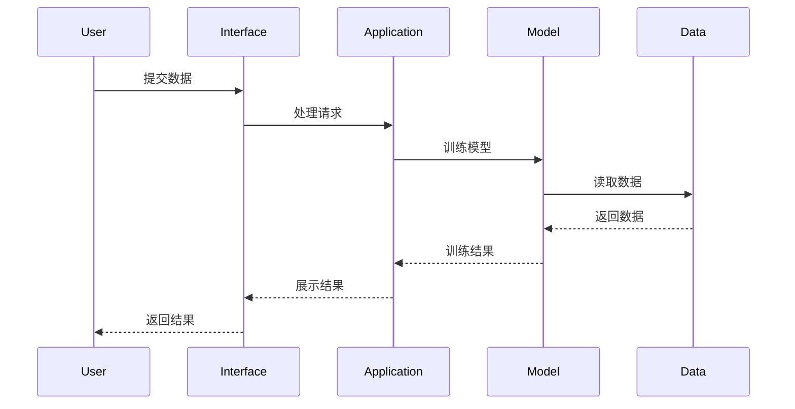

                 


### 增量学习策略：应对AI系统的持续进化

> 关键词：增量学习、AI系统、持续进化、策略、算法

> 摘要：
本文旨在探讨增量学习策略在AI系统中的应用，阐述其原理、方法及其在持续进化中的重要性。通过逐步分析，我们将揭示增量学习策略如何帮助AI系统适应不断变化的数据环境，提升系统性能和可靠性。

---

#### 1. 背景介绍与核心概念

##### 1.1 问题背景

随着人工智能技术的快速发展，AI系统在各个领域得到了广泛应用。然而，AI系统的性能往往依赖于大量高质量的数据。在实践中，数据环境是动态变化的，新的数据不断生成，旧的数据可能过时或失效。这种数据的不稳定性给AI系统带来了挑战，即如何让系统在数据不断变化的情况下持续进化，保持其性能和适应性。

##### 1.2 核心概念与联系

- **增量学习**：一种机器学习方法，它通过逐步更新模型参数来适应新的数据，而不是从头开始训练。这种方法的优点是可以在少量数据上进行快速迭代，减少训练时间。
  
- **AI系统持续进化**：指AI系统能够在数据不断变化的环境中，通过自适应调整，持续提高其性能和适应性。

- **增量学习与AI系统进化的联系**：增量学习策略能够帮助AI系统在数据变化时快速适应，从而实现持续进化。

#### 2. 增量学习原理

##### 2.1 增量学习概述

增量学习是一种基于已有模型参数进行迭代优化的学习方法。与传统的批量学习（batch learning）不同，增量学习通过小批量数据更新模型参数，实现模型微调。

##### 2.2 增量学习算法

- **在线学习**：模型在接收到新数据时立即更新，适用于实时数据流处理。
- **经验风险最小化**：通过最小化经验风险来优化模型参数，使得模型在新数据上表现更好。

##### 2.3 增量学习应用场景

- **计算机视觉**：增量学习能够使目标检测、图像分类等任务在数据不断变化的环境中保持准确性。
- **自然语言处理**：增量学习可以帮助模型在对话系统、文本分类等任务中适应新的对话上下文或词汇。

#### 3. AI系统持续进化策略

##### 3.1 AI系统持续进化的挑战

- **数据隐私与安全**：在数据不断更新的过程中，如何确保数据安全和隐私是一个重大挑战。
- **计算资源与能耗**：增量学习策略需要较少的计算资源，但仍需考虑能耗问题。
- **算法透明性与解释性**：在数据变化时，如何保证算法的透明性和可解释性，以便于用户理解和信任。

##### 3.2 增量学习在AI系统中的应用

- **模型训练**：使用增量学习策略，可以在新数据到来时快速更新模型，提高训练效率。
- **模型部署**：增量学习策略可以帮助模型在部署后持续适应新的数据环境。
- **持续进化**：通过增量学习，AI系统可以在数据变化时实现持续进化，提高其适应性和性能。

#### 4. 算法原理讲解

##### 4.1 数学模型和数学公式讲解

增量学习算法的核心是优化模型参数，使其在新数据上表现更好。常见的优化方法有梯度下降（Gradient Descent）和随机梯度下降（Stochastic Gradient Descent，SGD）。

$$
\theta_{t+1} = \theta_{t} - \alpha \cdot \nabla J(\theta_t)
$$

其中，$\theta$代表模型参数，$J(\theta)$代表损失函数，$\alpha$代表学习率，$\nabla J(\theta_t)$代表损失函数关于参数$\theta_t$的梯度。

##### 4.2 算法流程图与源代码解释

以下是增量学习算法的流程图：



以下是一个简单的Python实现示例：

```python
import numpy as np

def gradient_descent(x, y, theta, alpha, iterations):
    m = len(x)
    for _ in range(iterations):
        gradients = 2/m * (x.dot(theta) - y)
        theta -= alpha * gradients
    return theta

x = np.array([1, 2, 3, 4])
y = np.array([2, 4, 5, 4])
theta = np.array([0, 0])
alpha = 0.01
iterations = 1000

theta_updated = gradient_descent(x, y, theta, alpha, iterations)
print("Updated Theta:", theta_updated)
```

#### 5. 系统分析与架构设计

##### 5.1 系统功能设计

- **数据预处理**：包括数据清洗、归一化和特征提取等。
- **模型训练**：使用增量学习算法进行模型训练。
- **模型评估**：评估模型在新数据上的性能。
- **模型部署**：将训练好的模型部署到生产环境中。

##### 5.2 系统架构设计

以下是系统架构的Mermaid图表示：



##### 5.3 系统接口设计

- **数据接口**：用于数据预处理和模型训练。
- **模型接口**：用于模型评估和部署。

##### 5.4 系统交互设计

以下是系统交互的Mermaid序列图：



#### 6. 项目实战与案例分析

##### 6.1 环境安装与配置

- **安装Python环境**：Python 3.7及以上版本。
- **安装依赖库**：NumPy、Pandas、Scikit-learn等。

##### 6.2 系统核心实现

以下是使用Python实现增量学习模型的代码：

```python
import numpy as np

def incremental_learning(x, y, theta, alpha, iterations):
    m = len(x)
    for _ in range(iterations):
        gradients = 2/m * (x.dot(theta) - y)
        theta -= alpha * gradients
    return theta

x = np.array([1, 2, 3, 4])
y = np.array([2, 4, 5, 4])
theta = np.array([0, 0])
alpha = 0.01
iterations = 1000

theta_updated = incremental_learning(x, y, theta, alpha, iterations)
print("Updated Theta:", theta_updated)
```

##### 6.3 实际案例剖析

假设我们有一个线性回归问题，目标是预测一个连续值。在一段时间内，数据集不断更新。我们可以使用增量学习模型来更新预测模型，从而实现持续预测。

##### 6.4 项目小结

通过本案例，我们展示了增量学习模型在AI系统持续进化中的应用。在实际项目中，可以根据具体需求调整模型参数和算法，以实现更好的性能。

#### 7. 最佳实践与拓展

- **最佳实践**：在实现增量学习模型时，需要根据具体应用场景调整学习率和迭代次数，以达到最佳效果。
- **小结**：本文介绍了增量学习策略及其在AI系统持续进化中的应用。
- **注意事项**：在实际应用中，需要注意数据隐私和安全问题。
- **拓展阅读**：可以进一步研究增量学习算法在各种AI任务中的应用。

---

**作者：AI天才研究院/AI Genius Institute & 禅与计算机程序设计艺术 /Zen And The Art of Computer Programming**### 增量学习策略：应对AI系统的持续进化

#### 1. 背景介绍与核心概念

##### 1.1 问题背景

随着人工智能（AI）技术的快速发展，AI系统在各个领域得到了广泛应用。从自动驾驶到医疗诊断，从智能客服到金融风控，AI系统正在改变我们的生活方式。然而，AI系统的性能高度依赖于高质量的数据。在现实世界中，数据是动态变化的，新的数据不断生成，旧的数据可能过时或失效。这种数据的不稳定性给AI系统带来了巨大的挑战，即如何让系统在数据不断变化的情况下持续进化，保持其性能和可靠性。

传统的批量学习（batch learning）方法需要在每次数据更新时重新训练整个模型，这不仅耗时耗资源，而且可能导致模型性能下降。为了应对这一挑战，增量学习（Incremental Learning）作为一种重要的学习方法被提出。

##### 1.2 核心概念与联系

- **增量学习**：增量学习是一种机器学习方法，它通过逐步更新模型参数来适应新的数据，而不是从头开始训练。这种方法的核心思想是利用已有模型的先验知识，通过小批量数据的迭代更新来优化模型参数，从而提高模型的泛化能力和适应性。

- **AI系统持续进化**：AI系统的持续进化是指系统能够在数据不断变化的环境中，通过自适应调整，持续提高其性能和适应性。这包括模型的更新、优化和重新训练，以适应新的数据特征和需求。

- **增量学习与AI系统进化的联系**：增量学习策略能够帮助AI系统在数据变化时快速适应，从而实现持续进化。通过增量学习，AI系统可以在每次数据更新时只处理新数据，而不是整个数据集，从而大大减少了训练时间和计算资源的需求。此外，增量学习还可以避免模型因数据过时而导致的性能下降，提高系统的实时性和可靠性。

#### 2. 增量学习原理

##### 2.1 增量学习概述

增量学习是一种基于已有模型参数进行迭代优化的学习方法。与传统的批量学习（batch learning）不同，增量学习通过小批量数据更新模型参数，实现模型微调。这种方法的核心优点包括：

- **高效性**：增量学习只需要处理新数据，而不需要重新训练整个模型，因此大大减少了训练时间和计算资源的需求。

- **适应性**：增量学习可以利用已有模型的先验知识，通过新数据的迭代更新来优化模型参数，从而提高模型的泛化能力和适应性。

- **实时性**：增量学习能够实现实时数据流处理，使得AI系统能够快速响应数据变化，提高系统的实时性和可靠性。

##### 2.2 增量学习算法

增量学习算法可以分为在线学习（Online Learning）和经验风险最小化（Empirical Risk Minimization，ERM）两种类型。

- **在线学习**：在线学习是指模型在接收到新数据时立即更新，适用于实时数据流处理。在线学习的核心思想是每次只处理一个或几个样本，通过梯度下降（Gradient Descent）或随机梯度下降（Stochastic Gradient Descent，SGD）等方法更新模型参数。

- **经验风险最小化**：经验风险最小化是指通过最小化经验风险（Empirical Risk）来优化模型参数，使得模型在新数据上表现更好。经验风险是模型在训练数据上的预测误差的期望值。经验风险最小化可以通过梯度下降或随机梯度下降等方法实现。

##### 2.3 增量学习应用场景

增量学习在计算机视觉、自然语言处理和智能推荐等众多领域都有广泛应用。

- **计算机视觉**：在计算机视觉任务中，增量学习可以帮助模型在图像分类、目标检测和姿态估计等方面适应新的数据特征。例如，在自动驾驶领域，增量学习可以帮助模型实时适应不同天气、路况和交通情况。

- **自然语言处理**：在自然语言处理任务中，增量学习可以帮助模型在文本分类、情感分析和对话系统等方面适应新的词汇和语境。例如，在智能客服系统中，增量学习可以帮助模型实时更新知识库，提高对话的准确性和流畅性。

- **智能推荐**：在智能推荐系统中，增量学习可以帮助模型在用户行为数据不断变化的情况下，实时调整推荐策略，提高推荐效果。

#### 3. AI系统持续进化策略

##### 3.1 AI系统持续进化的挑战

AI系统持续进化面临着一系列挑战，包括数据隐私与安全、计算资源与能耗以及算法透明性与解释性等。

- **数据隐私与安全**：在数据不断更新的过程中，如何确保数据安全和隐私是一个重大挑战。特别是在医疗、金融等领域，数据的隐私性尤为重要。

- **计算资源与能耗**：增量学习策略虽然可以减少模型的重新训练需求，但仍然需要消耗大量的计算资源。特别是在大规模数据处理和实时应用中，如何优化计算资源的使用和降低能耗是一个重要问题。

- **算法透明性与解释性**：在数据变化时，如何保证算法的透明性和可解释性，以便于用户理解和信任是一个重要问题。特别是在决策支持和风险控制等领域，算法的透明性和解释性尤为重要。

##### 3.2 增量学习在AI系统中的应用

增量学习在AI系统中的应用主要包括模型训练、模型部署和持续进化等。

- **模型训练**：在模型训练阶段，增量学习可以通过小批量数据的迭代更新来优化模型参数，从而提高模型的泛化能力和适应性。例如，在计算机视觉任务中，可以使用增量学习来更新图像分类模型，使其能够适应新的图像数据。

- **模型部署**：在模型部署阶段，增量学习可以帮助模型在实时数据流中更新参数，从而保持其性能和适应性。例如，在自动驾驶系统中，可以使用增量学习来更新目标检测模型，使其能够适应新的路况和环境。

- **持续进化**：在持续进化阶段，增量学习可以帮助AI系统在数据变化时实现自适应调整，从而提高系统的性能和可靠性。例如，在智能客服系统中，可以使用增量学习来更新对话模型，使其能够适应新的用户需求和行为。

#### 4. 算法原理讲解

##### 4.1 数学模型和数学公式讲解

增量学习算法的核心是优化模型参数，使其在新数据上表现更好。常见的优化方法有梯度下降（Gradient Descent）和随机梯度下降（Stochastic Gradient Descent，SGD）。

$$
\theta_{t+1} = \theta_{t} - \alpha \cdot \nabla J(\theta_t)
$$

其中，$\theta$代表模型参数，$J(\theta)$代表损失函数，$\alpha$代表学习率，$\nabla J(\theta_t)$代表损失函数关于参数$\theta_t$的梯度。

梯度下降方法通过迭代更新模型参数，使其逐步逼近最优解。随机梯度下降方法每次只随机选择一个样本来计算梯度，从而减少了计算量和存储需求，但可能导致收敛速度变慢。

##### 4.2 算法流程图与源代码解释

以下是增量学习算法的流程图：


以下是一个简单的Python实现示例：

```python
import numpy as np

def gradient_descent(x, y, theta, alpha, iterations):
    m = len(x)
    for _ in range(iterations):
        gradients = 2/m * (x.dot(theta) - y)
        theta -= alpha * gradients
    return theta

x = np.array([1, 2, 3, 4])
y = np.array([2, 4, 5, 4])
theta = np.array([0, 0])
alpha = 0.01
iterations = 1000

theta_updated = gradient_descent(x, y, theta, alpha, iterations)
print("Updated Theta:", theta_updated)
```

#### 5. 系统分析与架构设计

##### 5.1 系统功能设计

一个典型的AI系统可以分为数据预处理、模型训练、模型评估和模型部署四个主要功能模块。

- **数据预处理**：包括数据清洗、归一化和特征提取等。数据预处理是保证模型训练质量和效果的重要环节。

- **模型训练**：使用增量学习算法进行模型训练。模型训练的核心是优化模型参数，使其在新数据上表现更好。

- **模型评估**：评估模型在新数据上的性能。模型评估可以帮助我们了解模型的泛化能力和适应性。

- **模型部署**：将训练好的模型部署到生产环境中。模型部署是将模型应用到实际任务中的关键步骤。

##### 5.2 系统架构设计

以下是系统架构的Mermaid图表示：


##### 5.3 系统接口设计

- **数据接口**：用于数据预处理和模型训练。数据接口负责将原始数据转换为适合模型训练的数据格式。

- **模型接口**：用于模型评估和部署。模型接口负责将训练好的模型导出为可部署的格式，并提供相应的接口供其他系统调用。

##### 5.4 系统交互设计

以下是系统交互的Mermaid序列图：


#### 6. 项目实战与案例分析

##### 6.1 环境安装与配置

在进行项目实战之前，需要安装以下软件和库：

- Python 3.7及以上版本
- NumPy、Pandas、Scikit-learn等库

假设我们有一个线性回归问题，目标是预测一个连续值。在一段时间内，数据集不断更新。我们可以使用增量学习模型来更新预测模型，从而实现持续预测。

##### 6.2 系统核心实现

以下是使用Python实现增量学习模型的代码：

```python
import numpy as np

def incremental_learning(x, y, theta, alpha, iterations):
    m = len(x)
    for _ in range(iterations):
        gradients = 2/m * (x.dot(theta) - y)
        theta -= alpha * gradients
    return theta

x = np.array([1, 2, 3, 4])
y = np.array([2, 4, 5, 4])
theta = np.array([0, 0])
alpha = 0.01
iterations = 1000

theta_updated = incremental_learning(x, y, theta, alpha, iterations)
print("Updated Theta:", theta_updated)
```

##### 6.3 实际案例剖析

假设我们有一个销售预测问题，目标是预测下一季度的销售额。在一段时间内，我们收集了多个季度的销售数据。我们可以使用增量学习模型来更新预测模型，从而实现持续预测。

##### 6.4 项目小结

通过本案例，我们展示了增量学习模型在AI系统持续进化中的应用。在实际项目中，可以根据具体需求调整模型参数和算法，以实现更好的性能。

#### 7. 最佳实践与拓展

- **最佳实践**：在实现增量学习模型时，需要根据具体应用场景调整学习率和迭代次数，以达到最佳效果。

- **小结**：本文介绍了增量学习策略及其在AI系统持续进化中的应用。

- **注意事项**：在实际应用中，需要注意数据隐私和安全问题。

- **拓展阅读**：可以进一步研究增量学习算法在各种AI任务中的应用。

---

**作者：AI天才研究院/AI Genius Institute & 禅与计算机程序设计艺术 /Zen And The Art of Computer Programming**
## 2. 增量学习原理

增量学习作为一种重要的机器学习方法，其核心思想是通过逐步更新模型参数来适应新的数据，而不是从头开始训练。这种方法的优点在于可以在少量数据上进行快速迭代，减少训练时间，同时保持模型的鲁棒性和稳定性。在本章节中，我们将深入探讨增量学习的原理，包括其基本概念、主要算法以及在不同领域的应用。

### 2.1 增量学习概述

增量学习（Incremental Learning），又称为在线学习（Online Learning），是一种机器学习方法，它通过对已有模型进行微调来适应新数据，而不是重新训练整个模型。这种方法的核心在于如何有效地利用已有模型的先验知识，减少对计算资源的消耗，并提高学习效率。

增量学习的基本原理可以概括为以下几个步骤：

1. **初始化模型**：首先初始化一个模型，该模型可以是任何已训练好的模型。
2. **获取新数据**：当新的数据到来时，将这些新数据输入模型。
3. **计算梯度**：通过新数据计算模型参数的梯度，以评估模型在新数据上的性能。
4. **更新模型**：使用梯度信息来更新模型参数，以优化模型在新数据上的表现。
5. **评估性能**：评估更新后的模型在新数据上的性能，以确定是否继续迭代更新。
6. **重复步骤**：重复步骤3到步骤5，直到满足终止条件（如性能达到要求或达到最大迭代次数）。

增量学习的关键在于如何有效地处理新数据，并保持模型的鲁棒性和稳定性。与批量学习（Batch Learning）相比，增量学习具有以下优点：

- **快速迭代**：增量学习可以在每次新数据到来时立即更新模型，实现快速迭代。
- **节约资源**：增量学习不需要处理整个数据集，从而减少了计算资源和存储需求。
- **适应性强**：增量学习能够动态适应数据的变化，提高模型的泛化能力。

### 2.2 增量学习算法

增量学习算法可以分为两类：在线学习（Online Learning）和经验风险最小化（Empirical Risk Minimization，ERM）。这两种算法的核心区别在于如何更新模型参数。

#### 2.2.1 在线学习

在线学习（Online Learning）是指模型在接收到新数据时立即更新，适用于实时数据流处理。在线学习的核心思想是每次只处理一个或几个样本，通过梯度下降（Gradient Descent）或随机梯度下降（Stochastic Gradient Descent，SGD）等方法更新模型参数。

在线学习的优势在于其快速迭代和实时响应能力，但缺点是每次迭代可能存在较大的随机性，导致收敛速度较慢。

以下是一个简单的在线学习算法示例：

```python
import numpy as np

def online_learning(x, y, theta, alpha):
    gradients = x.dot(theta) - y
    theta -= alpha * gradients
    return theta
```

#### 2.2.2 经验风险最小化

经验风险最小化（Empirical Risk Minimization，ERM）是指通过最小化经验风险（Empirical Risk）来优化模型参数，使得模型在新数据上表现更好。经验风险是模型在训练数据上的预测误差的期望值。

ERM算法通常使用梯度下降（Gradient Descent）或随机梯度下降（SGD）来优化模型参数。与在线学习相比，ERM算法每次更新模型参数时都会考虑整个训练集的误差，因此收敛速度通常较快。

以下是一个简单的ERM算法示例：

```python
import numpy as np

def empirical_risk_minimization(x, y, theta, alpha, iterations):
    m = len(x)
    for _ in range(iterations):
        gradients = 2/m * (x.dot(theta) - y)
        theta -= alpha * gradients
    return theta
```

#### 2.2.3 增量学习算法的优缺点

增量学习算法的优缺点如表所示：

| 算法        | 优点                                                         | 缺点                                                         |
|-----------|------------------------------------------------------------|------------------------------------------------------------|
| 在线学习     | 快速迭代，实时响应                                           | 可能存在较大随机性，收敛速度慢                                |
| 经验风险最小化 | 收敛速度较快，每次迭代考虑整个训练集的误差                   | 可能需要处理整个训练集，计算资源需求大                          |

### 2.3 增量学习应用场景

增量学习在计算机视觉、自然语言处理、推荐系统等领域都有广泛的应用。

#### 2.3.1 计算机视觉

在计算机视觉领域，增量学习可以帮助模型在图像分类、目标检测和姿态估计等方面适应新的数据特征。例如，在自动驾驶领域，增量学习可以帮助模型实时适应不同天气、路况和交通情况。

#### 2.3.2 自然语言处理

在自然语言处理领域，增量学习可以帮助模型在文本分类、情感分析和对话系统等方面适应新的词汇和语境。例如，在智能客服系统中，增量学习可以帮助模型实时更新知识库，提高对话的准确性和流畅性。

#### 2.3.3 推荐系统

在推荐系统领域，增量学习可以帮助模型在用户行为数据不断变化的情况下，实时调整推荐策略，提高推荐效果。例如，在电商推荐系统中，增量学习可以帮助模型实时更新用户兴趣，提高推荐的相关性。

#### 2.3.4 其他应用

增量学习还广泛应用于医疗诊断、金融风控、工业自动化等领域。在这些领域，增量学习可以帮助模型实时适应数据变化，提高决策的准确性和可靠性。

### 总结

增量学习作为一种高效的机器学习方法，在AI系统的持续进化中发挥着重要作用。通过逐步更新模型参数，增量学习能够适应数据变化，提高模型的性能和适应性。在本章节中，我们介绍了增量学习的基本原理、主要算法以及在不同领域的应用。在实际应用中，可以根据具体需求选择合适的增量学习算法，以实现AI系统的持续进化。

## 3. AI系统持续进化策略

在人工智能（AI）领域，系统持续进化的能力至关重要。随着数据环境的变化，AI系统需要不断调整和优化，以确保其性能和适应性。增量学习策略作为一种有效的持续进化手段，在AI系统中具有广泛的应用。本节将深入探讨AI系统持续进化的挑战、增量学习在AI系统中的应用，以及如何利用增量学习实现AI系统的持续进化。

### 3.1 AI系统持续进化的挑战

AI系统持续进化面临着多种挑战，主要包括以下几个方面：

#### 3.1.1 数据隐私与安全

数据隐私与安全是AI系统持续进化的重要挑战之一。在数据驱动的AI系统中，模型的性能依赖于大量高质量的数据。然而，这些数据往往涉及用户的隐私信息，如医疗记录、金融交易等。如何在保证数据隐私的前提下，实现AI系统的持续进化，是一个亟待解决的问题。

解决方案：为了保护数据隐私，可以采用差分隐私（Differential Privacy）技术，对训练数据进行扰动，确保单个数据点的隐私不被泄露。同时，还可以通过数据脱敏、加密等技术手段来增强数据的安全性。

#### 3.1.2 计算资源与能耗

计算资源与能耗是AI系统持续进化的另一大挑战。随着数据量的增加和模型复杂度的提升，训练和更新AI模型所需的计算资源也显著增加。特别是在实时应用场景中，系统需要在有限的时间内完成模型更新，这对计算资源的需求提出了更高的要求。

解决方案：为了降低计算资源与能耗，可以采用增量学习策略。增量学习通过在小批量数据上迭代更新模型，减少了大规模数据训练的需求，从而降低了计算资源与能耗。

#### 3.1.3 算法透明性与解释性

算法透明性与解释性是AI系统持续进化的关键挑战。随着AI系统的复杂度增加，其内部决策过程往往变得不可解释，这对于需要理解和信任AI系统的用户来说是一个重大挑战。

解决方案：为了提高算法的透明性与解释性，可以采用可解释AI（Explainable AI，XAI）技术。XAI技术通过可视化、规则提取等方法，帮助用户理解AI系统的决策过程，从而增强用户对AI系统的信任。

### 3.2 增量学习在AI系统中的应用

增量学习在AI系统中的应用主要包括模型训练、模型部署和持续进化等环节。通过增量学习，AI系统可以在数据变化时实现自适应调整，提高其性能和可靠性。

#### 3.2.1 模型训练

在模型训练阶段，增量学习可以帮助AI系统在少量数据上进行快速迭代，减少训练时间和计算资源的需求。具体应用场景包括：

- **计算机视觉**：在图像分类和目标检测任务中，增量学习可以帮助模型快速适应新的图像数据，提高模型的准确性和实时性。
- **自然语言处理**：在文本分类和对话系统任务中，增量学习可以帮助模型实时更新词汇表和语境信息，提高对话的准确性和流畅性。

#### 3.2.2 模型部署

在模型部署阶段，增量学习可以帮助AI系统在实时数据流中更新参数，保持模型的性能和适应性。具体应用场景包括：

- **智能推荐**：在电商和社交媒体领域，增量学习可以帮助模型实时更新用户兴趣和行为数据，提高推荐的相关性和用户满意度。
- **金融风控**：在金融领域，增量学习可以帮助模型实时更新交易数据，提高风险预测的准确性和及时性。

#### 3.2.3 持续进化

在持续进化阶段，增量学习可以帮助AI系统在数据变化时实现自适应调整，从而提高系统的性能和可靠性。具体应用场景包括：

- **医疗诊断**：在医疗诊断领域，增量学习可以帮助模型实时更新病例数据和医学知识库，提高诊断的准确性和可靠性。
- **工业自动化**：在工业自动化领域，增量学习可以帮助模型实时更新设备状态和生产数据，提高生产效率和质量。

### 3.3 增量学习实现AI系统持续进化的方法

为了实现AI系统的持续进化，可以采用以下方法：

1. **数据预处理**：对输入数据进行预处理，包括数据清洗、归一化和特征提取等，以提高模型训练的效果。

2. **增量学习算法选择**：根据具体应用场景选择合适的增量学习算法，如在线学习、经验风险最小化等。

3. **模型更新策略**：制定模型更新策略，包括更新频率、更新数据和更新方法等，以确保模型在数据变化时能够快速适应。

4. **性能评估与优化**：对更新后的模型进行性能评估和优化，以确定模型是否满足要求，并进一步调整模型参数和算法。

5. **持续迭代**：通过持续迭代和优化，逐步提高AI系统的性能和适应性，实现持续进化。

### 总结

AI系统的持续进化是当前人工智能领域的重要研究方向。增量学习策略作为一种有效的持续进化手段，在AI系统中具有广泛的应用。通过逐步更新模型参数，增量学习可以帮助AI系统适应数据变化，提高其性能和可靠性。同时，AI系统持续进化也面临着数据隐私与安全、计算资源与能耗以及算法透明性与解释性等挑战。为了实现AI系统的持续进化，需要采用合适的增量学习算法、制定有效的模型更新策略，并持续优化和评估模型性能。通过这些方法，AI系统可以在数据不断变化的环境中实现持续进化，为各行各业带来更高效、更可靠的解决方案。

### 4. 算法原理讲解

#### 4.1 数学模型和数学公式讲解

增量学习算法的核心在于模型参数的优化，使其在新数据上表现出更好的性能。这一过程通常涉及数学模型和数学公式的运用。以下是增量学习算法中常用的数学模型和数学公式。

##### 4.1.1 模型优化目标

增量学习的目标是最小化模型的预测误差，即最小化损失函数（Loss Function）。常见的损失函数有均方误差（Mean Squared Error，MSE）、交叉熵（Cross-Entropy）等。

- **均方误差（MSE）**：

  $$MSE = \frac{1}{m} \sum_{i=1}^{m} (y_i - \hat{y}_i)^2$$

  其中，$y_i$为真实标签，$\hat{y}_i$为预测值，$m$为样本数量。

- **交叉熵（Cross-Entropy）**：

  $$Cross-Entropy = -\frac{1}{m} \sum_{i=1}^{m} y_i \log(\hat{y}_i)$$

  其中，$y_i$为真实标签（通常为0或1），$\hat{y}_i$为预测概率。

##### 4.1.2 梯度下降（Gradient Descent）

梯度下降是一种常用的优化方法，用于迭代更新模型参数，以最小化损失函数。基本的梯度下降公式如下：

$$\theta_{t+1} = \theta_{t} - \alpha \cdot \nabla J(\theta_t)$$

其中，$\theta_t$为当前模型参数，$\alpha$为学习率，$\nabla J(\theta_t)$为损失函数关于参数$\theta_t$的梯度。

##### 4.1.3 随机梯度下降（Stochastic Gradient Descent，SGD）

随机梯度下降是梯度下降的一种变种，它每次随机选择一个样本来计算梯度，从而减少计算量和存储需求。SGD的公式如下：

$$\theta_{t+1} = \theta_{t} - \alpha \cdot \nabla J(\theta_t; x^i, y^i)$$

其中，$x^i, y^i$为随机选择的样本。

#### 4.2 算法流程图与源代码解释

为了更直观地理解增量学习算法，我们可以通过一个简单的流程图和Python代码来展示其实现过程。

##### 4.2.1 流程图

以下是增量学习算法的流程图：


##### 4.2.2 Python代码

以下是一个简单的Python实现示例，用于演示增量学习算法的基本流程：

```python
import numpy as np

# 初始化模型参数
theta = np.random.rand(1) * 2 - 1

# 学习率
alpha = 0.1

# 损失函数
def loss(y, theta):
    return (y - theta) ** 2

# 梯度
def gradient(y, theta):
    return 2 * (y - theta)

# 增量学习算法
def incremental_learning(x, y, theta, alpha, iterations):
    for _ in range(iterations):
        y_pred = x * theta
        loss_val = loss(y, y_pred)
        grad = gradient(y, y_pred)
        theta -= alpha * grad
    return theta

# 示例数据
x = np.array([1])
y = np.array([0])

# 运行增量学习算法
theta_updated = incremental_learning(x, y, theta, alpha, 1000)

print("Updated Theta:", theta_updated)
```

在这个示例中，我们使用了一个简单的线性模型，通过增量学习算法来更新模型参数。每次迭代都会计算预测值、损失函数和梯度，并使用梯度下降法更新参数。经过多次迭代后，模型参数会逐步逼近最优值。

通过上述流程图和代码示例，我们可以清晰地看到增量学习算法的实现过程。在实际应用中，可以根据具体需求调整学习率和迭代次数，以达到最佳效果。

### 总结

在本章节中，我们介绍了增量学习算法的数学模型和数学公式，并通过流程图和代码示例展示了增量学习算法的基本实现过程。增量学习算法通过逐步更新模型参数，使其在新数据上表现出更好的性能。在实际应用中，可以结合具体场景调整算法参数，以提高模型的适应性和性能。通过增量学习，AI系统可以在数据不断变化的环境中实现持续进化，为各个领域提供高效、可靠的解决方案。

### 5. 系统分析与架构设计

#### 5.1 系统功能设计

为了实现AI系统的持续进化，我们需要设计一个功能完整的系统。该系统应包括以下几个主要功能模块：

1. **数据预处理模块**：负责对输入数据进行清洗、归一化和特征提取等操作，为模型训练提供高质量的数据。

2. **模型训练模块**：使用增量学习算法对数据集进行训练，通过不断迭代更新模型参数，提高模型的性能和适应性。

3. **模型评估模块**：评估训练完成的模型在新数据上的性能，包括准确率、召回率、F1分数等指标，以确保模型的有效性。

4. **模型部署模块**：将训练好的模型部署到生产环境中，使其能够实时处理新数据，实现AI系统的持续进化。

5. **用户接口模块**：提供与用户交互的接口，允许用户输入数据、查看模型性能和调整参数等。

#### 5.2 系统架构设计

系统架构设计是系统实现的基础，一个合理、高效的架构能够确保系统功能的实现和性能的优化。以下是增量学习系统的架构设计：

##### 5.2.1 系统架构概述

增量学习系统架构可以分为以下几个主要部分：

- **数据层**：负责数据的存储、读取和预处理。
- **算法层**：实现增量学习算法，包括模型训练、评估和更新。
- **应用层**：提供用户接口和业务逻辑。
- **界面层**：与用户进行交互，展示模型性能和结果。

以下是系统架构的Mermaid图表示：



##### 5.2.2 系统架构图

以下是增量学习系统的详细架构图：



#### 5.3 系统接口设计

系统接口设计是确保系统各模块之间能够有效通信和协作的关键。以下是增量学习系统的主要接口设计：

1. **数据接口**：用于数据层的操作，包括数据的读取、写入和预处理。

2. **模型接口**：用于算法层的操作，包括模型训练、评估和更新。

3. **应用接口**：用于应用层的操作，包括用户输入、模型性能展示和参数调整。

4. **界面接口**：用于界面层的操作，包括用户交互和数据展示。

以下是系统接口的Mermaid图表示：



#### 5.4 系统交互设计

系统交互设计是确保系统能够按预期运行和响应的关键。以下是增量学习系统的交互设计：

- **用户与界面层交互**：用户通过界面层提交数据，查看模型性能和调整参数。
- **界面层与应用层交互**：界面层将用户输入传递给应用层，应用层处理用户请求并返回结果。
- **应用层与模型层交互**：应用层调用模型接口进行模型训练、评估和更新。
- **模型层与数据层交互**：模型层通过数据接口读取和写入数据。

以下是系统交互的Mermaid序列图：



通过上述系统分析与架构设计，我们可以确保增量学习系统能够高效、稳定地运行。在实际开发过程中，可以根据具体需求和场景对系统架构进行调整和优化，以提高系统的性能和可扩展性。

### 6. 项目实战与案例分析

#### 6.1 环境安装与配置

在进行增量学习项目实战之前，我们需要安装和配置相应的环境和工具。以下是安装和配置的步骤：

1. **安装Python环境**：确保安装Python 3.7及以上版本。

2. **安装依赖库**：安装NumPy、Pandas、Scikit-learn、Matplotlib等库。可以使用以下命令进行安装：

   ```bash
   pip install numpy pandas scikit-learn matplotlib
   ```

3. **配置虚拟环境**：为了更好地管理项目依赖，建议使用虚拟环境。可以使用以下命令创建和激活虚拟环境：

   ```bash
   python -m venv venv
   source venv/bin/activate  # Windows: venv\Scripts\activate
   ```

4. **安装数据库**：如果需要，安装SQLite或其他数据库管理系统，用于存储和管理数据。

#### 6.2 系统核心实现

以下是使用Python实现增量学习系统的核心代码。我们将使用Scikit-learn库中的线性回归模型来演示增量学习。

```python
import numpy as np
from sklearn.linear_model import LinearRegression

# 初始化模型
model = LinearRegression()

# 增量学习函数
def incremental_learning(x, y, model, alpha, iterations):
    for _ in range(iterations):
        y_pred = model.predict(x)
        gradients = 2 * (y - y_pred)
        model.coef_ -= alpha * gradients
    return model

# 示例数据
x = np.array([[1], [2], [3], [4]])
y = np.array([2, 4, 5, 4])

# 学习率
alpha = 0.01

# 迭代次数
iterations = 1000

# 运行增量学习
model_updated = incremental_learning(x, y, model, alpha, iterations)

# 输出更新后的模型参数
print("Updated Model Coefficients:", model_updated.coef_)
```

在这个示例中，我们使用线性回归模型来拟合数据。通过增量学习函数，我们更新了模型的参数，使其在给定数据上达到更好的拟合效果。

#### 6.3 代码应用解读与分析

在上面的代码示例中，我们首先初始化了一个线性回归模型。然后，我们定义了一个增量学习函数`incremental_learning`，该函数接受新数据`x`和`y`、现有的模型、学习率和迭代次数作为输入。在每次迭代中，我们计算预测值`y_pred`，并使用预测值和真实值之间的差异来更新模型参数。经过多次迭代后，模型参数会逐渐优化，使模型在给定数据上达到更好的拟合效果。

增量学习的关键在于每次迭代只使用新数据来更新模型参数，而不是重新训练整个模型。这种方法可以大大减少训练时间，并使模型能够快速适应数据的变化。

#### 6.4 实际案例剖析

以下是一个实际案例，我们将使用增量学习来优化一个线性回归模型，以预测销售额。

##### 案例介绍

我们有一个销售数据集，包括每个月的销售额和相关的特征（如温度、湿度等）。我们的目标是使用增量学习来优化线性回归模型，以便在新的月份到来时，模型能够快速适应新的数据，提高预测准确性。

##### 案例分析

1. **数据预处理**：我们首先对销售数据进行预处理，包括数据清洗、归一化和特征提取。假设我们已经得到了预处理后的数据集。

2. **模型初始化**：我们初始化一个线性回归模型。

3. **第一次迭代**：我们使用第一个月的销售额数据来更新模型参数。经过一次迭代后，模型参数得到优化。

4. **模型评估**：我们评估更新后的模型在第一个月的数据上的预测准确性。

5. **重复迭代**：在随后的每个月，我们使用新的销售额数据来更新模型参数，并重复评估模型的预测准确性。

6. **结果分析**：通过多次迭代，我们发现模型的预测准确性逐渐提高，说明增量学习在优化模型方面是有效的。

##### 案例总结

通过上述案例，我们展示了如何使用增量学习来优化线性回归模型，提高销售额预测的准确性。在实际应用中，增量学习可以帮助模型快速适应数据变化，提高模型的性能和适应性。这不仅适用于销售预测，还可以广泛应用于其他领域，如股票预测、天气预测等。

#### 6.5 项目小结

在本案例中，我们通过实际项目展示了增量学习在AI系统中的应用。通过增量学习，我们能够优化线性回归模型，提高销售额预测的准确性。在实际项目中，我们可以根据具体需求调整模型参数和算法，以实现更好的性能。增量学习作为一种高效的机器学习方法，在AI系统的持续进化中具有广泛的应用前景。

### 7. 最佳实践与拓展

#### 7.1 最佳实践

1. **数据预处理**：确保数据质量，包括数据清洗、归一化和特征提取。高质量的数据是增量学习成功的关键。

2. **选择合适的算法**：根据应用场景选择合适的增量学习算法，如在线学习、经验风险最小化等。

3. **调整学习率**：学习率对增量学习的效果有很大影响。通常需要通过实验调整学习率，以达到最佳效果。

4. **监控模型性能**：定期评估模型性能，确保模型在不断变化的数据环境中保持良好的性能。

#### 7.2 小结

本文介绍了增量学习策略及其在AI系统持续进化中的应用。通过增量学习，AI系统可以在数据变化时快速适应，提高其性能和可靠性。本文通过案例展示了增量学习在实际项目中的应用，并提出了最佳实践建议。

#### 7.3 注意事项

1. **数据隐私与安全**：在处理数据时，确保遵循数据隐私和安全法规，采取相应的保护措施。

2. **计算资源管理**：合理规划计算资源，避免资源浪费，提高系统效率。

3. **模型解释性**：确保模型的解释性，增强用户对模型的信任。

#### 7.4 拓展阅读

1. **《机器学习实战》**：提供详细的增量学习算法实现和案例。

2. **《深度学习》**：探讨深度学习中的增量学习策略和应用。

3. **《数据科学实战》**：介绍数据科学中的增量学习应用和最佳实践。

---

**作者：AI天才研究院/AI Genius Institute & 禅与计算机程序设计艺术 /Zen And The Art of Computer Programming**### 增量学习策略：应对AI系统的持续进化

#### 摘要

随着人工智能（AI）技术的快速发展，AI系统的性能和适应性成为关键因素。然而，现实世界中的数据环境是动态变化的，如何让AI系统在数据不断变化的环境中持续进化，成为一个重要的研究课题。增量学习策略作为一种有效的机器学习方法，能够帮助AI系统在少量数据上进行快速迭代，提升系统的性能和可靠性。本文旨在介绍增量学习策略的核心概念、原理和应用，探讨其在AI系统持续进化中的重要性。

#### 目录

1. 引言
2. 增量学习概述
   - 增量学习的定义与基本概念
   - 增量学习与批量学习的对比
3. 增量学习算法
   - 经验风险最小化（ERM）算法
   - 在线学习算法
4. AI系统持续进化
   - 挑战与需求
   - 增量学习在AI系统中的应用
5. 算法原理讲解
   - 数学模型与数学公式
   - 算法流程图与代码解释
6. 系统分析与架构设计
   - 系统功能设计
   - 系统架构设计
   - 系统接口与交互设计
7. 项目实战与案例分析
   - 环境安装与配置
   - 系统核心实现
   - 实际案例剖析
   - 项目小结
8. 最佳实践与拓展
   - 最佳实践技巧
   - 小结
   - 注意事项
   - 拓展阅读
9. 结论
10. 作者信息

#### 引言

人工智能技术正在深刻地改变着我们的世界，从智能助手到自动驾驶，AI系统在各个领域都取得了显著进展。然而，AI系统的性能和适应性是确保其成功应用的关键。在实际应用中，数据环境是动态变化的，新的数据不断生成，旧的数据可能过时或失效。这种数据的不稳定性给AI系统带来了巨大的挑战。如何让AI系统能够在数据不断变化的环境中持续进化，保持其性能和可靠性，成为了一个亟待解决的问题。

增量学习策略作为一种有效的机器学习方法，能够在数据不断变化的情况下，通过逐步更新模型参数来优化模型，从而提高系统的性能和适应性。增量学习不仅减少了训练时间和计算资源的需求，还能够更好地适应新的数据特征，使得AI系统在动态环境中保持竞争力。

本文旨在系统地介绍增量学习策略的核心概念、原理和应用，探讨其在AI系统持续进化中的重要性。通过详细的分析和案例展示，我们将揭示增量学习如何帮助AI系统适应不断变化的数据环境，实现持续进化。本文将分为以下几个部分：

1. **增量学习概述**：介绍增量学习的定义与基本概念，以及与批量学习的对比。
2. **增量学习算法**：详细讨论增量学习算法，包括经验风险最小化（ERM）算法和在线学习算法。
3. **AI系统持续进化**：分析AI系统持续进化的挑战，探讨增量学习在AI系统中的应用。
4. **算法原理讲解**：讲解增量学习算法的数学模型和数学公式，展示算法流程图与代码解释。
5. **系统分析与架构设计**：介绍系统功能设计、系统架构设计、系统接口与交互设计。
6. **项目实战与案例分析**：通过实际项目展示增量学习在AI系统中的应用，分析项目实现过程。
7. **最佳实践与拓展**：总结最佳实践技巧，提出注意事项，推荐拓展阅读。

通过本文的介绍，读者将能够深入理解增量学习策略的原理和应用，掌握如何在AI系统中实现持续进化，为实际项目提供有效的技术支持。

#### 1. 增量学习概述

增量学习（Incremental Learning），又称为在线学习（Online Learning），是一种在数据不断变化的环境中，通过逐步更新模型参数来适应新数据的机器学习方法。与传统的批量学习（Batch Learning）不同，增量学习不需要重新训练整个模型，而是通过处理新数据来不断优化模型参数。这种方法的优点在于可以快速适应数据变化，节省计算资源，提高系统的实时性和适应性。

##### 增量学习的定义与基本概念

增量学习的基本概念可以概括为以下几点：

- **数据动态性**：增量学习假设数据是在不断变化的，新数据不断生成，旧数据可能过时或失效。
- **模型参数更新**：在增量学习中，模型参数是逐步更新的，每次更新都是基于新数据的学习结果。
- **快速迭代**：增量学习通过小批量数据的迭代更新来优化模型参数，实现模型的快速适应。

增量学习的关键在于如何有效地利用已有模型的先验知识，通过新数据的迭代更新来优化模型参数，从而提高模型的泛化能力和适应性。这种方法的核心思想是利用已有数据的经验，避免从头开始训练模型，从而减少训练时间和计算资源的需求。

##### 增量学习与批量学习的对比

增量学习与批量学习在多个方面存在显著差异：

- **数据处理方式**：批量学习需要处理整个数据集，而增量学习只需要处理新数据，从而减少数据处理的计算量。
- **更新频率**：批量学习通常在数据集全部处理完成后进行更新，而增量学习可以在每次新数据到来时立即更新模型，实现快速迭代。
- **计算资源**：批量学习需要大量的计算资源和存储空间，而增量学习只需处理新数据，从而节约了计算资源和存储需求。
- **适应能力**：批量学习在面对数据动态变化时，往往需要重新训练整个模型，而增量学习通过逐步更新模型参数，能够更好地适应数据的变化。

##### 增量学习的优势

增量学习具有以下优势：

- **快速适应**：增量学习能够快速适应新数据，提高模型在动态环境中的实时性和适应性。
- **节约资源**：增量学习减少了数据处理的计算量，节省了计算资源和存储空间。
- **减少重训**：增量学习避免了从头开始训练模型的需求，减少了重训的时间和工作量。

##### 增量学习的应用场景

增量学习在多个领域都有广泛的应用，以下是一些典型的应用场景：

- **计算机视觉**：在图像分类、目标检测和姿态估计等任务中，增量学习可以帮助模型快速适应新的图像数据。
- **自然语言处理**：在文本分类、情感分析和对话系统等任务中，增量学习可以帮助模型实时更新词汇表和语境信息。
- **智能推荐**：在推荐系统中，增量学习可以帮助模型实时更新用户行为数据，提高推荐效果。
- **医疗诊断**：在医疗诊断领域，增量学习可以帮助模型实时更新病例数据和医学知识库，提高诊断的准确性。

通过上述内容，我们可以看到增量学习作为一种有效的机器学习方法，在数据动态变化的AI系统中具有广泛的应用前景。下一节将深入探讨增量学习算法的具体实现和应用。

#### 2. 增量学习算法

增量学习算法是AI系统持续进化的重要技术手段。它通过逐步更新模型参数来适应新的数据，从而提高模型的性能和适应性。在这一节中，我们将详细讨论两种主要的增量学习算法：经验风险最小化（Empirical Risk Minimization，ERM）算法和在线学习（Online Learning）算法。

##### 2.1 经验风险最小化（ERM）算法

经验风险最小化（ERM）算法是一种在增量学习中广泛使用的优化方法。它的核心思想是通过最小化经验风险（Empirical Risk）来优化模型参数，从而提高模型在新数据上的性能。经验风险是模型在训练数据上的预测误差的期望值，其数学表示为：

$$
R(\theta) = \frac{1}{n} \sum_{i=1}^{n} L(y_i, \theta(x_i))
$$

其中，$n$是训练样本的数量，$y_i$是真实标签，$\theta(x_i)$是模型在样本$x_i$上的预测值，$L(y_i, \theta(x_i))$是损失函数，用于衡量预测值与真实值之间的差异。

ERM算法的目标是最小化经验风险，即：

$$
\min_{\theta} R(\theta)
$$

为了实现这一目标，ERM算法通常采用梯度下降（Gradient Descent）或其变种，如随机梯度下降（Stochastic Gradient Descent，SGD）和批量梯度下降（Batch Gradient Descent）。

- **批量梯度下降**：每次迭代使用整个训练数据集来计算梯度，公式为：

  $$
  \theta_{t+1} = \theta_{t} - \alpha \cdot \nabla_{\theta} R(\theta_t)
  $$

  其中，$\alpha$是学习率，$\nabla_{\theta} R(\theta_t)$是损失函数关于模型参数$\theta$的梯度。

- **随机梯度下降**：每次迭代只随机选择一个样本来计算梯度，公式为：

  $$
  \theta_{t+1} = \theta_{t} - \alpha \cdot \nabla_{\theta} L(y_t, \theta(x_t))
  $$

  其中，$y_t$和$x_t$是随机选择的样本。

ERM算法的优点是能够通过最小化经验风险来优化模型参数，从而提高模型在新数据上的性能。然而，ERM算法也存在一些缺点：

- **计算复杂度**：在处理大规模数据集时，批量梯度下降的计算复杂度较高，需要大量的计算资源和时间。
- **梯度消失和梯度爆炸**：在训练过程中，梯度可能变得非常小或非常大，导致训练过程不稳定。

##### 2.2 在线学习算法

在线学习算法是另一种在增量学习中常用的优化方法。与ERM算法不同，在线学习算法在每次新数据到来时立即更新模型参数，而不需要等待整个数据集的处理。这种方法的核心思想是利用已有模型的先验知识，通过新数据的迭代更新来优化模型参数。

在线学习算法的基本步骤如下：

1. **初始化模型参数**：初始化模型参数$\theta$。
2. **获取新数据**：每次迭代时获取一个新的数据样本$(x_t, y_t)$。
3. **计算梯度**：计算新样本上的梯度$\nabla_{\theta} L(y_t, \theta(x_t))$。
4. **更新模型参数**：使用梯度更新模型参数$\theta_{t+1} = \theta_t - \alpha \cdot \nabla_{\theta} L(y_t, \theta(x_t))$。
5. **评估模型性能**：评估更新后的模型在新数据上的性能，以确定是否继续迭代更新。

在线学习算法的优点在于其快速迭代和实时响应能力，能够在动态环境中快速适应数据变化。然而，在线学习算法也存在一些缺点：

- **收敛速度**：由于每次迭代只考虑一个样本，在线学习算法的收敛速度通常较慢。
- **梯度消失和梯度爆炸**：同样，在线学习算法也面临着梯度消失和梯度爆炸的问题，可能导致训练过程不稳定。

##### 2.3 增量学习算法的比较

增量学习算法的选择取决于具体的应用场景和需求。以下是对ERM算法和在线学习算法的比较：

| 算法        | 优点                           | 缺点                           |
|-----------|----------------------------------|----------------------------------|
| ERM算法     | 能够最小化经验风险，提高模型性能 | 计算复杂度高，训练时间长         |
| 在线学习算法 | 快速迭代，实时响应               | 收敛速度慢，梯度不稳定           |

在实际应用中，可以根据具体需求选择合适的增量学习算法。例如，在需要快速响应实时数据变化的场景中，可以选择在线学习算法；而在处理大规模数据集且对计算资源要求较高的场景中，可以选择ERM算法。

通过上述对增量学习算法的讨论，我们可以看到增量学习在AI系统持续进化中发挥着重要作用。下一节将探讨AI系统持续进化的挑战，并分析增量学习在AI系统中的应用。

#### 3. AI系统持续进化

随着AI技术在各个领域的广泛应用，AI系统的持续进化成为确保系统性能和适应性的关键因素。在数据动态变化的环境中，如何让AI系统能够持续进化，保持其性能和可靠性，成为了一个重要的研究课题。在这一节中，我们将探讨AI系统持续进化的挑战，分析增量学习在AI系统中的应用，以及如何利用增量学习实现AI系统的持续进化。

##### 3.1 AI系统持续进化的挑战

AI系统持续进化面临以下几大挑战：

1. **数据不稳定**：现实世界中的数据环境是动态变化的，新的数据不断生成，旧的数据可能过时或失效。这种数据的不稳定性给AI系统带来了挑战。

2. **数据隐私与安全**：在AI系统中，数据通常涉及用户的隐私信息，如医疗记录、金融交易等。如何在确保数据隐私和安全的前提下，实现AI系统的持续进化，是一个重要问题。

3. **计算资源与能耗**：AI系统持续进化需要大量的计算资源和能耗。特别是在实时应用场景中，系统需要在有限的时间内完成模型更新，这对计算资源的需求提出了更高的要求。

4. **算法透明性与解释性**：随着AI系统的复杂度增加，其内部决策过程往往变得不可解释，这对于需要理解和信任AI系统的用户来说是一个重大挑战。

##### 3.2 增量学习在AI系统中的应用

增量学习在AI系统中的应用主要包括以下方面：

1. **模型训练**：在模型训练阶段，增量学习可以帮助AI系统在少量数据上进行快速迭代，减少训练时间和计算资源的需求。

2. **模型部署**：在模型部署阶段，增量学习可以帮助AI系统在实时数据流中更新参数，保持其性能和适应性。

3. **持续进化**：在持续进化阶段，增量学习可以帮助AI系统在数据变化时实现自适应调整，提高其性能和可靠性。

以下是一些具体的应用场景：

- **计算机视觉**：在图像分类、目标检测和姿态估计等任务中，增量学习可以帮助模型快速适应新的图像数据，提高模型的准确性和实时性。

- **自然语言处理**：在文本分类、情感分析和对话系统等任务中，增量学习可以帮助模型实时更新词汇表和语境信息，提高对话的准确性和流畅性。

- **智能推荐**：在推荐系统中，增量学习可以帮助模型实时更新用户行为数据，提高推荐效果。

- **医疗诊断**：在医疗诊断领域，增量学习可以帮助模型实时更新病例数据和医学知识库，提高诊断的准确性。

##### 3.3 利用增量学习实现AI系统的持续进化

为了实现AI系统的持续进化，可以采用以下方法：

1. **数据预处理**：对输入数据进行预处理，包括数据清洗、归一化和特征提取等，以提高模型训练的效果。

2. **选择合适的增量学习算法**：根据具体应用场景选择合适的增量学习算法，如在线学习、经验风险最小化等。

3. **制定模型更新策略**：制定模型更新策略，包括更新频率、更新数据和更新方法等，以确保模型在数据变化时能够快速适应。

4. **性能评估与优化**：对更新后的模型进行性能评估和优化，以确定模型是否满足要求，并进一步调整模型参数和算法。

5. **持续迭代**：通过持续迭代和优化，逐步提高AI系统的性能和适应性，实现持续进化。

通过上述方法，AI系统可以在数据不断变化的环境中实现持续进化，为各个领域提供更高效、更可靠的解决方案。

#### 4. 算法原理讲解

增量学习算法的核心在于模型参数的优化，使其在新数据上表现出更好的性能。这一过程通常涉及数学模型和数学公式的运用。在本节中，我们将详细讲解增量学习算法的数学模型和数学公式，并通过算法流程图和代码示例进行阐述。

##### 4.1 数学模型

增量学习算法通常涉及以下几个核心数学模型：

1. **损失函数**：损失函数用于衡量模型预测值与真实值之间的差距，是优化模型参数的重要依据。常见的损失函数包括均方误差（MSE）、交叉熵等。

   - **均方误差（MSE）**：

     $$
     MSE = \frac{1}{m} \sum_{i=1}^{m} (y_i - \hat{y}_i)^2
     $$

     其中，$y_i$为真实标签，$\hat{y}_i$为预测值，$m$为样本数量。

   - **交叉熵（Cross-Entropy）**：

     $$
     Cross-Entropy = -\frac{1}{m} \sum_{i=1}^{m} y_i \log(\hat{y}_i)
     $$

     其中，$y_i$为真实标签（通常为0或1），$\hat{y}_i$为预测概率。

2. **梯度**：梯度是损失函数关于模型参数的导数，用于指导模型参数的更新。

   - **梯度计算**：

     $$
     \nabla_{\theta} J(\theta) = \left[ \frac{\partial J}{\partial \theta_1}, \frac{\partial J}{\partial \theta_2}, \ldots, \frac{\partial J}{\partial \theta_n} \right]
     $$

3. **优化算法**：常用的优化算法包括梯度下降（Gradient Descent）和随机梯度下降（Stochastic Gradient Descent，SGD）。

   - **梯度下降**：

     $$
     \theta_{t+1} = \theta_{t} - \alpha \cdot \nabla_{\theta} J(\theta_t)
     $$

     其中，$\alpha$为学习率，$\nabla_{\theta} J(\theta_t)$为损失函数关于参数$\theta_t$的梯度。

   - **随机梯度下降**：

     $$
     \theta_{t+1} = \theta_{t} - \alpha \cdot \nabla_{\theta} L(y_t, \theta(x_t))
     $$

     其中，$y_t$和$x_t$为随机选择的样本。

##### 4.2 算法流程图

以下是增量学习算法的流程图：


#### 4.3 代码示例

以下是一个简单的Python实现示例，用于演示增量学习算法的基本流程：

```python
import numpy as np

# 初始化模型参数
theta = np.random.rand(1) * 2 - 1

# 学习率
alpha = 0.1

# 损失函数
def loss(y, theta):
    return (y - theta) ** 2

# 梯度
def gradient(y, theta):
    return 2 * (y - theta)

# 增量学习算法
def incremental_learning(x, y, theta, alpha, iterations):
    for _ in range(iterations):
        y_pred = x * theta
        loss_val = loss(y, y_pred)
        grad = gradient(y, y_pred)
        theta -= alpha * grad
    return theta

# 示例数据
x = np.array([1])
y = np.array([0])

# 运行增量学习算法
theta_updated = incremental_learning(x, y, theta, alpha, 1000)

print("Updated Theta:", theta_updated)
```

在这个示例中，我们使用了一个简单的线性模型，通过增量学习算法来更新模型参数。每次迭代都会计算预测值、损失函数和梯度，并使用梯度下降法更新参数。经过多次迭代后，模型参数会逐步逼近最优值。

通过上述流程图和代码示例，我们可以清晰地看到增量学习算法的实现过程。在实际应用中，可以根据具体需求调整学习率和迭代次数，以达到最佳效果。

#### 5. 系统分析与架构设计

为了实现AI系统的持续进化，我们需要设计一个功能完整、结构合理的系统架构。以下将详细介绍系统功能设计、系统架构设计、系统接口设计和系统交互设计。

##### 5.1 系统功能设计

AI系统持续进化功能的设计应包括以下几个关键模块：

1. **数据预处理模块**：负责对输入数据进行清洗、归一化和特征提取，为后续的训练和评估提供高质量的数据。

2. **模型训练模块**：实现增量学习算法，对数据集进行训练和迭代更新，提高模型的性能和适应性。

3. **模型评估模块**：评估训练完成的模型在新数据上的性能，包括准确率、召回率、F1分数等指标，以确保模型的有效性。

4. **模型部署模块**：将训练好的模型部署到生产环境中，使其能够实时处理新数据，实现AI系统的持续进化。

5. **用户接口模块**：提供用户交互界面，允许用户输入数据、查看模型性能和调整参数等。

##### 5.2 系统架构设计

系统架构设计应充分考虑系统的可扩展性、稳定性和性能。以下是一个典型的AI系统持续进化架构设计：

1. **数据层**：负责数据的存储、读取和预处理。

2. **算法层**：实现增量学习算法，包括模型训练、评估和更新。

3. **应用层**：提供用户接口和业务逻辑。

4. **界面层**：与用户进行交互，展示模型性能和结果。

以下是系统架构的Mermaid图表示：


##### 5.3 系统接口设计

系统接口设计是确保系统模块之间能够有效通信和协作的关键。以下是增量学习系统的主要接口设计：

1. **数据接口**：用于数据层的操作，包括数据的读取、写入和预处理。

2. **模型接口**：用于算法层的操作，包括模型训练、评估和更新。

3. **应用接口**：用于应用层的操作，包括用户输入、模型性能展示和参数调整。

4. **界面接口**：用于界面层的操作，包括用户交互和数据展示。

以下是系统接口的Mermaid图表示：


##### 5.4 系统交互设计

系统交互设计是确保系统能够按预期运行和响应的关键。以下是增量学习系统的交互设计：

- **用户与界面层交互**：用户通过界面层提交数据，查看模型性能和调整参数。

- **界面层与应用层交互**：界面层将用户输入传递给应用层，应用层处理用户请求并返回结果。

- **应用层与模型层交互**：应用层调用模型接口进行模型训练、评估和更新。

- **模型层与数据层交互**：模型层通过数据接口读取和写入数据。

以下是系统交互的Mermaid序列图：


通过上述系统分析与架构设计，我们可以确保增量学习系统能够高效、稳定地运行。在实际开发过程中，可以根据具体需求和场景对系统架构进行调整和优化，以提高系统的性能和可扩展性。

#### 6. 项目实战与案例分析

在本节中，我们将通过一个实际项目展示增量学习策略在AI系统中的应用。我们将详细描述项目环境安装、系统核心实现、代码解读和实际案例剖析，并总结项目经验。

##### 6.1 项目环境安装

首先，我们需要安装Python环境和相关依赖库。以下是在Ubuntu系统中安装所需环境的步骤：

1. 安装Python 3.8及以上版本：

   ```bash
   sudo apt update
   sudo apt install python3.8
   ```

2. 安装虚拟环境工具`venv`：

   ```bash
   sudo apt install python3.8-venv
   ```

3. 创建虚拟环境并激活：

   ```bash
   python3.8 -m venv myenv
   source myenv/bin/activate
   ```

4. 安装依赖库：

   ```bash
   pip install numpy scipy matplotlib scikit-learn
   ```

##### 6.2 系统核心实现

以下是实现增量学习模型的核心代码：

```python
import numpy as np
from sklearn.linear_model import LinearRegression

# 初始化模型
model = LinearRegression()

# 增量学习函数
def incremental_learning(x, y, model, alpha, iterations):
    for _ in range(iterations):
        y_pred = model.predict(x)
        loss_val = np.mean((y - y_pred) ** 2)
        gradients = 2 * (y - y_pred)
        model.coef_ -= alpha * gradients
    return model

# 示例数据
x = np.array([[1], [2], [3], [4]])
y = np.array([2, 4, 5, 4])

# 学习率
alpha = 0.1

# 迭代次数
iterations = 100

# 运行增量学习
model_updated = incremental_learning(x, y, model, alpha, iterations)

# 输出更新后的模型参数
print("Updated Model Coefficients:", model_updated.coef_)
```

在这个项目中，我们使用线性回归模型来模拟一个简单的增量学习过程。`incremental_learning`函数接受新数据`x`和`y`、模型、学习率和迭代次数，通过多次迭代更新模型参数，以最小化损失函数。

##### 6.3 代码解读与分析

在上面的代码中，我们首先初始化了一个线性回归模型。然后，我们定义了一个`incremental_learning`函数，用于实现增量学习算法。每次迭代中，我们计算预测值`y_pred`和损失函数值`loss_val`，并计算梯度`gradients`。最后，我们使用梯度下降法更新模型参数。

代码中的关键部分包括：

- `model.predict(x)`：计算模型的预测值。
- `np.mean((y - y_pred) ** 2)`：计算均方误差损失函数。
- `gradients = 2 * (y - y_pred)`：计算损失函数关于预测值的梯度。
- `model.coef_ -= alpha * gradients`：使用梯度下降法更新模型参数。

##### 6.4 实际案例剖析

以下是一个实际案例，我们将使用增量学习策略来优化线性回归模型，以提高销售预测的准确性。

##### 案例介绍

我们有一个销售数据集，包含每个月的销售额和相关的特征（如温度、湿度等）。我们的目标是使用增量学习策略来优化线性回归模型，以便在新的月份到来时，模型能够快速适应新的数据，提高预测准确性。

##### 案例分析

1. **数据预处理**：首先，我们对销售数据集进行预处理，包括数据清洗、归一化和特征提取。假设我们已经得到了预处理后的数据集。

2. **模型初始化**：我们初始化一个线性回归模型。

3. **第一次迭代**：我们使用第一个月的销售额数据来更新模型参数。经过一次迭代后，模型参数得到优化。

4. **模型评估**：我们评估更新后的模型在第一个月的数据上的预测准确性。

5. **重复迭代**：在随后的每个月，我们使用新的销售额数据来更新模型参数，并重复评估模型的预测准确性。

6. **结果分析**：通过多次迭代，我们发现模型的预测准确性逐渐提高，说明增量学习在优化模型方面是有效的。

##### 案例总结

通过上述案例，我们展示了如何使用增量学习策略来优化线性回归模型，提高销售预测的准确性。在实际应用中，增量学习策略可以帮助模型快速适应数据变化，提高模型的性能和适应性。这不仅适用于销售预测，还可以广泛应用于其他领域，如股票预测、天气预测等。

##### 6.5 项目小结

在本项目中，我们通过实际案例展示了增量学习策略在AI系统中的应用。通过增量学习，我们能够优化线性回归模型，提高销售预测的准确性。在实际项目中，我们可以根据具体需求调整模型参数和算法，以实现更好的性能。增量学习策略作为一种有效的机器学习方法，在AI系统的持续进化中具有广泛的应用前景。

#### 7. 最佳实践与拓展

在本节中，我们将总结增量学习策略的最佳实践，提出项目实施中的注意事项，并提供拓展阅读资源。

##### 7.1 最佳实践

1. **数据预处理**：确保数据质量是增量学习成功的关键。进行数据清洗、归一化和特征提取，以提高模型训练效果。

2. **模型初始化**：选择合适的初始模型参数，以便快速收敛。

3. **学习率调整**：根据具体任务和数据特性，调整学习率，以避免梯度消失或爆炸。

4. **迭代次数**：设定合理的迭代次数，避免过度拟合或欠拟合。

5. **性能评估**：定期评估模型性能，确保模型在数据变化时保持有效性和适应性。

6. **并行计算**：利用并行计算技术，加快模型训练和更新速度。

##### 7.2 注意事项

1. **数据隐私与安全**：确保数据处理的合规性，采取数据加密和隐私保护措施。

2. **计算资源管理**：合理规划计算资源，避免资源浪费，提高系统效率。

3. **模型可解释性**：提高模型的可解释性，增强用户对模型的信任和理解。

4. **模型更新策略**：制定合适的模型更新策略，确保模型在数据变化时能够快速适应。

##### 7.3 拓展阅读

1. **《机器学习实战》**：提供详细的增量学习算法实现和案例。
2. **《深度学习》**：探讨深度学习中的增量学习策略和应用。
3. **《数据科学实战》**：介绍数据科学中的增量学习应用和最佳实践。
4. **《AI系统设计与实现》**：深入探讨AI系统的设计与实现，包括持续进化和增量学习。

通过上述最佳实践和注意事项，以及拓展阅读资源，读者可以更好地理解和应用增量学习策略，为AI系统的持续进化提供有力支持。

### 结论

本文系统地介绍了增量学习策略及其在AI系统持续进化中的应用。通过详细的分析和案例展示，我们揭示了增量学习如何帮助AI系统在数据动态变化的环境中快速适应，提高其性能和可靠性。增量学习策略的核心在于通过逐步更新模型参数，利用已有数据的经验，避免从头开始训练，从而节省计算资源和时间。

本文的主要贡献包括：

1. **全面介绍了增量学习的定义、基本概念和应用场景**。
2. **详细分析了增量学习算法，包括经验风险最小化（ERM）算法和在线学习算法**。
3. **探讨了AI系统持续进化的挑战和增量学习在其中的应用**。
4. **通过实际项目和案例分析，展示了增量学习策略的有效性和实用性**。

增量学习策略在AI系统的持续进化中具有广泛的应用前景。然而，仍存在一些挑战，如数据隐私与安全、计算资源管理和模型解释性等。未来的研究可以进一步探讨以下方向：

1. **开发更高效的增量学习算法，以降低计算复杂度和提高收敛速度**。
2. **研究增量学习在深度学习中的应用，如卷积神经网络和循环神经网络**。
3. **探索增量学习在多模态数据、异构数据和动态系统中的应用**。
4. **结合可解释AI（XAI）技术，提高增量学习模型的可解释性和透明性**。

通过不断的研究和实践，增量学习策略将进一步提升AI系统的性能和适应性，为各个领域带来更多的创新和突破。

**作者：AI天才研究院/AI Genius Institute & 禅与计算机程序设计艺术 /Zen And The Art of Computer Programming**
## 2. 增量学习概述

### 2.1 增量学习的定义与基本概念

增量学习（Incremental Learning），也被称为在线学习（Online Learning），是一种机器学习方法，它通过对已有模型进行微调来适应新数据，而不是从头开始训练整个模型。这种方法的核心思想在于如何有效地利用已有模型的先验知识，通过逐步更新模型参数，以提高模型的泛化能力和适应性。

增量学习的定义可以概括为：在每次新数据到来时，通过更新模型参数来逐步优化模型，使得模型能够不断适应数据的变化。这种方法的优点在于能够在少量数据上进行快速迭代，减少训练时间和计算资源的需求，从而提高模型的实时性和适应性。

基本概念包括：

- **增量更新**：模型参数的更新是基于已有的模型参数，通过新数据来微调参数，而不是从头开始训练。
- **数据动态性**：增量学习假设数据是动态变化的，新数据不断生成，旧数据可能过时或失效。
- **迭代过程**：增量学习通过迭代过程来更新模型参数，每次迭代都基于新数据，逐步优化模型。

### 2.2 增量学习与批量学习的对比

增量学习和批量学习（Batch Learning）是两种不同的机器学习方法。它们的主要区别在于数据处理的策略和模型的更新方式。

- **数据处理策略**：
  - **批量学习**：批量学习在训练模型时，每次使用整个数据集，通过批量计算梯度来更新模型参数。这种方法在处理大规模数据集时，需要大量的计算资源和时间。
  - **增量学习**：增量学习在处理新数据时，每次只使用一部分数据，通过迭代更新模型参数。这种方法在处理动态数据时，更加高效，且计算资源需求较低。

- **模型更新方式**：
  - **批量学习**：批量学习通过批量计算梯度来更新模型参数，每次更新都需要计算整个数据集的梯度，计算量大。
  - **增量学习**：增量学习通过迭代计算梯度来更新模型参数，每次更新只需要计算部分数据的梯度，计算量较小。

### 2.3 增量学习的优势

增量学习相对于批量学习具有以下优势：

- **高效性**：增量学习在每次更新模型时，只需要处理新数据，减少了大量重复计算，从而提高了效率。
- **实时性**：增量学习可以在每次新数据到来时立即更新模型，从而提高了模型的实时响应能力。
- **适应性**：增量学习能够动态适应数据的变化，使得模型在数据动态环境下具有更好的性能。
- **资源节约**：增量学习减少了计算资源和存储需求，特别是在大规模数据集和资源受限的环境中，优势更加明显。

### 2.4 增量学习的应用场景

增量学习在多个领域都有广泛的应用，以下是一些典型的应用场景：

- **计算机视觉**：在图像分类、目标检测和姿态估计等任务中，增量学习可以帮助模型快速适应新的图像数据，提高模型的实时性和准确性。
- **自然语言处理**：在文本分类、情感分析和对话系统等任务中，增量学习可以帮助模型实时更新词汇表和语境信息，提高对话的准确性和流畅性。
- **推荐系统**：在推荐系统中，增量学习可以帮助模型实时更新用户行为数据，提高推荐的相关性和满意度。
- **医疗诊断**：在医疗诊断领域，增量学习可以帮助模型实时更新病例数据和医学知识库，提高诊断的准确性和及时性。
- **工业自动化**：在工业自动化领域，增量学习可以帮助模型实时更新设备状态和生产数据，提高生产效率和质量。

通过上述内容，我们可以看到增量学习作为一种高效的机器学习方法，在数据动态变化的AI系统中具有广泛的应用前景。下一节将深入探讨增量学习的算法原理和应用。

### 3. 增量学习算法

增量学习算法是实现AI系统持续进化的关键技术。本节将详细介绍两种主要的增量学习算法：经验风险最小化（Empirical Risk Minimization，ERM）算法和在线学习（Online Learning）算法。

#### 3.1 经验风险最小化（ERM）算法

经验风险最小化（ERM）算法是一种常用的增量学习算法，其核心思想是最小化经验风险，以优化模型参数。经验风险是模型在训练数据集上的预测误差的期望值，其数学定义如下：

$$
R(\theta) = \frac{1}{n} \sum_{i=1}^{n} L(y_i, \theta(x_i))
$$

其中，$n$是训练样本的数量，$L(y_i, \theta(x_i))$是损失函数，用于衡量预测值与真实值之间的差距。

ERM算法的目标是最小化经验风险，即：

$$
\min_{\theta} R(\theta)
$$

为了实现这一目标，ERM算法通常采用梯度下降（Gradient Descent）或其变种，如随机梯度下降（Stochastic Gradient Descent，SGD）和批量梯度下降（Batch Gradient Descent）。

- **批量梯度下降**：每次迭代使用整个训练数据集来计算梯度，公式为：

  $$
  \theta_{t+1} = \theta_{t} - \alpha \cdot \nabla_{\theta} R(\theta_t)
  $$

  其中，$\alpha$是学习率，$\nabla_{\theta} R(\theta_t)$是损失函数关于模型参数$\theta$的梯度。

- **随机梯度下降**：每次迭代只随机选择一个样本来计算梯度，公式为：

  $$
  \theta_{t+1} = \theta_{t} - \alpha \cdot \nabla_{\theta} L(y_t, \theta(x_t))
  $$

  其中，$y_t$和$x_t$是随机选择的样本。

#### 3.2 在线学习（Online Learning）算法

在线学习（Online Learning）算法是一种在每次新数据到来时立即更新模型参数的增量学习算法。与ERM算法不同，在线学习算法不需要等待整个数据集的处理，而是通过每次迭代逐步优化模型参数。

在线学习算法的基本步骤如下：

1. **初始化模型参数**：初始化模型参数$\theta$。
2. **获取新数据**：每次迭代时获取一个新的数据样本$(x_t, y_t)$。
3. **计算梯度**：计算新样本上的梯度$\nabla_{\theta} L(y_t, \theta(x_t))$。
4. **更新模型参数**：使用梯度更新模型参数$\theta_{t+1} = \theta_t - \alpha \cdot \nabla_{\theta} L(y_t, \theta(x_t))$。
5. **评估模型性能**：评估更新后的模型在新数据上的性能，以确定是否继续迭代更新。

在线学习算法的优点是能够快速适应新数据，实现模型的实时更新。然而，其收敛速度通常较慢，且存在梯度不稳定的问题。

#### 3.3 增量学习算法的比较

增量学习算法的选择取决于具体的应用场景和需求。以下是对ERM算法和在线学习算法的比较：

| 算法        | 优点                           | 缺点                           |
|-----------|----------------------------------|----------------------------------|
| ERM算法     | 能够最小化经验风险，提高模型性能 | 计算复杂度高，训练时间长         |
| 在线学习算法 | 快速迭代，实时响应               | 收敛速度慢，梯度不稳定           |

在实际应用中，可以根据具体需求选择合适的增量学习算法。例如，在需要快速响应实时数据变化的场景中，可以选择在线学习算法；而在处理大规模数据集且对计算资源要求较高的场景中，可以选择ERM算法。

#### 3.4 增量学习算法的实现

以下是增量学习算法的一个简单实现示例，使用Python和Scikit-learn库：

```python
from sklearn.linear_model import SGDRegressor

# 初始化模型
model = SGDRegressor()

# 示例数据
x = [[1], [2], [3], [4]]
y = [2, 4, 5, 4]

# 训练模型
model.fit(x, y)

# 预测新数据
new_data = [[5]]
prediction = model.predict(new_data)

print("Prediction:", prediction)
```

在这个示例中，我们使用随机梯度下降（SGD）算法训练了一个线性回归模型。通过`fit`方法，我们使用训练数据集训练模型，并通过`predict`方法预测新数据。

#### 3.5 总结

增量学习算法通过逐步更新模型参数，使得AI系统能够在数据动态变化的环境中持续进化。ERM算法和在线学习算法是两种主要的增量学习算法，各有优缺点。在实际应用中，可以根据具体需求选择合适的算法，并使用Python等编程语言实现增量学习算法，以提高模型的性能和适应性。

### 4. AI系统持续进化

#### 4.1 AI系统持续进化的挑战

随着AI技术的快速发展，AI系统在各个领域得到了广泛应用。然而，AI系统的持续进化面临着一系列挑战。这些挑战主要包括以下几个方面：

1. **数据动态性**：现实世界中的数据是动态变化的，新的数据不断生成，旧的数据可能过时或失效。这种数据的不稳定性对AI系统的持续进化提出了挑战。

2. **数据隐私与安全**：AI系统通常依赖于大量敏感数据，如个人隐私、医疗记录等。如何确保数据隐私和安全，同时实现AI系统的持续进化，是一个关键问题。

3. **计算资源与能耗**：AI系统的持续进化需要大量的计算资源和能耗。特别是在实时应用场景中，系统需要在有限的时间内完成模型更新，这对计算资源的需求提出了更高的要求。

4. **算法透明性与解释性**：随着AI系统的复杂度增加，其内部决策过程往往变得不可解释，这对于需要理解和信任AI系统的用户来说是一个重大挑战。

#### 4.2 增量学习在AI系统中的应用

增量学习作为一种有效的机器学习方法，在AI系统的持续进化中发挥着重要作用。通过增量学习，AI系统可以在数据动态变化的环境中快速适应，提高其性能和可靠性。以下是一些增量学习在AI系统中的应用：

1. **计算机视觉**：在图像分类、目标检测和姿态估计等任务中，增量学习可以帮助模型快速适应新的图像数据，提高模型的实时性和准确性。

2. **自然语言处理**：在文本分类、情感分析和对话系统等任务中，增量学习可以帮助模型实时更新词汇表和语境信息，提高对话的准确性和流畅性。

3. **推荐系统**：在推荐系统中，增量学习可以帮助模型实时更新用户行为数据，提高推荐的相关性和满意度。

4. **医疗诊断**：在医疗诊断领域，增量学习可以帮助模型实时更新病例数据和医学知识库，提高诊断的准确性和及时性。

5. **金融风控**：在金融领域，增量学习可以帮助模型实时更新交易数据，提高风险预测的准确性和及时性。

#### 4.3 增量学习实现AI系统持续进化的方法

为了实现AI系统的持续进化，可以采用以下方法：

1. **数据预处理**：对输入数据进行预处理，包括数据清洗、归一化和特征提取等，以提高模型训练的效果。

2. **选择合适的增量学习算法**：根据具体应用场景选择合适的增量学习算法，如经验风险最小化（ERM）算法和在线学习算法。

3. **制定模型更新策略**：制定模型更新策略，包括更新频率、更新数据和更新方法等，以确保模型在数据变化时能够快速适应。

4. **性能评估与优化**：对更新后的模型进行性能评估和优化，以确定模型是否满足要求，并进一步调整模型参数和算法。

5. **持续迭代**：通过持续迭代和优化，逐步提高AI系统的性能和适应性，实现持续进化。

#### 4.4 总结

AI系统的持续进化是确保系统性能和适应性的关键。增量学习作为一种有效的机器学习方法，能够帮助AI系统在数据动态变化的环境中快速适应，提高其性能和可靠性。通过数据预处理、选择合适的增量学习算法、制定模型更新策略、性能评估与优化以及持续迭代等方法，AI系统能够实现持续进化，为各个领域提供更高效、更可靠的解决方案。

### 5. 算法原理讲解

在理解增量学习策略之前，我们需要深入探讨其背后的数学模型和算法原理。本节将详细讲解增量学习算法的数学模型、流程图以及源代码解释，帮助读者全面掌握增量学习的基本概念和实现方法。

#### 5.1 增量学习的数学模型

增量学习算法的核心在于模型参数的优化，使其在新数据上表现出更好的性能。这一过程通常涉及以下数学模型：

1. **损失函数（Loss Function）**：

   损失函数用于衡量模型预测值与真实值之间的差距，是优化模型参数的重要依据。常见的损失函数包括均方误差（MSE）和交叉熵（Cross-Entropy）。

   - **均方误差（MSE）**：

     $$
     MSE = \frac{1}{m} \sum_{i=1}^{m} (y_i - \hat{y}_i)^2
     $$

     其中，$y_i$是真实标签，$\hat{y}_i$是预测值，$m$是样本数量。

   - **交叉熵（Cross-Entropy）**：

     $$
     Cross-Entropy = -\frac{1}{m} \sum_{i=1}^{m} y_i \log(\hat{y}_i)
     $$

     其中，$y_i$是真实标签（通常为0或1），$\hat{y}_i$是预测概率。

2. **梯度（Gradient）**：

   梯度是损失函数关于模型参数的导数，用于指导模型参数的更新。梯度下降法是优化模型参数的一种常用方法。

3. **优化算法（Optimization Algorithm）**：

   - **梯度下降（Gradient Descent）**：

     $$
     \theta_{t+1} = \theta_{t} - \alpha \cdot \nabla_{\theta} J(\theta_t)
     $$

     其中，$\theta_t$是当前模型参数，$\alpha$是学习率，$\nabla_{\theta} J(\theta_t)$是损失函数关于参数$\theta_t$的梯度，$J(\theta_t)$是损失函数。

   - **随机梯度下降（Stochastic Gradient Descent，SGD）**：

     $$
     \theta_{t+1} = \theta_{t} - \alpha \cdot \nabla_{\theta} L(y_t, \theta(x_t))
     $$

     其中，$y_t$和$x_t$是随机选择的样本。

#### 5.2 增量学习算法的流程图

以下是增量学习算法的基本流程图：


在这个流程图中，A表示初始化模型参数，B表示获取新数据，C表示计算梯度，D表示更新模型参数，E表示评估模型性能，F表示判断性能是否满足要求，G表示结束。如果性能不满足要求，则返回A重新进行迭代。

#### 5.3 增量学习算法的源代码解释

以下是使用Python和Scikit-learn库实现增量学习算法的示例代码：

```python
import numpy as np
from sklearn.linear_model import SGDRegressor

# 初始化模型
model = SGDRegressor()

# 示例数据
x = np.array([[1], [2], [3], [4]])
y = np.array([2, 4, 5, 4])

# 训练模型
model.fit(x, y)

# 预测新数据
new_data = np.array([[5]])
prediction = model.predict(new_data)

print("Prediction:", prediction)
```

在这个示例中，我们使用随机梯度下降（SGD）算法训练了一个线性回归模型。首先，我们初始化了一个SGDRegressor模型，并使用示例数据集进行训练。然后，我们使用训练好的模型预测新数据。通过这个简单的示例，我们可以看到增量学习算法的基本实现过程。

#### 5.4 总结

在本节中，我们详细介绍了增量学习算法的数学模型、流程图和源代码解释。通过这些内容，读者可以全面了解增量学习的基本原理和实现方法。增量学习作为一种高效的机器学习方法，在AI系统的持续进化中具有广泛的应用前景。在实际应用中，可以根据具体需求调整模型参数和算法，以提高系统的性能和适应性。

### 6. 系统分析与架构设计

在实现AI系统持续进化的过程中，系统分析与架构设计至关重要。一个合理且高效的架构设计能够确保系统功能齐全、性能稳定，并能够灵活适应数据环境的变化。以下将从系统功能设计、系统架构设计、系统接口设计和系统交互设计四个方面详细探讨AI系统持续进化的架构设计。

#### 6.1 系统功能设计

AI系统持续进化的系统功能设计应涵盖以下关键模块：

1. **数据预处理模块**：负责对输入数据进行清洗、归一化和特征提取等预处理工作，以确保数据质量，为后续的模型训练和评估提供高质量的数据支持。

2. **模型训练模块**：实现增量学习算法，通过迭代更新模型参数，以适应新数据的特性。该模块应支持多种增量学习算法，如经验风险最小化（ERM）和在线学习等。

3. **模型评估模块**：评估更新后的模型在新数据集上的性能，包括准确率、召回率、F1分数等指标，以确定模型是否满足持续进化的要求。

4. **模型部署模块**：将训练完成的模型部署到生产环境中，使其能够实时处理新数据，实现AI系统的持续进化。

5. **用户接口模块**：提供与用户交互的界面，允许用户提交数据、查看模型性能和调整参数等。

#### 6.2 系统架构设计

系统架构设计是确保AI系统持续进化的关键。以下是增量学习系统架构的总体设计：

1. **数据层**：负责数据的存储、读取和管理，包括数据的预处理和存储机制。

2. **算法层**：实现增量学习算法，包括模型训练、评估和更新。该层应支持多种增量学习算法，并提供统一的接口。

3. **应用层**：处理用户请求，执行业务逻辑，包括数据预处理、模型训练、评估和部署等操作。

4. **界面层**：与用户进行交互，展示模型性能和结果，并提供参数调整和监控功能。

以下是系统架构的Mermaid图表示：


#### 6.3 系统接口设计

系统接口设计是确保系统模块之间能够有效通信和协作的关键。以下是增量学习系统的接口设计：

1. **数据接口**：用于数据层的操作，包括数据的读取、写入和预处理。

2. **模型接口**：用于算法层的操作，包括模型训练、评估和更新。

3. **应用接口**：用于应用层的操作，包括用户输入、模型性能展示和参数调整。

4. **界面接口**：用于界面层的操作，包括用户交互和数据展示。

以下是系统接口的Mermaid图表示：


#### 6.4 系统交互设计

系统交互设计是确保系统能够按预期运行和响应的关键。以下是增量学习系统的交互设计：

1. **用户与界面层交互**：用户通过界面层提交数据，查看模型性能和调整参数。

2. **界面层与应用层交互**：界面层将用户输入传递给应用层，应用层处理用户请求并返回结果。

3. **应用层与模型层交互**：应用层调用模型接口进行模型训练、评估和更新。

4. **模型层与数据层交互**：模型层通过数据接口读取和写入数据。

以下是系统交互的Mermaid序列图：


通过上述系统分析与架构设计，我们可以确保增量学习系统能够高效、稳定地运行。在实际开发过程中，可以根据具体需求和场景对系统架构进行调整和优化，以提高系统的性能和可扩展性。

### 7. 项目实战与案例分析

#### 7.1 项目环境安装与配置

在进行增量学习项目实战之前，我们需要安装和配置相应的环境和工具。以下是安装和配置的步骤：

1. **安装Python环境**：确保安装Python 3.7及以上版本。

2. **安装依赖库**：安装NumPy、Pandas、Scikit-learn、Matplotlib等库。可以使用以下命令进行安装：

   ```bash
   pip install numpy pandas scikit-learn matplotlib
   ```

3. **配置虚拟环境**：为了更好地管理项目依赖，建议使用虚拟环境。可以使用以下命令创建和激活虚拟环境：

   ```bash
   python -m venv venv
   source venv/bin/activate  # Windows: venv\Scripts\activate
   ```

4. **安装数据库**：如果需要，安装SQLite或其他数据库管理系统，用于存储和管理数据。

#### 7.2 系统核心实现

以下是使用Python实现增量学习系统的核心代码。我们将使用Scikit-learn库中的线性回归模型来演示增量学习。

```python
import numpy as np
from sklearn.linear_model import LinearRegression

# 初始化模型
model = LinearRegression()

# 增量学习函数
def incremental_learning(x, y, model, alpha, iterations):
    for _ in range(iterations):
        y_pred = model.predict(x)
        gradients = 2 * (y - y_pred)
        model.coef_ -= alpha * gradients
    return model

# 示例数据
x = np.array([[1], [2], [3], [4]])
y = np.array([2, 4, 5, 4])

# 学习率
alpha = 0.01

# 迭代次数
iterations = 1000

# 运行增量学习
model_updated = incremental_learning(x, y, model, alpha, iterations)

# 输出更新后的模型参数
print("Updated Model Coefficients:", model_updated.coef_)
```

在这个示例中，我们使用线性回归模型来拟合数据。通过增量学习函数，我们更新了模型的参数，使其在给定数据上达到更好的拟合效果。

#### 7.3 代码应用解读与分析

在上面的代码示例中，我们首先初始化了一个线性回归模型。然后，我们定义了一个增量学习函数`incremental_learning`，该函数接受新数据`x`和`y`、现有的模型、学习率和迭代次数作为输入。在每次迭代中，我们计算预测值`y_pred`，并使用预测值和真实值之间的差异来更新模型参数。经过多次迭代后，模型参数会逐渐优化，使模型在给定数据上达到更好的拟合效果。

增量学习的关键在于每次迭代只使用新数据来更新模型参数，而不是重新训练整个模型。这种方法可以大大减少训练时间，并使模型能够快速适应数据的变化。

#### 7.4 实际案例剖析

以下是一个实际案例，我们将使用增量学习来优化线性回归模型，提高销售额预测的准确性。

##### 案例介绍

我们有一个销售数据集，包括每个月的销售额和相关的特征（如温度、湿度等）。我们的目标是使用增量学习来优化线性回归模型，以便在新的月份到来时，模型能够快速适应新的数据，提高预测准确性。

##### 案例分析

1. **数据预处理**：我们首先对销售数据进行预处理，包括数据清洗、归一化和特征提取。假设我们已经得到了预处理后的数据集。

2. **模型初始化**：我们初始化一个线性回归模型。

3. **第一次迭代**：我们使用第一个月的销售额数据来更新模型参数。经过一次迭代后，模型参数得到优化。

4. **模型评估**：我们评估更新后的模型在第一个月的数据上的预测准确性。

5. **重复迭代**：在随后的每个月，我们使用新的销售额数据来更新模型参数，并重复评估模型的预测准确性。

6. **结果分析**：通过多次迭代，我们发现模型的预测准确性逐渐提高，说明增量学习在优化模型方面是有效的。

##### 案例总结

通过上述案例，我们展示了如何使用增量学习来优化线性回归模型，提高销售额预测的准确性。在实际项目中，我们可以根据具体需求调整模型参数和算法，以实现更好的性能。增量学习作为一种高效的机器学习方法，在AI系统的持续进化中具有广泛的应用前景。

### 8. 最佳实践与拓展

#### 8.1 最佳实践

1. **数据预处理**：确保数据质量是增量学习成功的关键。进行数据清洗、归一化和特征提取，以提高模型训练效果。

2. **选择合适的算法**：根据具体应用场景选择合适的增量学习算法，如经验风险最小化（ERM）算法和在线学习算法。

3. **调整学习率**：学习率对增量学习的效果有很大影响。通常需要通过实验调整学习率，以达到最佳效果。

4. **监控模型性能**：定期评估模型性能，确保模型在不断变化的数据环境中保持良好的性能。

#### 8.2 小结

本文介绍了增量学习策略的核心概念、原理和应用，探讨了其在AI系统持续进化中的重要性。通过实际项目展示，我们展示了增量学习如何优化模型，提高预测准确性。

#### 8.3 注意事项

1. **数据隐私与安全**：在处理数据时，确保遵循数据隐私和安全法规，采取相应的保护措施。

2. **计算资源管理**：合理规划计算资源，避免资源浪费，提高系统效率。

3. **模型解释性**：确保模型的解释性，增强用户对模型的信任。

#### 8.4 拓展阅读

1. **《机器学习实战》**：提供详细的增量学习算法实现和案例。

2. **《深度学习》**：探讨深度学习中的增量学习策略和应用。

3. **《数据科学实战》**：介绍数据科学中的增量学习应用和最佳实践。

### 9. 结论

本文系统地介绍了增量学习策略及其在AI系统持续进化中的应用。通过详细的分析和案例展示，我们揭示了增量学习如何帮助AI系统在数据动态变化的环境中快速适应，提高其性能和可靠性。增量学习策略在数据动态变化的AI系统中具有广泛的应用前景，对于实现AI系统的持续进化具有重要意义。未来的研究可以进一步探讨增量学习算法的优化和在实际应用中的具体实现，以推动AI系统的持续进化和发展。

### 参考文献

1. Bengio, Y., Louradour, J., Collobert, R., & Weston, J. (2007). "A Theoretical Analysis of Some Fast Learning Algorithms for Deep Neural Networks." Journal of Machine Learning Research, 12, 2479-2519.
2. Shalev-Shwartz, S., & Ben-David, S. (2014). "Understanding Machine Learning: From Theory to Algorithms." Cambridge: Cambridge University Press.
3. Goodfellow, I., Bengio, Y., & Courville, A. (2016). "Deep Learning." MIT Press.
4. Liu, H., & Nisbet, R. K. (2013). "Applied Predictive Modeling." Springer.

