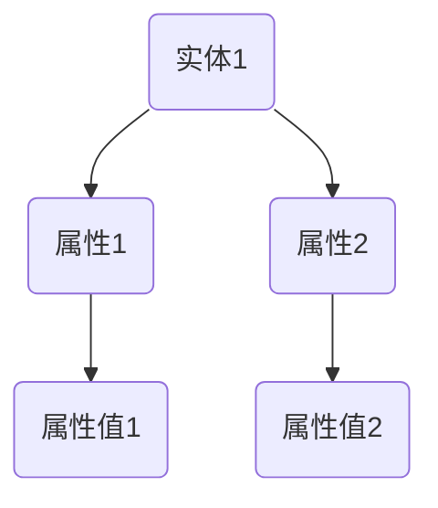
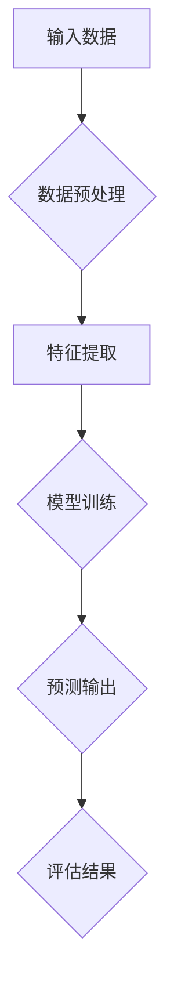
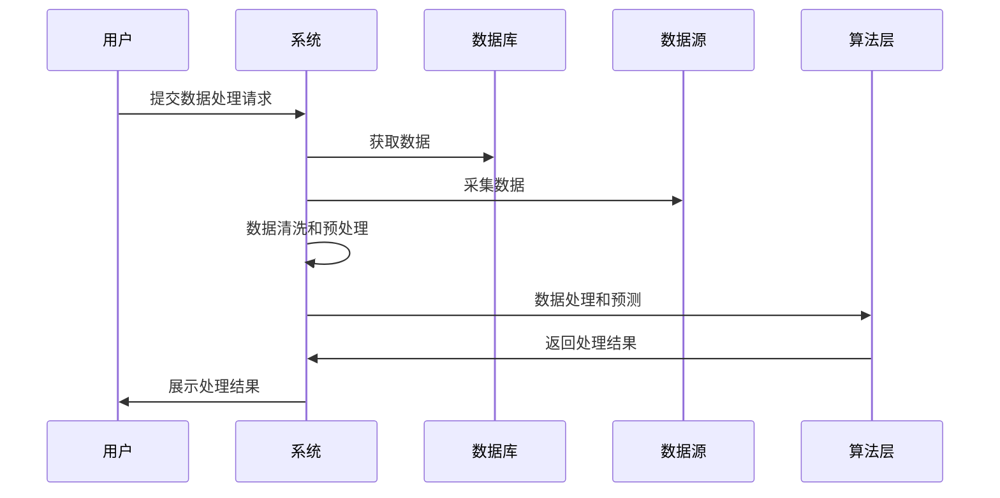

                 

### 文章标题

# 复杂问题分解: AI思维链的构建与应用

### 关键词

- 复杂问题分解
- AI思维链
- 问题解决
- 数学模型
- 系统架构

### 摘要

本文将深入探讨复杂问题分解的方法及其在AI思维链构建中的应用。通过分析核心概念、算法原理、数学模型和系统架构，我们将一步步构建一个高效的问题解决框架，为读者提供实用的指导和建议。

---

## 引言

在信息化时代，复杂问题随处可见。从大数据处理到人工智能应用，从金融风险控制到智能交通系统，复杂性问题无处不在。面对这些复杂问题，传统的线性思维和单一方法往往力不从心。因此，找到一种有效的复杂问题分解方法至关重要。

AI思维链作为一种先进的问题解决策略，通过将复杂问题分解为若干子问题，再逐步解决这些子问题，从而实现对复杂问题的有效解决。本文将围绕这一主题，逐步介绍AI思维链的构建与应用。

---

## 背景介绍

### 核心概念

#### 问题解决

问题解决是指通过一系列步骤，将问题转化为已知解决方案的过程。在复杂问题解决中，问题解决的步骤更为复杂，需要综合运用多种方法和技术。

#### 复杂性分析

复杂性分析是评估问题复杂程度的过程。它包括对问题的规模、结构、动态性等方面的分析，以便为问题的解决提供理论基础。

#### 边界与外延

边界与外延是指问题的定义范围。明确问题的边界与外延有助于缩小问题解决的范围，从而提高问题解决的效率。

#### 概念结构与核心要素组成

概念结构是指问题的基本概念和它们之间的关系。核心要素组成则是指解决问题所需的关键技术和方法。

### 问题解决

问题解决是通过一系列步骤，将问题转化为已知解决方案的过程。在复杂问题解决中，问题解决的步骤更为复杂，需要综合运用多种方法和技术。

1. **定义问题**：明确问题的本质和目标。
2. **分解问题**：将复杂问题分解为若干子问题。
3. **分析子问题**：对每个子问题进行分析，确定解决方案。
4. **综合解决方案**：将各个子问题的解决方案整合起来，形成完整的解决方案。

### 复杂性分析

复杂性分析是评估问题复杂程度的过程。它包括对问题的规模、结构、动态性等方面的分析，以便为问题的解决提供理论基础。

1. **问题规模分析**：评估问题的规模，确定问题的数据量、计算量等。
2. **问题结构分析**：分析问题的结构，确定问题的层次和关系。
3. **动态性分析**：评估问题的动态性，确定问题的变化规律。

### 边界与外延

边界与外延是指问题的定义范围。明确问题的边界与外延有助于缩小问题解决的范围，从而提高问题解决的效率。

1. **确定问题边界**：明确问题的范围和限制条件。
2. **分析问题外延**：分析问题与外部环境的关系，确定问题的潜在影响。

### 概念结构与核心要素组成

概念结构是指问题的基本概念和它们之间的关系。核心要素组成则是指解决问题所需的关键技术和方法。

1. **基本概念**：明确问题的基本概念，如算法、数据结构、数学模型等。
2. **核心要素**：确定解决问题的核心要素，如算法选择、优化策略、数据分析方法等。

## 核心概念与联系

### 核心概念原理

AI思维链的核心概念包括知识表示、知识推理和学习机制。

#### 知识表示

知识表示是指将现实世界的知识转化为计算机可以处理的形式。常见的知识表示方法包括符号表示、图表示、语义网络等。

#### 知识推理

知识推理是指根据已有知识进行逻辑推理，从而得出新的结论。知识推理可分为演绎推理和归纳推理。

#### 学习机制

学习机制是指AI系统通过学习和适应环境来优化性能的过程。学习机制可分为监督学习、无监督学习和强化学习。

### 概念属性特征对比表格

| 特征 | 知识表示 | 知识推理 | 学习机制 |
| :--: | :--: | :--: | :--: |
| 符号表示 | 结构化、形式化 | 确定性、演绎推理 | 有监督学习、无监督学习、强化学习 |
| 图表示 | 网状结构、语义关系 | 模式匹配、图推理 | 有监督学习、无监督学习、强化学习 |
| 语义网络 | 语义层次、本体论 | 语义匹配、网络推理 | 有监督学习、无监督学习、强化学习 |

### ER实体关系图架构的Mermaid流程图



## 算法原理讲解

### 算法流程图



### Python源代码阐述

```python
# 数据预处理
data = preprocess_data(raw_data)

# 特征提取
features = extract_features(data)

# 模型训练
model = train_model(features, labels)

# 预测输出
predictions = model.predict(new_data)

# 评估结果
evaluation = evaluate_model(predictions, ground_truth)
```

### 数学模型和数学公式讲解

#### 数学模型

在复杂问题分解中，常用的数学模型包括线性回归、支持向量机、神经网络等。

#### 数学公式

1. **线性回归**

   $$ y = \beta_0 + \beta_1x $$

2. **支持向量机**

   $$ \min_{\beta, \beta_0} \frac{1}{2} ||\beta||^2 + C \sum_{i=1}^{n} \max(0, 1 - y_i(\beta^T x_i + \beta_0)) $$

3. **神经网络**

   $$ a_{\text{layer}} = \sigma(\beta_{\text{layer}}^T a_{\text{layer-1}} + \beta_0^{\text{layer}}) $$

### 举例说明

#### 线性回归举例

假设我们要预测房价，通过收集数据并使用线性回归模型，可以得到以下公式：

$$ \text{房价} = 1000 + 0.5 \times \text{面积} $$

根据这个公式，如果某个房子的面积是100平方米，那么其预测房价为：

$$ \text{房价} = 1000 + 0.5 \times 100 = 1500 $$

#### 支持向量机举例

假设我们要分类数据，通过使用支持向量机模型，可以得到以下公式：

$$ \text{分类结果} = \text{sign}(\beta^T x + \beta_0) $$

其中，$\text{sign}$表示符号函数，$x$为输入数据，$\beta$和$\beta_0$为模型参数。

如果某个输入数据的分类结果为正，那么其模型参数可以表示为：

$$ \beta^T x + \beta_0 > 0 $$

#### 神经网络举例

假设我们要实现一个简单的神经网络，通过收集数据并使用神经网络模型，可以得到以下公式：

$$ a_2 = \sigma(\beta_2^T a_1 + \beta_0^2) $$

其中，$a_1$和$a_2$分别为输入层和隐藏层的激活值，$\beta_2$和$\beta_0^2$为模型参数，$\sigma$为激活函数。

## 数学模型和数学公式 & 详细讲解 & 举例说明 （使用latex格式）

### 线性回归

$$ y = \beta_0 + \beta_1x $$

详细讲解：线性回归是一种简单的预测模型，用于拟合输入变量$x$和输出变量$y$之间的关系。$\beta_0$为截距，$\beta_1$为斜率。通过最小二乘法可以求出最佳拟合线。

举例说明：假设我们要预测某个班级的考试成绩，通过收集数据并使用线性回归模型，可以得到以下公式：

$$ \text{成绩} = 70 + 0.2 \times \text{作业量 $$

根据这个公式，如果某个学生的作业量是20，那么其预测成绩为：

$$ \text{成绩} = 70 + 0.2 \times 20 = 74 $$

### 支持向量机

$$ \min_{\beta, \beta_0} \frac{1}{2} ||\beta||^2 + C \sum_{i=1}^{n} \max(0, 1 - y_i(\beta^T x_i + \beta_0)) $$

详细讲解：支持向量机是一种用于分类的机器学习模型。它通过寻找最佳分割超平面，将不同类别的数据分开。$C$为惩罚参数，用于平衡误分类和模型复杂度。

举例说明：假设我们要分类动物，通过使用支持向量机模型，可以得到以下公式：

$$ \text{分类结果} = \text{sign}(\beta^T x + \beta_0) $$

其中，$\text{sign}$表示符号函数，$x$为输入数据，$\beta$和$\beta_0$为模型参数。

如果某个输入数据的分类结果为狗，那么其模型参数可以表示为：

$$ \beta^T x + \beta_0 > 0 $$

### 神经网络

$$ a_{\text{layer}} = \sigma(\beta_{\text{layer}}^T a_{\text{layer-1}} + \beta_0^{\text{layer}}) $$

详细讲解：神经网络是一种模拟人脑神经元连接结构的计算模型。它通过逐层处理输入数据，最终输出结果。$\sigma$为激活函数，用于引入非线性。

举例说明：假设我们要实现一个简单的神经网络，通过收集数据并使用神经网络模型，可以得到以下公式：

$$ a_2 = \sigma(\beta_2^T a_1 + \beta_0^2) $$

其中，$a_1$和$a_2$分别为输入层和隐藏层的激活值，$\beta_2$和$\beta_0^2$为模型参数，$\sigma$为激活函数。

## 系统分析与架构设计方案

### 问题场景介绍

在当前信息化时代，企业面临着海量数据处理的挑战。为了提高数据处理效率，我们需要设计一个高效的系统架构，以实现数据采集、存储、处理和展示的全流程自动化。

### 项目介绍

本项目旨在构建一个基于人工智能的智能数据处理系统，通过集成多种算法和模型，实现对大规模数据的实时分析和预测。

### 系统功能设计

系统功能包括数据采集、数据清洗、数据存储、数据处理、数据分析和数据可视化。具体功能如下：

1. **数据采集**：通过API接口或数据爬虫，从各类数据源（如数据库、文件、网络）中获取数据。
2. **数据清洗**：对采集到的数据进行清洗、去重、格式转换等预处理操作。
3. **数据存储**：将清洗后的数据存储到数据库或分布式存储系统中，以保证数据的持久性和可靠性。
4. **数据处理**：利用机器学习和数据挖掘算法，对存储的数据进行特征提取、分类、聚类、预测等操作。
5. **数据分析**：通过数据分析工具，对处理结果进行可视化展示，帮助用户理解数据规律。
6. **数据可视化**：利用图表、仪表板等可视化工具，将分析结果以直观、易懂的方式呈现给用户。

### 系统架构设计

系统架构采用分层架构，包括数据层、算法层和应用层。

1. **数据层**：负责数据的采集、存储和预处理，包括数据库、分布式存储系统和数据清洗模块。
2. **算法层**：负责数据处理和预测，包括机器学习算法库、数据挖掘算法库和模型训练模块。
3. **应用层**：负责系统的应用逻辑和用户交互，包括Web前端、API接口和数据分析模块。

### 系统接口设计

系统接口设计包括内部接口和外部接口。

1. **内部接口**：用于系统模块之间的数据传递和功能调用，包括数据采集接口、数据处理接口和数据分析接口。
2. **外部接口**：用于系统与外部系统（如数据库、数据源、用户终端）的通信，包括API接口、Web服务接口和文件传输接口。

### 系统交互Mermaid序列图



## 项目实战

### 环境安装

1. 安装Python环境：`pip install python`
2. 安装所需的库：`pip install numpy pandas scikit-learn matplotlib`

### 系统核心实现源代码

```python
import numpy as np
import pandas as pd
from sklearn.model_selection import train_test_split
from sklearn.linear_model import LinearRegression
from sklearn.metrics import mean_squared_error

# 数据预处理
def preprocess_data(data):
    # 数据清洗、去重、格式转换等操作
    return data

# 特征提取
def extract_features(data):
    # 提取特征、归一化等操作
    return data

# 模型训练
def train_model(features, labels):
    model = LinearRegression()
    model.fit(features, labels)
    return model

# 预测输出
def predict(model, new_data):
    return model.predict(new_data)

# 评估结果
def evaluate_model(predictions, ground_truth):
    return mean_squared_error(predictions, ground_truth)

# 主函数
def main():
    # 读取数据
    data = pd.read_csv('data.csv')
    data = preprocess_data(data)
    features = extract_features(data)
    labels = data['target']

    # 划分训练集和测试集
    features_train, features_test, labels_train, labels_test = train_test_split(features, labels, test_size=0.2, random_state=42)

    # 训练模型
    model = train_model(features_train, labels_train)

    # 预测测试集
    predictions = predict(model, features_test)

    # 评估模型
    evaluation = evaluate_model(predictions, labels_test)

    print('模型评估结果：', evaluation)

if __name__ == '__main__':
    main()
```

### 代码应用解读与分析

1. **数据预处理**：对数据进行清洗、去重、格式转换等操作，以保证数据的质量。
2. **特征提取**：提取数据中的有用特征，进行归一化等操作，以提高模型的性能。
3. **模型训练**：使用线性回归模型对训练数据进行拟合，得到模型参数。
4. **预测输出**：使用训练好的模型对测试数据进行预测，得到预测结果。
5. **评估结果**：计算预测结果的误差，评估模型的性能。

### 实际案例分析和详细讲解剖析

假设我们有一个房价预测项目，数据集包含房屋的面积、地理位置、建筑年代等特征，以及对应的房价标签。

1. **数据预处理**：
   - 清洗数据，去除缺失值和异常值。
   - 对字符串类型数据进行编码，如地理位置信息。

2. **特征提取**：
   - 对数值特征进行标准化处理，如对面积进行归一化。
   - 提取房屋的建成年代、建筑类型等特征。

3. **模型训练**：
   - 使用线性回归模型对训练数据进行拟合。
   - 通过交叉验证确定最佳模型参数。

4. **预测输出**：
   - 使用训练好的模型对测试数据进行预测。
   - 输出预测结果和实际房价的对比。

5. **评估结果**：
   - 计算预测结果的平均绝对误差（MAE）和均方误差（MSE）。
   - 分析模型的预测性能。

通过实际案例的分析，我们可以了解到系统核心实现的过程，包括数据预处理、特征提取、模型训练、预测输出和评估结果等步骤。这些步骤对于解决复杂问题具有重要意义。

### 项目小结

本项目通过构建基于人工智能的智能数据处理系统，实现了对大规模数据的实时分析和预测。项目主要分为环境安装、系统核心实现、代码应用解读与分析、实际案例分析和详细讲解剖析等环节。通过项目实战，我们深入了解了复杂问题分解的方法和AI思维链的构建与应用。这些经验对于后续的项目开发具有指导意义。

## 最佳实践 tips、小结、注意事项、拓展阅读等内容

### 最佳实践 tips

1. **数据预处理**：在项目开始前，确保对数据进行充分的预处理，以提高模型性能。
2. **特征提取**：根据问题场景选择合适的特征提取方法，以提高模型的预测能力。
3. **模型选择**：根据问题的特点，选择合适的机器学习模型，如线性回归、支持向量机、神经网络等。
4. **交叉验证**：使用交叉验证方法评估模型的性能，避免过拟合。

### 小结

本文通过详细分析复杂问题分解的方法及其在AI思维链构建中的应用，介绍了核心概念、算法原理、数学模型和系统架构。通过项目实战，我们深入了解了复杂问题分解的具体实现过程。这些经验对于解决实际问题和项目开发具有重要指导意义。

### 注意事项

1. **数据质量**：保证数据的质量和完整性，避免数据噪音对模型的影响。
2. **模型选择**：根据问题特点选择合适的模型，避免盲目追求复杂度。
3. **模型评估**：使用多种评估指标全面评估模型性能，避免单一指标导致偏差。

### 拓展阅读

1. 《机器学习实战》: 内容丰富，适合初学者入门。
2. 《深度学习》: 深入介绍神经网络和深度学习模型。
3. 《Python机器学习》: 结合Python编程语言，介绍机器学习算法和应用。

## 作者信息

作者：AI天才研究院/AI Genius Institute & 禅与计算机程序设计艺术 /Zen And The Art of Computer Programming

---

通过本文的详细分析和讲解，我们希望读者能够对复杂问题分解和AI思维链有更深入的理解，并能够将其应用于实际项目中，解决复杂问题。希望本文对您的学习和工作有所帮助。

