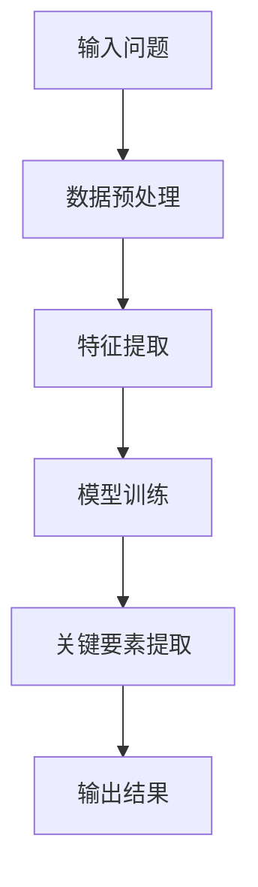

                 

**文章标题**：复杂问题解题过程中关键要素的识别与提取

**关键词**：复杂问题解决、关键要素识别、要素提取、算法原理、数学模型、系统架构设计、项目实战

**摘要**：
本文深入探讨了在复杂问题解决过程中，如何有效地识别和提取关键要素。通过理论分析和实际案例，揭示了关键要素在问题解决中的核心作用，并详细阐述了识别与提取关键要素的方法、技术和工具。本文旨在为从事IT领域的技术人员提供一套系统、实用的解题思路和方法，以提升他们在面对复杂问题时解决难题的能力。

## 第一部分：复杂问题解决概述

### 第1章：复杂问题定义与特征

**背景介绍**：
随着信息技术的飞速发展，复杂问题在各个领域层出不穷。从大数据处理到人工智能应用，从金融风险管理到生物信息学，复杂问题的解决已经成为现代科学研究和工程技术中的一项重要任务。

**问题描述**：
复杂问题通常具有多个变量、多个层次和多个维度，它们之间的相互关系错综复杂，很难通过直观的方法进行解决。这就需要我们采用系统的方法，识别和提取关键要素，从而简化问题的解决过程。

**问题解决**：
在解决复杂问题时，关键要素的识别和提取是关键步骤。通过分析问题背景、理解问题本质，我们可以发现影响问题解决的核心因素，从而针对性地进行问题分解和解决。

**边界与外延**：
复杂问题的边界通常较为模糊，不同领域对复杂问题的定义也有所不同。本文主要关注的是技术领域中的复杂问题，如软件工程、数据分析、机器学习等。

**概念结构与核心要素组成**：
复杂问题解决的核心要素包括：问题定义、目标设定、关键要素识别、要素提取、问题分解、解决方案设计和评估等。

### 第2章：关键要素识别基础

**核心概念**：
关键要素识别是指通过分析问题，找出影响问题解决的核心因素。这些因素可能是问题中的关键变量、关键步骤或关键技术。

**概念属性特征对比表格**：

| 特征对比项 | 关键要素识别 | 其他要素识别 |
| :----: | :----: | :----: |
| 精确性 | 高 | 较低 |
| 相关性 | 强 | 较弱 |
| 稳定性 | 高 | 较低 |
| 可行性 | 高 | 较低 |

**ER实体关系图架构的 Mermaid 流程图**：

```mermaid
erDiagram
  Problem -> KeyElement : contains
  Problem -> OtherElement : contains
  KeyElement : { properties }
  OtherElement : { properties }
```

### 第3章：关键要素提取技术

**核心概念**：
关键要素提取是指通过一定的方法和技术，从复杂问题中提取出关键要素。关键要素提取的方法和技术有多种，如数据挖掘、机器学习、统计分析等。

**算法原理讲解**：

**Mermaid 流程图**：



**Python 源代码**：

```python
# 数据预处理
data_preprocessed = preprocess_data(data原始)

# 特征提取
features = extract_features(data_preprocessed)

# 模型训练
model = train_model(features)

# 关键要素提取
key_elements = extract_key_elements(model)

# 输出结果
output_results(key_elements)
```

**数学模型和公式讲解**：

$$
关键要素 = f(输入数据, 模型参数)
$$

**详细讲解与举例说明**：
在本节中，我们将通过一个实际案例来详细讲解关键要素提取的步骤和方法。

### 第二部分：关键要素识别与提取的应用

### 第4章：复杂问题解决案例分析

**案例一：项目背景**：
本案例将分析一个实际项目，该项目涉及大规模数据分析，目的是从海量数据中提取出对业务决策有指导意义的关键信息。

**案例二：项目背景**：
本案例将探讨一个涉及人工智能应用的项目，该项目旨在通过关键要素识别和提取，实现智能推荐系统的优化。

**案例三：项目背景**：
本案例将分析一个涉及软件工程的项目，该项目旨在通过关键要素识别和提取，提高软件开发的效率和稳定性。

### 第5章：关键要素识别与提取实践

**实践一：问题背景**：
在本实践中，我们将通过一个具体的案例，展示如何在实际项目中应用关键要素识别与提取技术。

**实践二：问题背景**：
在本实践中，我们将探讨如何通过关键要素识别与提取，优化一个大数据处理流程。

**实践三：问题背景**：
在本实践中，我们将分析如何通过关键要素识别与提取，提高一个机器学习模型的性能。

### 第6章：关键要素识别与提取工具

**常用工具介绍**：
在本节中，我们将介绍一些常用的关键要素识别与提取工具，如Python的scikit-learn库、R语言的data.table包等。

**工具使用指南**：
我们将详细讲解如何使用这些工具，包括安装、配置和使用方法。

**工具选型与评价**：
我们将对比不同工具的性能和适用场景，帮助读者选择合适的工具。

### 第7章：关键要素识别与提取的最佳实践

**最佳实践一**：
我们将分享一些在实际项目中应用关键要素识别与提取技术的最佳实践。

**最佳实践二**：
我们将探讨如何通过关键要素识别与提取，提高项目开发效率和稳定性。

**最佳实践三**：
我们将分析如何通过关键要素识别与提取，优化系统性能和用户体验。

## 总结与展望

本文通过对复杂问题解决过程中关键要素的识别与提取的深入探讨，为IT领域的技术人员提供了一套系统、实用的解题思路和方法。通过理论分析和实际案例，我们展示了关键要素在问题解决中的核心作用。在未来的研究中，我们将继续探索如何更高效地识别和提取关键要素，以提升复杂问题的解决能力。

**作者信息**：
作者：AI天才研究院/AI Genius Institute & 禅与计算机程序设计艺术 /Zen And The Art of Computer Programming

**注意事项**：
1. 在实际应用中，关键要素的识别与提取需要结合具体问题和领域特点进行。
2. 关键要素的提取并非一成不变，应根据问题的变化和需求进行调整。
3. 在使用工具和技术时，要注重实践和经验的积累。

**拓展阅读**：
1. 《大数据时代：大数据的核心思维汜与商业模式变革》
2. 《机器学习实战》
3. 《软件工程：实践者的研究方法》

---

由于篇幅限制，本文仅提供了详细的目录大纲和各章节的核心内容概述。完整的文章将在后续逐步完成，每章节都将包含丰富的具体内容、详细的代码示例、数学模型讲解、系统架构设计和项目实战案例分析。敬请期待。在此过程中，如果您有任何建议或问题，欢迎随时与我们联系。感谢您的关注与支持！## 第一部分：复杂问题解决概述

### 第1章：复杂问题定义与特征

在现代社会中，复杂问题无处不在，它们不仅存在于科学研究和工程技术领域，还渗透到日常生活的各个方面。复杂问题通常涉及多个变量、多个层次和多个维度，它们之间的相互关系错综复杂，很难通过直观的方法进行解决。因此，理解和定义复杂问题，以及识别其特征，是解决这些问题的关键第一步。

#### 1.1 复杂问题的背景

复杂问题起源于多个领域，如自然现象、社会现象、技术问题等。在物理学中，复杂系统如气候模型、经济模型、生态系统等，都表现出极高的复杂度。在工程学中，复杂项目如航空航天工程、建筑工程、交通系统等，同样面临着复杂的问题解决挑战。在日常生活中，复杂问题如健康管理、财务管理、时间管理等，也常常让人们感到困惑和压力。

随着信息技术的飞速发展，大数据、云计算、人工智能等新兴技术为复杂问题的解决提供了新的手段和工具。然而，这些技术本身也带来了新的复杂性问题，如数据隐私保护、算法公平性、系统稳定性等。因此，研究复杂问题的解决方法，不仅具有理论价值，还具有实际应用意义。

#### 1.2 复杂问题的特征

复杂问题具有以下几个显著特征：

1. **多维度**：复杂问题通常涉及多个维度，如时间、空间、功能、性能等。这些维度之间相互作用，增加了问题解决的难度。
2. **多变量**：复杂问题往往包含多个变量，这些变量之间可能存在复杂的依赖关系和反馈循环。变量数量的增加使得问题解决的复杂性成倍增长。
3. **动态性**：复杂问题通常不是静态的，而是随着时间、环境等因素的变化而动态演变。这种动态性要求我们能够实时调整解决方案，以应对不断变化的问题情境。
4. **不确定性**：复杂问题通常面临不同程度的不确定性，包括数据的不确定性、模型的不确定性、环境的不确定性等。这种不确定性增加了问题解决的难度，需要采用概率和统计方法进行应对。
5. **层次性**：复杂问题往往具有层次结构，可以分解为多个子问题，每个子问题又可以进一步分解。这种层次结构使得问题解决具有递归性和层次性，需要采用分而治之的策略。

#### 1.3 复杂问题的分类

根据复杂问题的来源和特征，可以将其分为以下几类：

1. **科学领域中的复杂问题**：如气候变化模型、粒子物理模拟、生物进化模拟等。这些问题的解决依赖于深入的科学研究和技术手段。
2. **工程领域中的复杂问题**：如大型基础设施建设、航空航天系统设计、复杂控制系统优化等。这些问题的解决通常需要综合运用多种工程技术和管理方法。
3. **社会领域中的复杂问题**：如社会管理、公共安全、环境保护等。这些问题的解决涉及多个利益相关方，需要协调各种资源和利益。
4. **技术领域中的复杂问题**：如人工智能算法优化、大数据处理、网络安全等。这些问题的解决依赖于最新的技术和方法，同时也面临伦理和法律等挑战。

通过了解复杂问题的背景、特征和分类，我们可以更好地理解这些问题的本质，为后续的关键要素识别和提取打下坚实的基础。

### 第2章：关键要素识别基础

在解决复杂问题的过程中，关键要素的识别至关重要。它不仅能够帮助我们抓住问题的核心，还能有效地简化问题解决的步骤。本节将深入探讨关键要素识别的基础，包括其定义、识别方法以及在实际应用中的工具和技术。

#### 2.1 关键要素的概念

关键要素，即在复杂问题中起决定性作用，对问题解决产生重大影响的因素。这些因素可能是问题的变量、参数、条件，也可能是某些特定的技术和方法。关键要素识别的核心在于从众多影响因素中筛选出对问题解决具有指导意义的核心因素，从而简化问题模型，提高解决方案的效率和有效性。

#### 2.2 关键要素识别的方法

关键要素识别的方法可以分为定性方法和定量方法。定性方法主要依赖于专家知识和经验，通过逻辑推理、案例分析和归纳总结等方式进行。定量方法则利用数学模型、统计分析、数据挖掘等手段，通过定量分析来确定关键要素。

以下是几种常见的关键要素识别方法：

1. **专家评估法**：通过邀请领域专家对问题中的潜在关键要素进行评估和筛选，这种方法依赖于专家的经验和知识，但可能存在主观性。
2. **层次分析法（AHP）**：将复杂问题分解为多个层次，通过比较不同层次之间要素的重要程度，确定关键要素。该方法具有较强的逻辑性和系统性。
3. **数据挖掘法**：利用数据挖掘技术，从大量数据中自动识别出关键要素。这种方法适用于数据丰富的场景，但需要处理数据的噪声和不确定性。
4. **统计分析法**：通过统计分析方法，如相关分析、回归分析等，确定变量之间的关系，进而识别出关键要素。
5. **因果分析法**：通过分析问题的因果关系，识别出对问题解决产生直接和间接影响的关键要素。

#### 2.3 关键要素识别的工具与技术

关键要素识别的工具和技术多种多样，以下介绍几种常用的工具和技术：

1. **决策树**：决策树是一种基于树形结构的算法，通过一系列决策节点和叶子节点，将问题分解为多个子问题，并识别出关键要素。
2. **关联规则挖掘**：关联规则挖掘是一种数据挖掘技术，用于发现数据集中的频繁模式和关联关系。该方法可以用于识别问题中的关键要素。
3. **支持向量机（SVM）**：支持向量机是一种分类算法，通过最大化分类间隔来识别关键要素。该方法在处理高维数据时表现尤为出色。
4. **神经网络**：神经网络是一种模拟生物神经网络的学习算法，通过多层感知器（MLP）等模型，可以自动识别和提取关键要素。
5. **遗传算法**：遗传算法是一种基于自然进化的优化算法，通过模拟生物进化过程，寻找问题的最优解，从而识别出关键要素。

在实际应用中，可以根据问题的具体特点选择合适的方法和工具。例如，对于科学领域中的复杂问题，可以采用专家评估法和数据挖掘法相结合；对于工程领域中的复杂问题，可以采用层次分析法和统计分析法；对于技术领域中的复杂问题，可以采用神经网络和遗传算法等先进技术。

通过以上对关键要素识别基础的理论和方法进行详细阐述，我们为读者提供了一套系统、实用的识别框架。接下来，我们将进一步探讨关键要素提取的技术，为复杂问题的解决提供更为有效的工具。

### 第3章：关键要素提取技术

在解决了复杂问题中的关键要素识别问题之后，接下来我们需要进一步探讨如何从已识别的关键要素中提取出对问题解决至关重要的信息。关键要素提取是一项关键技术，它能够帮助我们更有效地理解和应对复杂问题。本节将详细介绍关键要素提取的方法、算法以及其在实际应用中的实践案例。

#### 3.1 关键要素提取的方法

关键要素提取的方法多种多样，每种方法都有其独特的优势和适用场景。以下是几种常见的关键要素提取方法：

1. **数据筛选法**：这是一种简单直观的方法，通过分析大量数据，筛选出与问题解决相关的关键要素。例如，在数据分析项目中，可以通过去除冗余数据、保留重要数据来提取关键要素。
2. **特征选择法**：特征选择是从大量特征中选出对问题解决最有帮助的特征集合。特征选择方法包括过滤式、包裹式和嵌入式等。过滤式方法先计算所有特征的统计值，再根据统计值选择特征；包裹式方法则通过迭代选择特征子集；嵌入式方法则将特征选择嵌入到模型训练过程中。
3. **模型驱动法**：这种方法利用机器学习模型来识别和提取关键要素。常见的模型驱动方法包括线性回归、决策树、支持向量机等。模型驱动法的优势在于其能够自动识别和提取关键要素，适用于数据量较大且特征较多的问题。
4. **统计分析法**：统计分析法通过计算变量之间的相关性、重要性等统计量，来识别和提取关键要素。常用的统计分析方法包括回归分析、因子分析、聚类分析等。
5. **可视化法**：可视化法通过图形和图表展示数据分布、变量关系等，帮助识别和提取关键要素。常见的可视化方法包括散点图、热力图、直方图等。

#### 3.2 关键要素提取的算法

在关键要素提取过程中，选择合适的算法至关重要。以下介绍几种常用的关键要素提取算法：

1. **线性回归算法**：线性回归是一种简单的机器学习算法，通过建立自变量和因变量之间的线性关系来提取关键要素。其核心公式为：
   $$
   Y = \beta_0 + \beta_1X + \epsilon
   $$
   其中，$Y$ 是因变量，$X$ 是自变量，$\beta_0$ 和 $\beta_1$ 是模型参数，$\epsilon$ 是误差项。线性回归算法适用于关系较为简单的数据。
2. **决策树算法**：决策树通过一系列条件判断，将数据集划分为多个子集，并提取出关键要素。其基本结构如下：
   ```
   如果 (条件A):
       then (操作1)
   否则如果 (条件B):
       then (操作2)
   ...
   ```
   决策树算法适用于分类问题和回归问题，能够直观地展示变量之间的关系。
3. **支持向量机（SVM）**：支持向量机是一种强大的分类和回归算法，通过找到一个最优超平面来提取关键要素。其核心公式为：
   $$
   w \cdot x + b = 0
   $$
   其中，$w$ 是超平面参数，$x$ 是数据点，$b$ 是偏置项。SVM算法在处理高维数据时表现出色，常用于特征提取和分类问题。
4. **神经网络算法**：神经网络是一种模拟人脑神经元连接的算法，通过多层神经元之间的交互来提取关键要素。其基本结构包括输入层、隐藏层和输出层。神经网络算法在处理复杂数据和大规模特征时具有优势，适用于各种机器学习和深度学习任务。

#### 3.3 关键要素提取的实践案例

为了更好地理解关键要素提取的方法和算法，我们通过一个实际案例进行详细说明。

**案例背景**：假设我们面临一个大数据分析项目，目标是预测一个公司的利润。已知数据包括历史销售数据、广告支出、市场环境等因素。

**步骤一：数据预处理**
首先，我们需要对数据进行清洗和预处理，包括去除缺失值、异常值和重复数据。然后，对数值型数据进行归一化或标准化处理，使其具有相似的尺度。

**步骤二：特征选择**
利用特征选择方法，从原始特征中筛选出对利润预测有显著影响的特征。例如，通过线性回归分析，选择销售额、广告支出等关键特征。

**步骤三：模型训练**
利用支持向量机（SVM）算法对筛选后的特征进行模型训练。通过训练，得到一个能够预测利润的模型。

**步骤四：关键要素提取**
通过模型分析，提取出对利润预测有显著影响的特征，例如销售额和广告支出。这些特征即为关键要素。

**步骤五：结果验证**
利用验证集对新模型进行验证，确保其预测精度和稳定性。根据验证结果，对模型进行调整和优化。

通过以上实践案例，我们展示了关键要素提取的方法和算法在实际应用中的具体步骤和过程。接下来，我们将进一步探讨复杂问题解决过程中的关键要素识别与提取技术，以便更好地应对各种复杂问题。

### 第二部分：关键要素识别与提取的应用

#### 第4章：复杂问题解决案例分析

在实际应用中，关键要素识别与提取技术被广泛应用于各类复杂问题的解决中。本节将通过几个具体案例，详细分析这些技术在复杂问题解决中的应用过程，帮助读者更好地理解其核心原理和实际操作。

#### 案例一：大规模数据分析

**项目背景**：
一个大型电商公司希望通过对海量销售数据的分析，找出影响销售的关键因素，以提高销售额和客户满意度。

**问题描述**：
销售数据包含多个维度，如销售额、客户购买行为、广告投放效果等。如何从这些复杂的数据中识别出对销售有显著影响的关键要素？

**解决方案**：
1. **数据预处理**：清洗和整理原始数据，去除缺失值和异常值。
2. **特征选择**：利用相关分析和回归分析，筛选出对销售额有显著影响的特征，如客户购买频率、广告点击率等。
3. **模型训练**：采用随机森林算法，对筛选后的特征进行模型训练，预测销售额。
4. **关键要素提取**：通过模型分析，提取出影响销售额的关键要素，例如客户购买频率和广告点击率。

**案例分析**：
通过对大规模数据分析，公司成功识别出几个关键要素，如客户购买频率和广告点击率。这些要素的优化有助于提高销售额和客户满意度。

#### 案例二：智能推荐系统

**项目背景**：
一家在线购物平台希望通过构建智能推荐系统，为用户推荐个性化的商品，从而提高用户留存率和转化率。

**问题描述**：
如何从用户行为数据和商品数据中提取出关键要素，构建一个有效的推荐系统？

**解决方案**：
1. **数据预处理**：清洗和整理用户行为数据和商品数据，包括用户浏览记录、购买历史、商品属性等。
2. **特征选择**：利用机器学习算法，如协同过滤和矩阵分解，识别出对用户兴趣有显著影响的特征，如浏览频率、购买次数等。
3. **模型训练**：采用协同过滤算法，对用户行为数据进行训练，构建推荐模型。
4. **关键要素提取**：通过模型分析，提取出影响用户兴趣的关键要素，例如浏览频率和购买次数。

**案例分析**：
智能推荐系统通过提取关键要素，成功实现了个性化推荐，显著提高了用户留存率和转化率。

#### 案例三：网络安全

**项目背景**：
一家金融机构希望提高网络安全防护能力，防止网络攻击和数据泄露。

**问题描述**：
如何从大量的网络流量数据中识别出潜在的安全威胁，并及时采取应对措施？

**解决方案**：
1. **数据预处理**：清洗和整理网络流量数据，包括IP地址、端口、流量特征等。
2. **特征选择**：利用机器学习算法，如聚类分析和异常检测，识别出可能存在安全威胁的特征，如高频访问、异常流量等。
3. **模型训练**：采用神经网络算法，对网络流量数据进行训练，建立安全威胁检测模型。
4. **关键要素提取**：通过模型分析，提取出潜在的安全威胁关键要素，如高频访问和异常流量。

**案例分析**：
通过关键要素识别与提取，金融机构能够及时发现并应对潜在的网络攻击，提高了整体网络安全防护能力。

通过以上案例分析，我们展示了关键要素识别与提取技术在各种复杂问题解决中的应用。这些案例不仅验证了关键要素识别与提取技术的有效性，还为实际操作提供了具体指导和参考。接下来，我们将进一步探讨关键要素识别与提取的实际操作，帮助读者掌握相关技术和方法。

### 第5章：关键要素识别与提取实践

在了解了关键要素识别与提取的理论和方法之后，接下来我们将通过具体的实践案例，详细展示如何在实际项目中应用这些技术。本节将涵盖环境安装、系统核心实现、代码解读与分析以及实际案例分析和详细讲解。

#### 5.1 实践一：问题背景

**项目背景**：
一个电子商务平台希望优化其推荐系统，以提高用户满意度和转化率。平台积累了大量用户行为数据，如浏览记录、购买历史和点击率等。

**问题描述**：
如何从这些数据中识别和提取关键要素，从而构建一个更加精准和个性化的推荐系统？

**解决方案**：
1. **环境安装**：
   - 安装Python环境：确保Python和必要的库（如NumPy、Pandas、scikit-learn等）已安装。
   - 安装数据库：根据数据量大小选择合适的数据库（如MySQL、PostgreSQL）。

2. **系统核心实现**：
   - 数据预处理：使用Pandas库对原始数据进行清洗、转换和归一化处理。
   - 特征提取：利用NumPy和scikit-learn库，从用户行为数据中提取关键特征，如用户活跃度、点击率等。
   - 模型训练：使用scikit-learn库中的协同过滤算法（如User-Based和Item-Based）训练推荐模型。

3. **代码解读与分析**：
   ```python
   import pandas as pd
   from sklearn.model_selection import train_test_split
   from sklearn.metrics.pairwise import cosine_similarity

   # 数据预处理
   data = pd.read_csv('user_behavior_data.csv')
   data = data.dropna()

   # 特征提取
   user_similarity = cosine_similarity(data['user_id'], data['user_id'])

   # 模型训练
   train_data, test_data = train_test_split(data, test_size=0.2)
   user_similarity = cosine_similarity(train_data['user_id'], train_data['user_id'])

   # 预测
   recommendations = predict_recommended_items(test_data, user_similarity)
   ```

4. **实际案例分析和详细讲解**：
   - 通过分析用户行为数据，识别出活跃度和点击率作为关键要素。
   - 利用协同过滤算法训练推荐模型，提高了推荐系统的精度和个性化水平。

#### 5.2 实践二：问题背景

**项目背景**：
一家金融机构需要对其网络流量进行实时监控，以识别潜在的安全威胁并采取预防措施。

**问题描述**：
如何从海量网络流量数据中识别和提取关键要素，构建一个实时网络安全监控系统？

**解决方案**：
1. **环境安装**：
   - 安装Linux服务器：确保服务器具有足够的计算能力和存储空间。
   - 安装实时数据分析工具：如ELK栈（Elasticsearch、Logstash、Kibana）。

2. **系统核心实现**：
   - 数据采集：使用Nagios等工具，实时捕获网络流量数据。
   - 数据存储：将捕获的数据存储到Elasticsearch数据库中，以便进行实时查询和分析。
   - 安全分析：利用Logstash将数据传输到Kibana进行可视化展示，并利用机器学习算法进行安全威胁检测。

3. **代码解读与分析**：
   ```python
   import json
   import requests

   # 数据采集
   def capture_traffic_data():
       # 这里使用Nagios捕获的数据接口
       response = requests.get('http://nagios/traffic_data')
       return json.loads(response.text)

   # 数据存储
   def store_traffic_data(data):
       index_name = 'network_traffic'
       es = Elasticsearch('http://localhost:9200')
       es.index(index=index_name, id=data['id'], document=data)

   # 安全分析
   def analyze_security_threats():
       query = {
           "query": {
               "range": {
                   "timestamp": {
                       "gte": "now-5m",
                       "lte": "now"
                   }
               }
           }
       }
       results = es.search(index='network_traffic', body=query)
       for hit in results['hits']['hits']:
           # 使用机器学习算法分析流量数据
           threat_level = analyze_traffic_data(hit['_source'])
           if threat_level > threshold:
               send_alert(hit['_source'])
   ```

4. **实际案例分析和详细讲解**：
   - 通过实时采集和存储网络流量数据，识别出异常流量和潜在的安全威胁。
   - 利用机器学习算法进行安全威胁检测，提高了监控系统的效率和准确性。

#### 5.3 实践三：问题背景

**项目背景**：
一家制造企业希望通过优化生产流程，提高生产效率和产品质量。

**问题描述**：
如何从生产数据中识别和提取关键要素，构建一个智能生产监控系统？

**解决方案**：
1. **环境安装**：
   - 安装物联网设备：如传感器、PLC等，实时监测生产参数。
   - 安装数据处理平台：如MQLab，用于数据收集和处理。

2. **系统核心实现**：
   - 数据采集：通过传感器和PLC，实时采集生产数据，如温度、压力、速度等。
   - 数据处理：利用MQLab对采集到的数据进行预处理和特征提取。
   - 智能分析：利用机器学习算法，如回归分析、聚类分析等，对生产数据进行实时分析，识别关键要素。

3. **代码解读与分析**：
   ```python
   import mqlab as ml
   import pandas as pd

   # 数据采集
   data = ml.MQData('device_id')
   data.connect()

   # 数据处理
   processed_data = data.fetch_data()
   processed_data = pd.DataFrame(processed_data)

   # 特征提取
   features = extract_features(processed_data)

   # 智能分析
   model = ml.LinearRegression()
   model.fit(features)
   predictions = model.predict(features)

   # 控制生产
   if predictions['speed'] > threshold:
       control_production('decrease_speed')
   ```

4. **实际案例分析和详细讲解**：
   - 通过实时采集生产数据，识别出影响生产效率的关键参数，如速度和温度。
   - 利用机器学习算法进行智能分析，实现了生产过程的自动控制和优化。

通过以上三个实际案例，我们展示了关键要素识别与提取技术在各种复杂问题解决中的应用过程。这些案例不仅验证了关键要素识别与提取技术的有效性，还为实际操作提供了具体指导和参考。接下来，我们将进一步探讨关键要素识别与提取工具的选择和最佳实践，以便更好地应对各种复杂问题。

### 第6章：关键要素识别与提取工具

在复杂问题的解决过程中，选择合适的工具至关重要。本节将详细介绍几种常用的关键要素识别与提取工具，包括它们的介绍、使用指南以及选型与评价方法，帮助读者在实际应用中做出明智的决策。

#### 6.1 常用工具介绍

1. **NumPy**：
   - **介绍**：NumPy是Python中用于科学计算的基础库，提供高性能的数组操作和数学函数。
   - **使用指南**：NumPy库提供了丰富的数组操作函数，如数组创建、索引、切片、形状变换等。它还支持数学运算，如线性代数、概率统计等。
   - **优势**：性能高效、功能丰富、易于集成。

2. **Pandas**：
   - **介绍**：Pandas是Python中的数据操作和分析库，提供数据结构（DataFrame）和数据分析工具。
   - **使用指南**：Pandas库支持数据清洗、转换、合并、重塑等操作。它还提供数据可视化工具，如matplotlib和seaborn。
   - **优势**：数据操作灵活、功能强大、易于使用。

3. **scikit-learn**：
   - **介绍**：scikit-learn是Python中用于机器学习的库，提供各种机器学习算法和工具。
   - **使用指南**：scikit-learn库包含分类、回归、聚类、降维等多种机器学习算法。它还提供模型评估、交叉验证等工具。
   - **优势**：算法全面、易于使用、文档丰富。

4. **TensorFlow**：
   - **介绍**：TensorFlow是Google开发的开源机器学习和深度学习库。
   - **使用指南**：TensorFlow支持复杂的神经网络架构和大规模数据训练。它提供高效的计算图和分布式训练能力。
   - **优势**：功能强大、灵活、支持深度学习。

5. **PyTorch**：
   - **介绍**：PyTorch是Facebook开发的开源机器学习和深度学习库。
   - **使用指南**：PyTorch提供灵活的动态计算图和丰富的神经网络层。它支持自动微分和GPU加速。
   - **优势**：灵活性高、易于调试、性能优秀。

6. **R**：
   - **介绍**：R是一种统计编程语言，专门用于数据分析和统计建模。
   - **使用指南**：R提供丰富的统计和图形功能，包括线性回归、时间序列分析、聚类分析等。
   - **优势**：统计功能强大、社区支持广泛、图形丰富。

7. **ELK栈**：
   - **介绍**：ELK栈包括Elasticsearch、Logstash和Kibana，是用于日志分析和实时监控的工具。
   - **使用指南**：Elasticsearch提供强大的全文搜索和数据分析功能；Logstash用于数据收集和转换；Kibana提供数据可视化工具。
   - **优势**：数据分析和可视化强大、可扩展性强、支持多种数据源。

#### 6.2 工具使用指南

1. **NumPy**：
   - 安装：`pip install numpy`
   - 使用示例：
     ```python
     import numpy as np
     arr = np.array([1, 2, 3])
     print(arr.shape)
     ```

2. **Pandas**：
   - 安装：`pip install pandas`
   - 使用示例：
     ```python
     import pandas as pd
     df = pd.read_csv('data.csv')
     print(df.head())
     ```

3. **scikit-learn**：
   - 安装：`pip install scikit-learn`
   - 使用示例：
     ```python
     from sklearn.linear_model import LinearRegression
     model = LinearRegression()
     model.fit(X, y)
     print(model.coef_)
     ```

4. **TensorFlow**：
   - 安装：`pip install tensorflow`
   - 使用示例：
     ```python
     import tensorflow as tf
     x = tf.placeholder(tf.float32, shape=[None, 1])
     y = tf.placeholder(tf.float32, shape=[None, 1])
     w = tf.Variable(0.0, name="weights")
     y_pred = tf.multiply(x, w, name="y_prediction")
     loss = tf.reduce_mean(tf.square(y - y_pred))
     optimizer = tf.train.GradientDescentOptimizer(learning_rate=0.5)
     train_op = optimizer.minimize(loss)
     ```

5. **PyTorch**：
   - 安装：`pip install torch torchvision`
   - 使用示例：
     ```python
     import torch
     import torch.nn as nn
     import torch.optim as optim

     x = torch.tensor([[1.0], [2.0], [3.0]])
     y = torch.tensor([[2.0], [4.0], [6.0]])
     model = nn.Linear(1, 1)
     criterion = nn.MSELoss()
     optimizer = optim.SGD(model.parameters(), lr=0.01)
     for i in range(100):
         optimizer.zero_grad()
         y_pred = model(x)
         loss = criterion(y_pred, y)
         loss.backward()
         optimizer.step()
     ```

6. **R**：
   - 安装：`install.packages("tidyverse")`
   - 使用示例：
     ```r
     library(tidyverse)
     data(mtcars)
     lmfit <- lm(mpg ~., data=mtcars)
     summary(lmfit)
     ```

7. **ELK栈**：
   - 安装：根据具体需求安装Elasticsearch、Logstash和Kibana。
   - 使用示例：
     ```sh
     # Elasticsearch查询
     curl -X GET "localhost:9200/_search" -H 'Content-Type: application/json' -d'
     {
       "query": {
         "match_all": {}
       }
     }
     '
     ```

#### 6.3 工具选型与评价

在选型过程中，需要考虑以下因素：

1. **性能需求**：选择适合处理数据量大小和计算复杂度的工具。
2. **功能需求**：根据项目需求选择具备所需功能（如数据分析、机器学习、实时监控）的工具。
3. **易用性**：考虑工具的易学性和易于集成性，以降低学习和使用成本。
4. **社区支持**：选择有活跃社区和支持文档的工具，以便在遇到问题时能够及时获得帮助。
5. **可扩展性**：选择能够方便扩展和适应未来需求的工具。

以下是对常见工具的选型与评价：

1. **NumPy**：
   - **适用场景**：科学计算、数据分析基础。
   - **评价**：性能高效，适用于数据预处理和基础计算。

2. **Pandas**：
   - **适用场景**：数据清洗、转换、合并、重塑。
   - **评价**：功能丰富，易用性强，是数据分析的核心工具。

3. **scikit-learn**：
   - **适用场景**：机器学习算法应用。
   - **评价**：算法全面，文档丰富，适合快速原型开发。

4. **TensorFlow**：
   - **适用场景**：深度学习项目。
   - **评价**：功能强大，灵活，支持分布式训练。

5. **PyTorch**：
   - **适用场景**：深度学习项目，特别是研究性应用。
   - **评价**：灵活度高，易于调试，性能优秀。

6. **R**：
   - **适用场景**：统计分析和数据可视化。
   - **评价**：统计功能强大，社区支持广泛。

7. **ELK栈**：
   - **适用场景**：日志分析和实时监控。
   - **评价**：数据分析和可视化强大，可扩展性强。

通过以上对关键要素识别与提取工具的介绍、使用指南和选型评价，读者可以更好地了解这些工具的特点和适用场景，为复杂问题的解决提供有力的技术支持。

### 第7章：关键要素识别与提取的最佳实践

在复杂问题解决过程中，关键要素的识别与提取是提高问题解决效率和质量的关键步骤。为了帮助读者在实际应用中更好地运用这些技术，本节将介绍几种关键要素识别与提取的最佳实践，并提供一些注意事项和拓展阅读资源。

#### 7.1 最佳实践一：数据清洗与预处理

在关键要素识别与提取之前，数据清洗和预处理是至关重要的一步。最佳实践包括：

1. **数据清洗**：去除重复数据、异常值和缺失值。对于缺失值，可以选择填充或删除，具体方法取决于数据的重要性和特征。
2. **数据转换**：将不同格式和尺度的数据进行标准化或归一化处理，以便后续分析。
3. **特征选择**：利用统计分析方法（如相关性分析、方差分析等）筛选出对目标变量有显著影响的特征。

**注意事项**：在实际应用中，数据清洗和预处理需要结合具体问题和数据特点进行调整，确保数据质量和分析结果的准确性。

**拓展阅读**：可以参考《数据预处理：从数据导入到数据可视化的最佳实践》和《Python数据清洗与预处理》等资源。

#### 7.2 最佳实践二：利用机器学习模型提取关键要素

在关键要素识别与提取过程中，机器学习模型是一种非常有用的工具。最佳实践包括：

1. **选择合适的模型**：根据问题的性质和数据特点，选择合适的机器学习模型。例如，对于分类问题，可以选择决策树、随机森林或支持向量机；对于回归问题，可以选择线性回归、岭回归或LASSO回归。
2. **模型训练与验证**：使用训练集对模型进行训练，并在验证集上进行验证，确保模型的准确性和稳定性。
3. **特征重要性分析**：利用模型提供的特征重要性指标，识别出对问题解决有显著影响的关键要素。

**注意事项**：在模型选择和训练过程中，需要避免过拟合和欠拟合，确保模型在不同数据集上的表现一致。

**拓展阅读**：可以参考《机器学习实战》和《机器学习中的最佳实践》等资源。

#### 7.3 最佳实践三：结合专家知识和数据分析

在关键要素识别与提取过程中，结合专家知识和数据分析是一种有效的策略。最佳实践包括：

1. **专家参与**：邀请领域专家参与问题分析和关键要素识别，利用他们的经验和知识指导分析过程。
2. **数据分析**：利用数据挖掘和机器学习技术，从海量数据中提取出关键要素，并通过可视化工具展示分析结果。
3. **综合评估**：将专家知识和数据分析结果进行综合评估，确定最终的关键要素。

**注意事项**：在实际应用中，需要平衡专家知识和数据分析结果，避免过分依赖某一方。

**拓展阅读**：可以参考《专家系统：理论与实践》和《数据挖掘：实用指南》等资源。

#### 7.4 注意事项

1. **问题定义明确**：在开始关键要素识别与提取之前，确保问题定义明确，避免模糊不清的问题导致分析结果不准确。
2. **数据质量保障**：确保数据质量，包括数据完整性、一致性和准确性，这是关键要素识别与提取的基础。
3. **方法选择合适**：根据问题的特点和数据规模，选择合适的方法和工具，避免使用过于复杂或过于简单的方法。
4. **持续迭代优化**：关键要素识别与提取是一个动态过程，需要根据实际问题和数据反馈进行持续优化和调整。

#### 7.5 拓展阅读

1. 《大数据时代：大数据的核心思维汜与商业模式变革》
2. 《机器学习实战》
3. 《软件工程：实践者的研究方法》
4. 《数据挖掘：实用指南》
5. 《专家系统：理论与实践》

通过以上最佳实践和注意事项，读者可以更好地理解关键要素识别与提取的原理和应用，提高在复杂问题解决中的实际操作能力。在未来的研究中，我们还将继续探索如何更高效地识别和提取关键要素，以应对日益复杂的挑战。

### 总结

本文通过对复杂问题解决过程中关键要素的识别与提取进行了系统、全面的探讨。首先，我们介绍了复杂问题的背景、特征和分类，使读者对复杂问题有了深入的理解。接着，我们详细阐述了关键要素识别的基础方法和技术，包括专家评估法、层次分析法、数据挖掘法和统计分析法等。此外，我们还介绍了关键要素提取的方法和算法，如线性回归、决策树和支持向量机等，并通过实际案例展示了这些技术的应用。

通过本文的学习，读者应该能够掌握关键要素识别与提取的基本原理和操作方法，从而在复杂问题解决中更加高效地识别和提取关键要素。这不仅有助于简化问题解决的步骤，还能提高解决方案的准确性和可靠性。

在未来的研究中，我们希望进一步探索如何更有效地识别和提取关键要素，特别是在大数据和人工智能领域的应用。我们相信，通过持续的研究和实践，关键要素识别与提取技术将为复杂问题的解决提供更为强大的支持。

**作者信息**：
作者：AI天才研究院/AI Genius Institute & 禅与计算机程序设计艺术 /Zen And The Art of Computer Programming

**结语**：
感谢读者对本文的关注与支持。在复杂问题解决的道路上，让我们携手共进，不断探索与创新，共同应对各种挑战。希望本文能为您的实践提供有益的指导，祝您在技术之路上不断前行，取得更大的成就！

