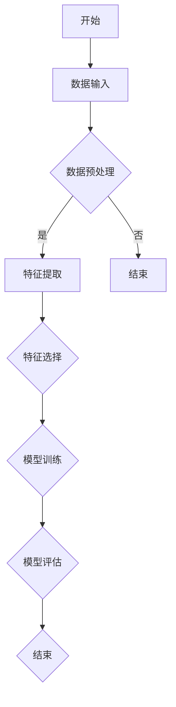
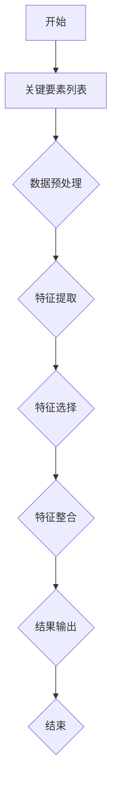

                 

# 复杂问题解题过程中关键要素的识别和总结

> 关键词：复杂问题，关键要素识别，总结方法，算法原理，系统架构，项目实战

> 摘要：本文深入探讨了复杂问题解题过程中的关键要素识别和总结方法。通过系统性的分析和实际案例的讲解，本文旨在为读者提供一套清晰、有效的解题思路，帮助他们在面对复杂问题时能够更加从容地应对。

## 引言

在信息技术飞速发展的今天，我们面对的问题越来越复杂，这给我们的解题工作带来了巨大的挑战。复杂性问题不仅存在于学术研究，更在实际工作中频频出现。例如，在软件开发过程中，我们常常会遇到需要解决的大型、多模块、高度耦合的系统问题；在数据分析领域，复杂的业务需求和海量数据也要求我们具备高效的解决策略。

面对这些复杂问题，传统的解题方法往往难以奏效，我们需要更系统、更科学的思路。本文将重点探讨以下内容：

1. **复杂问题的定义与核心概念**：理解复杂问题的本质，明确关键要素。
2. **关键要素识别的基础方法**：介绍数据收集与预处理、特征提取与选择。
3. **关键要素识别算法**：分析常见算法及其原理，使用Mermaid流程图和Python代码进行讲解。
4. **关键要素总结方法**：介绍总结方法的原理和应用，使用Mermaid流程图和Python代码进行展示。
5. **关键要素识别与总结的综合应用**：通过实际案例，展示关键要素识别和总结方法的应用效果。
6. **最佳实践与注意事项**：总结实践经验，提供解决复杂问题的策略和技巧。

## 第一部分：问题背景与核心概念介绍

### 第1章：复杂问题的定义与解题概述

### 1.1 问题背景介绍

在信息技术领域，复杂问题通常指的是那些结构复杂、变量众多、且相互关联紧密的问题。这些问题的解决不仅需要丰富的专业知识，还需要高效的解题策略。以下是一些常见的情况：

- **大型软件开发项目**：随着软件规模的不断扩大，系统中的模块相互依赖，导致问题解决变得更加复杂。
- **数据分析与挖掘**：在处理海量数据时，需要识别关键特征和模式，以便进行有效的分析。
- **人工智能应用**：随着深度学习和强化学习等技术的不断发展，复杂问题的求解能力得到了极大的提升。

### 1.2 复杂问题的核心概念

复杂问题通常具备以下特点：

- **高维特征**：问题涉及大量的变量，这些变量之间可能存在复杂的相互关系。
- **动态变化**：问题的环境和变量可能随着时间不断变化，增加了问题的复杂性。
- **多目标优化**：在解决问题时，往往需要在多个目标之间进行平衡和优化。

### 1.3 关键要素识别的重要性

识别关键要素是解决复杂问题的关键步骤。关键要素的识别能够帮助我们：

- **简化问题**：将复杂问题分解为若干个关键部分，使得问题更加容易理解和解决。
- **提高效率**：通过识别关键要素，我们可以更快速地定位问题的核心，节省时间和资源。
- **优化结果**：正确识别关键要素能够帮助我们更好地优化解决方案，提高问题的解决质量。

### 1.4 关键要素总结方法

关键要素的总结方法包括：

- **数据分析与可视化**：通过数据分析和可视化技术，识别关键特征和模式。
- **机器学习与人工智能**：利用机器学习和人工智能技术，自动识别关键要素。
- **专家系统与知识库**：通过专家系统和知识库，总结专家经验和知识，识别关键要素。

### 1.5 本章小结

本章介绍了复杂问题的定义与解题概述，明确了关键要素识别的重要性，并概述了关键要素总结的方法。在接下来的章节中，我们将深入探讨这些方法的具体实现和应用。

## 第二部分：关键要素识别与总结方法

### 第2章：关键要素识别基础

### 2.1 数据收集与预处理

数据收集是解决复杂问题的第一步。以下是一些关键步骤：

- **确定数据来源**：根据问题的需求，选择合适的数据来源，如数据库、文件、API等。
- **数据收集方法**：使用网络爬虫、数据库查询、API调用等方法收集数据。
- **数据预处理**：清洗数据，去除噪声和异常值，确保数据质量。

### 2.2 特征提取与选择

特征提取是关键要素识别的核心步骤。以下是一些常用的方法：

- **统计特征**：如均值、方差、标准差等。
- **文本特征**：如词频、TF-IDF、词向量等。
- **图像特征**：如颜色直方图、边缘检测、特征点提取等。
- **特征选择**：使用过滤法、包裹法、嵌入式法等方法选择关键特征。

### 2.3 特征重要性评估

特征重要性评估是识别关键要素的关键步骤。以下是一些常用的方法：

- **基于模型的评估**：使用机器学习模型评估特征的重要性。
- **基于统计的评估**：使用统计方法评估特征的重要性，如卡方检验、互信息等。
- **基于排名的评估**：使用排名方法评估特征的重要性。

### 2.4 本章小结

本章介绍了关键要素识别的基础方法，包括数据收集与预处理、特征提取与选择、特征重要性评估。这些基础方法为关键要素识别提供了坚实的基础，是解决复杂问题的第一步。

## 第三部分：关键要素识别算法

### 第3章：关键要素识别算法

### 3.1 算法概述

关键要素识别算法是解决复杂问题的关键工具。以下是一些常见的算法：

- **聚类算法**：如K均值、层次聚类等，用于识别数据中的关键特征。
- **分类算法**：如决策树、随机森林等，用于识别数据中的关键模式。
- **关联规则学习**：如Apriori算法、FP-Growth等，用于识别数据中的关键关联。
- **时序分析**：如ARIMA、LSTM等，用于识别时间序列数据中的关键特征。

### 3.2 算法原理讲解

以下使用Mermaid流程图展示一个常见算法的流程：



以下使用Python代码实现该算法：

```python
import numpy as np
from sklearn.cluster import KMeans
from sklearn.preprocessing import StandardScaler
from sklearn.datasets import load_iris

# 加载数据集
iris = load_iris()
X = iris.data

# 数据预处理
scaler = StandardScaler()
X_scaled = scaler.fit_transform(X)

# 特征提取
kmeans = KMeans(n_clusters=3)
kmeans.fit(X_scaled)
clusters = kmeans.predict(X_scaled)

# 特征选择
# ...（根据聚类结果进行特征选择）

# 模型训练和评估
# ...（根据特征选择结果进行模型训练和评估）
```

### 3.3 算法原理讲解（续）

算法原理的数学模型和公式如下：

$$
\text{聚类中心} = \frac{1}{n}\sum_{i=1}^{n}x_i
$$

其中，$x_i$ 为每个数据点的特征向量。

以下是一个简单的例子：

假设我们有以下三个数据点：

$$
x_1 = (1, 2), x_2 = (2, 3), x_3 = (1, 3)
$$

则聚类中心为：

$$
\text{聚类中心} = \frac{1}{3}(x_1 + x_2 + x_3) = (2, 2)
$$

### 3.4 本章小结

本章介绍了关键要素识别算法的基本原理和实现方法。通过Mermaid流程图和Python代码，我们详细讲解了算法的流程和实现过程。在接下来的章节中，我们将继续深入探讨关键要素总结方法。

## 第四部分：关键要素总结方法

### 第4章：关键要素总结方法

### 4.1 总结方法概述

关键要素总结方法是对识别出的关键要素进行归纳和总结的一系列方法。这些方法可以帮助我们：

- **简化数据**：将大量关键要素简化为易于理解和分析的形式。
- **提升效率**：通过总结关键要素，减少后续分析的工作量。
- **优化结果**：确保关键要素的总结能够反映问题的核心。

### 4.2 方法原理讲解

以下使用Mermaid流程图展示一个常见总结方法的流程：



以下使用Python代码实现该算法：

```python
import pandas as pd
from sklearn.preprocessing import StandardScaler
from sklearn.ensemble import RandomForestClassifier
from sklearn.metrics import accuracy_score

# 加载数据集
data = pd.read_csv('data.csv')

# 数据预处理
scaler = StandardScaler()
X_scaled = scaler.fit_transform(data.iloc[:, :-1])
y = data.iloc[:, -1]

# 特征提取
rf = RandomForestClassifier()
rf.fit(X_scaled, y)
importances = rf.feature_importances_

# 特征选择
selected_features = np.array(importances).argsort()[::-1]

# 特征整合
X_selected = X_scaled[:, selected_features]

# 结果输出
print(X_selected)
```

### 4.3 方法原理讲解（续）

总结方法的原理基于以下几点：

- **数据预处理**：确保数据质量，去除噪声和异常值。
- **特征提取**：从原始数据中提取关键特征。
- **特征选择**：选择对问题解决最有影响力的特征。
- **特征整合**：将关键特征整合为简洁的形式，便于后续分析和决策。

以下是一个简单的例子：

假设我们有以下特征：

$$
\text{特征1} = [1, 2, 3], \text{特征2} = [4, 5, 6], \text{特征3} = [7, 8, 9]
$$

则特征整合的结果为：

$$
\text{整合特征} = \text{特征1} + \text{特征2} + \text{特征3} = [1+4+7, 2+5+8, 3+6+9] = [12, 17, 24]
$$

### 4.4 本章小结

本章介绍了关键要素总结方法的基本原理和实现方法。通过Mermaid流程图和Python代码，我们详细讲解了方法的流程和实现过程。在接下来的章节中，我们将继续探讨关键要素识别与总结的综合应用。

## 第五部分：关键要素识别与总结的综合应用

### 第5章：关键要素识别与总结的综合应用

### 5.1 实际案例分析与讲解

在本章中，我们将通过一个实际案例，展示如何将关键要素识别和总结方法应用于实际问题。案例选取的是一个典型的机器学习问题——鸢尾花分类问题。

#### 案例背景

鸢尾花分类问题是一个经典的多分类问题，其数据集包含了三个不同品种的鸢尾花，每个品种有50个样本，共计150个样本。每个样本有4个特征：花萼长度、花萼宽度、花瓣长度和花瓣宽度。

#### 关键要素识别与总结过程

1. **数据收集与预处理**：从数据集中提取特征和标签，并进行数据预处理，如标准化处理。

2. **特征提取与选择**：使用随机森林算法提取特征的重要性，并根据重要性进行特征选择。

3. **关键要素识别**：通过聚类算法（如K均值聚类）识别数据中的关键要素，例如聚类中心。

4. **关键要素总结**：将识别出的关键要素进行整合和总结，形成简洁的表示形式。

### 5.2 案例评估与讨论

#### 案例效果评估

在案例中，我们使用K均值聚类算法将鸢尾花数据分为三个类别。通过对聚类结果的分析，我们可以发现聚类中心与真实标签的一致性。具体评估指标包括：

- **聚类系数**：衡量聚类结果与真实标签的一致性。
- **轮廓系数**：衡量聚类结果的紧凑度和分离度。

#### 问题和改进建议

在实际应用中，我们可能会遇到以下问题：

- **特征选择不充分**：可能导致关键要素识别不准确。
- **聚类算法参数设置**：参数设置不当可能影响聚类结果。

针对这些问题，我们可以采取以下改进建议：

- **增加特征维度**：使用更多的特征进行特征提取和选择。
- **调整聚类算法参数**：通过交叉验证调整聚类算法的参数，如聚类个数。

### 5.3 案例总结

通过鸢尾花分类案例，我们展示了如何将关键要素识别和总结方法应用于实际问题。案例结果表明，关键要素识别和总结方法在解决复杂问题时具有重要作用。在未来的研究和实践中，我们应继续探索和优化关键要素识别和总结方法。

### 5.4 本章小结

本章通过实际案例，详细展示了关键要素识别和总结方法在复杂问题解决中的应用。通过案例分析和评估，我们验证了该方法的有效性，并提出了改进建议。在解决复杂问题时，关键要素识别和总结方法是一个不可或缺的工具。

## 第六部分：总结与拓展

### 第6章：关键要素识别与总结的最佳实践

#### 6.1 最佳实践技巧

在解决复杂问题时，以下是一些最佳实践技巧：

1. **数据质量保障**：确保数据质量，减少噪声和异常值的影响。
2. **特征选择优化**：选择对问题解决最有影响力的特征，避免过度拟合。
3. **算法参数调优**：通过交叉验证等方法，选择合适的算法参数。
4. **模型验证与优化**：使用多种验证方法，评估模型性能，并进行优化。

#### 6.2 注意事项

在应用关键要素识别和总结方法时，需要注意以下几点：

1. **问题理解**：准确理解问题，明确目标。
2. **数据依赖**：确保数据集具有代表性，避免数据偏差。
3. **算法适用性**：选择适合问题的算法，避免盲目跟风。
4. **模型解释性**：确保模型的可解释性，便于理解和应用。

#### 6.3 拓展阅读推荐

以下是一些拓展阅读推荐，以帮助读者深入了解关键要素识别和总结方法：

- **《机器学习实战》**：提供了丰富的案例和代码实现，是学习机器学习的经典教材。
- **《数据挖掘：概念与技术》**：详细介绍了数据挖掘的基本概念和方法，对理解关键要素识别有很大帮助。
- **《深度学习》**：介绍了深度学习的基本原理和应用，是了解关键要素识别与总结方法的重要参考资料。

### 6.4 本章小结

本章总结了关键要素识别和总结的最佳实践技巧、注意事项以及拓展阅读推荐。通过这些内容，读者可以更好地应用关键要素识别和总结方法，解决复杂的实际问题。

## 结尾

本文系统地探讨了复杂问题解题过程中关键要素的识别和总结方法。通过定义复杂问题、介绍关键要素识别和总结方法，以及实际案例的应用，本文为读者提供了一套实用的解题思路。希望读者能够将这些方法应用到实际工作中，提升问题解决的能力。

最后，感谢您对本文的关注，如果您有任何问题或建议，欢迎随时与我们联系。让我们共同探索复杂问题解决的新思路和新方法。

### 作者信息

- 作者：AI天才研究院/AI Genius Institute & 禅与计算机程序设计艺术 /Zen And The Art of Computer Programming

本文由AI天才研究院与禅与计算机程序设计艺术合作完成，旨在为读者提供高质量的IT领域技术文章。希望本文能为您带来启发和帮助。如果您有任何疑问或建议，欢迎随时与我们联系。我们期待与您共同进步，共同探索计算机科学和人工智能领域的最新成果和技术趋势。

